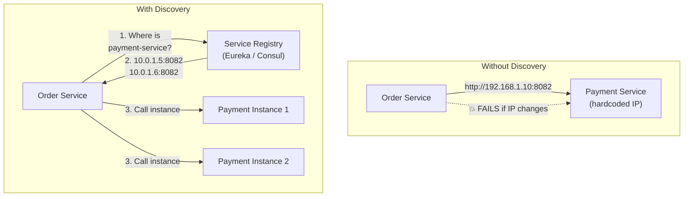
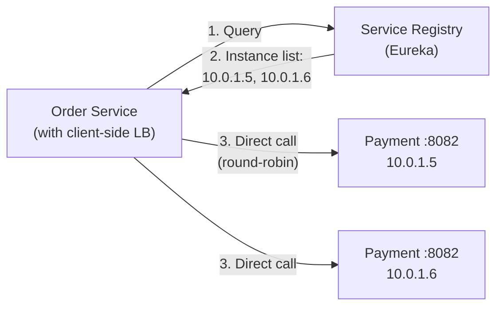
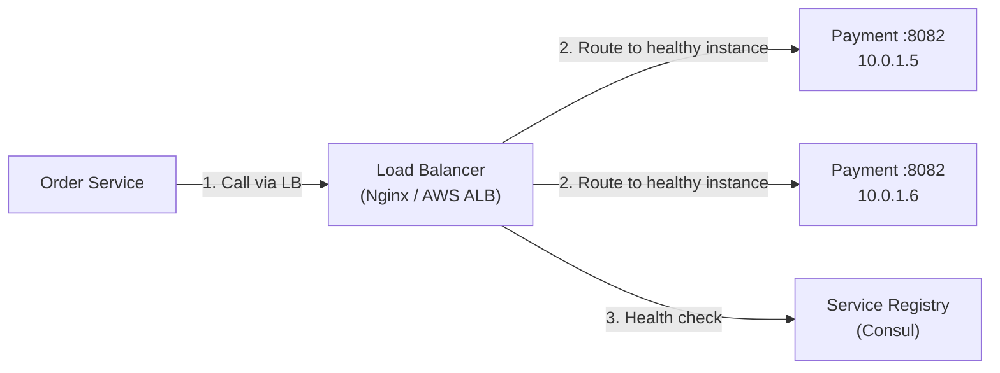
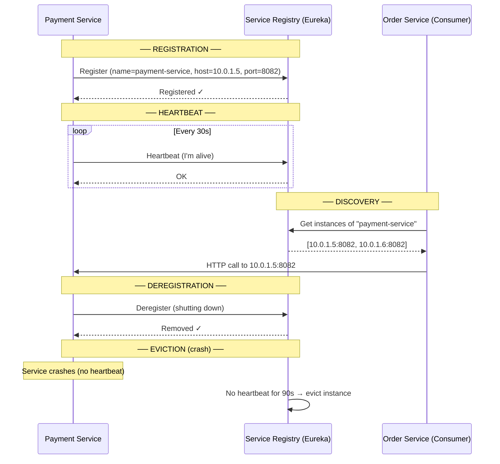
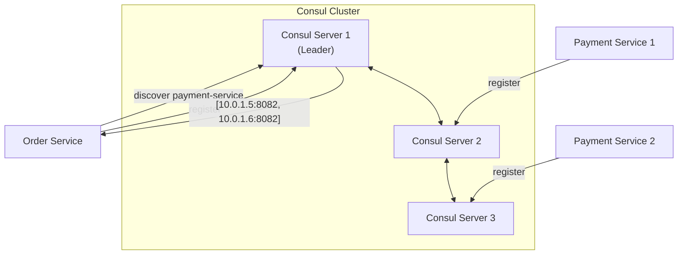
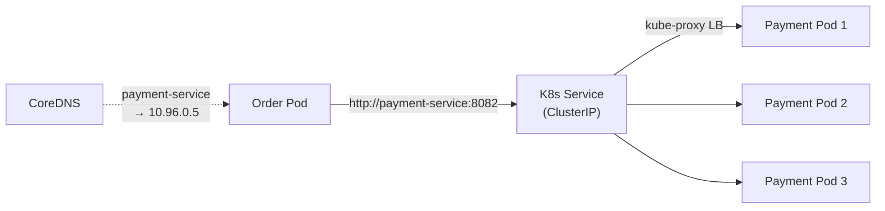

# Service Discovery Pattern — Finding Services in a Dynamic Environment

How microservices locate each other at runtime without hardcoded URLs.
Client-side vs server-side discovery, Eureka, Consul, and Spring Cloud.

---

## 1. The Problem — Why Service Discovery?

```text
MONOLITH:
  Everything is in ONE process. No need to "find" anything.
  OrderService calls PaymentService → just a method call.

MICROSERVICES:
  Services run as SEPARATE processes, on DIFFERENT machines.
  Instances scale UP and DOWN dynamically.
  IPs change when containers restart.

  HARDCODED URLs:
    payment-service: http://192.168.1.10:8082    ← What if this changes?
    order-service:   http://192.168.1.11:8081    ← What if it scales to 3 instances?

  PROBLEMS:
    1. IPs change on restart / redeployment
    2. Instances scale up/down dynamically
    3. Hardcoded URLs = tight coupling
    4. No load balancing across instances
    5. No health checking (calling a dead instance)

  SOLUTION: SERVICE DISCOVERY
    Services REGISTER themselves ("I'm here, I'm healthy")
    Consumers DISCOVER services ("Where is payment-service?")
    Registry tracks all instances + health status
```



---

## 2. Two Approaches — Client-Side vs Server-Side Discovery

### Client-Side Discovery



```text
CLIENT-SIDE DISCOVERY:
  Client queries the registry, gets list of instances.
  Client implements load balancing (round-robin, random, etc.)
  Client calls the chosen instance DIRECTLY.

  IMPLEMENTATION:
    Spring Cloud: Eureka (registry) + Spring Cloud LoadBalancer (client LB)
    Netflix Stack: Eureka + Ribbon (deprecated)

  PROS:
    ✅ No extra hop (client → service directly)
    ✅ Client can implement smart routing (zone-aware, weighted)
    ✅ Lower latency (no proxy in the middle)

  CONS:
    ❌ Client needs discovery library (language-specific)
    ❌ Discovery logic coupled into every service
    ❌ Different languages need different client libraries
```

### Server-Side Discovery



```text
SERVER-SIDE DISCOVERY:
  Client calls a LOAD BALANCER (router/proxy).
  Load balancer queries registry, picks an instance, forwards request.
  Client doesn't know about instances or registry.

  IMPLEMENTATION:
    AWS ALB + ECS (service registration built-in)
    Kubernetes Service + kube-proxy (built-in discovery)
    Consul + Envoy (service mesh)

  PROS:
    ✅ Client is simple (just calls one URL)
    ✅ Language-agnostic (works with any client)
    ✅ Centralized LB logic (easy to update routing)

  CONS:
    ❌ Extra network hop (client → LB → service)
    ❌ LB is potential SPOF (must be HA)
    ❌ Extra infrastructure to manage
```

### Comparison

```text
┌──────────────────────┬─────────────────────┬─────────────────────────┐
│ Aspect               │ Client-Side         │ Server-Side             │
├──────────────────────┼─────────────────────┼─────────────────────────┤
│ Extra hop            │ No                  │ Yes (through LB)        │
│ Client complexity    │ High (needs lib)    │ Low (just HTTP call)    │
│ Language support     │ Per-language SDK     │ Any language            │
│ LB intelligence      │ Client controls     │ Centralized             │
│ Infrastructure       │ Registry only       │ Registry + LB/Proxy     │
│ Latency             │ Lower               │ Slightly higher         │
│ Example             │ Eureka + Spring LB  │ Kubernetes Services     │
│ Best for            │ Spring ecosystem    │ Multi-language, K8s     │
└──────────────────────┴─────────────────────┴─────────────────────────┘
```

---

## 3. Service Registration Flow



```text
REGISTRATION FLOW:

  1. SERVICE STARTS → registers with registry
     (name, host, port, health URL, metadata)

  2. HEARTBEAT → service sends periodic heartbeat
     Default: every 30 seconds (Eureka)
     Registry marks instance as UP

  3. DISCOVERY → consumer queries registry
     Gets list of healthy instances
     Caches locally (resilience if registry is down)

  4. SHUTDOWN → service deregisters gracefully
     Registry removes instance immediately

  5. CRASH → no heartbeat for 90s
     Registry evicts instance after timeout
     Gap: up to 90s of stale data (calling dead instance)
```

---

## 4. Spring Cloud + Eureka Implementation

### Eureka Server

```xml
<!-- pom.xml -->
<dependency>
    <groupId>org.springframework.cloud</groupId>
    <artifactId>spring-cloud-starter-netflix-eureka-server</artifactId>
</dependency>
```

```java
@SpringBootApplication
@EnableEurekaServer
public class EurekaServerApplication {
    public static void main(String[] args) {
        SpringApplication.run(EurekaServerApplication.class, args);
    }
}
```

```yaml
# application.yml (Eureka Server)
server:
  port: 8761

eureka:
  instance:
    hostname: localhost
  client:
    register-with-eureka: false    # don't register itself
    fetch-registry: false          # don't fetch from itself
  server:
    eviction-interval-timer-in-ms: 5000   # check for dead instances every 5s
    enable-self-preservation: false         # disable in dev (enable in prod!)
```

### Service Registration (Eureka Client)

```xml
<dependency>
    <groupId>org.springframework.cloud</groupId>
    <artifactId>spring-cloud-starter-netflix-eureka-client</artifactId>
</dependency>
```

```yaml
# application.yml (Payment Service)
spring:
  application:
    name: payment-service    # ← this is the service name used for discovery

server:
  port: 8082

eureka:
  client:
    service-url:
      defaultZone: http://localhost:8761/eureka/
    registry-fetch-interval-seconds: 5   # refresh local cache every 5s
  instance:
    prefer-ip-address: true              # register IP instead of hostname
    lease-renewal-interval-in-seconds: 10    # heartbeat every 10s
    lease-expiration-duration-in-seconds: 30 # evict after 30s no heartbeat
    instance-id: ${spring.application.name}:${random.value}
    metadata-map:
      version: "2.1.0"
      zone: "us-east-1a"

management:
  endpoints:
    web:
      exposure:
        include: health, info
```

### Service Discovery + Load Balanced Calls

```java
// ── Option 1: WebClient with LoadBalancer ──
@Configuration
public class WebClientConfig {

    @Bean
    @LoadBalanced    // enables service name resolution
    public WebClient.Builder webClientBuilder() {
        return WebClient.builder();
    }
}

@Service
@RequiredArgsConstructor
public class OrderService {

    private final WebClient.Builder webClientBuilder;

    public PaymentResponse processPayment(UUID orderId, BigDecimal amount) {
        return webClientBuilder.build()
            .post()
            .uri("http://payment-service/api/payments")    // service name, NOT IP
            .bodyValue(new PaymentRequest(orderId, amount))
            .retrieve()
            .bodyToMono(PaymentResponse.class)
            .block();
    }
}

// ── Option 2: OpenFeign (declarative client) ──
@FeignClient(
    name = "payment-service",
    fallbackFactory = PaymentClientFallbackFactory.class
)
public interface PaymentClient {

    @PostMapping("/api/payments")
    PaymentResponse processPayment(@RequestBody PaymentRequest request);

    @GetMapping("/api/payments/{paymentId}")
    PaymentResponse getPayment(@PathVariable UUID paymentId);
}

@Component
public class PaymentClientFallbackFactory implements FallbackFactory<PaymentClient> {
    @Override
    public PaymentClient create(Throwable cause) {
        return new PaymentClient() {
            @Override
            public PaymentResponse processPayment(PaymentRequest request) {
                throw new ServiceUnavailableException("Payment service down", cause);
            }

            @Override
            public PaymentResponse getPayment(UUID paymentId) {
                return PaymentResponse.unavailable(paymentId);
            }
        };
    }
}

// ── Option 3: RestTemplate (legacy) ──
@Configuration
public class RestTemplateConfig {
    @Bean
    @LoadBalanced
    public RestTemplate restTemplate() {
        return new RestTemplate();
    }
}

@Service
public class LegacyOrderService {
    @Autowired private RestTemplate restTemplate;

    public PaymentResponse pay(PaymentRequest req) {
        return restTemplate.postForObject(
            "http://payment-service/api/payments", req, PaymentResponse.class);
    }
}
```

---

## 5. Consul as Service Discovery



```yaml
# Spring Cloud Consul configuration
spring:
  application:
    name: order-service
  cloud:
    consul:
      host: localhost
      port: 8500
      discovery:
        service-name: order-service
        health-check-path: /actuator/health
        health-check-interval: 10s
        instance-id: ${spring.application.name}:${random.value}
        prefer-ip-address: true
        tags:
          - version=2.1
          - environment=production
```

```text
EUREKA vs CONSUL:

  ┌────────────────────┬───────────────────┬──────────────────────┐
  │ Feature            │ Eureka            │ Consul               │
  ├────────────────────┼───────────────────┼──────────────────────┤
  │ Consistency        │ AP (available)    │ CP (consistent)      │
  │ Health Check       │ Client heartbeat  │ Server-side check    │
  │ KV Store           │ ❌                │ ✅ Built-in          │
  │ Multi-DC           │ ❌ Limited        │ ✅ Native            │
  │ DNS Interface      │ ❌                │ ✅ DNS + HTTP API    │
  │ ACL                │ ❌                │ ✅ Built-in          │
  │ Service Mesh       │ ❌                │ ✅ Consul Connect    │
  │ Language           │ Java-centric      │ Language-agnostic    │
  │ Best for           │ Spring Cloud apps │ Multi-language, K8s  │
  └────────────────────┴───────────────────┴──────────────────────┘

  CAP THEOREM:
    Eureka = AP → available during network partitions (may serve stale data)
    Consul = CP → consistent (may become unavailable during leader election)
```

---

## 6. Kubernetes Service Discovery

```text
KUBERNETES has BUILT-IN service discovery:

  No Eureka, no Consul needed.
  Every Service object in K8s gets a DNS name.

  Deployment: payment-service (3 replicas)
  Service: payment-service

  DNS: payment-service.default.svc.cluster.local
  Short: payment-service (within same namespace)

  kube-proxy load-balances across pods automatically.
```



```yaml
# Kubernetes Service
apiVersion: v1
kind: Service
metadata:
  name: payment-service
spec:
  selector:
    app: payment-service
  ports:
    - port: 8082
      targetPort: 8082
  type: ClusterIP
---
apiVersion: apps/v1
kind: Deployment
metadata:
  name: payment-service
spec:
  replicas: 3
  selector:
    matchLabels:
      app: payment-service
  template:
    metadata:
      labels:
        app: payment-service
    spec:
      containers:
        - name: payment-service
          image: myregistry/payment-service:2.1
          ports:
            - containerPort: 8082
          readinessProbe:
            httpGet:
              path: /actuator/health
              port: 8082
            initialDelaySeconds: 10
            periodSeconds: 5
```

```text
SPRING BOOT ON K8S — DO YOU NEED EUREKA?

  If deploying on Kubernetes:
    ❌ You do NOT need Eureka or Consul
    ✅ K8s Service + DNS is sufficient
    ✅ Use spring.cloud.kubernetes.discovery for K8s-native discovery
    ✅ Or just use plain HTTP URLs with K8s Service names

  If deploying on VMs / bare metal / Docker Compose:
    ✅ Use Eureka or Consul
    They fill the role that K8s Services provide natively
```

---

## 7. Health Checking & Graceful Shutdown

```java
// ── Custom health indicator ──
@Component
public class PaymentGatewayHealthIndicator implements HealthIndicator {

    private final PaymentGateway gateway;

    @Override
    public Health health() {
        try {
            boolean reachable = gateway.ping();
            if (reachable) {
                return Health.up()
                    .withDetail("gateway", "reachable")
                    .withDetail("latency", gateway.getLatencyMs() + "ms")
                    .build();
            }
            return Health.down()
                .withDetail("gateway", "unreachable")
                .build();
        } catch (Exception e) {
            return Health.down(e).build();
        }
    }
}

// ── Graceful shutdown (deregister before stopping) ──
// application.yml
// server:
//   shutdown: graceful
// spring:
//   lifecycle:
//     timeout-per-shutdown-phase: 30s

@Component
@Slf4j
public class GracefulShutdown implements DisposableBean {

    @Autowired
    private EurekaClient eurekaClient;

    @Override
    public void destroy() {
        log.info("Shutting down — deregistering from Eureka");
        eurekaClient.shutdown();
        // Wait for in-flight requests to complete
        try { Thread.sleep(5000); } catch (InterruptedException ignored) {}
        log.info("Deregistered. Safe to stop.");
    }
}
```

---

## 8. Interview Questions

### Q1: What is service discovery and why do we need it?

```text
  Service discovery = mechanism for services to find each other at runtime.

  NEEDED BECAUSE:
    - Microservice instances have dynamic IPs (containers, auto-scaling)
    - Multiple instances of same service (load balancing)
    - Instances come and go (deployments, scaling, crashes)
    - Hardcoded URLs don't work in dynamic environments
```

### Q2: Client-side vs server-side discovery?

```text
  CLIENT-SIDE (Eureka + Spring Cloud LB):
    Client queries registry, gets instance list, load-balances itself.
    + No extra hop, lower latency
    - Client needs discovery library

  SERVER-SIDE (K8s Service, AWS ALB):
    Client calls a proxy/LB, which routes to an instance.
    + Client is simple (just HTTP), language-agnostic
    - Extra network hop

  In K8s: server-side is built-in (use it).
  In Spring Cloud (non-K8s): client-side with Eureka is standard.
```

### Q3: What happens when the service registry goes down?

```text
  EUREKA (AP system):
    - Clients CACHE the registry locally
    - If Eureka is down → clients use cached instance list
    - Stale but available (AP from CAP theorem)
    - Self-preservation mode: Eureka stops evicting instances
      if >15% of instances miss heartbeats (assumes network issue)

  CONSUL (CP system):
    - If leader election fails → registry is temporarily UNAVAILABLE
    - Consistent but may not be available during partition
    - Clients with cached data can still function

  BEST PRACTICE:
    - Run registry as HA cluster (3+ nodes)
    - Clients cache registry locally
    - Use circuit breakers for service calls (handle missing instances)
```

### Q4: How does Eureka self-preservation work?

```text
  PROBLEM: Network partition between Eureka and services.
    Services are healthy but heartbeats can't reach Eureka.
    Eureka would evict ALL instances → registry becomes empty!

  SOLUTION: Self-preservation mode.
    If >15% of instances stop sending heartbeats simultaneously:
    Eureka assumes NETWORK ISSUE, not mass failure.
    Stops evicting instances. Keeps stale data.
    Better to route to a possibly-dead instance than to NO instance.

  IN DEV: Disable it (eureka.server.enable-self-preservation: false)
  IN PROD: Keep it enabled (default) — prevents catastrophic eviction
```

### Q5: Do you need Eureka if deploying on Kubernetes?

```text
  NO. Kubernetes provides built-in service discovery.
    - K8s Service → DNS name → load-balanced across pods
    - CoreDNS resolves service names
    - kube-proxy handles load balancing
    - Readiness probes handle health checking

  Using Eureka on K8s is REDUNDANT and adds unnecessary complexity.

  Use spring-cloud-kubernetes if you want Spring Cloud features
  (like @LoadBalanced, Feign) with K8s-native discovery.
```
