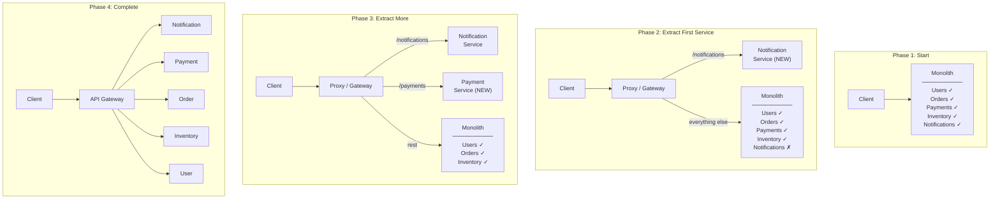
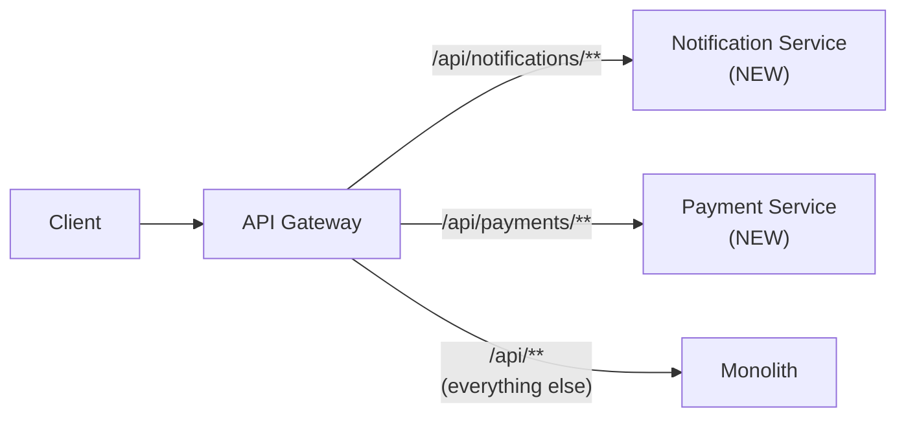
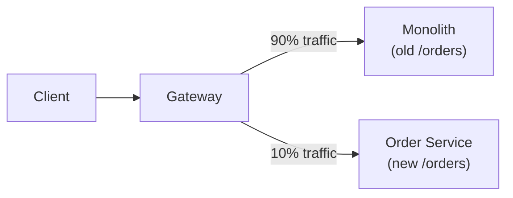
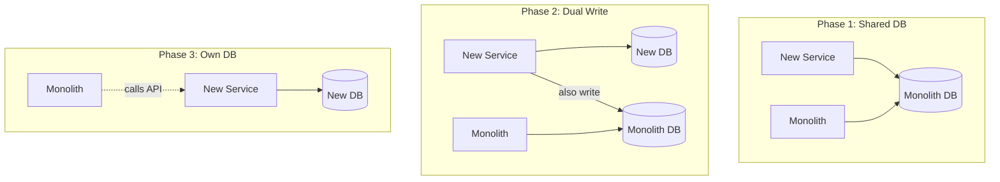
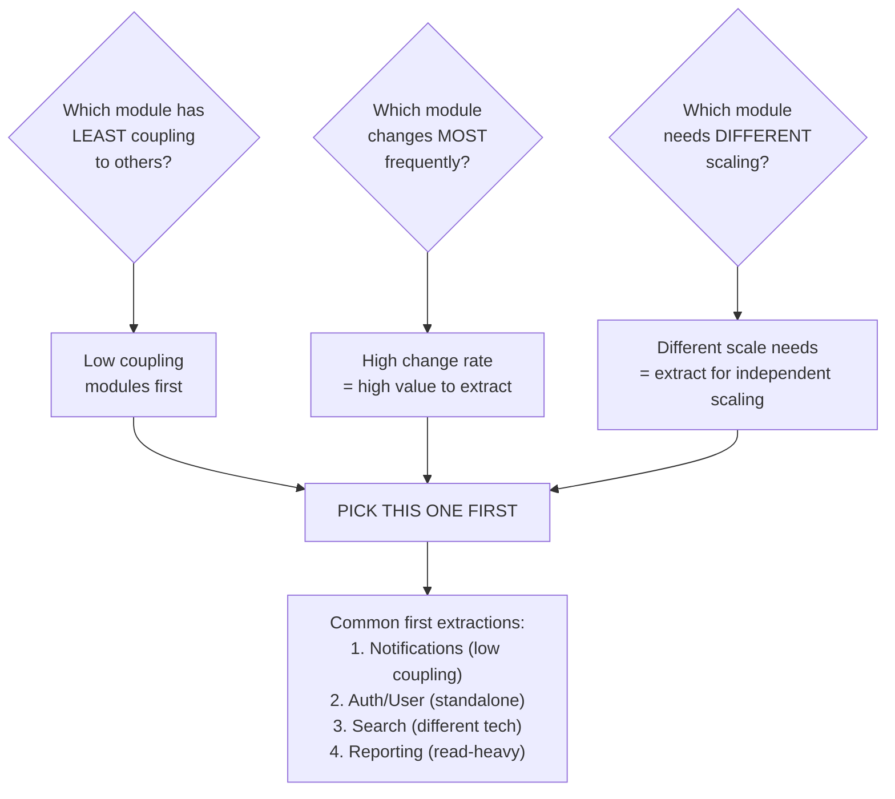
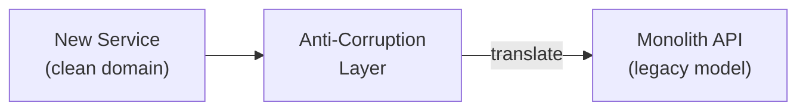
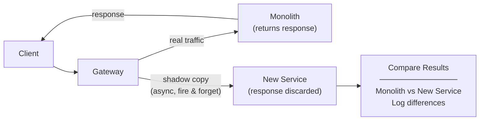

# Strangler Fig Pattern — Incremental Monolith to Microservices Migration

Gradually replacing a monolith by routing specific features to new
microservices while keeping the old system running. Zero big-bang risk.

---

## 1. The Problem — Monolith to Microservices

```text
THE BIG-BANG REWRITE TRAP:
  "Let's rewrite the entire monolith as microservices!"

  Timeline:
    Month 1-3:   Team is excited, writing new services
    Month 4-6:   Monolith keeps getting features (business can't wait)
    Month 7-12:  New system is STILL not feature-complete
    Month 12-18: New system has different bugs, old system diverged
    Month 18+:   Project cancelled. Back to monolith. Morale crushed.

  WHY BIG-BANG FAILS:
    1. You must replicate ALL features before switching
    2. Business adds features to monolith during rewrite
    3. Two systems to maintain simultaneously
    4. No value delivered until the ENTIRE rewrite is done
    5. Risk is ALL at the end (one massive cutover)

STRANGLER FIG PATTERN:
  Named after strangler fig trees that grow around a host tree,
  eventually replacing it entirely.

  Incrementally extract features from the monolith into microservices.
  Route traffic feature-by-feature to new services.
  Monolith shrinks gradually until it can be decommissioned.
```

---

## 2. How It Works



```text
STRANGLER FIG STEPS:

  1. IDENTIFY — pick a feature to extract (start with least coupled)
  2. BUILD — create the new microservice
  3. PROXY — put a routing layer (proxy/gateway) in front of monolith
  4. ROUTE — route that feature's traffic to the new service
  5. VERIFY — test, monitor, compare results
  6. REMOVE — delete the old code from the monolith
  7. REPEAT — extract the next feature

  THE PROXY IS KEY:
    Clients never change their URLs.
    The proxy decides: old monolith or new service?
    This enables gradual, risk-free migration.
```

---

## 3. Routing Strategies

### Strategy 1: Path-Based Routing



```yaml
# Spring Cloud Gateway config
spring:
  cloud:
    gateway:
      routes:
        # Extracted services (NEW)
        - id: notification-service
          uri: http://notification-service:8085
          predicates:
            - Path=/api/notifications/**

        - id: payment-service
          uri: http://payment-service:8082
          predicates:
            - Path=/api/payments/**

        # Fallback: everything else → monolith
        - id: monolith-fallback
          uri: http://monolith:8080
          predicates:
            - Path=/api/**
          order: 9999    # lowest priority
```

### Strategy 2: Feature Flag Routing

```java
@Component
@RequiredArgsConstructor
public class StranglerRoutingFilter implements GlobalFilter, Ordered {

    private final FeatureFlagService featureFlags;

    @Override
    public Mono<Void> filter(ServerWebExchange exchange, GatewayFilterChain chain) {
        String path = exchange.getRequest().getURI().getPath();

        if (path.startsWith("/api/orders")) {
            // Feature flag controls routing
            if (featureFlags.isEnabled("use-new-order-service")) {
                return routeTo(exchange, chain, "http://order-service:8081");
            } else {
                return routeTo(exchange, chain, "http://monolith:8080");
            }
        }

        return chain.filter(exchange);
    }

    private Mono<Void> routeTo(ServerWebExchange exchange,
                                GatewayFilterChain chain, String uri) {
        ServerHttpRequest modified = exchange.getRequest().mutate()
            .uri(URI.create(uri + exchange.getRequest().getURI().getPath()))
            .build();
        return chain.filter(exchange.mutate().request(modified).build());
    }

    @Override
    public int getOrder() { return 0; }
}
```

### Strategy 3: Canary / Percentage-Based Routing



```java
@Component
public class CanaryRoutingFilter implements GlobalFilter, Ordered {

    private final Random random = new Random();

    @Override
    public Mono<Void> filter(ServerWebExchange exchange, GatewayFilterChain chain) {
        String path = exchange.getRequest().getURI().getPath();

        if (path.startsWith("/api/orders")) {
            // 10% to new service, 90% to monolith
            String target = random.nextInt(100) < 10
                ? "http://order-service:8081"
                : "http://monolith:8080";

            ServerHttpRequest modified = exchange.getRequest().mutate()
                .uri(URI.create(target + path))
                .header("X-Routing-Target", target)
                .build();
            return chain.filter(exchange.mutate().request(modified).build());
        }

        return chain.filter(exchange);
    }

    @Override
    public int getOrder() { return 0; }
}
```

---

## 4. Data Migration Strategy



```text
DATA MIGRATION APPROACHES:

  APPROACH 1: Shared Database (temporary)
    New service reads/writes the SAME DB as monolith.
    Quick to implement. No data sync needed.
    ❌ Still coupled at the data layer. Use as STEPPING STONE only.

  APPROACH 2: Database View / Read Replica
    New service reads from a VIEW or replica of monolith DB.
    Writes go through monolith API.
    ✅ Read decoupling without data migration.

  APPROACH 3: Change Data Capture (CDC)
    Debezium captures changes from monolith DB → Kafka → new service DB.
    Real-time sync without changing monolith code.
    ✅ Non-invasive. ❌ Eventual consistency.

  APPROACH 4: Dual Write (transition period)
    New service writes to BOTH old and new DB.
    Verify data consistency. Then cut over to new DB only.
    ❌ Risk of inconsistency. Use only as short transition.

  APPROACH 5: Event-Driven Sync
    Monolith publishes events → new service consumes → builds own data.
    ✅ Clean decoupling. ❌ Requires monolith changes.

  RECOMMENDED ORDER:
    1. Start with shared DB (quick win)
    2. Move to CDC for data sync
    3. Eventually: own DB + events
```

---

## 5. What to Extract First?



```text
EXTRACTION PRIORITY MATRIX:

  ┌──────────────────┬───────────┬────────────┬───────────┬──────────┐
  │ Module           │ Coupling  │ Change Freq│ Scale Need│ Priority │
  ├──────────────────┼───────────┼────────────┼───────────┼──────────┤
  │ Notifications    │ Low       │ Medium     │ High      │ ★★★★★   │
  │ Search           │ Low       │ Low        │ High      │ ★★★★    │
  │ Auth / Users     │ Medium    │ Low        │ Medium    │ ★★★★    │
  │ Reporting        │ Low       │ High       │ High      │ ★★★★    │
  │ Payments         │ Medium    │ Medium     │ Medium    │ ★★★     │
  │ Orders           │ High      │ High       │ High      │ ★★      │
  │ Core Domain      │ Very High │ Very High  │ High      │ ★       │
  └──────────────────┴───────────┴────────────┴───────────┴──────────┘

  RULE: Extract loosely-coupled, independently-scalable modules FIRST.
        Leave the tightly-coupled core for LAST (or never).
```

---

## 6. Anti-Corruption Layer



```java
// The new service has a clean domain model.
// The monolith has a messy legacy model.
// ACL translates between the two.

@Service
@RequiredArgsConstructor
public class MonolithAntiCorruptionLayer {

    private final MonolithClient monolithClient;

    // Translate from monolith's messy model to clean domain model
    public Customer getCustomer(UUID customerId) {
        // Monolith returns a flat DTO with mixed concerns
        MonolithUserDto legacy = monolithClient.getUser(customerId);

        // Translate to clean domain model
        return Customer.builder()
            .id(UUID.fromString(legacy.getUserId()))
            .name(new FullName(legacy.getFirstName(), legacy.getLastName()))
            .email(new Email(legacy.getEmailAddr()))
            .status(mapStatus(legacy.getStatusCode()))  // "A" → ACTIVE
            .address(new Address(
                legacy.getAddr1(), legacy.getAddr2(),
                legacy.getCityName(), legacy.getStateCd(), legacy.getZipCode()))
            .build();
    }

    private CustomerStatus mapStatus(String legacyCode) {
        return switch (legacyCode) {
            case "A" -> CustomerStatus.ACTIVE;
            case "I" -> CustomerStatus.INACTIVE;
            case "S" -> CustomerStatus.SUSPENDED;
            default -> CustomerStatus.UNKNOWN;
        };
    }
}
```

```text
ANTI-CORRUPTION LAYER (ACL):
  Prevents legacy monolith concepts from leaking into new services.

  WITHOUT ACL:
    New service uses monolith's field names, data formats, enums.
    "statusCode = A" leaks into the new service's domain.
    New service is COUPLED to monolith's data model.

  WITH ACL:
    Translation layer between old and new models.
    New service has its own clean domain model.
    If monolith changes, only ACL changes — not the new service.
```

---

## 7. Verification — Shadow Testing



```java
@Component
@RequiredArgsConstructor
@Slf4j
public class ShadowTestFilter implements GlobalFilter, Ordered {

    private final WebClient webClient;
    private final MeterRegistry meterRegistry;

    @Override
    public Mono<Void> filter(ServerWebExchange exchange, GatewayFilterChain chain) {
        String path = exchange.getRequest().getURI().getPath();

        // Shadow test: send copy to new service, compare results
        if (path.startsWith("/api/orders") && isShadowEnabled()) {
            // Fire-and-forget to new service (don't block the real request)
            webClient.method(exchange.getRequest().getMethod())
                .uri("http://new-order-service:8081" + path)
                .headers(h -> h.addAll(exchange.getRequest().getHeaders()))
                .exchangeToMono(response -> {
                    // Log differences for analysis
                    log.info("Shadow test [{}]: new service returned {}",
                        path, response.statusCode());
                    meterRegistry.counter("shadow.test",
                        "path", path,
                        "status", response.statusCode().toString()).increment();
                    return Mono.empty();
                })
                .subscribe();  // fire-and-forget
        }

        return chain.filter(exchange);  // real traffic goes to monolith
    }

    @Override
    public int getOrder() { return -50; }
}
```

---

## 8. Interview Questions

### Q1: What is the Strangler Fig pattern?

```text
  Incrementally migrate from a monolith to microservices by:
  1. Adding a proxy/gateway in front of the monolith
  2. Extracting one feature at a time into a new service
  3. Routing that feature's traffic to the new service
  4. Removing old code from the monolith
  5. Repeating until the monolith is empty

  Named after the strangler fig tree that grows around a host tree
  and gradually replaces it.

  KEY BENEFIT: No big-bang rewrite. Incremental, low-risk migration.
```

### Q2: What should you extract from the monolith first?

```text
  1. LEAST COUPLED module (fewest dependencies on other modules)
  2. INDEPENDENTLY SCALABLE module (different scale needs)
  3. DIFFERENT TECHNOLOGY needs (e.g., search → Elasticsearch)
  4. HIGHEST CHANGE FREQUENCY (most deployments → most value)

  Common first extractions:
    - Notifications (fire-and-forget, low coupling)
    - Search/Reporting (different DB tech needed)
    - Authentication (reusable across services)

  AVOID extracting tightly-coupled core domain first.
```

### Q3: How do you handle the database during strangler migration?

```text
  PHASE 1: Shared DB (both monolith and new service use same DB)
    Quick start, but still data-coupled.

  PHASE 2: CDC/Sync (Debezium captures monolith DB changes → new DB)
    Dual data stores, eventually consistent.

  PHASE 3: Own DB (new service owns its data, API calls for shared data)
    True decoupling. Monolith calls new service's API.

  NEVER stay on shared DB long-term — it couples the services.
```

### Q4: How do you ensure the new service behaves the same as the monolith?

```text
  1. CONTRACT TESTS: same inputs → same outputs
  2. SHADOW TESTING: send real traffic to both, compare responses
  3. CANARY ROUTING: send 5% traffic to new service, monitor errors
  4. FEATURE FLAGS: toggle between old and new at runtime
  5. MONITORING: compare latency, error rates, business metrics

  GRADUAL ROLLOUT:
    0% → shadow test (compare only)
    5% → canary (real traffic, monitor)
    25% → wider rollout
    100% → full migration
    Remove monolith code
```
