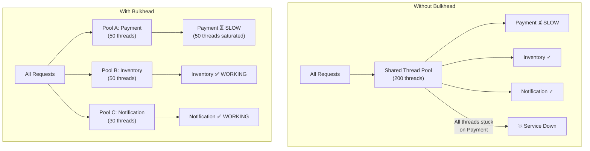
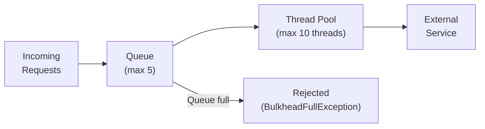
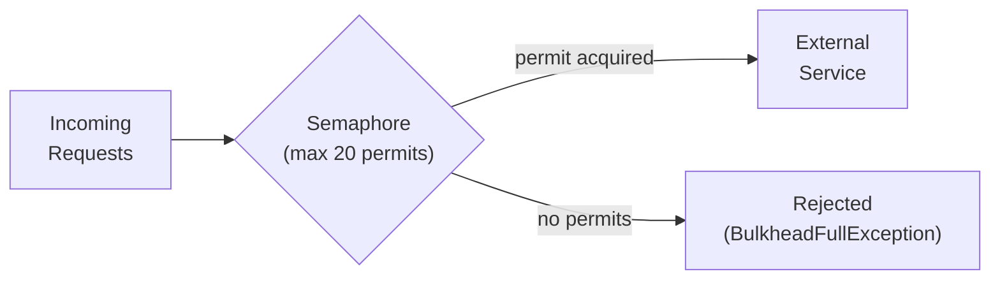
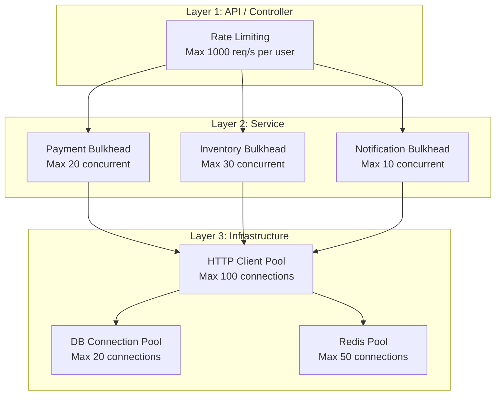
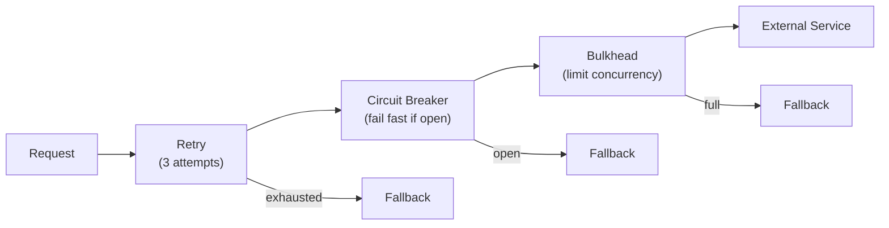

# Bulkhead Pattern — Failure Isolation in Microservices

Isolating components so a failure in one doesn't cascade to others.
Thread pool isolation, semaphore isolation, and Resilience4j in Spring Boot.

---

## 1. The Problem — Cascading Failures

```text
WITHOUT BULKHEAD:

  Order Service has ONE shared thread pool (200 threads).
  Calls: Payment Service, Inventory Service, Notification Service.

  SCENARIO: Payment Service becomes SLOW (5s per request).

  Thread 1:  → Payment (waiting 5s...)
  Thread 2:  → Payment (waiting 5s...)
  Thread 3:  → Payment (waiting 5s...)
  ...
  Thread 200: → Payment (waiting 5s...)

  ALL 200 threads are stuck waiting for Payment.
  Inventory calls? NO THREADS AVAILABLE.
  Notification calls? NO THREADS AVAILABLE.
  Even health checks? NO THREADS.

  RESULT: One slow dependency → ENTIRE service is down.
          This is a CASCADING FAILURE.

WITH BULKHEAD:

  Order Service isolates dependencies:
    Payment calls:      max 50 threads (bulkhead A)
    Inventory calls:    max 50 threads (bulkhead B)
    Notification calls: max 30 threads (bulkhead C)
    General requests:   remaining 70 threads

  Payment Service is slow → 50 threads saturated.
  Inventory calls? STILL WORKING (own pool of 50).
  Notification calls? STILL WORKING (own pool of 30).

  RESULT: Failure is CONTAINED. Other functions keep working.
```



---

## 2. The Ship Analogy

```text
BULKHEAD = watertight compartments in a ship.

  ┌──────────────────────────────────────────────────────┐
  │                    SHIP (SERVICE)                      │
  │                                                        │
  │  ┌──────────┐ ┌──────────┐ ┌──────────┐ ┌──────────┐ │
  │  │Compartment│ │Compartment│ │Compartment│ │Compartment│ │
  │  │    A      │ │    B      │ │    C      │ │    D      │ │
  │  │ (Payment) │ │(Inventory)│ │ (Notif.)  │ │ (General) │ │
  │  │          │ │          │ │          │ │          │ │
  │  │  🌊 FLOOD │ │  ✅ DRY   │ │  ✅ DRY   │ │  ✅ DRY   │ │
  │  │          │ │          │ │          │ │          │ │
  │  └──────────┘ └──────────┘ └──────────┘ └──────────┘ │
  │                                                        │
  │  Compartment A is flooded, but B, C, D are SAFE.      │
  │  Ship (service) stays afloat.                          │
  └──────────────────────────────────────────────────────┘

  In software:
    Compartment = isolated thread pool or semaphore
    Flood = slow/failing dependency saturating resources
    Bulkhead wall = resource limit that prevents leaking
```

---

## 3. Two Types of Bulkheads

```text
┌──────────────────────┬───────────────────────┬────────────────────────┐
│ Aspect               │ Thread Pool Bulkhead  │ Semaphore Bulkhead     │
├──────────────────────┼───────────────────────┼────────────────────────┤
│ Isolation            │ Separate thread pool  │ Counter (permit-based) │
│ Resource overhead    │ Higher (thread stack)  │ Lower (just a counter)│
│ Queuing              │ ✅ Has a queue         │ ❌ No queue            │
│ Timeout support      │ ✅ Thread can timeout  │ ❌ Must use separately │
│ Async support        │ ✅ Different thread    │ ❌ Same thread         │
│ Context propagation  │ ❌ Needs ThreadLocal   │ ✅ Same thread         │
│ Use case             │ Blocking I/O calls    │ Non-blocking / reactive│
│ Performance impact   │ Higher (ctx switch)   │ Lower                  │
├──────────────────────┼───────────────────────┼────────────────────────┤
│ Best for             │ Servlet (blocking)    │ WebFlux (reactive)     │
└──────────────────────┴───────────────────────┴────────────────────────┘
```

### Thread Pool Bulkhead



### Semaphore Bulkhead



---

## 4. Resilience4j Bulkhead — Spring Boot Implementation

### Dependencies

```xml
<dependency>
    <groupId>io.github.resilience4j</groupId>
    <artifactId>resilience4j-spring-boot3</artifactId>
</dependency>
<dependency>
    <groupId>org.springframework.boot</groupId>
    <artifactId>spring-boot-starter-aop</artifactId>
</dependency>
```

### Configuration

```yaml
resilience4j:
  bulkhead:
    instances:
      paymentService:
        maxConcurrentCalls: 20          # max 20 concurrent calls
        maxWaitDuration: 500ms          # wait 500ms for permit, then reject
      inventoryService:
        maxConcurrentCalls: 30
        maxWaitDuration: 200ms
      notificationService:
        maxConcurrentCalls: 10
        maxWaitDuration: 0ms            # reject immediately if full

  thread-pool-bulkhead:
    instances:
      paymentServiceTP:
        maxThreadPoolSize: 10           # max 10 threads
        coreThreadPoolSize: 5           # keep 5 threads alive
        queueCapacity: 20              # queue up to 20 requests
        keepAliveDuration: 60s
      inventoryServiceTP:
        maxThreadPoolSize: 8
        coreThreadPoolSize: 4
        queueCapacity: 10
```

### Annotation-Based Usage

```java
@Service
@RequiredArgsConstructor
@Slf4j
public class OrderService {

    private final PaymentClient paymentClient;
    private final InventoryClient inventoryClient;
    private final NotificationClient notificationClient;

    // ── Semaphore Bulkhead (default) ──
    @Bulkhead(name = "paymentService", fallbackMethod = "paymentFallback")
    public PaymentResponse processPayment(UUID orderId, BigDecimal amount) {
        return paymentClient.charge(orderId, amount);
    }

    private PaymentResponse paymentFallback(UUID orderId, BigDecimal amount,
                                             BulkheadFullException e) {
        log.warn("Payment bulkhead full for order {}", orderId);
        throw new ServiceOverloadedException(
            "Payment service is at capacity. Please retry.", e);
    }

    // ── Thread Pool Bulkhead (async) ──
    @Bulkhead(name = "inventoryServiceTP",
              type = Bulkhead.Type.THREADPOOL,
              fallbackMethod = "inventoryFallback")
    public CompletionStage<StockResponse> checkStock(UUID productId) {
        return CompletableFuture.completedFuture(
            inventoryClient.checkAvailability(productId));
    }

    private CompletionStage<StockResponse> inventoryFallback(UUID productId,
                                                              BulkheadFullException e) {
        log.warn("Inventory bulkhead full for product {}", productId);
        return CompletableFuture.completedFuture(StockResponse.unknown(productId));
    }

    // ── Bulkhead + Circuit Breaker (combined) ──
    @Bulkhead(name = "notificationService")
    @CircuitBreaker(name = "notificationService",
                    fallbackMethod = "notificationFallback")
    @Retry(name = "notificationService")
    public void sendNotification(UUID orderId, String message) {
        notificationClient.send(orderId, message);
    }

    private void notificationFallback(UUID orderId, String message, Exception e) {
        log.warn("Notification failed for order {} — queuing for later", orderId);
        // Queue for retry later (don't fail the order for a notification issue)
    }
}
```

### Programmatic Usage

```java
@Service
@RequiredArgsConstructor
public class ProgrammaticBulkheadExample {

    private final BulkheadRegistry bulkheadRegistry;

    public PaymentResponse processWithBulkhead(PaymentRequest req) {
        Bulkhead bulkhead = bulkheadRegistry.bulkhead("paymentService");

        return Bulkhead.decorateSupplier(bulkhead, () -> {
            // This runs inside the bulkhead
            return paymentClient.charge(req);
        }).get();
    }

    // With metrics
    @PostConstruct
    public void monitorBulkheads() {
        Bulkhead bulkhead = bulkheadRegistry.bulkhead("paymentService");

        bulkhead.getEventPublisher()
            .onCallPermitted(event ->
                log.debug("Bulkhead {} permitted", event.getBulkheadName()))
            .onCallRejected(event ->
                log.warn("Bulkhead {} REJECTED call", event.getBulkheadName()))
            .onCallFinished(event ->
                log.debug("Bulkhead {} call finished", event.getBulkheadName()));
    }
}
```

---

## 5. Bulkhead at Different Layers



```text
BULKHEAD AT EVERY LAYER:

  1. API LAYER: Rate limiting per client (API Gateway)
  2. SERVICE LAYER: Resilience4j bulkhead per dependency
  3. THREAD POOL: Bounded executor per work type
  4. HTTP CLIENT: Connection pool limits per target host
  5. DATABASE: HikariCP connection pool (maxPoolSize)
  6. REDIS: Lettuce connection pool
  7. KAFKA: Consumer thread pool (concurrency)

  EACH LAYER isolates its resources from neighbors.
```

### HTTP Client Connection Pool (Per-Host Bulkhead)

```java
@Configuration
public class WebClientConfig {

    @Bean
    public WebClient paymentWebClient() {
        // Dedicated connection pool for payment service
        ConnectionProvider provider = ConnectionProvider.builder("payment-pool")
            .maxConnections(20)               // max 20 connections
            .pendingAcquireMaxCount(50)       // max 50 waiting
            .pendingAcquireTimeout(Duration.ofSeconds(5))
            .maxIdleTime(Duration.ofSeconds(30))
            .build();

        HttpClient httpClient = HttpClient.create(provider)
            .responseTimeout(Duration.ofSeconds(5));

        return WebClient.builder()
            .baseUrl("http://payment-service:8082")
            .clientConnector(new ReactorClientHttpConnector(httpClient))
            .build();
    }

    @Bean
    public WebClient inventoryWebClient() {
        // Separate connection pool for inventory service
        ConnectionProvider provider = ConnectionProvider.builder("inventory-pool")
            .maxConnections(30)
            .pendingAcquireTimeout(Duration.ofSeconds(3))
            .build();

        HttpClient httpClient = HttpClient.create(provider)
            .responseTimeout(Duration.ofSeconds(3));

        return WebClient.builder()
            .baseUrl("http://inventory-service:8084")
            .clientConnector(new ReactorClientHttpConnector(httpClient))
            .build();
    }
}
```

---

## 6. Bulkhead + Circuit Breaker + Retry (Combined)



```text
RESILIENCE4J EXECUTION ORDER:
  Retry → CircuitBreaker → Bulkhead → TimeLimiter → [actual call]

  1. RETRY wraps everything — retries on failure
  2. CIRCUIT BREAKER checks if circuit is open — fail fast
  3. BULKHEAD checks if capacity available — reject if full
  4. TIME LIMITER enforces timeout — cancel if too slow
  5. ACTUAL CALL to external service
```

```yaml
resilience4j:
  retry:
    instances:
      paymentService:
        maxAttempts: 3
        waitDuration: 1s
        retryExceptions:
          - java.io.IOException
          - java.net.SocketTimeoutException
  circuitbreaker:
    instances:
      paymentService:
        slidingWindowSize: 10
        failureRateThreshold: 50
        waitDurationInOpenState: 10s
        permittedNumberOfCallsInHalfOpenState: 3
  bulkhead:
    instances:
      paymentService:
        maxConcurrentCalls: 20
        maxWaitDuration: 500ms
  timelimiter:
    instances:
      paymentService:
        timeoutDuration: 5s
```

---

## 7. Monitoring Bulkheads

```java
@Configuration
public class BulkheadMetricsConfig {

    @Bean
    public MeterRegistryCustomizer<MeterRegistry> bulkheadMetrics(
            BulkheadRegistry bulkheadRegistry) {
        return registry -> {
            bulkheadRegistry.getAllBulkheads().forEach(bulkhead -> {
                Gauge.builder("bulkhead.available.concurrent.calls",
                        bulkhead, b -> b.getMetrics().getAvailableConcurrentCalls())
                    .tag("name", bulkhead.getName())
                    .register(registry);

                Gauge.builder("bulkhead.max.allowed.concurrent.calls",
                        bulkhead, b -> b.getMetrics().getMaxAllowedConcurrentCalls())
                    .tag("name", bulkhead.getName())
                    .register(registry);
            });
        };
    }
}
```

```text
KEY METRICS TO MONITOR:

  bulkhead.available.concurrent.calls   — how many slots are free
  bulkhead.max.allowed.concurrent.calls — total capacity
  resilience4j_bulkhead_calls_total{kind="permitted"}  — successful acquisitions
  resilience4j_bulkhead_calls_total{kind="rejected"}   — rejected calls

  ALERTS:
    ⚠️ available < 20% of max → approaching saturation
    🔴 rejected > 0 sustained → dependency is struggling
    🔴 rejected rate increasing → dependency degrading
```

---

## 8. Interview Questions

### Q1: What is the Bulkhead pattern?

```text
  Bulkhead isolates components so failure in one doesn't cascade to others.

  Like watertight compartments in a ship — if one compartment floods,
  others stay dry and the ship stays afloat.

  In software: limit concurrent calls to each dependency.
  Payment bulkhead: max 20 concurrent.
  If payment is slow → only 20 threads affected.
  Other features keep working.
```

### Q2: Semaphore vs Thread Pool bulkhead?

```text
  SEMAPHORE:
    Just a counter — limits concurrent access on SAME thread.
    Lower overhead. No thread context switch.
    Best for: reactive/non-blocking (WebFlux).

  THREAD POOL:
    Separate thread pool per dependency.
    Higher overhead (thread creation, context switch).
    Has a queue. Supports timeout on the thread.
    Best for: blocking I/O (Servlet/MVC).
```

### Q3: How do you size a bulkhead?

```text
  FORMULA:
    maxConcurrentCalls = expectedRPS × avgLatencySeconds × safetyFactor

    Example:
      Payment: 100 RPS, 200ms avg latency
      100 × 0.2 = 20 concurrent calls
      With 2x safety: 40 concurrent calls

  TIPS:
    - Start conservative, increase based on monitoring
    - Set maxWaitDuration to avoid thread starvation (500ms typical)
    - Monitor rejected calls — zero is ideal
    - Different bulkhead size per dependency criticality
```

### Q4: How does bulkhead relate to circuit breaker?

```text
  BULKHEAD = limits HOW MANY concurrent calls (resource isolation)
  CIRCUIT BREAKER = stops calls when failure rate is HIGH (fail fast)

  They complement each other:
    Bulkhead: "max 20 concurrent calls to payment"
    Circuit breaker: "if 50% fail, stop calling payment for 10s"

  USE BOTH:
    Bulkhead prevents thread exhaustion during slowness.
    Circuit breaker prevents repeated calls during failure.
    Together: resilient service that handles both slow and failed deps.

  ORDER: Retry → CircuitBreaker → Bulkhead → actual call
```
