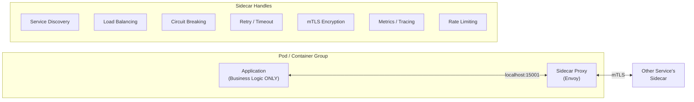
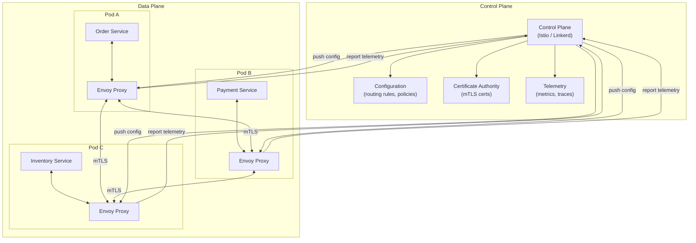
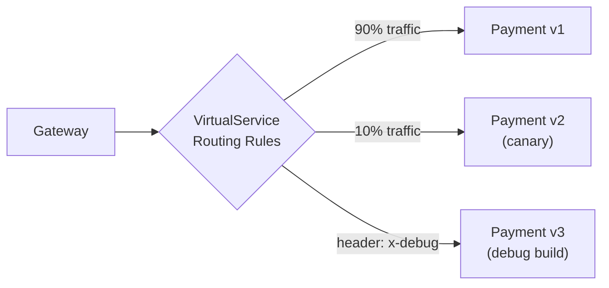
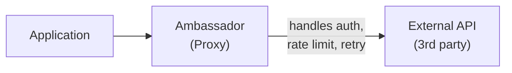

# Sidecar & Service Mesh Patterns — Infrastructure Concerns Outside Your Code

Offloading cross-cutting concerns (networking, observability, security)
to a sidecar proxy. Istio, Envoy, and Spring Boot integration.

---

## 1. The Problem — Cross-Cutting Concerns Everywhere

```text
EVERY MICROSERVICE NEEDS:
  ✓ Service discovery (find other services)
  ✓ Load balancing (distribute requests)
  ✓ Circuit breaking (handle failures)
  ✓ Retry with backoff
  ✓ Timeout management
  ✓ mTLS (mutual TLS for secure communication)
  ✓ Authentication / authorization
  ✓ Rate limiting
  ✓ Distributed tracing
  ✓ Metrics collection
  ✓ Access logging

WITHOUT SIDECAR:
  Each service implements ALL of these in its own code.

  Order Service (Java + Spring Cloud):
    - Eureka client
    - Resilience4j (circuit breaker, retry, bulkhead)
    - Spring Security (JWT validation)
    - Micrometer (metrics)
    - Zipkin client (tracing)
    - 15+ dependencies for infrastructure

  Payment Service (Go):
    - Different libraries for same concerns
    - Different config format
    - Different behavior

  Notification Service (Python):
    - Yet another set of libraries
    - Inconsistent retry logic
    - Different tracing implementation

  PROBLEMS:
    1. DUPLICATION — same logic in every service
    2. INCONSISTENCY — each language has different libraries
    3. COUPLING — business code mixed with infrastructure code
    4. UPDATE HELL — update retry logic → redeploy ALL services
    5. POLYGLOT PAIN — Java has Resilience4j, Go has? Python has?
```

---

## 2. Sidecar Pattern



```text
SIDECAR PATTERN:
  Deploy a HELPER PROCESS alongside your application.
  Application handles BUSINESS LOGIC only.
  Sidecar handles ALL infrastructure concerns.

  HOW IT WORKS:
    1. Application sends request to localhost (sidecar)
    2. Sidecar handles discovery, LB, retry, circuit breaking
    3. Sidecar forwards to target service's sidecar
    4. Target sidecar forwards to target application on localhost
    5. Response flows back through sidecars

  THE APP DOESN'T KNOW ABOUT:
    - Where the target service lives (sidecar resolves)
    - How many instances exist (sidecar load balances)
    - If the circuit is open (sidecar handles)
    - Encryption (sidecar handles mTLS)
    - Metrics (sidecar reports automatically)

  THE APP JUST CALLS:
    http://localhost:8082/api/payments  (or service name)
    Sidecar does EVERYTHING ELSE.
```

---

## 3. Service Mesh Architecture



```text
SERVICE MESH = network of sidecar proxies + control plane.

TWO COMPONENTS:

  DATA PLANE:
    - Sidecar proxies (Envoy) deployed with every service
    - Intercept ALL inbound/outbound network traffic
    - Handle routing, LB, retry, circuit breaking, mTLS, metrics
    - No changes to application code

  CONTROL PLANE:
    - Manages and configures all sidecar proxies
    - Distributes routing rules, security policies
    - Issues and rotates TLS certificates
    - Aggregates telemetry data

  POPULAR SERVICE MESHES:
    ┌─────────────┬─────────────────────────────────────┐
    │ Mesh        │ Details                              │
    ├─────────────┼─────────────────────────────────────┤
    │ Istio       │ Most feature-rich, Envoy-based       │
    │ Linkerd     │ Lightweight, Rust-based proxy        │
    │ Consul Mesh │ HashiCorp, built on Consul           │
    │ AWS App Mesh│ AWS-managed, Envoy-based             │
    └─────────────┴─────────────────────────────────────┘
```

---

## 4. What the Service Mesh Provides

### Traffic Management



```yaml
# Istio VirtualService — traffic routing
apiVersion: networking.istio.io/v1beta1
kind: VirtualService
metadata:
  name: payment-service
spec:
  hosts:
    - payment-service
  http:
    # Debug traffic → v3
    - match:
        - headers:
            x-debug:
              exact: "true"
      route:
        - destination:
            host: payment-service
            subset: v3

    # Canary: 10% to v2, 90% to v1
    - route:
        - destination:
            host: payment-service
            subset: v1
          weight: 90
        - destination:
            host: payment-service
            subset: v2
          weight: 10

---
# DestinationRule — define subsets (versions)
apiVersion: networking.istio.io/v1beta1
kind: DestinationRule
metadata:
  name: payment-service
spec:
  host: payment-service
  trafficPolicy:
    connectionPool:
      http:
        h2UpgradePolicy: DEFAULT
        maxRequestsPerConnection: 100
    outlierDetection:
      consecutive5xxErrors: 3
      interval: 30s
      baseEjectionTime: 30s
  subsets:
    - name: v1
      labels:
        version: v1
    - name: v2
      labels:
        version: v2
```

### Resilience (Retry, Timeout, Circuit Breaking)

```yaml
# Istio — retry and timeout policy
apiVersion: networking.istio.io/v1beta1
kind: VirtualService
metadata:
  name: payment-service
spec:
  hosts:
    - payment-service
  http:
    - route:
        - destination:
            host: payment-service
      retries:
        attempts: 3
        perTryTimeout: 2s
        retryOn: 5xx,reset,connect-failure
      timeout: 10s

---
# Outlier detection (circuit breaking)
apiVersion: networking.istio.io/v1beta1
kind: DestinationRule
metadata:
  name: payment-service
spec:
  host: payment-service
  trafficPolicy:
    outlierDetection:
      consecutive5xxErrors: 5        # 5 consecutive 5xx
      interval: 10s                  # check every 10s
      baseEjectionTime: 30s          # eject for 30s
      maxEjectionPercent: 50         # max 50% of instances ejected
    connectionPool:
      tcp:
        maxConnections: 100          # bulkhead: max connections
      http:
        h2UpgradePolicy: DEFAULT
        maxRequestsPerConnection: 10
        maxRetries: 3
```

### Security (mTLS)

```yaml
# Istio — enforce mTLS between all services
apiVersion: security.istio.io/v1beta1
kind: PeerAuthentication
metadata:
  name: default
  namespace: production
spec:
  mtls:
    mode: STRICT    # ALL traffic must be mTLS

---
# Authorization policy — who can call what
apiVersion: security.istio.io/v1beta1
kind: AuthorizationPolicy
metadata:
  name: payment-access
  namespace: production
spec:
  selector:
    matchLabels:
      app: payment-service
  rules:
    - from:
        - source:
            principals:
              - "cluster.local/ns/production/sa/order-service"
      to:
        - operation:
            methods: ["POST"]
            paths: ["/api/payments"]
```

### Observability (Automatic)

```text
SERVICE MESH GIVES YOU FOR FREE:
  ✅ Request count, latency, error rate — per service, per endpoint
  ✅ Distributed tracing — automatic span propagation
  ✅ Service dependency graph — who calls whom
  ✅ Traffic flow visualization (Kiali dashboard)
  ✅ Access logs — every request logged at proxy level

  NO CODE CHANGES. Just deploy the mesh.
```

---

## 5. Spring Boot with Service Mesh

```text
WITH SERVICE MESH — what you can REMOVE from Spring Boot:

  BEFORE (Spring Cloud stack):
    spring-cloud-starter-netflix-eureka-client   → mesh handles discovery
    spring-cloud-starter-loadbalancer            → mesh handles LB
    resilience4j-spring-boot3                    → mesh handles retry/CB
    spring-cloud-starter-sleuth                  → mesh handles tracing
    micrometer-tracing-bridge-otel               → mesh handles metrics
    spring-security-oauth2-resource-server       → mesh handles mTLS

  AFTER (with service mesh):
    Just spring-boot-starter-web
    Business logic only. No infrastructure libraries.

  YOUR SERVICE BECOMES:
    @RestController
    @RequestMapping("/api/orders")
    public class OrderController {
        @PostMapping
        public Order create(@RequestBody CreateOrderRequest req) {
            // Pure business logic
            // No retry, no circuit breaker, no auth — mesh handles it
            PaymentResponse payment = restTemplate
                .postForObject("http://payment-service/api/payments", req, ...);
            return orderService.create(req, payment);
        }
    }
```

```text
SPRING CLOUD vs SERVICE MESH:

  ┌──────────────────────┬──────────────────┬──────────────────────┐
  │ Concern              │ Spring Cloud     │ Service Mesh (Istio) │
  ├──────────────────────┼──────────────────┼──────────────────────┤
  │ Service Discovery    │ Eureka client    │ K8s DNS + Envoy      │
  │ Load Balancing       │ Spring Cloud LB  │ Envoy proxy          │
  │ Circuit Breaker      │ Resilience4j     │ Outlier detection    │
  │ Retry                │ Resilience4j     │ VirtualService retry │
  │ Timeout              │ Resilience4j     │ VirtualService       │
  │ mTLS                 │ Manual cert mgmt │ Automatic            │
  │ Tracing              │ Micrometer       │ Automatic            │
  │ Metrics              │ Actuator         │ Automatic            │
  │ Traffic Splitting    │ Manual           │ VirtualService       │
  │ Language Support     │ Java only        │ ANY language          │
  │ Config Location      │ In code/yaml     │ K8s manifests        │
  │ Requires K8s         │ No               │ Yes (usually)        │
  └──────────────────────┴──────────────────┴──────────────────────┘

  WHICH TO USE:
    Spring Cloud: non-K8s, Java-only, need fine-grained control
    Service Mesh: K8s, polyglot, want infrastructure-as-config
    Both: mesh for networking + Spring for business-level resilience
```

---

## 6. Ambassador Pattern (Variant)



```text
AMBASSADOR PATTERN:
  A special case of sidecar for OUTBOUND communication.
  Proxy that handles communication with EXTERNAL services.

  USE CASE:
    Your service calls a 3rd-party API (Stripe, Twilio, AWS).
    Ambassador handles: auth tokens, rate limiting, retry, caching.

  DIFFERENCE FROM SIDECAR:
    Sidecar = general purpose (handles all traffic)
    Ambassador = specifically for external API communication
```

---

## 7. When to Use / Not Use Service Mesh

```text
USE SERVICE MESH WHEN:
  ✅ Running on Kubernetes
  ✅ 10+ microservices (complexity justifies overhead)
  ✅ Multiple languages (Java, Go, Python, Node.js)
  ✅ Zero-trust security needed (mTLS everywhere)
  ✅ Complex traffic management (canary, A/B, mirroring)
  ✅ Need consistent observability across all services

DON'T USE WHEN:
  ❌ Small number of services (< 5)
  ❌ All services are Java/Spring (Spring Cloud is sufficient)
  ❌ Not on Kubernetes
  ❌ Team doesn't have K8s expertise
  ❌ Latency-critical (sidecar adds ~1-3ms per hop)
  ❌ Simple architecture that doesn't need advanced traffic management

COSTS OF SERVICE MESH:
  - Memory: ~50MB per sidecar × N pods
  - Latency: ~1-3ms added per hop
  - Complexity: YAML configuration, debugging proxy issues
  - Learning curve: Istio is complex
  - Operational overhead: manage mesh control plane
```

---

## 8. Interview Questions

### Q1: What is the sidecar pattern?

```text
  A helper process deployed alongside your application.
  Handles cross-cutting concerns (networking, security, observability).
  Application focuses on business logic only.

  Runs in the same pod/host as the application.
  Communicates via localhost (no network hop).
  Lifecycle tied to the application (starts/stops together).
```

### Q2: What is a service mesh?

```text
  A dedicated infrastructure layer for service-to-service communication.
  Network of sidecar proxies (data plane) managed by a control plane.

  Data plane (Envoy): intercepts all traffic, handles routing/retry/mTLS
  Control plane (Istio): configures proxies, manages certs, collects telemetry

  Provides: discovery, LB, circuit breaking, retry, mTLS, tracing, metrics
  WITHOUT changing application code.
```

### Q3: Spring Cloud vs Service Mesh — when to use which?

```text
  SPRING CLOUD:
    - Java/Spring-only environment
    - Not on Kubernetes
    - Need fine-grained control in code
    - Smaller teams, fewer services

  SERVICE MESH:
    - Kubernetes environment
    - Polyglot services (Java + Go + Python)
    - Zero-trust security (automatic mTLS)
    - Advanced traffic management (canary, mirroring)
    - Consistent observability across all languages

  HYBRID (pragmatic):
    Use mesh for infrastructure (mTLS, routing, tracing)
    Use Resilience4j for business-level resilience
    (e.g., custom fallback logic that only Java code can do)
```

### Q4: What are the downsides of a service mesh?

```text
  1. LATENCY: ~1-3ms per hop (sidecar interception)
  2. MEMORY: ~50MB per sidecar × hundreds of pods
  3. COMPLEXITY: Istio has a steep learning curve
  4. DEBUGGING: harder to debug proxy-level issues
  5. OPERATIONAL: another system to manage, upgrade, monitor
  6. YAML OVERLOAD: lots of CRDs and configuration

  BOTTOM LINE: Service mesh is powerful but adds real operational cost.
  Only adopt if you have the scale and team to justify it.
```
