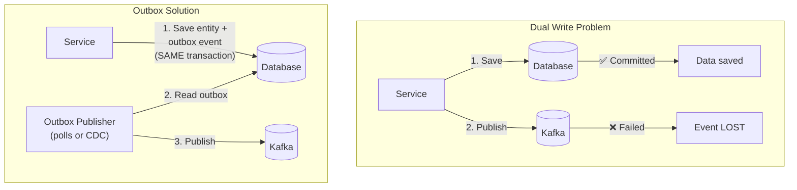
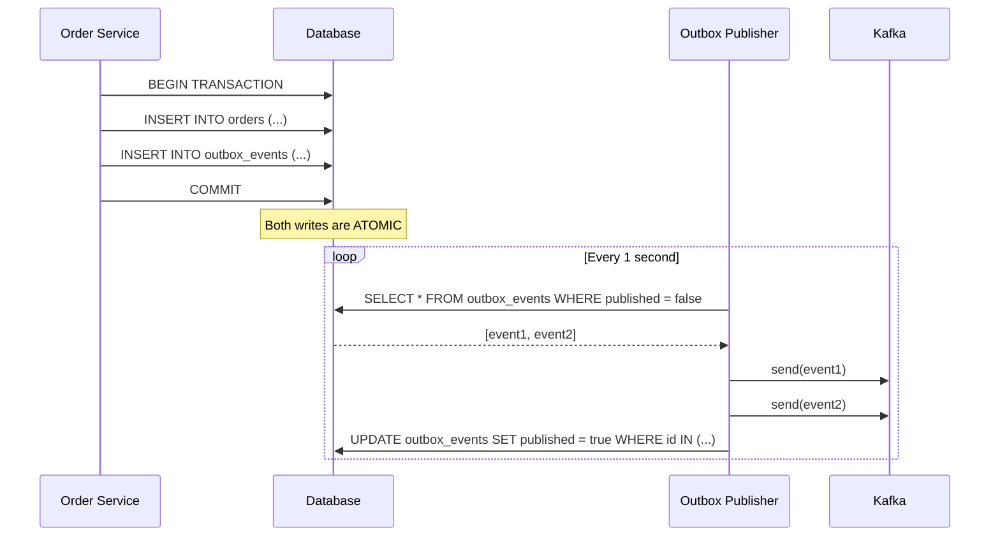
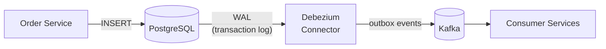
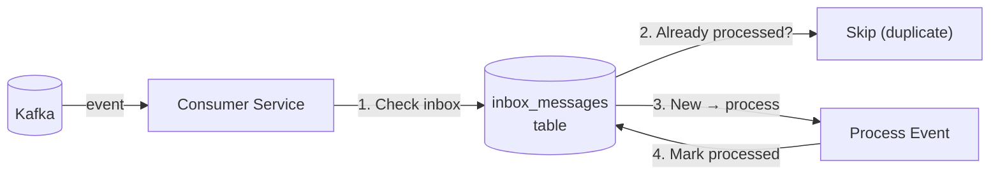

# Transactional Outbox Pattern — Reliable Event Publishing

Guaranteeing that database changes AND events are published atomically.
No lost events, no ghost events. Outbox table, CDC, and Debezium.

---

## 1. The Problem — Dual Write

```text
THE DUAL WRITE PROBLEM:

  @Transactional
  public Order createOrder(CreateOrderRequest req) {
      Order order = orderRepo.save(req);      // WRITE 1: Database
      kafkaTemplate.send("orders", order);     // WRITE 2: Kafka
      return order;
  }

  WHAT CAN GO WRONG:

  SCENARIO 1 — Kafka fails AFTER DB commit:
    ✅ Order saved to DB
    ❌ Kafka publish fails (broker down, timeout)
    RESULT: Order exists but NO event published.
            Payment service never charges. Inventory never reserved.
            DATA INCONSISTENCY.

  SCENARIO 2 — DB fails AFTER Kafka publish:
    ❌ DB commit fails (constraint violation, timeout)
    ✅ Event already published to Kafka
    RESULT: Event says "OrderCreated" but order doesn't exist.
            Payment charges for non-existent order.
            GHOST EVENT.

  SCENARIO 3 — Service crashes between the two writes:
    ✅ DB committed
    💥 Service crashes before Kafka send
    RESULT: Same as Scenario 1. Lost event.

  ROOT CAUSE:
    TWO separate systems (DB + Kafka) cannot be in ONE transaction.
    They are NOT atomically linked.
    You CANNOT wrap both in @Transactional (Kafka is not a JTA resource).
```



---

## 2. The Solution — Transactional Outbox



```text
TRANSACTIONAL OUTBOX PATTERN:

  1. Service writes entity AND event to the SAME database
     in the SAME transaction (atomic).

  2. A separate process reads the outbox table
     and publishes events to Kafka.

  3. After successful publish, mark the outbox entry as published.

  GUARANTEES:
    ✅ If DB commit succeeds → event WILL be published (eventually)
    ✅ If DB commit fails → no event (outbox row also rolled back)
    ✅ No ghost events. No lost events.
    ✅ At-least-once delivery (publisher might crash after Kafka send
       but before marking as published → event sent again on retry)

  TRADE-OFF:
    ⚠️ Slight delay (polling interval, typically 1-5 seconds)
    ⚠️ Need idempotent consumers (at-least-once means possible duplicates)
```

---

## 3. Spring Boot Implementation

### Outbox Entity

```java
@Entity
@Table(name = "outbox_events", indexes = {
    @Index(name = "idx_outbox_published", columnList = "published, createdAt")
})
@Getter @Setter @NoArgsConstructor
public class OutboxEvent {

    @Id
    @GeneratedValue(strategy = GenerationType.UUID)
    private UUID id;

    @Column(nullable = false)
    private String aggregateType;     // "Order", "Payment"

    @Column(nullable = false)
    private String aggregateId;       // "order-123"

    @Column(nullable = false)
    private String eventType;         // "OrderCreated", "OrderShipped"

    @Column(columnDefinition = "JSONB", nullable = false)
    private String payload;           // serialized event data

    @Column(nullable = false)
    private Instant createdAt;

    private boolean published;
    private Instant publishedAt;

    @Version
    private Long version;             // optimistic locking

    public OutboxEvent(String aggregateType, String aggregateId,
                       String eventType, String payload) {
        this.aggregateType = aggregateType;
        this.aggregateId = aggregateId;
        this.eventType = eventType;
        this.payload = payload;
        this.createdAt = Instant.now();
        this.published = false;
    }
}
```

### Repository

```java
public interface OutboxRepository extends JpaRepository<OutboxEvent, UUID> {

    @Query("SELECT o FROM OutboxEvent o WHERE o.published = false " +
           "ORDER BY o.createdAt ASC")
    List<OutboxEvent> findUnpublishedEvents(Pageable pageable);

    @Modifying
    @Query("DELETE FROM OutboxEvent o WHERE o.published = true " +
           "AND o.publishedAt < :cutoff")
    int deletePublishedBefore(@Param("cutoff") Instant cutoff);
}
```

### Writing to Outbox (Same Transaction)

```java
@Service
@RequiredArgsConstructor
public class OrderService {

    private final OrderRepository orderRepo;
    private final OutboxRepository outboxRepo;
    private final ObjectMapper objectMapper;

    @Transactional   // CRITICAL: one transaction for BOTH writes
    public Order createOrder(CreateOrderRequest req) {
        // 1. Save the entity
        Order order = Order.builder()
            .id(UUID.randomUUID())
            .customerId(req.customerId())
            .items(req.items())
            .total(req.total())
            .status(OrderStatus.CREATED)
            .build();
        orderRepo.save(order);

        // 2. Save the event to outbox (SAME transaction)
        OrderCreatedEvent event = new OrderCreatedEvent(
            order.getId(), order.getCustomerId(),
            order.getItems(), order.getTotal(), Instant.now()
        );

        outboxRepo.save(new OutboxEvent(
            "Order",
            order.getId().toString(),
            "OrderCreated",
            serialize(event)
        ));

        return order;
        // If DB commit fails → BOTH order AND outbox event are rolled back
        // If DB commit succeeds → outbox publisher will send the event
    }

    @Transactional
    public void shipOrder(UUID orderId) {
        Order order = orderRepo.findById(orderId)
            .orElseThrow(() -> new OrderNotFoundException(orderId));

        order.setStatus(OrderStatus.SHIPPED);
        order.setShippedAt(Instant.now());
        orderRepo.save(order);

        outboxRepo.save(new OutboxEvent(
            "Order",
            orderId.toString(),
            "OrderShipped",
            serialize(new OrderShippedEvent(orderId, Instant.now()))
        ));
    }

    private String serialize(Object event) {
        try {
            return objectMapper.writeValueAsString(event);
        } catch (JsonProcessingException e) {
            throw new RuntimeException("Failed to serialize event", e);
        }
    }
}
```

### Outbox Publisher (Polling)

```java
@Service
@RequiredArgsConstructor
@Slf4j
public class OutboxPublisher {

    private final OutboxRepository outboxRepo;
    private final KafkaTemplate<String, String> kafkaTemplate;
    private static final int BATCH_SIZE = 100;

    @Scheduled(fixedDelay = 1000)   // poll every 1 second
    @Transactional
    public void publishPendingEvents() {
        List<OutboxEvent> events = outboxRepo
            .findUnpublishedEvents(PageRequest.of(0, BATCH_SIZE));

        if (events.isEmpty()) return;

        log.debug("Publishing {} outbox events", events.size());

        for (OutboxEvent event : events) {
            try {
                String topic = event.getAggregateType().toLowerCase() + "-events";

                kafkaTemplate.send(topic, event.getAggregateId(), event.getPayload())
                    .whenComplete((result, ex) -> {
                        if (ex != null) {
                            log.error("Failed to publish outbox event {}: {}",
                                event.getId(), ex.getMessage());
                        }
                    })
                    .get(5, TimeUnit.SECONDS);  // wait for ack

                event.setPublished(true);
                event.setPublishedAt(Instant.now());

            } catch (Exception e) {
                log.error("Failed to publish event {}. Will retry.",
                    event.getId(), e);
                break;  // stop batch, retry next cycle
            }
        }

        outboxRepo.saveAll(events);
    }

    // Cleanup old published events
    @Scheduled(cron = "0 0 2 * * *")   // daily at 2 AM
    @Transactional
    public void cleanupOldEvents() {
        Instant cutoff = Instant.now().minus(7, ChronoUnit.DAYS);
        int deleted = outboxRepo.deletePublishedBefore(cutoff);
        log.info("Cleaned up {} old outbox events", deleted);
    }
}
```

---

## 4. Outbox with Change Data Capture (CDC) — Debezium

```text
POLLING vs CDC:

  POLLING:
    Scheduler reads outbox table every 1-5 seconds.
    Simple. Works. But has latency (up to polling interval).
    Adds read load to the database.

  CDC (Change Data Capture) — Debezium:
    Reads the database's TRANSACTION LOG (WAL in Postgres, binlog in MySQL).
    Detects new outbox rows in NEAR REAL-TIME (~ms).
    No polling. No extra read load on DB.
    Publishes to Kafka automatically.

  CDC is the PRODUCTION-GRADE approach for high-throughput systems.
```



### Debezium Outbox Configuration

```json
{
  "name": "outbox-connector",
  "config": {
    "connector.class": "io.debezium.connector.postgresql.PostgresConnector",
    "database.hostname": "postgres",
    "database.port": "5432",
    "database.user": "debezium",
    "database.password": "dbz",
    "database.dbname": "orderdb",
    "database.server.name": "order-service",

    "table.include.list": "public.outbox_events",

    "transforms": "outbox",
    "transforms.outbox.type": "io.debezium.transforms.outbox.EventRouter",
    "transforms.outbox.table.fields.additional.placement": "eventType:header",
    "transforms.outbox.table.field.event.id": "id",
    "transforms.outbox.table.field.event.key": "aggregate_id",
    "transforms.outbox.table.field.event.payload": "payload",
    "transforms.outbox.route.by.field": "aggregate_type",
    "transforms.outbox.route.topic.replacement": "${routedByValue}-events",

    "tombstones.on.delete": "false",
    "slot.name": "outbox_slot",
    "publication.name": "outbox_publication",
    "plugin.name": "pgoutput"
  }
}
```

```text
DEBEZIUM OUTBOX EVENT ROUTER:

  Reads: outbox_events table inserts from WAL
  Routes: aggregate_type → Kafka topic
    aggregate_type = "Order" → topic "order-events"
    aggregate_type = "Payment" → topic "payment-events"

  Key: aggregate_id (for Kafka partitioning → ordering)
  Value: payload (the serialized event)

  AFTER publishing, Debezium tracks the WAL position.
  The outbox table can be cleaned up without affecting Debezium.
  No "published" column needed — Debezium handles it.
```

### Simplified Outbox with Debezium (No Publisher Needed)

```java
@Service
@RequiredArgsConstructor
public class OrderService {

    private final OrderRepository orderRepo;
    private final OutboxRepository outboxRepo;

    @Transactional
    public Order createOrder(CreateOrderRequest req) {
        Order order = orderRepo.save(mapToEntity(req));

        // Just insert into outbox — Debezium picks it up via WAL
        outboxRepo.save(new OutboxEvent(
            "Order",
            order.getId().toString(),
            "OrderCreated",
            toJson(order)
        ));

        return order;
        // No KafkaTemplate needed!
        // No @Scheduled publisher needed!
        // Debezium reads the WAL and publishes to Kafka automatically.
    }
}
```

---

## 5. Inbox Pattern (Consumer Side)



```java
@Entity
@Table(name = "inbox_messages")
public class InboxMessage {
    @Id
    private UUID messageId;       // from event's eventId
    private String eventType;
    private Instant receivedAt;
    private Instant processedAt;

    @Enumerated(EnumType.STRING)
    private InboxStatus status;   // RECEIVED, PROCESSED, FAILED
}

@Service
@RequiredArgsConstructor
@Slf4j
public class IdempotentEventHandler {

    private final InboxRepository inboxRepo;
    private final PaymentService paymentService;

    @KafkaListener(topics = "order-events", groupId = "payment-service")
    @Transactional
    public void handleOrderCreated(OrderCreatedEvent event) {
        UUID messageId = event.eventId();

        // 1. Check if already processed (idempotency)
        if (inboxRepo.existsById(messageId)) {
            log.info("Event {} already processed — skipping", messageId);
            return;
        }

        // 2. Record in inbox
        inboxRepo.save(new InboxMessage(
            messageId, "OrderCreated",
            Instant.now(), null, InboxStatus.RECEIVED));

        // 3. Process the event
        paymentService.chargeCustomer(event.orderId(), event.total());

        // 4. Mark as processed (same transaction)
        inboxRepo.updateStatus(messageId, InboxStatus.PROCESSED, Instant.now());
    }
}
```

```text
OUTBOX + INBOX = END-TO-END EXACTLY-ONCE SEMANTICS:

  PRODUCER SIDE (Outbox):
    Entity + event saved in same transaction → event WILL be published.
    At-least-once publishing (may republish on failure).

  CONSUMER SIDE (Inbox):
    Check messageId before processing → skip duplicates.
    Process + mark processed in same transaction → exactly-once processing.

  COMBINED:
    Producer: "Event IS published if data is saved"  (at-least-once)
    Consumer: "Event is processed EXACTLY ONCE"       (idempotent)
    Result:   Exactly-once end-to-end semantics
```

---

## 6. Outbox vs Alternatives

```text
┌──────────────────────┬───────────────┬───────────────┬───────────────────┐
│ Approach             │ Consistency   │ Complexity    │ When to use       │
├──────────────────────┼───────────────┼───────────────┼───────────────────┤
│ Dual Write           │ ❌ Broken     │ Low           │ NEVER in prod     │
│ (DB + Kafka directly)│               │               │                   │
├──────────────────────┼───────────────┼───────────────┼───────────────────┤
│ Outbox + Polling     │ ✅ Correct    │ Low-Medium    │ Most projects     │
│                      │ (at-least-1)  │               │ Simple, reliable  │
├──────────────────────┼───────────────┼───────────────┼───────────────────┤
│ Outbox + CDC         │ ✅ Correct    │ Medium-High   │ High throughput   │
│ (Debezium)           │ (near RT)     │               │ Low latency needs │
├──────────────────────┼───────────────┼───────────────┼───────────────────┤
│ Listen to Yourself   │ ✅ Correct    │ Low           │ Single service    │
│ (consume own events) │               │               │ event processing  │
├──────────────────────┼───────────────┼───────────────┼───────────────────┤
│ Event Sourcing       │ ✅ Correct    │ High          │ Audit trail req.  │
│ (events = source)    │               │               │ Complex domains   │
└──────────────────────┴───────────────┴───────────────┴───────────────────┘
```

---

## 7. Interview Questions

### Q1: What is the dual write problem?

```text
  Writing to two systems (DB + message broker) non-atomically.
  If one write succeeds and the other fails:
    - DB saves but event lost → downstream never knows
    - Event sent but DB fails → ghost event for non-existent data

  Solution: Transactional Outbox — write both to the same DB
  in one transaction. Separate process publishes to Kafka.
```

### Q2: How does the Transactional Outbox work?

```text
  1. Save entity + event to SAME database, SAME transaction
  2. Separate publisher reads outbox table → publishes to Kafka
  3. Marks outbox entry as published after successful send

  GUARANTEES:
    If DB commit succeeds → event WILL be published (eventually)
    If DB commit fails → no event (rolled back with the entity)
    Publisher may re-send → consumers must be idempotent
```

### Q3: Polling vs CDC for outbox publishing?

```text
  POLLING:
    @Scheduled reads outbox every 1-5 seconds
    Simple, no extra infrastructure
    Latency = polling interval
    Adds read load to database

  CDC (Debezium):
    Reads database WAL (transaction log)
    Near real-time (~milliseconds latency)
    No extra database load
    Requires Debezium + Kafka Connect infrastructure

  START with polling. Move to CDC when you need lower latency
  or higher throughput.
```

### Q4: What is the Inbox pattern?

```text
  Consumer-side complement to the Outbox.
  Outbox: guarantees event IS published
  Inbox: guarantees event is processed EXACTLY ONCE

  How:
    1. Check if event_id exists in inbox table
    2. If yes → skip (duplicate)
    3. If no → process + insert into inbox (same transaction)

  Together: outbox (at-least-once publish) + inbox (exactly-once consume)
  = end-to-end exactly-once semantics.
```

### Q5: Can you use @TransactionalEventListener instead of outbox?

```text
  @TransactionalEventListener(phase = AFTER_COMMIT)
  public void handle(OrderCreatedEvent event) {
      kafkaTemplate.send("orders", event);
  }

  PROBLEM: Runs AFTER commit but is NOT guaranteed to execute.
    If app crashes right after commit, before listener runs → event lost.
    The listener is NOT part of the DB transaction.

  OUTBOX IS SAFER:
    Event is IN the transaction (persisted to DB).
    Even if app crashes → outbox publisher picks it up on restart.

  Use @TransactionalEventListener for best-effort (notifications).
  Use Outbox for guaranteed delivery (payments, inventory).
```
