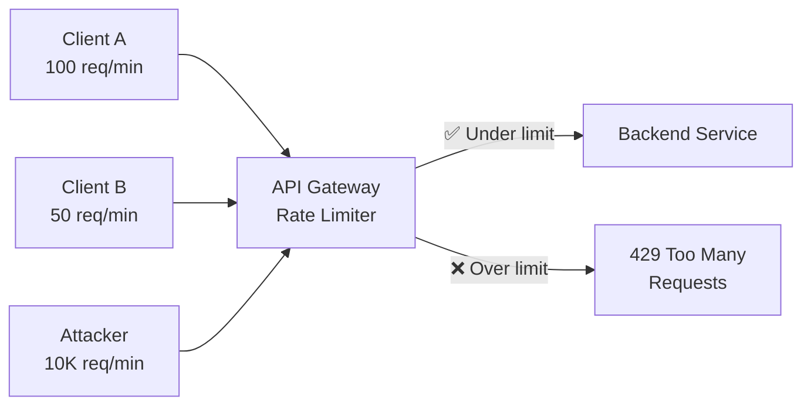
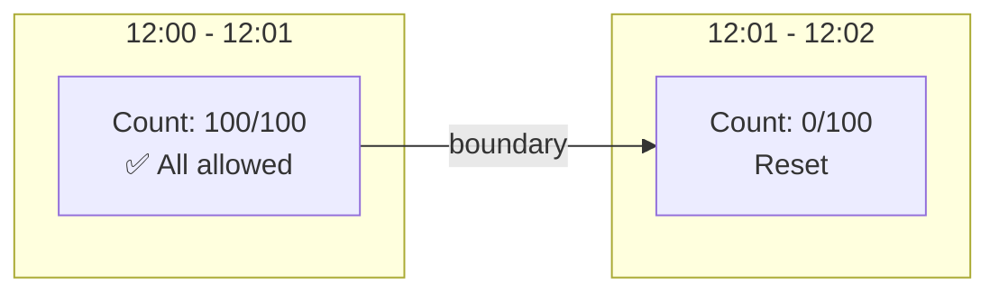
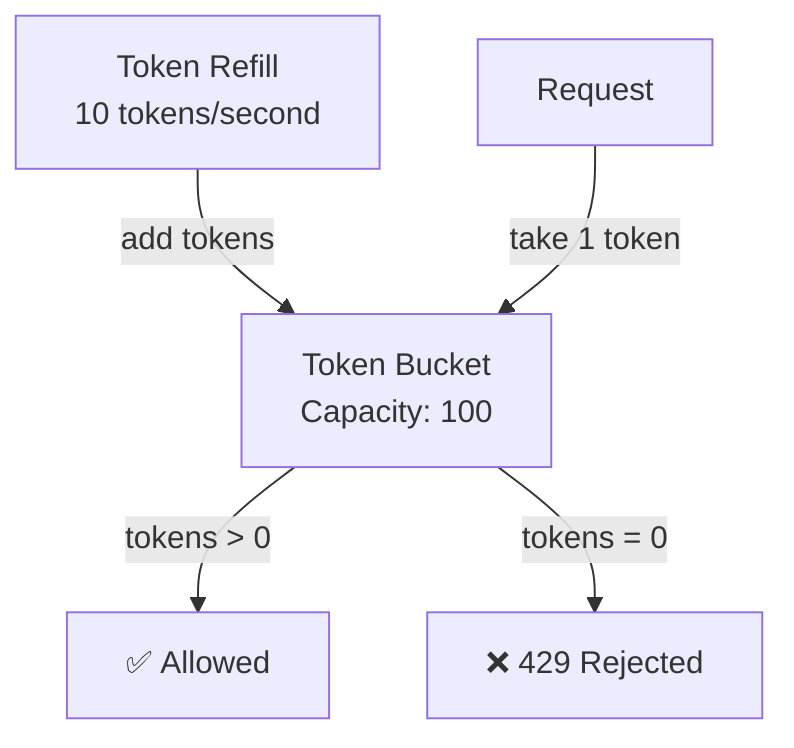
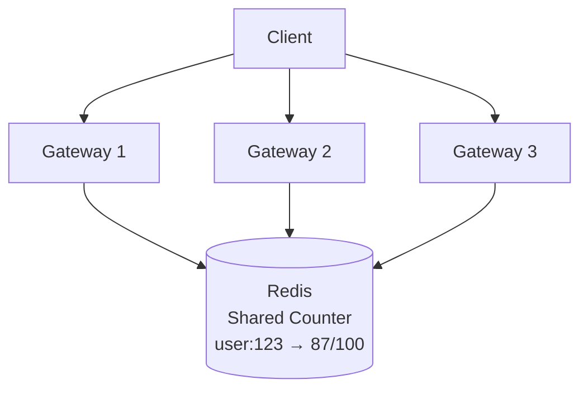
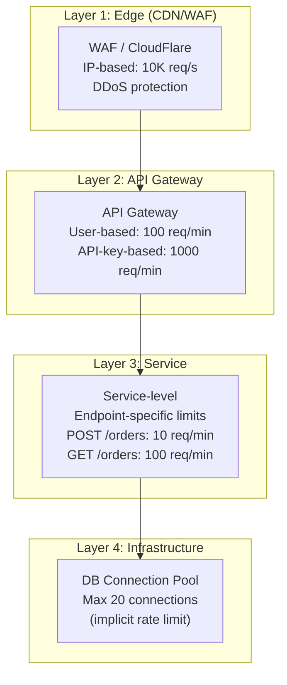

# Rate Limiting & Throttling — Protecting APIs from Abuse and Overload

Token bucket, sliding window, fixed window algorithms. Distributed rate
limiting with Redis. Spring Boot implementation at gateway and service level.

---

## 1. Why Rate Limiting?

```text
WITHOUT RATE LIMITING:

  Single user sends 10,000 requests/second:
    → Server CPU at 100%
    → Database connections exhausted
    → Legitimate users get timeouts
    → Service crashes

  Bot / DDoS attack:
    → Millions of requests flood the API
    → Infrastructure costs skyrocket
    → Service goes down for everyone

  Runaway client (bug):
    → Infinite retry loop with no backoff
    → One buggy client takes down the entire API

WITH RATE LIMITING:
  "You can make 100 requests per minute. After that → 429 Too Many Requests."
  Each user/client gets a fair share. System stays stable.

USE CASES:
  ✅ Prevent abuse (scraping, brute force)
  ✅ Protect backend resources (DB, external APIs)
  ✅ Fair usage across tenants (multi-tenant SaaS)
  ✅ Monetization (free: 100/day, premium: 10,000/day)
  ✅ Comply with downstream API limits (Stripe: 100/s)
```



---

## 2. Rate Limiting Algorithms

### Algorithm 1: Fixed Window

```text
FIXED WINDOW:
  Divide time into fixed intervals (e.g., 1-minute windows).
  Count requests in current window.
  If count > limit → reject.

  Example: 100 req/min
    Window 12:00-12:01 → count = 0
    Request at 12:00:05 → count = 1 → ✅ allowed
    Request at 12:00:30 → count = 50 → ✅ allowed
    Request at 12:00:59 → count = 100 → ✅ allowed
    Request at 12:00:59 → count = 101 → ❌ rejected
    Window resets at 12:01:00 → count = 0

  PROBLEM: BOUNDARY BURST
    99 requests at 12:00:59 (end of window)
    99 requests at 12:01:01 (start of next window)
    = 198 requests in 2 seconds! (limit is 100/min)
```



### Algorithm 2: Sliding Window Log

```text
SLIDING WINDOW LOG:
  Keep a log of ALL request timestamps.
  Count requests in the last N seconds.
  If count > limit → reject.

  Example: 100 req/min
    Request at 12:00:30 → check requests since 11:59:30
    Count timestamps in [11:59:30, 12:00:30] → 85 → ✅ allowed
    Request at 12:00:45 → check requests since 11:59:45
    Count timestamps in [11:59:45, 12:00:45] → 101 → ❌ rejected

  PROS: Most accurate. No boundary burst problem.
  CONS: High memory (stores every timestamp). O(n) per check.
```

### Algorithm 3: Sliding Window Counter

```text
SLIDING WINDOW COUNTER:
  Combines fixed window counting with a weighted average.
  Uses counts from CURRENT and PREVIOUS window.

  Example: 100 req/min, current time is 12:00:45 (75% through window)
    Previous window (12:00-12:01): 80 requests
    Current window (12:01-12:02): 30 requests so far

    Weighted count = prev × (1 - elapsed%) + current
                   = 80 × 0.25 + 30
                   = 20 + 30 = 50 → ✅ under limit

  PROS: Memory efficient (just 2 counters). Good accuracy.
  CONS: Approximate (not exact like sliding log).
```

### Algorithm 4: Token Bucket (Most Common)



```text
TOKEN BUCKET:
  Bucket holds tokens (max = capacity).
  Tokens are added at a FIXED RATE (replenish rate).
  Each request consumes 1 token.
  If bucket is empty → reject.

  Example: capacity = 100, refill = 10 tokens/sec
    Second 0: bucket = 100 tokens
    10 requests → bucket = 90 tokens → ✅ all allowed
    Second 1: bucket = 90 + 10 = 100 (capped at capacity)
    Burst of 100 requests → bucket = 0 → ✅ all allowed
    Next request → bucket = 0 → ❌ rejected
    Wait 1 second → bucket = 10 → ✅ 10 more allowed

  PROS:
    ✅ Allows BURSTS up to bucket capacity
    ✅ Smooth average rate (refill rate)
    ✅ Memory efficient (just 2 values: tokens + last_refill_time)
    ✅ Used by AWS, Stripe, most production APIs

  CONS:
    ❌ Burst at beginning can overwhelm backend (capacity = burst size)
```

### Algorithm 5: Leaky Bucket

```text
LEAKY BUCKET:
  Requests enter a queue (bucket).
  Bucket leaks (processes) at a FIXED RATE.
  If bucket is full → reject new requests.

  Like a queue with fixed processing rate.

  DIFFERENCE from Token Bucket:
    Token Bucket: allows bursts (consume multiple tokens at once)
    Leaky Bucket: constant output rate (no bursts)

  USE: When you need SMOOTH, constant request rate (no bursts allowed).
```

### Algorithm Comparison

```text
┌────────────────────┬──────────┬──────────┬───────────┬───────────────┐
│ Algorithm          │ Accuracy │ Memory   │ Burst     │ Best for      │
├────────────────────┼──────────┼──────────┼───────────┼───────────────┤
│ Fixed Window       │ Low      │ O(1)     │ ❌ Boundary│ Simple limits │
│ Sliding Log        │ High     │ O(n)     │ ✅ No     │ Strict limits │
│ Sliding Counter    │ Medium   │ O(1)     │ ✅ No     │ Good balance  │
│ Token Bucket       │ High     │ O(1)     │ ✅ Allows │ Most APIs     │
│ Leaky Bucket       │ High     │ O(1)     │ ❌ No     │ Smooth rate   │
└────────────────────┴──────────┴──────────┴───────────┴───────────────┘
```

---

## 3. Spring Cloud Gateway — Rate Limiting

### Redis-Based Rate Limiter

```yaml
spring:
  cloud:
    gateway:
      routes:
        - id: order-service
          uri: lb://ORDER-SERVICE
          predicates:
            - Path=/api/orders/**
          filters:
            - name: RequestRateLimiter
              args:
                redis-rate-limiter.replenishRate: 50     # 50 tokens/sec
                redis-rate-limiter.burstCapacity: 100    # max burst
                redis-rate-limiter.requestedTokens: 1    # tokens per request
                key-resolver: "#{@userKeyResolver}"

        - id: search-service
          uri: lb://SEARCH-SERVICE
          predicates:
            - Path=/api/search/**
          filters:
            - name: RequestRateLimiter
              args:
                redis-rate-limiter.replenishRate: 10
                redis-rate-limiter.burstCapacity: 20
                key-resolver: "#{@apiKeyResolver}"

  data:
    redis:
      host: localhost
      port: 6379
```

### Key Resolvers (Rate Limit By What?)

```java
@Configuration
public class RateLimitConfig {

    // Rate limit per USER
    @Bean
    public KeyResolver userKeyResolver() {
        return exchange -> {
            String userId = exchange.getRequest().getHeaders()
                .getFirst("X-User-Id");
            return Mono.just(userId != null ? userId : "anonymous");
        };
    }

    // Rate limit per API KEY
    @Bean
    public KeyResolver apiKeyResolver() {
        return exchange -> {
            String apiKey = exchange.getRequest().getHeaders()
                .getFirst("X-API-Key");
            return Mono.just(apiKey != null ? apiKey : "no-key");
        };
    }

    // Rate limit per IP ADDRESS
    @Bean
    public KeyResolver ipKeyResolver() {
        return exchange -> Mono.just(
            exchange.getRequest().getRemoteAddress()
                .getAddress().getHostAddress());
    }

    // Rate limit per ENDPOINT + USER
    @Bean
    public KeyResolver endpointUserKeyResolver() {
        return exchange -> {
            String userId = exchange.getRequest().getHeaders()
                .getFirst("X-User-Id");
            String path = exchange.getRequest().getURI().getPath();
            return Mono.just(userId + ":" + path);
        };
    }
}
```

---

## 4. Service-Level Rate Limiting (Bucket4j)

```xml
<dependency>
    <groupId>com.bucket4j</groupId>
    <artifactId>bucket4j-core</artifactId>
    <version>8.10.1</version>
</dependency>
<dependency>
    <groupId>com.bucket4j</groupId>
    <artifactId>bucket4j-redis</artifactId>
    <version>8.10.1</version>
</dependency>
```

### Per-User Rate Limiting

```java
@Component
@RequiredArgsConstructor
public class RateLimitInterceptor implements HandlerInterceptor {

    private final Map<String, Bucket> userBuckets = new ConcurrentHashMap<>();

    @Override
    public boolean preHandle(HttpServletRequest request,
                              HttpServletResponse response,
                              Object handler) throws Exception {
        String userId = request.getHeader("X-User-Id");
        if (userId == null) userId = request.getRemoteAddr();

        Bucket bucket = userBuckets.computeIfAbsent(userId, this::createBucket);

        ConsumptionProbe probe = bucket.tryConsumeAndReturnRemaining(1);

        if (probe.isConsumed()) {
            response.addHeader("X-Rate-Limit-Remaining",
                String.valueOf(probe.getRemainingTokens()));
            return true;
        }

        // Rate limited
        response.setStatus(HttpStatus.TOO_MANY_REQUESTS.value());
        response.addHeader("X-Rate-Limit-Retry-After-Seconds",
            String.valueOf(probe.getNanosToWaitForRefill() / 1_000_000_000));
        response.addHeader("Retry-After",
            String.valueOf(probe.getNanosToWaitForRefill() / 1_000_000_000));
        response.getWriter().write(
            "{\"error\": \"Rate limit exceeded. Try again later.\"}");
        return false;
    }

    private Bucket createBucket(String userId) {
        return Bucket.builder()
            .addLimit(Bandwidth.builder()
                .capacity(100)                          // max 100 tokens
                .refillGreedy(100, Duration.ofMinutes(1)) // refill 100/min
                .build())
            .addLimit(Bandwidth.builder()
                .capacity(10)                           // burst limit
                .refillGreedy(10, Duration.ofSeconds(1))  // max 10/sec
                .build())
            .build();
    }
}

@Configuration
public class WebMvcConfig implements WebMvcConfigurer {
    @Autowired private RateLimitInterceptor rateLimitInterceptor;

    @Override
    public void addInterceptors(InterceptorRegistry registry) {
        registry.addInterceptor(rateLimitInterceptor)
            .addPathPatterns("/api/**");
    }
}
```

### Tiered Rate Limiting (Free vs Premium)

```java
@Service
@RequiredArgsConstructor
public class TieredRateLimiter {

    private final UserPlanService planService;
    private final Map<String, Bucket> buckets = new ConcurrentHashMap<>();

    public boolean tryConsume(String userId) {
        Bucket bucket = buckets.computeIfAbsent(userId, id -> {
            UserPlan plan = planService.getPlan(id);
            return createBucketForPlan(plan);
        });
        return bucket.tryConsume(1);
    }

    private Bucket createBucketForPlan(UserPlan plan) {
        return switch (plan) {
            case FREE -> Bucket.builder()
                .addLimit(Bandwidth.builder()
                    .capacity(100)
                    .refillGreedy(100, Duration.ofDays(1))
                    .build())
                .build();

            case BASIC -> Bucket.builder()
                .addLimit(Bandwidth.builder()
                    .capacity(10_000)
                    .refillGreedy(10_000, Duration.ofDays(1))
                    .build())
                .addLimit(Bandwidth.builder()
                    .capacity(50)
                    .refillGreedy(50, Duration.ofSeconds(1))
                    .build())
                .build();

            case PREMIUM -> Bucket.builder()
                .addLimit(Bandwidth.builder()
                    .capacity(100_000)
                    .refillGreedy(100_000, Duration.ofDays(1))
                    .build())
                .addLimit(Bandwidth.builder()
                    .capacity(200)
                    .refillGreedy(200, Duration.ofSeconds(1))
                    .build())
                .build();
        };
    }
}
```

---

## 5. Distributed Rate Limiting (Redis)

```text
PROBLEM: Multiple gateway/service instances.
  Instance 1 counts 50 requests for User A.
  Instance 2 counts 50 requests for User A.
  Total: 100 requests, but each instance thinks 50 (under limit).
  User A actually made 100 — should be rate limited!

SOLUTION: Centralized counter in Redis.
  All instances share the same Redis counter per user.
```



```java
@Service
@RequiredArgsConstructor
public class RedisRateLimiter {

    private final RedisTemplate<String, String> redisTemplate;

    /**
     * Token bucket implemented in Redis using Lua script for atomicity.
     */
    public boolean isAllowed(String key, int maxTokens, int refillRate,
                              Duration refillInterval) {
        String redisKey = "rate_limit:" + key;

        // Lua script for atomic token bucket
        String luaScript = """
            local key = KEYS[1]
            local max_tokens = tonumber(ARGV[1])
            local refill_rate = tonumber(ARGV[2])
            local refill_interval_ms = tonumber(ARGV[3])
            local now = tonumber(ARGV[4])

            local bucket = redis.call('HMGET', key, 'tokens', 'last_refill')
            local tokens = tonumber(bucket[1])
            local last_refill = tonumber(bucket[2])

            if tokens == nil then
                tokens = max_tokens
                last_refill = now
            end

            local elapsed = now - last_refill
            local new_tokens = math.floor(elapsed / refill_interval_ms) * refill_rate
            tokens = math.min(max_tokens, tokens + new_tokens)

            if new_tokens > 0 then
                last_refill = now
            end

            local allowed = 0
            if tokens > 0 then
                tokens = tokens - 1
                allowed = 1
            end

            redis.call('HMSET', key, 'tokens', tokens, 'last_refill', last_refill)
            redis.call('EXPIRE', key, math.ceil(refill_interval_ms / 1000) * 2)

            return {allowed, tokens}
            """;

        List<Long> result = redisTemplate.execute(
            new DefaultRedisScript<>(luaScript, List.class),
            List.of(redisKey),
            String.valueOf(maxTokens),
            String.valueOf(refillRate),
            String.valueOf(refillInterval.toMillis()),
            String.valueOf(System.currentTimeMillis())
        );

        return result != null && result.get(0) == 1L;
    }
}
```

---

## 6. Response Headers (Best Practice)

```text
STANDARD RATE LIMIT HEADERS:

  HTTP/1.1 200 OK
  X-RateLimit-Limit: 100           ← max requests per window
  X-RateLimit-Remaining: 42        ← requests remaining
  X-RateLimit-Reset: 1625847600    ← Unix timestamp when window resets

  HTTP/1.1 429 Too Many Requests
  Retry-After: 30                  ← seconds until client can retry
  X-RateLimit-Limit: 100
  X-RateLimit-Remaining: 0
  X-RateLimit-Reset: 1625847600
  Content-Type: application/json

  {
    "error": "rate_limit_exceeded",
    "message": "You have exceeded the rate limit of 100 requests per minute",
    "retryAfter": 30
  }

BEST PRACTICES:
  ✅ Always include rate limit headers (clients can self-regulate)
  ✅ Use Retry-After header on 429 responses
  ✅ Return 429 status (not 403 or 503)
  ✅ Include remaining count (client knows when to slow down)
  ✅ Document limits in API docs
```

---

## 7. Rate Limiting Architecture



```text
MULTI-LAYER RATE LIMITING:

  Layer 1 — EDGE (CDN/WAF):
    Block DDoS, suspicious IPs
    Very high limits (network level)

  Layer 2 — API GATEWAY:
    Per-user or per-API-key limits
    Business-level quotas (free/premium)
    Most rate limiting happens here

  Layer 3 — SERVICE:
    Per-endpoint limits (POST is more expensive than GET)
    Protects specific expensive operations

  Layer 4 — INFRASTRUCTURE:
    Connection pools, thread pools (implicit limits)
    Last line of defense
```

---

## 8. Interview Questions

### Q1: What rate limiting algorithm would you choose and why?

```text
  TOKEN BUCKET for most API rate limiting:
    ✅ Allows bursts (up to bucket capacity)
    ✅ Smooth average rate
    ✅ O(1) memory, O(1) time
    ✅ Industry standard (AWS, Stripe, GitHub)

  SLIDING WINDOW COUNTER for strict limits:
    ✅ No boundary burst problem
    ✅ Low memory (2 counters)
    ✅ Good accuracy without per-request storage

  LEAKY BUCKET for smooth processing:
    ✅ Constant output rate (no bursts)
    ✅ Good for rate-limited downstream APIs
```

### Q2: How do you rate limit across multiple service instances?

```text
  Use CENTRALIZED COUNTER in Redis.
  All instances increment/check the same counter.
  Use Lua scripts for atomicity (check + decrement in one call).

  ALTERNATIVE: Approximate local rate limiting.
    Each instance gets a fraction of the total limit.
    3 instances, 300/min total → each gets 100/min.
    Less accurate but no Redis dependency.
```

### Q3: How do you handle rate limiting for different user tiers?

```text
  Store user plan in JWT claims or database.
  Create different token buckets per plan:
    Free: 100 req/day
    Basic: 10,000 req/day, 50 req/sec burst
    Premium: 100,000 req/day, 200 req/sec burst

  Key: userId + plan → Bucket configuration
  When user upgrades → evict old bucket, create new one.
```

### Q4: Rate limiting vs throttling vs load shedding?

```text
  RATE LIMITING:
    "Max N requests per time window per client"
    Fairness-based. Protects from individual abuse.
    Returns 429 Too Many Requests.

  THROTTLING:
    "Slow down request processing rate"
    Can delay (not reject) requests.
    Queues requests instead of rejecting immediately.

  LOAD SHEDDING:
    "Reject requests when system is overloaded"
    Based on SYSTEM load, not per-client limits.
    Returns 503 Service Unavailable.
    Protects the system itself, not fair usage.

  COMBINED:
    Rate limiting → per-client fairness
    Load shedding → system self-protection
    Both together → robust API
```

### Q5: What happens when Redis (rate limit store) is down?

```text
  OPTIONS:
    1. FAIL OPEN: allow all requests (no rate limiting)
       Risk: abuse goes unchecked until Redis recovers
       Safer for user experience

    2. FAIL CLOSED: reject all requests
       Risk: legitimate users blocked
       Safer for system protection

    3. LOCAL FALLBACK: switch to in-memory rate limiting
       Less accurate (per-instance) but functional
       Best of both worlds

  BEST PRACTICE:
    Fail OPEN with monitoring + alerting.
    Redis downtime is temporary → tolerate brief unprotected window.
    Alert the team to fix Redis immediately.
```
