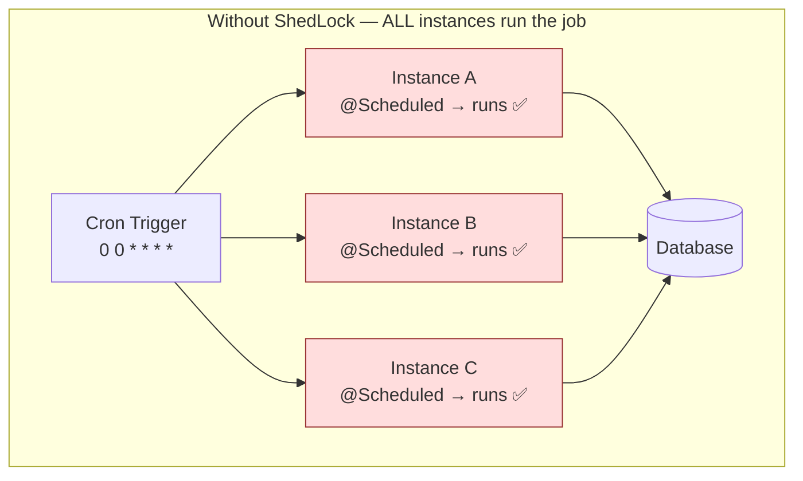
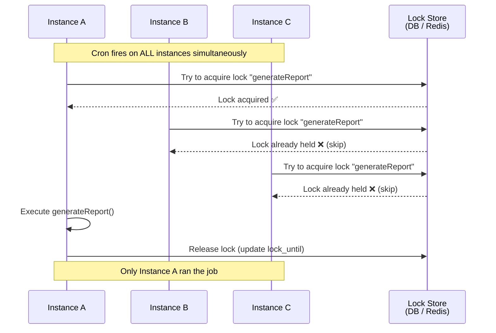
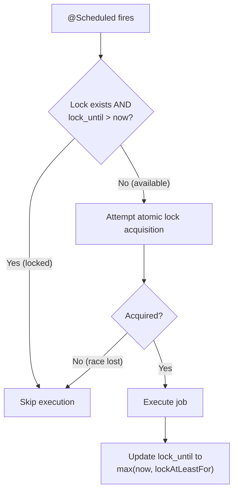
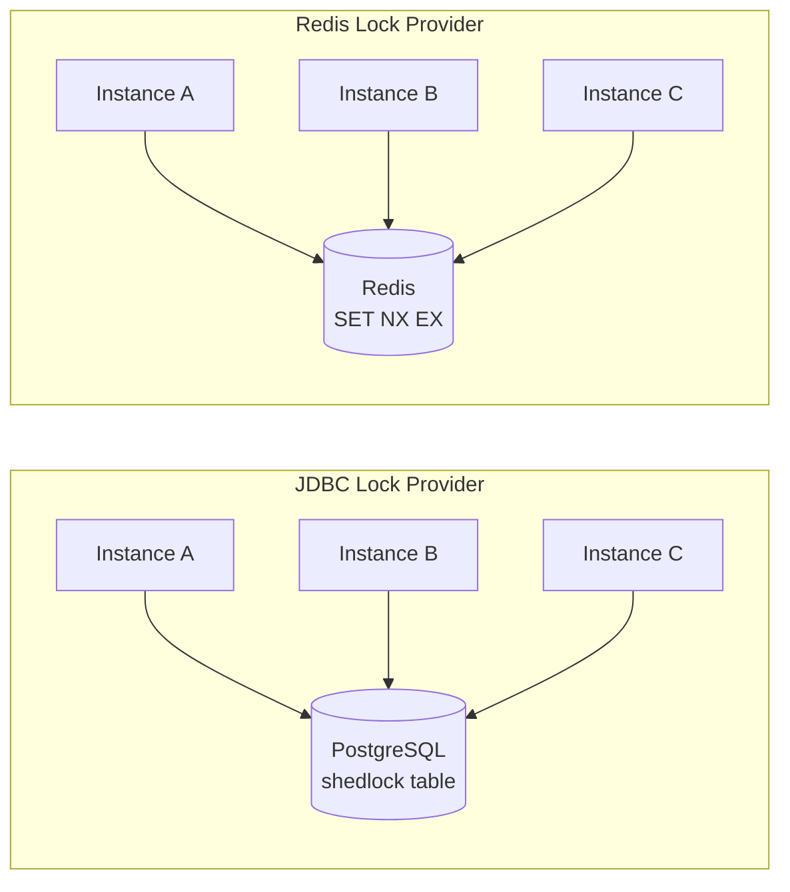
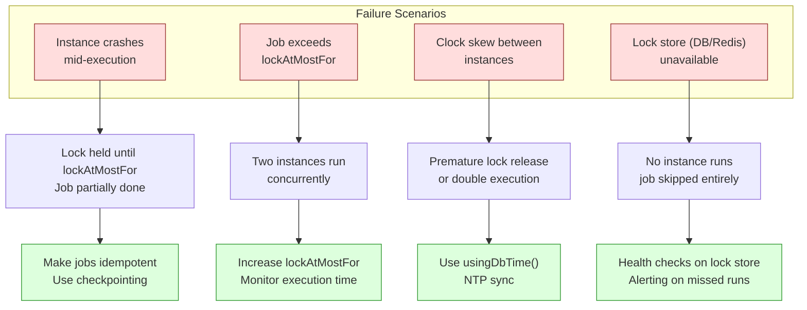

```mermaid
gantt
    title ShedLock Timing Example
    dateFormat HH:mm:ss
    axisFormat %H:%M:%S

    section Instance A
    Lock acquired           :milestone, 10:00:00, 0min
    Job executing           :active, job, 10:00:00, 2min
    lockAtLeastFor hold     :crit, hold, 10:02:00, 3min
    lockAtMostFor limit     :done, most, 10:00:00, 15min

    section Lock Timeline
    Lock held (actual)      :lock, 10:00:00, 5min
    Lock available          :avail, 10:05:00, 10min
```

# Distributed Scheduling

How to prevent multiple application instances from executing the same
scheduled job concurrently using ShedLock, lock providers, timing
parameters, and failure handling.

---

## 1. The Problem — Duplicate Job Execution

### Why @Scheduled Breaks in Multi-Instance Deployments

```text
Single instance — @Scheduled works fine:

  @Scheduled(cron = "0 0 * * * *")  // every hour
  public void generateReport() {
      // runs once per hour ✅
  }

Three instances behind a load balancer — SAME job runs THREE times:

  Instance A (JVM 1):  @Scheduled fires → generateReport() ✅
  Instance B (JVM 2):  @Scheduled fires → generateReport() ✅
  Instance C (JVM 3):  @Scheduled fires → generateReport() ✅

  The report is generated THREE TIMES every hour!
  Each JVM has its OWN scheduler. They don't coordinate.
  @Scheduled has NO concept of distributed awareness.

  This means:
    - Duplicate emails sent
    - Duplicate invoices generated
    - Duplicate cleanup runs (or race conditions)
    - Duplicate database writes
    - Wasted resources
```



---

## 2. ShedLock — The Solution

### What ShedLock Does

```text
ShedLock ensures that a scheduled task runs AT MOST ONCE across all
application instances at the same time.

It does this by acquiring an external lock (database row or Redis key)
BEFORE executing the task. Only the instance that successfully acquires
the lock runs the task. Others skip it.

  Instance A ──┐
               │
  Instance B ──┼──► Shared Lock (DB / Redis / ZooKeeper)
               │
  Instance C ──┘

  Only ONE instance holds the lock.
  Others see the lock exists → skip execution.

IMPORTANT: ShedLock is NOT a distributed scheduler. It is a distributed
lock for scheduled tasks. Spring still triggers @Scheduled on every
instance. ShedLock just prevents the actual execution on all but one.
```



### How It Works Internally

```text
ShedLock stores a lock record in an external store:

  ┌─────────────────┬─────────────────────────┬─────────────────────────┬────────────┐
  │ name            │ lock_until              │ locked_at               │ locked_by  │
  ├─────────────────┼─────────────────────────┼─────────────────────────┼────────────┤
  │ generateReport  │ 2024-01-15 10:05:00     │ 2024-01-15 10:00:00     │ instance-A │
  │ cleanupExpired  │ 2024-01-15 10:15:00     │ 2024-01-15 10:00:00     │ instance-B │
  └─────────────────┴─────────────────────────┴─────────────────────────┴────────────┘

  Lock acquisition is ATOMIC:
    INSERT ... ON CONFLICT DO NOTHING   (Postgres)
    SET NX EX                           (Redis)

  If lock_until is in the past → lock is expired → can be reacquired.
  If lock_until is in the future → lock is held → skip.
```



---

## 3. ShedLock Configuration

### Maven Dependency

```xml
<!-- ShedLock core -->
<dependency>
    <groupId>net.javacrumbs.shedlock</groupId>
    <artifactId>shedlock-spring</artifactId>
    <version>5.10.0</version>
</dependency>

<!-- Lock provider: JDBC (PostgreSQL, MySQL) -->
<dependency>
    <groupId>net.javacrumbs.shedlock</groupId>
    <artifactId>shedlock-provider-jdbc-template</artifactId>
    <version>5.10.0</version>
</dependency>

<!-- OR Lock provider: Redis -->
<dependency>
    <groupId>net.javacrumbs.shedlock</groupId>
    <artifactId>shedlock-provider-redis-spring</artifactId>
    <version>5.10.0</version>
</dependency>
```

### Enable ShedLock

```java
@Configuration
@EnableScheduling
@EnableSchedulerLock(defaultLockAtMostFor = "10m")
public class SchedulerConfig {
}
```

### Database Table (JDBC Provider)

```sql
-- PostgreSQL
CREATE TABLE shedlock (
    name       VARCHAR(64)  NOT NULL,
    lock_until TIMESTAMP    NOT NULL,
    locked_at  TIMESTAMP    NOT NULL,
    locked_by  VARCHAR(255) NOT NULL,
    PRIMARY KEY (name)
);
```

### Lock Provider Bean

```java
// Database-backed lock provider
@Bean
public LockProvider lockProvider(DataSource dataSource) {
    return new JdbcTemplateLockProvider(
        JdbcTemplateLockProvider.Configuration.builder()
            .withJdbcTemplate(new JdbcTemplate(dataSource))
            .usingDbTime()  // use DB server time, not app time
            .build()
    );
}

// Redis-backed lock provider
@Bean
public LockProvider lockProvider(RedisConnectionFactory connectionFactory) {
    return new RedisLockProvider(connectionFactory);
}
```

---

## 4. lockAtMostFor and lockAtLeastFor

These two parameters are the most critical part of ShedLock configuration.

### lockAtMostFor

```text
lockAtMostFor — Maximum time the lock is held.

  Purpose: SAFETY NET for when the executing instance DIES.

  If instance A acquires the lock and then crashes (OOM, kill -9, network
  partition), the lock would be held FOREVER without lockAtMostFor.

  lockAtMostFor ensures the lock is automatically released after this
  duration, even if the instance never explicitly releases it.

  Example:
    @SchedulerLock(name = "report", lockAtMostFor = "15m")

    Instance A acquires lock at 10:00:00
    Instance A crashes at 10:02:00
    Lock auto-expires at 10:15:00 (lockAtMostFor = 15min)
    Instance B can acquire lock at 10:15:00

  Rule: lockAtMostFor MUST be longer than the maximum expected job
  execution time. If the job takes 10 minutes, set lockAtMostFor to
  at least 15 minutes.

  If lockAtMostFor is too short:
    Job takes 10 minutes, lockAtMostFor = 5 minutes
    → Lock expires at 5 minutes
    → Another instance picks up and runs the SAME job concurrently
    → DUPLICATE EXECUTION!
```

### lockAtLeastFor

```text
lockAtLeastFor — Minimum time the lock is held.

  Purpose: Prevent rapid re-execution on very fast jobs.

  If a job completes in 100ms and you have a cron running every second,
  without lockAtLeastFor, the lock would be released instantly and
  another instance could grab it on the next trigger.

  Example:
    @SchedulerLock(name = "cleanup", lockAtLeastFor = "5m")

    Instance A acquires lock at 10:00:00
    Job completes in 200ms (10:00:00.200)
    Lock is NOT released until 10:05:00 (lockAtLeastFor = 5min)
    No other instance can run the job during this window.

  Rule: lockAtLeastFor should be slightly less than the scheduling
  interval. If cron runs every 15 minutes, set lockAtLeastFor to
  something like 14 minutes to prevent double-execution due to
  clock skew.
```



```text
Timeline:

  10:00:00  Lock acquired. Job starts.
  10:02:00  Job finishes (2 min execution).
  10:02:00  BUT lockAtLeastFor = 5min → lock held until 10:05:00.
  10:05:00  Lock released. Other instances can acquire.
  10:15:00  lockAtMostFor = 15min would expire here (safety net).

  Actual lock held = max(execution_time, lockAtLeastFor) = 5 minutes
```

### Usage Example

```java
@Component
public class ScheduledTasks {

    @Scheduled(cron = "0 0 * * * *")  // every hour
    @SchedulerLock(
        name = "generateMonthlyReport",
        lockAtMostFor = "30m",    // safety: auto-release after 30min
        lockAtLeastFor = "55m"    // prevent re-run within the hour
    )
    public void generateMonthlyReport() {
        // Only ONE instance runs this across the cluster
        reportService.generate();
    }

    @Scheduled(fixedRate = 60_000)  // every 60 seconds
    @SchedulerLock(
        name = "cleanupExpiredTokens",
        lockAtMostFor = "5m",
        lockAtLeastFor = "50s"
    )
    public void cleanupExpiredTokens() {
        tokenService.deleteExpired();
    }
}
```

---

## 5. Database-Backed vs Redis-Backed Locks

```text
┌────────────────────┬──────────────────────────────┬──────────────────────────────┐
│ Aspect             │ Database (JDBC)              │ Redis                        │
├────────────────────┼──────────────────────────────┼──────────────────────────────┤
│ Latency            │ Higher (disk I/O)            │ Lower (in-memory)            │
│ Setup              │ Use existing DB              │ Need Redis infrastructure    │
│ Clock dependency   │ DB server clock (reliable)   │ Each Redis node clock        │
│ Durability         │ Persisted to disk            │ Can lose on restart (AOF?)   │
│ Scalability        │ Limited by DB connections    │ Very high throughput          │
│ Atomic operations  │ INSERT ON CONFLICT           │ SET NX EX (native atomic)    │
│ Good for           │ Apps that already have DB    │ High-frequency scheduling    │
│ Risk               │ Adds DB load                 │ Redis failover can lose lock │
└────────────────────┴──────────────────────────────┴──────────────────────────────┘

Decision guide:
  - If you already have a database and schedule runs every few minutes → use JDBC.
  - If you need sub-second lock acquisition or very high frequency → use Redis.
  - If you already have Redis for caching → piggyback on Redis for locks too.
  - For most Spring Boot apps → JDBC is sufficient and simpler.
```



---

## 6. Job Ownership and Failure Scenarios

### Scenario 1 — Instance Crashes Mid-Execution

```text
  10:00:00  Instance A acquires lock, starts job
  10:03:00  Instance A crashes (OOM, kill -9)
  10:03:00  Job is PARTIALLY completed
  10:15:00  lockAtMostFor expires → lock released
  10:15:01  Instance B acquires lock → starts job

  PROBLEM: The job may have been partially executed.
  If the job is NOT idempotent, you get partial + full execution.

  SOLUTION:
    - Make jobs idempotent (safe to re-execute)
    - Use checkpointing (track progress, resume from checkpoint)
    - Use database transactions (all-or-nothing for DB writes)
```

### Scenario 2 — Job Takes Longer Than lockAtMostFor

```text
  10:00:00  Instance A acquires lock, starts job
  10:30:00  lockAtMostFor = 30min → lock auto-released
  10:30:01  Instance B acquires lock → starts same job
  10:35:00  Instance A still running → TWO instances running simultaneously!

  SOLUTION:
    - Set lockAtMostFor generously (2-3x expected max duration)
    - Monitor job execution times
    - Alert when jobs approach lockAtMostFor limit
    - Consider breaking long jobs into smaller chunks
```

### Scenario 3 — Clock Skew Between Instances

```text
  Instance A clock: 10:00:00
  Instance B clock: 10:00:05 (5 seconds ahead)

  If lock timing depends on application clocks, skew can cause
  premature lock release or double execution.

  SOLUTION:
    - Use usingDbTime() with JDBC provider → all timing uses DB clock
    - Use NTP to synchronize clocks
    - Set lockAtLeastFor with margin for clock skew
```

### Scenario 4 — Database / Redis Unavailable

```text
  If the lock store is down, ShedLock CANNOT acquire the lock.
  The job simply does NOT execute on ANY instance.

  This is SAFE (no duplicates) but means NO execution.

  ShedLock does NOT make scheduling fault-tolerant.
  It only prevents concurrent execution.

  For fault-tolerant scheduling, you need a proper job scheduler
  like Quartz Cluster mode or a message-queue-based approach.
```



---

## 7. ShedLock vs Other Approaches

```text
┌─────────────────────┬────────────────────────┬────────────────────────────┐
│ Approach            │ What It Does           │ When to Use                │
├─────────────────────┼────────────────────────┼────────────────────────────┤
│ ShedLock            │ Prevents concurrent    │ Simple scheduled tasks     │
│                     │ execution of @Scheduled│ across multiple instances  │
│                     │                        │                            │
│ Quartz (Clustered)  │ Full job scheduler     │ Complex scheduling needs,  │
│                     │ with DB-backed state   │ dynamic jobs, persistence  │
│                     │                        │                            │
│ Spring Integration  │ Distributed lock via   │ When you already use       │
│ LockRegistry        │ JDBC/Redis/ZooKeeper   │ Spring Integration         │
│                     │                        │                            │
│ Leader Election     │ Elect one instance as  │ When only one instance     │
│ (Zookeeper/etcd)    │ leader; only leader    │ should handle all tasks    │
│                     │ runs jobs              │                            │
│                     │                        │                            │
│ Message Queue       │ Push jobs to queue,    │ When you need reliable     │
│ (RabbitMQ/Kafka)    │ one consumer processes │ execution, retries, DLQ    │
└─────────────────────┴────────────────────────┴────────────────────────────┘
```

---

## 8. Best Practices

```text
1. ALWAYS set lockAtMostFor
   If you don't, a crash means the lock is held FOREVER.
   Default: set at class level with @EnableSchedulerLock(defaultLockAtMostFor).

2. Set lockAtLeastFor close to the scheduling interval
   Prevents double-execution due to fast completion + clock skew.

3. Use usingDbTime() for JDBC provider
   Eliminates clock skew issues between application instances.

4. Make scheduled jobs IDEMPOTENT
   ShedLock prevents concurrent execution but NOT re-execution after failure.
   If instance A crashes and instance B picks up, the job runs again.
   It must be safe to run twice.

5. Keep scheduled jobs SHORT
   Long jobs risk exceeding lockAtMostFor.
   Break large jobs into smaller chunks with checkpointing.

6. Monitor lock acquisition
   Log when locks are acquired and released.
   Alert on jobs that never run (lock store down).

7. Use meaningful lock names
   Lock names are global. Use descriptive, unique names.
   Bad:  "job1"
   Good: "daily-invoice-generation"

8. Don't use ShedLock for distributed locks outside scheduling
   For general distributed locking, use Redisson or Spring Integration
   LockRegistry. ShedLock is specifically for @Scheduled methods.
```

---

## 9. Complete Working Example

```java
// SchedulerConfig.java
@Configuration
@EnableScheduling
@EnableSchedulerLock(defaultLockAtMostFor = "10m")
public class SchedulerConfig {

    @Bean
    public LockProvider lockProvider(DataSource dataSource) {
        return new JdbcTemplateLockProvider(
            JdbcTemplateLockProvider.Configuration.builder()
                .withJdbcTemplate(new JdbcTemplate(dataSource))
                .usingDbTime()
                .build()
        );
    }

    // Optional: customize scheduler thread pool
    @Bean
    public TaskScheduler taskScheduler() {
        ThreadPoolTaskScheduler scheduler = new ThreadPoolTaskScheduler();
        scheduler.setPoolSize(5);
        scheduler.setThreadNamePrefix("scheduled-");
        return scheduler;
    }
}

// ScheduledJobs.java
@Component
@Slf4j
public class ScheduledJobs {

    private final InvoiceService invoiceService;
    private final TokenService tokenService;

    @Scheduled(cron = "0 0 2 * * *")  // daily at 2 AM
    @SchedulerLock(
        name = "daily-invoice-generation",
        lockAtMostFor = "1h",
        lockAtLeastFor = "23h"   // prevent re-run within 24h
    )
    public void generateDailyInvoices() {
        log.info("Starting daily invoice generation");
        int count = invoiceService.generatePending();
        log.info("Generated {} invoices", count);
    }

    @Scheduled(fixedRate = 300_000)  // every 5 minutes
    @SchedulerLock(
        name = "cleanup-expired-tokens",
        lockAtMostFor = "10m",
        lockAtLeastFor = "4m"
    )
    public void cleanupExpiredTokens() {
        log.info("Cleaning up expired tokens");
        int deleted = tokenService.deleteExpired();
        log.info("Deleted {} expired tokens", deleted);
    }
}
```

---

## 10. Interview Questions

### Q1: What is ShedLock and why do you need it?

```text
ShedLock is a library that ensures @Scheduled tasks execute at most once
across multiple application instances. Without it, every instance runs
every scheduled task independently, causing duplicate execution.

It works by acquiring an external lock (database row or Redis key) before
executing the task. Only the instance that gets the lock runs the job;
others skip it.
```

### Q2: What is the difference between lockAtMostFor and lockAtLeastFor?

```text
lockAtMostFor:
  Maximum duration the lock is held. Safety net for instance crashes.
  If the instance dies, the lock auto-expires after this duration.
  MUST be longer than the maximum expected job execution time.

lockAtLeastFor:
  Minimum duration the lock is held, even if the job finishes early.
  Prevents rapid re-execution on fast-completing jobs.
  Should be close to (but slightly less than) the scheduling interval.
```

### Q3: What happens if the executing instance crashes?

```text
The lock remains held until lockAtMostFor expires. During this window,
no other instance will execute the job. After expiry, another instance
can acquire the lock and run the job.

The job may have been partially executed. This is why scheduled jobs
should be IDEMPOTENT — safe to re-execute from the beginning.
```

### Q4: Does ShedLock guarantee exactly-once execution?

```text
NO. ShedLock guarantees AT-MOST-ONCE concurrent execution. It prevents
two instances from running the same job at the same time.

It does NOT guarantee:
  - The job will run at all (if lock store is down, no instance runs it)
  - The job won't run twice across different time windows
  - Fault tolerance (if the executing instance crashes, the job may
    not complete)

For exactly-once semantics, you need idempotent jobs + ShedLock.
```

### Q5: Database-backed vs Redis-backed — when to use which?

```text
Database-backed (JDBC):
  - Simpler (use existing DB, no extra infrastructure)
  - Slower (disk I/O for lock operations)
  - More reliable (DB is usually highly available in production)
  - Best for: most applications, jobs that run every few minutes or less

Redis-backed:
  - Faster (in-memory operations)
  - Needs Redis infrastructure
  - Risk of lock loss on Redis restart (unless AOF persistence)
  - Best for: high-frequency schedules, apps already using Redis

For most Spring Boot applications, JDBC is sufficient and simpler.
```

### Q6: What is the difference between ShedLock and Quartz Cluster?

```text
ShedLock:
  - Lightweight library, just a lock mechanism
  - Works with @Scheduled (Spring's built-in scheduler)
  - No job persistence, no retry, no dynamic scheduling
  - Very simple to set up

Quartz Cluster:
  - Full-featured job scheduler
  - Persists jobs, triggers, and state to database
  - Supports dynamic job creation, pause, resume
  - Supports misfire handling (what to do if a job was missed)
  - More complex setup

Use ShedLock when you have simple, static scheduled tasks.
Use Quartz when you need dynamic, persistent, complex scheduling.
```

### Q7: How would you handle a scheduled job that sometimes takes longer than lockAtMostFor?

```text
1. Increase lockAtMostFor to 2-3x the maximum expected execution time
2. Monitor execution times and alert when approaching the limit
3. Break the job into smaller, time-bounded chunks with checkpointing
4. Consider moving long-running work to a job queue (Spring Batch, Kafka)
   and using the scheduled task only as a trigger

Never set lockAtMostFor too tight — it causes concurrent execution.
```

### Q8: Can two different scheduled methods use the same lock name?

```text
Yes, but they will compete for the same lock. If method A holds the lock,
method B will be skipped (and vice versa). This is sometimes useful when
two methods should never run at the same time, but usually each method
should have its own unique lock name.
```

### Q9: How does ShedLock handle time zones and clock skew?

```text
If using JDBC provider with usingDbTime(), all time comparisons use the
database server's clock, eliminating clock skew between application
instances.

If using Redis, each instance uses its own clock. Small clock skew
(seconds) is usually fine if lockAtLeastFor has sufficient margin.

Best practice: Always use usingDbTime() with JDBC, and keep NTP
synchronized across all servers.
```

### Q10: What happens if the lock store (DB/Redis) goes down?

```text
ShedLock will fail to acquire the lock → the job does NOT execute on
ANY instance. This is safe (no duplicates) but means the job is skipped.

ShedLock does NOT provide fault-tolerant scheduling. For mission-critical
jobs that MUST run even during infrastructure failures, consider:
  - Health checks on the lock store
  - Alerting on missed job executions
  - A fallback mechanism (e.g., manual trigger endpoint)
  - Using a more robust scheduler like Quartz with failover
```
