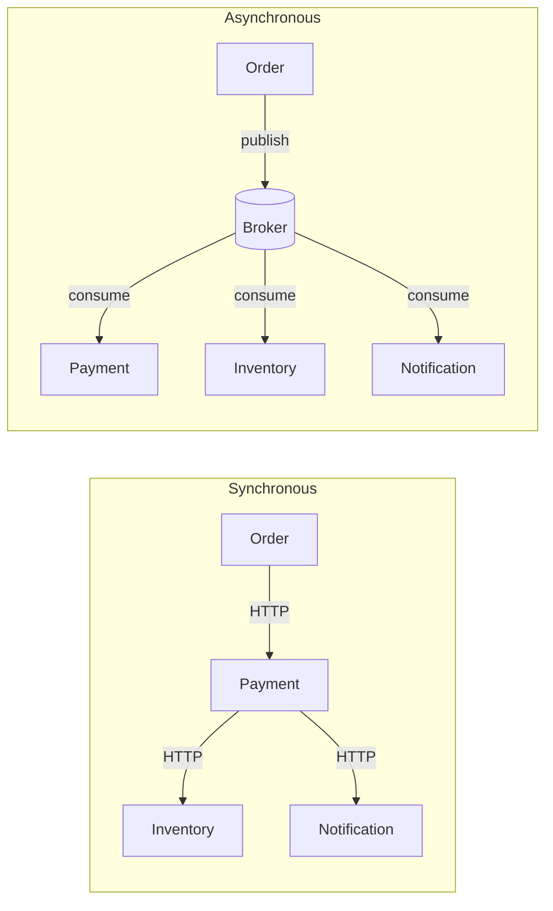
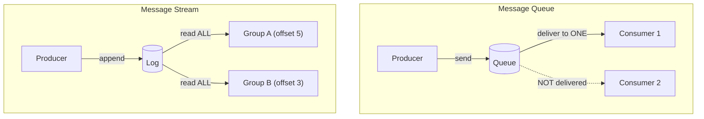
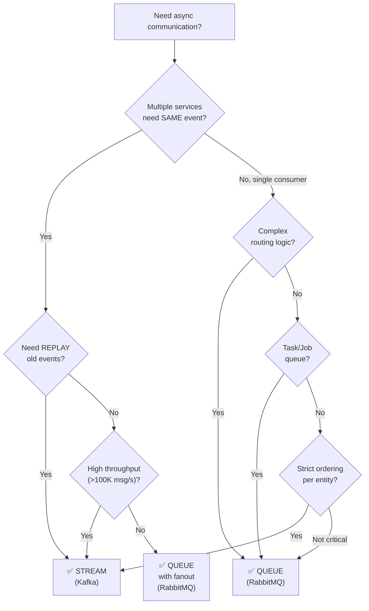
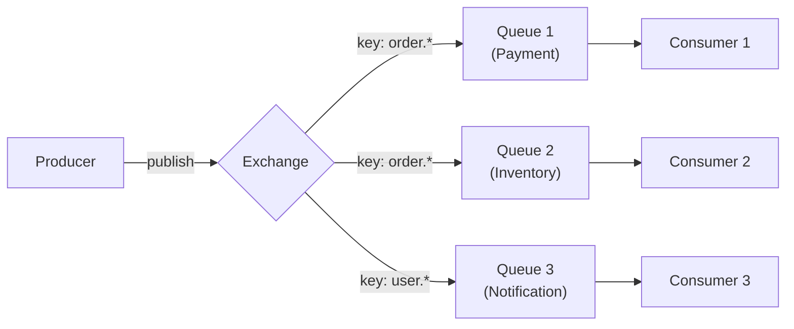
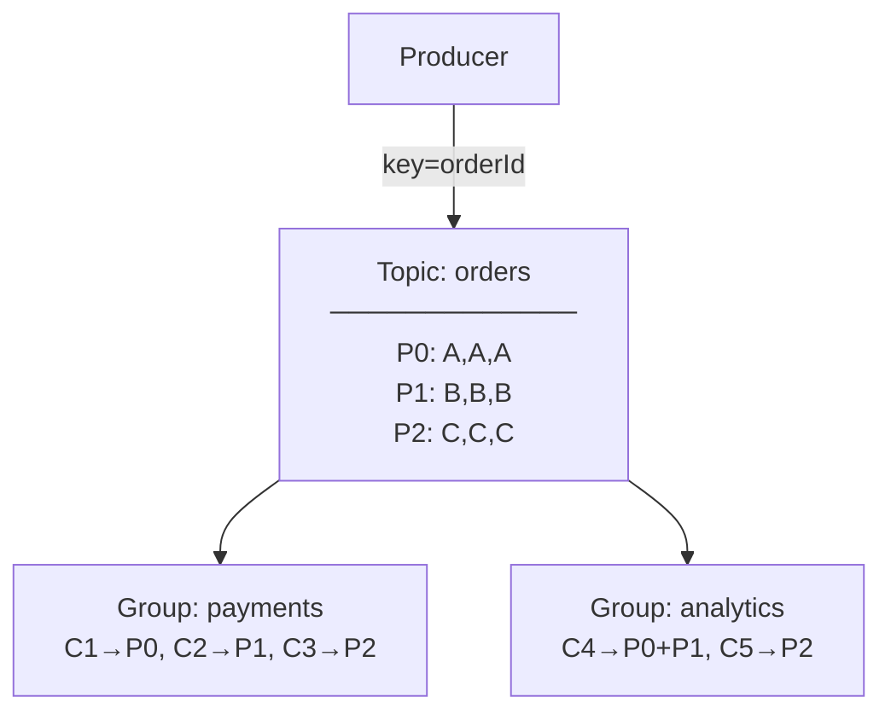
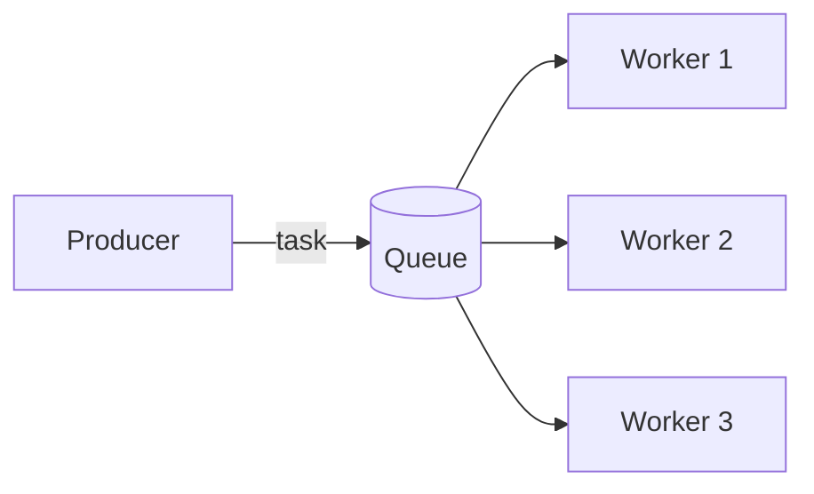
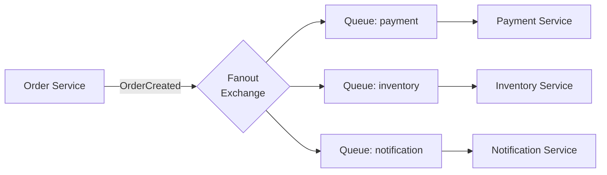
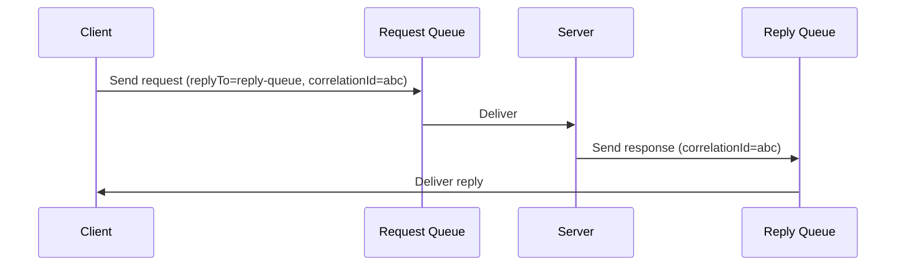
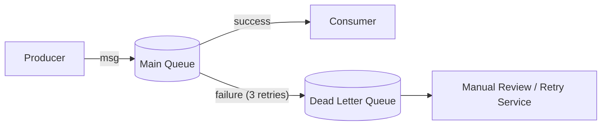
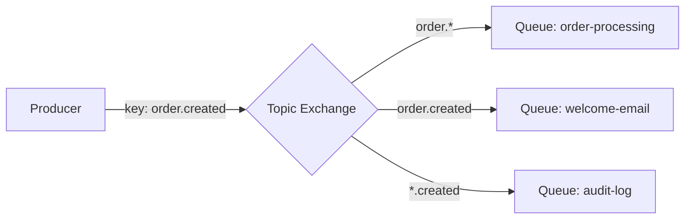

# Messaging & Event-Driven Patterns — Fundamentals

Message Queues vs Message Streams, communication models, broker
architectures, and when to use which.

---

## 1. Why Messaging in Microservices?

```text
SYNCHRONOUS (HTTP/gRPC):
  Order Service ──HTTP──▶ Payment Service ──HTTP──▶ Inventory Service

  Problems:
    1. TEMPORAL COUPLING — all services must be UP simultaneously
    2. CASCADING FAILURE — Payment down → Order down
    3. LATENCY CHAIN — total = sum of all service latencies
    4. TIGHT COUPLING — caller knows every downstream service
    5. NO BUFFERING — spike in orders → spike hits ALL services

ASYNCHRONOUS (Messaging):
  Order Service ──msg──▶ [  Broker  ] ──msg──▶ Payment Service
                                      ──msg──▶ Inventory Service

  Benefits:
    1. TEMPORAL DECOUPLING — services needn't be up at same time
    2. FAILURE ISOLATION — Payment down → messages queue up
    3. LOAD LEVELING — broker absorbs spikes
    4. LOOSE COUPLING — producer doesn't know consumers
    5. SCALABILITY — add more consumers to increase throughput
```



---

## 2. Two Fundamental Models

```text
  ┌───────────────────────────────────────────────────────────────┐
  │                     MESSAGE QUEUE                              │
  │                                                                │
  │  Producer ──▶ [  Q U E U E  ] ──▶ Consumer                   │
  │                                                                │
  │  - Point-to-point: each message to EXACTLY ONE consumer       │
  │  - Message REMOVED from queue after acknowledgment            │
  │  - Competing consumers: multiple consumers = load balancing   │
  │  - Order: FIFO (within a single queue)                        │
  │                                                                │
  │  Think: work queue, task distribution, command processing      │
  │  Examples: RabbitMQ (default), Amazon SQS, ActiveMQ           │
  └───────────────────────────────────────────────────────────────┘

  ┌───────────────────────────────────────────────────────────────┐
  │                     MESSAGE STREAM (LOG)                       │
  │                                                                │
  │  Producer ──▶ [ L O G ] ◀── Consumer A (offset 5)            │
  │                          ◀── Consumer B (offset 3)            │
  │                          ◀── Consumer C (offset 7)            │
  │                                                                │
  │  - Publish-subscribe + replay                                  │
  │  - Append-only log — messages persisted, NOT deleted           │
  │  - Multiple consumer groups each get ALL messages              │
  │  - Each consumer tracks its own OFFSET (position)             │
  │  - Replay: reset offset to re-read old messages               │
  │                                                                │
  │  Think: event log, audit trail, event sourcing, analytics      │
  │  Examples: Kafka, Amazon Kinesis, Azure Event Hubs, Pulsar    │
  └───────────────────────────────────────────────────────────────┘
```



---

## 3. Queue vs Stream — Deep Comparison

```text
  ┌──────────────────────┬──────────────────────┬───────────────────────┐
  │ Dimension            │ Message Queue         │ Message Stream        │
  ├──────────────────────┼──────────────────────┼───────────────────────┤
  │ Delivery model       │ Point-to-point        │ Pub-sub + replay      │
  │ Message lifetime     │ Deleted after ack     │ Retained (days/∞)     │
  │ Consumer model       │ Competing consumers   │ Consumer groups       │
  │ Replay               │ ❌ Not possible       │ ✅ Reset offset       │
  │ Ordering             │ FIFO per queue        │ Per partition          │
  │ Routing              │ Rich (exchange/bind)  │ Topic-based           │
  │ Throughput           │ Moderate (10K-100K/s) │ Very high (1M+/s)     │
  │ Latency              │ Lower (push-based)    │ Slightly higher (pull)│
  │ Backpressure         │ Queue depth           │ Consumer lag          │
  │ Complex routing      │ ✅ Headers, topics    │ ❌ Simple topic only  │
  │ Dead letter          │ Built-in (DLX)        │ Manual (DLT topic)    │
  │ Delayed messages     │ ✅ TTL + DLX trick    │ ❌ Not built-in       │
  │ Priority queues      │ ✅ Supported          │ ❌ Not supported      │
  │ Reprocessing         │ Must re-publish       │ Just reset offset     │
  │ Storage              │ Memory (mostly)       │ Disk (log)            │
  ├──────────────────────┼──────────────────────┼───────────────────────┤
  │ Best for             │ Task distribution     │ Event streaming       │
  │                      │ Job queues            │ Event sourcing        │
  │                      │ Request-reply         │ Data pipelines        │
  │                      │ Email/notif queues    │ Audit logs            │
  │                      │ Workflow orchestr.    │ Stream processing     │
  ├──────────────────────┼──────────────────────┼───────────────────────┤
  │ Examples             │ RabbitMQ, SQS         │ Kafka, Kinesis        │
  └──────────────────────┴──────────────────────┴───────────────────────┘
```

---

## 4. When to Use Which — Decision Flowchart



```text
  USE MESSAGE QUEUE (RabbitMQ / SQS) WHEN:
    ✅ Work distribution — "process this task"
    ✅ Command pattern — "do this thing"
    ✅ One-to-one delivery — exactly one worker per task
    ✅ Complex routing — headers, content type, priority
    ✅ Delayed messages — "send email in 30 minutes"
    ✅ Request-reply — async RPC
    ✅ Priority queues — urgent first
    ✅ Small to moderate throughput

  USE MESSAGE STREAM (Kafka / Kinesis) WHEN:
    ✅ Event broadcasting — "this happened" (N consumers)
    ✅ Event sourcing — events = source of truth
    ✅ Audit log / replay — reprocess history
    ✅ High throughput — millions/sec
    ✅ Stream processing — real-time analytics
    ✅ Per-entity ordering — partition by key
    ✅ Data pipeline / CDC — moving data between systems

  USE BOTH (common in large systems):
    Kafka for EVENT BROADCASTING (things that happened)
    RabbitMQ for TASK DISTRIBUTION (things to do)

    Order Service → Kafka "order-events" (event broadcast)
      → Payment, Analytics, Notification all consume
    Notification Service → RabbitMQ "email-queue" (task queue)
      → Email Worker 1, 2, 3 compete for tasks
```

---

## 5. Broker Architectures

### RabbitMQ — Exchange / Queue Model



```text
RabbitMQ EXCHANGE TYPES:

  1. DIRECT: route by exact routing key match
     key="order.created" → only queues bound with "order.created"

  2. TOPIC: route by pattern (wildcards)
     * = one word, # = zero or more
     "order.*" matches order.created, order.shipped
     "order.#" matches order.created, order.item.added

  3. FANOUT: broadcast to ALL bound queues (ignore key)
     Every queue gets a copy — true pub-sub

  4. HEADERS: route by message header key-value pairs
     x-match: all (match ALL headers) or any (match ANY)

  Flow: Producer → Exchange → Binding → Queue → Consumer
  ACK: consumer acks → removed. NACK → requeue or dead-letter.
```

### Kafka — Topic / Partition / Consumer Group



```text
Kafka's model:
  TOPIC — named feed, split into partitions
  PARTITION — ordered, immutable sequence, each msg has an offset
  CONSUMER GROUP — consumers cooperate; each partition → 1 consumer
  KEY — same key → same partition → ordering per entity
  RETENTION — messages kept for days (not deleted on consume)
```

---

## 6. Communication Patterns

### Pattern 1: Point-to-Point (Work Queue)



```text
  WHAT: One message → one consumer. Workers compete for messages.
  USE: Task distribution (image processing, PDF generation, email sending)
  BROKER: RabbitMQ (default), SQS
  GUARANTEE: At-least-once (with ack)

  Spring Boot (RabbitMQ):
    @RabbitListener(queues = "pdf-generation")
    public void processTask(PdfRequest request) { ... }
```

### Pattern 2: Publish-Subscribe (Fan-Out)



```text
  WHAT: One message → ALL subscribers. Each gets a copy.
  USE: Event notification to multiple services.
  BROKER: RabbitMQ (fanout exchange), Kafka (consumer groups)
  NOTE: RabbitMQ needs one queue per subscriber (fanout exchange)
        Kafka does this naturally (each consumer group = subscriber)
```

### Pattern 3: Request-Reply (Async RPC)



```text
  WHAT: Client sends request to queue, waits for response on reply queue.
  USE: Async RPC, long-running operations with result.
  BROKER: RabbitMQ (built-in replyTo + correlationId)
  SPRING: RabbitTemplate.convertSendAndReceive() handles this.
  CAUTION: Adds complexity. Prefer pure async (no reply) when possible.
```

### Pattern 4: Competing Consumers

```text
  Same as point-to-point, but the focus is on SCALING:

  Queue: email-tasks  ┬──▶ Worker 1 (processes ~100/min)
                       ├──▶ Worker 2 (processes ~100/min)
                       ├──▶ Worker 3 (processes ~100/min)
                       └──▶ Worker N (auto-scale based on queue depth)

  Total throughput = N × single-worker throughput
  Auto-scale: if queue depth > threshold → add workers
  RabbitMQ prefetch: limit how many unacked messages per consumer
```

### Pattern 5: Dead Letter Queue / Topic



```text
  WHAT: Messages that can't be processed go to a separate queue.
  TRIGGERS: Max retries exceeded, message expired (TTL), queue full.
  USE: Prevent poison messages from blocking the queue.

  RabbitMQ: Dead Letter Exchange (DLX) — built-in, configured per queue.
  Kafka: Dead Letter Topic (DLT) — manual, using DefaultErrorHandler.
```

### Pattern 6: Priority Queue

```text
  RabbitMQ supports priority queues natively:

  Queue declared with: x-max-priority: 10

  Producer sends:
    Message A (priority: 1) — low
    Message B (priority: 9) — high
    Message C (priority: 5) — medium

  Consumer receives: B → C → A (highest priority first)

  USE: VIP customer orders, urgent notifications, SLA-based processing.
  NOTE: Kafka does NOT support priorities. Use separate topics instead.
```

### Pattern 7: Delayed / Scheduled Messages

```text
  "Process this message AFTER a delay"

  RabbitMQ approach (TTL + DLX):
    1. Publish to "delay-queue" with TTL = 30 minutes
    2. delay-queue has DLX pointing to "processing-queue"
    3. After 30min → message expires → moves to processing-queue
    4. Consumer picks up from processing-queue

    Better: rabbitmq_delayed_message_exchange plugin

  USE: Retry with delay, scheduled notifications, order timeout
    "Cancel order if not paid within 30 minutes"

  Kafka: No built-in delay. Workarounds:
    - Publish with a "processAfter" timestamp, consumer checks + skips
    - Use a separate scheduling service
```

### Pattern 8: Message Routing (Content-Based)



```text
  RabbitMQ topic exchange:
    order.created → matches "order.*", "order.created", "*.created"
    order.shipped → matches "order.*" only
    user.created  → matches "*.created" only

  This is RabbitMQ's SUPERPOWER over Kafka.
  Kafka: you'd need separate topics or consumer-side filtering.
```

---

## 7. Spring Boot Integration — RabbitMQ

### Dependencies

```xml
<dependency>
    <groupId>org.springframework.boot</groupId>
    <artifactId>spring-boot-starter-amqp</artifactId>
</dependency>
```

### Configuration

```yaml
spring:
  rabbitmq:
    host: localhost
    port: 5672
    username: guest
    password: guest
    listener:
      simple:
        acknowledge-mode: manual    # manual ack for reliability
        prefetch: 10                # max unacked messages per consumer
        retry:
          enabled: true
          initial-interval: 1000
          max-attempts: 3
          multiplier: 2.0
```

### Declare Exchanges, Queues, Bindings

```java
@Configuration
public class RabbitConfig {

    // Exchange
    @Bean
    public TopicExchange orderExchange() {
        return new TopicExchange("order-exchange");
    }

    // Queues
    @Bean
    public Queue paymentQueue() {
        return QueueBuilder.durable("payment-queue")
                .withArgument("x-dead-letter-exchange", "dlx-exchange")
                .withArgument("x-dead-letter-routing-key", "dlq.payment")
                .build();
    }

    @Bean
    public Queue notificationQueue() {
        return QueueBuilder.durable("notification-queue").build();
    }

    // Bindings
    @Bean
    public Binding paymentBinding(Queue paymentQueue, TopicExchange orderExchange) {
        return BindingBuilder.bind(paymentQueue)
                .to(orderExchange)
                .with("order.created");
    }

    @Bean
    public Binding notificationBinding(Queue notificationQueue, TopicExchange orderExchange) {
        return BindingBuilder.bind(notificationQueue)
                .to(orderExchange)
                .with("order.*");  // all order events
    }

    // Dead Letter
    @Bean
    public DirectExchange dlxExchange() {
        return new DirectExchange("dlx-exchange");
    }

    @Bean
    public Queue deadLetterQueue() {
        return QueueBuilder.durable("payment-dlq").build();
    }

    @Bean
    public Binding dlqBinding(Queue deadLetterQueue, DirectExchange dlxExchange) {
        return BindingBuilder.bind(deadLetterQueue)
                .to(dlxExchange)
                .with("dlq.payment");
    }
}
```

### Producer

```java
@Service
@RequiredArgsConstructor
public class OrderEventPublisher {

    private final RabbitTemplate rabbitTemplate;

    public void publishOrderCreated(OrderCreatedEvent event) {
        rabbitTemplate.convertAndSend(
            "order-exchange",       // exchange
            "order.created",        // routing key
            event,                  // message body (auto-serialized to JSON)
            message -> {
                message.getMessageProperties().setContentType("application/json");
                message.getMessageProperties().setMessageId(UUID.randomUUID().toString());
                return message;
            }
        );
    }
}
```

### Consumer with Manual ACK

```java
@Service
@Slf4j
public class PaymentEventConsumer {

    @RabbitListener(queues = "payment-queue")
    public void handleOrderCreated(
            OrderCreatedEvent event,
            Channel channel,
            @Header(AmqpHeaders.DELIVERY_TAG) long deliveryTag) throws IOException {
        try {
            log.info("Processing payment for order: {}", event.orderId());
            paymentService.processPayment(event);
            channel.basicAck(deliveryTag, false);  // success → ack
        } catch (RetryableException e) {
            channel.basicNack(deliveryTag, false, true);  // requeue
        } catch (Exception e) {
            channel.basicNack(deliveryTag, false, false); // dead-letter
        }
    }
}
```

---

## 8. Spring Boot Integration — Kafka (Quick Reference)

```yaml
spring:
  kafka:
    bootstrap-servers: localhost:9092
    producer:
      key-serializer: org.apache.kafka.common.serialization.StringSerializer
      value-serializer: org.springframework.kafka.support.serializer.JsonSerializer
      acks: all
      properties:
        enable.idempotence: true
    consumer:
      group-id: order-service
      key-deserializer: org.apache.kafka.common.serialization.StringDeserializer
      value-deserializer: org.springframework.kafka.support.serializer.JsonDeserializer
      auto-offset-reset: earliest
      properties:
        spring.json.trusted.packages: "com.flowforge.event"
```

### Producer

```java
@Service
@RequiredArgsConstructor
public class WorkflowEventPublisher {

    private final KafkaTemplate<String, WorkflowEvent> kafkaTemplate;

    public void publish(WorkflowEvent event) {
        kafkaTemplate.send("workflow-events", event.workflowId(), event)
            .whenComplete((result, ex) -> {
                if (ex != null) {
                    log.error("Failed to publish event", ex);
                } else {
                    log.info("Published to partition {} offset {}",
                        result.getRecordMetadata().partition(),
                        result.getRecordMetadata().offset());
                }
            });
    }
}
```

### Consumer

```java
@Service
@Slf4j
public class WorkflowEventConsumer {

    @KafkaListener(topics = "workflow-events", groupId = "analytics-group")
    public void consume(
            @Payload WorkflowEvent event,
            @Header(KafkaHeaders.RECEIVED_PARTITION) int partition,
            @Header(KafkaHeaders.OFFSET) long offset) {

        log.info("Consumed event {} from partition {} offset {}",
                event.eventType(), partition, offset);
        analyticsService.process(event);
    }
}
```

---

## 9. Interview Questions

### Q1: When would you choose RabbitMQ over Kafka?

```text
RabbitMQ when:
  - Task distribution (each task → one worker)
  - Complex routing (headers, topic patterns, priorities)
  - Request-reply pattern (built-in support)
  - Delayed/scheduled messages
  - Lower throughput requirements
  - Traditional enterprise messaging (JMS compatibility)

Kafka when:
  - Event broadcasting (multiple independent consumers)
  - High throughput (millions/sec)
  - Need replay capability
  - Event sourcing / audit log
  - Stream processing
  - Ordering guarantees per entity

Both together:
  Kafka for event distribution, RabbitMQ for task queuing.
```

### Q2: A message is processed but the ACK is lost. What happens?

```text
Queue (RabbitMQ):
  - Broker doesn't get ACK → thinks message is unprocessed
  - Message redelivered to another consumer (or same one)
  - Result: DUPLICATE processing
  - Fix: make consumer IDEMPOTENT (check processedId table)

Stream (Kafka):
  - Consumer processed message at offset 5 but didn't commit offset
  - On restart: consumer re-reads from last committed offset (e.g., 4)
  - Messages 4 and 5 are reprocessed
  - Fix: idempotent consumer pattern

KEY INSIGHT: At-least-once delivery is the COMMON default.
  Exactly-once requires: idempotent producer + transactional consumer
  (Kafka supports this; RabbitMQ doesn't natively).
```

### Q3: How do you handle message ordering?

```text
RabbitMQ:
  - Single queue = FIFO ordering guaranteed
  - Multiple consumers on one queue = ordering NOT guaranteed
    (Consumer 1 gets msg A, Consumer 2 gets msg B,
     Consumer 2 finishes first → B processed before A)
  - Fix: single consumer per queue (kills scalability)
  - Fix: separate queues per entity (complex)

Kafka:
  - Ordering guaranteed PER PARTITION
  - Use entity ID as message key → same partition → same consumer
  - Example: key = orderId → all events for order-123 go to partition 2
  - Multiple partitions = parallel processing WITH per-entity ordering

  Winner for ordering: Kafka (naturally supports it via partitions)
```

### Q4: Your consumer is too slow. Queue depth keeps growing. What do you do?

```text
  STEP 1 — SCALE OUT: Add more consumer instances.
    Queue: more competing consumers
    Kafka: more consumers (up to partition count)

  STEP 2 — BATCH PROCESSING: Process messages in batches.
    @KafkaListener with batch = true

  STEP 3 — INCREASE PREFETCH: Consumer fetches more at once.
    RabbitMQ: prefetch = 50 (was 10)
    Kafka: max.poll.records = 500

  STEP 4 — OPTIMIZE CONSUMER: Profile the processing code.
    DB queries? → batch inserts, connection pool
    External API? → async, bulk endpoints

  STEP 5 — PARTITION (Kafka): Add more partitions = more parallelism.

  STEP 6 — PRIORITIZE: Process critical messages first (RabbitMQ priority).

  ANTI-PATTERN: Don't increase consumer timeout to hide the problem.
```

### Q5: Explain the Transactional Outbox pattern.

```text
  PROBLEM:
    Service saves to DB then publishes to Kafka.
    If Kafka publish fails → data saved but event lost.
    If DB commit fails after Kafka publish → event sent but data not saved.

  SOLUTION — Transactional Outbox:
    1. Save entity + outbox event IN SAME DB TRANSACTION
    2. Separate process reads outbox table → publishes to Kafka
    3. Marks outbox entry as published

    @Transactional
    public void createOrder(Order order) {
        orderRepo.save(order);
        outboxRepo.save(new OutboxEvent("OrderCreated", order.getId(), toJson(order)));
        // Both in SAME transaction — atomic
    }

    @Scheduled(fixedDelay = 1000)
    public void publishOutbox() {
        List<OutboxEvent> pending = outboxRepo.findByPublishedFalse();
        for (OutboxEvent event : pending) {
            kafkaTemplate.send("orders", event.getPayload());
            event.setPublished(true);
            outboxRepo.save(event);
        }
    }

  GUARANTEE: Event is ALWAYS published if data is saved.
  TRADE-OFF: Slight delay (polling interval). Use CDC for near-real-time.
```

### Q6: What's the difference between a Command and an Event?

```text
  COMMAND:                              EVENT:
  ─────────                             ──────
  "Do this"                             "This happened"
  Directed at ONE service               Broadcast to ANYONE interested
  Imperative (CreateOrder)              Past tense (OrderCreated)
  Sender knows the receiver             Sender doesn't know receivers
  Expects it to be handled              Fire and forget
  Can be rejected                       Already happened (fact)
  Usually via QUEUE                     Usually via STREAM/TOPIC

  Example:
    Command: SendEmailCommand → EmailService (queue, 1 consumer)
    Event: OrderCreated → Payment, Inventory, Notification (topic, N consumers)

  IMPORTANT:
    Commands = orchestration (one service controls flow)
    Events = choreography (services react independently)
```

### Q7: How do you prevent duplicate message processing?

```text
  AT-LEAST-ONCE delivery means duplicates WILL happen.

  SOLUTION 1 — Idempotency Key Table:
    processed_events (event_id PK, processed_at)
    Before processing: check if event_id exists
    If exists → skip. If not → process + insert.

  SOLUTION 2 — Database Constraints:
    UNIQUE constraint prevents duplicate inserts.
    INSERT ON CONFLICT DO NOTHING.

  SOLUTION 3 — Conditional Update:
    UPDATE orders SET status = 'PAID' WHERE id = ? AND status = 'PENDING'
    If already PAID → affected rows = 0 → skip.

  SOLUTION 4 — Kafka Exactly-Once:
    Idempotent producer (enable.idempotence=true)
    + Transactional consumer (isolation.level=read_committed)
    + Processing + offset commit in same transaction

  BEST PRACTICE: Always design consumers to be idempotent,
    regardless of delivery guarantee.
```

### Q8: Explain Consumer Group rebalancing in Kafka.

```text
  Rebalancing = redistributing partitions among consumers.

  TRIGGERS:
    - Consumer joins the group (new instance)
    - Consumer leaves (shutdown, crash, heartbeat timeout)
    - Partitions added to topic
    - Consumer takes too long to process (max.poll.interval.ms exceeded)

  DURING REBALANCE:
    - ALL consumers in the group STOP processing (stop-the-world)
    - Partitions are reassigned
    - Consumers resume from last committed offset

  PROBLEMS:
    - Processing pauses (latency spike)
    - Uncommitted offsets → duplicate processing after rebalance

  FIXES:
    - Cooperative Sticky Assignor (only affected partitions move)
    - Static group membership (group.instance.id — avoids rebalance on restart)
    - Tune: session.timeout.ms, heartbeat.interval.ms, max.poll.interval.ms
```

### Q9: Design a notification system — which broker and patterns?

```text
  Requirements:
    - Multiple event sources (Order, Payment, User services)
    - Multiple channels (email, SMS, push notification)
    - Priority support (urgent vs normal)
    - Retry on failure
    - At-least-once delivery

  Architecture:
    Kafka "notification-events" topic ← all services publish events
    Notification Service consumes from Kafka
    Notification Service routes to channel-specific RabbitMQ queues:
      - email-queue (priority: 0-10)
      - sms-queue
      - push-queue
    Workers consume from each queue (competing consumers)
    Failed messages → DLQ per channel
    Retry service reads DLQ → republishes after delay

  WHY BOTH:
    Kafka: durable event log, replay, multiple consumers
    RabbitMQ: priority queues, per-channel routing, delayed retry
```

### Q10: What happens when a Kafka broker goes down?

```text
  Kafka is designed for this:

  1. Partitions have REPLICAS across brokers
     Topic "orders" P0: Broker1(leader), Broker2(follower), Broker3(follower)

  2. Broker1 goes down:
     - Controller detects via ZooKeeper/KRaft heartbeat
     - Elects new leader for P0 (e.g., Broker2)
     - Producers/consumers redirect to new leader
     - If acks=all: no data loss (replicas are in-sync)

  3. Broker1 comes back:
     - Catches up from current leader (fetches missed messages)
     - Becomes a follower (or leader if preferred replica election)

  KEY CONFIGS:
    acks=all — producer waits for ALL in-sync replicas
    min.insync.replicas=2 — at least 2 replicas must ack
    unclean.leader.election.enable=false — don't elect out-of-sync replica
```
