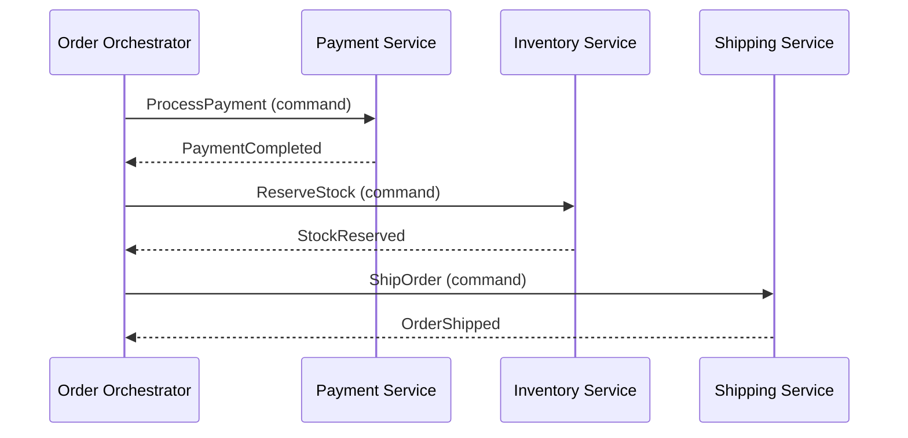
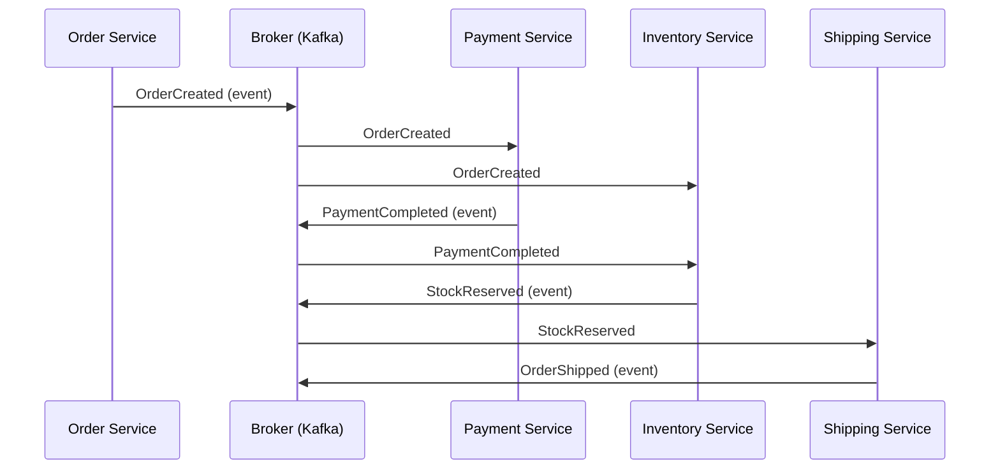
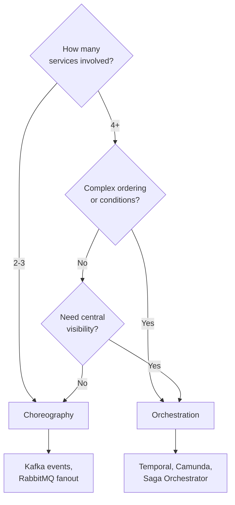
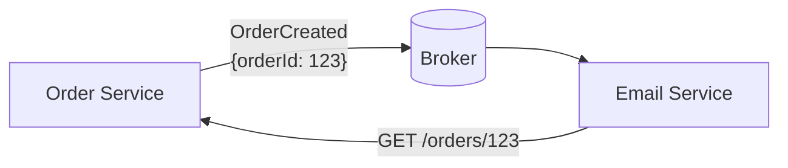
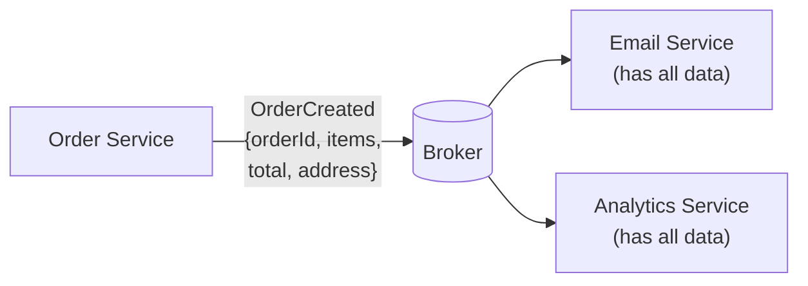
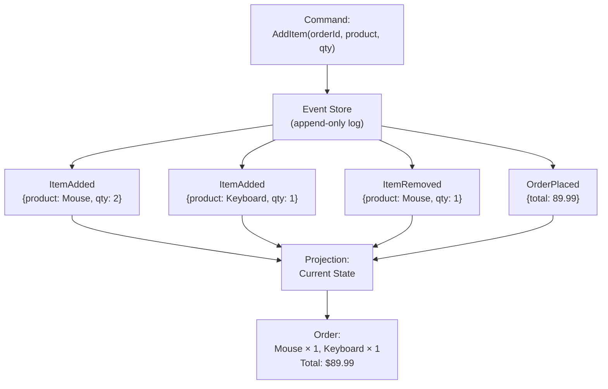
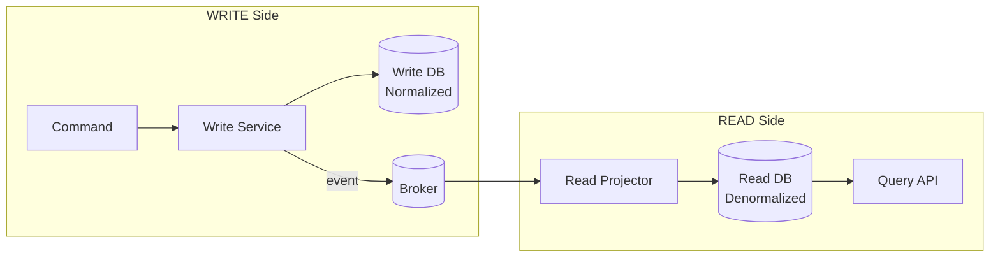
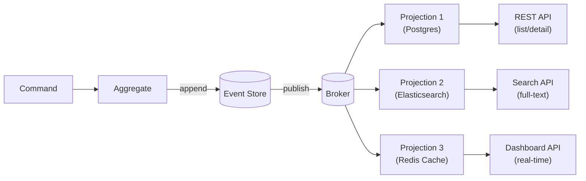
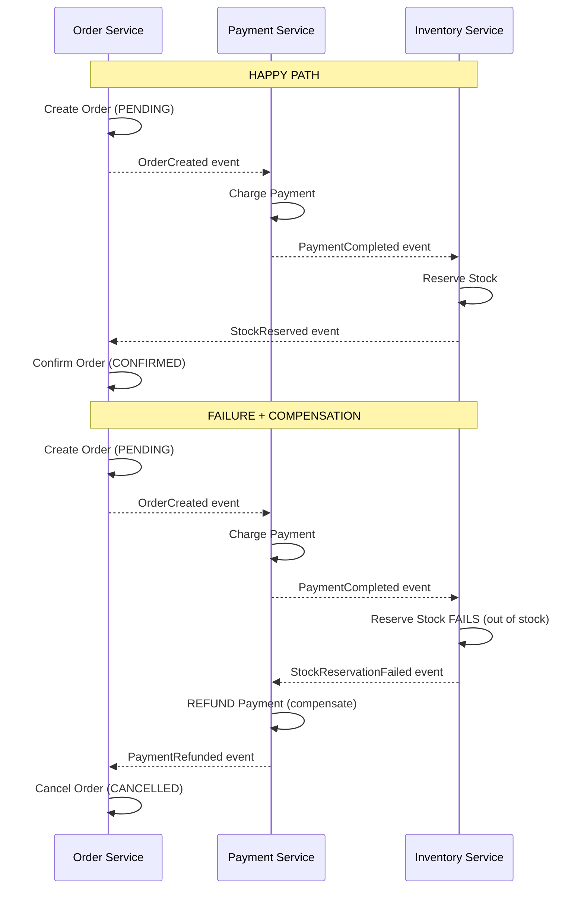
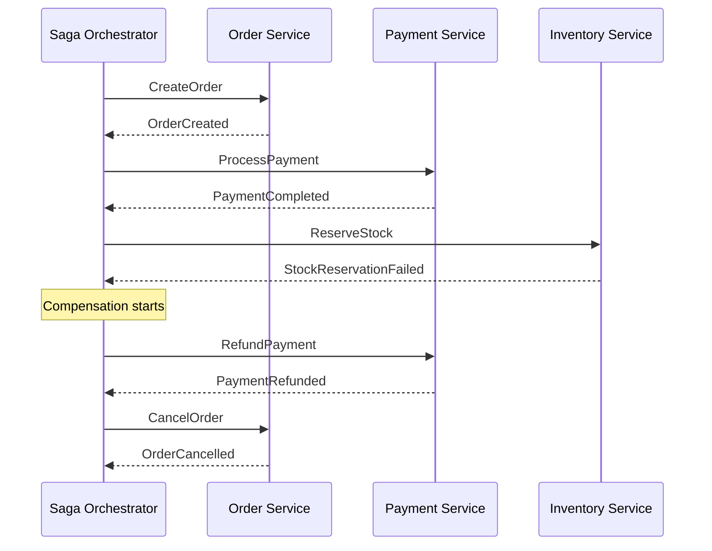

# Event-Driven Architecture Patterns

Choreography vs Orchestration, Event Notification, Event-Carried State
Transfer, Event Sourcing, CQRS, Saga patterns, and production practices.

---

## 1. Two Coordination Styles

```text
  When multiple services must collaborate on a business process,
  there are exactly TWO coordination styles:

  ORCHESTRATION — a central coordinator tells each service what to do.
  CHOREOGRAPHY — each service reacts to events independently.
```

### Orchestration



```text
  ORCHESTRATION:
    ✅ Central control — easy to understand the whole flow
    ✅ Easy to add steps, change order, add conditions
    ✅ Error handling centralized
    ❌ Orchestrator is a single point of failure
    ❌ Orchestrator must know about every service
    ❌ Tighter coupling (orchestrator → all services)

  IMPLEMENTATION:
    - Message queue (send commands to each service)
    - Saga orchestrator pattern
    - Workflow engines (Temporal, Camunda)

  USE WHEN:
    - Complex business process with many steps
    - Steps have ordering, conditions, branching
    - You need visibility into the process state
    - Error recovery is complex
```

### Choreography



```text
  CHOREOGRAPHY:
    ✅ Loose coupling — services react independently
    ✅ No single point of failure
    ✅ Easy to add new consumers (just subscribe)
    ✅ Each service owns its own logic
    ❌ Hard to understand the full flow (spread across services)
    ❌ Hard to debug (no central view)
    ❌ Circular dependencies possible
    ❌ Error handling distributed (each service handles own failures)

  IMPLEMENTATION:
    - Event bus / message stream (Kafka topics)
    - Each service publishes events, subscribes to relevant events

  USE WHEN:
    - Simple flows (2-4 steps)
    - Services should be fully independent
    - New consumers may be added frequently
    - No complex branching or conditions
```

### Decision: Orchestration vs Choreography



---

## 2. Four Event Patterns (Martin Fowler)

```text
Martin Fowler identified four patterns for how services use events:

  1. EVENT NOTIFICATION
  2. EVENT-CARRIED STATE TRANSFER
  3. EVENT SOURCING
  4. CQRS (Command Query Responsibility Segregation)

Each solves different problems. Each has different trade-offs.
```

### Pattern 1: Event Notification



```text
  WHAT:
    Service publishes a THIN event: "something happened" + ID.
    Consumers that need details CALL BACK to the source service.

  EVENT PAYLOAD:
    { "eventType": "OrderCreated", "orderId": "123", "timestamp": "..." }
    Minimal — just enough to identify what happened.

  FLOW:
    1. Order Service publishes OrderCreated { orderId: 123 }
    2. Email Service receives event
    3. Email Service calls GET /orders/123 to get details
    4. Email Service sends confirmation email

  PROS:
    ✅ Simple event schema (just IDs)
    ✅ Source service controls data access
    ✅ Events are small (low bandwidth)

  CONS:
    ❌ Consumer depends on source service being UP (callback)
    ❌ N consumers = N callbacks = load on source service
    ❌ Temporal coupling reintroduced (need callback to work)
    ❌ Extra latency (event + API call)

  USE WHEN:
    - Consumer needs fresh, up-to-date data
    - Event payload would be very large
    - Access control matters (not all consumers should see all data)
```

### Pattern 2: Event-Carried State Transfer



```text
  WHAT:
    Event carries ALL the data the consumer needs.
    No callback required. Consumer is self-sufficient.

  EVENT PAYLOAD:
    {
      "eventType": "OrderCreated",
      "orderId": "123",
      "customerId": "456",
      "customerEmail": "john@example.com",
      "items": [...],
      "totalAmount": 99.99,
      "shippingAddress": { ... },
      "timestamp": "..."
    }

  FLOW:
    1. Order Service publishes fat OrderCreated event
    2. Email Service receives event with ALL order + customer data
    3. Email Service sends email (no callback needed)

  PROS:
    ✅ Consumer fully decoupled (no callback, no dependency on source)
    ✅ Works even if source service is down
    ✅ Lower latency (no extra API call)
    ✅ Consumer can build local read model (local cache/DB)

  CONS:
    ❌ Larger event payload (bandwidth)
    ❌ Data duplication across services
    ❌ Data can become stale (consumer has old copy)
    ❌ Schema coupling (event schema = contract)

  USE WHEN:
    - Consumer must work independently (no callbacks)
    - Consumer needs data for processing, not just notification
    - Building local read replicas / caches
    - Most common pattern in practice
```

### Pattern 3: Event Sourcing



```text
  WHAT:
    Instead of storing CURRENT STATE, store every STATE CHANGE as an event.
    Current state = replay all events from the beginning.

  TRADITIONAL (State-Based):
    orders table: { id: 123, items: [...], total: 89.99, status: PLACED }
    Each UPDATE overwrites previous state. History is LOST.

  EVENT SOURCING:
    event_store: [
      { type: "ItemAdded",   data: { product: "Mouse", qty: 2 } },
      { type: "ItemAdded",   data: { product: "Keyboard", qty: 1 } },
      { type: "ItemRemoved", data: { product: "Mouse", qty: 1 } },
      { type: "OrderPlaced", data: { total: 89.99 } }
    ]
    Current state = fold(events) → Order with Mouse×1, Keyboard×1

  PROS:
    ✅ Complete audit trail (every change recorded)
    ✅ Time travel (reconstruct state at any point in time)
    ✅ Debugging (replay events to reproduce bugs)
    ✅ Event replay (rebuild read models, fix projections)
    ✅ Natural fit for CQRS

  CONS:
    ❌ Complexity (projections, snapshots, versioning)
    ❌ Eventual consistency (projections may lag)
    ❌ Event schema evolution is hard
    ❌ Querying current state requires projection (not direct SELECT)
    ❌ Performance: long event streams → slow rebuild → need snapshots

  USE WHEN:
    - Audit trail is a hard requirement (finance, healthcare)
    - Need to replay/reprocess events
    - Domain is naturally event-based (shopping cart, game state)
    - Combined with CQRS for read optimization

  DON'T USE WHEN:
    - Simple CRUD (overkill)
    - Team is not experienced with the pattern
    - No real need for history
```

### Pattern 4: CQRS — Command Query Responsibility Segregation



```text
  WHAT:
    Separate the WRITE model (commands) from the READ model (queries).
    Write DB is optimized for writes (normalized).
    Read DB is optimized for reads (denormalized, materialized views).

  WHY:
    In most systems, reads outnumber writes 10:1 or 100:1.
    The optimal schema for writes ≠ optimal schema for reads.

    Write model: normalized, enforces constraints, ACID
    Read model: denormalized, pre-joined, fast queries, no JOINs

  FLOW:
    1. Client sends CreateOrder command → Write Service
    2. Write Service validates, saves to Write DB, publishes OrderCreated event
    3. Read Projector consumes event → updates Read DB (denormalized view)
    4. Client queries Read API → fast read from denormalized Read DB

  PROS:
    ✅ Read and write models optimized independently
    ✅ Scale reads independently (add read replicas)
    ✅ Different DBs for different needs (Postgres write, Elasticsearch read)
    ✅ Simpler queries (no complex JOINs in read model)

  CONS:
    ❌ Eventual consistency between write and read models
    ❌ Complexity (two models, sync logic, event handling)
    ❌ Stale reads (read model may lag behind write)

  USE WHEN:
    - Reads greatly outnumber writes
    - Complex read queries that are slow on normalized schema
    - Need different storage technologies for read vs write
    - Combined with Event Sourcing

  DON'T USE WHEN:
    - Simple CRUD application
    - Strong consistency required (user must see write immediately)
    - Small scale (not worth the complexity)
```

### CQRS + Event Sourcing Together



```text
  Event Sourcing = store events as source of truth
  CQRS = separate read and write models
  Together = events from event store build multiple read projections

  Each projection can use a DIFFERENT database:
    - Postgres for relational queries
    - Elasticsearch for full-text search
    - Redis for real-time dashboards
    - MongoDB for document-based queries

  All projections built from the SAME event stream.
  Add a new projection anytime → replay events → build it.
```

---

## 3. Saga Pattern — Distributed Transactions

```text
  PROBLEM:
    Microservices each have their own database.
    No distributed transactions (2PC is slow, fragile, blocks).
    How to maintain consistency across multiple services?

  SOLUTION: SAGA
    A saga is a sequence of LOCAL transactions.
    Each service executes its own transaction and publishes an event.
    If any step fails → execute COMPENSATING transactions to undo.
```

### Choreography-Based Saga



```text
  CHOREOGRAPHY SAGA:
    Each service listens for events and acts.
    No central coordinator.

    Happy path: A → B → C → done
    Failure at C: C fails → B compensates → A compensates

  COMPENSATING TRANSACTIONS:
    CreateOrder  →  compensate: CancelOrder
    ChargePayment →  compensate: RefundPayment
    ReserveStock  →  compensate: ReleaseStock
    ShipOrder     →  compensate: ??? (can't un-ship!)

  IMPORTANT: Some steps are NOT compensatable.
    Once an item is shipped, you can't un-ship it.
    These are called PIVOT TRANSACTIONS — they're the point of no return.
    Design sagas so non-compensatable steps come LAST.
```

### Orchestration-Based Saga



```text
  ORCHESTRATION SAGA:
    A central orchestrator directs each step.
    Knows the full workflow, handles failures and compensation.

  PROS over choreography:
    ✅ Easy to understand (flow in one place)
    ✅ Easy to add/modify/reorder steps
    ✅ Centralized error handling
    ✅ Better for complex sagas (5+ steps)

  CONS:
    ❌ Orchestrator is a coupling point
    ❌ Single point of failure (mitigate with HA)
    ❌ Risk of becoming a "god service"

  IMPLEMENTATION:
    - Custom state machine (Spring StateMachine)
    - Workflow engines (Temporal, Camunda, AWS Step Functions)
```

### Saga Comparison

```text
  ┌────────────────────┬───────────────────────┬─────────────────────────┐
  │ Aspect             │ Choreography Saga     │ Orchestration Saga      │
  ├────────────────────┼───────────────────────┼─────────────────────────┤
  │ Coordination       │ Decentralized         │ Centralized             │
  │ Coupling           │ Loose                 │ Tighter (orchestrator)  │
  │ Complexity         │ Grows fast with steps │ Linear growth           │
  │ Visibility         │ Poor (spread around)  │ Good (one place)        │
  │ Error handling     │ Each service           │ Orchestrator            │
  │ Adding steps       │ Subscribe to events   │ Modify orchestrator     │
  │ Debugging          │ Hard (distributed)    │ Easier (central logs)   │
  │ Best for           │ 2-4 simple steps      │ 4+ complex steps        │
  │ Implementation     │ Events on Kafka       │ Temporal, Camunda       │
  └────────────────────┴───────────────────────┴─────────────────────────┘
```

---

## 4. Spring Boot: Event-Driven with Application Events

```text
Before reaching for Kafka or RabbitMQ, consider Spring's INTERNAL
event system for intra-service communication.
```

### Spring ApplicationEvent

```java
// Event
public record OrderCreatedEvent(UUID orderId, String customerEmail, BigDecimal total) {}

// Publisher
@Service
@RequiredArgsConstructor
public class OrderService {
    private final ApplicationEventPublisher eventPublisher;

    @Transactional
    public Order createOrder(CreateOrderRequest request) {
        Order order = orderRepo.save(mapToEntity(request));
        eventPublisher.publishEvent(
            new OrderCreatedEvent(order.getId(), request.email(), order.getTotal()));
        return order;
    }
}

// Listener (runs in SAME thread, SAME transaction by default)
@Component
@Slf4j
public class InventoryListener {
    @EventListener
    public void onOrderCreated(OrderCreatedEvent event) {
        log.info("Reserving stock for order {}", event.orderId());
        inventoryService.reserve(event.orderId());
    }
}

// Listener (runs AFTER transaction commits)
@Component
public class EmailListener {
    @TransactionalEventListener(phase = TransactionPhase.AFTER_COMMIT)
    public void onOrderCreated(OrderCreatedEvent event) {
        emailService.sendConfirmation(event.customerEmail(), event.orderId());
    }
}

// Async listener (different thread)
@Component
public class AnalyticsListener {
    @Async
    @EventListener
    public void onOrderCreated(OrderCreatedEvent event) {
        analyticsService.track("order_created", event.orderId());
    }
}
```

```text
  WHEN TO USE:

  Spring ApplicationEvent:
    ✅ Communication WITHIN a single service
    ✅ Decoupling components inside a monolith
    ✅ @TransactionalEventListener for post-commit actions
    ❌ NOT for cross-service communication
    ❌ NOT durable (if app crashes, event is lost)

  Kafka / RabbitMQ:
    ✅ Cross-service communication
    ✅ Durable (messages persist even if consumer is down)
    ✅ Replay, DLQ, consumer groups
```

---

## 5. Production Patterns

### Idempotent Consumer

```java
@Service
@RequiredArgsConstructor
public class PaymentEventHandler {

    private final ProcessedEventRepository processedRepo;
    private final PaymentService paymentService;

    @KafkaListener(topics = "order-events")
    @Transactional
    public void handle(OrderCreatedEvent event) {
        // Idempotency check
        if (processedRepo.existsById(event.eventId())) {
            log.info("Event {} already processed, skipping", event.eventId());
            return;
        }

        // Process
        paymentService.processPayment(event.orderId(), event.totalAmount());

        // Mark as processed (in SAME transaction)
        processedRepo.save(new ProcessedEvent(event.eventId(), Instant.now()));
    }
}
```

### Transactional Outbox (Spring Boot)

```java
@Entity
@Table(name = "outbox_events")
public class OutboxEvent {
    @Id @GeneratedValue(strategy = GenerationType.UUID)
    private UUID id;
    private String aggregateType;    // "Order"
    private String aggregateId;      // "order-123"
    private String eventType;        // "OrderCreated"

    @Column(columnDefinition = "JSONB")
    private String payload;

    private Instant createdAt;
    private boolean published;
}

@Service
@RequiredArgsConstructor
public class OrderService {
    private final OrderRepository orderRepo;
    private final OutboxRepository outboxRepo;

    @Transactional  // SAME transaction for both
    public Order createOrder(CreateOrderRequest req) {
        Order order = orderRepo.save(mapToEntity(req));
        outboxRepo.save(new OutboxEvent(
            "Order", order.getId().toString(), "OrderCreated",
            toJson(order), Instant.now(), false));
        return order;
    }
}

@Service
@RequiredArgsConstructor
public class OutboxPublisher {
    private final OutboxRepository outboxRepo;
    private final KafkaTemplate<String, String> kafkaTemplate;

    @Scheduled(fixedDelay = 1000)
    @Transactional
    public void publishPendingEvents() {
        List<OutboxEvent> events = outboxRepo
            .findTop50ByPublishedFalseOrderByCreatedAt();
        for (OutboxEvent event : events) {
            kafkaTemplate.send(
                event.getAggregateType().toLowerCase() + "-events",
                event.getAggregateId(),
                event.getPayload());
            event.setPublished(true);
        }
    }
}
```

### Inbox Pattern (Idempotent Consumer + Ordering)

```text
  The INBOX is the consumer-side counterpart of the OUTBOX.

  OUTBOX: Producer side — guarantee event IS published
  INBOX: Consumer side — guarantee event is processed EXACTLY ONCE

  inbox_messages table:
    (message_id PK, received_at, processed_at, status)

  Flow:
    1. Receive message → INSERT into inbox (if not exists → new)
    2. If already exists → skip (duplicate)
    3. Process message → update status to PROCESSED
    4. All in same @Transactional

  Combines idempotency + transactional processing.
```

---

## 6. Event Schema Design

```text
  GOOD EVENT DESIGN:

  {
    "eventId": "evt-uuid-123",            // unique per event
    "eventType": "OrderCreated",          // what happened
    "aggregateType": "Order",             // entity type
    "aggregateId": "order-456",           // entity ID (Kafka key)
    "version": 1,                         // schema version
    "timestamp": "2024-07-15T10:30:00Z",  // when it happened
    "source": "order-service",            // which service
    "correlationId": "req-789",           // trace across services
    "data": {                             // event-specific payload
      "customerId": "cust-101",
      "items": [...],
      "totalAmount": 99.99
    }
  }

  RULES:
    1. eventId — ALWAYS include (enables idempotency)
    2. eventType — past tense verb (OrderCreated, not CreateOrder)
    3. aggregateId — use as Kafka key (ordering per entity)
    4. version — enables schema evolution
    5. timestamp — ISO 8601 UTC always
    6. correlationId — trace request across services
    7. data — only domain-relevant fields (no internal DB IDs)

  SCHEMA EVOLUTION:
    - Add fields: OK (backward compatible)
    - Remove fields: BREAKING (add deprecation period)
    - Change field type: BREAKING (use new field name instead)
    - Use Schema Registry (Avro/Protobuf) for enforcement
```

---

## 7. Interview Questions

### Q1: Choreography vs Orchestration — when to use which?

```text
  Choreography:
    - 2-4 services, simple linear flow
    - Services are truly independent
    - Adding new consumers frequently
    - Example: OrderCreated → Payment, Inventory, Notification

  Orchestration:
    - 4+ services, complex flow with conditions/branches
    - Need centralized visibility and monitoring
    - Complex compensation logic
    - Example: Travel booking (flight + hotel + car with rollback)

  Hybrid (common in practice):
    - Orchestrate the critical path (order → payment → inventory)
    - Choreograph the side effects (notifications, analytics, audit)
```

### Q2: How do you handle a saga step that cannot be compensated?

```text
  PIVOT TRANSACTION: a step that can't be undone.
    - Shipping: can't un-ship a package
    - External payment: charge went through
    - Email sent: can't unsend

  STRATEGIES:
  1. Put non-compensatable steps LAST in the saga
     Reserve stock → Charge payment → THEN ship
     If shipping fails → refund + release stock (both compensatable)

  2. Use TWO-PHASE approach:
     First: RESERVE (compensatable) → reserve stock, authorize payment
     Then: CONFIRM (non-compensatable) → deduct stock, capture payment
     Failure during reserve → easy compensation
     Only confirm after all reserves succeed

  3. Accept and handle:
     Ship happened, then later step fails → create return/refund workflow
     Not all failures need instant compensation
```

### Q3: Event Notification vs Event-Carried State Transfer?

```text
  Event Notification (thin events):
    { type: "OrderCreated", orderId: "123" }
    Consumer calls back for details.
    + Small events, fresh data
    - Callback coupling, source must be up

  Event-Carried State Transfer (fat events):
    { type: "OrderCreated", orderId: "123", items: [...], total: 99.99, ... }
    Consumer has everything it needs.
    + Fully decoupled, works offline
    - Larger events, data can be stale

  IN PRACTICE:
    Most teams use Event-Carried State Transfer because:
    - Eliminates callback dependency (true decoupling)
    - Simpler consumer logic (no API calls)
    - Better performance (one message vs message + API call)
    - Stale data is acceptable in most cases

  EXCEPTION: Use thin events when:
    - Payload would be very large (e.g., file content)
    - Consumer always needs the latest state anyway
    - Security: not all consumers should see all data
```

### Q4: When would you use Event Sourcing?

```text
  USE Event Sourcing when:
    ✅ Complete audit trail is a REQUIREMENT (finance, healthcare, legal)
    ✅ Need time-travel queries ("state of order at 3pm yesterday")
    ✅ Domain naturally event-based (shopping cart, game, collaboration)
    ✅ Need to rebuild read models from scratch
    ✅ Debugging by replaying events is valuable

  DON'T USE when:
    ❌ Simple CRUD (massive overkill)
    ❌ Team has no experience with the pattern
    ❌ Strong consistency required for reads
    ❌ No real need for historical state
    ❌ Simple reporting suffices (don't need full event history)

  REAL-WORLD USERS:
    - Banking: every transaction is an event
    - Trading: order book = sequence of events
    - Git: commits are events, working directory is projection
    - Accounting: ledger entries are events, balance is projection
```

### Q5: How do you ensure ordering in an event-driven system?

```text
  GLOBAL ORDERING: Almost never possible or needed.
  PER-ENTITY ORDERING: Achievable and usually sufficient.

  Kafka:
    - Same key → same partition → one consumer → ordered
    - key = orderId → all order-123 events in order
    - Different entities may be in different order (fine)

  RabbitMQ:
    - Single queue, single consumer → ordered
    - Multiple consumers → NOT ordered
    - Workaround: consistent hashing exchange (route by key)

  Application-level:
    - Version/sequence number in event
    - Consumer checks: if event.version != expected → buffer/retry
    - Reject out-of-order events and let them be redelivered

  MOST IMPORTANT INSIGHT:
    You usually only need ordering PER ENTITY, not globally.
    "All events for order-123 in order" — YES
    "All events for all orders in order" — usually NOT needed
```

### Q6: Design an e-commerce order flow using events.

```text
  Services: Order, Payment, Inventory, Notification, Analytics

  EVENTS:
    OrderCreated      → Payment: charge customer
                      → Inventory: check + reserve stock
                      → Analytics: track order

    PaymentCompleted  → Order: update status to PAID
                      → Notification: send payment confirmation

    PaymentFailed     → Order: update status to PAYMENT_FAILED
                      → Notification: send payment failure email
                      → Inventory: release reserved stock

    StockReserved     → Order: update status to CONFIRMED
    StockInsufficient → Order: update status to OUT_OF_STOCK
                      → Payment: refund
                      → Notification: notify customer

    OrderShipped      → Notification: send tracking email
                      → Analytics: track fulfillment

  BROKER: Kafka (event log, replay, ordering by orderId)
  COMPENSATION: PaymentFailed → release stock, StockInsufficient → refund
  IDEMPOTENCY: Each consumer checks event_id before processing
  OUTBOX: Order Service uses outbox table for reliable event publishing
```

### Q7: What is the Inbox/Outbox pattern?

```text
  OUTBOX (producer side):
    Problem: DB save + Kafka publish is NOT atomic
    Solution: Save event to outbox TABLE in same DB transaction
              Separate job polls outbox → publishes to Kafka

  INBOX (consumer side):
    Problem: Kafka delivers at-least-once → duplicates
    Solution: Save incoming event_id to inbox TABLE
              Check before processing → skip if already processed

  Together they give EXACTLY-ONCE SEMANTICS end-to-end:
    Producer → [Outbox → Kafka → Inbox] → Consumer
    Outbox guarantees "published at least once"
    Inbox guarantees "processed exactly once"
```

### Q8: Spring ApplicationEvent vs Kafka — when to use which?

```text
  Spring ApplicationEvent:
    ✅ WITHIN a single service (same JVM)
    ✅ Decoupling components inside one app
    ✅ @TransactionalEventListener for post-commit hooks
    ✅ Zero infrastructure (no broker needed)
    ❌ Not durable (lost on crash)
    ❌ Not cross-service

  Kafka / RabbitMQ:
    ✅ BETWEEN services (distributed)
    ✅ Durable (persisted to disk)
    ✅ Replay, DLQ, consumer groups
    ✅ Scales independently
    ❌ Infrastructure overhead (broker cluster)
    ❌ Operational complexity

  EVOLUTION PATH:
    Start with Spring ApplicationEvent (monolith)
    → Extract to Kafka when splitting into microservices
    Keep @TransactionalEventListener as internal bridge to outbox
```
