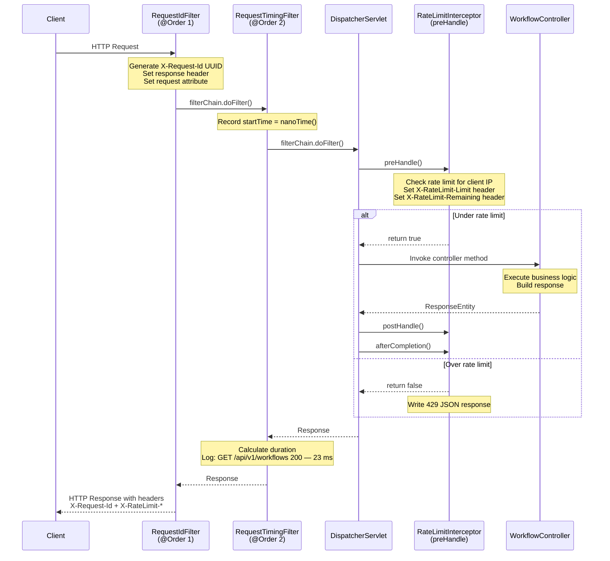
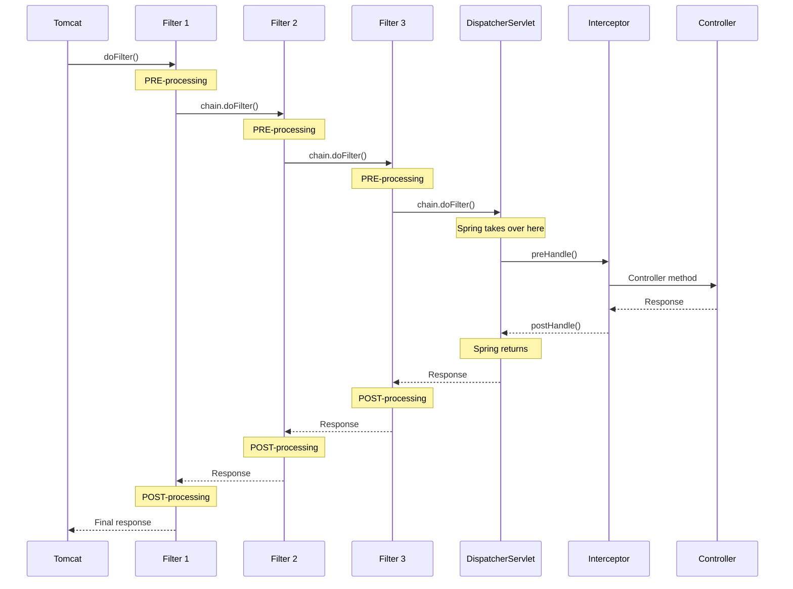
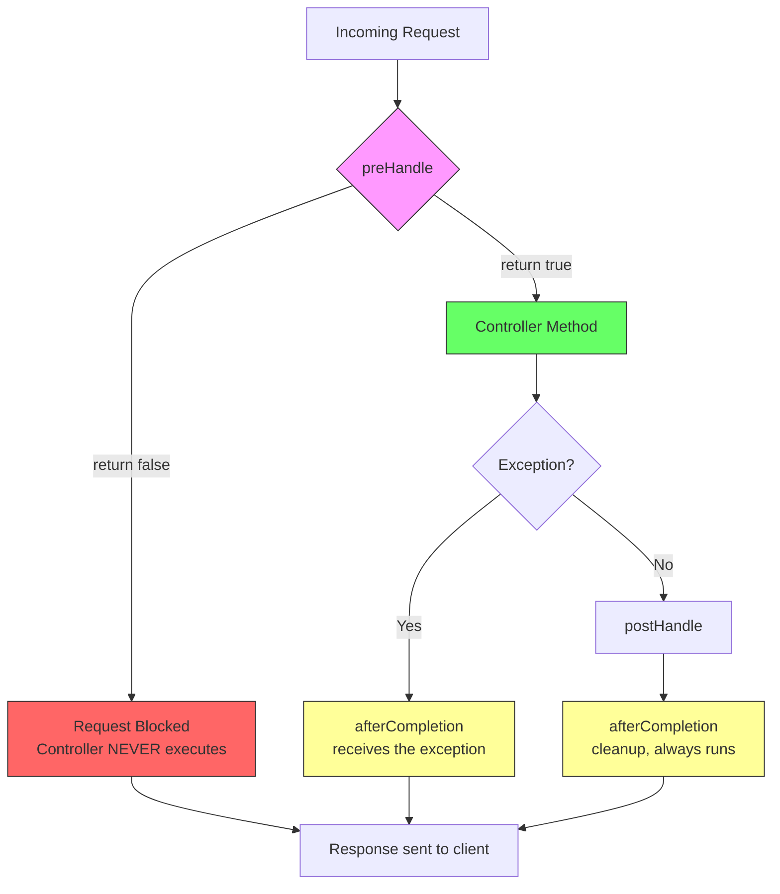
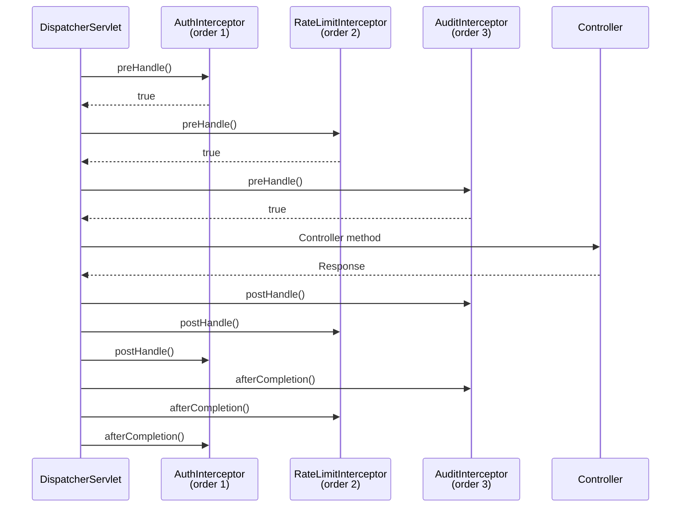
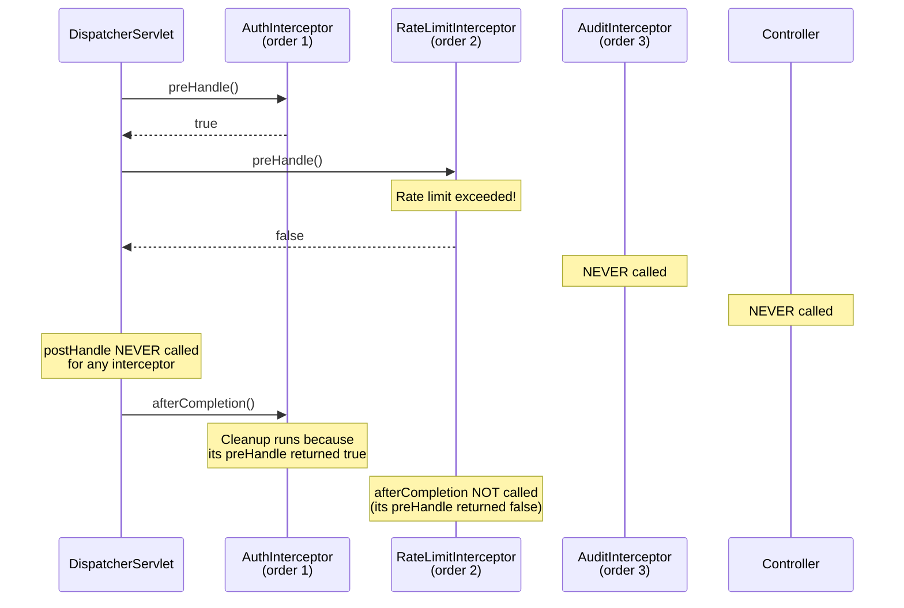
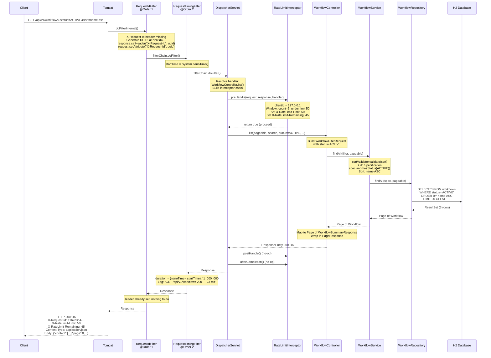
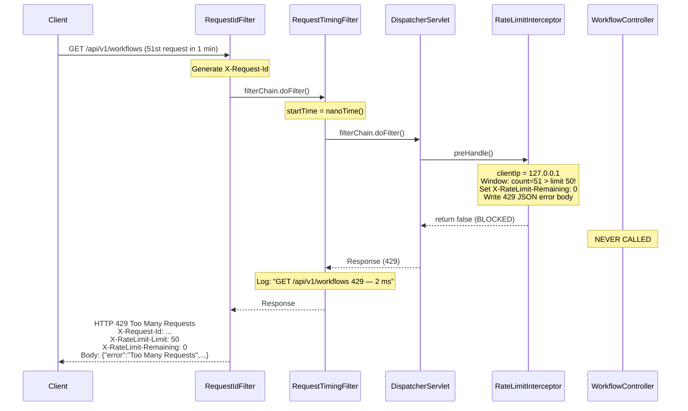

# Filters & Interceptors -- Deep Dive

How Spring MVC processes every HTTP request through Filters and Interceptors,
and how to use them for cross-cutting concerns like logging, request IDs, and rate limiting.

---

## The Request Pipeline



### Architecture Overview

```mermaid
graph TB
    subgraph Servlet Container - Tomcat
        subgraph Filter Chain
            F1[RequestIdFilter<br/>@Order 1]
            F2[RequestTimingFilter<br/>@Order 2]
        end
        subgraph Spring MVC
            DS[DispatcherServlet]
            subgraph Interceptor Chain
                I1[RateLimitInterceptor<br/>preHandle / postHandle / afterCompletion]
            end
            subgraph Handler
                CTR[WorkflowController]
                SVC[WorkflowService]
                REPO[WorkflowRepository]
            end
        end
    end

    CLIENT([Client]) --> F1
    F1 -->|filterChain.doFilter| F2
    F2 -->|filterChain.doFilter| DS
    DS --> I1
    I1 -->|return true| CTR
    CTR --> SVC
    SVC --> REPO
    REPO -->|Page result| SVC
    SVC -->|Page result| CTR
    CTR -->|ResponseEntity| I1
    I1 --> DS
    DS --> F2
    F2 --> F1
    F1 --> CLIENT
```

---

# What is a Filter?

A Filter is a Java Servlet specification concept (not Spring-specific).
It sits between the client and the servlet, intercepting every request and response.

```text
Filters exist at the SERVLET CONTAINER level (Tomcat, Jetty, Undertow).
They were introduced in Servlet 2.3 (year 2001) — long before Spring existed.

A filter can:
  - Inspect or modify the request BEFORE it reaches any servlet
  - Inspect or modify the response AFTER the servlet produces it
  - Block the request entirely (don't call the next filter)
  - Wrap the request/response objects (e.g., to add caching, compression)
```

## The jakarta.servlet.Filter Interface

```java
public interface Filter {

    // Called once when the filter is initialized (server startup)
    default void init(FilterConfig filterConfig) throws ServletException {}

    // Called for EVERY request that matches the filter's URL pattern
    void doFilter(ServletRequest request,
                  ServletResponse response,
                  FilterChain chain) throws IOException, ServletException;

    // Called once when the filter is destroyed (server shutdown)
    default void destroy() {}
}
```

```text
Notice: doFilter() receives ServletRequest, not HttpServletRequest.
Servlet API supports non-HTTP protocols (though HTTP is 99.9% of usage).

Spring's OncePerRequestFilter already casts to HttpServletRequest for you
and handles the HTTP-specific concerns.
```

## How Tomcat Builds the Filter Chain

```text
When Tomcat receives a request, it:

  1. Finds all filters that match the request URL pattern
  2. Orders them by @Order annotation (or registration order)
  3. Creates a FilterChain object linking them together
  4. Calls doFilter() on the FIRST filter

Each filter decides whether to:
  (a) Call chain.doFilter() -> passes to the NEXT filter
  (b) NOT call chain.doFilter() -> request stops here

The last "filter" in the chain is the DispatcherServlet itself.
```



# What is an Interceptor?

An Interceptor is a Spring MVC concept (not part of the Servlet spec).
It sits inside the DispatcherServlet, between request mapping and controller execution.

```text
Interceptors are Spring-specific. They don't exist in plain Servlet apps.
They were introduced to give Spring-aware hooks into the request lifecycle.

An interceptor can:
  - Run code BEFORE the controller method (preHandle)
  - Run code AFTER the controller method (postHandle)
  - Run cleanup code after everything completes (afterCompletion)
  - Access the Spring handler (which controller method will execute)
  - Access ModelAndView (for server-rendered views, less relevant for REST APIs)
```

```text
Key difference from filters:

  Filters see EVERY request — even requests for static files, error pages,
  and requests that don't map to any controller.

  Interceptors ONLY see requests that the DispatcherServlet handles.
  If a request doesn't match any @RequestMapping, the interceptor may still
  run (preHandle), but postHandle won't run if there's no handler.
```

---

## Filter vs Interceptor

```text
                        FILTER                     INTERCEPTOR
────────────────────────────────────────────────────────────────────
Layer               Servlet container          Spring MVC (DispatcherServlet)
Interface           jakarta.servlet.Filter     HandlerInterceptor
Scope               ALL requests               Only requests that reach DispatcherServlet
Can access          HttpServletRequest/Resp     + HandlerMethod, ModelAndView
Can short-circuit   Yes (don't call chain)     Yes (return false from preHandle)
Ordering            @Order or FilterRegistration   registry.order() in WebMvcConfigurer
Spring-aware        Yes (if @Component)        Yes (always a Spring bean)
Use for             Logging, auth, CORS,       Rate limiting, auth checks,
                    request wrapping,          audit logging, business-level
                    compression, encoding      concerns specific to controllers
────────────────────────────────────────────────────────────────────

RULE OF THUMB:
  - Use FILTER for infrastructure concerns (every request, even static resources)
  - Use INTERCEPTOR for business concerns (only controller-bound requests)
```

---

# Filters

## OncePerRequestFilter

```text
Problem: A regular Filter can be invoked multiple times for the same request
(e.g., during request forwarding or error dispatch).

Solution: OncePerRequestFilter guarantees exactly ONE execution per request.
Spring sets an attribute on the request to track if the filter already ran.

Always extend OncePerRequestFilter instead of implementing Filter directly.
```

## RequestIdFilter -- Tracing Requests

```java
@Component
@Order(1)  // runs FIRST in the filter chain
public class RequestIdFilter extends OncePerRequestFilter {

    public static final String REQUEST_ID_HEADER = "X-Request-Id";

    @Override
    protected void doFilterInternal(HttpServletRequest request,
                                    HttpServletResponse response,
                                    FilterChain filterChain)
            throws ServletException, IOException {

        // Use client-provided ID if present, otherwise generate one
        String requestId = request.getHeader(REQUEST_ID_HEADER);
        if (requestId == null || requestId.isBlank()) {
            requestId = UUID.randomUUID().toString();
        }

        // Set on response header (client can see it)
        response.setHeader(REQUEST_ID_HEADER, requestId);
        // Set as request attribute (other components can access it)
        request.setAttribute(REQUEST_ID_HEADER, requestId);

        filterChain.doFilter(request, response);
    }
}
```

```text
Why X-Request-Id matters:

  1. DEBUGGING: When a user reports an error, they can share the request ID.
     You search your logs for that ID and find the exact request.

  2. DISTRIBUTED TRACING: In microservices, the request ID propagates
     across service calls, linking logs from all services together.

  3. IDEMPOTENCY: Some APIs use the request ID to detect duplicate requests.

  4. SUPPORT: "Please share your request ID" is much easier than
     "What time did you make the request? What endpoint? What parameters?"
```

## RequestTimingFilter -- Performance Logging

```java
@Component
@Order(2)  // runs AFTER RequestIdFilter
public class RequestTimingFilter extends OncePerRequestFilter {

    private static final Logger log = LoggerFactory.getLogger(RequestTimingFilter.class);

    @Override
    protected void doFilterInternal(HttpServletRequest request,
                                    HttpServletResponse response,
                                    FilterChain filterChain)
            throws ServletException, IOException {

        long startTime = System.nanoTime();

        try {
            filterChain.doFilter(request, response);  // let the request proceed
        } finally {
            long durationMs = (System.nanoTime() - startTime) / 1_000_000;
            log.info("{} {} {} — {} ms",
                    request.getMethod(),
                    request.getRequestURI(),
                    response.getStatus(),
                    durationMs);
        }
    }
}
```

```text
Key design decisions:

  1. try/finally: Duration is logged even if the request throws an exception.
     Without finally, errors would be invisible in timing logs.

  2. System.nanoTime(): More precise than System.currentTimeMillis().
     nanoTime is monotonic (not affected by clock adjustments).

  3. @Order(2): Runs after RequestIdFilter. The timing includes everything
     that happens after this filter (other filters, interceptors, controller).

  4. filterChain.doFilter(): This is the critical call. Everything before it
     runs on the way IN. Everything after it runs on the way OUT.
```

## Filter Ordering with @Order

```text
@Order(1) -> RequestIdFilter    (first in, last out)
@Order(2) -> RequestTimingFilter (second in, second-to-last out)

Request flow:
  RequestIdFilter.doFilter  (BEFORE chain)
    RequestTimingFilter.doFilter  (BEFORE chain)
      ... DispatcherServlet, interceptors, controller ...
    RequestTimingFilter.doFilter  (AFTER chain — in finally block)
  RequestIdFilter.doFilter  (AFTER chain)

Lower @Order number = higher priority = runs first.
The filter chain is like a stack: first in, last out.
```

## filterChain.doFilter() -- The Chain Pattern

```text
filterChain.doFilter(request, response) does TWO things:

  1. Passes the request to the NEXT filter in the chain
  2. When the next filter (and everything downstream) finishes,
     execution returns HERE

Everything BEFORE filterChain.doFilter() is "pre-processing"
Everything AFTER  filterChain.doFilter() is "post-processing"

If you DON'T call filterChain.doFilter(), the request STOPS here.
The controller never executes. This is how filters can block requests.
```

---

# Interceptors

## HandlerInterceptor Interface

```java
public interface HandlerInterceptor {

    // Called BEFORE the controller method
    // Return true to proceed, false to stop
    boolean preHandle(HttpServletRequest request,
                      HttpServletResponse response,
                      Object handler) throws Exception;

    // Called AFTER the controller method (before view rendering)
    // Only called if preHandle returned true AND no exception was thrown
    void postHandle(HttpServletRequest request,
                    HttpServletResponse response,
                    Object handler,
                    ModelAndView modelAndView) throws Exception;

    // Called AFTER everything completes (even if exception was thrown)
    // Guaranteed to run if preHandle returned true
    void afterCompletion(HttpServletRequest request,
                         HttpServletResponse response,
                         Object handler,
                         Exception ex) throws Exception;
}
```

### Interceptor Lifecycle



```text
preHandle:       BEFORE controller. Return false = block request.
postHandle:      AFTER controller, only if no exception was thrown.
afterCompletion: ALWAYS runs (like finally). Cleanup guarantee.
```

## RateLimitInterceptor -- Throttling Requests

```java
@Component
public class RateLimitInterceptor implements HandlerInterceptor {

    private static final int MAX_REQUESTS_PER_WINDOW = 50;
    private static final long WINDOW_MS = 60_000; // 1 minute

    private final Map<String, ClientWindow> clients = new ConcurrentHashMap<>();

    @Override
    public boolean preHandle(HttpServletRequest request,
                             HttpServletResponse response,
                             Object handler) throws Exception {

        String clientIp = request.getRemoteAddr();
        ClientWindow window = clients.compute(clientIp, (ip, existing) -> {
            long now = System.currentTimeMillis();
            if (existing == null || now - existing.windowStart > WINDOW_MS) {
                return new ClientWindow(now, new AtomicInteger(1));
            }
            existing.count.incrementAndGet();
            return existing;
        });

        int currentCount = window.count.get();
        int remaining = Math.max(0, MAX_REQUESTS_PER_WINDOW - currentCount);

        response.setIntHeader("X-RateLimit-Limit", MAX_REQUESTS_PER_WINDOW);
        response.setIntHeader("X-RateLimit-Remaining", remaining);

        if (currentCount > MAX_REQUESTS_PER_WINDOW) {
            response.setStatus(429);
            response.setContentType("application/json");
            response.getWriter().write(/* error JSON */);
            return false;  // STOP -- don't call the controller
        }

        return true;  // PROCEED -- call the controller
    }
}
```

```text
How the rate limiter works:

  1. Each client IP gets a "window" (start time + request count)
  2. First request in a window: create new window, count = 1
  3. Subsequent requests: increment count
  4. Window expired (>60s old): create new window, count resets to 1
  5. Count > 50: reject with 429 Too Many Requests

  ConcurrentHashMap.compute() is atomic — safe for concurrent requests.
  AtomicInteger for thread-safe counting.

  This is a FIXED WINDOW rate limiter — the simplest approach.
  More advanced algorithms (sliding window, token bucket) come later.
```

## Registering Interceptors with WebMvcConfigurer

```java
@Configuration
public class WebConfig implements WebMvcConfigurer {

    private final RateLimitInterceptor rateLimitInterceptor;

    public WebConfig(RateLimitInterceptor rateLimitInterceptor) {
        this.rateLimitInterceptor = rateLimitInterceptor;
    }

    @Override
    public void addInterceptors(InterceptorRegistry registry) {
        registry.addInterceptor(rateLimitInterceptor)
                .addPathPatterns("/api/**");  // only API endpoints
    }
}
```

```text
Why register via WebMvcConfigurer?

  Filters: Auto-registered with @Component (servlet container level)
  Interceptors: Must be explicitly registered (Spring MVC level)

  .addPathPatterns("/api/**") means:
    /api/v1/workflows       -> rate-limited
    /api/v1/workflows/123   -> rate-limited
    /h2-console             -> NOT rate-limited
    /actuator/health        -> NOT rate-limited

  You can also use .excludePathPatterns() to exempt specific paths:
    .excludePathPatterns("/api/v1/health")
```

---

# Multiple Interceptors -- Ordering

```java
@Override
public void addInterceptors(InterceptorRegistry registry) {
    registry.addInterceptor(authInterceptor)
            .addPathPatterns("/api/**")
            .order(1);   // runs first

    registry.addInterceptor(rateLimitInterceptor)
            .addPathPatterns("/api/**")
            .order(2);   // runs second

    registry.addInterceptor(auditInterceptor)
            .addPathPatterns("/api/**")
            .order(3);   // runs third
}
```

### Happy Path: All interceptors pass



### Short-circuit: RateLimitInterceptor rejects



```text
KEY RULE: afterCompletion() runs ONLY for interceptors whose
preHandle() returned true. It's your cleanup guarantee.
```

---

# Common Pitfalls

## 1. Filter invoked multiple times (without OncePerRequestFilter)

```text
Problem:
  When a request is forwarded (e.g., error dispatch), the servlet container
  re-invokes all matching filters. Your filter runs TWICE.

  Example: Request -> Filter -> Controller throws 404
           -> Error dispatch -> Filter runs AGAIN -> Error page

Solution: Extend OncePerRequestFilter instead of implementing Filter.
  It sets a request attribute to track whether it already ran.
  If the attribute exists, it skips execution.
```

## 2. Modifying response after filterChain.doFilter()

```text
Problem:
  After filterChain.doFilter() returns, the response may already be
  committed (sent to the client). You CAN'T add headers or change the
  status code after the response is committed.

  response.setHeader("X-My-Header", "value");  // too late!
  // throws: java.lang.IllegalStateException: Response already committed

Solution:
  Set response headers BEFORE calling filterChain.doFilter().
  That's what our RequestIdFilter does -- it sets X-Request-Id BEFORE
  passing the request down the chain.

  Exception: Reading response status (response.getStatus()) AFTER the
  chain is fine -- you're reading, not writing.
```

## 3. Interceptor not applied to all endpoints

```text
Problem:
  You register an interceptor with .addPathPatterns("/api/v1/workflows")
  but it doesn't apply to /api/v1/workflows/123 or /api/v1/workflows?page=0.

Solution:
  Use /** wildcard: .addPathPatterns("/api/**")

  Pattern matching:
    /api/v1/workflows      -> matches /api/v1/workflows only
    /api/v1/workflows/*    -> matches /api/v1/workflows/123 (one level)
    /api/v1/workflows/**   -> matches /api/v1/workflows/123/steps/456 (any depth)
    /api/**                -> matches all API endpoints
```

## 4. Thread safety in interceptors

```text
Problem:
  Interceptors are singletons (one instance shared across all threads).
  If you store per-request state in instance fields, you get race conditions.

  BAD:
  @Component
  public class MyInterceptor implements HandlerInterceptor {
      private long startTime;  // SHARED across all threads!

      public boolean preHandle(...) {
          startTime = System.nanoTime();  // Thread A writes
          return true;                    // Thread B overwrites!
      }
  }

Solution:
  Store per-request data in request attributes:

  public boolean preHandle(...) {
      request.setAttribute("startTime", System.nanoTime());
      return true;
  }

  public void afterCompletion(...) {
      long start = (long) request.getAttribute("startTime");
      long duration = System.nanoTime() - start;
  }
```

---

# Detailed FlowForge Request Walkthrough

`GET /api/v1/workflows?status=ACTIVE&sort=name,asc`



### Rate-Limited Request Flow



---

# Real-World Use Cases

```text
COMMON FILTERS:
  - CorsFilter: Add CORS headers (Access-Control-Allow-Origin)
  - CharacterEncodingFilter: Set UTF-8 encoding on all requests
  - GzipFilter: Compress response bodies
  - SecurityFilter: Spring Security's filter chain (15+ filters!)
  - MDCFilter: Set logging context (request ID, user ID) for structured logs
  - ContentCachingFilter: Cache request body for re-reading (audit logs)

COMMON INTERCEPTORS:
  - AuthenticationInterceptor: Verify JWT tokens before controller
  - RateLimitInterceptor: Throttle requests per client
  - AuditInterceptor: Log who accessed what endpoint
  - TenantInterceptor: Set tenant context for multi-tenant apps
  - LocaleInterceptor: Set language based on Accept-Language header
  - RequestValidationInterceptor: Validate API versioning headers
```

---

# Why Filter for Timing but Interceptor for Rate Limiting?

```text
RequestTimingFilter (FILTER):
  - Needs to measure TOTAL request time, including other filters
  - Must run for EVERY request (even non-controller ones)
  - Operates at the servlet level (widest scope)

RateLimitInterceptor (INTERCEPTOR):
  - Only needs to throttle API endpoints, not static resources
  - Can use .addPathPatterns() for targeted application
  - Has access to the handler (controller method) if needed
  - Operates at the Spring MVC level (narrower scope)

RequestIdFilter (FILTER):
  - Must set the header before anything else processes the request
  - Needs to run for ALL requests (even those rejected by interceptors)
  - Should be the first thing in the pipeline (@Order 1)
```

---

# Spring's Built-in Filters

```text
Spring Boot auto-registers several filters. Understanding them helps you
know where YOUR filters fit in the chain.

Built-in filters (approximate order):
  1. CharacterEncodingFilter    -> sets UTF-8 encoding
  2. FormContentFilter          -> parses PUT/PATCH form data
  3. RequestContextFilter       -> binds request to thread-local
  4. YOUR custom filters        -> @Order determines position
  5. Spring Security filters    -> 15+ filters (if security is enabled)
  6. DispatcherServlet          -> not technically a filter, but last in chain

You can see all registered filters by enabling debug logging:
  logging.level.org.springframework.web.filter: DEBUG
```

---

# Summary

```text
1. FILTERS (jakarta.servlet.Filter)
   - Run at the servlet container level (before DispatcherServlet)
   - Use OncePerRequestFilter to prevent double execution
   - Order with @Order (lower = runs first)
   - filterChain.doFilter() = pass to next filter
   - Don't call filterChain.doFilter() = block the request
   - Use for: logging, timing, request IDs, CORS, encoding

2. INTERCEPTORS (HandlerInterceptor)
   - Run at the Spring MVC level (inside DispatcherServlet)
   - Three lifecycle methods: preHandle, postHandle, afterCompletion
   - preHandle returns false = block the request
   - Register via WebMvcConfigurer.addInterceptors()
   - Can target specific URL patterns with addPathPatterns()
   - Use for: rate limiting, auth, audit, business-level concerns

3. KEY DIFFERENCES
   - Filters wrap the entire request (wider scope)
   - Interceptors only wrap controller execution (narrower scope)
   - Filters can modify the raw request/response
   - Interceptors have access to Spring handler information

4. EXECUTION ORDER
   Filter 1 (pre) -> Filter 2 (pre) -> Interceptor (preHandle)
   -> Controller -> Interceptor (postHandle) -> Interceptor (afterCompletion)
   -> Filter 2 (post) -> Filter 1 (post)
```
