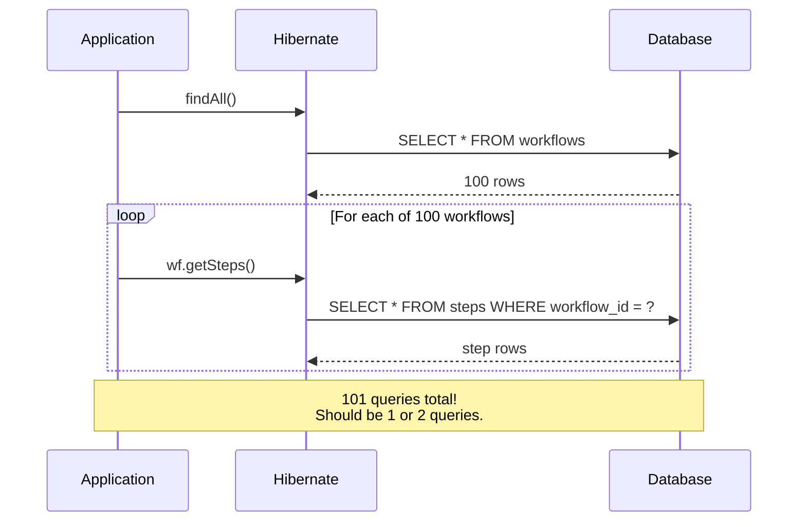
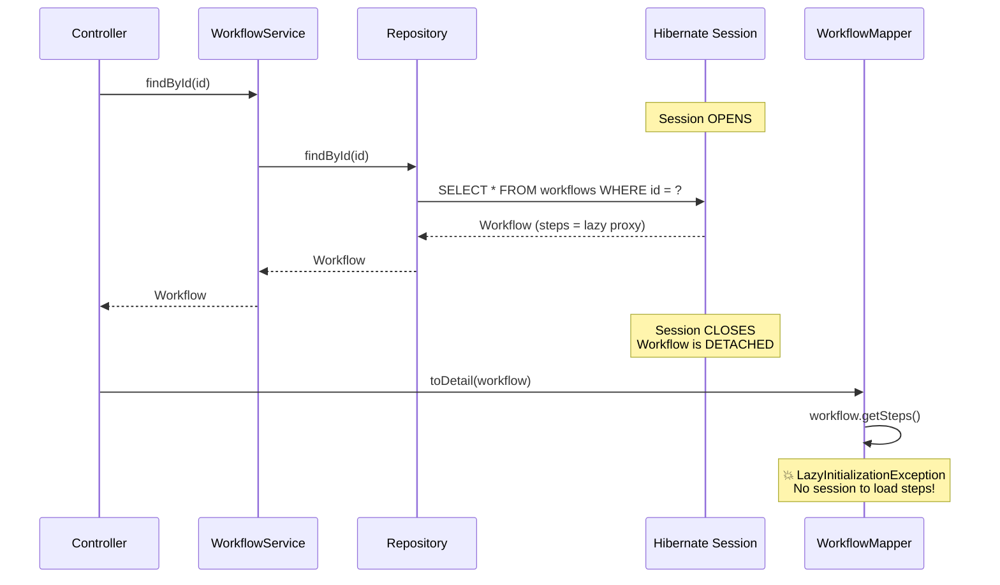
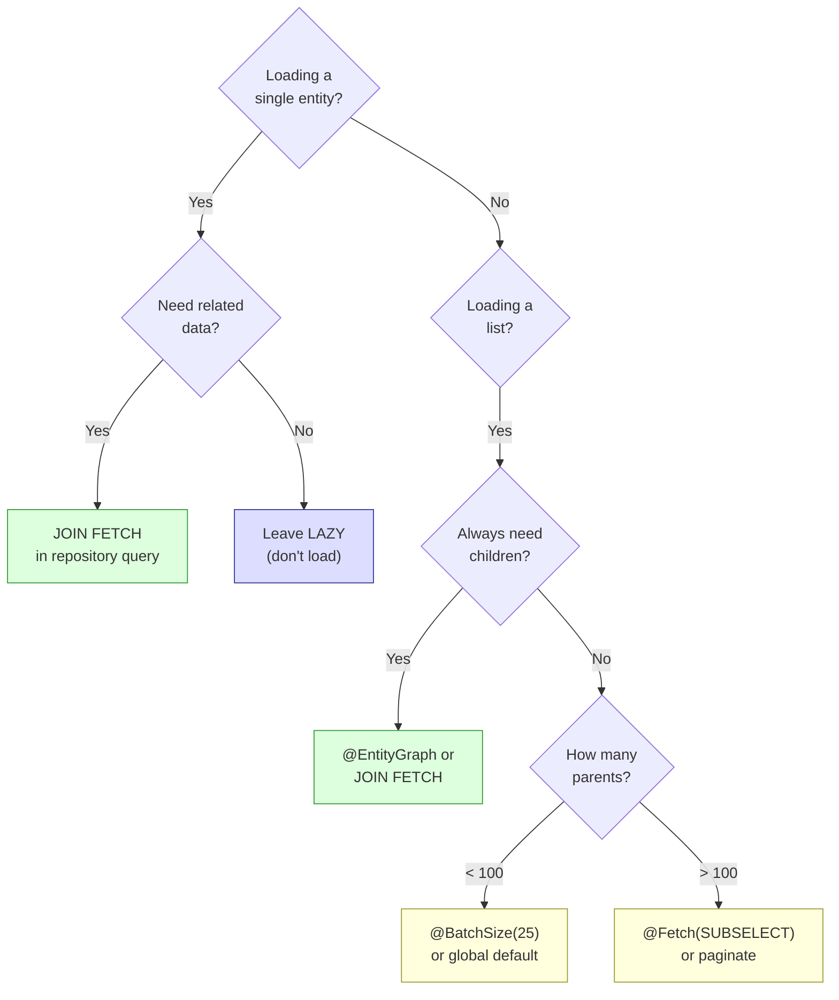

# Hibernate Performance

The N+1 problem, lazy vs eager loading, fetch strategies, caching,
and how to diagnose and fix the most common Hibernate performance issues.

---

## 1. Lazy Loading vs Eager Loading

### What They Mean

```text
LAZY LOADING:
  "Don't load related data until someone accesses it."
  Data is loaded ON DEMAND — only when you call getSteps(), getAuthor(), etc.

  @OneToMany(fetch = FetchType.LAZY)  ← DEFAULT for collections
  private List<Step> steps;

  Workflow wf = em.find(Workflow.class, id);
  // SQL: SELECT * FROM workflows WHERE id = ?
  // steps is NOT loaded — it's a Hibernate PROXY (placeholder)

  wf.getSteps();
  // NOW Hibernate fires: SELECT * FROM steps WHERE workflow_id = ?
  // But ONLY if the persistence context is still open (session alive)

EAGER LOADING:
  "Load related data IMMEDIATELY with the parent."
  Data is loaded at the same time as the parent entity.

  @OneToMany(fetch = FetchType.EAGER)
  private List<Step> steps;

  Workflow wf = em.find(Workflow.class, id);
  // SQL: SELECT * FROM workflows WHERE id = ?
  //      SELECT * FROM steps WHERE workflow_id = ?
  // Both queries fire immediately, even if you never access steps.
```

### Defaults

```text
RELATIONSHIP TYPE        DEFAULT FETCH    WHY
──────────────────────────────────────────────────────────────
@OneToOne                EAGER            Usually a small related entity
@ManyToOne               EAGER            One parent entity (small)
@OneToMany               LAZY             Could be thousands of items
@ManyToMany              LAZY             Could be thousands of items

IMPORTANT:
  The defaults for @OneToOne and @ManyToOne are EAGER.
  This is almost always WRONG for performance.

  RECOMMENDATION:
    Set ALL relationships to LAZY. Load eagerly only when needed
    using JOIN FETCH or @EntityGraph on a per-query basis.

  @ManyToOne(fetch = FetchType.LAZY)
  private User author;

  @OneToOne(fetch = FetchType.LAZY)
  private WorkflowConfig config;
```

### How Lazy Loading Works — Proxies

```text
When Hibernate loads an entity with lazy relationships, it creates a PROXY
for the related entity/collection.

  Workflow wf = em.find(Workflow.class, id);

  wf.steps is NOT a real ArrayList. It's a Hibernate PersistentBag
  that LOOKS like a List but is actually a lazy proxy.

  Internal state:
    wf.steps = PersistentBag {
        initialized: false,
        session: Session@123,
        owner: Workflow(id=abc),
        role: "Workflow.steps"
    }

  When you call wf.getSteps().size():
    1. PersistentBag checks: am I initialized? NO
    2. PersistentBag checks: do I have a session? YES
    3. Fires SQL: SELECT * FROM steps WHERE workflow_id = ?
    4. Populates the internal list
    5. Sets initialized = true
    6. Returns the size

  When session is CLOSED (entity detached):
    1. PersistentBag checks: am I initialized? NO
    2. PersistentBag checks: do I have a session? NO
    3. Throws LazyInitializationException!
```

---

## 2. The N+1 Problem

### What It Is

```text
The MOST COMMON Hibernate performance problem.

  List<Workflow> workflows = workflowRepository.findAll();
  // SQL: SELECT * FROM workflows    ← 1 query (loads 100 workflows)

  for (Workflow wf : workflows) {
      System.out.println(wf.getName() + ": " + wf.getSteps().size());
      // SQL: SELECT * FROM steps WHERE workflow_id = ?  ← 1 query per workflow!
  }

  Total queries: 1 (for workflows) + 100 (for steps) = 101 queries
  This is the "N+1" problem: 1 parent query + N child queries.

  With 1000 workflows: 1001 queries.
  With 10,000 workflows: 10,001 queries.
  Each query has network round-trip + DB processing overhead.
```



### How To Detect N+1

```text
STEP 1: Enable SQL logging in application-dev.yaml

  spring:
    jpa:
      show-sql: true
      properties:
        hibernate:
          format_sql: true

  Or better — use Hibernate statistics:

  logging:
    level:
      org.hibernate.SQL: DEBUG
      org.hibernate.orm.jdbc.bind: TRACE    # see bound parameters
      org.hibernate.stat: DEBUG             # see query counts

  spring.jpa.properties.hibernate.generate_statistics: true

STEP 2: Look at the logs

  Hibernate: SELECT w FROM workflows w
  Hibernate: SELECT * FROM steps WHERE workflow_id = ?   ← repeated!
  Hibernate: SELECT * FROM steps WHERE workflow_id = ?
  Hibernate: SELECT * FROM steps WHERE workflow_id = ?
  ... (100 times)

  If you see the SAME query repeated many times with different parameters
  → you have N+1.

STEP 3: Check statistics

  Session Metrics {
      queries executed to database: 101
      ...
  }

  101 queries for what should be 1 → N+1 confirmed.
```

---

## 3. Fixing N+1

### Solution 1: JOIN FETCH (Best for Single Queries)

```text
JOIN FETCH loads the parent AND children in ONE query.

  // Repository
  @Query("SELECT w FROM Workflow w LEFT JOIN FETCH w.steps")
  List<Workflow> findAllWithSteps();

  Generated SQL:
    SELECT w.*, s.*
    FROM workflows w
    LEFT JOIN steps s ON w.id = s.workflow_id

  Result: 1 query instead of 101.
  All steps are pre-loaded. No lazy proxy. No N+1.
```

```text
IMPORTANT GOTCHA — duplicates:

  If a workflow has 3 steps, the JOIN returns 3 rows for that workflow.
  JPQL may return 3 Workflow objects (duplicates!).

  Fix: use DISTINCT:
    @Query("SELECT DISTINCT w FROM Workflow w LEFT JOIN FETCH w.steps")
    List<Workflow> findAllWithSteps();

  Hibernate 6+ (Spring Boot 3+/4+) handles this automatically with
  deduplication in memory, but DISTINCT is still good practice.
```

### Solution 2: @EntityGraph (Declarative)

```text
@EntityGraph tells JPA which relationships to eagerly fetch.
More flexible than JOIN FETCH — works with derived query methods.

  // On repository method
  @EntityGraph(attributePaths = {"steps"})
  List<Workflow> findAll();

  // Or on a custom query
  @EntityGraph(attributePaths = {"steps", "author"})
  @Query("SELECT w FROM Workflow w WHERE w.status = :status")
  List<Workflow> findByStatus(@Param("status") String status);

  Generated SQL (same as JOIN FETCH):
    SELECT w.*, s.*
    FROM workflows w
    LEFT JOIN steps s ON w.id = s.workflow_id

  ADVANTAGE over JOIN FETCH:
    Works with Spring Data derived query methods (findByStatus, etc.)
    Don't need to write JPQL manually.

  DISADVANTAGE:
    Can only specify attribute paths (less control over join type)
```

### Solution 3: Batch Fetching

```text
Instead of 1 query per child, Hibernate fires 1 query per BATCH.

  @Entity
  public class Workflow {
      @OneToMany(mappedBy = "workflow")
      @BatchSize(size = 25)
      private List<Step> steps;
  }

  List<Workflow> workflows = repo.findAll();  // 1 query → 100 workflows
  for (Workflow wf : workflows) {
      wf.getSteps();  // triggers batch loading
  }

  WITHOUT @BatchSize:
    100 queries (one per workflow)

  WITH @BatchSize(size = 25):
    4 queries:
      SELECT * FROM steps WHERE workflow_id IN (?, ?, ... 25 ids ...)
      SELECT * FROM steps WHERE workflow_id IN (?, ?, ... 25 ids ...)
      SELECT * FROM steps WHERE workflow_id IN (?, ?, ... 25 ids ...)
      SELECT * FROM steps WHERE workflow_id IN (?, ?, ... 25 ids ...)

  101 queries → 5 queries. Not as good as JOIN FETCH (1 query) but
  simpler to apply globally.

  GLOBAL setting (applies to all lazy collections):
    spring.jpa.properties.hibernate.default_batch_fetch_size: 25
```

### Solution 4: Subselect Fetching

```text
Loads ALL children in ONE query using a subselect.

  @OneToMany(mappedBy = "workflow")
  @Fetch(FetchMode.SUBSELECT)
  private List<Step> steps;

  List<Workflow> workflows = repo.findAll();  // 1 query
  workflows.get(0).getSteps();               // triggers subselect

  SQL:
    SELECT * FROM steps WHERE workflow_id IN
        (SELECT id FROM workflows)

  1 parent query + 1 child query = 2 queries total.
  Better than batch (which may need multiple batches).
  Downside: re-executes the parent query as a subselect.
```

### Comparison

```text
STRATEGY         QUERIES     COMPLEXITY   WHEN TO USE
─────────────────────────────────────────────────────────────────────
No optimization  1 + N       —            Never in production
JOIN FETCH       1           JPQL         Best for specific queries
@EntityGraph     1           Annotation   Best for repository methods
@BatchSize       1 + N/batch Annotation   Good global default
SUBSELECT        2           Annotation   When batch isn't enough
```

---

## 4. LazyInitializationException — FlowForge Case Study

```text
One of the most common Hibernate errors.
Happens when you access a lazy collection on a DETACHED entity.
```

### What Happened in FlowForge

```text
  Controller.getById(id)
    │
    ├─► workflowService.findById(id)     ← @Transactional OPENS
    │     └─ repo.findById(id)           ← Loads Workflow (NOT steps)
    │                                     ← @Transactional CLOSES (session gone)
    │
    └─► workflowMapper.toDetail(workflow) ← Runs OUTSIDE transaction
          └─ workflow.getSteps()          ← 💥 LazyInitializationException!

  The entity is DETACHED after the service method returns.
  The lazy proxy for steps needs a session to load — but the session is closed.
```



### The Fix: JOIN FETCH

```java
// Repository — load steps in the same query
@Query("SELECT w FROM Workflow w LEFT JOIN FETCH w.steps WHERE w.id = :id")
Optional<Workflow> findByIdWithSteps(UUID id);
```

```text
Now:
  SELECT w.*, s.*
  FROM workflows w
  LEFT JOIN steps s ON w.id = s.workflow_id
  WHERE w.id = ?

  Steps are loaded IN the query. The proxy is initialized.
  Even after the session closes, steps is a real ArrayList, not a proxy.
  No LazyInitializationException.
```

### Why NOT open-in-view: true?

```text
Spring Boot's default: spring.jpa.open-in-view = true
This keeps the Hibernate session open until the HTTP response is sent.

  With open-in-view: true:
    Session stays open through Controller → no LazyInitializationException
    BUT:
      - Each lazy access fires a separate SQL query (N+1 in the view layer!)
      - Database connection held for entire request (including JSON serialization)
      - Connection pool exhaustion under load
      - Hidden performance problems (queries you don't see in service layer)

  With open-in-view: false (FlowForge setting):
    Session closes when @Transactional method returns
    Forces you to be EXPLICIT about what data you load
    LazyInitializationException is actually HELPFUL — it tells you
    "you forgot to load this data"
    No hidden queries, no connection leaks

  open-in-view: false is the CORRECT production setting.
  open-in-view: true is a convenience that creates more problems than it solves.
```

---

## 5. First-Level Cache (Persistence Context Cache)

```text
The persistence context IS the first-level cache.
It caches entities loaded within the CURRENT transaction.

  SCOPE: one EntityManager / one transaction
  LIFETIME: from transaction start to transaction end
  AUTOMATIC: always on, cannot be disabled

  @Transactional
  public void process() {
      Workflow wf1 = repo.findById(id);  // SQL: SELECT ... (hits DB)
      Workflow wf2 = repo.findById(id);  // NO SQL (returned from cache!)
      assert wf1 == wf2;                 // true — same Java object

      // Only ONE SQL query executed, not two.
  }

  HOW IT WORKS:
    em.find(Workflow.class, id)
      → Check persistence context: do I have Workflow with this id?
        → YES: return cached entity (no DB query)
        → NO:  query DB, store in persistence context, return

  CLEARED when:
    - Transaction ends (commit or rollback)
    - em.clear() called
    - em.detach(entity) called (for that entity only)

  LIMITATIONS:
    - Does NOT cache JPQL/native query results
      "SELECT w FROM Workflow w" always hits the DB
    - Only caches by PRIMARY KEY (em.find)
    - Per-transaction (not shared between transactions)
```

---

## 6. Second-Level Cache (L2 Cache)

```text
A SHARED cache across transactions and sessions.
Survives beyond a single transaction.

  SCOPE: entire SessionFactory (application-wide)
  LIFETIME: application lifetime (or until eviction)
  OPTIONAL: must be explicitly enabled and configured

  L1 Cache (persistence context): transaction-scoped, per-session
  L2 Cache (second-level cache): application-scoped, shared

  Query flow with both caches:

    em.find(Workflow.class, id)
      → Check L1 cache (persistence context)
        → HIT: return entity
        → MISS: Check L2 cache
          → HIT: copy into L1 cache, return entity
          → MISS: query DB, store in L1 and L2, return entity
```

### How To Enable

```text
1. Add cache provider (e.g., Ehcache, Caffeine, Hazelcast)
2. Enable in application.yaml:
     spring.jpa.properties.hibernate.cache.use_second_level_cache: true
     spring.jpa.properties.hibernate.cache.region.factory_class: ehcache
3. Annotate entities:
     @Entity
     @Cacheable
     @org.hibernate.annotations.Cache(usage = CacheConcurrencyStrategy.READ_WRITE)
     public class Workflow { ... }
```

### Cache Strategies

```text
STRATEGY              BEHAVIOR                              USE WHEN
──────────────────────────────────────────────────────────────────────────
READ_ONLY             Never updated. Exception if you try.  Reference data
                                                            (countries, statuses)
NONSTRICT_READ_WRITE  Eventual consistency. No locks.       Rarely updated data.
                      Stale reads possible briefly.         OK with slight staleness.
READ_WRITE            Soft locks. Consistent reads.         Frequently read,
                      Slight overhead.                      occasionally updated.
TRANSACTIONAL         Full XA transaction support.          JTA environments.
                      Highest overhead.                     Distributed transactions.
```

### Query Cache

```text
Caches JPQL/native query RESULTS (not entities).

  Enable:
    spring.jpa.properties.hibernate.cache.use_query_cache: true

  Use:
    @Query("SELECT w FROM Workflow w WHERE w.status = :status")
    @QueryHints(@QueryHint(name = "org.hibernate.cacheable", value = "true"))
    List<Workflow> findByStatus(@Param("status") String status);

  HOW IT WORKS:
    Query cache key: query string + parameters
    Query cache value: list of entity IDs
    Entity data comes from L2 entity cache

    First call: runs SQL → caches result IDs
    Second call (same query + params): returns cached IDs → loads entities from L2

  INVALIDATION:
    Any INSERT/UPDATE/DELETE to the cached table invalidates ALL
    query cache entries for that table. This makes query cache useful
    only for rarely-modified tables.
```

---

## 7. Fetch Strategies — Decision Guide



```text
RULES OF THUMB:

  1. Set ALL relationships to FetchType.LAZY (override defaults for @ManyToOne)
  2. Use JOIN FETCH when you KNOW you need the data (specific query)
  3. Use @EntityGraph for repository methods (declarative, clean)
  4. Set global batch size as safety net: hibernate.default_batch_fetch_size: 25
  5. Use open-in-view: false (forces explicit fetching, reveals N+1)
  6. Monitor SQL with show-sql or Hibernate statistics in dev
  7. Use DTO projections for read-only queries (skip entity mapping entirely)
```

---

## 8. DTO Projections — Bypass Entities Entirely

```text
For READ-ONLY queries, you don't need entities at all.
Load data directly into DTOs — no persistence context, no proxies,
no dirty checking, no N+1 risk.

  // Interface projection (Spring Data magic)
  public interface WorkflowSummary {
      UUID getId();
      String getName();
      String getStatus();
  }

  // Repository
  List<WorkflowSummary> findByStatus(String status);
  // SQL: SELECT id, name, status FROM workflows WHERE status = ?
  // Only 3 columns loaded (not all columns)
  // No entity created, no persistence context entry

  // Record projection (Java 16+)
  public record WorkflowSummaryDto(UUID id, String name, String status) {}

  @Query("SELECT new com.flowforge.dto.WorkflowSummaryDto(w.id, w.name, w.status) FROM Workflow w")
  List<WorkflowSummaryDto> findSummaries();

  ADVANTAGES:
    - No persistence context overhead
    - No dirty checking
    - No lazy loading issues
    - Only loads needed columns
    - Immutable (records)

  USE FOR:
    - List/table views (don't need full entity)
    - API responses (already mapping to DTOs anyway)
    - Reports and aggregations
```

---

## 9. Interview Questions

```text
Q: What is the N+1 problem?
A: Loading a list of parents (1 query) then lazily loading children for each
   parent (N queries). Fix: JOIN FETCH, @EntityGraph, @BatchSize.

Q: What is the difference between lazy and eager loading?
A: Lazy loads data on first access (proxy). Eager loads immediately with parent.
   Lazy is default for collections. Always prefer lazy + explicit fetching.

Q: What is a Hibernate proxy?
A: A subclass generated by Hibernate that intercepts method calls.
   For lazy collections: PersistentBag. For lazy @ManyToOne: CGLIB subclass.
   The proxy loads data from DB on first access (if session is open).

Q: What causes LazyInitializationException?
A: Accessing a lazy proxy after the Hibernate session is closed (entity detached).
   Fix: load data while session is open (JOIN FETCH, @EntityGraph).

Q: What is the first-level cache?
A: The persistence context. Caches entities within one transaction.
   Same em.find(id) returns the same object. Always on, per-transaction.

Q: What is the second-level cache?
A: Application-wide cache shared across transactions. Caches entities by ID.
   Must be explicitly enabled. Uses providers like Ehcache or Caffeine.

Q: open-in-view: what is it and should you use it?
A: Keeps Hibernate session open until HTTP response is sent. Prevents
   LazyInitializationException but hides N+1 and holds DB connections.
   Set to false in production. Be explicit about data loading.

Q: When would you use a DTO projection instead of an entity?
A: For read-only queries where you don't need the full entity. Loads only
   needed columns, skips persistence context, no dirty checking overhead.
   Best for list views and API responses.
```
