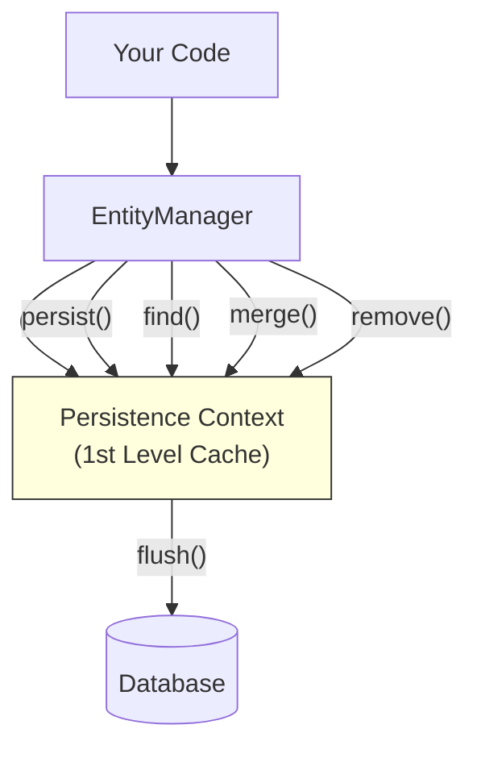
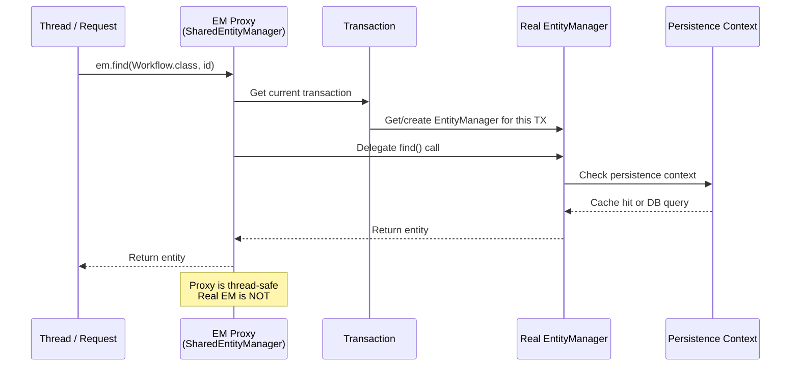
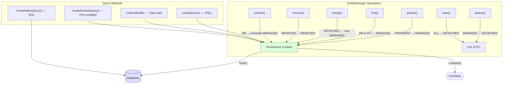
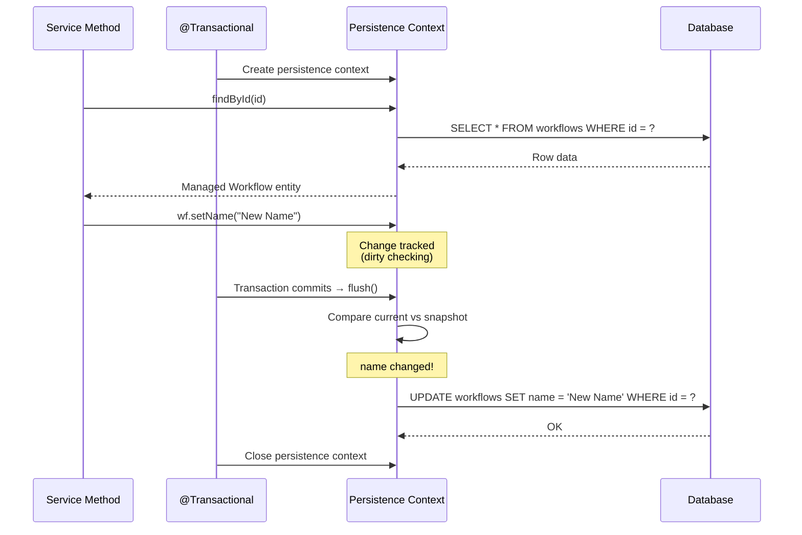
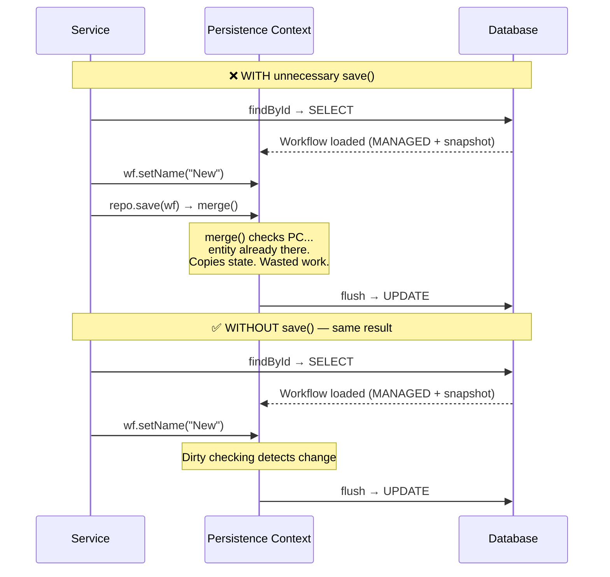
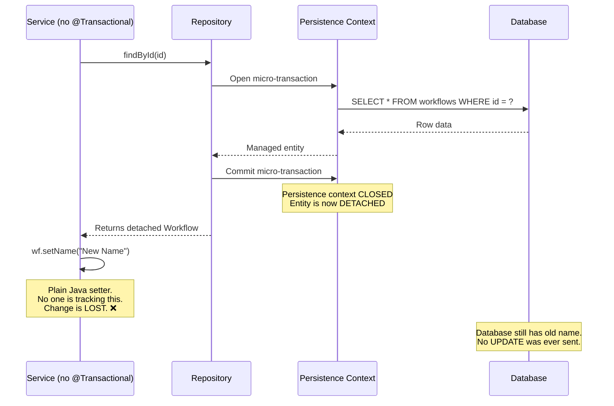
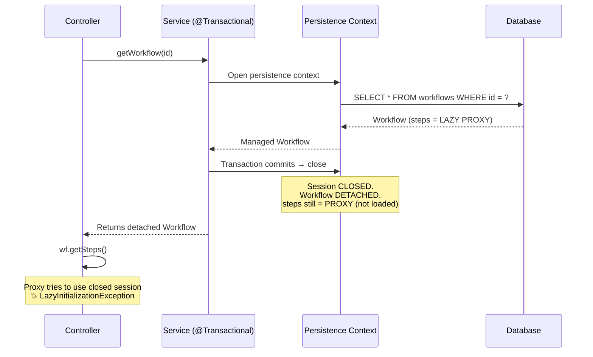
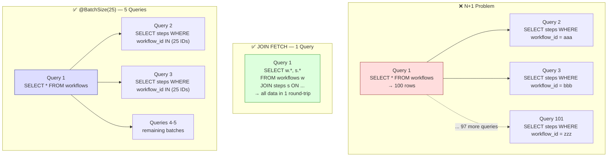
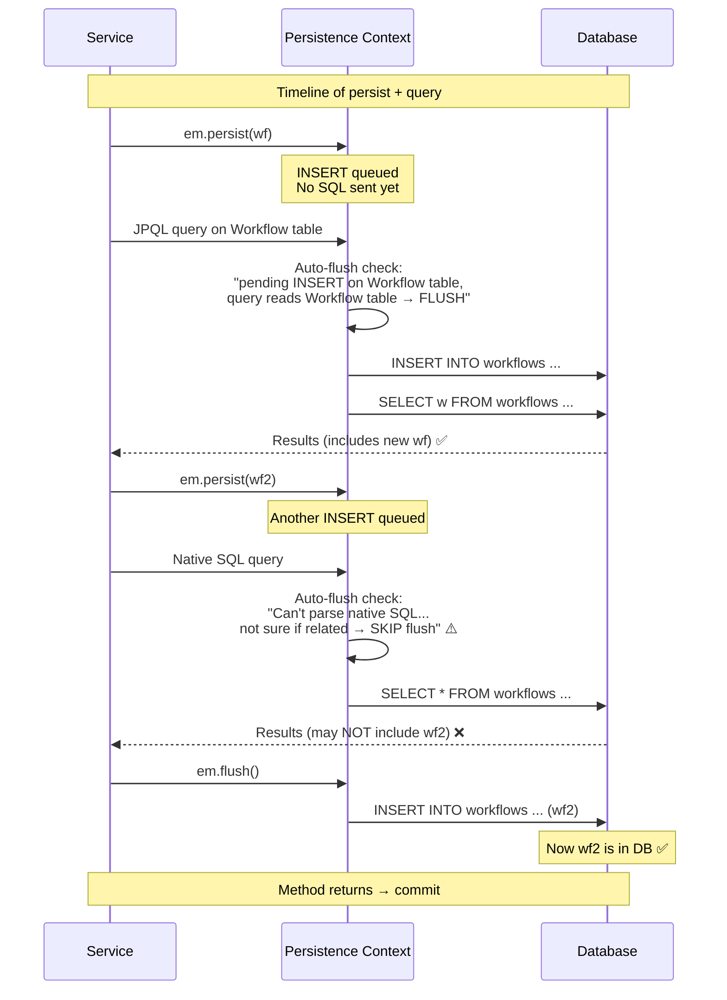

# JPA / Hibernate

How Java objects map to database tables, the persistence context,
entity lifecycle, and the operations that control it.

**JPA** = Jakarta Persistence API (specification — defines interfaces)
**Hibernate** = the implementation (does the actual work)
Spring Boot uses Hibernate as the default JPA provider.

---

## 1. The Problem JPA Solves

```text
WITHOUT JPA (raw JDBC):

  String sql = "INSERT INTO workflows (id, name, status) VALUES (?, ?, ?)";
  PreparedStatement ps = connection.prepareStatement(sql);
  ps.setObject(1, UUID.randomUUID());
  ps.setString(2, "Deploy Pipeline");
  ps.setString(3, "ACTIVE");
  ps.executeUpdate();

  For EVERY operation you write:
    - SQL strings (fragile, no compile-time checking)
    - Parameter binding (tedious, error-prone)
    - ResultSet parsing (manual column-to-field mapping)
    - Connection management (open, close, handle exceptions)
    - Transaction management (begin, commit, rollback)

WITH JPA:

  Workflow wf = new Workflow("Deploy Pipeline", Status.ACTIVE);
  entityManager.persist(wf);
  // Done. JPA generates the SQL, binds parameters, manages the connection.

  JPA = Object-Relational Mapping (ORM)
  You work with Java objects. JPA translates to SQL.
```

---

## 2. Entity

```text
An @Entity is a Java class that maps to a database table.
Each instance of the class maps to one ROW in that table.
Each field maps to a COLUMN.

  @Entity                          →  CREATE TABLE workflows (
  public class Workflow {                id UUID PRIMARY KEY,
      @Id                                name VARCHAR(255),
      private UUID id;                   status VARCHAR(50),
                                         description TEXT,
      private String name;               created_at TIMESTAMP,
      private String status;             updated_at TIMESTAMP
      private String description;    );
      private Instant createdAt;
      private Instant updatedAt;
  }

  RULES:
    1. Must have @Entity annotation
    2. Must have a no-arg constructor (can be protected)
    3. Must have an @Id field (maps to primary key)
    4. Must NOT be final (Hibernate creates proxies by subclassing)
    5. Fields can be private (Hibernate uses reflection)
```

### @Id and @GeneratedValue

```text
@Id marks the primary key field.
@GeneratedValue tells JPA how to generate the value.

  STRATEGY             HOW IT WORKS                        USE WHEN
  ──────────────────────────────────────────────────────────────────────
  GenerationType.AUTO   Let JPA/Hibernate choose            Default, simple cases
  GenerationType.IDENTITY  DB auto-increment (SERIAL)       Integer PKs, single DB
  GenerationType.SEQUENCE  DB sequence (nextval)            PostgreSQL (preferred)
  GenerationType.UUID      Generate UUID in Java            UUID PKs (Spring Boot 4+)
  GenerationType.TABLE     Separate table for ID gen        Portable (avoid — slow)

  @Id
  @GeneratedValue(strategy = GenerationType.UUID)
  private UUID id;

  With UUID strategy: JPA generates the UUID in Java before INSERT.
  No round-trip to DB to get the next ID.
```

### Column Mapping

```text
By default, JPA maps field names to column names using naming strategy.
Spring Boot default: camelCase → snake_case

  Java field:           DB column:
  ─────────             ──────────
  name               → name
  createdAt          → created_at
  maxRetryCount      → max_retry_count

  Override with @Column:

  @Column(name = "workflow_name", nullable = false, length = 255, unique = true)
  private String name;

  @Column(columnDefinition = "TEXT")
  private String description;
```

---

## 3. EntityManager

```text
EntityManager is the CENTRAL interface of JPA.
It manages entities — tracking their state, syncing with the database.

  Key operations:
    persist(entity)     Save a NEW entity (INSERT)
    find(Class, id)     Load an entity by ID (SELECT)
    merge(entity)       Re-attach a detached entity (UPDATE)
    remove(entity)      Delete an entity (DELETE)
    flush()             Force pending SQL to execute NOW
    clear()             Detach ALL entities (empty the persistence context)
    detach(entity)      Detach ONE entity
    contains(entity)    Check if entity is managed
    refresh(entity)     Reload entity from DB (discard in-memory changes)
```



### How EntityManager Is Created and Managed

```text
FACTORY PATTERN:

  EntityManagerFactory (EMF)
    │
    │  createEntityManager()
    ↓
  EntityManager (EM)
    │
    │  manages
    ↓
  Persistence Context (PC)

  EntityManagerFactory = HEAVY object (created once at app startup)
    - Reads persistence.xml or application.yaml
    - Builds metadata about all @Entity classes
    - Creates connection pool
    - One per database

  EntityManager = LIGHTWEIGHT object (created per transaction)
    - Created from the factory
    - Owns one persistence context
    - Not thread-safe! (one per thread / per request)

IN SPRING BOOT:

  Spring auto-creates the EntityManagerFactory at startup.
  You NEVER create EntityManager manually. Spring does it per request.

  WHEN YOU INJECT:
    @PersistenceContext
    private EntityManager entityManager;

  This is NOT a real EntityManager — it's a PROXY (SharedEntityManagerCreator).
  Each time you call a method on it, the proxy:
    1. Looks up the current thread's transaction
    2. Gets the actual EntityManager bound to that transaction
    3. Delegates the call

  So the injected EntityManager is THREAD-SAFE (because it's a proxy).
  The real EntityManager underneath is NOT thread-safe (one per TX).

@PersistenceContext vs @Autowired:

  @PersistenceContext
  private EntityManager em;      // ✅ Correct — injects TX-scoped proxy

  @Autowired
  private EntityManager em;      // ⚠️ Works in Spring Boot (same proxy)
                                 // But @PersistenceContext is the JPA standard

  Both work in Spring Boot, but @PersistenceContext is more explicit
  and portable across JPA implementations.
```



### Deep Dive: Every EntityManager Operation

```text
──────────────────────────────────────────────────────────────
persist(entity)
──────────────────────────────────────────────────────────────
  STATE CHANGE: TRANSIENT → MANAGED
  SQL: INSERT (at flush time, not immediately)

  Workflow wf = new Workflow("Deploy", Status.ACTIVE);  // TRANSIENT
  em.persist(wf);                                       // → MANAGED

  WHAT HAPPENS INTERNALLY:
    1. Hibernate checks: does this entity already have an ID?
       - @GeneratedValue(UUID) → Hibernate generates UUID NOW
       - @GeneratedValue(IDENTITY) → ID assigned AFTER INSERT (DB auto-increment)
       - @GeneratedValue(SEQUENCE) → Hibernate calls nextval() NOW to get ID
    2. Entity is added to the persistence context (the Map<ID, Entity>)
    3. A snapshot of the entity's current state is saved
    4. An INSERT action is queued in the ActionQueue
    5. NO SQL is sent to the database yet

  RULES:
    - Must be TRANSIENT (not already managed or detached)
    - If entity already exists in PC → EntityExistsException
    - persist() returns VOID — the same object becomes managed
    - If you persist an entity with cascades (CascadeType.PERSIST),
      all related new entities are also persisted

  COMMON MISTAKE:
    Workflow wf = new Workflow();
    wf.setId(UUID.randomUUID());  // manually set ID
    em.persist(wf);               // works — but ID is not "generated"

    // Later:
    Workflow wf2 = new Workflow();
    wf2.setId(wf.getId());        // same ID!
    em.persist(wf2);              // EntityExistsException!

──────────────────────────────────────────────────────────────
find(Class, id)
──────────────────────────────────────────────────────────────
  RETURNS: Entity or null (never throws for missing entity)
  SQL: SELECT (only if not in persistence context)

  Workflow wf = em.find(Workflow.class, id);
  // wf is MANAGED (if found) or null (if not found)

  WHAT HAPPENS INTERNALLY:
    1. Check persistence context: is entity with this ID already there?
       → YES: return it immediately (NO database query)
       → NO: go to step 2
    2. Execute SELECT * FROM workflows WHERE id = ?
    3. If row found:
       a) Create entity object from row data
       b) Put it in the persistence context
       c) Take a snapshot of its state
       d) Return the MANAGED entity
    4. If row NOT found: return null

  IDENTITY MAP GUARANTEE:
    Workflow w1 = em.find(Workflow.class, id);  // hits DB
    Workflow w2 = em.find(Workflow.class, id);  // returns from PC
    assert w1 == w2;   // true! Same Java object reference
    // Only ONE database query was executed

  find() vs getReference():
    find()         → EAGER load. Hits DB immediately. Returns entity or null.
    getReference() → LAZY load. Returns a PROXY. DB hit on first field access.

    Workflow proxy = em.getReference(Workflow.class, id);
    // No SELECT yet! proxy is a placeholder
    proxy.getName();
    // NOW: SELECT * FROM workflows WHERE id = ?
    // If entity doesn't exist → EntityNotFoundException

    USE getReference() WHEN:
      - You need the entity just to set a foreign key relationship
      - You know the entity exists (e.g., setting a parent reference)
      Step step = new Step("Build");
      step.setWorkflow(em.getReference(Workflow.class, workflowId));
      // Avoids loading the entire Workflow just to set the FK
      em.persist(step);
      // INSERT INTO steps (name, workflow_id) VALUES ('Build', ?)

──────────────────────────────────────────────────────────────
merge(entity)
──────────────────────────────────────────────────────────────
  STATE CHANGE: DETACHED → returns a NEW MANAGED copy
  SQL: SELECT (to load current state) + UPDATE (at flush)

  Workflow detached = getFromSomewhere();  // detached entity
  detached.setName("Updated");
  Workflow managed = em.merge(detached);

  WHAT HAPPENS INTERNALLY:
    1. Check PC: is there a managed entity with this ID?
       → YES: copy state from detached onto the managed entity. Return managed.
       → NO: go to step 2
    2. Load entity from DB: SELECT * FROM workflows WHERE id = ?
       → Row found: create managed entity, copy state from detached. Return.
       → Row NOT found: create a NEW managed entity (effectively an INSERT)
    3. Take a snapshot of the merged state
    4. At flush: compare current vs snapshot → generate UPDATE if needed

  CRITICAL — merge() RETURNS A DIFFERENT OBJECT:
    Workflow detached = ...;
    Workflow managed = em.merge(detached);

    detached == managed   → FALSE (different objects!)
    detached.setName("X") → NOT tracked
    managed.setName("X")  → tracked by dirty checking ✅

    COMMON BUG:
      em.merge(detached);           // ← return value IGNORED!
      detached.setName("New");      // ← NOT tracked! Change is lost.

    FIX:
      detached = em.merge(detached); // reassign to the managed copy

  merge() vs persist():
    persist(): TRANSIENT → MANAGED. Same object. INSERT.
    merge():   DETACHED → new MANAGED copy. Different object. SELECT + UPDATE.

──────────────────────────────────────────────────────────────
remove(entity)
──────────────────────────────────────────────────────────────
  STATE CHANGE: MANAGED → REMOVED
  SQL: DELETE (at flush time)

  Workflow wf = em.find(Workflow.class, id);  // MANAGED
  em.remove(wf);                               // → REMOVED

  WHAT HAPPENS INTERNALLY:
    1. Verify entity is MANAGED (must be in persistence context)
       → If DETACHED: IllegalArgumentException
       → If TRANSIENT: IllegalArgumentException
    2. Schedule DELETE action in the ActionQueue
    3. Entity state changes to REMOVED
    4. At flush: DELETE FROM workflows WHERE id = ?
    5. After flush: entity is detached (no longer in PC)

  COMMON MISTAKE — removing a detached entity:
    Workflow wf = getFromAPI();  // detached
    em.remove(wf);              // ❌ IllegalArgumentException!

    FIX: find it first, then remove:
    Workflow managed = em.find(Workflow.class, wf.getId());
    em.remove(managed);  // ✅

    OR: merge then remove:
    Workflow managed = em.merge(wf);
    em.remove(managed);  // ✅

  CASCADE DELETE:
    @OneToMany(mappedBy = "workflow", cascade = CascadeType.REMOVE)
    private List<Step> steps;

    em.remove(workflow);
    // Also deletes all steps! Hibernate generates:
    // DELETE FROM steps WHERE workflow_id = ?
    // DELETE FROM workflows WHERE id = ?

    ⚠️ Be careful: CascadeType.ALL includes REMOVE.
    Accidentally cascading deletes can wipe related data.

──────────────────────────────────────────────────────────────
refresh(entity)
──────────────────────────────────────────────────────────────
  DISCARDS in-memory changes. Reloads from database.
  SQL: SELECT (always, even if entity is in PC)

  Workflow wf = em.find(Workflow.class, id);
  wf.setName("Changed in memory");

  em.refresh(wf);
  // SELECT * FROM workflows WHERE id = ?
  // wf.getName() → original name from DB (in-memory change discarded)

  USE CASES:
    - Another process updated the row and you need fresh data
    - You made in-memory changes you want to UNDO
    - After a native SQL UPDATE that bypassed Hibernate

  RULES:
    - Entity must be MANAGED (if detached → IllegalArgumentException)
    - Overwrites ALL fields (including any changes you made)
    - Also refreshes relationships if cascade = REFRESH

  TRICKY:
    em.refresh() IGNORES the persistence context cache.
    It ALWAYS hits the database. This is different from find(),
    which returns from PC if entity is already there.

──────────────────────────────────────────────────────────────
contains(entity) / detach(entity) / clear()
──────────────────────────────────────────────────────────────

  em.contains(wf)  → true if wf is MANAGED in this persistence context
                   → false if TRANSIENT, DETACHED, or REMOVED

  em.detach(wf)    → removes ONE entity from PC → becomes DETACHED
                   → future changes to wf are NOT tracked

  em.clear()       → removes ALL entities from PC → all become DETACHED
                   → persistence context is empty
                   → useful for batch processing to free memory

  BATCH PROCESSING EXAMPLE:
    for (int i = 0; i < 100_000; i++) {
        em.persist(new Workflow("WF-" + i));
        if (i % 1000 == 0) {
            em.flush();   // send 1000 INSERTs to DB
            em.clear();   // free 1000 entities from memory
        }
    }
    // Without clear(): 100,000 entities in PC → OutOfMemoryError
    // With clear(): max 1,000 at a time
```

### EntityManager Query Methods

```text
EntityManager can also create and execute queries:

  JPQL QUERIES:
    List<Workflow> results = em.createQuery(
        "SELECT w FROM Workflow w WHERE w.status = :status", Workflow.class)
        .setParameter("status", "ACTIVE")
        .getResultList();
    // Returns MANAGED entities (all tracked by dirty checking)

  NATIVE SQL QUERIES:
    List<Object[]> results = em.createNativeQuery(
        "SELECT id, name FROM workflows WHERE status = ?")
        .setParameter(1, "ACTIVE")
        .getResultList();
    // Returns raw arrays, NOT managed entities

  NATIVE SQL → Entity:
    Workflow wf = (Workflow) em.createNativeQuery(
        "SELECT * FROM workflows WHERE id = ?", Workflow.class)
        .setParameter(1, id)
        .getSingleResult();
    // Returns MANAGED entity (if mapped to entity class)

  CRITERIA API (programmatic query building):
    CriteriaBuilder cb = em.getCriteriaBuilder();
    CriteriaQuery<Workflow> cq = cb.createQuery(Workflow.class);
    Root<Workflow> root = cq.from(Workflow.class);
    cq.select(root).where(cb.equal(root.get("status"), "ACTIVE"));
    List<Workflow> results = em.createQuery(cq).getResultList();
    // Type-safe, no string-based queries. Good for dynamic filters.

  NAMED QUERIES:
    @Entity
    @NamedQuery(
        name = "Workflow.findActive",
        query = "SELECT w FROM Workflow w WHERE w.status = 'ACTIVE'"
    )
    public class Workflow { ... }

    List<Workflow> active = em.createNamedQuery(
        "Workflow.findActive", Workflow.class).getResultList();
    // Compiled at startup → catches JPQL errors early

QUERY RETURN TYPES:
  getResultList()   → List<T>     (empty list if nothing found)
  getSingleResult() → T           (throws if 0 or 2+ results!)
  getResultStream() → Stream<T>   (lazy, for large result sets)

  getSingleResult() PITFALL:
    NoResultException → if no result found
    NonUniqueResultException → if more than one result
    Better alternative: Spring Data's Optional<T> or getResultList().
```

### When to Use EntityManager Directly (vs Repository)

```text
Spring Data JPA repositories handle 90% of use cases.
Use EntityManager directly when you need:

  1. BULK OPERATIONS (bypass entity lifecycle for performance):
     int updated = em.createQuery(
         "UPDATE Workflow w SET w.status = 'ARCHIVED' WHERE w.createdAt < :date")
         .setParameter("date", sixMonthsAgo)
         .executeUpdate();
     // Updates 10,000 rows in ONE SQL statement
     // No entities loaded, no dirty checking, no cascades
     // ⚠️ Bypasses persistence context — cached entities are STALE

  2. FLUSH + CLEAR for batch inserts:
     for (int i = 0; i < 100_000; i++) {
         em.persist(new Workflow("WF-" + i));
         if (i % 500 == 0) { em.flush(); em.clear(); }
     }

  3. NATIVE SQL that doesn't map to entities:
     BigInteger count = (BigInteger) em.createNativeQuery(
         "SELECT COUNT(*) FROM pg_stat_activity WHERE state = 'active'")
         .getSingleResult();

  4. DYNAMIC QUERIES with Criteria API:
     // Build query based on runtime filters (status, date range, etc.)
     CriteriaBuilder cb = em.getCriteriaBuilder();
     // ... dynamic predicate building

  5. refresh() to reload stale entity:
     em.refresh(entity);  // no repository equivalent

  6. getReference() for lazy proxy:
     Workflow ref = em.getReference(Workflow.class, id);
     // No SELECT — just a proxy for FK assignment
```

### Spring Boot: You Rarely Use EntityManager Directly

```text
Spring Data JPA wraps EntityManager behind repositories:

  Your code:          workflowRepository.save(workflow)
  Spring Data JPA:    entityManager.persist(workflow)   (if new)
                   or entityManager.merge(workflow)     (if existing)

  Your code:          workflowRepository.findById(id)
  Spring Data JPA:    entityManager.find(Workflow.class, id)

  Your code:          workflowRepository.delete(workflow)
  Spring Data JPA:    entityManager.remove(workflow)

  You CAN inject EntityManager directly for advanced operations:

  @PersistenceContext
  private EntityManager entityManager;
```



---

## 4. Persistence Context

### What It Is

```text
The Persistence Context is a "holding area" for entities.
Think of it as a Map<EntityId, Entity> that lives for the duration
of a transaction.

  PERSISTENCE CONTEXT = {
    Workflow(id=aaa) → Workflow{name="Deploy", status="ACTIVE"},
    Workflow(id=bbb) → Workflow{name="CI", status="DRAFT"},
    Step(id=xxx)     → Step{name="Build", order=1}
  }

  WHAT IT DOES:
    1. IDENTITY MAP: Same ID always returns the same Java object
       Workflow w1 = em.find(Workflow.class, id);
       Workflow w2 = em.find(Workflow.class, id);
       assert w1 == w2;  // true! Same reference, NOT two copies.
       Second find() doesn't hit the DB — returns from persistence context.

    2. DIRTY CHECKING: Tracks changes automatically
       Workflow wf = em.find(Workflow.class, id);
       wf.setName("New Name");
       // No save() call needed!
       // At flush time, Hibernate compares current state vs original state
       // Detects the name changed → generates UPDATE SQL automatically.

    3. WRITE-BEHIND: Batches SQL until flush
       Changes accumulate in memory.
       SQL is generated and sent to the DB only at flush time.
       This allows Hibernate to optimize (batch inserts, reorder statements).
```

### Persistence Context Lifecycle

```text
In Spring Boot, the persistence context lives for ONE transaction:

  @Transactional
  public void updateWorkflow(UUID id, String newName) {
      // Persistence context CREATED (or joined if already exists)

      Workflow wf = workflowRepository.findById(id).orElseThrow();
      // wf loaded into persistence context → state: MANAGED

      wf.setName(newName);
      // No save() needed — dirty checking will detect the change

      // Method returns → transaction commits → flush() auto-called
      // Hibernate: "name changed from 'Old' to 'New' → generate UPDATE"
      // UPDATE workflows SET name = 'New Name' WHERE id = ?
      // Persistence context CLOSED
  }
```



---

## 5. Entity Lifecycle (States)

```text
Every entity is in one of FOUR states:

  ┌──────────────────────────────────────────────────────────────────┐
  │                                                                  │
  │   new Workflow()                                                  │
  │        ↓                                                         │
  │   TRANSIENT ─── persist() ──→ MANAGED                            │
  │                                  │                               │
  │                    find()/query   │   detach()/clear()/           │
  │                    merge()        │   close session/              │
  │                         ↓         │   transaction ends           │
  │                      MANAGED ─────────→ DETACHED                 │
  │                         │                   │                    │
  │                    remove()            merge()                   │
  │                         ↓                   ↓                    │
  │                      REMOVED          MANAGED (re-attached)      │
  │                                                                  │
  └──────────────────────────────────────────────────────────────────┘
```

### TRANSIENT

```text
A new Java object that JPA doesn't know about.
Not in persistence context. Not in database. Just a Java object.

  Workflow wf = new Workflow("Deploy", Status.ACTIVE);
  // wf is TRANSIENT
  // No ID assigned (unless set manually)
  // Garbage collected if no reference exists

  HOW TO LEAVE:
    em.persist(wf) → becomes MANAGED (INSERT queued)
```

### MANAGED (Persistent)

```text
The entity IS in the persistence context.
JPA tracks ALL changes to it. Changes are auto-synced to DB at flush.

  Workflow wf = em.find(Workflow.class, id);
  // wf is MANAGED

  wf.setName("New Name");
  // Change tracked automatically (dirty checking)
  // NO need to call save() or update()

  CHARACTERISTICS:
    - Has an ID (primary key assigned)
    - In the persistence context
    - Dirty checking active (changes detected automatically)
    - em.contains(wf) returns true
    - Loading same ID returns the SAME Java object (identity map)

  HOW TO LEAVE:
    em.detach(wf) → becomes DETACHED
    em.remove(wf) → becomes REMOVED
    em.clear()    → ALL entities become DETACHED
    Transaction ends → all entities become DETACHED
```

### DETACHED

```text
The entity WAS managed, but the persistence context is closed.
Still has an ID, but JPA is no longer tracking it.

  @Transactional
  public Workflow getWorkflow(UUID id) {
      return workflowRepository.findById(id).orElseThrow();
      // Transaction ends here → wf becomes DETACHED
  }

  // Later, in the controller:
  Workflow wf = workflowService.getWorkflow(id);
  // wf is DETACHED
  wf.setName("New Name");
  // Change is NOT tracked — JPA doesn't know about this change
  // This change is LOST unless you explicitly merge()

  wf.getSteps();
  // If steps is a lazy collection → LazyInitializationException!
  // Session is closed, can't load lazy data.

  HOW TO RETURN TO MANAGED:
    em.merge(wf) → returns a NEW managed copy with the changes
    Workflow managed = em.merge(wf);
    // managed is MANAGED (in persistence context)
    // wf is still DETACHED (not the same object!)
```

### REMOVED

```text
The entity is scheduled for deletion. DELETE will execute at flush.

  Workflow wf = em.find(Workflow.class, id);
  em.remove(wf);
  // wf is REMOVED
  // DELETE FROM workflows WHERE id = ? will execute at flush

  CHARACTERISTICS:
    - Still in persistence context (until flush)
    - em.contains(wf) may return false
    - The row is deleted from DB at flush
    - The Java object still exists in memory
```

---

## 6. Key Operations

### persist()

```text
Transitions: TRANSIENT → MANAGED
SQL: INSERT (at flush time)

  Workflow wf = new Workflow("Deploy", Status.ACTIVE);  // TRANSIENT
  em.persist(wf);                                       // MANAGED
  // ID assigned (if generated)
  // INSERT queued for flush

  RULES:
    - Entity must be TRANSIENT (no ID, or new)
    - If entity already has an ID → EntityExistsException
    - The SAME object becomes managed (no copy)
    - persist() does NOT immediately insert — waits for flush

  Spring Data JPA:
    workflowRepository.save(wf);
    // Calls persist() if entity is new (isNew() == true)
    // Calls merge() if entity already exists
```

### merge()

```text
Transitions: DETACHED → creates a new MANAGED copy
SQL: SELECT (to check existence) + UPDATE (at flush time)

  Workflow detached = ...; // got from somewhere (API, another transaction)
  detached.setName("Updated Name");
  Workflow managed = em.merge(detached);
  // managed is a NEW managed copy in the persistence context
  // detached is STILL detached (not the same object!)

  IMPORTANT:
    Workflow managed = em.merge(detached);
    detached.setName("Another Change");  // NOT tracked!
    managed.setName("Another Change");   // tracked! ✅

  HOW MERGE WORKS:
    1. Check if entity with this ID exists in persistence context
       → Yes: copy state from detached onto managed entity
       → No:  load from DB (SELECT), then copy state
    2. Return the MANAGED entity (not the detached one)

  Spring Data JPA:
    workflowRepository.save(wf);
    // Calls merge() if entity is not new (isNew() == false)
```

### flush()

```text
Forces Hibernate to synchronize the persistence context with the database.
All pending INSERT/UPDATE/DELETE statements are executed NOW.

  Workflow wf = new Workflow("Deploy", Status.ACTIVE);
  em.persist(wf);
  // No SQL sent yet

  em.flush();
  // NOW: INSERT INTO workflows (...) VALUES (...)
  // SQL is sent to the database (but not committed — still in transaction)

  WHEN DOES FLUSH HAPPEN AUTOMATICALLY?
    1. Before a JPQL/native query (to ensure query sees latest changes)
    2. Before transaction commit
    3. When you call em.flush() explicitly

  FLUSH ≠ COMMIT:
    flush()  → sends SQL to DB (but transaction still open, can rollback)
    commit() → makes changes permanent (cannot rollback after this)

  flush() then rollback → changes are UNDONE (SQL was sent but not committed)
```

### clear()

```text
Detaches ALL entities from the persistence context.
The persistence context becomes empty.

  em.clear();
  // All managed entities → DETACHED
  // Persistence context is empty
  // Any further changes to previously-managed entities are NOT tracked

  USE CASE:
    Batch processing — prevent memory leaks:

    for (int i = 0; i < 100_000; i++) {
        em.persist(new Workflow("Workflow " + i));
        if (i % 1000 == 0) {
            em.flush();  // send 1000 INSERTs to DB
            em.clear();  // release 1000 entities from memory
        }
    }

    Without clear(): 100,000 entities in memory → OutOfMemoryError
    With clear(): max 1,000 entities in memory at a time
```

### detach()

```text
Removes ONE entity from the persistence context.

  Workflow wf = em.find(Workflow.class, id);  // MANAGED
  em.detach(wf);                              // DETACHED

  wf.setName("New Name");
  // NOT tracked — change is lost unless you merge() later

  USE CASE:
    Stop tracking an entity you no longer need to modify.
    Reduces memory usage of the persistence context.
```

---

## 7. Dirty Checking — How It Works

```text
When you load an entity, Hibernate takes a SNAPSHOT of its state.
At flush time, it compares current state vs snapshot.
If anything changed → generate UPDATE SQL.

  LOAD:
    Workflow wf = em.find(Workflow.class, id);
    Snapshot: {name="Deploy", status="ACTIVE", description=null}
    Current:  {name="Deploy", status="ACTIVE", description=null}

  MODIFY:
    wf.setName("CI Pipeline");
    wf.setDescription("Builds and tests");
    Snapshot: {name="Deploy", status="ACTIVE", description=null}       ← original
    Current:  {name="CI Pipeline", status="ACTIVE", description="Builds and tests"}  ← changed

  FLUSH:
    Hibernate compares field by field:
      name:        "Deploy" → "CI Pipeline"           ← CHANGED
      status:      "ACTIVE" → "ACTIVE"                ← same
      description: null → "Builds and tests"          ← CHANGED

    Generates:
      UPDATE workflows SET name = 'CI Pipeline', description = 'Builds and tests'
      WHERE id = ?

    Only changed columns in the UPDATE (with @DynamicUpdate).
    Without @DynamicUpdate, ALL columns are included.
```

### @DynamicUpdate

```text
By default, Hibernate updates ALL columns, even unchanged ones:

  UPDATE workflows SET name=?, status=?, description=?, created_at=?, updated_at=?
  WHERE id = ?

With @DynamicUpdate on the entity class:

  @Entity
  @DynamicUpdate
  public class Workflow { ... }

  UPDATE workflows SET name=?, description=? WHERE id = ?
  (only changed columns)

  Advantage: smaller UPDATE statements, less network traffic
  Disadvantage: Hibernate must dynamically generate SQL (slight overhead)
  Use when: entities have many columns and only a few change at a time
```

---

## 8. Session vs EntityManager

```text
EntityManager = JPA standard interface (javax.persistence / jakarta.persistence)
Session = Hibernate's own interface (extends EntityManager with extra features)

  EntityManager em = ...;
  Session session = em.unwrap(Session.class);  // get Hibernate Session

  You should almost always use EntityManager (JPA standard).
  Use Session only for Hibernate-specific features:
    - session.enableFilter("activeOnly")
    - session.createNaturalIdQuery()
    - session.setDefaultReadOnly(true)
    - session.getStatistics()

  In Spring Boot, both map to the SAME underlying object.
  EntityManager IS a Session under the hood.
```

---

## 9. Spring Data JPA — How Repository Methods Map

```text
  REPOSITORY METHOD                      JPA OPERATION
  ────────────────────────────────────────────────────────────────
  save(entity)                           persist() or merge()
  saveAll(entities)                      persist/merge in a loop
  findById(id)                           em.find(Class, id)
  findAll()                              JPQL: SELECT e FROM Entity e
  findAll(Pageable)                      JPQL + LIMIT/OFFSET
  findAll(Specification)                 Criteria API query
  deleteById(id)                         find() + remove()
  delete(entity)                         remove()
  existsById(id)                         SELECT COUNT(*) > 0
  count()                                SELECT COUNT(*)
  flush()                                em.flush()
  saveAndFlush(entity)                   save() + flush()

  HOW save() DECIDES persist vs merge:

    if (entity.isNew()) {
        em.persist(entity);    // INSERT
    } else {
        em.merge(entity);      // SELECT + UPDATE
    }

    isNew() returns true when:
      - @Id field is null (for object types like UUID, Long)
      - @Id field is 0 (for primitive types like long, int)
      - Entity implements Persistable and isNew() returns true
```

---

## 10. Common Pitfalls

### PITFALL 1: Calling save() on a Managed Entity

```text
THE MISTAKE:

  @Transactional
  public void update(UUID id, String name) {
      Workflow wf = repo.findById(id).orElseThrow();  // wf is MANAGED
      wf.setName(name);
      repo.save(wf);  // ← UNNECESSARY! Why is this bad?
  }

WHY IT'S BAD — Step by step:

  1. repo.findById(id)
     → Hibernate: SELECT * FROM workflows WHERE id = ?
     → wf is now MANAGED (in the persistence context)
     → Hibernate takes a SNAPSHOT of wf's current state

  2. wf.setName(name)
     → You change the in-memory object
     → Hibernate is ALREADY tracking this change (dirty checking)

  3. repo.save(wf)
     → Spring Data JPA checks: is wf new? No (it has an ID) → calls merge()
     → em.merge(wf) triggers:
        a) Hibernate checks: is this entity already in the persistence context?
        b) Yes it is → copies the state from the passed entity onto the managed one
        c) Returns the managed entity
     → This is a WASTED operation. The entity was already managed.

  4. Transaction commits → flush()
     → Hibernate compares current state vs snapshot
     → Detects name changed → UPDATE SQL

  The save() call did absolutely nothing useful.
  Without it, steps 1, 2, 4 still happen identically.

WHAT YOU SEE IN LOGS (with save — WASTEFUL):

  Hibernate: SELECT * FROM workflows WHERE id = ?         ← findById
  // In some cases, merge triggers a second SELECT:
  Hibernate: SELECT * FROM workflows WHERE id = ?         ← merge() re-check
  Hibernate: UPDATE workflows SET name=? WHERE id = ?     ← flush

WHAT YOU SEE IN LOGS (without save — CORRECT):

  Hibernate: SELECT * FROM workflows WHERE id = ?         ← findById
  Hibernate: UPDATE workflows SET name=? WHERE id = ?     ← flush (dirty checking)

THE FIX:

  @Transactional
  public void update(UUID id, String name) {
      Workflow wf = repo.findById(id).orElseThrow();
      wf.setName(name);
      // That's it. Dirty checking handles the UPDATE at commit time.
  }

WHEN save() IS ACTUALLY NEEDED:
  - Creating a NEW entity:         repo.save(new Workflow("Deploy"))
  - Re-attaching a DETACHED entity: repo.save(detachedWorkflow)
  - NEVER on an entity you just loaded in the same transaction
```



### Why save() Is Not Needed With @Transactional — But IS Needed Without It

```text
This is the SINGLE most confusing thing in Spring Data JPA.
The rule is simple once you understand entity states:

  ┌────────────────────────────────────────────────────────────────────────┐
  │  MANAGED entity (inside @Transactional)  → save() NOT needed         │
  │  DETACHED entity (no @Transactional)     → save() IS needed          │
  └────────────────────────────────────────────────────────────────────────┘

─── CASE 1: With @Transactional — save() NOT needed ───

  @Transactional
  public void update(UUID id, String name) {
      Workflow wf = repo.findById(id).orElseThrow();   // MANAGED ✅
      wf.setName(name);                                // change tracked
      // NO save() needed. Dirty checking does the UPDATE at commit.
  }

  WHY?
    @Transactional keeps the persistence context OPEN for the whole method.
    The entity is MANAGED from findById() until the method returns.

    When the method ends:
      1. Transaction is about to commit
      2. Hibernate flushes the persistence context
      3. Flush = compare every managed entity's current state vs snapshot
      4. wf's name changed → generate UPDATE SQL
      5. UPDATE sent to DB → transaction commits

    The persistence context is like a surveillance camera — it watches
    every managed entity. Any change you make is automatically detected.

    Calling save() here is like telling someone "remember this"
    when they're ALREADY recording you. Pointless.

─── CASE 2: Without @Transactional — save() IS needed ───

  // No @Transactional
  public void update(UUID id, String name) {
      Workflow wf = repo.findById(id).orElseThrow();   // was MANAGED...
      // ... but findById() opened and CLOSED its own mini-transaction
      // → wf is now DETACHED ❌

      wf.setName(name);      // nobody is watching. Change is lost.

      repo.save(wf);         // ← THIS is needed now!
      // save() calls merge() which:
      //   1. Opens a new mini-transaction
      //   2. SELECT * FROM workflows WHERE id = ?  (re-load from DB)
      //   3. Copy wf's current state onto the freshly loaded entity
      //   4. Flush → UPDATE SQL
      //   5. Commit mini-transaction
  }

  WHY?
    Without @Transactional, there is no persistence context wrapping
    your method. Each repository call gets its OWN mini-transaction:

    repo.findById(id)   →  BEGIN → SELECT → COMMIT → entity DETACHED
    repo.save(wf)       →  BEGIN → SELECT → UPDATE → COMMIT

    Between these two calls, the entity is a plain Java object.
    No one is tracking it. Dirty checking is OFF.
    You MUST explicitly call save() to push changes to the DB.

─── SIDE-BY-SIDE COMPARISON ───

  WITH @Transactional:
  ┌──────────────────────────────────────────────────────────┐
  │ BEGIN TRANSACTION                                         │
  │   findById → SELECT (entity MANAGED)                      │
  │   setName("New")  ← tracked by dirty checking            │
  │   ... any other changes ... ← also tracked                │
  │ COMMIT → flush → UPDATE                                   │
  │ (one transaction, one SELECT, one UPDATE)                 │
  └──────────────────────────────────────────────────────────┘

  WITHOUT @Transactional + save():
  ┌──────────────────────────────────────────────────────────┐
  │ Transaction 1: findById → BEGIN → SELECT → COMMIT         │
  │   entity is now DETACHED                                  │
  │ setName("New")  ← NOT tracked, plain Java                │
  │ Transaction 2: save → BEGIN → SELECT → UPDATE → COMMIT    │
  │ (two transactions, TWO SELECTs, one UPDATE)               │
  └──────────────────────────────────────────────────────────┘

  The @Transactional version is:
    ✅ Faster (1 SELECT vs 2)
    ✅ Safer (atomic — all changes in one transaction)
    ✅ Cleaner (no unnecessary save() call)

─── THE GOLDEN RULE ───

  @Transactional + findById + setters          → dirty checking → no save()
  No @Transactional + findById + setters       → detached → NEED save()
  Creating a brand new entity (any context)    → ALWAYS need save()

  BEST PRACTICE: Always use @Transactional on service methods that
  modify data. Rely on dirty checking. Never call save() on entities
  you just loaded in the same transaction.
```



```mermaid
graph TB
    subgraph "With @Transactional"
        TX_START["@Transactional starts<br/>Persistence context OPEN"]
        FIND1["findById() → MANAGED"]
        SET1["setName() → change TRACKED"]
        TX_END["Method returns<br/>flush → UPDATE auto-generated<br/>commit"]

        TX_START --> FIND1 --> SET1 --> TX_END
    end

    subgraph "Without @Transactional"
        FIND2["findById()<br/>mini-tx: BEGIN→SELECT→COMMIT<br/>entity now DETACHED"]
        SET2["setName() → change LOST ❌<br/>no one watching"]
        SAVE["save(wf) needed!<br/>mini-tx: BEGIN→SELECT→UPDATE→COMMIT"]

        FIND2 --> SET2 --> SAVE
    end

    style TX_START fill:#dfd,stroke:#393
    style TX_END fill:#dfd,stroke:#393
    style SET1 fill:#dfd,stroke:#393
    style FIND2 fill:#fdd,stroke:#933
    style SET2 fill:#fdd,stroke:#933
    style SAVE fill:#ffd,stroke:#993
```

### PITFALL 2: Modifying a Detached Entity Without merge()

```text
THE MISTAKE:

  // ❌ No @Transactional!
  public void updateName(UUID id, String name) {
      Workflow wf = repo.findById(id).orElseThrow();
      wf.setName(name);
      // Change is silently LOST. No error. No exception. Just... gone.
  }

WHY IT'S BAD — Step by step:

  1. repo.findById(id)
     → Spring Data JPA opens its OWN short transaction internally:
       BEGIN TRANSACTION
       SELECT * FROM workflows WHERE id = ?
       COMMIT
     → The entity was MANAGED for the duration of that micro-transaction
     → Transaction ends → persistence context closes → wf becomes DETACHED

  2. wf.setName(name)
     → You're changing a plain Java object. Nobody is watching.
     → No persistence context. No dirty checking. No snapshot.
     → This is like changing a field on any regular POJO.

  3. Method returns
     → No flush. No UPDATE SQL generated. Ever.
     → The database still has the old name.
     → No error thrown — this is a SILENT bug.

  This is one of the most common JPA bugs. Code looks correct,
  tests might even "pass" if they don't check the DB, but
  the change never reaches the database.

HOW TO DETECT:
  - Enable SQL logging: spring.jpa.show-sql=true
  - You'll see the SELECT but NO UPDATE statement
  - If you see no UPDATE after a setter call → entity is detached

THE FIX (Option A — add @Transactional):

  @Transactional  // ← persistence context lives for entire method
  public void updateName(UUID id, String name) {
      Workflow wf = repo.findById(id).orElseThrow();  // MANAGED
      wf.setName(name);                               // tracked by dirty checking
      // flush at commit → UPDATE generated
  }

THE FIX (Option B — explicit save to re-attach):

  // Still no @Transactional, but explicitly merge
  public void updateName(UUID id, String name) {
      Workflow wf = repo.findById(id).orElseThrow();  // DETACHED after return
      wf.setName(name);
      repo.save(wf);  // save() calls merge() → opens new transaction → SELECT + UPDATE
  }

  Option A is preferred. Option B does an extra SELECT (merge re-loads).

TRICKY VARIATION — @Transactional on the WRONG layer:

  @RestController
  public class WorkflowController {

      @Transactional  // ❌ Transaction on controller — bad practice
      @PutMapping("/workflows/{id}")
      public void update(@PathVariable UUID id, @RequestBody UpdateRequest req) {
          workflowService.updateName(id, req.getName());
      }
  }

  @Service
  public class WorkflowService {
      // No @Transactional here
      public void updateName(UUID id, String name) {
          // This WORKS because the controller's @Transactional
          // keeps the persistence context open.
          // But it's fragile — if another caller skips the controller,
          // the bug reappears.
      }
  }

  Rule: Put @Transactional on the SERVICE layer, not the controller.
```



### PITFALL 3: LazyInitializationException

```text
THE MISTAKE:

  @Service
  public class WorkflowService {
      @Transactional
      public Workflow getWorkflow(UUID id) {
          return repo.findById(id).orElseThrow();
          // Transaction ends → entity DETACHED
      }
  }

  @RestController
  public class WorkflowController {
      @GetMapping("/workflows/{id}")
      public WorkflowDTO get(@PathVariable UUID id) {
          Workflow wf = workflowService.getWorkflow(id);
          // wf is DETACHED here

          List<Step> steps = wf.getSteps();
          // 💥 LazyInitializationException!
          // steps is a PROXY that hasn't been loaded yet
          // To load it, Hibernate needs an open session/persistence context
          // But the session closed when the service @Transactional ended
      }
  }

WHY IT HAPPENS — What's actually in wf.steps:

  When Hibernate loads a Workflow, it does NOT load the steps list.
  Instead, it puts a PROXY (a fake collection) in the steps field:

    wf.steps = PersistentBag@proxy {
        initialized: false,
        session: Session@abc123,   // ← linked to the persistence context
        sql: "SELECT * FROM steps WHERE workflow_id = ?"
    }

  When you call wf.getSteps().size(), the proxy says:
    "I need to execute my SQL to load the real data."
    "Let me use my session reference... Session@abc123."
    "But wait — that session is CLOSED."
    → LazyInitializationException: could not initialize proxy - no Session

  The proxy has a STALE reference to a closed session.

THE FIXES:

  FIX 1: JOIN FETCH in the query (load everything at once)

    @Query("SELECT w FROM Workflow w JOIN FETCH w.steps WHERE w.id = :id")
    Optional<Workflow> findByIdWithSteps(@Param("id") UUID id);

    // Now steps are loaded in the SAME query:
    // SELECT w.*, s.* FROM workflows w
    // JOIN steps s ON s.workflow_id = w.id
    // WHERE w.id = ?

    // wf.getSteps() works even after detach — data is already loaded.

  FIX 2: @EntityGraph (declarative eager loading)

    @EntityGraph(attributePaths = {"steps"})
    Optional<Workflow> findById(UUID id);

    // Same effect as JOIN FETCH but without writing JPQL.
    // Tells Hibernate: "when loading Workflow, also load steps"

  FIX 3: Load inside the transaction (call the getter before returning)

    @Transactional
    public Workflow getWorkflowWithSteps(UUID id) {
        Workflow wf = repo.findById(id).orElseThrow();
        wf.getSteps().size();  // ← force the proxy to load NOW
        return wf;             // steps already loaded, safe to detach
    }

    // This triggers the SELECT for steps while session is still open.
    // .size() forces Hibernate to actually execute the lazy query.
    // This is a workaround — FIX 1 or 2 is better (single query vs two).

  FIX 4: DTO projection (don't return entities to the controller)

    @Transactional(readOnly = true)
    public WorkflowDTO getWorkflow(UUID id) {
        Workflow wf = repo.findByIdWithSteps(id).orElseThrow();
        return new WorkflowDTO(
            wf.getId(),
            wf.getName(),
            wf.getSteps().stream().map(StepDTO::from).toList()
        );
        // DTO is a plain object. No proxies. No lazy loading issues.
    }

    // Best practice: never return @Entity objects from the service layer.

  ❌ BAD FIX: spring.jpa.open-in-view=true (Open Session in View)

    This keeps the session open until the HTTP response is sent.
    Lazy loading "works" in the controller and even in the JSON serializer.

    WHY IT'S BAD:
      - Database connection held for the ENTIRE request duration
      - Including JSON serialization, network transfer
      - Under load, connections run out → app crashes
      - Hides N+1 queries (Jackson triggers lazy loads during serialization)
      - Spring Boot enables this by DEFAULT — turn it off:
        spring.jpa.open-in-view=false
```



### PITFALL 4: N+1 Queries

```text
THE MISTAKE:

  @Transactional(readOnly = true)
  public List<WorkflowDTO> getAllWorkflows() {
      List<Workflow> workflows = repo.findAll();         // Query 1
      return workflows.stream().map(wf -> {
          int stepCount = wf.getSteps().size();           // Query 2, 3, 4... N+1
          return new WorkflowDTO(wf.getName(), stepCount);
      }).toList();
  }

WHAT HAPPENS IN THE DATABASE:

  If there are 100 workflows, Hibernate sends 101 queries:

  -- Query 1: Load all workflows
  SELECT * FROM workflows;
  -- Returns 100 rows

  -- Query 2: Load steps for workflow #1
  SELECT * FROM steps WHERE workflow_id = 'aaa-111';
  -- Query 3: Load steps for workflow #2
  SELECT * FROM steps WHERE workflow_id = 'aaa-222';
  -- Query 4: Load steps for workflow #3
  SELECT * FROM steps WHERE workflow_id = 'aaa-333';
  -- ...
  -- Query 101: Load steps for workflow #100
  SELECT * FROM steps WHERE workflow_id = 'aaa-999';

  Total: 1 + 100 = 101 queries. Each one is a round-trip to the database.
  With 10,000 workflows → 10,001 queries → minutes of execution time.

WHY IT HAPPENS:

  @OneToMany(mappedBy = "workflow")
  private List<Step> steps;  // Default fetch = LAZY

  Lazy loading means: "don't load steps until someone asks for them."
  When you call wf.getSteps().size() in the loop, Hibernate says:
    "Oh, you need steps for THIS workflow. Let me SELECT them."
  It does this ONE workflow at a time. It doesn't know you'll ask
  for ALL workflows' steps.

THE FIXES:

  FIX 1: JOIN FETCH (single query, load everything)

    @Query("SELECT w FROM Workflow w JOIN FETCH w.steps")
    List<Workflow> findAllWithSteps();

    -- Generated SQL (1 query):
    SELECT w.*, s.*
    FROM workflows w
    JOIN steps s ON s.workflow_id = w.id;

    -- 1 query instead of 101. All data loaded at once.

    ⚠️ CAUTION: With JOIN FETCH, if each workflow has 5 steps,
    the result set has 500 rows (100 workflows × 5 steps).
    Hibernate de-duplicates into 100 Workflow objects with 5 steps each.
    For large datasets, this can be a LOT of data transferred.

  FIX 2: @EntityGraph (same effect, declarative)

    @EntityGraph(attributePaths = {"steps"})
    List<Workflow> findAll();

  FIX 3: @BatchSize (multiple items per query — compromise)

    @OneToMany(mappedBy = "workflow")
    @BatchSize(size = 25)
    private List<Step> steps;

    Instead of 1 query per workflow, Hibernate loads steps in batches:
    -- Query 1: Load all workflows
    SELECT * FROM workflows;
    -- Query 2: Load steps for workflows 1-25
    SELECT * FROM steps WHERE workflow_id IN (?, ?, ?, ... 25 IDs);
    -- Query 3: Load steps for workflows 26-50
    SELECT * FROM steps WHERE workflow_id IN (?, ?, ?, ... 25 IDs);
    -- Query 4: Load steps for workflows 51-75
    -- Query 5: Load steps for workflows 76-100

    Total: 1 + 4 = 5 queries instead of 101. Not perfect, but much better.
    Use when JOIN FETCH returns too much data or causes cartesian products.

  FIX 4: Subselect fetch

    @OneToMany(mappedBy = "workflow")
    @Fetch(FetchMode.SUBSELECT)
    private List<Step> steps;

    -- Query 1: SELECT * FROM workflows;
    -- Query 2: SELECT * FROM steps WHERE workflow_id IN
    --          (SELECT id FROM workflows);

    Total: exactly 2 queries. Loads ALL steps for ALL workflows in one go.

HOW TO DETECT:

  spring.jpa.show-sql=true
  spring.jpa.properties.hibernate.format_sql=true

  Watch the logs. If you see the same SELECT repeated with different
  parameter values → N+1 problem.
```



### PITFALL 5: Not Understanding Flush Timing

```text
THE MISTAKE:

  @Transactional
  public void processWorkflow() {
      Workflow wf = new Workflow("Deploy", Status.ACTIVE);
      em.persist(wf);
      // You think: "wf is in the database now"
      // Reality:   "wf is in the persistence context. No SQL sent yet."

      // Some native SQL query:
      List<Object[]> results = em.createNativeQuery(
          "SELECT * FROM workflows WHERE status = 'ACTIVE'"
      ).getResultList();
      // Will this find the workflow we just persisted? MAYBE.
  }

HOW FLUSH TIMING WORKS:

  Hibernate uses FlushModeType.AUTO by default.
  AUTO means: "flush before queries that MIGHT be affected by pending changes."

  JPQL query:
    em.persist(wf);
    em.createQuery("SELECT w FROM Workflow w").getResultList();
    // Hibernate KNOWS this queries the Workflow table
    // It KNOWS it has a pending INSERT for Workflow
    // → Auto-flush BEFORE the query
    // → INSERT sent, then SELECT runs, wf is found ✅

  Native SQL query:
    em.persist(wf);
    em.createNativeQuery("SELECT * FROM workflows WHERE status = 'ACTIVE'")
      .getResultList();
    // Hibernate CANNOT parse native SQL to know which tables are involved
    // It doesn't know if the pending INSERT affects this query
    // Behavior depends on Hibernate version:
    //   → Some versions: flush anyway (safe)
    //   → Some versions: DON'T flush (wf not visible!) ❌

TIMELINE OF WHAT HAPPENS:

  @Transactional method starts
  │
  ├─ em.persist(wf)          → INSERT queued in persistence context
  │                             NO SQL sent to database
  │
  ├─ JPQL query               → Hibernate auto-flushes (INSERT sent)
  │                             → then runs SELECT
  │
  ├─ em.persist(wf2)         → another INSERT queued
  │
  ├─ Native SQL query         → may or may not auto-flush ⚠️
  │
  ├─ em.flush()              → ALL pending changes sent to DB
  │                             (manual flush — always works)
  │
  └─ Method returns           → transaction commits
                                → final flush (if anything pending)
                                → changes become permanent

CONCRETE EXAMPLE — Bug in production:

  @Transactional
  public void createAndNotify(String name) {
      Workflow wf = new Workflow(name, Status.ACTIVE);
      repo.save(wf);  // persist() called → INSERT queued, NOT sent

      // Call another service that queries the DB directly (e.g., via JDBC)
      notificationService.notifyNewWorkflow(wf.getId());
      // notificationService opens its OWN connection
      // It runs: SELECT * FROM workflows WHERE id = ?
      // The INSERT hasn't been flushed yet!
      // → Row not found! → NullPointerException or silent failure
  }

  FIX:

  @Transactional
  public void createAndNotify(String name) {
      Workflow wf = new Workflow(name, Status.ACTIVE);
      repo.saveAndFlush(wf);  // ← persist + flush immediately
      // INSERT sent to DB NOW (within this transaction)

      notificationService.notifyNewWorkflow(wf.getId());
      // The row EXISTS in the DB (visible within the same transaction)
      // ⚠️ BUT: other transactions can't see it until THIS transaction commits
      //    (due to isolation levels — see Transactions doc)
  }

FLUSH vs COMMIT — Critical distinction:

  flush()   → SQL sent to database, but transaction STILL OPEN
              → Other transactions may or may not see it (depends on isolation)
              → Can still be ROLLED BACK

  commit()  → Transaction ends, changes are PERMANENT
              → Other transactions can see the changes
              → Cannot be rolled back

  So even after flush(), if an exception occurs later in the method,
  the transaction rolls back and the INSERT is undone.
```



---

## 11. Interview Questions

```text
Q: What is the difference between JPA and Hibernate?
A: JPA is a specification (interfaces + annotations). Hibernate is an
   implementation. JPA defines persist(), merge(), find(). Hibernate
   implements them using SQL generation, caching, and proxy creation.

Q: What are the four entity states?
A: Transient (new, not tracked), Managed (in persistence context, tracked),
   Detached (was managed, context closed), Removed (scheduled for deletion).

Q: What is dirty checking?
A: Hibernate snapshots entity state when loaded. At flush, it compares
   current vs snapshot. Changed fields trigger an UPDATE automatically.
   You don't need to call save() on managed entities.

Q: What is the persistence context?
A: An in-memory map of managed entities (identity map). Ensures same ID
   returns same object. Tracks changes for dirty checking. Lives for one
   transaction in Spring Boot.

Q: When does flush happen?
A: Before JPQL/native queries (auto), before transaction commit (auto),
   or when you call em.flush() (manual). Flush sends SQL but doesn't commit.

Q: persist() vs merge()?
A: persist() makes a transient entity managed (INSERT). The same object
   becomes managed. merge() copies a detached entity's state into a new
   managed entity (SELECT + UPDATE). Returns a different object.

Q: What causes LazyInitializationException?
A: Accessing a lazy-loaded collection on a detached entity (after the
   session/transaction closes). Fix: JOIN FETCH, @EntityGraph, or load
   the collection while the entity is still managed.
```
