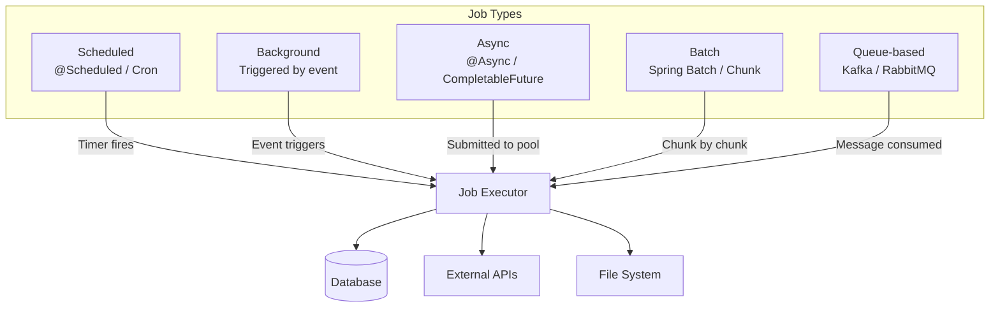
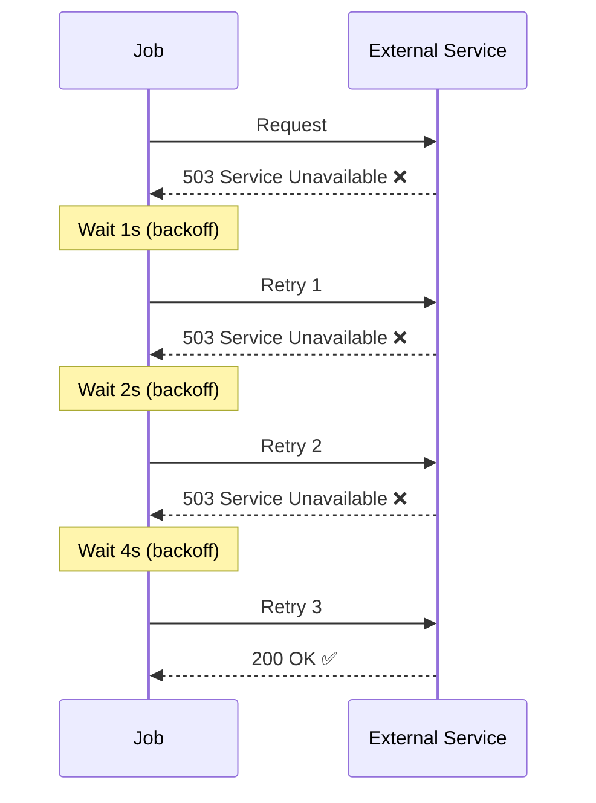
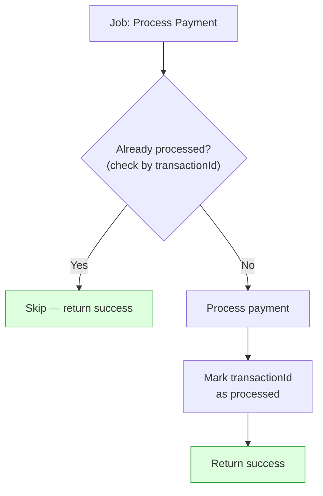
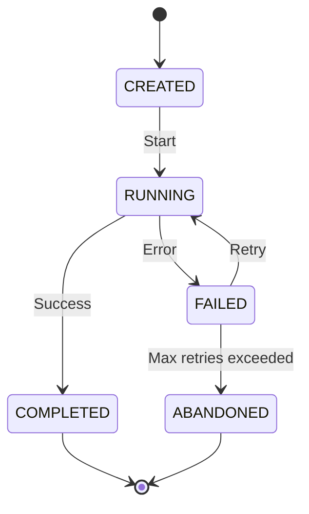
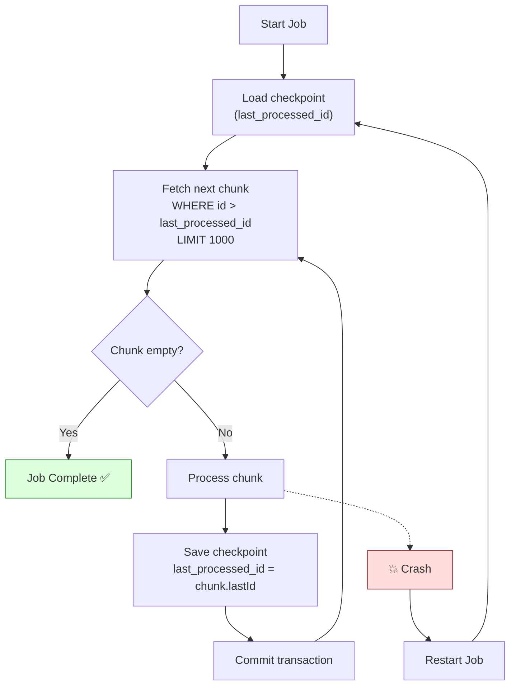
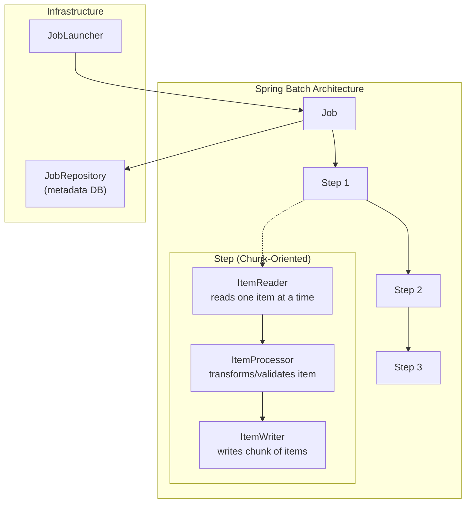
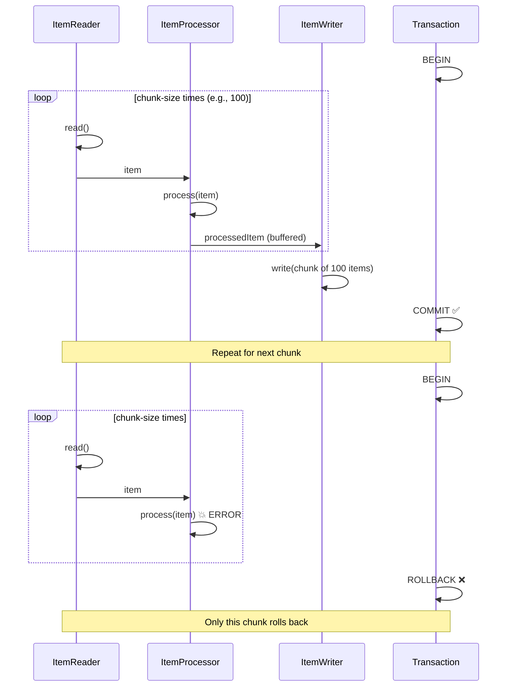
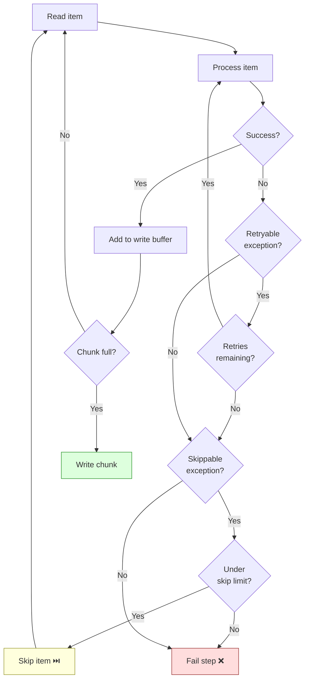
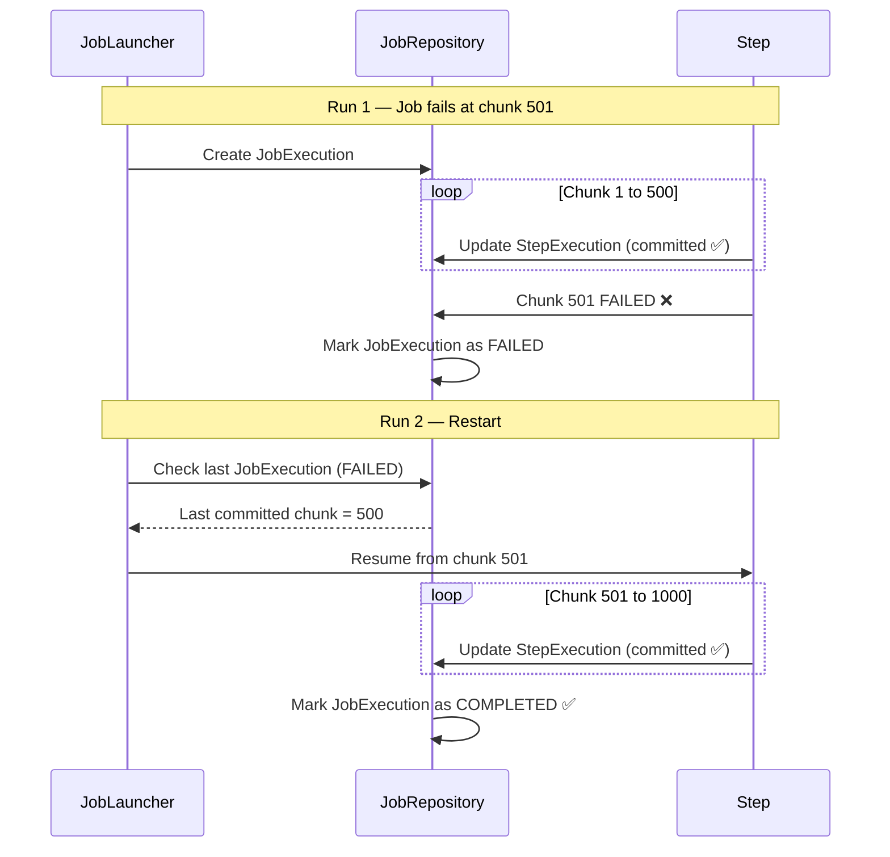
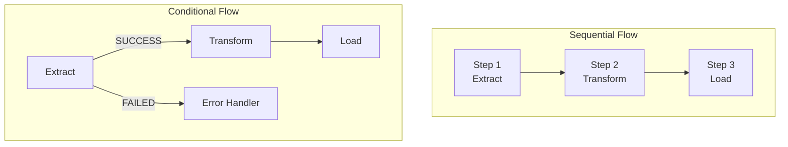

# Job Processing

Scheduled jobs, background jobs, async jobs, retries, batch processing,
idempotent jobs, job state, job checkpointing, and Spring Batch deep dive.

---

## 1. Job Types — Understanding the Landscape

```text
Not all work happens synchronously inside an HTTP request.
Production backends process work in many different ways:

  ┌──────────────────────┬─────────────────────────────────────────────┐
  │ Job Type             │ Description                                 │
  ├──────────────────────┼─────────────────────────────────────────────┤
  │ Scheduled Jobs       │ Run at specific times / intervals           │
  │                      │ e.g., daily report, hourly cleanup          │
  │                      │                                             │
  │ Background Jobs      │ Triggered by an event, run outside the      │
  │                      │ request thread                              │
  │                      │ e.g., send email after signup               │
  │                      │                                             │
  │ Async Jobs           │ Fire-and-forget from the main thread        │
  │                      │ e.g., audit logging, notification push      │
  │                      │                                             │
  │ Batch Jobs           │ Process large volumes of data in chunks     │
  │                      │ e.g., import 1M records, generate invoices  │
  │                      │                                             │
  │ Queue-based Jobs     │ Pulled from a message queue (Kafka, Rabbit) │
  │                      │ e.g., order processing, payment handling    │
  └──────────────────────┴─────────────────────────────────────────────┘
```



---

## 2. Retries

### Why Jobs Fail

```text
Jobs fail for many reasons:
  - Database temporarily unavailable
  - External API returns 503
  - Network timeout
  - Deadlock detected
  - Resource exhaustion (memory, connections)

Many of these are TRANSIENT — they will succeed if you try again.
Retries handle transient failures gracefully.
```

### Retry Strategies

```text
1. IMMEDIATE RETRY
   Retry instantly after failure.
   Risk: If the cause is load, immediate retry makes it worse.

2. FIXED DELAY RETRY
   Wait a fixed duration between retries.
   retry(1) → wait 5s → retry(2) → wait 5s → retry(3)

3. EXPONENTIAL BACKOFF
   Wait increasingly longer between retries.
   retry(1) → wait 1s → retry(2) → wait 2s → retry(3) → wait 4s
   Reduces pressure on the failing system.

4. EXPONENTIAL BACKOFF + JITTER
   Add random jitter to prevent thundering herd.
   retry(1) → wait 1.2s → retry(2) → wait 2.7s → retry(3) → wait 4.1s
   Prevents all instances retrying at exactly the same time.
```



### Max Retries and Dead Letter

```text
Never retry forever. Set a maximum retry count.
After max retries exhausted → move to Dead Letter Queue (DLQ).

  attempt 1: FAIL
  attempt 2: FAIL
  attempt 3: FAIL (max retries = 3)
  → Move to DLQ for manual investigation

DLQ entries should contain:
  - Original job data
  - Error message
  - Retry count
  - Timestamp
  - Stack trace
```

---

## 3. Idempotent Jobs

```text
An idempotent job produces the same result whether it runs once or
multiple times with the same input.

WHY THIS MATTERS:
  - Retries mean the job may run multiple times
  - Crash recovery means the job may re-execute
  - ShedLock failover means another instance picks up

If your job is NOT idempotent, retries cause data corruption:

  NON-IDEMPOTENT (dangerous):
    addBalance(userId, 100)
    → Run twice = user gets $200 instead of $100

  IDEMPOTENT (safe):
    setBalance(userId, transactionId, 100)
    → Run twice = user gets $100 (second run is a no-op)

HOW TO MAKE JOBS IDEMPOTENT:
  1. Use unique identifiers (idempotency keys)
  2. Check-before-write (has this already been processed?)
  3. Database constraints (unique index prevents duplicates)
  4. Use UPSERT instead of INSERT
  5. Track processed IDs in a separate table
```



---

## 4. Job State

```text
Production jobs have well-defined states:

  ┌──────────┐     ┌───────────┐     ┌───────────┐
  │ CREATED  │────►│ RUNNING   │────►│ COMPLETED │
  └──────────┘     └───────────┘     └───────────┘
       │                │                  
       │                │            ┌───────────┐
       │                └───────────►│  FAILED   │
       │                             └───────────┘
       │                                  │
       │                                  ▼
       │                             ┌───────────┐
       └────────────────────────────►│ ABANDONED │
                                     └───────────┘

  CREATED:    Job is registered but not yet started
  RUNNING:    Job is currently executing
  COMPLETED:  Job finished successfully
  FAILED:     Job failed (may be retried)
  ABANDONED:  Job failed and exceeded max retries

Tracking state allows:
  - Monitoring (how many jobs running/failed?)
  - Retry logic (only retry FAILED jobs)
  - Auditing (who ran what, when?)
  - Restart (resume from last successful state)
```



---

## 5. Job Checkpointing

```text
For long-running jobs that process large datasets, you need
CHECKPOINTING — saving progress so you can resume after failure.

WITHOUT checkpointing:
  Process 1M records → crash at record 800,000
  → Restart from record 1 → reprocess 800,000 records
  → Wasted hours of work

WITH checkpointing:
  Process 1M records → checkpoint every 1000 records
  → Crash at record 800,000
  → Restart from checkpoint at record 800,000
  → Only reprocess last partial chunk

How to implement:
  1. Track last successfully processed ID/offset
  2. Save checkpoint to database
  3. On restart, read checkpoint and resume from there
  4. Use transaction per chunk (commit = checkpoint)
```



---

## 6. Spring Batch — Deep Dive

### What Is Spring Batch

```text
Spring Batch is a framework for building robust, large-scale batch
processing applications. It provides:

  - Reusable components for reading, processing, and writing data
  - Transaction management per chunk
  - Skip and retry policies
  - Job restart and recovery
  - Partitioning for parallel processing
  - Metadata tracking (job history, step execution, etc.)

Spring Batch is the standard for enterprise batch processing in Java.
```

### Core Architecture



```text
Key concepts:

  Job:
    The entire batch process. Contains one or more Steps.
    Has a name, parameters, and execution metadata.

  Step:
    A single phase of the job. Can be:
      - Chunk-oriented (read → process → write in chunks)
      - Tasklet (simple, single-operation step)

  ItemReader:
    Reads data from a source (DB, file, API, queue).
    Returns one item at a time. Returns null when done.

  ItemProcessor:
    Transforms or validates each item.
    Can filter items by returning null (skip this item).
    Optional — you can go directly from reader to writer.

  ItemWriter:
    Writes a chunk of processed items to a destination.
    Receives a LIST of items (one chunk), not individual items.

  JobRepository:
    Stores metadata about job executions, step executions,
    and their statuses. Usually backed by a database.

  JobLauncher:
    Starts a job with given parameters.
```

### Chunk Processing — The Core Pattern

```text
Chunk processing reads items one-by-one, processes them, then writes
them in bulk when the chunk size is reached.

  chunk-size = 100:

    read item 1
    read item 2
    ...
    read item 100
    → process items 1–100
    → write items 1–100 (bulk INSERT/UPDATE)
    → COMMIT transaction

    read item 101
    read item 102
    ...
    read item 200
    → process items 101–200
    → write items 101–200
    → COMMIT transaction

  Each chunk = one database transaction.
  If chunk fails → only that chunk rolls back.
  Previous chunks are already committed.

  This is the CHECKPOINT mechanism!
  Spring Batch knows which chunks completed.
  On restart, it resumes from the first uncommitted chunk.
```



### Code Example — Complete Spring Batch Job

```java
@Configuration
@EnableBatchProcessing
public class InvoiceBatchConfig {

    @Bean
    public Job invoiceGenerationJob(
            JobRepository jobRepository,
            Step generateInvoicesStep,
            Step sendNotificationsStep) {

        return new JobBuilder("invoiceGenerationJob", jobRepository)
            .start(generateInvoicesStep)
            .next(sendNotificationsStep)
            .build();
    }

    @Bean
    public Step generateInvoicesStep(
            JobRepository jobRepository,
            PlatformTransactionManager transactionManager,
            ItemReader<Order> orderReader,
            ItemProcessor<Order, Invoice> invoiceProcessor,
            ItemWriter<Invoice> invoiceWriter) {

        return new StepBuilder("generateInvoicesStep", jobRepository)
            .<Order, Invoice>chunk(100, transactionManager)  // chunk size = 100
            .reader(orderReader)
            .processor(invoiceProcessor)
            .writer(invoiceWriter)
            .faultTolerant()
            .skipLimit(10)                      // skip up to 10 bad records
            .skip(InvalidOrderException.class)  // skip this type of error
            .retryLimit(3)                      // retry up to 3 times
            .retry(DatabaseException.class)     // retry on DB errors
            .build();
    }

    // --- Reader: reads from database ---
    @Bean
    public JdbcCursorItemReader<Order> orderReader(DataSource dataSource) {
        return new JdbcCursorItemReaderBuilder<Order>()
            .name("orderReader")
            .dataSource(dataSource)
            .sql("SELECT id, customer_id, total, status FROM orders " +
                 "WHERE status = 'PENDING_INVOICE' ORDER BY id")
            .rowMapper(new OrderRowMapper())
            .build();
    }

    // --- Processor: transform Order → Invoice ---
    @Bean
    public ItemProcessor<Order, Invoice> invoiceProcessor() {
        return order -> {
            if (order.getTotal().compareTo(BigDecimal.ZERO) <= 0) {
                return null;  // returning null = skip this item
            }
            return Invoice.builder()
                .orderId(order.getId())
                .customerId(order.getCustomerId())
                .amount(order.getTotal())
                .generatedAt(Instant.now())
                .build();
        };
    }

    // --- Writer: bulk insert invoices ---
    @Bean
    public JdbcBatchItemWriter<Invoice> invoiceWriter(DataSource dataSource) {
        return new JdbcBatchItemWriterBuilder<Invoice>()
            .dataSource(dataSource)
            .sql("INSERT INTO invoices (order_id, customer_id, amount, generated_at) " +
                 "VALUES (:orderId, :customerId, :amount, :generatedAt)")
            .beanMapped()
            .build();
    }
}
```

---

## 7. Skip and Retry in Spring Batch

### Skip

```text
Skip allows the job to continue even when some items fail.
Without skip, one bad record fails the entire chunk → entire job stops.

With skip:
  - Bad record is skipped
  - Other records in the chunk are still processed
  - Skipped items are logged for later investigation
  - Job continues with next chunk

Configuration:
  .faultTolerant()
  .skipLimit(10)                        // max 10 skips total
  .skip(InvalidDataException.class)     // skip on this exception
  .noSkip(DatabaseDownException.class)  // NEVER skip on this

When to use:
  - Data quality issues (some records have bad data)
  - Import jobs where a few bad records are acceptable
  - NOT for infrastructure errors (DB down = don't skip, fail the job)
```

### Retry

```text
Retry re-attempts the processing of an item after a transient failure.

With retry:
  - Process item → fails with DeadlockException
  - Wait → retry processing the same item
  - If retry succeeds → continue normally
  - If max retries exhausted → fail (or skip if skip is configured)

Configuration:
  .faultTolerant()
  .retryLimit(3)
  .retry(DeadlockLoserDataAccessException.class)
  .retry(OptimisticLockingFailureException.class)

When to use:
  - Deadlocks (database retry)
  - Optimistic locking conflicts
  - Transient network errors
  - NOT for permanent errors (invalid data will fail every time)
```



---

## 8. Restartability

```text
Spring Batch tracks execution state in the JobRepository.
If a job fails, you can RESTART it from where it left off.

HOW IT WORKS:

  Job run 1: Process 1M records in chunks of 1000
    Chunk 1–500: committed ✅ (500,000 records done)
    Chunk 501: FAILS ❌ (DB connection lost)

  Job run 2 (restart):
    Spring Batch reads JobRepository metadata
    Sees chunks 1–500 already committed
    Resumes from chunk 501
    Only processes remaining 500,000 records

  This saves HOURS of reprocessing.

REQUIREMENTS FOR RESTARTABILITY:
  1. ItemReader must be re-openable at the last position
     JdbcCursorItemReader and FlatFileItemReader support this.

  2. Job must use the SAME job parameters
     Same parameters = restart. Different parameters = new execution.

  3. Step must not be marked as non-restartable
     .allowStartIfComplete(false) — default, allows restart

IMPORTANT:
  Tasklet steps are NOT restartable by default.
  You must implement your own checkpointing for Tasklets.
```



---

## 9. Job Flow and Conditional Steps

```java
// Sequential steps
@Bean
public Job sequentialJob(JobRepository repo, Step step1, Step step2, Step step3) {
    return new JobBuilder("sequentialJob", repo)
        .start(step1)
        .next(step2)
        .next(step3)
        .build();
}

// Conditional flow
@Bean
public Job conditionalJob(JobRepository repo,
        Step extractStep, Step transformStep,
        Step loadStep, Step errorStep) {
    return new JobBuilder("conditionalJob", repo)
        .start(extractStep)
            .on("FAILED").to(errorStep)   // if extract fails → error step
            .from(extractStep).on("*").to(transformStep)  // otherwise → transform
        .from(transformStep)
            .on("*").to(loadStep)
        .end()
        .build();
}
```



---

## 10. Tasklet vs Chunk

```text
┌──────────────────────┬──────────────────────────┬──────────────────────────┐
│ Aspect               │ Tasklet                  │ Chunk-Oriented           │
├──────────────────────┼──────────────────────────┼──────────────────────────┤
│ Use case             │ Simple, single operation │ Process many items       │
│ Example              │ Delete temp files        │ Import 1M CSV records    │
│ Transaction          │ One per tasklet          │ One per chunk            │
│ Restart              │ Manual                   │ Automatic (by chunk)     │
│ Complexity           │ Simple                   │ More structure           │
│ When to use          │ Cleanup, setup, one-shot │ ETL, data migration      │
└──────────────────────┴──────────────────────────┴──────────────────────────┘
```

```java
// Tasklet example — simple one-shot operation
@Bean
public Step cleanupStep(JobRepository repo,
        PlatformTransactionManager txManager) {
    return new StepBuilder("cleanupStep", repo)
        .tasklet((contribution, chunkContext) -> {
            fileService.deleteTemporaryFiles();
            return RepeatStatus.FINISHED;
        }, txManager)
        .build();
}
```

---

## 11. Common ItemReaders and ItemWriters

```text
READERS:
  JdbcCursorItemReader     — reads from DB using a cursor (streaming)
  JdbcPagingItemReader     — reads from DB page by page (restart-safe)
  FlatFileItemReader       — reads from CSV / fixed-width files
  JsonItemReader           — reads from JSON files
  StaxEventItemReader      — reads from XML files
  KafkaItemReader          — reads from Kafka topic

WRITERS:
  JdbcBatchItemWriter      — bulk writes to DB using batch SQL
  JpaItemWriter            — writes using JPA EntityManager
  FlatFileItemWriter       — writes to CSV / fixed-width files
  JsonFileItemWriter       — writes to JSON files
  KafkaItemWriter          — writes to Kafka topic
  CompositeItemWriter      — delegates to multiple writers

PROCESSORS:
  Custom (implement ItemProcessor<I, O>)
  CompositeItemProcessor   — chains multiple processors
  ValidatingItemProcessor  — validates items with a Validator
```

---

## 12. Interview Questions

### Q1: What is the difference between a scheduled job and a batch job?

```text
Scheduled job:
  Triggered by a timer (cron, fixed rate).
  Can be simple or complex.
  Example: @Scheduled cleanup every hour.

Batch job:
  Processes a large volume of data in chunks.
  Has well-defined read → process → write steps.
  Has built-in checkpointing, restart, skip, retry.
  Example: Spring Batch job importing 1M records from CSV.

A scheduled job can TRIGGER a batch job, but they are different concepts.
```

### Q2: Why must jobs be idempotent?

```text
Because jobs may run more than once due to:
  - Retries after transient failures
  - Restart after crash
  - ShedLock failover to another instance
  - Manual re-trigger

If the job inserts a row without checking if it already exists,
re-execution creates duplicates. Idempotent jobs produce the same
result regardless of how many times they execute.

Techniques: unique constraints, check-before-write, upserts,
idempotency keys, tracking processed IDs.
```

### Q3: Explain chunk-oriented processing in Spring Batch.

```text
Chunk processing reads N items (chunk-size), processes them
one-by-one, then writes all N items in bulk within a single transaction.

  read(1), read(2), ..., read(N)
  process(1), process(2), ..., process(N)
  write([1, 2, ..., N])
  COMMIT

Benefits:
  - Transaction per chunk (not per item, not per job)
  - Efficient bulk writes
  - Automatic checkpointing (committed chunks are done)
  - Memory-efficient (only N items in memory at a time)
  - Restartable from last committed chunk
```

### Q4: What happens when a chunk fails in Spring Batch?

```text
Only the current chunk's transaction is rolled back.
All previously committed chunks remain committed.

If fault-tolerant processing is configured:
  1. Spring Batch retries the entire chunk
  2. If retry fails, it goes item-by-item to find the bad record
  3. Bad record is skipped (if skip is configured)
  4. Good records in the chunk are re-processed and committed

If no fault tolerance: the step fails, the job fails.
On restart, the job resumes from the failed chunk.
```

### Q5: What is the difference between skip and retry?

```text
Skip:
  Ignores a bad record and continues processing.
  Used for DATA errors (invalid format, missing required field).
  The item is permanently skipped — not retried.

Retry:
  Re-attempts processing the same item.
  Used for TRANSIENT errors (deadlock, timeout, connection issue).
  The item may succeed on the next attempt.

They can be combined:
  retry 3 times → if still failing → skip the item
```

### Q6: How does Spring Batch restartability work?

```text
Spring Batch stores execution metadata in the JobRepository:
  - Which chunks have been committed
  - Reader position (last read cursor/offset)
  - Step execution status

On restart:
  - Same job + same parameters = restart (not a new execution)
  - Reader reopens at the last saved position
  - Already-committed chunks are NOT re-processed
  - Processing resumes from the first uncommitted chunk

Requirements:
  - Reader must support saving/restoring state
  - Job parameters must match the failed execution
  - JobRepository must be persistent (not in-memory)
```

### Q7: What is job checkpointing and why does it matter?

```text
Checkpointing saves progress periodically so a failed job can resume
from the last saved point instead of starting from scratch.

In Spring Batch: each committed chunk IS a checkpoint.
  1000 chunks of 100 items = checkpoints at 100, 200, ..., 100000

Without checkpointing: crash at record 800,000 → redo all 800,000.
With checkpointing: crash at record 800,000 → resume from 800,000.

For non-Spring-Batch jobs, implement manually:
  - Save last_processed_id to a tracking table
  - On restart, query WHERE id > last_processed_id
```

### Q8: When would you choose Tasklet over Chunk processing?

```text
Tasklet:
  - Simple, single operation (delete files, send summary email)
  - No item-by-item processing
  - No need for skip/retry at item level
  - No restartability needed

Chunk:
  - Processing many items (100s to millions)
  - Need per-item transformation
  - Need skip/retry per item
  - Need restartability (resume from failure)
  - Need memory efficiency (streaming, not loading all at once)
```

### Q9: How do you handle a batch job that processes millions of records?

```text
1. Use chunk processing with appropriate chunk size
   Too small (1): slow (too many commits)
   Too large (100K): memory issues, long transactions
   Sweet spot: 100–1000 depending on row size

2. Use JdbcPagingItemReader (restart-safe, memory efficient)

3. Set appropriate skip/retry policies

4. Consider partitioning for parallel processing
   Split data by range (id 1–100K, 100K–200K, etc.)
   Each partition runs in its own thread

5. Monitor with Spring Batch metadata tables
   Track progress, duration, error counts

6. Use indexes on the reader query
   Without index: full table scan on every chunk → hours
   With index: indexed seek → minutes
```

### Q10: What is the difference between JdbcCursorItemReader and JdbcPagingItemReader?

```text
JdbcCursorItemReader:
  Opens a DB cursor (streaming result set)
  Holds a database connection for the entire step
  Fast (single query, streaming)
  NOT restart-safe by default (cursor position not saved)
  Risk: long-held connection may time out

JdbcPagingItemReader:
  Executes separate SQL queries per page (OFFSET/LIMIT or keyset)
  Releases connection between pages
  Slower (multiple queries)
  Restart-safe (saves page number in execution context)
  Better for very large datasets and long-running jobs

For restartable jobs: prefer JdbcPagingItemReader.
For speed with smaller datasets: JdbcCursorItemReader.
```
