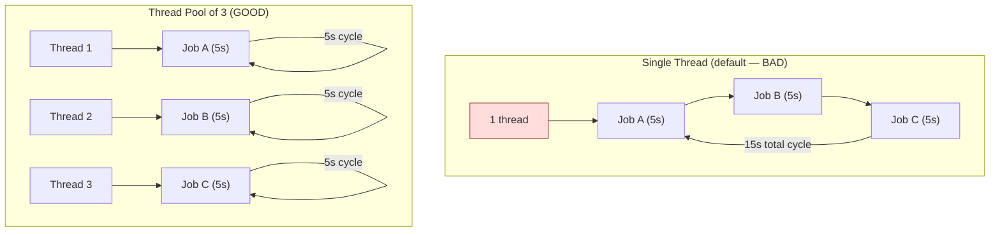
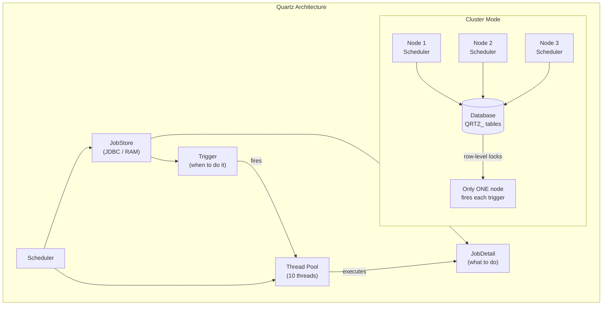
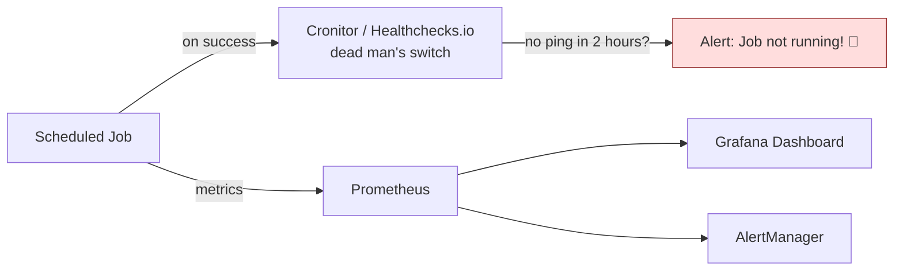

# Job Scheduling in Spring Boot

`@Scheduled`, cron expressions, fixedRate vs fixedDelay, thread pool
configuration, TaskScheduler, dynamic scheduling, Quartz integration,
scheduling best practices, and interview questions.

> Related docs:
> - [Distributed Scheduling (ShedLock)](../Distributed-Scheduling/README.md)
> - [Job Processing & Spring Batch](../Job-Processing/README.md)

---

## 1. What Is Job Scheduling?

```text
Job scheduling = executing code automatically at a specific time
or at regular intervals, WITHOUT a manual trigger.

  USE CASES:
    - Generate daily reports at midnight
    - Send reminder emails every morning at 9 AM
    - Clean up expired sessions every 15 minutes
    - Sync data from external API every hour
    - Archive old records monthly
    - Health check pings every 30 seconds
    - Retry failed operations every 5 minutes

  NOT the same as:
    - Async processing (triggered by a request, not time)
    - Message consumers (triggered by a message, not time)
    - Event listeners (triggered by an event, not time)

  Scheduling is TIME-TRIGGERED, not EVENT-TRIGGERED.
```

---

## 2. @EnableScheduling and @Scheduled — Basics

### Enabling Scheduling

```java
@SpringBootApplication
@EnableScheduling  // activates Spring's scheduling infrastructure
public class MyApplication {
    public static void main(String[] args) {
        SpringApplication.run(MyApplication.class, args);
    }
}
```

```text
@EnableScheduling does:
  1. Creates a TaskScheduler bean (default: single-threaded)
  2. Scans for @Scheduled methods in Spring beans
  3. Registers them with the TaskScheduler
  4. Starts the scheduler

Without @EnableScheduling: @Scheduled annotations are IGNORED silently.
```

### @Scheduled — Three Trigger Types

```java
@Component
@Slf4j
public class ScheduledTasks {

    // ── 1. FIXED RATE ──
    // Fires every 5000ms from the START of the previous execution.
    // Next execution starts regardless of whether previous finished.
    @Scheduled(fixedRate = 5000)
    public void fixedRateTask() {
        log.info("Fixed rate task - {}", Instant.now());
    }

    // ── 2. FIXED DELAY ──
    // Fires 5000ms after the END of the previous execution.
    // Waits for previous to finish before starting the countdown.
    @Scheduled(fixedDelay = 5000)
    public void fixedDelayTask() {
        log.info("Fixed delay task - {}", Instant.now());
    }

    // ── 3. CRON EXPRESSION ──
    // Fires at specific times defined by cron expression.
    @Scheduled(cron = "0 0 9 * * MON-FRI")  // 9 AM weekdays
    public void cronTask() {
        log.info("Cron task - {}", Instant.now());
    }
}
```

### fixedRate vs fixedDelay — Critical Difference

```text
fixedRate = 5000 (5 seconds):

  Time:   0s     5s     10s    15s    20s
          |------|------|------|------|
  Exec:   [T1]   [T2]   [T3]   [T4]

  If T2 takes 8 seconds:
  Time:   0s     5s     10s   13s    15s
          |------|------|-----|------|
  Exec:   [T1]   [T2--------][T3]   [T4]

  T3 starts IMMEDIATELY after T2 finishes (was already overdue).
  T3 and T4 may bunch up if execution keeps taking longer.

  Use for: heartbeats, periodic polling where frequency matters.
  Risk: if execution > rate → tasks overlap or pile up.


fixedDelay = 5000 (5 seconds):

  Time:   0s     5s     10s    15s    20s
          |------|------|------|------|
  Exec:   [T1]   ←5s→  [T2]   ←5s→  [T3]

  If T1 takes 3 seconds:
  Time:   0s  3s     8s  11s    16s
          |---|------|---|------|
  Exec:   [T1]←5s→  [T2]←5s→  [T3]

  Always 5 seconds GAP between end of one and start of next.
  Executions never overlap. Predictable spacing.

  Use for: cleanup jobs, sync jobs where you need guaranteed gap.
  Safer: no overlap risk.
```





```mermaid
gantt
    title fixedRate=5000 (overlap risk)
    dateFormat X
    axisFormat %Ls

    section Normal
    T1 (2s)        :t1, 0, 2000
    T2 (2s)        :t2, 5000, 7000
    T3 (2s)        :t3, 10000, 12000

    section Slow T2
    T1 (2s)        :s1, 0, 2000
    T2 (8s SLOW)   :crit, s2, 5000, 13000
    T3 (immediately):s3, 13000, 15000
```

```mermaid
gantt
    title fixedDelay=5000 (safe gap)
    dateFormat X
    axisFormat %Ls

    section Normal
    T1 (2s)        :t1, 0, 2000
    gap            :g1, 2000, 7000
    T2 (2s)        :t2, 7000, 9000
    gap            :g2, 9000, 14000
    T3 (2s)        :t3, 14000, 16000
```

### initialDelay

```java
// Wait 10 seconds after startup before first execution
@Scheduled(fixedRate = 5000, initialDelay = 10000)
public void delayedStart() {
    log.info("First run 10s after startup, then every 5s");
}

// Use with time unit for readability
@Scheduled(fixedRateString = "PT5S", initialDelayString = "PT10S")
public void withDuration() {
    log.info("Using ISO-8601 duration strings");
}
```

### Externalized Configuration

```java
// Use properties instead of hardcoded values
@Scheduled(fixedRateString = "${scheduler.report.rate:60000}")
public void configurable() {
    log.info("Rate is configurable via application.yml");
}

@Scheduled(cron = "${scheduler.cleanup.cron:0 0 2 * * *}")
public void configurableCron() {
    log.info("Cron is configurable via application.yml");
}
```

```yaml
# application.yml
scheduler:
  report:
    rate: 60000          # every 60 seconds
  cleanup:
    cron: "0 0 2 * * *"  # 2 AM daily
```

### Disabling a Scheduled Job

```java
// Use a special cron expression to disable
@Scheduled(cron = "${scheduler.job.cron:-}")  // "-" = disabled
public void optionalJob() {
    // won't run if cron is "-"
}
```

```yaml
# To disable the job:
scheduler:
  job:
    cron: "-"
```

---

## 3. Cron Expressions — Deep Dive

### Spring Cron Format (6 fields)

```text
Spring uses a 6-field cron expression (NOT Unix's 5-field):

  ┌─────── second (0-59)
  │ ┌───── minute (0-59)
  │ │ ┌─── hour (0-23)
  │ │ │ ┌─ day of month (1-31)
  │ │ │ │ ┌── month (1-12 or JAN-DEC)
  │ │ │ │ │ ┌── day of week (0-7 or MON-SUN, 0 and 7 = Sunday)
  │ │ │ │ │ │
  * * * * * *

  UNIX cron has 5 fields (no seconds).
  Spring cron has 6 fields (seconds included).
  Quartz cron has 7 fields (seconds + year).

  DO NOT confuse them! A Unix cron pasted into Spring will break.
```

### Special Characters

```text
  *     Any value            "every"
  ?     No specific value    (used in day-of-month / day-of-week)
  -     Range                MON-FRI = Monday to Friday
  ,     List                 1,15 = 1st and 15th
  /     Step                 0/15 = every 15 (starting at 0)
  L     Last                 Last day of month (day-of-month field)
  W     Weekday              Nearest weekday (Quartz only)
  #     Nth occurrence        2#1 = first Monday (Quartz only)
```

### Common Cron Examples

```text
  ┌────────────────────────────┬─────────────────────────────────────┐
  │ Expression                 │ Meaning                             │
  ├────────────────────────────┼─────────────────────────────────────┤
  │ 0 * * * * *                │ Every minute (at second 0)          │
  │ */10 * * * * *             │ Every 10 seconds                    │
  │ 0 */5 * * * *              │ Every 5 minutes                     │
  │ 0 0 * * * *                │ Every hour (at minute 0)            │
  │ 0 0 9 * * *                │ Every day at 9:00 AM                │
  │ 0 0 9 * * MON-FRI          │ Weekdays at 9:00 AM                │
  │ 0 0 0 * * *                │ Every day at midnight               │
  │ 0 0 0 1 * *                │ First day of every month, midnight  │
  │ 0 0 0 1 1 *                │ January 1st, midnight (yearly)      │
  │ 0 0 9,17 * * MON-FRI       │ Weekdays at 9 AM and 5 PM          │
  │ 0 30 9 * * MON              │ Every Monday at 9:30 AM            │
  │ 0 0 0 L * *                │ Last day of every month, midnight  │
  │ 0 0/30 8-17 * * MON-FRI    │ Every 30 min, 8AM-5PM, weekdays   │
  └────────────────────────────┴─────────────────────────────────────┘

  COMMON MISTAKES:
    ❌ * * * * *       → 5 fields (Unix format, missing seconds)
    ✅ 0 * * * * *     → 6 fields (Spring format, correct)
    ❌ 0 0 25 * * *    → 25 is not a valid hour (0-23)
    ❌ 60 * * * * *    → 60 is not a valid second (0-59)
```

### Timezone Support

```java
// Schedule in a specific timezone
@Scheduled(cron = "0 0 9 * * MON-FRI", zone = "America/New_York")
public void nineAmNewYork() {
    // always runs at 9 AM Eastern, regardless of server timezone
}

@Scheduled(cron = "0 0 9 * * *", zone = "Asia/Kolkata")
public void nineAmIndia() {
    // always runs at 9 AM IST
}
```

```text
ALWAYS specify timezone for production cron jobs.
Without it: uses the JVM's default timezone.
If server is in UTC and you expect IST → job runs 5.5 hours early.
If JVM timezone changes (cloud migration) → jobs shift.
```

---

## 4. Thread Pool Configuration

### The Single-Thread Problem

```text
DEFAULT: Spring uses a SINGLE-THREADED scheduler.

  @Scheduled(fixedRate = 1000) void jobA() { sleep(5000); }
  @Scheduled(fixedRate = 1000) void jobB() { sleep(5000); }
  @Scheduled(fixedRate = 1000) void jobC() { sleep(5000); }

  ONE thread handles ALL three jobs.
  jobA runs (5s) → jobB runs (5s) → jobC runs (5s) → jobA...
  Each job runs every 15 seconds, not every 1 second!

  This is the #1 scheduling bug in Spring Boot applications.
```

### Configuring Thread Pool

```java
// Option 1: application.yml (Spring Boot 3.2+)
// spring.task.scheduling.pool.size: 5

// Option 2: Java configuration
@Configuration
public class SchedulerConfig {

    @Bean
    public TaskScheduler taskScheduler() {
        ThreadPoolTaskScheduler scheduler = new ThreadPoolTaskScheduler();
        scheduler.setPoolSize(5);
        scheduler.setThreadNamePrefix("scheduler-");
        scheduler.setErrorHandler(t ->
            log.error("Scheduled task failed", t));
        scheduler.setRejectedExecutionHandler(
            new ThreadPoolExecutor.CallerRunsPolicy());
        scheduler.setWaitForTasksToCompleteOnShutdown(true);
        scheduler.setAwaitTerminationSeconds(30);
        scheduler.initialize();
        return scheduler;
    }
}
```

```text
HOW TO SIZE THE POOL:
  Pool size = number of CONCURRENT scheduled tasks expected.

  If you have:
    3 jobs that run every minute (could overlap) → pool ≥ 3
    + 2 jobs that run every 5 seconds → pool ≥ 5
    Add buffer → pool = 7-10

  Too small: jobs queue up, run late.
  Too large: wasted threads, resource consumption.

  For most apps: 3-10 threads is sufficient.
```



---

## 5. Error Handling in Scheduled Tasks

```text
CRITICAL: By default, if a @Scheduled method throws an exception,
Spring LOGS it and CONTINUES scheduling the next execution.
The exception is SWALLOWED.

  This means:
    - Your job fails silently
    - No alert, no notification
    - Looks like it's running but it's doing nothing
```

### Proper Error Handling

```java
@Component
@Slf4j
public class RobustScheduledTask {

    private final MeterRegistry meterRegistry;
    private final AlertService alertService;

    // Option 1: try-catch in the method itself
    @Scheduled(cron = "0 0 2 * * *")
    public void generateDailyReport() {
        Timer.Sample sample = Timer.start(meterRegistry);
        try {
            log.info("Starting daily report generation");
            reportService.generate();
            meterRegistry.counter("scheduler.report.success").increment();
            log.info("Daily report generated successfully");
        } catch (Exception e) {
            log.error("Daily report generation FAILED", e);
            meterRegistry.counter("scheduler.report.failure").increment();
            alertService.sendAlert("Daily report failed: " + e.getMessage());
        } finally {
            sample.stop(meterRegistry.timer("scheduler.report.duration"));
        }
    }
}
```

### Global Error Handler

```java
@Configuration
public class SchedulerConfig {

    @Bean
    public TaskScheduler taskScheduler() {
        ThreadPoolTaskScheduler scheduler = new ThreadPoolTaskScheduler();
        scheduler.setPoolSize(5);
        scheduler.setErrorHandler(throwable -> {
            // Global handler for ALL scheduled task failures
            log.error("Unhandled exception in scheduled task", throwable);
            Metrics.counter("scheduler.unhandled.error",
                "exception", throwable.getClass().getSimpleName())
                .increment();
            // Send to error tracking (Sentry, etc.)
        });
        return scheduler;
    }
}
```

---

## 6. Conditional Scheduling

### Enable/Disable by Profile

```java
@Component
@Profile("!test")  // disabled during tests
public class ProductionScheduledTasks {

    @Scheduled(cron = "0 0 2 * * *")
    public void nightly() { ... }
}
```

### Enable/Disable by Property

```java
@Component
@ConditionalOnProperty(
    name = "scheduler.report.enabled",
    havingValue = "true",
    matchIfMissing = false
)
public class ReportScheduler {

    @Scheduled(cron = "${scheduler.report.cron}")
    public void generate() { ... }
}
```

```yaml
scheduler:
  report:
    enabled: true
    cron: "0 0 9 * * MON-FRI"
```

### Using @ConditionalOnProperty Per Method

```java
@Component
public class ScheduledTasks {

    @Value("${scheduler.cleanup.enabled:true}")
    private boolean cleanupEnabled;

    @Scheduled(fixedRate = 60000)
    public void cleanup() {
        if (!cleanupEnabled) return;  // guard check
        // do cleanup
    }
}
```

---

## 7. Dynamic Scheduling

### SchedulingConfigurer — Runtime Cron Changes

```java
@Component
public class DynamicScheduler implements SchedulingConfigurer {

    private final ScheduleConfigRepository configRepo;

    @Override
    public void configureTasks(ScheduledTaskRegistrar registrar) {
        registrar.addTriggerTask(
            // The task to run
            () -> {
                log.info("Dynamic task executing");
                processData();
            },
            // The trigger that determines WHEN to run
            triggerContext -> {
                // Read cron from database at EACH scheduling decision
                String cron = configRepo.findCronByJobName("data-sync")
                    .orElse("0 */5 * * * *");  // default: every 5 min
                return new CronTrigger(cron).nextExecution(triggerContext);
            }
        );
    }
}
```

```text
WHY DYNAMIC SCHEDULING:
  - Change job frequency without redeployment
  - Admin UI to enable/disable/reconfigure jobs
  - Different schedules per tenant (multi-tenant SaaS)
  - A/B testing different scheduling intervals
  - Emergency: increase frequency during incidents

The trigger function is called EVERY TIME the scheduler needs
to determine the next execution time. So it re-reads the cron
from the database each time → changes take effect immediately.
```

### TaskScheduler Programmatic API

```java
@Service
public class JobManagerService {

    private final TaskScheduler taskScheduler;
    private final Map<String, ScheduledFuture<?>> runningJobs = new ConcurrentHashMap<>();

    // Start a job dynamically
    public void startJob(String jobId, Runnable task, String cron) {
        ScheduledFuture<?> future = taskScheduler.schedule(
            task, new CronTrigger(cron));
        runningJobs.put(jobId, future);
        log.info("Started job {} with cron {}", jobId, cron);
    }

    // Stop a running job
    public void stopJob(String jobId) {
        ScheduledFuture<?> future = runningJobs.remove(jobId);
        if (future != null) {
            future.cancel(false);  // false = don't interrupt if running
            log.info("Stopped job {}", jobId);
        }
    }

    // Reschedule a job with new cron
    public void reschedule(String jobId, Runnable task, String newCron) {
        stopJob(jobId);
        startJob(jobId, task, newCron);
        log.info("Rescheduled job {} to {}", jobId, newCron);
    }
}
```

---

## 8. Quartz Scheduler

### Why Quartz Over @Scheduled

```text
@Scheduled is SIMPLE but LIMITED:
  ✅ Easy setup, annotation-driven
  ✅ Good for simple periodic tasks
  ❌ Single-node only (no cluster coordination)
  ❌ No persistence (jobs lost on restart)
  ❌ No built-in retry on failure
  ❌ No job management UI
  ❌ No job parameters or data passing
  ❌ No dependency between jobs (job chaining)

Quartz is a FULL-FEATURED job scheduler:
  ✅ Persistent job store (JDBC)
  ✅ Cluster-aware (database-based locking)
  ✅ Misfire handling (what happens if job missed)
  ✅ Job data map (pass parameters to jobs)
  ✅ Job chaining and listeners
  ✅ Calendars (exclusions — skip holidays)
  ✅ Rich trigger types (cron, calendar, daily interval)
  ❌ More complex setup
  ❌ Requires database tables for persistence

USE @Scheduled when:
  Single instance, simple jobs, no persistence needed.

USE Quartz when:
  Multi-instance, job persistence, misfire handling, complex scheduling.

USE ShedLock when:
  Multi-instance @Scheduled (simpler than Quartz).
```

### Quartz Integration with Spring Boot

```xml
<dependency>
    <groupId>org.springframework.boot</groupId>
    <artifactId>spring-boot-starter-quartz</artifactId>
</dependency>
```

```yaml
# application.yml
spring:
  quartz:
    job-store-type: jdbc                    # persist to database
    jdbc:
      initialize-schema: always             # create tables on startup
    properties:
      org.quartz:
        scheduler:
          instanceName: MyClusteredScheduler
          instanceId: AUTO                  # unique per node
        jobStore:
          isClustered: true                 # enable clustering
          clusterCheckinInterval: 20000     # 20s heartbeat
          driverDelegateClass: org.quartz.impl.jdbcjobstore.PostgreSQLDelegate
          tablePrefix: QRTZ_
        threadPool:
          threadCount: 10
```

### Quartz Job and Trigger

```java
// Job definition — implements Quartz Job interface
@Component
public class ReportGenerationJob implements Job {

    @Autowired
    private ReportService reportService;

    @Override
    public void execute(JobExecutionContext context) {
        JobDataMap data = context.getMergedJobDataMap();
        String reportType = data.getString("reportType");

        log.info("Generating {} report", reportType);
        reportService.generate(reportType);
    }
}

// Job registration — configure on startup
@Configuration
public class QuartzConfig {

    @Bean
    public JobDetail reportJobDetail() {
        return JobBuilder.newJob(ReportGenerationJob.class)
            .withIdentity("reportJob", "reporting")
            .withDescription("Daily report generation")
            .usingJobData("reportType", "daily-summary")
            .storeDurably()       // keep even when no trigger
            .build();
    }

    @Bean
    public Trigger reportTrigger(JobDetail reportJobDetail) {
        return TriggerBuilder.newTrigger()
            .forJob(reportJobDetail)
            .withIdentity("reportTrigger", "reporting")
            .withSchedule(CronScheduleBuilder
                .cronSchedule("0 0 2 * * ?")       // 2 AM daily
                .withMisfireHandlingInstructionFireAndProceed()
                .inTimeZone(TimeZone.getTimeZone("Asia/Kolkata")))
            .build();
    }
}
```

### Quartz Core Concepts

```text
  JOB: The work to be done (implements Job interface).
       Stateless by default. New instance per execution.

  JOB DETAIL: Definition of a job (name, group, data, class).
              Stored in the job store. Can exist without a trigger.

  TRIGGER: Defines WHEN a job runs.
    - CronTrigger: cron expression based
    - SimpleTrigger: repeat count + interval based
    - CalendarIntervalTrigger: calendar-based intervals
    - DailyTimeIntervalTrigger: daily time range + interval

  SCHEDULER: Manages jobs and triggers. Coordinates execution.
             In cluster mode: uses DB locks for coordination.

  JOB STORE:
    - RAMJobStore: in-memory (fast, not persistent, not clustered)
    - JDBCJobStore: database (persistent, clusterable)

  MISFIRE: When a trigger's fire time is missed.
    Reasons: scheduler was down, all threads busy, system overloaded.
    Strategies:
      - FireAndProceed: fire once now, then resume normal schedule
      - DoNothing: skip the missed fire, wait for next scheduled time
      - IgnoreMisfires: fire all missed triggers immediately
```



---

## 9. Scheduling Options Compared

```text
┌───────────────────┬──────────────────┬──────────────────┬─────────────────────┐
│ Feature           │ @Scheduled       │ @Scheduled       │ Quartz              │
│                   │                  │ + ShedLock       │                     │
├───────────────────┼──────────────────┼──────────────────┼─────────────────────┤
│ Setup complexity  │ Very simple      │ Simple           │ Moderate            │
│ Cluster-safe      │ ❌ No            │ ✅ Yes           │ ✅ Yes              │
│ Persistence       │ ❌ No            │ Lock only        │ ✅ Full             │
│ Misfire handling  │ ❌ No            │ ❌ No            │ ✅ Yes              │
│ Job parameters    │ ❌ No            │ ❌ No            │ ✅ JobDataMap       │
│ Dynamic schedule  │ Limited          │ Limited          │ ✅ Full API         │
│ Job chaining      │ ❌ No            │ ❌ No            │ ✅ Listeners        │
│ UI / management   │ ❌ No            │ ❌ No            │ External tools      │
│ Dependencies      │ None             │ ShedLock lib     │ spring-boot-starter │
│ DB tables needed  │ No               │ 1 table          │ ~11 tables          │
│ Best for          │ Simple, single   │ Multi-instance   │ Complex scheduling  │
│                   │ instance jobs    │ simple jobs      │ needs               │
└───────────────────┴──────────────────┴──────────────────┴─────────────────────┘

DECISION GUIDE:
  Single instance + simple jobs       → @Scheduled
  Multi-instance + simple jobs        → @Scheduled + ShedLock
  Multi-instance + complex needs      → Quartz
  Distributed + event-driven          → Kafka/RabbitMQ consumers (not scheduling)
```

---

## 10. Best Practices for Production

```text
1. ALWAYS CONFIGURE A THREAD POOL:
   Default is 1 thread. Every production app needs ≥ 3 threads.
   spring.task.scheduling.pool.size: 5

2. ALWAYS SET TIMEZONE FOR CRON JOBS:
   @Scheduled(cron = "...", zone = "Asia/Kolkata")
   Prevents surprises when servers are in different timezones.

3. EXTERNALIZE SCHEDULE CONFIGURATION:
   Use ${property} in cron/rate, not hardcoded values.
   Change schedule without redeployment.

4. ADD ERROR HANDLING AND ALERTING:
   Scheduled tasks fail SILENTLY by default.
   Wrap in try-catch. Log. Alert. Track metrics.

5. ADD METRICS:
   Track: execution count, duration, success/failure rate.
   Dashboard showing all scheduled jobs and their health.

6. USE fixedDelay FOR SAFE JOBS:
   fixedDelay prevents overlap. fixedRate can cause pile-up.
   Use fixedRate only when you WANT concurrent executions.

7. HANDLE MULTI-INSTANCE DEPLOYMENTS:
   @Scheduled runs on EVERY instance.
   Use ShedLock or Quartz for cluster-safe scheduling.

8. ADD LOGGING — START AND END:
   log.info("Job started: {}", jobName);
   // ... do work ...
   log.info("Job completed: {} in {}ms", jobName, duration);

9. IDEMPOTENT JOBS:
   Jobs may run twice (ShedLock failure, Quartz misfire).
   Design jobs to be safely re-runnable.

10. DISABLE IN TESTS:
    Use @Profile("!test") or ConditionalOnProperty.
    Scheduled jobs in tests cause flaky behavior.

11. GRACEFUL SHUTDOWN:
    setWaitForTasksToCompleteOnShutdown(true)
    setAwaitTerminationSeconds(30)
    Let running jobs finish before app stops.

12. DON'T PUT HEAVY WORK IN @Scheduled:
    @Scheduled should trigger work, not do heavy processing.
    Delegate to a service layer. Makes it testable and reusable.
```

---

## 11. @Scheduled Method Rules

```text
METHOD REQUIREMENTS:
  ✅ Must be in a Spring-managed bean (@Component, @Service, etc.)
  ✅ Must return void
  ✅ Must have no parameters
  ✅ Must not be static
  ✅ Must not be private (needs to be proxied)
  ✅ @EnableScheduling must be present on a @Configuration class

  ❌ @Scheduled on a method in a non-Spring class → ignored
  ❌ @Scheduled void process(String arg) → invalid (has parameter)
  ❌ @Scheduled String process() → invalid (has return type — actually works but return value is ignored)
  ❌ private @Scheduled → won't be proxied (behavior varies by proxy mode)
```

---

## 12. Virtual Threads with Scheduling (Spring Boot 3.2+)

```java
@Configuration
public class VirtualThreadSchedulerConfig {

    @Bean
    public TaskScheduler taskScheduler() {
        SimpleAsyncTaskScheduler scheduler = new SimpleAsyncTaskScheduler();
        scheduler.setVirtualThreads(true);  // Java 21+ virtual threads
        scheduler.setThreadNamePrefix("vt-scheduler-");
        return scheduler;
    }
}
```

```text
Virtual threads are lightweight (Project Loom, Java 21).
Ideal for scheduled tasks that do I/O (HTTP calls, DB queries).
No need to size a thread pool — virtual threads scale automatically.

Use when: Java 21+, scheduled tasks are I/O-bound.
Don't use when: CPU-bound tasks (virtual threads don't help).
```

---

## 13. Interview Questions

### Q1: What is the difference between fixedRate and fixedDelay?

```text
fixedRate: starts counting from the START of the previous execution.
  If rate=5s and task takes 3s: gap is 2s between end and next start.
  If rate=5s and task takes 8s: next starts IMMEDIATELY (was overdue).
  Can cause overlap if using multiple threads.

fixedDelay: starts counting from the END of the previous execution.
  If delay=5s and task takes 3s: next starts at 8s (3s + 5s gap).
  If delay=5s and task takes 8s: next starts at 13s (8s + 5s gap).
  Guaranteed gap. No overlap risk.

Use fixedRate for: periodic polling where frequency matters.
Use fixedDelay for: sequential jobs where gap between runs matters.
```

### Q2: What happens if a @Scheduled task throws an exception?

```text
Spring catches the exception, logs it, and CONTINUES scheduling
the next execution. The exception does NOT stop future executions.

This is dangerous because:
  - Failures are silent (just a log line)
  - No alerting by default
  - Job appears to be running but isn't doing its work

Fix: wrap in try-catch, add metrics, add alerting.
Or: configure a global ErrorHandler on the TaskScheduler bean.
```

### Q3: Why do my scheduled tasks run slower than expected?

```text
Most common cause: single-threaded scheduler (the default).

Spring Boot default: 1 scheduler thread.
If you have 3 jobs, they run SEQUENTIALLY on 1 thread.
A job that should run every 5s may run every 15s.

Fix: configure pool size:
  spring.task.scheduling.pool.size: 5
  Or: create a ThreadPoolTaskScheduler bean with setPoolSize(N).
```

### Q4: How do you prevent @Scheduled from running on every instance?

```text
@Scheduled runs independently on EVERY JVM instance.
3 instances = 3 executions of the same job.

Solutions:
  1. ShedLock: distributed lock (database/Redis). Simplest.
     Only one instance acquires the lock and executes.
     Others skip.

  2. Quartz with JDBC store: cluster-aware scheduling.
     DB row-level locks ensure one node fires each trigger.
     More features but more setup (11 DB tables).

  3. Leader election: Spring Cloud, Zookeeper, etcd.
     Only the leader instance runs scheduled tasks.
     More complex but useful for other leader-based patterns.

  4. Dedicated scheduler instance: deploy one instance with
     scheduling enabled, others with it disabled.
     Simple but single point of failure.
```

### Q5: How does Spring Cron differ from Unix Cron?

```text
Spring Cron: 6 fields → second minute hour day-of-month month day-of-week
Unix Cron:   5 fields → minute hour day-of-month month day-of-week

Spring has a SECONDS field that Unix doesn't.

  Unix:   */5 * * * *        (every 5 minutes)
  Spring: 0 */5 * * * *      (every 5 minutes, at second 0)

  If you paste a Unix cron into @Scheduled, it will either:
  - Fail to parse (different format)
  - Be misinterpreted (fields shift by one)

  Also: Quartz uses 7 fields (adds year at the end).
```

### Q6: What is a misfire in Quartz and how do you handle it?

```text
A misfire occurs when a trigger's scheduled fire time is MISSED.

Causes:
  - Scheduler was down (maintenance, crash)
  - All threads were busy (thread pool exhausted)
  - System clock changed

Misfire strategies:
  FIRE_AND_PROCEED: fire once now, then resume normal schedule.
    "Catch up with one fire, then get back on schedule."
    Best for: periodic cleanup, sync jobs.

  DO_NOTHING: skip the missed fire, wait for next scheduled time.
    "Pretend it didn't happen."
    Best for: reports that are only useful at the scheduled time.

  IGNORE_MISFIRES: fire ALL missed triggers immediately.
    "Catch up on everything that was missed."
    Best for: critical processing that must not be skipped.

Spring Boot + Quartz:
  .withMisfireHandlingInstructionFireAndProceed()
  .withMisfireHandlingInstructionDoNothing()
  .withMisfireHandlingInstructionIgnoreMisfires()
```

### Q7: How do you implement dynamic scheduling that can be changed at runtime?

```text
Two approaches:

1. SchedulingConfigurer + database-stored cron:
   Implement SchedulingConfigurer.configureTasks().
   Use addTriggerTask() with a trigger that reads cron from DB.
   The trigger function is called each scheduling cycle.
   Cron changes take effect at the NEXT scheduling decision.

2. TaskScheduler programmatic API:
   Inject TaskScheduler. Call schedule(task, trigger).
   Returns ScheduledFuture — can cancel and reschedule.
   Store futures in a Map<jobId, ScheduledFuture>.
   Expose REST API: POST /jobs/{id}/reschedule?cron=...
```

### Q8: When should you use @Scheduled vs Quartz vs ShedLock?

```text
@Scheduled alone: single instance, simple periodic tasks.
  Just need "run this every 5 minutes"? @Scheduled is fine.

@Scheduled + ShedLock: multi-instance, simple tasks.
  Need "run this every 5 minutes, but ONLY on one instance"?
  ShedLock adds distributed locking to @Scheduled. Minimal change.

Quartz: multi-instance, complex scheduling needs.
  Need: persistent jobs, misfire handling, job parameters,
  job chaining, calendar exclusions, cluster coordination.
  More setup (DB tables) but full-featured.

Don't use any of these for event-driven work.
Use Kafka/RabbitMQ consumers for message-triggered processing.
```

### Q9: How do you make scheduled jobs idempotent?

```text
Idempotent = running the job twice produces the same result as once.

Why: jobs CAN run twice (ShedLock edge cases, Quartz misfires,
clock skew, manual re-trigger, fail + retry).

Techniques:
  1. Use a "last processed" watermark:
     SELECT * FROM orders WHERE created_at > last_processed_at
     Update last_processed_at after processing.

  2. Use a "processed" flag:
     UPDATE orders SET report_sent = true WHERE id = ?
     Second run: no unprocessed records → no-op.

  3. Idempotency key for external calls:
     Track which API calls were already made.
     Skip already-completed calls.

  4. DELETE + INSERT instead of INSERT:
     Generate report → delete old → insert new.
     Second run: deletes and recreates same data.
```

### Q10: How do you monitor scheduled jobs in production?

```text
  1. LOGGING: log start, end, duration, success/failure for every run.

  2. METRICS (Micrometer):
     - scheduler.job.count (counter, tagged by job name + outcome)
     - scheduler.job.duration (timer, tagged by job name)
     - scheduler.job.last_success_time (gauge)

  3. DASHBOARDS (Grafana):
     - All jobs with last run time, duration, status
     - Alert if a job hasn't run in expected window
     - Alert on failure rate increase

  4. HEALTH CHECKS:
     Custom health indicator: "report job last ran 2 hours ago"
     If > expected interval → health DOWN → alert.

  5. DEAD MAN'S SWITCH:
     Job pings an external service (Cronitor, Healthchecks.io)
     on successful completion. If no ping → alert fires.
     Catches: job not running, job running but failing silently.
```


