# Kafka Deep Dive — Part 1: Fundamentals & Architecture

From first principles to storage internals. Covers what Kafka is,
cluster topology, ZooKeeper vs KRaft, storage layer, and why Kafka
is blazing fast.

> This is Part 1 of 4. See also:
> - [Part 2: Producer & Consumer Internals](./02-Kafka-Producer-Consumer.md)
> - [Part 3: Spring Boot Integration](./03-Kafka-Spring-Boot.md)
> - [Part 4: Production Practices & Design Patterns](./04-Kafka-Production-Patterns.md)

---

## 1. What Is Kafka — First Principles

```text
Apache Kafka is a distributed event streaming platform.

Think of it as a DISTRIBUTED COMMIT LOG:
  - Messages are APPENDED to the end of a log (no random writes)
  - Messages are IMMUTABLE (once written, never modified)
  - Messages are PERSISTED to disk (not just in-memory)
  - Messages are RETAINED for a configurable duration (not deleted on read)
  - Multiple consumers can read the SAME message independently

This is fundamentally different from traditional message queues:

  ┌────────────────────────┬──────────────────────┬──────────────────────┐
  │ Feature                │ Message Queue         │ Kafka                │
  │                        │ (RabbitMQ, SQS)       │                      │
  ├────────────────────────┼──────────────────────┼──────────────────────┤
  │ Message lifetime       │ Deleted after consume │ Retained (days/weeks)│
  │ Consumer model         │ One consumer gets msg │ Many groups can read  │
  │ Ordering               │ Queue-level (FIFO)    │ Partition-level       │
  │ Replay                 │ Not possible          │ Replay from any      │
  │                        │                       │ offset               │
  │ Storage                │ Memory-first          │ Disk-first            │
  │ Throughput             │ 10K-100K msg/s        │ 1M+ msg/s            │
  │ Primary use            │ Task queue, work      │ Event streaming,      │
  │                        │ distribution          │ data pipelines        │
  └────────────────────────┴──────────────────────┴──────────────────────┘

Kafka's three core capabilities:
  1. PUBLISH / SUBSCRIBE: produce and consume streams of events
  2. STORE: durably store streams of events (like a database)
  3. PROCESS: process streams in real-time (Kafka Streams)
```

### When to Use Kafka

```text
USE KAFKA FOR:
  ✅ Event-driven microservice communication
  ✅ Real-time data pipelines (DB → analytics, CDC)
  ✅ Activity tracking / audit logging at scale
  ✅ Log aggregation across services
  ✅ Stream processing (real-time transformations)
  ✅ Event sourcing
  ✅ Decoupling services in distributed systems

DON'T USE KAFKA FOR:
  ❌ Simple request-response (use REST/gRPC)
  ❌ Small-scale task queues (use RabbitMQ or Redis)
  ❌ Real-time chat / low-latency push (use WebSockets)
  ❌ Single-server applications with no scaling needs
  ❌ Complex message routing/filtering (RabbitMQ is better)
```

---

## 2. Core Concepts

```text
PRODUCER:
  Application that writes (publishes) messages to a topic.

TOPIC:
  A named category/feed of messages. Like a database table.
  e.g., "order-events", "payment-events"

PARTITION:
  A topic is split into partitions. Each partition is an ordered,
  immutable sequence of messages. Partitions enable parallelism.

BROKER:
  A Kafka server. A Kafka cluster has multiple brokers.
  Each broker stores some partitions.

CONSUMER:
  Application that reads messages from partitions.

CONSUMER GROUP:
  A group of consumers that cooperatively consume a topic.
  Each partition is consumed by exactly ONE consumer in the group.

OFFSET:
  A sequential ID for each message within a partition.
  Consumers track their position via offsets.

RECORD:
  A single message. Contains: key, value, headers, timestamp, offset.
```

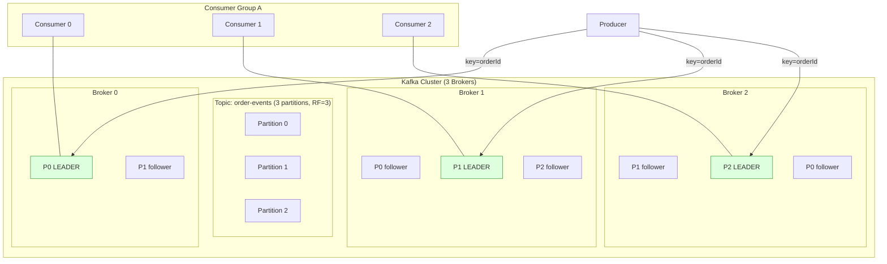

### Message Flow — End to End

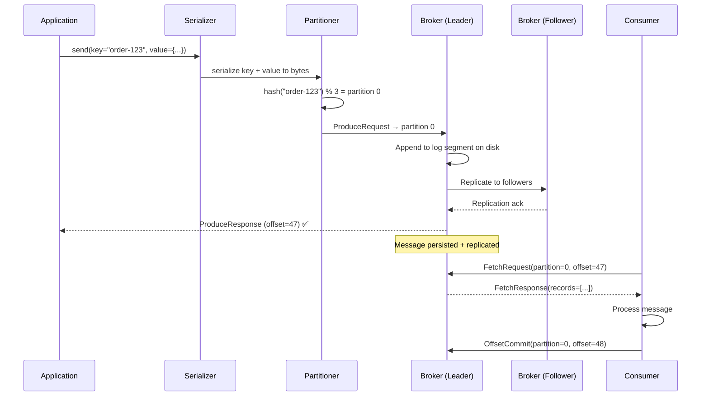

---

## 3. Cluster Architecture — Internals

### ZooKeeper vs KRaft

```text
ZOOKEEPER MODE (legacy, pre-3.3):
  ZooKeeper manages cluster metadata:
    - Which brokers are alive
    - Which broker is the controller
    - Topic/partition configuration

  Problems with ZooKeeper:
    - Separate system to deploy, monitor, and maintain
    - ZooKeeper becomes a bottleneck at scale
    - Split-brain scenarios possible
    - Limits cluster to ~200K partitions

KRAFT MODE (Kafka 3.3+, production-ready):
  Kafka manages its OWN metadata using a Raft-based consensus protocol.
  No external ZooKeeper needed.

  Benefits:
    - Simpler operations (one system instead of two)
    - Faster controller failover (seconds vs minutes)
    - Supports millions of partitions
    - No split-brain issues

  How it works:
    - A set of brokers form the "controller quorum"
    - One controller is the ACTIVE controller
    - Metadata stored in an internal __cluster_metadata topic
    - Raft protocol ensures consensus

  All new Kafka deployments should use KRaft.
```

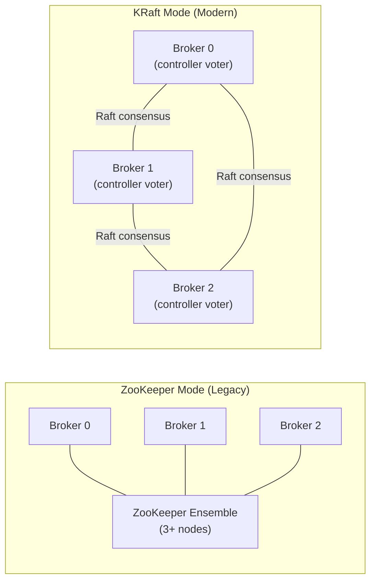

### The Controller

```text
One broker in the cluster is elected as the CONTROLLER.

Controller responsibilities:
  1. Partition leader election (when a leader broker fails)
  2. Broker registration / deregistration
  3. Topic creation / deletion
  4. Partition reassignment
  5. ISR (In-Sync Replica) management

In ZooKeeper mode:
  Controller elected via ZooKeeper ephemeral node.
  If controller dies → ZooKeeper detects → new controller elected.
  Failover can take MINUTES (rebuilding state).

In KRaft mode:
  Controller quorum (3+ brokers) uses Raft consensus.
  Active controller has the latest metadata log.
  Failover is near-instant (seconds).
```

### Replication

```text
Kafka replicates each partition across multiple brokers for
fault tolerance.

  replication.factor = 3

  Partition 0:
    Broker 0 → LEADER    (handles ALL reads and writes)
    Broker 1 → FOLLOWER  (replicates from leader)
    Broker 2 → FOLLOWER  (replicates from leader)

  ISR (In-Sync Replicas):
    Followers that are caught up with the leader.
    A follower is "in sync" if it has replicated all messages
    within replica.lag.time.max.ms (default 30s).

    Only ISR members can become the new leader.

  If Broker 0 (leader) dies:
    Controller detects via heartbeat timeout.
    Broker 1 or 2 (whichever is in ISR) becomes new leader.
    Producers/consumers automatically switch.
    No data loss (replicas have the data).

  min.insync.replicas (topic config):
    Minimum ISR members required for acks=all to succeed.
    With RF=3 and min.insync.replicas=2:
      → At least 2 replicas must acknowledge before producer gets ack.
      → Can tolerate 1 broker failure.
      → If 2 brokers die: writes FAIL (safety over availability).
```

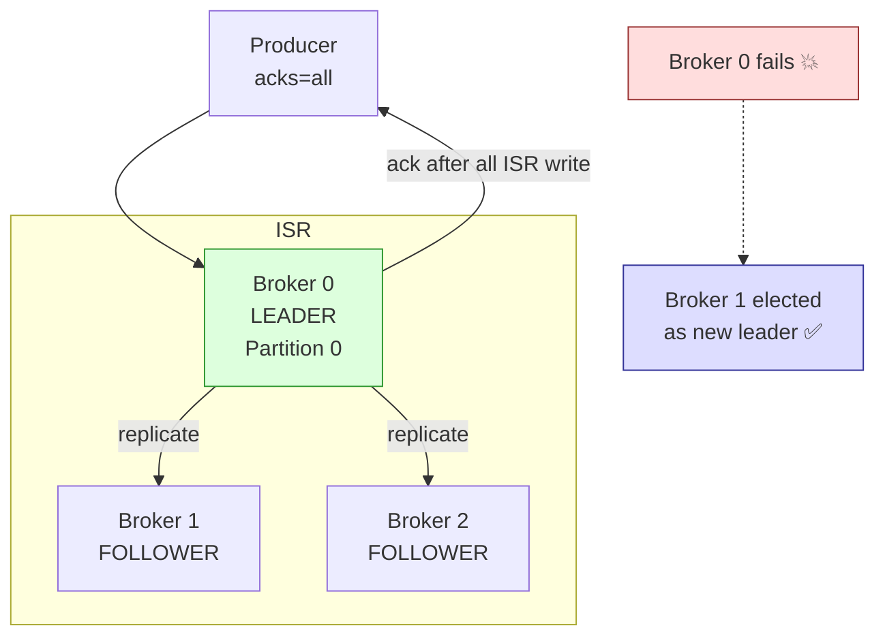

### acks — Producer Acknowledgment

```text
  acks=0:
    Producer sends and FORGETS. No acknowledgment.
    Fastest. Messages can be LOST.
    Use for: metrics, logging where loss is acceptable.

  acks=1:
    Producer waits for LEADER to write to its local log.
    Fast. Message LOST if leader crashes before replication.
    Use for: moderate reliability needs.

  acks=all (or acks=-1):
    Producer waits for ALL in-sync replicas to write.
    Slowest. No data loss as long as one ISR is alive.
    Use for: financial data, orders, payments — anything critical.

  PRODUCTION STANDARD:
    acks=all + min.insync.replicas=2 + replication.factor=3
    This tolerates exactly 1 broker failure without data loss.
```

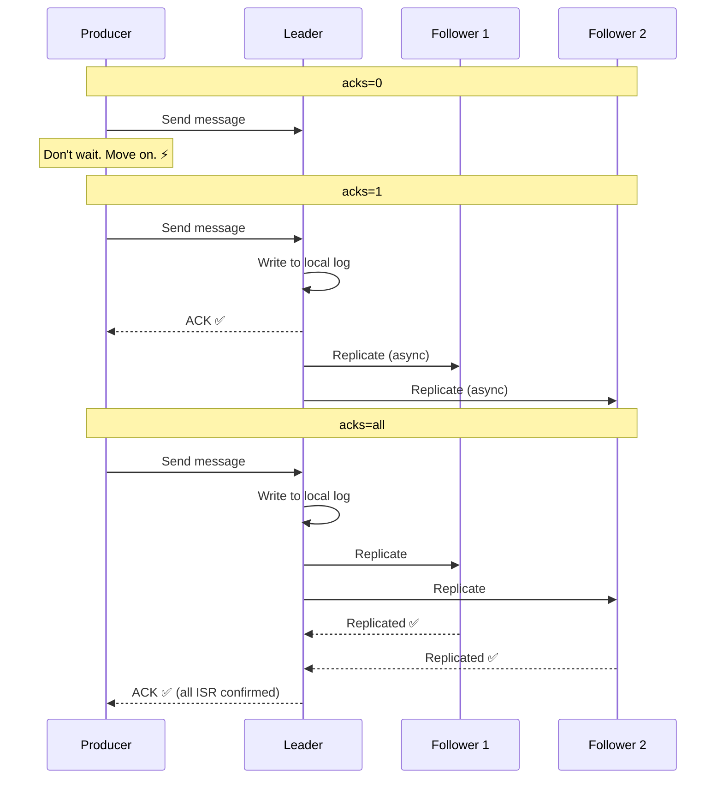

---

## 4. Partitions — Deep Dive

### Why Partitions Exist

```text
A single partition can only be read by ONE consumer in a group.
Without partitions, only one consumer can read a topic → no parallelism.

Partitions enable:
  1. PARALLELISM: Multiple consumers read different partitions
  2. ORDERING: Messages within a partition are strictly ordered
  3. SCALABILITY: More partitions = more consumers = more throughput
  4. DATA LOCALITY: All messages with same key → same partition

A partition is an APPEND-ONLY LOG on disk:

  Partition 0:
  ┌───┬───┬───┬───┬───┬───┬───┬───┐
  │ 0 │ 1 │ 2 │ 3 │ 4 │ 5 │ 6 │ 7 │  ← offsets
  └───┴───┴───┴───┴───┴───┴───┴───┘
    oldest                  newest
                      ↑
                 consumer position
                 (committed offset = 5)
```

### Partition Key and Ordering

```text
Messages with the SAME KEY always go to the SAME partition.
This guarantees ordering for messages with the same key.

  key = "order-123" → hash → partition 0
  key = "order-456" → hash → partition 1
  key = "order-123" → hash → partition 0 (same partition!)

  All events for order-123 are in partition 0, in order:
    OrderCreated → PaymentReceived → OrderShipped → OrderDelivered

  Ordering guarantees:
    ✅ Within a partition: messages are strictly ordered
    ❌ Across partitions: NO ordering guarantee

  If key is NULL:
    Kafka uses sticky partitioner (batch to one partition, then rotate).
    No ordering guarantee for any message.

  PARTITION COUNT IS IMMUTABLE (practically):
    You CAN increase partitions, but:
    - Existing key → partition mapping CHANGES
    - Messages for the same key may go to a different partition
    - This BREAKS ordering for in-flight and historical data
    - NEVER increase partitions on topics that rely on key ordering
```

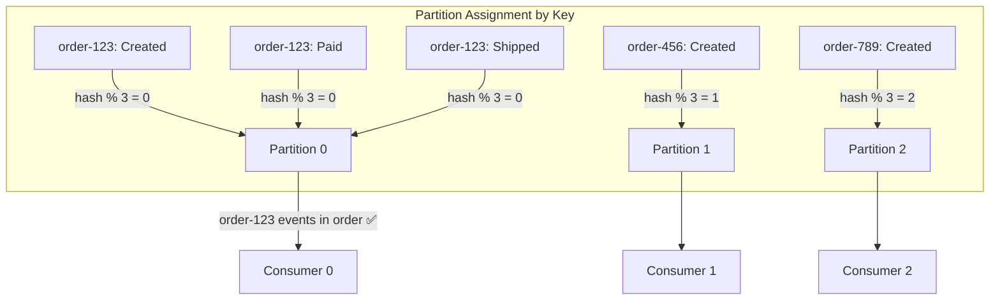

### How Many Partitions?

```text
  partitions ≥ max number of consumers you'll ever need

  3 partitions, 3 consumers: perfect 1:1
  3 partitions, 5 consumers: 2 consumers sit IDLE
  3 partitions, 2 consumers: one consumer reads 2 partitions

  More partitions:
    ✅ More parallelism
    ❌ More file handles on brokers
    ❌ Longer leader election on failure
    ❌ More memory on producer (one batch buffer per partition)
    ❌ More network overhead during replication

  Guidelines:
    Low volume:    3-6 partitions
    Medium volume: 6-12 partitions
    High volume:   12-30 partitions
    Extreme:       30-100+ partitions

  Formula (LinkedIn rule of thumb):
    partitions = max(throughput_target / throughput_per_partition,
                     max_consumer_count)
    Single partition throughput ≈ 10 MB/s write, 30 MB/s read
```

---

## 5. Storage Internals — How Kafka Stores Data

### Disk Layout

```text
Each partition is stored as a DIRECTORY on disk containing
SEGMENT FILES.

  /kafka-data/
    ├── order-events-0/              ← Partition 0
    │   ├── 00000000000000000000.log       ← Messages (segment 0)
    │   ├── 00000000000000000000.index     ← Offset → position index
    │   ├── 00000000000000000000.timeindex ← Timestamp → offset index
    │   ├── 00000000000050000000.log       ← Messages (segment 1)
    │   ├── 00000000000050000000.index
    │   ├── 00000000000050000000.timeindex
    │   └── leader-epoch-checkpoint
    ├── order-events-1/              ← Partition 1
    │   └── ...
    └── order-events-2/              ← Partition 2
        └── ...

  Filename = base offset of the first message in that segment.
  00000000000000000000.log → starts at offset 0
  00000000000050000000.log → starts at offset 50,000,000
```

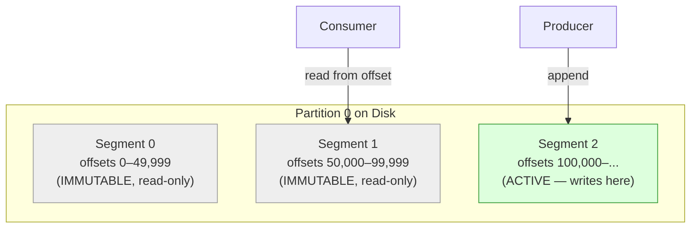

### Segment Lifecycle

```text
SEGMENT CREATION:
  A new active segment is created when the current segment reaches:
    - log.segment.bytes (default 1 GB), OR
    - log.roll.ms / log.roll.hours (default 7 days)

  Only the ACTIVE segment (newest) accepts writes.
  All older segments are IMMUTABLE.

SEGMENT DELETION (retention):
  Segments are deleted when:
    - log.retention.ms / log.retention.hours (default 7 days) expires, OR
    - log.retention.bytes is exceeded (per partition)

  Deletion granularity is per-SEGMENT, not per-message.
  A segment is deleted only when ALL messages in it exceed retention.

LOG COMPACTION (cleanup.policy=compact):
  Instead of deleting entire segments, compaction keeps only the
  LATEST value for each key.

  Before: key=A val=1, key=B val=2, key=A val=3, key=B val=4
  After:  key=A val=3, key=B val=4 (only latest per key)

  Use for: maintaining current state (configs, user profiles).
```

### How Offset Lookup Works

```text
To find a message at a specific offset, Kafka uses INDEX FILES.

  .index file: maps offset → physical byte position in .log file
  .timeindex: maps timestamp → offset

  Consumer requests offset 75,123:
    1. Binary search segment files by filename:
       50,000 ≤ 75,123 < 100,000
       → Segment: 00000000000050000.log

    2. Binary search .index file for nearest entry ≤ 75,123:
       → Index entry: offset 75,000 → byte position 4,521,600

    3. Sequential scan .log from byte 4,521,600 to find offset 75,123

    4. Return message bytes

  The index is SPARSE (entry every index.interval.bytes, default 4KB).
  This keeps indexes small and fast.

  Time-based lookup (consumer.offsetsForTimes):
    1. Binary search .timeindex for timestamp
    2. Get offset from timeindex entry
    3. Lookup offset in .index as above
```

---

## 6. Why Kafka Is Fast

```text
Kafka achieves 1M+ messages/second. Here's why:

1. SEQUENTIAL DISK I/O ONLY
   Kafka appends to the end of a file. No random seeks.
   Sequential: 600+ MB/s (SSD) or 100+ MB/s (HDD)
   Random: ~100 KB/s (HDD), ~10 MB/s (SSD)
   Sequential is 100-1000x faster than random.

2. ZERO-COPY TRANSFER (sendfile)
   Normal:    Disk → Kernel → User → Kernel → NIC (4 copies)
   Zero-copy: Disk → Kernel → NIC (2 copies, via sendfile())
   Eliminates 2 data copies and 2 context switches.
   Used when serving consumers (reading from log).

3. PAGE CACHE (OS-level caching)
   Kafka doesn't maintain its own in-memory cache.
   It relies on the OS page cache.
   Recently produced data is in page cache → consumer reads from RAM.
   No GC overhead for cache management.

4. BATCHING EVERYWHERE
   Producer: batches messages in RecordAccumulator
   Broker: writes batch to disk as-is (no unbatching)
   Consumer: fetches batch of messages per poll
   Network round-trips reduced dramatically.

5. COMPRESSION (batch-level)
   Producer compresses entire BATCH, not individual messages.
   Broker stores compressed. Consumer decompresses.
   Network: compressed. Disk: compressed.
   Supported: gzip, snappy, lz4, zstd.

6. SPARSE INDEXES
   Small index files + binary search + short sequential scan.
   No B-tree. No LSM-tree. Minimal overhead.

7. PARTITIONING
   Parallel writes to different partitions on different brokers.
   Parallel reads by different consumers.
   Linear horizontal scaling.
```

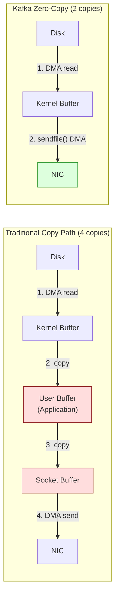

---

## 7. Consumer Groups — Deep Dive

### How Consumer Groups Work

```text
A consumer group cooperatively consumes a topic.
Each partition → exactly ONE consumer in the group.

  3 partitions, 3 consumers:
    Consumer 0 → Partition 0
    Consumer 1 → Partition 1
    Consumer 2 → Partition 2
    (perfect 1:1)

  3 partitions, 2 consumers:
    Consumer 0 → Partition 0, Partition 1
    Consumer 1 → Partition 2
    (consumer 0 does more work)

  3 partitions, 5 consumers:
    Consumer 0 → Partition 0
    Consumer 1 → Partition 1
    Consumer 2 → Partition 2
    Consumer 3 → IDLE
    Consumer 4 → IDLE
    (wasted consumers!)

  MULTIPLE groups read SAME topic independently:
    Topic "order-events" consumed by:
      payment-group     → processes payments
      inventory-group   → manages stock
      analytics-group   → reporting

    Each group has its OWN offsets. They don't interfere.
    This is Kafka's pub-sub model.
```

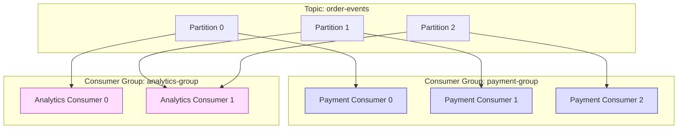

### Rebalancing

```text
Rebalancing redistributes partitions when group membership changes.

  Triggers:
    - New consumer joins the group
    - Consumer leaves (shutdown, crash)
    - Consumer fails heartbeat
    - New partitions added to topic
    - Consumer exceeds max.poll.interval.ms

  During rebalancing (EAGER mode):
    ALL consumers STOP processing.
    Partitions are reassigned from scratch.
    Consumers resume from committed offsets.
    → Stop-the-world pause. Bad for latency.

  COOPERATIVE rebalance (incremental):
    Only affected partitions are revoked/reassigned.
    Unaffected partitions continue processing.
    → Minimal disruption.

  REBALANCE PROBLEMS:
    1. Stop-the-world pause (eager mode)
    2. Duplicate processing (uncommitted messages reprocessed)
    3. Rebalance storm: slow processing → consumer kicked
       → more work on others → they get slow → they get kicked → cascade
```

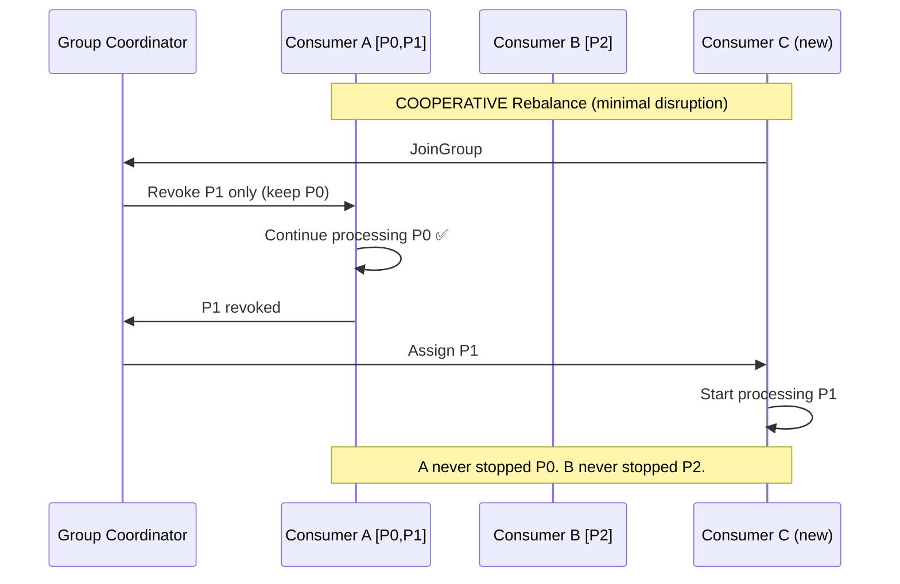

---

## 8. Offsets — Deep Dive

```text
An offset is a unique, sequential, per-partition message ID.

  Partition 0:
  [0, 1, 2, 3, 4, 5, 6, 7, 8, 9, ...]
                          ↑
                  committed offset = 6
                  (consumer processed 0-5)
                  (next poll starts at 6)

WHERE OFFSETS ARE STORED:
  __consumer_offsets — an internal Kafka topic.
  Partitioned by: hash(group.id + topic + partition) % 50.
  This is a compacted topic (keeps latest offset per key).

OFFSET COMMIT STRATEGIES:

  1. AUTO COMMIT (enable.auto.commit=true):
     Offsets committed every auto.commit.interval.ms (5s).
     Risk: crash between commit intervals → messages reprocessed.

  2. MANUAL SYNC (commitSync):
     Blocks until offset is committed.
     Slow but reliable. Use after processing batch.

  3. MANUAL ASYNC (commitAsync):
     Non-blocking. Fire-and-forget offset commit.
     Risk: if commit fails, no retry → messages reprocessed.

  4. PER-MESSAGE MANUAL:
     Commit after each message. Most reliable. Slowest.

  5. PER-BATCH MANUAL (recommended):
     Commit after processing entire poll() batch.
     Good balance of reliability and performance.

ON CONSUMER RESTART:
  Consumer resumes from last COMMITTED offset.
  Messages after committed offset are RE-DELIVERED.
  → Consumer MUST be idempotent.

auto.offset.reset (when NO committed offset exists):
  earliest: start from the beginning (process all history)
  latest:   start from the end (only new messages)
  none:     throw exception
```

---

## 9. Log Compaction

```text
Normal retention (cleanup.policy=delete):
  Delete entire segments older than retention.ms.
  Messages are gone after retention period.

Log compaction (cleanup.policy=compact):
  Kafka keeps only the LATEST value for each key.
  Old values for the same key are discarded.

  Before compaction:
    offset 0: key=user-1, value={name: "Alice", age: 25}
    offset 1: key=user-2, value={name: "Bob", age: 30}
    offset 2: key=user-1, value={name: "Alice", age: 26}   ← updated
    offset 3: key=user-3, value={name: "Charlie"}
    offset 4: key=user-2, value=null                        ← tombstone (delete)

  After compaction:
    offset 2: key=user-1, value={name: "Alice", age: 26}   ← latest
    offset 3: key=user-3, value={name: "Charlie"}           ← latest
    (user-2 deleted — tombstone processed)

USE CASES:
  - Current state snapshots (user profiles, configs)
  - CDC changelog topics (latest row state)
  - KTable backing in Kafka Streams
  - Configuration distribution

  A null value = TOMBSTONE = delete marker for that key.
  After compaction, the key is fully removed.
```

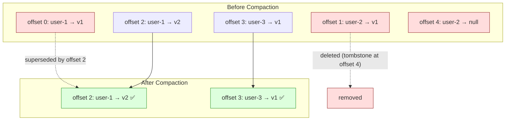

---

## 10. Interview Questions — Fundamentals

### Q1: What is Kafka and how is it different from RabbitMQ?

```text
Kafka is a distributed event streaming platform based on an append-only
commit log. RabbitMQ is a traditional message broker.

Key differences:
  - Kafka RETAINS messages after consumption (configurable retention).
    RabbitMQ DELETES messages after acknowledgment.
  - Kafka supports MULTIPLE consumer groups reading the same data
    independently. RabbitMQ delivers each message to one consumer.
  - Kafka orders messages within a PARTITION.
    RabbitMQ orders within a QUEUE.
  - Kafka is designed for HIGH THROUGHPUT (1M+ msg/s).
    RabbitMQ is designed for FLEXIBLE ROUTING.
  - Kafka supports MESSAGE REPLAY from any offset.
    RabbitMQ does not.

Use Kafka for: event streaming, data pipelines, event sourcing, CDC.
Use RabbitMQ for: task queues, complex routing, request-reply patterns.
```

### Q2: How does Kafka achieve high throughput?

```text
1. Sequential disk I/O (append-only log, no random seeks)
2. Zero-copy transfer (sendfile() syscall, no user-space copying)
3. OS page cache (no application-level cache, no GC overhead)
4. Batch writes/reads (producer batching, consumer batch fetch)
5. Compression at batch level (less network, less disk)
6. Partitioning (parallel I/O across brokers)
7. Sparse indexes (binary search, no B-tree overhead)
```

### Q3: Explain partitions, keys, and ordering.

```text
A topic is split into partitions. Each partition is an ordered log.

Messages with the same key always go to the same partition
(hash(key) % numPartitions). This guarantees ordering per key.

Ordering guarantee: WITHIN a partition only. No cross-partition ordering.

Example: All events for order-123 go to partition 0. They are processed
in order: Created → Paid → Shipped → Delivered.

If key is null: messages are distributed round-robin (no ordering).
```

### Q4: What is ISR and why does it matter?

```text
ISR = In-Sync Replicas. The set of replicas that are "caught up"
with the leader (within replica.lag.time.max.ms).

Why it matters:
  - Only ISR members can become the new leader on failure
  - acks=all means all ISR members must acknowledge
  - min.insync.replicas sets the minimum ISR count for writes

Example: RF=3, min.insync.replicas=2
  - If 1 broker dies: 2 ISR remain → writes continue
  - If 2 brokers die: 1 ISR < min.insync → writes FAIL
  - This is a safety mechanism: better to reject writes than lose data
```

### Q5: What is the difference between cleanup.policy=delete and compact?

```text
delete: Segments older than retention period are deleted entirely.
        Messages are gone after retention.ms (default 7 days).
        Use for: event streams, logs, audit trails.

compact: Only the latest value per key is retained.
         Old values for the same key are removed during compaction.
         Messages are retained INDEFINITELY (until superseded).
         Use for: current state, configs, CDC changelogs.

You can also use both: cleanup.policy=delete,compact
  Compaction + deletion after retention period.
```
