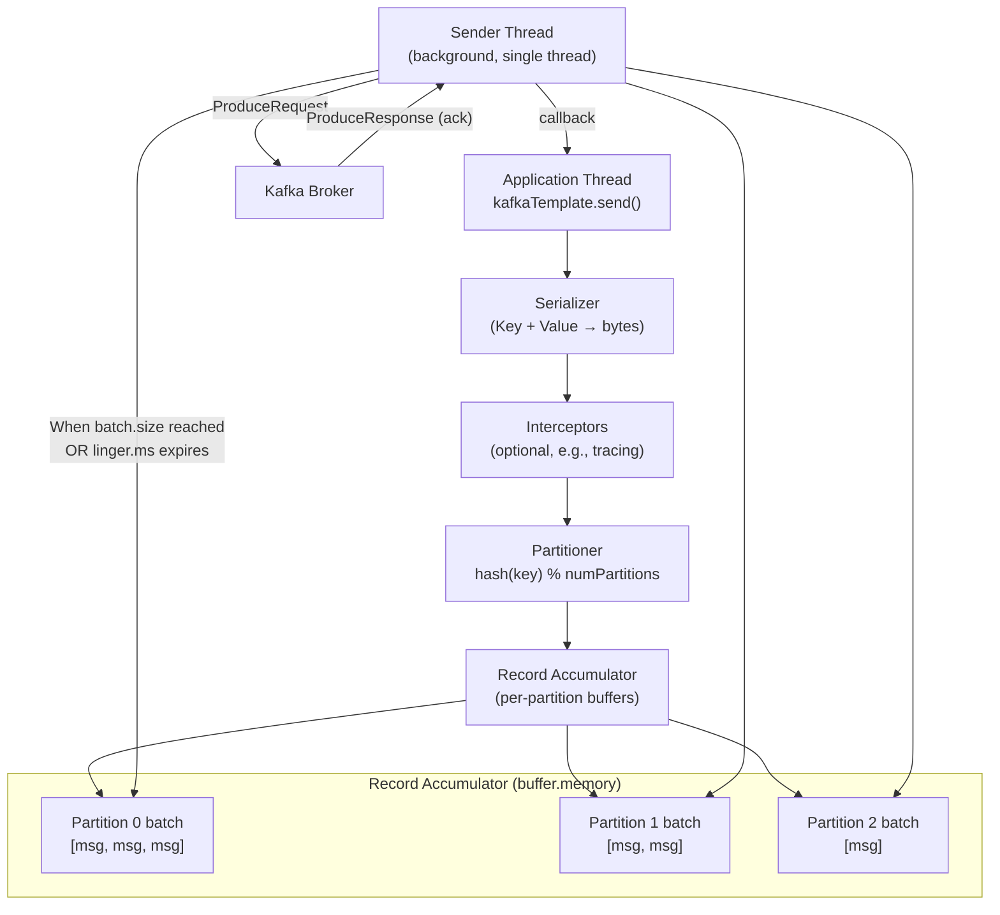
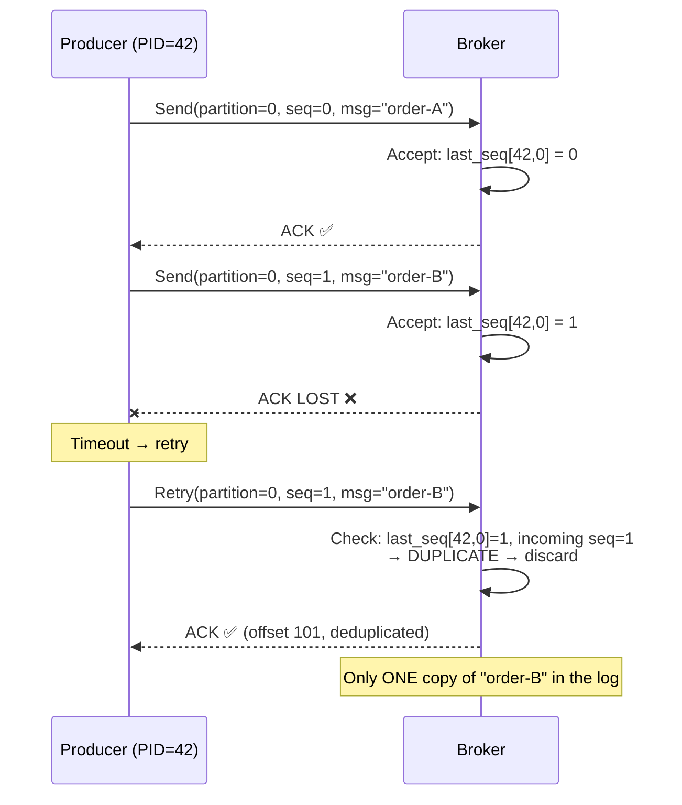
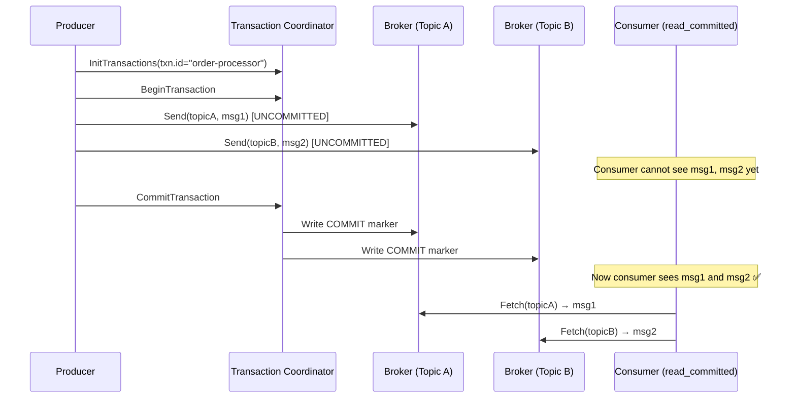
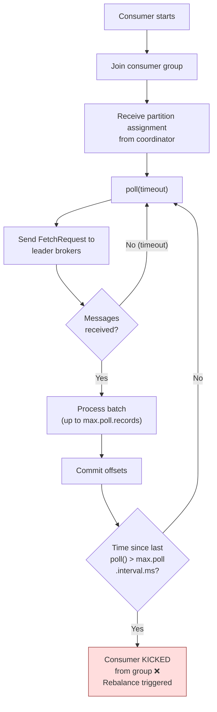
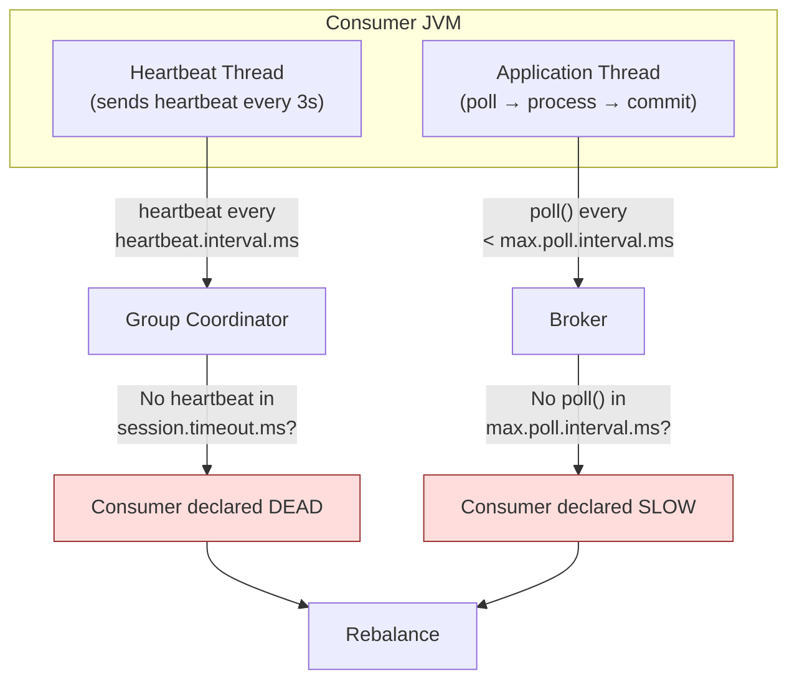
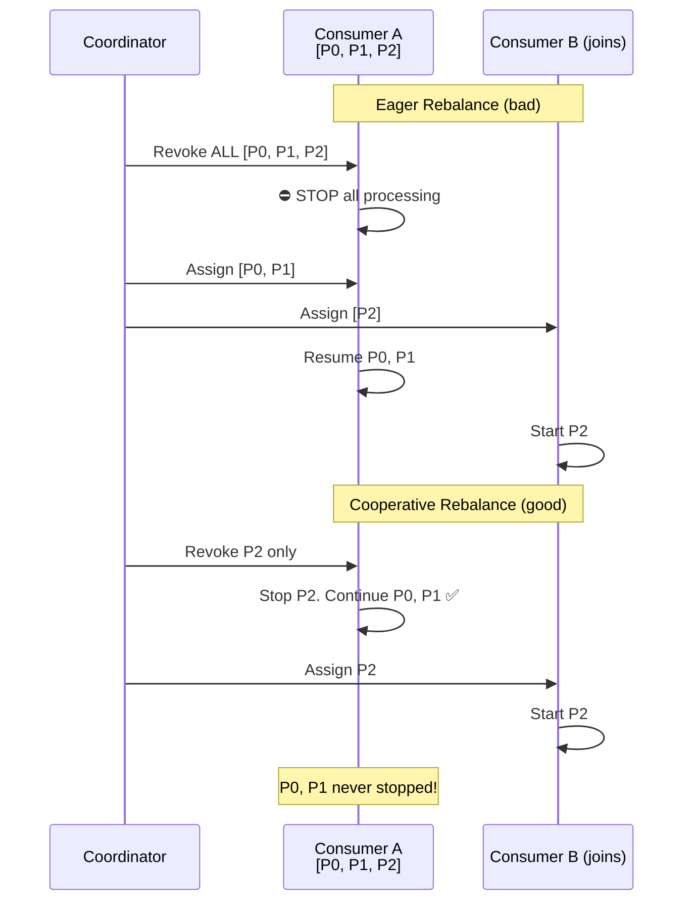
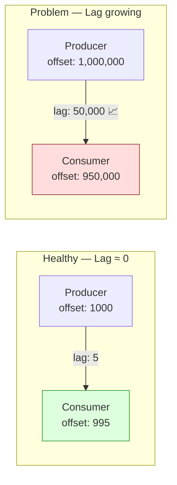
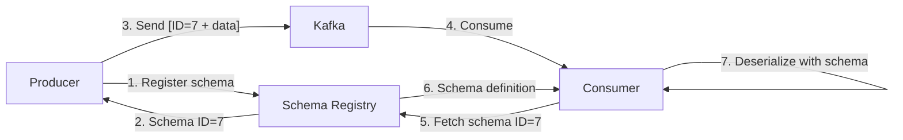

```mermaid
gantt
    title Batch Sending Timeline
    dateFormat X
    axisFormat %L ms

    section linger.ms=0
    msg1 sent instantly    :m1, 0, 1
    msg2 sent instantly    :m2, 5, 6
    msg3 sent instantly    :m3, 12, 13

    section linger.ms=20
    msg1 arrives           :a1, 0, 1
    msg2 arrives           :a2, 5, 6
    msg3 arrives           :a3, 12, 13
    batch sent (3 msgs)    :crit, b1, 20, 21
```

# Kafka Deep Dive — Part 2: Producer & Consumer Internals

Producer architecture, batching, idempotent producer, transactions,
consumer poll loop, heartbeat thread, cooperative rebalancing,
static membership, serialization, and message design best practices.

> This is Part 2 of 4. See also:
> - [Part 1: Fundamentals & Architecture](./01-Kafka-Fundamentals.md)
> - [Part 3: Spring Boot Integration](./03-Kafka-Spring-Boot.md)
> - [Part 4: Production Practices & Design Patterns](./04-Kafka-Production-Patterns.md)

---

## 1. Producer Architecture



```text
PRODUCER FLOW (step-by-step):

  1. Application calls send(topic, key, value)
     Returns immediately with a CompletableFuture.
     The actual network send happens asynchronously.

  2. Key Serializer + Value Serializer
     Converts key and value objects to byte arrays.
     Common: StringSerializer, JsonSerializer, AvroSerializer.

  3. Interceptors (optional)
     ProducerInterceptor.onSend() — can modify or log the record.
     Used for tracing, metrics, header injection.

  4. Partitioner determines target partition:
     - Key is set: hash(key) % numPartitions (deterministic)
     - Key is null: sticky partitioner (batch to one partition,
       then rotate after batch is full or linger.ms expires)

  5. Record Accumulator (in-memory buffer)
     Messages are added to a per-partition batch (RecordBatch).
     Total memory limited by buffer.memory (default 32MB).
     If buffer is full: send() BLOCKS up to max.block.ms (60s),
     then throws BufferExhaustedException.

  6. Sender Thread (single background thread)
     Continuously checks batches. Sends when:
       - batch.size reached (default 16KB), OR
       - linger.ms expires (default 0ms = send immediately)
     Groups batches per broker → one network request per broker.

  7. Broker writes, replicates, sends ack.

  8. Producer callback fires (success or failure).
     On failure + retries remaining → message goes back to batch.
```

### Batching: linger.ms vs batch.size

```text
These two configs control WHEN a batch is sent:

  batch.size (bytes, default 16384):
    Maximum batch size. When a partition batch reaches this size,
    the sender thread sends it immediately.

  linger.ms (milliseconds, default 0):
    How long to wait for more messages before sending a partial batch.
    linger.ms=0: send immediately (no waiting, minimum latency).
    linger.ms=50: wait up to 50ms to accumulate more messages.

  A batch is sent when EITHER condition is met:
    batch full (batch.size) OR timer expires (linger.ms).

  TRADEOFF:
    Low latency:  linger.ms=0, batch.size=16384
      Each message sent almost immediately. Small batches.
      More network round-trips. Lower throughput.

    High throughput: linger.ms=50, batch.size=65536
      Wait up to 50ms to fill larger batches.
      Fewer network round-trips. Higher latency per message.
      Better compression ratio (more data per batch).

  In practice: linger.ms=5-20 gives excellent throughput improvement
  with barely noticeable latency increase.
```



---

## 2. Idempotent Producer

### The Duplicate Problem

```text
Without idempotence, retries can create DUPLICATE messages:

  1. Producer sends message to broker → broker writes (offset 100)
  2. Ack is LOST (network issue, timeout)
  3. Producer doesn't know if it succeeded → RETRIES
  4. Broker writes AGAIN → offset 101 (DUPLICATE!)

  The log now has TWO copies of the same message.
  Consumer processes both → double payment, double email, etc.
```

### How Idempotence Works

```text
Each producer instance is assigned a unique PID (Producer ID).
Each message is tagged with a SEQUENCE NUMBER per (PID, partition).

  Producer PID=42 sending to partition 0:
    msg seq=0 → broker writes (offset 100) → ack OK
    msg seq=1 → broker writes (offset 101) → ack LOST
    msg seq=1 → retry → broker checks: PID=42, partition=0, last_seq=1
                       → seq=1 already seen → DEDUPLICATE → return ack

  Broker maintains: Map<(PID, partition) → last_seq>
  If incoming seq ≤ last_seq → duplicate → silently discard.
  If incoming seq = last_seq + 1 → new message → accept.
  If incoming seq > last_seq + 1 → out of order → OutOfOrderSequenceException.

REQUIREMENTS:
  enable.idempotence = true (DEFAULT since Kafka 3.0)
  acks = all (required)
  max.in.flight.requests.per.connection ≤ 5

SCOPE:
  Idempotence prevents duplicates within a SINGLE producer session.
  If the producer restarts (new PID), the guarantee resets.
  For cross-session guarantees → use Kafka Transactions.
```



---

## 3. Producer Transactions

```text
Kafka transactions enable ATOMIC writes across multiple topics
and partitions, and atomic consume-produce workflows.

USE CASES:
  1. Exactly-once stream processing (consume from A, produce to B)
  2. Atomic multi-topic writes (write to orders + audit atomically)
  3. Consume + produce + offset commit in one atomic operation

HOW IT WORKS:

  1. Producer registers with a Transaction Coordinator (a broker)
     using a transactional.id (stable across restarts).

  2. producer.beginTransaction()
     Marks the start of a transaction.

  3. producer.send(topic1, msg1)
     producer.send(topic2, msg2)
     Messages are written to the log WITH a transaction marker.
     They are NOT visible to consumers with isolation.level=read_committed.

  4. producer.sendOffsetsToTransaction(offsets, groupId)
     Links consumer offset commit to this transaction.

  5. producer.commitTransaction()
     Transaction Coordinator writes COMMIT marker to all partitions.
     Now ALL messages become visible to read_committed consumers.

  OR

  5b. producer.abortTransaction()
      Transaction Coordinator writes ABORT marker.
      All messages in this transaction are invisible/discarded.

CONSUMER ISOLATION LEVELS:
  isolation.level = read_uncommitted (default):
    Sees ALL messages, including uncommitted transactions.

  isolation.level = read_committed:
    Only sees messages from committed transactions.
    Skips uncommitted and aborted messages.
```



---

## 4. Critical Producer Configurations

```text
┌──────────────────────────────┬────────────────────────────────────────────┐
│ Config                       │ What It Does                              │
├──────────────────────────────┼────────────────────────────────────────────┤
│ acks = all                   │ Wait for all ISR replicas to ack          │
│                              │ Safest. Required for idempotence.         │
│                              │                                            │
│ retries = 2147483647         │ Infinite retries (default since 2.1)      │
│                              │ Combined with delivery.timeout.ms.        │
│                              │                                            │
│ delivery.timeout.ms = 120000 │ Max time from send() to ack (2 min)      │
│                              │ Includes retries + linger + batching.     │
│                              │ After this: send fails permanently.       │
│                              │                                            │
│ max.in.flight.requests       │ Max unacked requests per connection.      │
│ .per.connection = 5          │ Set to 1 for strict ordering without      │
│                              │ idempotence. With idempotence, 5 is fine. │
│                              │                                            │
│ enable.idempotence = true    │ Dedup retries at broker (default 3.0+).   │
│                              │                                            │
│ linger.ms = 0                │ Batching delay. 0=immediate, 5-50=batch.  │
│                              │                                            │
│ batch.size = 16384           │ Max batch size (bytes). Larger=more       │
│                              │ throughput, more memory.                   │
│                              │                                            │
│ buffer.memory = 33554432     │ Total buffer memory (32MB). If full,      │
│                              │ send() blocks up to max.block.ms.         │
│                              │                                            │
│ compression.type = none      │ none/gzip/snappy/lz4/zstd                │
│                              │ lz4 or zstd recommended for production.   │
│                              │                                            │
│ max.block.ms = 60000         │ How long send() blocks when buffer full.  │
│                              │ After this: throws exception.             │
└──────────────────────────────┴────────────────────────────────────────────┘

PRODUCTION RECOMMENDATION:
  acks = all
  enable.idempotence = true
  compression.type = lz4
  linger.ms = 10
  batch.size = 32768
  retries = 2147483647
  delivery.timeout.ms = 120000
  min.insync.replicas = 2 (topic-level config)
```

---

## 5. Consumer Internals — Deep Dive

### The Poll Loop

```text
The consumer PULLS messages from the broker. It is NOT push-based.

  while (true) {
      ConsumerRecords<K, V> records = consumer.poll(Duration.ofMillis(100));
      for (ConsumerRecord<K, V> record : records) {
          process(record);
      }
      consumer.commitSync();
  }

  poll() does MULTIPLE things:
    1. Triggers partition assignment / rebalance if needed
    2. Sends FetchRequest to brokers for assigned partitions
    3. Returns batch of messages (up to max.poll.records)
    4. Heartbeat thread continues in background

  The Duration parameter is the MAX WAIT time if no messages available.
  poll(100ms): wait up to 100ms for messages, return empty if none.

IMPORTANT TIMING:
  max.poll.interval.ms (default 5 min):
    Max time between consecutive poll() calls.
    If exceeded → consumer considered dead → rebalance triggered.

  This catches SLOW PROCESSING, not crashes.
  If your processing takes 6 minutes per batch → consumer gets kicked.
```



### Heartbeat Thread (Separate Since 0.10.1)

```text
The heartbeat is sent by a BACKGROUND THREAD, independent of poll().

  session.timeout.ms (default 45s):
    If coordinator receives no heartbeat within this window,
    the consumer is declared DEAD.
    Triggers rebalance.

  heartbeat.interval.ms (default 3s):
    How often the background thread sends heartbeats.
    Rule: should be ≤ 1/3 of session.timeout.ms.

  max.poll.interval.ms (default 5 min):
    Max time the APPLICATION can take between poll() calls.
    This catches SLOW processing (not crashes).
    Heartbeats still flow, but Kafka sees poll() hasn't been called.

  WHY TWO TIMEOUTS?
    session.timeout.ms     → detects CRASHES (heartbeat stops)
    max.poll.interval.ms   → detects HANGS (processing stuck)

    A consumer that crashes: heartbeat stops → session timeout → rebalance.
    A consumer stuck in processing: heartbeat flows, but poll() not called
    → max.poll.interval.ms → rebalance.
```



### Consumer Fetch Strategy

```text
Consumers don't fetch one message at a time. They fetch in BATCHES.

  fetch.min.bytes (default 1):
    Broker waits until at least this many bytes are available.
    Higher → fewer fetches, more batching, higher latency.
    Lower → more fetches, less batching, lower latency.

  fetch.max.wait.ms (default 500):
    Max time broker waits to accumulate fetch.min.bytes.
    Prevents indefinite waiting when traffic is low.

  max.partition.fetch.bytes (default 1MB):
    Max data fetched per partition per request.

  fetch.max.bytes (default 52428800 = 50MB):
    Max data fetched per request across ALL partitions.

  max.poll.records (default 500):
    Max RECORDS returned per poll() call.
    This limits processing batch size in YOUR code.
    Does NOT limit the fetch size from broker.

TUNING:
  Low latency:     fetch.min.bytes=1, fetch.max.wait.ms=100
  High throughput:  fetch.min.bytes=65536, fetch.max.wait.ms=500
  Prevent overload: max.poll.records=100 (process less per batch)
```

### Cooperative Rebalancing (Incremental)

```text
EAGER REBALANCE (legacy, pre-2.4):
  1. ALL consumers revoke ALL partitions
  2. ALL consumers stop processing
  3. Coordinator reassigns partitions from scratch
  4. ALL consumers resume
  → Stop-the-world. Even unaffected partitions disrupted.

COOPERATIVE REBALANCE (2.4+, recommended):
  1. Coordinator determines which partitions need to move
  2. ONLY affected partitions are revoked
  3. Unaffected partitions continue processing
  4. Revoked partitions are assigned to new consumers
  → Minimal disruption. Much faster stabilization.

  partition.assignment.strategy =
    org.apache.kafka.clients.consumer.CooperativeStickyAssignor

  "Sticky" means: try to keep existing assignments stable.
  Only move partitions when absolutely necessary.
```



### Static Group Membership

```text
PROBLEM: Rolling deployment restarts consumers one by one.
Each restart: consumer leaves → rebalance → rejoins → rebalance.
N pods = 2N rebalances during deployment!

SOLUTION: Static group membership.
  Set group.instance.id = stable, unique ID per consumer instance.
  (e.g., "payment-consumer-pod-0", "payment-consumer-pod-1")

  When consumer disconnects:
    Kafka waits session.timeout.ms before triggering rebalance.
    If consumer reconnects with SAME instance ID within that window:
    → No rebalance. Gets same partitions back instantly.

  For rolling deployments:
    Set session.timeout.ms = 300000 (5 min)
    Each pod restart takes < 5 min
    → ZERO rebalances during the entire deployment.

  group.instance.id = "payment-consumer-${POD_NAME}"
  session.timeout.ms = 300000
```

---

## 6. Consumer Lag

```text
Consumer lag = latest produced offset − consumer committed offset.

  Partition 0:
    Latest offset:     1,000,000
    Committed offset:    999,500
    LAG = 500 messages

  Lag tells you how far BEHIND the consumer is from real-time.

HEALTHY: lag near zero, stable.
WARNING: lag growing steadily.
CRITICAL: lag growing exponentially → consumer may never catch up.

CAUSES OF GROWING LAG:
  1. Consumer processing too slow (heavy DB queries, API calls)
  2. Not enough consumers (add more, up to partition count)
  3. Consumer stuck (deadlock, infinite loop, GC pause)
  4. Frequent rebalancing (consumers keep stopping/starting)
  5. Downstream dependency slow (slow DB, slow API)
  6. Insufficient max.poll.records (too few messages per batch)

FIXING LAG:
  1. Add more consumers (scale horizontally, up to partition count)
  2. Add more partitions + consumers (if at partition limit)
  3. Optimize processing (batch DB writes, cache, async)
  4. Increase max.poll.records (larger batches)
  5. Fix downstream bottlenecks
  6. Stop rebalance storms (static membership, cooperative rebalance)

MONITORING:
  kafka-consumer-groups.sh --describe --group <group-id>
  Prometheus: kafka_consumergroup_lag
  Tools: Burrow, Confluent Control Center
```



---

## 7. Serialization and Message Design

### Serialization Formats

```text
┌────────────────┬──────────────────────────────────────────────────────┐
│ Format         │ Characteristics                                      │
├────────────────┼──────────────────────────────────────────────────────┤
│ JSON           │ Human-readable. No schema enforcement.               │
│                │ Larger payload. Slower serialization.                 │
│                │ Good for: prototyping, debugging, small teams.       │
│                │                                                      │
│ Avro           │ Binary, compact. Schema evolution built-in.          │
│                │ Requires Schema Registry. Forward/backward compat.   │
│                │ Good for: production, evolving schemas, large scale. │
│                │                                                      │
│ Protobuf       │ Binary, compact. Strongly typed. Code generation.    │
│                │ Backward/forward compatible. Cross-language.          │
│                │ Good for: gRPC + Kafka, polyglot environments.       │
│                │                                                      │
│ String         │ Simple text. No structure.                            │
│                │ Good for: log lines, simple signals, keys.           │
└────────────────┴──────────────────────────────────────────────────────┘

PRODUCTION RECOMMENDATION:
  For Java-heavy shops:  Avro + Confluent Schema Registry
  For polyglot shops:    Protobuf + Confluent Schema Registry
  For startups/MVPs:     JSON (simpler, migrate to Avro later)
```

### Schema Registry

```text
Central service storing and validating message schemas.

  Producer:
    1. Registers schema with Schema Registry → gets schema ID
    2. Sends: [magic byte][schema ID (4 bytes)][serialized data]
    3. Schema is sent ONCE, not per-message

  Consumer:
    1. Reads schema ID from message bytes
    2. Fetches schema from Schema Registry (cached locally)
    3. Deserializes data using the schema

  SCHEMA EVOLUTION:
    Backward compatible: new schema can read old data
    Forward compatible: old schema can read new data
    Full compatible: both directions

    Rules:
      - Adding a field with a default → backward compatible ✅
      - Removing a field with a default → forward compatible ✅
      - Renaming a field → NOT compatible ❌
      - Changing field type → NOT compatible ❌

  The registry REJECTS incompatible schema changes.
  This is your contract enforcement between producer and consumer.
```



### Event Design Best Practices

```text
1. USE A CONSISTENT EVENT ENVELOPE:

  {
    "eventId": "evt-uuid-123",          // unique (for idempotency)
    "eventType": "ORDER_CREATED",       // type discriminator
    "aggregateType": "Order",           // domain entity
    "aggregateId": "order-456",         // entity ID = partition key
    "timestamp": "2024-01-15T10:30:00Z",
    "version": 1,                        // schema version
    "source": "order-service",           // producing service
    "correlationId": "req-789",          // request correlation
    "payload": {                         // actual event data
      "orderId": "order-456",
      "customerId": "cust-789",
      "items": [...],
      "totalAmount": 150.00
    }
  }

2. KEY = AGGREGATE ID:
   key = "order-456" → all events for this order → same partition → ordered.

3. FAT EVENTS (event-carried state transfer):
   Include ALL data the consumer needs in the payload.
   Avoids callbacks to the producer service.
   Reduces coupling. Improves consumer autonomy.

4. PAST TENSE naming:
   OrderCreated, PaymentProcessed, InventoryReserved.
   Events describe things that HAPPENED.

5. INCLUDE eventId:
   Unique ID per event. Enables idempotent consumers.
   Consumer stores processed eventIds → skips duplicates.

6. INCLUDE correlationId:
   Links events across services for distributed tracing.
   Tie back to the original HTTP request that started the flow.

7. VERSION YOUR SCHEMAS:
   Allows consumers to handle old and new formats simultaneously.
   Critical for zero-downtime deployments.
```

---

## 8. Interview Questions — Producer & Consumer

### Q1: Explain the producer's send path from application to broker.

```text
1. Application calls send(key, value)
2. Key and Value serialized to bytes
3. Partitioner determines partition: hash(key) % numPartitions
4. Record added to RecordAccumulator (per-partition buffer)
5. Sender thread batches and sends when batch.size or linger.ms reached
6. Broker writes to leader log, replicates to followers
7. Broker sends ack (based on acks config)
8. Producer callback fires (CompletableFuture completes)
```

### Q2: What is the idempotent producer and why does it matter?

```text
The idempotent producer assigns each message a (PID, sequence number).
The broker deduplicates retries by rejecting messages with seq ≤ last_seq.

This prevents duplicate messages caused by retry-on-timeout:
  Send → broker writes → ack lost → retry → broker writes AGAIN = DUPLICATE
  With idempotence: retry → broker sees same seq → dedup → no duplicate.

Enabled by default since Kafka 3.0.
Requires acks=all, max.in.flight ≤ 5.
Scoped to a single producer session (new PID on restart).
```

### Q3: What is the difference between linger.ms and batch.size?

```text
batch.size: Max batch size in bytes. When reached, batch is sent.
linger.ms:  Max wait time for more messages. When reached, batch is sent.

A batch is sent when EITHER condition is met (whichever comes first).

linger.ms=0: send each message immediately (low latency, low throughput).
linger.ms=50: wait up to 50ms to fill batch (higher throughput).
batch.size=16384: send when 16KB accumulated (regardless of linger.ms).

Optimal: linger.ms=5-20 for most production workloads.
```

### Q4: What happens when the producer's buffer is full?

```text
The RecordAccumulator has buffer.memory bytes total (default 32MB).
When full:
  send() BLOCKS for up to max.block.ms (default 60s).
  If still full after max.block.ms → throws BufferExhaustedException.

This happens when:
  - Producer is sending faster than broker can accept
  - Broker is slow (disk issues, replication lag)
  - Network partition between producer and broker

Fix:
  - Increase buffer.memory
  - Reduce message size
  - Increase broker capacity
  - Add backpressure in the application
```

### Q5: Explain the consumer poll loop and the two timeout mechanisms.

```text
The consumer calls poll() in a loop. poll() fetches messages and
triggers group management (rebalance, heartbeat check).

Two separate timeout mechanisms:
  session.timeout.ms (default 45s):
    Detected by heartbeat thread (background).
    If no heartbeat sent → consumer declared DEAD → rebalance.
    Catches: JVM crash, network partition, kill -9.

  max.poll.interval.ms (default 5 min):
    Detected by coordinator tracking poll() calls.
    If poll() not called within this → consumer declared SLOW → rebalance.
    Catches: processing stuck, deadlock, long-running operations.

Heartbeats flow independently of poll(). A consumer can be
"alive" (heartbeating) but "stuck" (not polling).
```

### Q6: What is cooperative rebalancing and why should you use it?

```text
Eager rebalance: ALL consumers revoke ALL partitions → full stop-the-world
→ reassign from scratch → ALL resume. Even unchanged assignments disrupted.

Cooperative rebalance: ONLY affected partitions revoked → others continue
processing → minimal disruption.

Use CooperativeStickyAssignor:
  - Keeps existing assignments stable
  - Only moves partitions that need to move
  - No stop-the-world pause
  - Much faster stabilization

Set: partition.assignment.strategy = CooperativeStickyAssignor
This should be the default for all new consumer applications.
```

### Q7: What is static group membership?

```text
Assign a stable group.instance.id to each consumer.
When consumer disconnects, Kafka waits session.timeout.ms before
triggering rebalance. If it reconnects with same ID → no rebalance,
gets same partitions back.

Use case: rolling deployments. Without static membership, each pod
restart causes 2 rebalances (leave + rejoin). With it: zero rebalances
as long as restart < session.timeout.ms.
```

### Q8: How do you handle a consumer that processes messages too slowly?

```text
Symptoms: max.poll.interval.ms exceeded → consumer kicked → rebalance.

Solutions (in order of preference):
  1. Reduce max.poll.records (process fewer per batch)
  2. Optimize processing (batch DB writes, caching, less I/O)
  3. Increase max.poll.interval.ms (give more time — last resort)
  4. Offload to thread pool (poll returns fast, processing async)
     BUT: must handle offset commit carefully with async processing
  5. Use pause/resume: pause partition, process async, resume when done
  6. Add more consumers + partitions to spread the load

Avoid: blindly increasing max.poll.interval.ms — delays failure detection.
```

### Q9: When should you use Kafka transactions?

```text
Use transactions for exactly-once semantics in consume-produce workflows:
  Read from topic A → process → write to topic B → commit offsets.
  All three operations (consume, produce, offset commit) are atomic.

Also for: atomic writes to multiple topics/partitions.

Don't use for: Kafka → database writes. Kafka transactions don't span
external systems. For DB + Kafka atomicity, use the Transactional Outbox
pattern instead.
```

### Q10: JSON vs Avro vs Protobuf — which to use in production?

```text
JSON:  Simple, readable, no schema enforcement.
       Good for: small teams, early development, debugging.
       Bad for: large-scale production (large payloads, no compatibility).

Avro:  Compact binary, schema evolution, Schema Registry integration.
       Good for: Java/JVM ecosystems, evolving schemas.
       Bad for: debugging (binary), cross-language without tooling.

Protobuf: Compact binary, strong types, code generation, cross-language.
          Good for: polyglot environments, gRPC + Kafka.
          Bad for: simple use cases (overkill).

For most Java/Spring Boot production systems: Avro + Schema Registry.
For polyglot microservices: Protobuf + Schema Registry.
Start with JSON, migrate to Avro/Protobuf when scale demands it.
```
