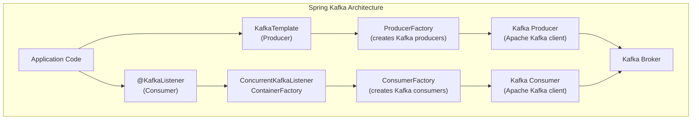
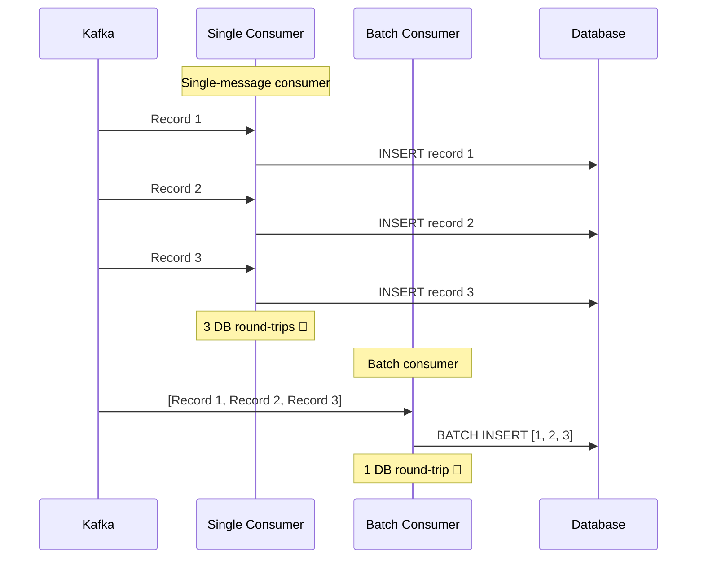
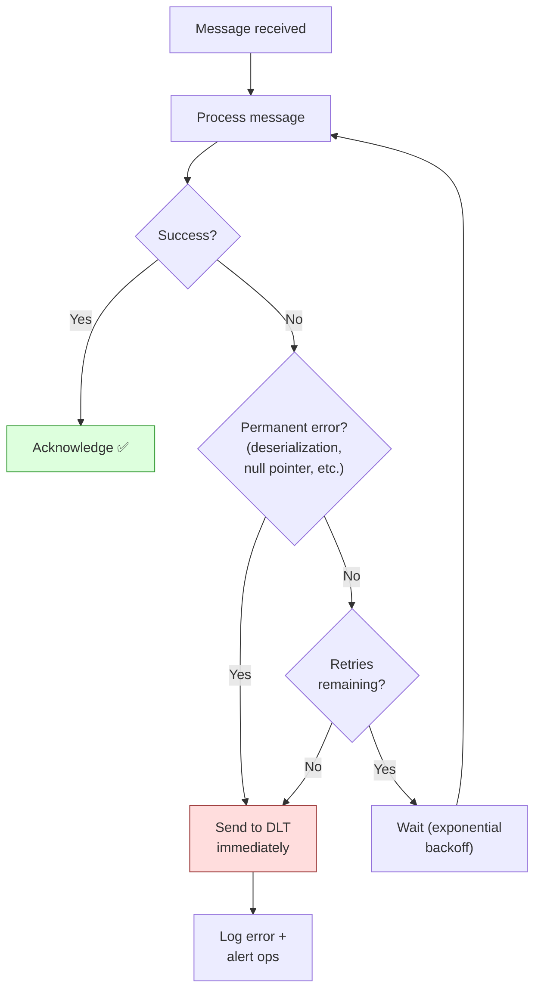
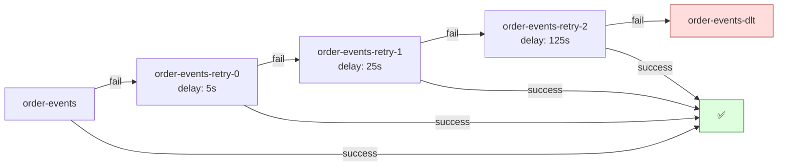
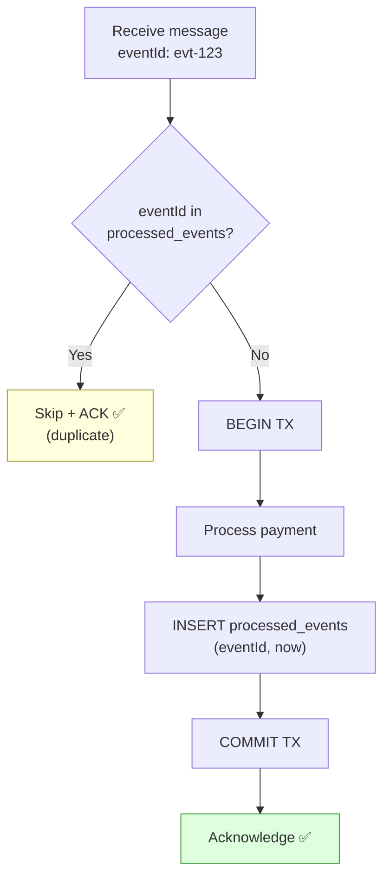
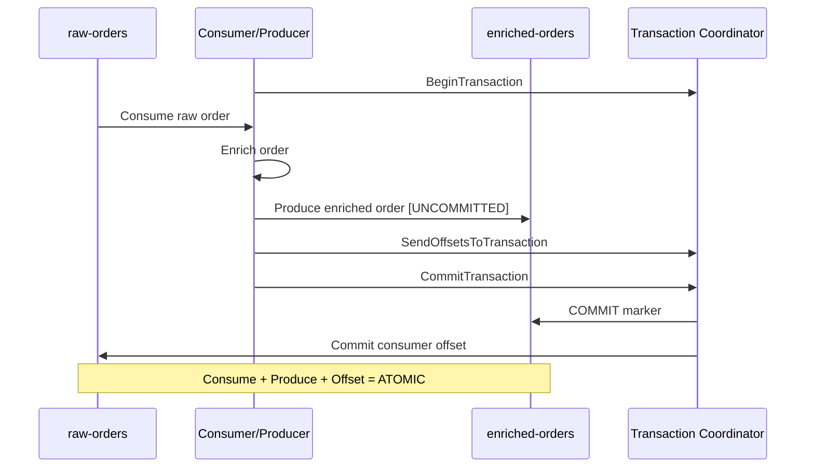
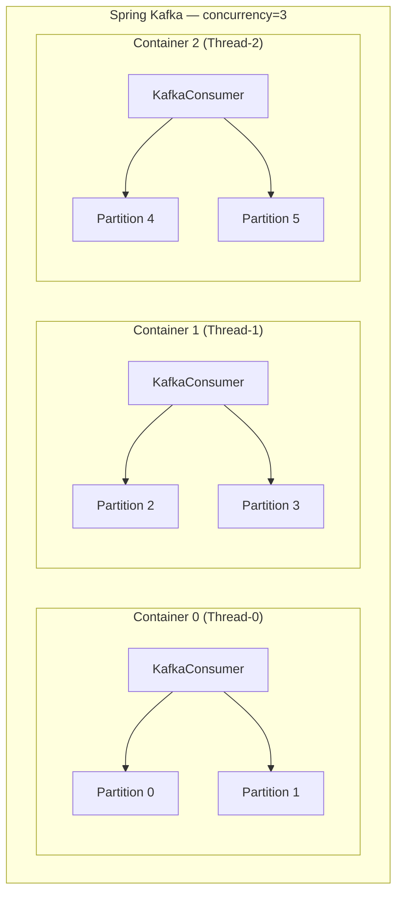

# Kafka Deep Dive — Part 3: Spring Boot Integration

Spring Kafka configuration, producers, consumers, batch listeners,
error handling, retry with DLQ, Kafka transactions, testing, and
advanced patterns for production Spring Boot applications.

> This is Part 3 of 4. See also:
> - [Part 1: Fundamentals & Architecture](./01-Kafka-Fundamentals.md)
> - [Part 2: Producer & Consumer Internals](./02-Kafka-Producer-Consumer.md)
> - [Part 4: Production Practices & Design Patterns](./04-Kafka-Production-Patterns.md)

---

## 1. Spring Kafka Overview

```text
Spring Kafka provides:
  - KafkaTemplate: high-level producer API
  - @KafkaListener: annotation-driven consumer
  - ConcurrentKafkaListenerContainerFactory: consumer container management
  - Error handlers, retry, DLQ support
  - Kafka transaction support
  - Embedded Kafka for testing

Dependency:
  <dependency>
      <groupId>org.springframework.kafka</groupId>
      <artifactId>spring-kafka</artifactId>
  </dependency>
  (spring-boot-starter-parent manages the version)
```



---

## 2. Configuration

### application.yml — Complete Production Config

```yaml
spring:
  kafka:
    bootstrap-servers: ${KAFKA_BOOTSTRAP_SERVERS:localhost:9092}

    # Producer configuration
    producer:
      key-serializer: org.apache.kafka.common.serialization.StringSerializer
      value-serializer: org.springframework.kafka.support.serializer.JsonSerializer
      acks: all
      retries: 2147483647
      properties:
        enable.idempotence: true
        max.in.flight.requests.per.connection: 5
        delivery.timeout.ms: 120000
        linger.ms: 10
        batch.size: 32768
        compression.type: lz4
        spring.json.add.type.headers: false

    # Consumer configuration
    consumer:
      group-id: ${spring.application.name}-group
      auto-offset-reset: earliest
      key-deserializer: org.apache.kafka.common.serialization.StringDeserializer
      value-deserializer: org.springframework.kafka.support.serializer.JsonDeserializer
      enable-auto-commit: false
      properties:
        spring.json.trusted.packages: "com.example.events.*"
        max.poll.records: 100
        max.poll.interval.ms: 300000
        session.timeout.ms: 45000
        heartbeat.interval.ms: 3000
        partition.assignment.strategy: org.apache.kafka.clients.consumer.CooperativeStickyAssignor
        # For static membership (rolling deployments):
        # group.instance.id: ${HOSTNAME}

    # Listener configuration
    listener:
      ack-mode: manual_immediate
      concurrency: 3
```

### Java Config — ProducerFactory and ConsumerFactory

```java
@Configuration
public class KafkaConfig {

    @Value("${spring.kafka.bootstrap-servers}")
    private String bootstrapServers;

    // ── Producer ──

    @Bean
    public ProducerFactory<String, Object> producerFactory() {
        Map<String, Object> config = new HashMap<>();
        config.put(ProducerConfig.BOOTSTRAP_SERVERS_CONFIG, bootstrapServers);
        config.put(ProducerConfig.KEY_SERIALIZER_CLASS_CONFIG,
            StringSerializer.class);
        config.put(ProducerConfig.VALUE_SERIALIZER_CLASS_CONFIG,
            JsonSerializer.class);
        config.put(ProducerConfig.ACKS_CONFIG, "all");
        config.put(ProducerConfig.ENABLE_IDEMPOTENCE_CONFIG, true);
        config.put(ProducerConfig.LINGER_MS_CONFIG, 10);
        config.put(ProducerConfig.BATCH_SIZE_CONFIG, 32768);
        config.put(ProducerConfig.COMPRESSION_TYPE_CONFIG, "lz4");
        return new DefaultKafkaProducerFactory<>(config);
    }

    @Bean
    public KafkaTemplate<String, Object> kafkaTemplate(
            ProducerFactory<String, Object> producerFactory) {
        return new KafkaTemplate<>(producerFactory);
    }

    // ── Consumer ──

    @Bean
    public ConsumerFactory<String, Object> consumerFactory() {
        Map<String, Object> config = new HashMap<>();
        config.put(ConsumerConfig.BOOTSTRAP_SERVERS_CONFIG, bootstrapServers);
        config.put(ConsumerConfig.KEY_DESERIALIZER_CLASS_CONFIG,
            StringDeserializer.class);
        config.put(ConsumerConfig.VALUE_DESERIALIZER_CLASS_CONFIG,
            JsonDeserializer.class);
        config.put(ConsumerConfig.ENABLE_AUTO_COMMIT_CONFIG, false);
        config.put(ConsumerConfig.AUTO_OFFSET_RESET_CONFIG, "earliest");
        config.put(ConsumerConfig.MAX_POLL_RECORDS_CONFIG, 100);
        config.put(JsonDeserializer.TRUSTED_PACKAGES, "com.example.*");
        config.put(ConsumerConfig.PARTITION_ASSIGNMENT_STRATEGY_CONFIG,
            CooperativeStickyAssignor.class.getName());
        return new DefaultKafkaConsumerFactory<>(config);
    }

    @Bean
    public ConcurrentKafkaListenerContainerFactory<String, Object>
            kafkaListenerContainerFactory(
                ConsumerFactory<String, Object> consumerFactory) {

        ConcurrentKafkaListenerContainerFactory<String, Object> factory =
            new ConcurrentKafkaListenerContainerFactory<>();
        factory.setConsumerFactory(consumerFactory);
        factory.setConcurrency(3);
        factory.getContainerProperties().setAckMode(
            ContainerProperties.AckMode.MANUAL_IMMEDIATE);
        return factory;
    }
}
```

---

## 3. Producer Patterns

### Basic Producer with KafkaTemplate

```java
@Service
@Slf4j
public class OrderEventProducer {

    private final KafkaTemplate<String, Object> kafkaTemplate;

    public CompletableFuture<SendResult<String, Object>> publishOrderCreated(
            Order order) {

        OrderCreatedEvent event = OrderCreatedEvent.builder()
            .eventId(UUID.randomUUID().toString())
            .orderId(order.getId().toString())
            .customerId(order.getCustomerId().toString())
            .totalAmount(order.getTotal())
            .timestamp(Instant.now())
            .build();

        return kafkaTemplate.send(
                "order-events",
                order.getId().toString(),  // key = orderId → partitioning
                event)
            .whenComplete((result, ex) -> {
                if (ex != null) {
                    log.error("Failed to publish OrderCreated for {}",
                        order.getId(), ex);
                } else {
                    RecordMetadata meta = result.getRecordMetadata();
                    log.info("Published OrderCreated to {}[{}] offset={}",
                        meta.topic(), meta.partition(), meta.offset());
                }
            });
    }
}
```

### Producer with Headers

```java
public <T> CompletableFuture<SendResult<String, Object>> publish(
        String topic, String key, T event,
        String eventType, String correlationId) {

    ProducerRecord<String, Object> record =
        new ProducerRecord<>(topic, key, event);

    // Add headers for routing, tracing, metadata
    record.headers()
        .add("eventType", eventType.getBytes(UTF_8))
        .add("correlationId", correlationId.getBytes(UTF_8))
        .add("source", "order-service".getBytes(UTF_8))
        .add("timestamp", Instant.now().toString().getBytes(UTF_8));

    return kafkaTemplate.send(record)
        .whenComplete((result, ex) -> {
            if (ex != null) {
                log.error("Publish failed: topic={} key={}", topic, key, ex);
            }
        });
}
```

### Synchronous Send (When You Must Wait)

```java
// Use .get() to block until ack received
// Only use when you NEED confirmation before proceeding
public void publishAndWait(String topic, String key, Object event) {
    try {
        SendResult<String, Object> result =
            kafkaTemplate.send(topic, key, event).get(10, TimeUnit.SECONDS);

        log.info("Published to partition {} offset {}",
            result.getRecordMetadata().partition(),
            result.getRecordMetadata().offset());

    } catch (ExecutionException e) {
        log.error("Kafka send failed", e.getCause());
        throw new EventPublishException("Failed to publish event", e);
    } catch (TimeoutException e) {
        log.error("Kafka send timed out", e);
        throw new EventPublishException("Event publish timed out", e);
    } catch (InterruptedException e) {
        Thread.currentThread().interrupt();
        throw new EventPublishException("Interrupted during publish", e);
    }
}
```

---

## 4. Consumer Patterns

### Basic Consumer with @KafkaListener

```java
@Service
@Slf4j
public class OrderEventConsumer {

    private final PaymentService paymentService;

    @KafkaListener(
        topics = "order-events",
        groupId = "payment-service-group",
        containerFactory = "kafkaListenerContainerFactory"
    )
    public void handle(
            @Payload OrderCreatedEvent event,
            @Header(KafkaHeaders.RECEIVED_PARTITION) int partition,
            @Header(KafkaHeaders.OFFSET) long offset,
            @Header(KafkaHeaders.RECEIVED_KEY) String key,
            Acknowledgment ack) {

        log.info("Received OrderCreated: orderId={} partition={} offset={}",
            event.getOrderId(), partition, offset);

        try {
            paymentService.processPayment(event);
            ack.acknowledge();
        } catch (Exception e) {
            log.error("Failed to process order {}", event.getOrderId(), e);
            // Don't ack → message will be redelivered
            throw e;  // Let error handler deal with it
        }
    }
}
```

### Multi-Type Consumer (Single Topic, Multiple Event Types)

```java
@KafkaListener(topics = "order-events", groupId = "order-processor-group")
public void handle(
        @Payload String payload,
        @Header("eventType") byte[] eventTypeHeader,
        Acknowledgment ack) {

    String eventType = new String(eventTypeHeader, UTF_8);

    switch (eventType) {
        case "ORDER_CREATED" -> {
            OrderCreatedEvent event =
                objectMapper.readValue(payload, OrderCreatedEvent.class);
            handleOrderCreated(event);
        }
        case "ORDER_CANCELLED" -> {
            OrderCancelledEvent event =
                objectMapper.readValue(payload, OrderCancelledEvent.class);
            handleOrderCancelled(event);
        }
        default -> log.warn("Unknown event type: {}", eventType);
    }

    ack.acknowledge();
}
```

### Batch Consumer (High Throughput)

```java
@Configuration
public class BatchConsumerConfig {

    @Bean("batchFactory")
    public ConcurrentKafkaListenerContainerFactory<String, Object>
            batchFactory(ConsumerFactory<String, Object> cf) {
        ConcurrentKafkaListenerContainerFactory<String, Object> factory =
            new ConcurrentKafkaListenerContainerFactory<>();
        factory.setConsumerFactory(cf);
        factory.setBatchListener(true);  // enable batch mode
        factory.setConcurrency(3);
        factory.getContainerProperties().setAckMode(
            AckMode.MANUAL_IMMEDIATE);
        return factory;
    }
}

@Service
@Slf4j
public class AnalyticsConsumer {

    private final AnalyticsRepository repository;

    @KafkaListener(
        topics = "order-events",
        groupId = "analytics-group",
        containerFactory = "batchFactory"
    )
    public void handleBatch(
            List<ConsumerRecord<String, OrderCreatedEvent>> records,
            Acknowledgment ack) {

        log.info("Received batch of {} records", records.size());

        // Convert all records in one pass
        List<AnalyticsEntry> entries = records.stream()
            .map(r -> toAnalyticsEntry(r.value()))
            .toList();

        // Single batch INSERT (much faster than individual inserts)
        repository.saveAll(entries);

        ack.acknowledge();
        log.info("Processed batch of {} analytics entries", entries.size());
    }
}
```



---

## 5. Error Handling — Production Grade

### DefaultErrorHandler with Retry + DLQ

```java
@Configuration
public class KafkaErrorConfig {

    @Bean
    public DefaultErrorHandler errorHandler(
            KafkaTemplate<String, Object> kafkaTemplate) {

        // Dead Letter publisher — sends to <topic>.DLT
        DeadLetterPublishingRecoverer recoverer =
            new DeadLetterPublishingRecoverer(kafkaTemplate,
                (record, ex) -> new TopicPartition(
                    record.topic() + ".DLT", record.partition()));

        // Exponential backoff: 1s, 2s, 4s (3 retries)
        ExponentialBackOff backOff = new ExponentialBackOff(1000L, 2.0);
        backOff.setMaxAttempts(3);

        DefaultErrorHandler handler =
            new DefaultErrorHandler(recoverer, backOff);

        // NEVER retry these (permanent errors):
        handler.addNotRetryableExceptions(
            DeserializationException.class,
            ClassCastException.class,
            NullPointerException.class,
            IllegalArgumentException.class
        );

        return handler;
    }

    // Register error handler with container factory
    @Bean
    public ConcurrentKafkaListenerContainerFactory<String, Object>
            kafkaListenerContainerFactory(
                ConsumerFactory<String, Object> cf,
                DefaultErrorHandler errorHandler) {

        ConcurrentKafkaListenerContainerFactory<String, Object> factory =
            new ConcurrentKafkaListenerContainerFactory<>();
        factory.setConsumerFactory(cf);
        factory.setConcurrency(3);
        factory.getContainerProperties().setAckMode(AckMode.MANUAL_IMMEDIATE);
        factory.setCommonErrorHandler(errorHandler);
        return factory;
    }
}
```



### @RetryableTopic — Retry Topics with Delays

```java
// Advanced: separate retry topics with increasing delays
// Messages move through: main → retry-0 → retry-1 → retry-2 → DLT

@RetryableTopic(
    attempts = "4",                           // 1 initial + 3 retries
    backoff = @Backoff(
        delay = 5000,                         // 5s initial delay
        multiplier = 5,                       // 5s, 25s, 125s
        maxDelay = 300000                     // cap at 5 minutes
    ),
    topicSuffixingStrategy =
        TopicSuffixingStrategy.SUFFIX_WITH_INDEX_VALUE,
    dltStrategy = DltStrategy.FAIL_ON_ERROR,
    autoCreateTopics = "true",
    include = {                               // retry only these
        DataAccessException.class,
        TimeoutException.class
    },
    exclude = {                               // never retry these
        DeserializationException.class,
        NullPointerException.class
    }
)
@KafkaListener(topics = "order-events", groupId = "payment-group")
public void process(OrderCreatedEvent event, Acknowledgment ack) {
    paymentService.processPayment(event);
    ack.acknowledge();
}

@DltHandler
public void handleDeadLetter(OrderCreatedEvent event,
        @Header(KafkaHeaders.RECEIVED_TOPIC) String topic,
        @Header(KafkaHeaders.EXCEPTION_MESSAGE) String errorMsg) {
    log.error("DLT handler: event={} topic={} error={}",
        event.getEventId(), topic, errorMsg);
    alertService.sendDltAlert(event, errorMsg);
}
```



### Handling Deserialization Errors (Poison Messages)

```yaml
# Use ErrorHandlingDeserializer to catch poison messages
spring:
  kafka:
    consumer:
      key-deserializer: org.springframework.kafka.support.serializer.ErrorHandlingDeserializer
      value-deserializer: org.springframework.kafka.support.serializer.ErrorHandlingDeserializer
      properties:
        spring.deserializer.key.delegate.class: org.apache.kafka.common.serialization.StringDeserializer
        spring.deserializer.value.delegate.class: org.springframework.kafka.support.serializer.JsonDeserializer
```

```text
Without ErrorHandlingDeserializer:
  Malformed JSON → DeserializationException in consumer poll()
  → Consumer crashes → redelivery → crash → infinite loop!

With ErrorHandlingDeserializer:
  Malformed JSON → wraps error in a special record
  → Error handler catches it → sends to DLT
  → Consumer continues processing next messages
```

---

## 6. Idempotent Consumer Pattern

```java
@Service
@Slf4j
public class IdempotentOrderConsumer {

    private final ProcessedEventRepository processedEventRepo;
    private final PaymentService paymentService;

    @KafkaListener(topics = "order-events", groupId = "payment-group")
    @Transactional  // idempotency check + business logic in same TX
    public void handle(OrderCreatedEvent event, Acknowledgment ack) {

        String eventId = event.getEventId();

        // 1. Idempotency check
        if (processedEventRepo.existsByEventId(eventId)) {
            log.info("Event {} already processed, skipping", eventId);
            ack.acknowledge();
            return;
        }

        // 2. Business logic
        paymentService.processPayment(event);

        // 3. Mark as processed (SAME transaction as business logic)
        processedEventRepo.save(
            new ProcessedEvent(eventId, Instant.now()));

        // 4. Acknowledge
        ack.acknowledge();
        log.info("Processed event {}", eventId);
    }
}

// Entity
@Entity
@Table(name = "processed_events")
public class ProcessedEvent {
    @Id
    private String eventId;
    private Instant processedAt;
}

// SQL
// CREATE TABLE processed_events (
//     event_id    VARCHAR(255) PRIMARY KEY,
//     processed_at TIMESTAMP NOT NULL
// );
```



---

## 7. Kafka Transactions with Spring

### Transactional Producer

```java
@Configuration
public class KafkaTransactionalConfig {

    @Bean
    public ProducerFactory<String, Object> producerFactory() {
        Map<String, Object> config = new HashMap<>();
        config.put(ProducerConfig.BOOTSTRAP_SERVERS_CONFIG, "localhost:9092");
        config.put(ProducerConfig.KEY_SERIALIZER_CLASS_CONFIG,
            StringSerializer.class);
        config.put(ProducerConfig.VALUE_SERIALIZER_CLASS_CONFIG,
            JsonSerializer.class);
        config.put(ProducerConfig.ENABLE_IDEMPOTENCE_CONFIG, true);

        DefaultKafkaProducerFactory<String, Object> factory =
            new DefaultKafkaProducerFactory<>(config);
        factory.setTransactionIdPrefix("tx-order-");  // enables transactions
        return factory;
    }

    @Bean
    public KafkaTransactionManager<String, Object> kafkaTransactionManager(
            ProducerFactory<String, Object> pf) {
        return new KafkaTransactionManager<>(pf);
    }
}
```

### Atomic Multi-Topic Write

```java
@Service
public class OrderService {

    private final KafkaTemplate<String, Object> kafkaTemplate;

    // Atomic: both sends succeed or both fail
    public void createOrder(Order order) {
        kafkaTemplate.executeInTransaction(ops -> {
            ops.send("order-events", order.getId().toString(),
                new OrderCreatedEvent(order));
            ops.send("audit-events", order.getId().toString(),
                new AuditEvent("ORDER_CREATED", order));
            return null;
        });
    }
}
```

### Consume-Transform-Produce (Exactly-Once)

```java
@KafkaListener(topics = "raw-orders", groupId = "order-enricher")
@Transactional("kafkaTransactionManager")
public void enrichAndForward(
        ConsumerRecord<String, RawOrder> record,
        Acknowledgment ack) {

    // Transform
    EnrichedOrder enriched = enrichmentService.enrich(record.value());

    // Produce to output topic (same transaction)
    kafkaTemplate.send("enriched-orders", record.key(), enriched);

    // Offset commit happens atomically with the produce
    ack.acknowledge();
}
```



---

## 8. Testing with Spring Kafka

### Embedded Kafka

```java
@SpringBootTest
@EmbeddedKafka(
    partitions = 3,
    topics = {"order-events", "order-events.DLT"},
    brokerProperties = {
        "listeners=PLAINTEXT://localhost:9092",
        "auto.create.topics.enable=false"
    }
)
class OrderEventFlowTest {

    @Autowired
    private KafkaTemplate<String, Object> kafkaTemplate;

    @Autowired
    private PaymentRepository paymentRepository;

    @Test
    void shouldProcessOrderAndCreatePayment() throws Exception {
        // Given
        OrderCreatedEvent event = OrderCreatedEvent.builder()
            .eventId("test-event-1")
            .orderId("order-1")
            .customerId("cust-1")
            .totalAmount(BigDecimal.valueOf(99.99))
            .timestamp(Instant.now())
            .build();

        // When
        kafkaTemplate.send("order-events", "order-1", event).get();

        // Then — wait for async consumer
        await().atMost(Duration.ofSeconds(10))
            .untilAsserted(() -> {
                Payment payment = paymentRepository
                    .findByOrderId("order-1").orElseThrow();
                assertThat(payment.getAmount())
                    .isEqualByComparingTo(BigDecimal.valueOf(99.99));
                assertThat(payment.getStatus()).isEqualTo("PENDING");
            });
    }

    @Test
    void shouldSendToDltOnPermanentFailure() throws Exception {
        // Given — event that will fail permanently
        OrderCreatedEvent badEvent = OrderCreatedEvent.builder()
            .eventId("test-event-bad")
            .orderId(null)  // will cause NullPointerException
            .build();

        // DLT consumer to verify
        BlockingQueue<ConsumerRecord<String, Object>> dltRecords =
            new LinkedBlockingQueue<>();

        // When
        kafkaTemplate.send("order-events", "bad-key", badEvent).get();

        // Then — verify message lands in DLT
        await().atMost(Duration.ofSeconds(15))
            .untilAsserted(() -> {
                // Check DLT topic has the failed message
                // (using a test consumer on order-events.DLT)
            });
    }
}
```

### Testing with Testcontainers (Real Kafka)

```java
@SpringBootTest
@Testcontainers
class KafkaIntegrationTest {

    @Container
    static KafkaContainer kafka = new KafkaContainer(
        DockerImageName.parse("confluentinc/cp-kafka:7.5.0"));

    @DynamicPropertySource
    static void kafkaProperties(DynamicPropertyRegistry registry) {
        registry.add("spring.kafka.bootstrap-servers", kafka::getBootstrapServers);
    }

    @Autowired
    private KafkaTemplate<String, Object> kafkaTemplate;

    @Test
    void shouldProduceAndConsume() throws Exception {
        // Uses a REAL Kafka broker in Docker
        kafkaTemplate.send("test-topic", "key", "value").get();
        // Assert consumer processed it...
    }
}
```

### Consumer Test in Isolation

```java
@SpringBootTest(properties = {
    "spring.kafka.consumer.auto-offset-reset=earliest"
})
@EmbeddedKafka(topics = "order-events")
class OrderEventConsumerTest {

    @Autowired
    private EmbeddedKafkaBroker embeddedKafka;

    @SpyBean
    private PaymentService paymentService;

    @Autowired
    private KafkaTemplate<String, Object> kafkaTemplate;

    @Test
    void shouldCallPaymentServiceOnOrderCreated() throws Exception {
        OrderCreatedEvent event = new OrderCreatedEvent(
            "evt-1", "order-1", "cust-1",
            BigDecimal.TEN, Instant.now());

        kafkaTemplate.send("order-events", "order-1", event).get();

        await().atMost(Duration.ofSeconds(10))
            .untilAsserted(() ->
                verify(paymentService).processPayment(any()));
    }
}
```

---

## 9. Spring Kafka Concurrency Model

```text
ConcurrentKafkaListenerContainerFactory.setConcurrency(N) creates
N KafkaMessageListenerContainer instances, each with its own
Kafka consumer and thread.

  concurrency = 3, topic has 6 partitions:
    Container 0 → Consumer 0 → Partitions [0, 1]
    Container 1 → Consumer 1 → Partitions [2, 3]
    Container 2 → Consumer 2 → Partitions [4, 5]

  concurrency = 3, topic has 3 partitions:
    Container 0 → Consumer 0 → Partition [0]
    Container 1 → Consumer 1 → Partition [1]
    Container 2 → Consumer 2 → Partition [2]

  concurrency = 5, topic has 3 partitions:
    Container 0-2 → Consumers 0-2 → one partition each
    Container 3-4 → IDLE (no partitions)

  Rule: concurrency ≤ number of partitions.
  Extra containers are wasted.

  Each container thread processes messages SEQUENTIALLY within
  its assigned partitions. No parallelism within a single container.
```



---

## 10. Interview Questions — Spring Kafka

### Q1: How does @KafkaListener work internally?

```text
@KafkaListener is processed by KafkaListenerAnnotationBeanPostProcessor.
It creates a MessageListenerContainer that:
  1. Creates a Kafka consumer with the configured ConsumerFactory
  2. Subscribes to the specified topic(s)
  3. Runs a poll loop in a dedicated thread
  4. Deserializes messages and invokes the annotated method
  5. Handles errors via the configured ErrorHandler
  6. Manages offset commits based on AckMode

setConcurrency(N) creates N containers, each with its own consumer
and thread, for parallel processing.
```

### Q2: What is the difference between AckMode RECORD, BATCH, and MANUAL?

```text
RECORD:   Offset committed after each record is processed.
          Most reliable. Slowest (one commit per record).

BATCH:    Offset committed after all records from poll() are processed.
          Good balance. Default mode.

MANUAL:   Application explicitly calls acknowledgment.acknowledge().
          Full control. Must call ack or messages are redelivered.

MANUAL_IMMEDIATE: Same as MANUAL but commits immediately
          (not batched with other acks).

For production: MANUAL_IMMEDIATE gives the most control.
```

### Q3: How do you handle poison messages in Spring Kafka?

```text
Use ErrorHandlingDeserializer as a wrapper around your actual
deserializer. It catches DeserializationException and wraps it
in a special record instead of crashing the consumer.

Combined with DefaultErrorHandler + DeadLetterPublishingRecoverer:
  Poison message → deserialization fails → caught by error handler
  → not retried (addNotRetryableExceptions) → sent to DLT
  → consumer continues processing.
```

### Q4: How does @RetryableTopic differ from DefaultErrorHandler retry?

```text
DefaultErrorHandler retry:
  Retries happen in-memory on the SAME consumer thread.
  Consumer thread is BLOCKED during backoff delays.
  Other messages in the partition wait.

@RetryableTopic:
  Failed messages are PUBLISHED to separate retry topics.
  Consumer thread is NOT blocked (moves to next message).
  Retry topics have built-in delay (based on topic timestamp).
  Messages are retried when the delay expires.

  @RetryableTopic is better for:
    - Long retry delays (minutes, hours)
    - Non-blocking retries
    - Visibility (retry topics show pending retries)

  DefaultErrorHandler is better for:
    - Short retries (seconds)
    - Simple setup
    - When blocking is acceptable
```

### Q5: How do you test Kafka consumers in Spring Boot?

```text
Three approaches:

1. @EmbeddedKafka: In-memory Kafka broker. Fast, no Docker needed.
   Good for unit/integration tests. Limited broker features.

2. Testcontainers: Real Kafka in Docker. Slower startup but tests
   against real broker. Good for integration tests.

3. MockConsumer/MockProducer: Pure unit tests. No Kafka at all.
   Test business logic only. Mock KafkaTemplate and verify calls.

Best practice: EmbeddedKafka for most tests, Testcontainers for
critical end-to-end flows.
```

### Q6: How does Spring Kafka concurrency work?

```text
setConcurrency(N) creates N listener container instances.
Each has its own KafkaConsumer and thread.
They form one consumer group → partitions distributed among them.

concurrency = partitions: each container gets 1 partition (ideal).
concurrency > partitions: extra containers sit idle (waste).
concurrency < partitions: some containers handle multiple partitions.

Processing within a container is sequential (ordered per partition).
Parallelism comes from multiple containers handling different partitions.
```
