# Kafka Deep Dive — Part 4: Production Practices & Design Patterns

Topic management, monitoring, security, capacity planning, performance
tuning, industry design patterns, and operational runbooks.

> This is Part 4 of 4. See also:
> - [Part 1: Fundamentals & Architecture](./01-Kafka-Fundamentals.md)
> - [Part 2: Producer & Consumer Internals](./02-Kafka-Producer-Consumer.md)
> - [Part 3: Spring Boot Integration](./03-Kafka-Spring-Boot.md)

---

## 1. Topic Design and Naming

### Naming Convention

```text
Use consistent, descriptive, dot-separated topic names:

  Format: <domain>.<entity>.<event-type>

  Examples:
    order.events                     ← all order lifecycle events
    payment.transactions.completed   ← specific event type
    inventory.stock.updated
    notification.email.sent
    user.profile.changed

  DLT (Dead Letter Topics):
    order.events.DLT

  Retry topics (@RetryableTopic):
    order.events-retry-0
    order.events-retry-1
    order.events-retry-2

  Internal / compacted topics:
    order.state.snapshot             ← compacted, current state

RULES:
  - Lowercase, dot-separated
  - No spaces, no special characters
  - Include domain context
  - Be consistent across the organization
  - Document in a schema/topic registry
```

### Topic Configuration for Production

```text
# Standard event topic
kafka-topics.sh --create \
  --topic order.events \
  --partitions 12 \
  --replication-factor 3 \
  --config min.insync.replicas=2 \
  --config retention.ms=604800000 \       # 7 days
  --config cleanup.policy=delete \
  --config max.message.bytes=1048576 \    # 1MB max
  --config segment.bytes=1073741824       # 1GB segments

# Compacted state topic
kafka-topics.sh --create \
  --topic order.state.snapshot \
  --partitions 12 \
  --replication-factor 3 \
  --config min.insync.replicas=2 \
  --config cleanup.policy=compact \
  --config min.cleanable.dirty.ratio=0.5 \
  --config delete.retention.ms=86400000   # tombstones retained 24h

PARTITION GUIDELINES:
  - Start with 6-12 for most topics
  - partitions ≥ expected max consumer count
  - Can INCREASE later, but CANNOT decrease
  - Increasing partitions BREAKS key-based ordering!
  - Plan partition count carefully at creation time

REPLICATION GUIDELINES:
  - replication.factor = 3 (standard)
  - min.insync.replicas = 2
  - Tolerates 1 broker failure without data loss
  - If 2 die: writes fail (safety over availability)
```

---

## 2. Monitoring — What to Watch

### Broker Metrics

```text
CRITICAL (alert immediately):
  🔴 UnderReplicatedPartitions > 0
     Partitions where followers have fallen behind the leader.
     Data at risk if leader fails.

  🔴 OfflinePartitionsCount > 0
     Partitions with no leader. Reads and writes fail.

  🔴 ActiveControllerCount ≠ 1 (across cluster)
     Must be exactly 1. 0 = no controller. 2 = split-brain.

WARNING (investigate):
  🟡 RequestHandlerAvgIdlePercent < 0.3
     Broker request handler threads are overloaded.

  🟡 NetworkProcessorAvgIdlePercent < 0.3
     Network threads saturated.

  🟡 LogFlushRateAndTimeMs high
     Disk is slow. Consider SSDs.

  🟡 IsrShrinks / IsrExpands high
     Followers keep falling in/out of sync. Network or disk issue.

CAPACITY:
  📊 Disk usage per broker (alert at 70%)
  📊 Bytes in/out per broker
  📊 Number of partitions per broker (< 4000 recommended)
  📊 JVM heap usage
```

### Producer Metrics

```text
  📊 record-send-rate:      messages/second
  📊 record-error-rate:     failed sends/second (should be ~0)
  📊 request-latency-avg:   time to get ack from broker
  📊 request-latency-p99:   p99 produce latency
  📊 batch-size-avg:        larger = better throughput
  📊 records-per-request:   records per batch
  📊 buffer-available-bytes: if near 0 → backpressure
  📊 buffer-exhausted-rate: buffer full events (should be 0)
```

### Consumer Metrics

```text
  📊 records-consumed-rate:  messages/second
  📊 records-lag-max:        max lag across all assigned partitions
  📊 records-lag:            lag per partition
  📊 fetch-rate:             fetches/second
  📊 commit-rate:            offset commits/second
  📊 rebalance-rate:         should be near 0 in steady state
  📊 poll-idle-ratio:        time spent waiting vs processing
```

### Monitoring Stack

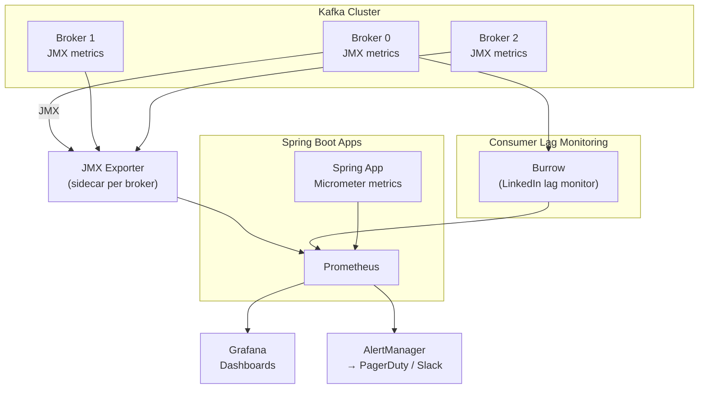

### Spring Boot Micrometer Metrics

```yaml
# application.yml — expose Kafka metrics via Micrometer
management:
  endpoints:
    web:
      exposure:
        include: prometheus, health
  metrics:
    tags:
      application: ${spring.application.name}
```

```java
// Custom business metrics alongside Kafka metrics
@Service
public class OrderMetrics {

    private final Counter eventsProcessed;
    private final Counter eventsFailed;
    private final Timer processingTime;

    public OrderMetrics(MeterRegistry registry) {
        this.eventsProcessed = Counter.builder("kafka.events.processed")
            .tag("topic", "order-events")
            .register(registry);
        this.eventsFailed = Counter.builder("kafka.events.failed")
            .tag("topic", "order-events")
            .register(registry);
        this.processingTime = Timer.builder("kafka.events.processing.time")
            .tag("topic", "order-events")
            .register(registry);
    }

    public void recordSuccess(Duration duration) {
        eventsProcessed.increment();
        processingTime.record(duration);
    }

    public void recordFailure() {
        eventsFailed.increment();
    }
}
```

---

## 3. Security

```text
AUTHENTICATION:

  SASL/PLAIN:
    Username/password in clear text (use with TLS).
    Simple but credentials visible in config files.
    Good for: dev/test environments.

  SASL/SCRAM (SHA-256/SHA-512):
    Salted challenge-response authentication.
    Passwords not transmitted in clear text.
    Good for: production without certificate infrastructure.

  mTLS (Mutual TLS):
    Both client and broker authenticate via certificates.
    Strongest. Requires PKI (certificate authority).
    Good for: high-security production environments.

  SASL/OAUTHBEARER:
    OAuth2 token-based authentication.
    Good for: cloud environments, SSO integration.

ENCRYPTION:
  - TLS for data IN TRANSIT (client ↔ broker, broker ↔ broker)
  - Disk encryption for data AT REST (OS/volume level)

AUTHORIZATION (ACLs):
  kafka-acls.sh --add \
    --allow-principal User:order-service \
    --operation Read --operation Write \
    --topic order.events

  Permissions: Read, Write, Create, Delete, Describe, Alter
  Scope: topic, consumer group, cluster, transactional ID
```

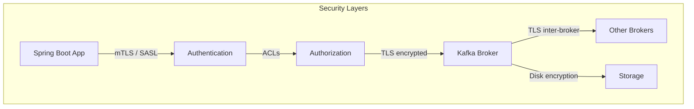

---

## 4. Capacity Planning

```text
THROUGHPUT CALCULATION:

  Messages/second:  10,000 msg/s
  Average size:     1 KB/msg
  Data rate:        10 MB/s

  With replication factor 3:
    Total broker write: 10 MB/s × 3 = 30 MB/s across cluster

STORAGE CALCULATION:

  Data rate:        10 MB/s
  Per day:          10 × 86,400 = 864 GB/day
  Retention 7 days: 864 × 7 ≈ 6 TB (per replica set)
  With RF=3:        6 × 3 = 18 TB total cluster storage

  Add 30% headroom: 18 × 1.3 ≈ 24 TB

BROKER SIZING:
  CPU:     8-16 cores (Kafka is I/O bound, not CPU bound)
  RAM:     32-64 GB (mostly for OS page cache, not JVM heap)
  JVM:     6-8 GB heap (Kafka uses little heap)
  Disk:    SSDs preferred. JBOD (multiple disks) for capacity.
  Network: 10 Gbps (Kafka is network-heavy with replication)

PARTITION SIZING:
  Target: ~10 MB/s per partition (write throughput)
  Total throughput 100 MB/s → 10+ partitions minimum
  With consumer headroom: 15-20 partitions

NUMBER OF BROKERS:
  Rule: total disk needed / disk per broker
  24 TB needed, 4 TB per broker → 6 brokers minimum
  Add 1-2 for headroom → 7-8 brokers
```

---

## 5. Performance Tuning Playbook

### Producer Tuning

```text
FOR HIGH THROUGHPUT:
  linger.ms = 20-100           (batch more messages)
  batch.size = 65536-131072    (larger batches, 64-128KB)
  compression.type = lz4       (fast compression)
  buffer.memory = 67108864     (64MB buffer)
  acks = 1                     (if some loss acceptable)

FOR LOW LATENCY:
  linger.ms = 0                (send immediately)
  batch.size = 16384           (default, small batches)
  compression.type = none      (no compression delay)
  acks = 1                     (don't wait for all replicas)

FOR RELIABILITY (production default):
  acks = all
  enable.idempotence = true
  compression.type = lz4
  linger.ms = 10
  batch.size = 32768
  min.insync.replicas = 2
```

### Consumer Tuning

```text
FOR HIGH THROUGHPUT:
  max.poll.records = 500-1000  (larger batches)
  fetch.min.bytes = 65536      (wait for data to accumulate)
  fetch.max.wait.ms = 500      (batch fetches)
  Use batch listener (setBatchListener(true))
  Batch DB operations (saveAll, batch INSERT)

FOR LOW LATENCY:
  max.poll.records = 50-100    (smaller batches, faster return)
  fetch.min.bytes = 1          (return immediately)
  fetch.max.wait.ms = 100      (don't wait long)

FOR RELIABILITY:
  enable.auto.commit = false
  AckMode = MANUAL_IMMEDIATE
  Idempotent processing
  DLQ configured
```

### End-to-End Latency

```text
Total = produce latency + broker latency + consume latency

  Produce:   linger.ms + network RTT + acks wait
  Broker:    write to disk + replication (for acks=all)
  Consume:   fetch.max.wait.ms + processing time + commit

  Optimization:
    linger.ms = 0
    acks = 1
    fetch.min.bytes = 1
    fetch.max.wait.ms = 100
    Co-locate with brokers

  Achievable: single-digit ms end-to-end.
```

---

## 6. Industry Design Patterns

### Pattern 1: Transactional Outbox

```text
PROBLEM: Atomically update DB and publish event to Kafka.
SOLUTION: Write event to outbox table in SAME DB transaction.
          Separate publisher polls outbox and publishes to Kafka.
```

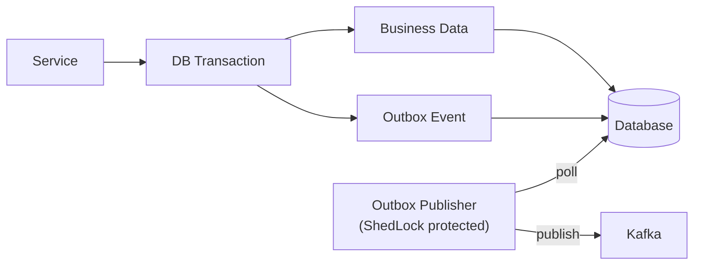

```text
WHEN: Any service needing reliable DB + event publishing.
This is the MOST IMPORTANT pattern for event-driven microservices.
See: Reliable-Messaging/README.md for full implementation.
```

### Pattern 2: Event Sourcing

```text
PROBLEM: CRUD stores only current state. History is lost.
SOLUTION: Store every state change as an immutable event.
          Current state = replay of all events.

  Events for order-123:
    OrderCreated   → {status: CREATED, total: 150}
    PaymentReceived → {status: PAID}
    OrderShipped   → {status: SHIPPED, tracking: "FX123"}

  Kafka is a natural event store:
    - Append-only log ✅
    - Immutable messages ✅
    - Ordered within partition ✅
    - Configurable retention (even infinite) ✅
    - Replay from any offset ✅
```

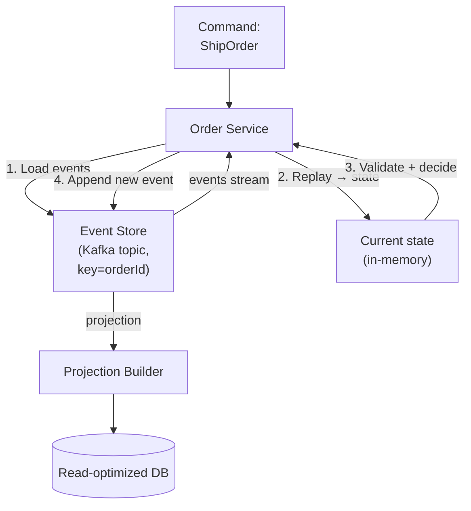

### Pattern 3: CQRS (Command Query Responsibility Segregation)

```text
PROBLEM: Reads and writes have different scalability/optimization needs.
SOLUTION: Separate write model from read model. Kafka connects them.

  Write side: Handles commands, validates, persists, publishes events.
  Read side:  Consumes events, builds denormalized query-optimized views.
```

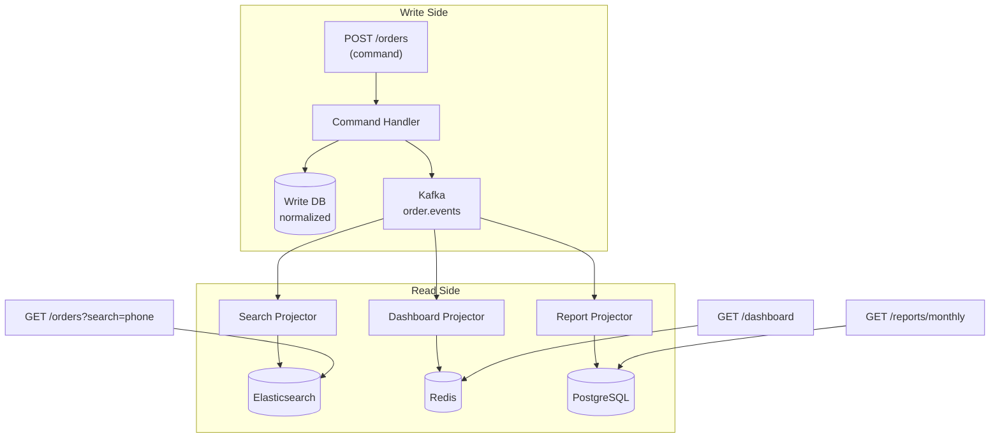

```text
WHEN:
  - Read and write workloads scale differently
  - Different query patterns need different storage engines
  - Read-heavy systems (10x more reads than writes)
  - Search, analytics, dashboards alongside transactional data
```

### Pattern 4: Saga — Choreography

```text
PROBLEM: Distributed transaction across multiple services.
SOLUTION: Each service reacts to events and publishes outcomes.
          On failure, services publish compensating events.

  No central coordinator. Services communicate only via events.
```

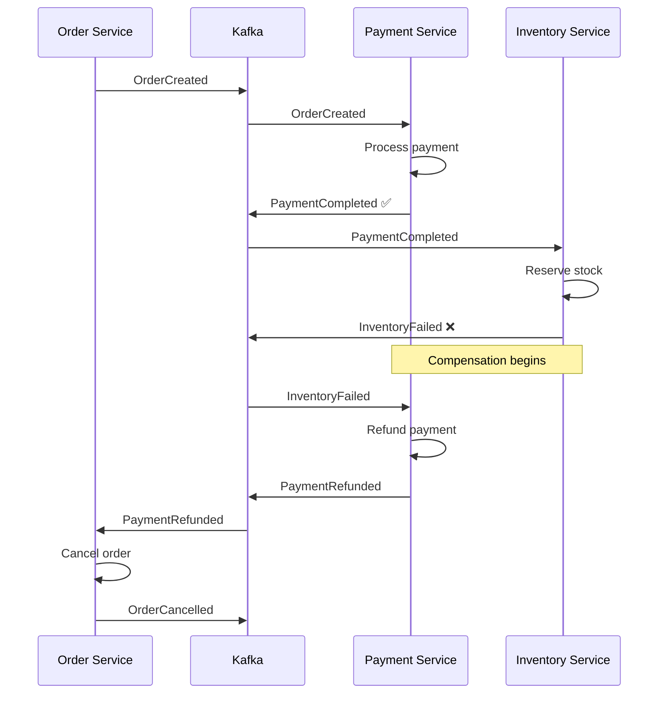

```text
PROS: Simple, no single point of failure, services are autonomous.
CONS: Hard to trace flow, hard to debug, implicit coupling via events.
```

### Pattern 5: Saga — Orchestration

```text
PROBLEM: Choreography becomes complex with many steps.
SOLUTION: Central orchestrator controls the saga flow.
          Sends commands, waits for responses, handles compensation.
```

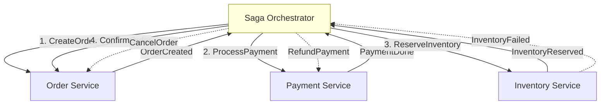

```text
PROS: Clear flow, easy to debug, centralized error handling.
CONS: Orchestrator is a single point of failure, more coupling.
USE: When saga has many steps (>3) or complex compensation logic.
```

### Pattern 6: Competing Consumers

```text
Multiple consumers in the same group compete for messages.
Each message processed by exactly ONE consumer.
This is Kafka's built-in work distribution.

  Topic: task-queue (6 partitions)
  Consumer Group: worker-group (3 consumers)
    Worker A → Partitions [0, 1]
    Worker B → Partitions [2, 3]
    Worker C → Partitions [4, 5]

Scale up: add more consumers (up to partition count).
Scale down: remaining consumers absorb partitions.
```

### Pattern 7: Claim Check

```text
PROBLEM: Large payloads (files, images, big JSON) are too big for Kafka.
SOLUTION: Store payload externally. Send only a reference in Kafka.
```

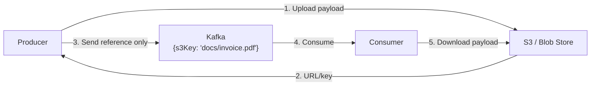

```text
WHEN: Message payload > 1MB, or storing binary data (images, PDFs).
Kafka default max.message.bytes = 1MB. Even if increased, large
messages hurt broker performance and replication.
```

### Pattern 8: Event-Carried State Transfer (Fat Events)

```text
THIN EVENT (notification only):
  { "eventType": "OrderCreated", "orderId": "123" }
  Consumer must CALL BACK to Order Service for details.
  Creates runtime coupling.

FAT EVENT (state carried in event):
  {
    "eventType": "OrderCreated",
    "orderId": "123",
    "customerId": "456",
    "items": [...],
    "totalAmount": 150.00,
    "shippingAddress": {...}
  }
  Consumer has ALL data. No callback needed.
  Full decoupling at the cost of larger payloads.

RECOMMENDATION: Use fat events for microservice communication.
  - Reduces runtime coupling
  - Reduces inter-service calls
  - Enables consumer autonomy
  - Stale data risk managed by consuming latest events
```

### Pattern 9: Change Data Capture (CDC)

```text
PROBLEM: Need DB changes as events without modifying application code.
SOLUTION: Tail the database transaction log (WAL/binlog) and publish
          changes to Kafka automatically.

  Tool: Debezium (most popular)

  PostgreSQL WAL → Debezium Connector → Kafka Topics

  Every INSERT, UPDATE, DELETE becomes a Kafka event.
  No application changes needed.
```

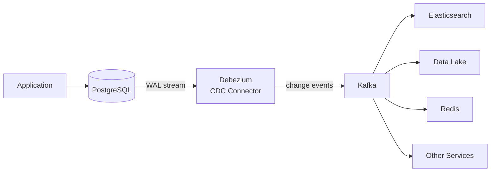

```text
USE CASES:
  - Sync to search index (DB → Kafka → Elasticsearch)
  - Build CQRS read models
  - Data replication across services
  - Feed data lake / analytics
  - Outbox pattern via CDC (no polling needed)
```

### Pattern 10: Strangler Fig (Migration)

```text
PROBLEM: Migrating from monolith to microservices incrementally.
SOLUTION: Kafka bridges old and new systems during migration.

  Phase 1: Monolith publishes events. New services consume.
  Phase 2: Both old and new paths run in parallel (shadow mode).
  Phase 3: New service takes over. Monolith code retired.
  Phase 4: Clean up.
```

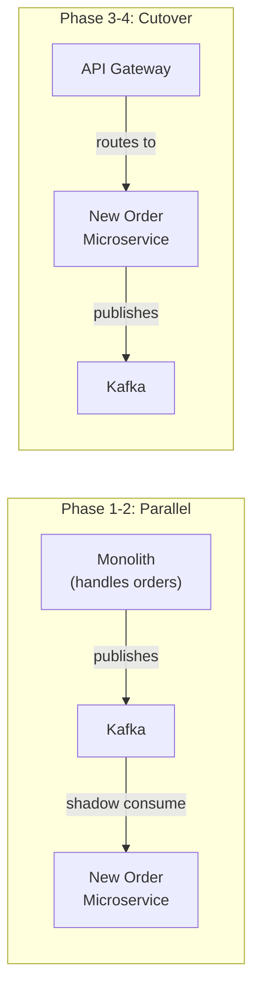

### Pattern 11: Dead Letter Channel with Tiered Retry

```text
Multi-stage retry with increasing delays using separate retry topics:

  main-topic → retry-0 (1 min) → retry-1 (10 min) → retry-2 (1 hr) → DLT

  Each retry topic has a different delay.
  Spring Kafka @RetryableTopic handles this automatically.

  Benefits:
    - Non-blocking (main consumer moves on)
    - Visible retry state (messages in retry topics)
    - Configurable per-stage delays
    - DLT for permanent failures
```

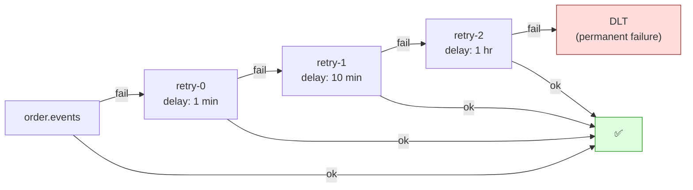

---

## 7. Operational Runbooks

### Runbook: Consumer Lag Growing

```text
SYMPTOM: Consumer lag metric increasing continuously.

STEP 1 — Check consumer group status:
  kafka-consumer-groups.sh --bootstrap-server <broker> \
    --describe --group <group-id>

  Look for: LAG column, CONSUMER-ID (is consumer connected?)

STEP 2 — Check for rebalancing:
  Look for "Revoking partition" / "Assigned partition" in consumer logs.
  Frequent rebalances = consumers keep losing and regaining partitions.
  Fix: static membership, cooperative rebalancing.

STEP 3 — Check processing time:
  How long does each message take to process?
  If > 100ms average: optimize processing or batch DB operations.

STEP 4 — Check downstream dependencies:
  Slow DB queries? Slow external API calls? Connection pool exhausted?

STEP 5 — Scale consumers:
  Add more consumer instances (up to partition count).
  If already at partition count: add partitions first.
  WARNING: adding partitions breaks key-based ordering.

STEP 6 — Adjust consumer config:
  Increase max.poll.records (process more per batch).
  Increase concurrency in Spring Kafka.
```

### Runbook: Under-Replicated Partitions

```text
SYMPTOM: UnderReplicatedPartitions > 0 for broker.

STEP 1 — Identify affected partitions:
  kafka-topics.sh --describe --under-replicated-partitions \
    --bootstrap-server <broker>

STEP 2 — Check broker health:
  Is the follower broker alive? Check logs for errors.
  Network connectivity between brokers?

STEP 3 — Check disk I/O:
  Follower disk too slow to keep up with leader.
  High iowait? Full disk? Noisy neighbors?

STEP 4 — Check replication config:
  replica.lag.time.max.ms (default 30s)
  If followers are slightly behind, increase this slightly.

STEP 5 — If broker is down:
  Controller will elect new leaders for affected partitions.
  When broker comes back: it rejoins ISR after catching up.
  Monitor ISR shrink/expand metrics.
```

### Runbook: Broker Disk Full

```text
SYMPTOM: Broker log directory approaching capacity.

STEP 1 — Check retention:
  kafka-configs.sh --describe --topic <topic> \
    --bootstrap-server <broker>
  Look at: retention.ms, retention.bytes

STEP 2 — Reduce retention (if safe):
  kafka-configs.sh --alter --topic <topic> \
    --add-config retention.ms=172800000 \
    --bootstrap-server <broker>
  (Reduce from 7 days to 2 days)

STEP 3 — Delete old topics:
  kafka-topics.sh --delete --topic <unused-topic> \
    --bootstrap-server <broker>

STEP 4 — Add disks:
  Add more disks to the broker (JBOD).
  Update log.dirs config to include new disk.

STEP 5 — Rebalance partitions:
  kafka-reassign-partitions.sh to move partitions to less-full brokers.
```

### Runbook: Producer Sends Failing

```text
SYMPTOM: Producer record-error-rate > 0 or TimeoutException in logs.

STEP 1 — Check broker availability:
  Can the producer reach the bootstrap servers?
  Telnet / nc to broker:9092.

STEP 2 — Check acks + min.insync.replicas:
  acks=all + min.insync.replicas=2 + only 1 replica alive
  → NotEnoughReplicasException. Fix: restore brokers.

STEP 3 — Check buffer.memory:
  BufferExhaustedException → producer buffer full.
  Increase buffer.memory or reduce message rate.

STEP 4 — Check delivery.timeout.ms:
  TimeoutException → message not acked within timeout.
  Increase timeout or fix broker performance.

STEP 5 — Check max.block.ms:
  If metadata fetch takes too long (new topic, broker overloaded).
```

---

## 8. Interview Questions — Production & Patterns

### Q1: How would you design a reliable event pipeline between microservices?

```text
  Producer side:
    1. Transactional Outbox (atomic DB + event write)
    2. Outbox publisher with ShedLock (single publisher across instances)
    3. acks=all, enable.idempotence=true

  Kafka:
    4. replication.factor=3, min.insync.replicas=2
    5. Partition key = aggregateId (ordering per entity)
    6. Retention ≥ consumer recovery time

  Consumer side:
    7. Manual offset commit after processing
    8. Idempotent consumer (track processed eventIds)
    9. Retry with exponential backoff
    10. DLQ for permanently failing messages

  Monitoring:
    11. Consumer lag dashboards + alerts
    12. DLT message count alerts
    13. End-to-end latency tracking
```

### Q2: Explain the Transactional Outbox pattern.

```text
Write business data + event to the SAME database in ONE transaction.
A separate publisher reads unpublished events and sends to Kafka.

This solves the dual-write problem (can't atomically write to DB + Kafka).
If Kafka is down: events accumulate in the outbox safely.
Publisher retries until Kafka acknowledges.

Two approaches for reading the outbox:
  Polling: scheduled query (simple, adds DB load)
  CDC (Debezium): tail DB WAL (real-time, minimal DB load, more infra)
```

### Q3: When do you use choreography vs orchestration for sagas?

```text
Choreography (event-driven, no coordinator):
  Each service reacts to events and publishes outcomes.
  Good for: simple flows (2-3 steps), loosely coupled services.
  Bad for: complex flows, hard to debug, implicit coupling.

Orchestration (central coordinator):
  Saga orchestrator sends commands and handles responses.
  Good for: complex flows (4+ steps), clear error handling.
  Bad for: orchestrator becomes single point of failure.

Rule of thumb: use choreography for simple flows,
orchestration for complex flows with many compensation steps.
```

### Q4: How do you handle schema evolution in Kafka?

```text
Use Schema Registry (Confluent) with Avro or Protobuf.
Registry enforces compatibility rules:
  BACKWARD: new schema can read old data (add fields with defaults)
  FORWARD: old schema can read new data (remove optional fields)
  FULL: both directions

This prevents breaking changes from being deployed.
Producer registers schema → Registry validates → rejects incompatible.

For JSON: no built-in schema enforcement. Use versioned event
envelopes and handle multiple versions in consumer code.
```

### Q5: How do you monitor Kafka in production?

```text
Three levels:

  Broker level:
    UnderReplicatedPartitions, OfflinePartitions, ActiveControllerCount
    Disk usage, network I/O, request handler idle percent
    → Prometheus JMX Exporter + Grafana

  Producer level:
    record-send-rate, record-error-rate, request-latency-p99
    buffer-available-bytes, batch-size-avg
    → Micrometer metrics in Spring Boot

  Consumer level:
    records-lag-max (THE most important consumer metric)
    records-consumed-rate, rebalance-rate
    → Burrow (LinkedIn) or kafka-consumer-groups.sh + Prometheus

  Alerting:
    🔴 Consumer lag growing for > 5 minutes
    🔴 Under-replicated partitions > 0 for > 5 minutes
    🔴 DLT topic receiving messages
    🟡 Producer error rate > 0
    🟡 High rebalance frequency
```

### Q6: What is CDC and how does Debezium work with Kafka?

```text
CDC (Change Data Capture) captures database changes from the
transaction log (WAL for PostgreSQL, binlog for MySQL) and
publishes them as events to Kafka.

Debezium is a CDC connector for Kafka Connect:
  1. Reads database WAL/binlog (no application changes needed)
  2. Converts each INSERT/UPDATE/DELETE to a Kafka message
  3. Publishes to topic: <server>.<schema>.<table>
  4. Includes before/after state of each row

Use cases: sync to search index, build read models, replicate
data across services, implement Outbox via CDC.
```

### Q7: How do you size Kafka partitions for a new topic?

```text
Consider:
  1. Max consumer count you'll ever need (partitions ≥ this)
  2. Throughput: single partition handles ~10 MB/s
     If you need 100 MB/s → at least 10 partitions
  3. Key cardinality: if you have 1000 unique keys, 12 partitions
     gives reasonable distribution. Too few → hot partitions.
  4. Ordering: all events for same key go to same partition.
     More partitions = less contention per partition.
  5. Broker limits: ~4000 partitions per broker recommended.

Start with 6-12 partitions for most topics.
You can increase later, but it BREAKS key-based ordering.
Plan partition count carefully upfront.
```

### Q8: Explain the Claim Check pattern.

```text
Store large payloads externally (S3, blob storage).
Send only a reference (claim check) through Kafka.
Consumer uses the reference to retrieve the full payload.

Benefits:
  - Kafka messages stay small (fast, efficient)
  - Avoids max.message.bytes limits
  - Large data stored in appropriate system (object storage)

Use when: payload > 1MB, binary files, large JSON documents.
```

### Q9: How would you handle a Kafka cluster failure gracefully?

```text
  Producer:
    - buffer.memory holds messages during brief outages
    - retries + delivery.timeout.ms handle transient failures
    - Circuit breaker pattern: if Kafka is down for extended period,
      fall back to local storage or DB-based queue

  Consumer:
    - On restart: resumes from last committed offset
    - Idempotent processing handles re-deliveries
    - Consumer lag catches up after cluster recovery

  Infrastructure:
    - Multi-AZ deployment (brokers across availability zones)
    - replication.factor=3 (survive 1 broker failure)
    - min.insync.replicas=2 (prevent data loss)
    - Mirror Maker 2 for cross-datacenter replication (DR)

  Application:
    - Circuit breaker on producer (Resilience4j)
    - Transactional Outbox as fallback (events safe in DB)
    - Health checks include Kafka connectivity
```

### Q10: Compare Event Sourcing vs traditional CRUD with Kafka.

```text
CRUD:
  Stores CURRENT state only. History lost.
  UPDATE orders SET status='SHIPPED' WHERE id=1
  Simple. Fast reads. No audit trail without extra logging.

Event Sourcing:
  Stores ALL state changes as immutable events.
  Current state = replay of all events.
  Full audit trail. Time-travel debugging. Can rebuild any past state.
  Complex. Read performance depends on event count (use projections).

Kafka fits event sourcing naturally:
  - Append-only log = event store
  - Partition per aggregate (key=aggregateId)
  - Log compaction for snapshots
  - Replay from any offset

Use Event Sourcing when:
  - Audit trail is critical (finance, healthcare, legal)
  - You need to know HOW state changed, not just current state
  - Temporal queries ("what was the state at 3pm yesterday?")
  - CQRS architecture (separate read/write models)
```
