# Kafka Deep Dive — Part 5: Interview Scenario-Based Problems

Real-world scenarios that interviewers ask at SDE2/SDE3 level.
Each scenario includes the problem statement, what the interviewer
is testing, and a structured answer.

> This is Part 5 (bonus). See also:
> - [Part 1: Fundamentals & Architecture](./01-Kafka-Fundamentals.md)
> - [Part 2: Producer & Consumer Internals](./02-Kafka-Producer-Consumer.md)
> - [Part 3: Spring Boot Integration](./03-Kafka-Spring-Boot.md)
> - [Part 4: Production Practices & Design Patterns](./04-Kafka-Production-Patterns.md)

---

## Scenario 1: Duplicate Payment Processing

```text
PROBLEM:
  "Our payment service consumes OrderCreated events from Kafka and
  charges the customer's credit card. We're seeing cases where
  customers are charged TWICE for the same order. How would you fix this?"

WHAT THEY'RE TESTING:
  - Understanding of at-least-once delivery
  - Idempotent consumer design
  - Root cause analysis

ANSWER:

  ROOT CAUSE:
  At-least-once delivery means Kafka may redeliver messages when:
    - Consumer crashes after processing but before committing offset
    - Rebalancing reassigns partition to another consumer
    - Producer retry creates a duplicate in the topic

  The payment consumer processes the message (charges card) and then
  crashes before committing the offset. On restart, Kafka redelivers
  the message → card charged again.

  FIX — Make the consumer IDEMPOTENT:

  Option A: Idempotency key in DB (best)
    1. Every event has a unique eventId
    2. Before processing: check if eventId exists in processed_events table
    3. If exists → skip (already processed)
    4. If not → process payment + insert eventId in SAME DB transaction
    5. Unique constraint on eventId prevents race conditions

    @Transactional
    public void processPayment(OrderCreatedEvent event) {
        if (processedEventRepo.existsByEventId(event.getEventId())) {
            return;  // duplicate, skip
        }
        paymentGateway.charge(event.getCustomerId(), event.getAmount());
        processedEventRepo.save(new ProcessedEvent(event.getEventId()));
    }

  Option B: Payment gateway idempotency key
    Most payment gateways (Stripe, Adyen) support an idempotency key.
    Send orderId as the idempotency key → gateway deduplicates.

    stripe.charges.create({
        amount: 10000,
        idempotencyKey: "order-123"  // same key = same charge
    });

  Option C: Database unique constraint
    INSERT INTO payments (order_id, amount, status)
    VALUES ('order-123', 100.00, 'PENDING')
    ON CONFLICT (order_id) DO NOTHING;

    Second insert fails silently → no duplicate payment.

  ALSO FIX THE PRODUCER:
    enable.idempotence = true → prevents duplicate messages on retry.
```

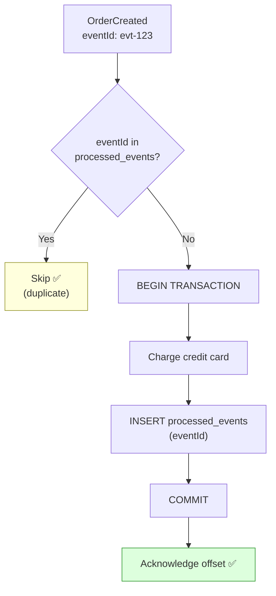

---

## Scenario 2: Messages Processed Out of Order

```text
PROBLEM:
  "We have an Order service publishing events: OrderCreated,
  OrderPaid, OrderShipped. Our downstream service sometimes
  processes OrderShipped BEFORE OrderPaid. Why, and how do you fix it?"

WHAT THEY'RE TESTING:
  - Partition-level ordering vs cross-partition ordering
  - Key-based partitioning
  - Understanding of when ordering breaks

ANSWER:

  WHY IT HAPPENS:
  If events for the same order go to DIFFERENT partitions, there is
  NO ordering guarantee. This happens when:
    1. Producer sends with null key → round-robin distribution
    2. Producer uses different keys for same order's events
    3. Partition count was changed (hash changes → new partition)
    4. Custom partitioner has a bug

  Also breaks with:
    5. Non-blocking retries (@RetryableTopic) → failed message
       retried later, subsequent messages processed first
    6. Multiple consumer threads processing same partition's
       messages in parallel (shouldn't happen with standard config)

  FIX:

  1. USE CONSISTENT PARTITION KEY:
     Always use orderId as the key for ALL order events.
     hash("order-123") % N → always the same partition.
     All events for order-123 are in one partition → ordered.

     kafkaTemplate.send("order-events", order.getId(), event);
     //                                 ^^^^^^^^^ key

  2. NEVER CHANGE PARTITION COUNT on ordering-sensitive topics.
     Adding partitions changes hash → key mapping.

  3. IF ORDER ALREADY BROKEN — defensive consumer:
     Use version numbers or timestamps in events.
     Only apply state change if version > current version.

     UPDATE orders
     SET status = 'SHIPPED', version = 3
     WHERE id = 'order-123' AND version < 3;

     If version 3 (Shipped) arrives before version 2 (Paid):
       Shipped applied (version 2 < 3 → skip when Paid arrives).
       OR: Buffer out-of-order events and apply when predecessor arrives.

  4. FOR STRICT ORDERING WITH RETRIES:
     Use blocking retry (DefaultErrorHandler) instead of
     @RetryableTopic, so failed messages block subsequent ones.
```

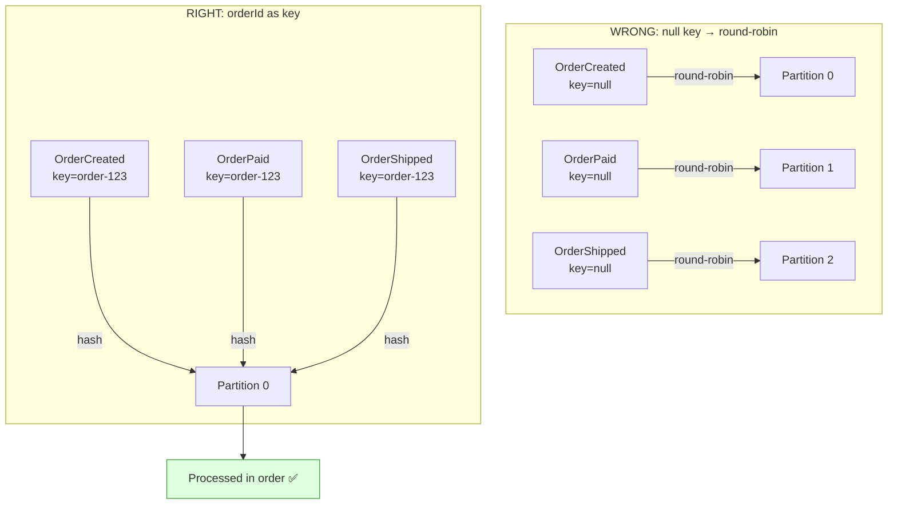

---

## Scenario 3: Consumer Keeps Getting Kicked Out

```text
PROBLEM:
  "Our Kafka consumer keeps getting removed from the group and
  triggering rebalances every few minutes. The logs show
  'member has left the group' errors. What's going on?"

WHAT THEY'RE TESTING:
  - Understanding of max.poll.interval.ms vs session.timeout.ms
  - Rebalance troubleshooting
  - Consumer tuning

ANSWER:

  DIAGNOSIS — Two possible causes:

  CAUSE 1: Processing too slow (most common)
    Consumer calls poll() → gets 500 messages → processes them
    → processing takes > 5 minutes (max.poll.interval.ms)
    → Kafka thinks consumer is dead → kicks it → rebalance

    Evidence: logs show "consumer poll timeout expired"

    FIX:
      a. Reduce max.poll.records (e.g., from 500 to 50)
         Smaller batch → finishes faster → poll() called sooner
      b. Optimize processing (batch DB writes, caching)
      c. Increase max.poll.interval.ms (last resort, delays detection)
      d. Offload heavy processing to a thread pool

  CAUSE 2: GC pauses or network issues
    Long GC pauses prevent heartbeat thread from running.
    session.timeout.ms (45s) expires → consumer declared dead.

    Evidence: GC logs show long pauses. Network timeouts in logs.

    FIX:
      a. Tune JVM GC (use G1 or ZGC, set heap appropriately)
      b. Increase session.timeout.ms (if GC pauses are brief)
      c. Check network stability between consumer and broker

  CAUSE 3: Rolling deployments without static membership
    Each pod restart → leave → rebalance → rejoin → rebalance.

    FIX:
      group.instance.id = stable-per-pod ID
      session.timeout.ms = 300000 (5 min for deployment window)

  ALWAYS ALSO:
    Use CooperativeStickyAssignor (reduces rebalance impact).
    Monitor rebalance-rate metric.
```

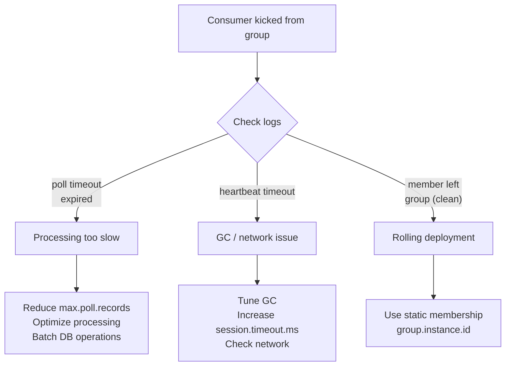

---

## Scenario 4: Lost Messages After Broker Failure

```text
PROBLEM:
  "One of our Kafka brokers crashed and after it came back, we noticed
  some messages were missing. How is this possible with replication?"

WHAT THEY'RE TESTING:
  - Understanding of acks, ISR, min.insync.replicas
  - Replication guarantees

ANSWER:

  THIS HAPPENS WHEN:

  1. acks=1 (only leader acknowledged):
     Producer sends → leader writes → sends ack → leader crashes
     BEFORE replicating to followers.
     New leader elected from followers → they don't have the message.
     MESSAGE LOST.

  2. acks=all BUT min.insync.replicas=1:
     If only the leader is in ISR (followers fell behind),
     acks=all only waits for the leader.
     Leader crashes before any follower catches up → LOST.

  3. unclean.leader.election.enable=true:
     Allows a NON-ISR follower to become leader.
     This follower is behind → messages the old leader had are LOST.

  HOW TO PREVENT:

  acks = all                        → wait for ALL ISR replicas
  min.insync.replicas = 2           → at least 2 must ack
  replication.factor = 3            → 3 copies of every message
  unclean.leader.election = false   → only ISR can become leader

  With this config:
    - Producer blocked if < 2 replicas are in sync
    - No data loss as long as at least 1 replica survives
    - If 2 brokers die: writes FAIL (better than losing data)

  TRADEOFF:
    Higher min.insync.replicas → more safety, less availability.
    With RF=3, min.insync=2: tolerates 1 failure.
    With RF=3, min.insync=3: zero failure tolerance (any failure blocks writes).
```

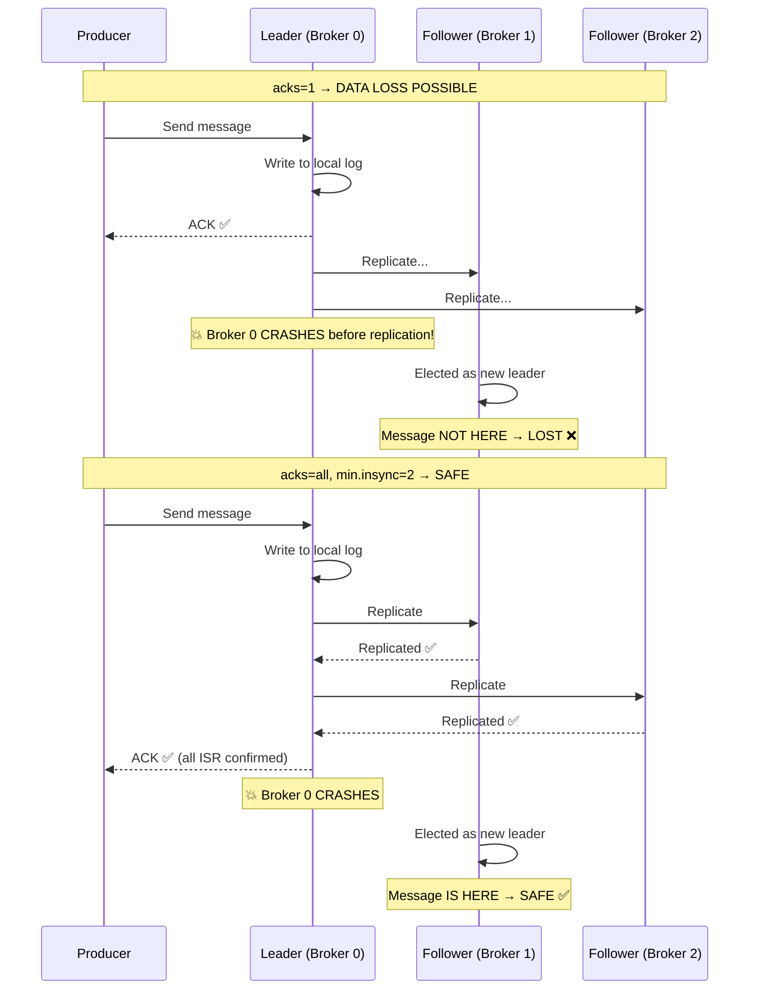

---

## Scenario 5: Exactly-Once Order Processing

```text
PROBLEM:
  "Design an order processing system that guarantees each order is
  processed exactly once — no lost orders, no duplicate processing."

WHAT THEY'RE TESTING:
  - End-to-end exactly-once understanding
  - Transactional Outbox
  - Idempotent consumer
  - Complete system design thinking

ANSWER:

  True exactly-once across Kafka + DB is not possible with a single
  mechanism. You achieve it by combining patterns:

  PRODUCER SIDE (no event loss):
    1. Transactional Outbox:
       Save order + outbox event in ONE DB transaction.
       Outbox publisher sends to Kafka. If Kafka down → retries.
       No events lost. May produce duplicates (at-least-once).

    2. Idempotent producer:
       enable.idempotence=true → dedup retries at broker level.

  KAFKA (no data loss):
    3. acks=all, replication.factor=3, min.insync.replicas=2
       Message durably stored on multiple brokers.

  CONSUMER SIDE (no duplicate processing):
    4. Idempotent consumer:
       Track eventId in processed_events table.
       Check before processing → skip if already seen.
       Insert eventId in SAME transaction as business logic.

    5. Manual offset commit AFTER processing.

  RESULT:
    Producer: at-least-once (outbox retries may duplicate)
    Broker: durable (replicated, no loss)
    Consumer: effectively exactly-once (idempotent dedup)
    End-to-end: exactly-once SEMANTICS (business outcome is correct)
```

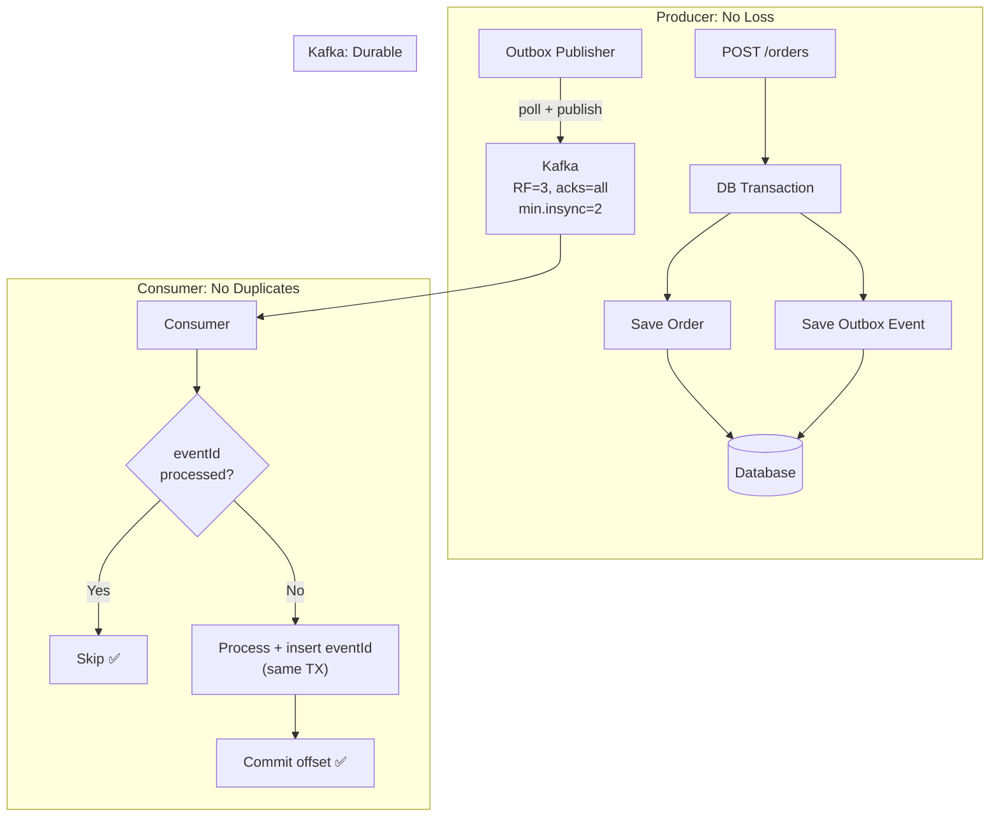

---

## Scenario 6: Hot Partition Problem

```text
PROBLEM:
  "We have a Kafka topic with 12 partitions and 12 consumers, but
  one consumer is overloaded while others are nearly idle. Consumer
  lag is growing on one partition but zero on others."

WHAT THEY'RE TESTING:
  - Understanding of partition key distribution
  - Hot partition / data skew
  - Mitigation strategies

ANSWER:

  ROOT CAUSE: Data skew in partition keys.
  One key (or a few keys) has disproportionately more messages.

  Example:
    Topic: user-activity-events, key = userId
    User "system-bot" generates 80% of all events.
    hash("system-bot") % 12 = partition 7
    → Partition 7 has 80% of data. Consumer 7 is overwhelmed.

  DIAGNOSIS:
    kafka-consumer-groups.sh --describe --group <group>
    Look at LAG per partition → one partition has huge lag.

    Check message distribution:
    kafka-run-class.sh kafka.tools.GetOffsetShell \
      --topic user-activity --broker-list <broker>
    → Compare offsets across partitions.

  FIXES:

  1. USE A COMPOSITE KEY:
     Instead of key = userId, use key = userId + random_suffix
     key = "system-bot-0", "system-bot-1", ..., "system-bot-9"
     Spreads hot user across 10 partitions.
     Tradeoff: breaks strict per-user ordering.

  2. CUSTOM PARTITIONER:
     Route known hot keys to a set of dedicated partitions.
     Route everything else normally.

     public class SmartPartitioner implements Partitioner {
         public int partition(String topic, Object key, ...) {
             if ("system-bot".equals(key)) {
                 return ThreadLocalRandom.current().nextInt(0, 3);
                 // spread across partitions 0-2
             }
             return Utils.toPositive(Utils.murmur2(keyBytes))
                 % numPartitions;
         }
     }

  3. FILTER HOT KEYS:
     Route high-volume keys to a separate topic.
     Process them with dedicated consumers that are optimized
     for high throughput (batch processing, async I/O).

  4. INCREASE PARTITIONS:
     More partitions → better distribution (probabilistically).
     But: can't decrease later, breaks existing key mapping.
```

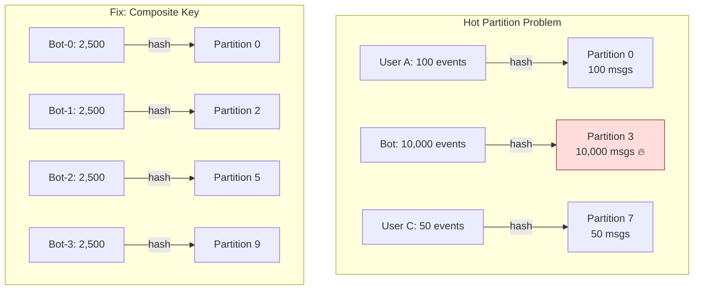

---

## Scenario 7: Kafka Consumer Stops Processing

```text
PROBLEM:
  "Our Kafka consumer is running, heartbeats are flowing, no errors
  in logs, but it's not processing any messages. Consumer lag is
  growing. What could be wrong?"

WHAT THEY'RE TESTING:
  - Debugging Kafka consumer issues
  - Understanding of consumer internals

ANSWER:

  POSSIBLE CAUSES:

  1. CONSUMER IS PAUSED:
     consumer.pause(partitions) was called but never resumed.
     Check if your code has pause/resume logic with a bug.

  2. DESERIALIZER FAILING SILENTLY:
     ErrorHandlingDeserializer catches errors but the error handler
     might be configured to skip silently without logging.

  3. OFFSET RESET TO latest:
     Consumer committed offsets expired (older than retention).
     auto.offset.reset=latest → consumer skips all existing messages.
     Looks like "not processing" but it's just waiting for NEW messages.

  4. WRONG TOPIC / GROUP:
     Consumer subscribed to wrong topic name (typo).
     Or consumer group ID changed → starts fresh, auto.offset.reset=latest.

  5. ACL / PERMISSION ISSUE:
     Consumer doesn't have READ permission on the topic.
     May fail silently depending on error handling.

  6. ALL PARTITIONS ASSIGNED TO OTHER CONSUMERS:
     If concurrency > number of instances but another instance has
     all partitions, this consumer instance sits idle.

  7. POISON MESSAGE WITH BLOCKING RETRY:
     First message in partition fails → infinite retry (no DLQ)
     → consumer is stuck on one message forever.
     Heartbeat flows (background thread) so no rebalance.
     But no progress.

  DEBUGGING STEPS:
    a. Check consumer group: kafka-consumer-groups.sh --describe
       Is this consumer assigned any partitions?
    b. Check logs for deserialization errors
    c. Check auto.offset.reset and offset expiry
    d. Check topic name spelling
    e. Check if consumer is paused (application logs/metrics)
    f. Check ACLs: kafka-acls.sh --list --topic <topic>
    g. Try consuming with kafka-console-consumer to verify topic has data
```

---

## Scenario 8: Designing an Event-Driven Order System

```text
PROBLEM:
  "Design an event-driven e-commerce order system using Kafka.
  When a customer places an order, the following must happen:
    1. Payment is charged
    2. Inventory is reserved
    3. Notification email is sent
    4. Analytics event is recorded
  If payment or inventory fails, the order must be cancelled."

WHAT THEY'RE TESTING:
  - End-to-end event-driven architecture
  - Saga pattern knowledge
  - Error handling and compensation
  - Topic design

ANSWER:
```

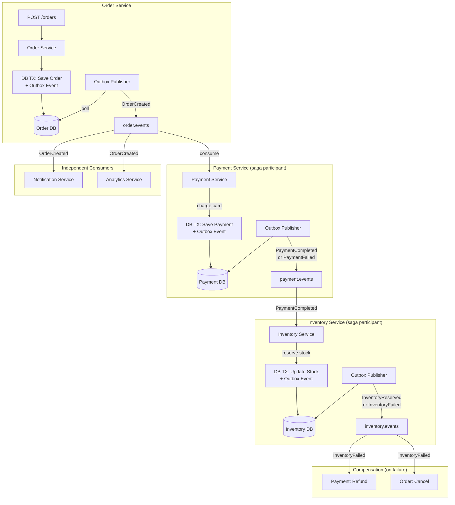

```text
  TOPIC DESIGN:
    order.events     → OrderCreated, OrderConfirmed, OrderCancelled
    payment.events   → PaymentCompleted, PaymentFailed, PaymentRefunded
    inventory.events → InventoryReserved, InventoryFailed, InventoryReleased

    All topics: 12 partitions, RF=3, min.insync.replicas=2
    Partition key: orderId (ordering per order)

  SAGA FLOW (Choreography):
    Happy path:
      OrderCreated → PaymentCompleted → InventoryReserved → OrderConfirmed

    Failure path (inventory fails):
      OrderCreated → PaymentCompleted → InventoryFailed
        → PaymentRefunded (compensation)
        → OrderCancelled (compensation)

    Failure path (payment fails):
      OrderCreated → PaymentFailed
        → OrderCancelled (compensation)

  EACH SERVICE:
    - Transactional Outbox (reliable publishing)
    - Idempotent consumer (no duplicate processing)
    - DLQ for permanently failing messages
    - ShedLock on outbox publisher (no duplicate publishing)

  NOTIFICATION + ANALYTICS:
    Separate consumer groups on order.events.
    Independent of the saga. Fire-and-forget.
    Notification failure does NOT cancel the order.
```

---

## Scenario 9: Consumer Lag Spike After Deployment

```text
PROBLEM:
  "Every time we deploy our consumer service (rolling deployment),
  we see a spike in consumer lag that takes 10-15 minutes to recover.
  During this time, some messages are processed twice."

WHAT THEY'RE TESTING:
  - Rebalancing during deployments
  - Static membership
  - Duplicate handling

ANSWER:

  ROOT CAUSE:
  Rolling deployment restarts consumer pods one by one.
  Each restart: consumer leaves group → REBALANCE → rejoins → REBALANCE.
  With N pods: 2N rebalances. During each rebalance ALL consumers STOP.

  Lag spikes because:
    - Consumers stop during rebalance (messages accumulate)
    - Rebalance takes time (partition assignment negotiation)
    - After rebalance, consumers resume from last committed offset
    - Messages processed but not committed before rebalance → reprocessed

  FIXES (apply ALL):

  1. STATIC GROUP MEMBERSHIP:
     group.instance.id = ${HOSTNAME}  (stable per pod)
     session.timeout.ms = 300000      (5 min for deployment)

     Pod restarts with same instance ID → no rebalance.
     Kafka waits 5 min before considering it dead.
     If pod comes back within 5 min → gets same partitions → zero disruption.

  2. COOPERATIVE REBALANCING:
     partition.assignment.strategy = CooperativeStickyAssignor
     If rebalance does happen, only affected partitions stop.
     Unaffected partitions continue processing.

  3. IDEMPOTENT CONSUMER:
     Handle duplicate processing gracefully.
     Track processed eventIds → skip duplicates.

  4. READINESS PROBE:
     Don't mark pod as ready until consumer has joined group
     and is processing. Kubernetes won't kill the next pod until
     this one is ready.

  RESULT: Zero rebalances during rolling deployment.
  Lag spike eliminated. Duplicate processing handled by idempotency.
```

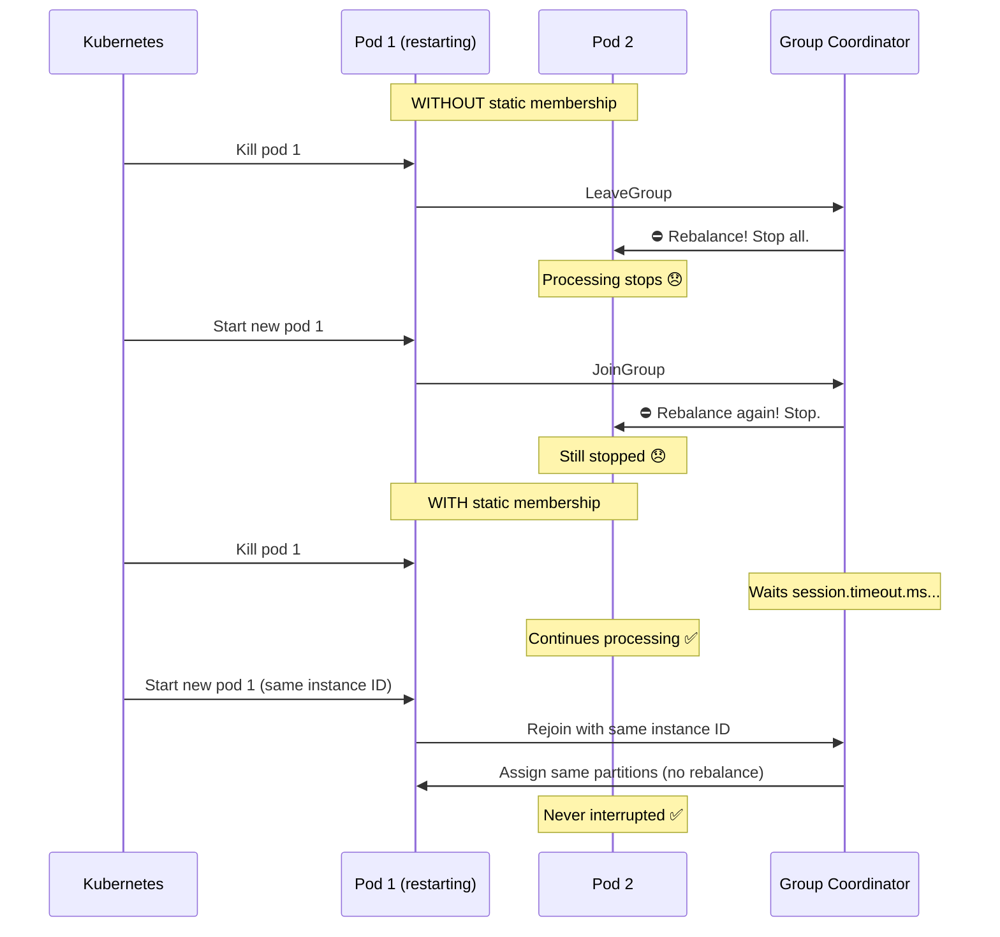

---

## Scenario 10: Cross-Region Kafka Replication

```text
PROBLEM:
  "We have services in US-East and EU-West. Both regions need to
  consume order events. How do you replicate Kafka data across regions?"

WHAT THEY'RE TESTING:
  - Multi-region Kafka architecture
  - MirrorMaker 2
  - Tradeoffs (latency, consistency, cost)

ANSWER:

  OPTION 1: MirrorMaker 2 (MM2)
    Kafka's built-in cross-cluster replication tool.
    Runs as a Kafka Connect connector.

    US-East Kafka ──[MM2]──→ EU-West Kafka

    - Replicates topics, offsets, consumer groups, configs
    - Supports active-passive and active-active setups
    - Topic naming: us-east.order.events → eu-west receives as
      us-east.order.events (prefixed)

  OPTION 2: Confluent Cluster Linking
    Native Kafka protocol replication (no Connect needed).
    Lower latency than MM2. Byte-for-byte topic mirror.

  OPTION 3: Application-Level Replication
    Producer publishes to both clusters.
    Simple but no exactly-once guarantee across clusters.

  ARCHITECTURE:

    Active-Passive:
      US-East = primary (writes here)
      EU-West = read replica (consumers read locally)
      On US-East failure: EU-West becomes primary (manual failover)

    Active-Active:
      Both regions accept writes to local topics.
      MM2 replicates between clusters.
      Consumers in each region read local + replicated topics.
      Complex: must handle conflicts, ordering across regions.

  TRADEOFFS:
    - Replication lag (50-200ms inter-region, more during spikes)
    - Double storage cost
    - Eventual consistency between regions
    - Failover complexity (offset translation needed)
```

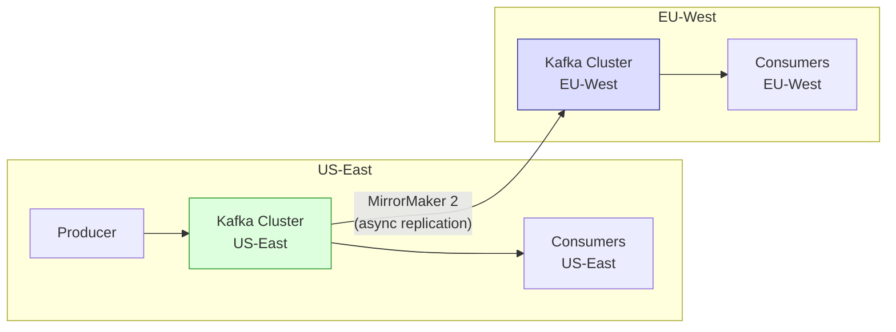

---

## Scenario 11: Handling Backpressure

```text
PROBLEM:
  "Our producer is generating events at 50,000/sec but our consumer
  can only process 10,000/sec. Consumer lag is growing indefinitely.
  How do you handle this?"

WHAT THEY'RE TESTING:
  - Backpressure understanding
  - Scaling strategies
  - Producer/consumer imbalance

ANSWER:

  SHORT-TERM (stop the bleeding):
  1. SCALE CONSUMERS:
     Add more consumer instances (up to partition count).
     12 partitions → can have up to 12 consumers.
     If already at 12: increase partitions first (carefully!).

  2. OPTIMIZE CONSUMER:
     - Batch DB writes (saveAll instead of save)
     - Increase max.poll.records (larger batches)
     - Remove unnecessary processing
     - Cache frequently looked-up data
     - Async I/O for external calls

  MEDIUM-TERM (architecture fixes):
  3. ADD MORE PARTITIONS + CONSUMERS:
     Increase from 12 to 24 partitions.
     Deploy 24 consumers.
     WARNING: breaks key ordering — evaluate impact.

  4. SEPARATE FAST AND SLOW PATHS:
     Route events that need heavy processing to a separate topic.
     Light events processed inline (fast path).
     Heavy events processed by dedicated consumers (slow path).

  5. CONSUMER-SIDE BUFFERING:
     Consumer writes raw events to a local DB/queue.
     Separate worker pool processes from local store.
     Decouples Kafka consumption from processing speed.

  LONG-TERM:
  6. RATE LIMIT THE PRODUCER:
     If producer generates unnecessary volume → throttle it.

  7. SAMPLING / AGGREGATION:
     Do you really need ALL 50K events/sec?
     Can you aggregate or sample at the producer?

  NEVER DO:
    ❌ Drop messages silently
    ❌ Increase retention.ms to "buy time" without fixing throughput
    ❌ Add consumers beyond partition count (they sit idle)
```

---

## Scenario 12: Poison Message Blocking a Partition

```text
PROBLEM:
  "One partition in our Kafka topic has not made progress in 3 hours.
  The consumer keeps retrying the same message and failing. All other
  partitions are fine."

WHAT THEY'RE TESTING:
  - Poison message handling
  - DLQ configuration
  - Partition-level impact understanding

ANSWER:

  ROOT CAUSE: A poison message — a message that will NEVER process
  successfully, no matter how many times you retry.
  
  Examples:
    - Malformed JSON that cannot be deserialized
    - Missing required field → NullPointerException
    - Invalid business data → validation always fails
    - Schema incompatible between producer and consumer

  WHY IT BLOCKS THE PARTITION:
  Consumer retries are blocking. The consumer won't move past this
  message until it succeeds or is explicitly skipped.
  Meanwhile, all subsequent messages in that partition are stuck.

  IMMEDIATE FIX:
  1. Skip the message manually:
     kafka-consumer-groups.sh --reset-offsets \
       --topic order.events:3 \          (partition 3)
       --to-offset <current+1> \
       --group payment-group \
       --execute

  2. Or consume and discard with kafka-console-consumer.

  PROPER FIX (prevent recurrence):
  1. CONFIGURE DLQ:
     DefaultErrorHandler + DeadLetterPublishingRecoverer
     After N retries → message goes to DLT → consumer moves on.

  2. SEPARATE RETRYABLE VS NON-RETRYABLE ERRORS:
     Don't retry DeserializationException, NullPointerException.
     Send immediately to DLT.

     handler.addNotRetryableExceptions(
         DeserializationException.class,
         NullPointerException.class);

  3. USE ErrorHandlingDeserializer:
     Catches malformed messages at deserialization stage.
     Wraps error in a special record instead of crashing.

  4. USE SCHEMA REGISTRY:
     Enforces compatible schemas between producer and consumer.
     Rejects incompatible schema changes at publish time.
```

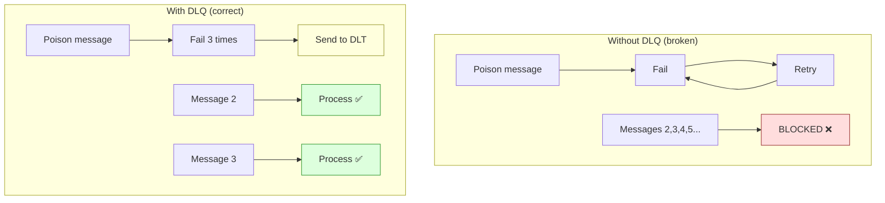

---

## Scenario 13: Data Pipeline with Kafka

```text
PROBLEM:
  "We need to build a real-time data pipeline: database changes from
  our PostgreSQL must be searchable in Elasticsearch within 5 seconds
  and also loaded into our data lake for analytics."

WHAT THEY'RE TESTING:
  - CDC (Change Data Capture)
  - Kafka Connect
  - Multi-consumer architecture

ANSWER:

  ARCHITECTURE:
  PostgreSQL → Debezium CDC → Kafka → Elasticsearch Connector
                                    → S3 Sink Connector (Data Lake)
```

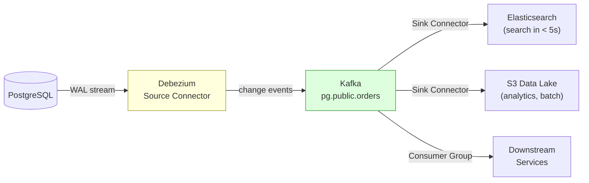

```text
  COMPONENTS:

  1. Debezium PostgreSQL Connector (Kafka Connect source):
     Tails PostgreSQL WAL (Write-Ahead Log).
     Each INSERT/UPDATE/DELETE → Kafka message.
     Topic per table: pg.public.orders, pg.public.products.
     Near-real-time (milliseconds).
     No application code changes.

  2. Elasticsearch Sink Connector:
     Reads from Kafka → writes to Elasticsearch index.
     Configurable batching and flush interval.
     5-second SLA achievable with flush.timeout.ms=3000.

  3. S3 Sink Connector:
     Reads from Kafka → writes Parquet files to S3.
     Partitioned by date (s3://bucket/orders/year=2024/month=01/).
     For batch analytics (Athena, Spark, Presto).

  4. Downstream service consumers:
     Independent consumer groups on the same topics.
     No impact on the pipeline.

  KEY CONFIGS:
    Debezium: slot.name=debezium, publication.name=dbz_pub
    ES Sink: flush.timeout.ms=3000, batch.size=200
    S3 Sink: flush.size=1000, rotate.interval.ms=60000

  MONITORING:
    - Debezium lag (WAL position vs connector position)
    - Kafka consumer lag for each sink connector
    - Elasticsearch indexing latency
    - End-to-end latency: DB change → searchable in ES
```

---

## Scenario 14: Migrating from RabbitMQ to Kafka

```text
PROBLEM:
  "Our system currently uses RabbitMQ for messaging. We're hitting
  throughput limits and need to migrate to Kafka. How would you
  approach this migration?"

WHAT THEY'RE TESTING:
  - Understanding of RabbitMQ vs Kafka differences
  - Migration strategy
  - Risk mitigation

ANSWER:

  KEY DIFFERENCES TO HANDLE:

  ┌─────────────────────┬──────────────────────┬───────────────────────┐
  │                     │ RabbitMQ             │ Kafka                 │
  ├─────────────────────┼──────────────────────┼───────────────────────┤
  │ Routing             │ Exchange + binding   │ Topic + key           │
  │ Ordering            │ Per-queue            │ Per-partition          │
  │ Acknowledgment      │ Per-message ack/nack │ Offset commit         │
  │ Message fate        │ Deleted on ack       │ Retained (retention)  │
  │ Consumer model      │ Push                 │ Pull (poll)           │
  │ Dead letter         │ Built-in DLX         │ DLT + error handler   │
  │ Replay              │ Not possible         │ Reset offsets          │
  └─────────────────────┴──────────────────────┴───────────────────────┘

  MIGRATION STRATEGY (Strangler Fig):

  Phase 1 — Dual Write:
    Producer writes to BOTH RabbitMQ and Kafka.
    Consumers still read from RabbitMQ.
    Verify Kafka messages are correct (shadow comparison).

  Phase 2 — Parallel Consume:
    New Kafka consumers run alongside RabbitMQ consumers.
    Compare results. Kafka consumers in read-only/shadow mode.

  Phase 3 — Switchover:
    Route consumers to Kafka. RabbitMQ consumers on standby.
    Monitor for issues. Quick rollback if needed.

  Phase 4 — Cleanup:
    Remove RabbitMQ producers and consumers.
    Decommission RabbitMQ cluster.

  RISKS:
    - Ordering differences (queue vs partition)
    - Consumer model change (push to pull)
    - Dead letter handling differences
    - Team learning curve

  TIMELINE: Expect 2-4 months for a phased migration.
```

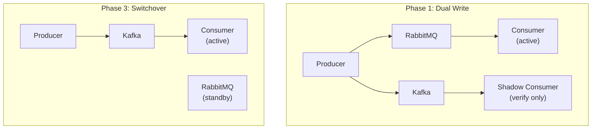

---

## Scenario 15: Kafka for Audit Logging

```text
PROBLEM:
  "We need an immutable audit log for regulatory compliance.
  Every user action must be logged and retained for 7 years.
  It must be tamper-proof and queryable."

WHAT THEY'RE TESTING:
  - Kafka as an immutable log
  - Long-term retention strategies
  - Compliance considerations

ANSWER:

  DESIGN:

  1. KAFKA AS THE AUDIT BUS:
     Every service publishes audit events to Kafka.
     Topic: audit.events (partitioned by userId or entityId).
     Key: entityId (for ordering per entity).

     Event format:
     {
       "auditId": "uuid",
       "action": "USER_LOGIN",
       "actor": "user-123",
       "target": "account-456",
       "timestamp": "2024-01-15T10:30:00Z",
       "ip": "192.168.1.1",
       "details": {...},
       "checksum": "sha256-of-payload"
     }

  2. SHORT-TERM STORAGE (Kafka):
     retention.ms = 2592000000  (30 days in Kafka)
     Queryable via Kafka Streams or ksqlDB.
     Real-time alerting on suspicious patterns.

  3. LONG-TERM STORAGE (Archive):
     Kafka → S3 Sink Connector → S3 (Parquet, partitioned by date)
     S3 lifecycle: Standard → IA → Glacier (cost optimization)
     Retained for 7+ years.
     Queryable via Athena, Presto, or Spark.

  4. TAMPER-PROOF:
     Kafka log is append-only (immutable by design).
     S3 with Object Lock (WORM — Write Once Read Many).
     Checksum in every event for integrity verification.
     No service has DELETE permissions on audit topics.

  5. QUERYABLE:
     Recent (< 30 days): query Kafka via ksqlDB
     Historical (> 30 days): query S3 via Athena
     Indexing: optional Elasticsearch for full-text search
```

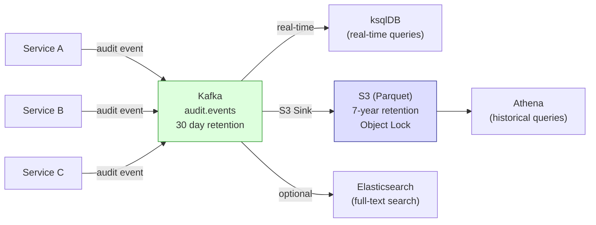
