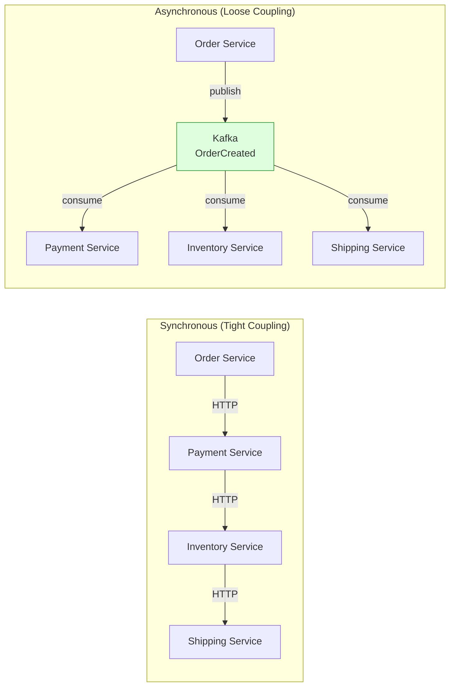
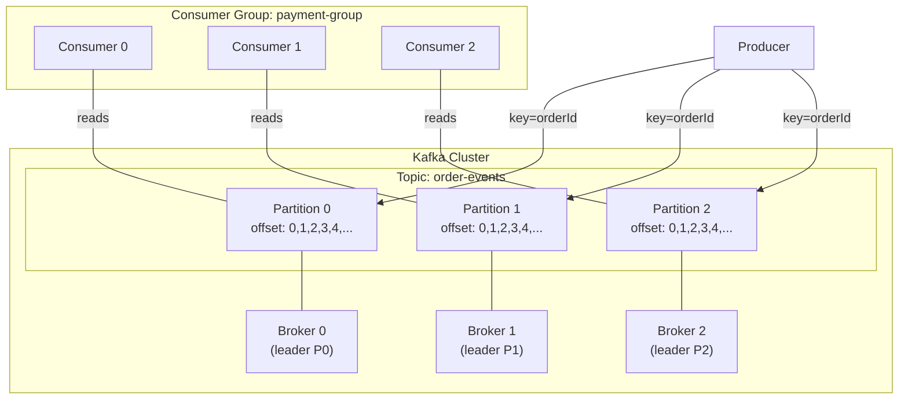
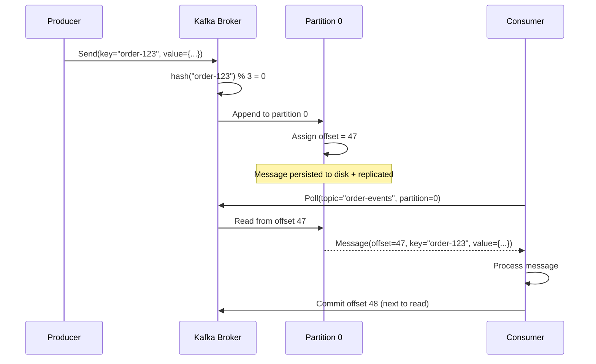
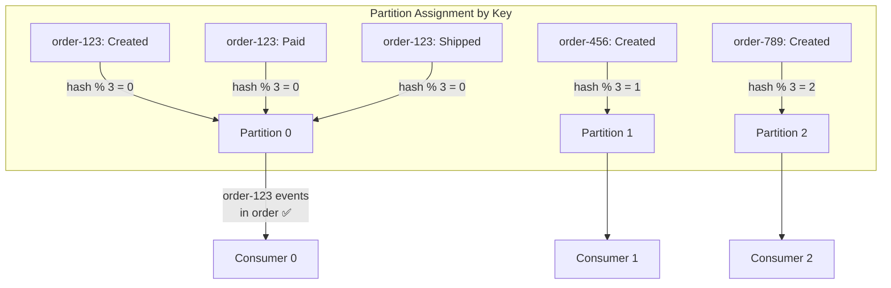
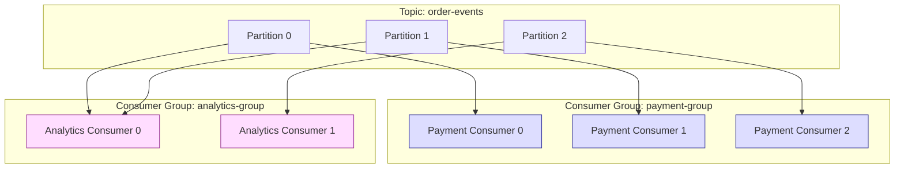
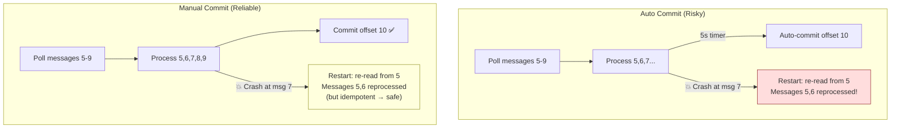
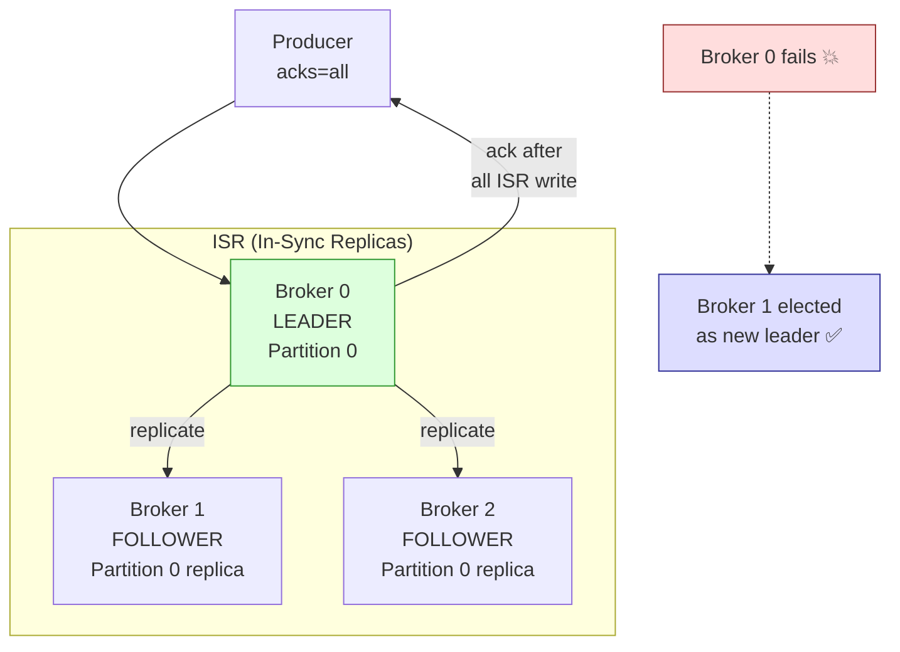
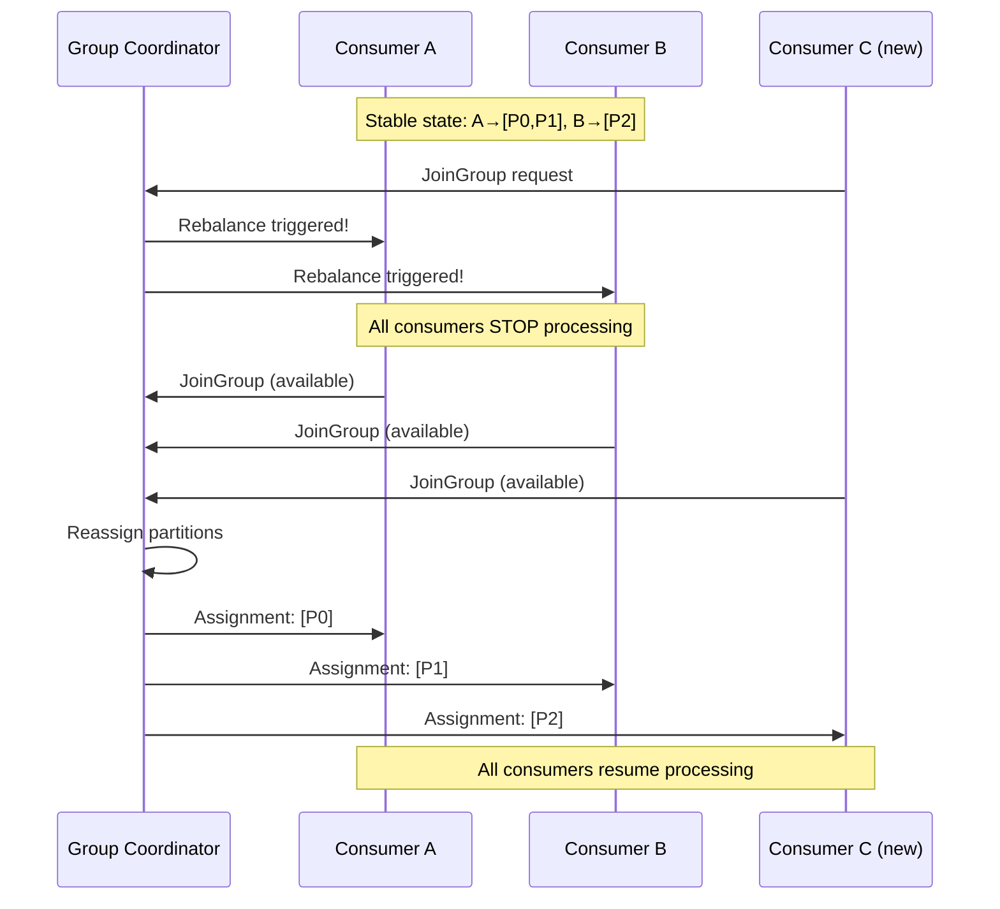
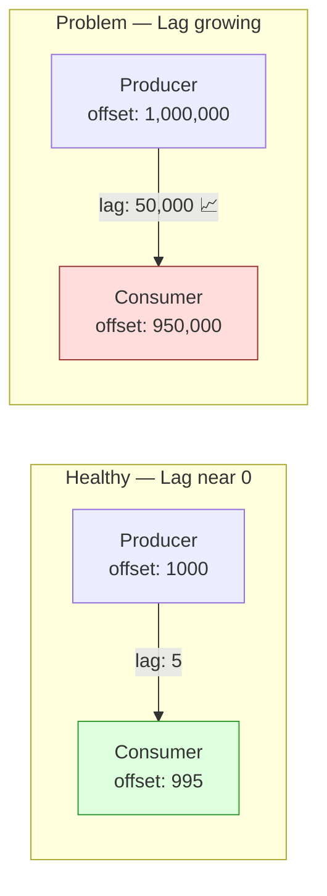

# Messaging — Apache Kafka Deep Dive

Producers, topics, partitions, consumer groups, offsets, ordering,
replication, rebalancing, consumer lag, and Spring Kafka integration.

---

## 1. Why Messaging

```text
Synchronous communication (REST calls between services) has problems:

  Order Service → Payment Service → Inventory Service → Shipping Service

  Problems:
    1. COUPLING: Order Service must know about Payment, Inventory, Shipping
    2. AVAILABILITY: If Payment Service is down, Order Service fails
    3. LATENCY: Total latency = sum of all service latencies
    4. SCALABILITY: All services must handle the same throughput

Asynchronous messaging solves this:

  Order Service → publishes "OrderCreated" event to Kafka
  Payment Service → consumes "OrderCreated" → processes payment
  Inventory Service → consumes "OrderCreated" → reserves stock
  Shipping Service → consumes "OrderCreated" → schedules shipment

  Benefits:
    ✅ DECOUPLING: Order Service doesn't know who consumes the event
    ✅ AVAILABILITY: Kafka buffers events if a consumer is temporarily down
    ✅ SCALABILITY: Each consumer scales independently
    ✅ RESILIENCE: If Payment is slow, Order Service is not affected
```



---

## 2. Kafka Architecture — The Full Picture

```text
Kafka is a distributed, fault-tolerant, high-throughput event
streaming platform. Think of it as a distributed commit log.

Key components:

  PRODUCER:
    Application that writes (publishes) messages to a topic.

  TOPIC:
    A named category/feed of messages. Like a database table.
    e.g., "order-events", "payment-events"

  PARTITION:
    A topic is split into partitions. Each partition is an ordered,
    immutable sequence of messages. Partitions enable parallelism.

  BROKER:
    A Kafka server. A Kafka cluster has multiple brokers.
    Each broker holds some partitions.

  CONSUMER:
    Application that reads messages from partitions.

  CONSUMER GROUP:
    A group of consumers that cooperatively consume a topic.
    Each partition is consumed by exactly ONE consumer in the group.

  OFFSET:
    A sequential ID for each message within a partition.
    Consumers track their position via offsets.
```



### Message Flow — End to End

```text
1. Producer sends message to topic "order-events"
   - Message has a KEY (e.g., orderId) and VALUE (event payload)
   - Key determines which partition the message goes to:
     partition = hash(key) % numPartitions

2. Kafka broker appends message to the partition's log
   - Message gets an OFFSET (sequential number within partition)
   - Message is replicated to follower brokers (for fault tolerance)

3. Consumer (in a consumer group) reads from assigned partitions
   - Each consumer in the group reads from different partitions
   - Consumer tracks its position via committed offsets
   - On restart, consumer resumes from the last committed offset
```



---

## 3. Partitions — Deep Dive

### Why Partitions Exist

```text
A single partition can only be read by ONE consumer in a group.
Without partitions, only one consumer can read a topic → no parallelism.

Partitions enable:
  1. PARALLELISM: Multiple consumers read different partitions concurrently
  2. ORDERING: Messages within a partition are strictly ordered
  3. SCALABILITY: More partitions = more consumers = more throughput

A partition is an APPEND-ONLY LOG on disk:

  Partition 0:
  ┌───┬───┬───┬───┬───┬───┬───┬───┐
  │ 0 │ 1 │ 2 │ 3 │ 4 │ 5 │ 6 │ 7 │  ← offsets
  └───┴───┴───┴───┴───┴───┴───┴───┘
                        ↑
                   consumer position
                   (committed offset = 5)
```

### Partition Key and Ordering

```text
Messages with the SAME KEY always go to the SAME partition.
This guarantees ordering for messages with the same key.

  key = "order-123" → hash → partition 0
  key = "order-456" → hash → partition 1
  key = "order-123" → hash → partition 0 (same partition!)

  All events for order-123 are in partition 0, in order:
    OrderCreated → PaymentReceived → OrderShipped → OrderDelivered

  This is CRITICAL for event processing:
    If events arrive out of order, you might ship before payment!

  Ordering guarantees:
    ✅ Within a partition: messages are strictly ordered
    ❌ Across partitions: NO ordering guarantee

  If key is NULL: messages are distributed round-robin across partitions
  (no ordering guarantee for any message).
```



### How Many Partitions?

```text
Rule of thumb:
  partitions ≥ max number of consumers you'll ever need

  If you expect to scale to 10 consumers: create at least 10 partitions.
  If you have 3 partitions and 5 consumers: 2 consumers sit idle.

  More partitions:
    ✅ More parallelism
    ❌ More file handles on brokers
    ❌ Longer leader election on failure
    ❌ More memory on producer (batching per partition)

  Typical production: 6–12 partitions per topic for most workloads.
  High-throughput: 30–100+ partitions.
```

---

## 4. Consumer Groups

```text
A consumer group is a set of consumers that COOPERATIVELY read a topic.
Each partition is assigned to exactly ONE consumer in the group.

  3 partitions, 3 consumers in group "payment-group":
    Consumer 0 → Partition 0
    Consumer 1 → Partition 1
    Consumer 2 → Partition 2
    (perfect 1:1 assignment)

  3 partitions, 2 consumers:
    Consumer 0 → Partition 0, Partition 1  (handles 2 partitions)
    Consumer 1 → Partition 2
    (consumer 0 does more work)

  3 partitions, 5 consumers:
    Consumer 0 → Partition 0
    Consumer 1 → Partition 1
    Consumer 2 → Partition 2
    Consumer 3 → IDLE (no partition to read)
    Consumer 4 → IDLE (no partition to read)
    (wasted consumers!)

MULTIPLE consumer groups can read the SAME topic independently:
  Topic "order-events" consumed by:
    - payment-group (for payment processing)
    - inventory-group (for stock management)
    - analytics-group (for reporting)

  Each group has its own offsets. They don't interfere.
  This is the pub-sub model in Kafka.
```



---

## 5. Offsets

```text
An offset is a unique, sequential ID for each message in a partition.

  Partition 0: [0, 1, 2, 3, 4, 5, 6, 7, 8, 9, ...]
                                  ↑
                          committed offset = 5
                          (consumer has processed 0-4)
                          (next poll returns from offset 5)

OFFSET COMMIT STRATEGIES:

  1. AUTO COMMIT (default):
     Consumer auto-commits offsets periodically (every 5 seconds).
     Risk: if consumer crashes between auto-commit intervals,
     messages may be reprocessed (at-least-once).

     enable.auto.commit = true
     auto.commit.interval.ms = 5000

  2. MANUAL COMMIT (recommended for reliable processing):
     Consumer commits offsets explicitly after processing.

     Synchronous commit:
       consumer.commitSync()   — blocks until committed

     Asynchronous commit:
       consumer.commitAsync()  — non-blocking, may fail silently

  3. MANUAL COMMIT PER MESSAGE:
     Commit after each message (most reliable, slowest).

  4. MANUAL COMMIT PER BATCH:
     Commit after processing a batch of messages (good balance).

WHAT HAPPENS ON CONSUMER RESTART:
  Consumer reads from the LAST COMMITTED offset.
  Any messages after the committed offset are re-delivered.
  This is why consumers must be IDEMPOTENT.
```



---

## 6. Replication

```text
Kafka replicates each partition across multiple brokers for
fault tolerance.

  replication.factor = 3

  Partition 0:
    Broker 0 → LEADER (handles reads/writes)
    Broker 1 → FOLLOWER (replicates from leader)
    Broker 2 → FOLLOWER (replicates from leader)

  ISR (In-Sync Replicas):
    Followers that are caught up with the leader.
    Only ISR members can become the new leader if the current leader fails.

  If Broker 0 dies:
    Broker 1 or Broker 2 (whichever is in ISR) becomes the new leader.
    No data loss (replicas have the data).
    Producers/consumers switch to the new leader automatically.

  Producer acknowledgment (acks):
    acks=0   : Don't wait for any acknowledgment (fastest, unsafe)
    acks=1   : Wait for leader to write (fast, risk: leader crash before replication)
    acks=all : Wait for ALL ISR replicas to write (slowest, safest)
```



---

## 7. Rebalancing

```text
Rebalancing happens when the consumer group membership CHANGES:

  Triggers:
    - New consumer joins the group
    - Existing consumer leaves (shutdown, crash)
    - Consumer fails to send heartbeat (network issue)
    - New partitions added to the topic

  During rebalancing:
    ALL consumers STOP processing temporarily.
    Partitions are reassigned among the remaining consumers.
    Each consumer gets a new set of partitions.
    Consumers resume from committed offsets for their new partitions.

  Example:
    Before: Consumer A → [P0, P1], Consumer B → [P2]
    Consumer B crashes
    Rebalance: Consumer A → [P0, P1, P2]
    Consumer A now handles all three partitions.

REBALANCE PROBLEMS:
  1. Stop-the-world: ALL consumers pause during rebalance
  2. If processing takes too long (exceeds max.poll.interval.ms),
     Kafka thinks the consumer is dead → triggers rebalance → loop!
  3. Duplicate processing: messages processed but not committed
     before rebalance are reprocessed by the new consumer.

STRATEGIES:
  Eager rebalance: Stop all consumers, reassign, restart (default legacy)
  Cooperative rebalance: Only revoke/assign changed partitions (preferred)
```



---

## 8. Consumer Lag

```text
Consumer lag = Latest offset (produced) - Current offset (consumed)

  Partition 0:
    Latest offset (producer is at): 1,000,000
    Consumer committed offset:       999,500
    LAG = 500 messages

  Lag tells you how far BEHIND the consumer is.
  If lag is growing → consumer is slower than producer → problem!

CAUSES OF GROWING LAG:
  1. Consumer processing is too slow (heavy DB queries, API calls)
  2. Not enough consumers (add more, up to partition count)
  3. Consumer stuck (deadlock, infinite loop, GC pause)
  4. Frequent rebalancing (consumers keep stopping/starting)
  5. Downstream dependency slow (consumer waits on slow DB/API)

MONITORING:
  Use kafka-consumer-groups.sh --describe
  Or Prometheus metrics: kafka_consumergroup_lag

  Healthy: lag near zero, stable
  Warning: lag growing steadily
  Critical: lag growing exponentially, consumer may never catch up
```



---

## 9. Spring Kafka Integration

### Configuration

```yaml
spring:
  kafka:
    bootstrap-servers: localhost:9092
    producer:
      key-serializer: org.apache.kafka.common.serialization.StringSerializer
      value-serializer: org.springframework.kafka.support.serializer.JsonSerializer
      acks: all
      retries: 3
    consumer:
      group-id: order-service-group
      auto-offset-reset: earliest
      key-deserializer: org.apache.kafka.common.serialization.StringDeserializer
      value-deserializer: org.springframework.kafka.support.serializer.JsonDeserializer
      enable-auto-commit: false
      properties:
        spring.json.trusted.packages: "*"
        max.poll.records: 100
        max.poll.interval.ms: 300000
```

### Producer

```java
@Service
@Slf4j
public class OrderEventProducer {

    private final KafkaTemplate<String, OrderEvent> kafkaTemplate;

    public OrderEventProducer(KafkaTemplate<String, OrderEvent> kafkaTemplate) {
        this.kafkaTemplate = kafkaTemplate;
    }

    public void publishOrderCreated(Order order) {
        OrderEvent event = new OrderEvent(
            order.getId().toString(),
            "ORDER_CREATED",
            order
        );

        // key = orderId → all events for same order go to same partition
        kafkaTemplate.send("order-events", order.getId().toString(), event)
            .whenComplete((result, ex) -> {
                if (ex != null) {
                    log.error("Failed to publish event for order {}",
                        order.getId(), ex);
                } else {
                    log.info("Published ORDER_CREATED for order {} to partition {} offset {}",
                        order.getId(),
                        result.getRecordMetadata().partition(),
                        result.getRecordMetadata().offset());
                }
            });
    }
}
```

### Consumer

```java
@Service
@Slf4j
public class OrderEventConsumer {

    private final PaymentService paymentService;

    @KafkaListener(
        topics = "order-events",
        groupId = "payment-service-group",
        containerFactory = "kafkaListenerContainerFactory"
    )
    public void handleOrderEvent(
            @Payload OrderEvent event,
            @Header(KafkaHeaders.RECEIVED_PARTITION) int partition,
            @Header(KafkaHeaders.OFFSET) long offset,
            Acknowledgment acknowledgment) {

        log.info("Received event: {} from partition {} offset {}",
            event.getType(), partition, offset);

        try {
            switch (event.getType()) {
                case "ORDER_CREATED" -> paymentService.processPayment(event);
                case "ORDER_CANCELLED" -> paymentService.refundPayment(event);
                default -> log.warn("Unknown event type: {}", event.getType());
            }

            // Manual acknowledge after successful processing
            acknowledgment.acknowledge();

        } catch (Exception e) {
            log.error("Failed to process event: {}", event, e);
            // Don't acknowledge → message will be redelivered
            throw e;
        }
    }
}
```

### Consumer Configuration for Manual Ack

```java
@Configuration
public class KafkaConsumerConfig {

    @Bean
    public ConcurrentKafkaListenerContainerFactory<String, OrderEvent>
            kafkaListenerContainerFactory(
                ConsumerFactory<String, OrderEvent> consumerFactory) {

        ConcurrentKafkaListenerContainerFactory<String, OrderEvent> factory =
            new ConcurrentKafkaListenerContainerFactory<>();

        factory.setConsumerFactory(consumerFactory);

        // Manual acknowledgment
        factory.getContainerProperties().setAckMode(
            ContainerProperties.AckMode.MANUAL_IMMEDIATE
        );

        // Concurrent consumers (each gets partitions)
        factory.setConcurrency(3);

        return factory;
    }
}
```

---

## 10. Key Kafka Configuration Parameters

```text
PRODUCER:
  acks=all              Safest: wait for all replicas
  retries=3             Retry on transient failures
  enable.idempotence    Prevent duplicate messages on retry
  linger.ms=5           Wait 5ms to batch messages (throughput vs latency)
  batch.size=16384      Max batch size in bytes

CONSUMER:
  group.id              Consumer group name
  auto.offset.reset     What to do when no committed offset exists:
                          earliest: read from beginning
                          latest: read only new messages
  enable.auto.commit    false for reliable processing
  max.poll.records      Max messages per poll (default 500)
  max.poll.interval.ms  Max time between polls before considered dead (5min)
  session.timeout.ms    Heartbeat timeout (10s default)
  fetch.min.bytes       Min data to fetch (batching for throughput)

TOPIC:
  partitions            Number of partitions (set at creation)
  replication.factor    Number of replicas (typically 3)
  retention.ms          How long to keep messages (default 7 days)
  retention.bytes       Max size per partition
  cleanup.policy        delete (default) or compact
```

---

## 11. Interview Questions

### Q1: Explain Kafka's architecture.

```text
Kafka is a distributed event streaming platform:

  - CLUSTER: Multiple brokers (servers) forming a cluster
  - TOPIC: Named stream of messages (like a DB table)
  - PARTITION: Topic split into partitions for parallelism
  - BROKER: Server that stores partitions
  - PRODUCER: Writes messages to topics
  - CONSUMER: Reads messages from topics
  - CONSUMER GROUP: Set of consumers sharing the work
  - OFFSET: Sequential message ID within a partition
  - ZooKeeper/KRaft: Cluster metadata management

Messages are persisted to disk, replicated across brokers,
and retained for a configurable duration (default 7 days).
```

### Q2: How does Kafka guarantee message ordering?

```text
Kafka guarantees ordering ONLY within a single partition.
No ordering guarantee across partitions.

To ensure ordering for related messages (e.g., all events for one order):
  - Use the same partition key (e.g., orderId)
  - hash(orderId) % numPartitions → always the same partition
  - All events for that order are appended sequentially

If you need global ordering across ALL messages → use 1 partition.
But 1 partition = 1 consumer = no parallelism.
This is the ordering vs throughput tradeoff.
```

### Q3: What are consumer groups and why do they matter?

```text
A consumer group is a set of consumers that share the work of
consuming a topic. Each partition is assigned to exactly one
consumer in the group.

Why they matter:
  - SCALABILITY: Add consumers to increase throughput (up to partition count)
  - FAULT TOLERANCE: If a consumer crashes, its partitions are reassigned
  - INDEPENDENT TRACKING: Each group has its own offsets
  - MULTIPLE SUBSCRIBERS: Multiple groups can read the same topic independently

Key rule: consumers in a group ≤ partitions.
Extra consumers sit idle with nothing to read.
```

### Q4: What is consumer rebalancing and what problems can it cause?

```text
Rebalancing redistributes partitions when group membership changes
(consumer joins, leaves, or is considered dead).

Problems:
  1. PAUSE: All consumers stop processing during rebalance
  2. DUPLICATE PROCESSING: Messages processed but not committed are
     reprocessed by the new consumer
  3. REBALANCE STORM: If processing is slow (exceeds max.poll.interval.ms),
     consumer is kicked → rebalance → assigns more partitions to others
     → they become slow → more kicks → cascade

Mitigations:
  - Use cooperative rebalancing (only reassign changed partitions)
  - Tune max.poll.interval.ms and max.poll.records
  - Make consumers idempotent (handle duplicate processing)
  - Use static group membership (group.instance.id)
```

### Q5: What is consumer lag and how do you handle it?

```text
Consumer lag = distance between latest produced offset and the
consumer's committed offset. It tells you how far behind the
consumer is from real-time.

If lag is growing:
  1. Scale consumers (add more, up to partition count)
  2. Increase max.poll.records for batch efficiency
  3. Optimize processing (faster DB queries, caching)
  4. Add more partitions (and consumers)
  5. Check for slow downstream dependencies
  6. Check for rebalancing storms

Monitor lag continuously with tools like Burrow, Prometheus,
or Confluent Control Center.
```

### Q6: Explain acks=0, acks=1, and acks=all.

```text
acks=0:
  Producer doesn't wait for any acknowledgment.
  Fastest. Messages can be LOST (broker crash before writing).

acks=1:
  Producer waits for leader broker to write.
  Fast. Messages can be LOST if leader crashes before replication.

acks=all (or acks=-1):
  Producer waits for ALL in-sync replicas to write.
  Slowest. No data loss as long as at least one ISR is alive.

For most production systems: acks=all + min.insync.replicas=2.
This ensures at least 2 replicas have the message before acknowledging.
```

### Q7: How does Kafka achieve high throughput?

```text
1. Sequential disk I/O: Kafka appends to log files sequentially
   (sequential disk I/O is fast — close to memory speed)
2. Zero-copy: Kernel sends data directly from disk to network socket
   (no copying through user space)
3. Batching: Producer batches messages, consumer polls batches
4. Compression: Messages compressed in batches (gzip, snappy, lz4)
5. Partitioning: Parallel reads/writes across partitions
6. Page cache: OS page cache acts as a transparent read cache
7. No random access: No indexes, no seeks — pure sequential append

Result: single broker can handle 100,000s messages/second.
```

### Q8: What is auto.offset.reset and when does it matter?

```text
auto.offset.reset controls what happens when a consumer has NO
committed offset for a partition (first time reading, or offset expired).

  earliest: Start reading from the BEGINNING of the partition
            (process all historical messages)

  latest: Start reading from the END (only new messages)
          (skip all existing messages)

  none: Throw an exception (fail if no committed offset)

When it matters:
  - New consumer group joining for the first time
  - Consumer offset expired (older than retention period)
  - Reset consumer offsets manually

Typical: "earliest" for initial load, "latest" for real-time only.
```

### Q9: What is log compaction?

```text
Normal retention: messages deleted after retention period (7 days).
Log compaction: Kafka keeps only the LATEST message for each key.

  Before compaction:
    key=A value=1, key=B value=2, key=A value=3, key=B value=4

  After compaction:
    key=A value=3, key=B value=4  (latest values only)

Use cases:
  - Maintaining current state (latest user profile, config)
  - Changelog streams (CDC)
  - Reducing storage for high-cardinality keys

  cleanup.policy = compact
```

### Q10: How would you handle Kafka consumer processing that takes too long?

```text
If processing exceeds max.poll.interval.ms (default 5 min), Kafka
considers the consumer dead → triggers rebalance → partitions reassigned.

Solutions:
  1. Reduce max.poll.records (process fewer messages per poll)
  2. Increase max.poll.interval.ms (allow more time)
  3. Offload heavy processing to a thread pool (process async,
     commit offset after async completion)
  4. Optimize processing logic (batch DB operations, caching)
  5. Move heavy work to a separate service via internal queue
  6. Use pause/resume: pause partition while processing, resume after

Best: reduce max.poll.records + optimize processing.
Avoid increasing max.poll.interval.ms too much (delays failure detection).
```
