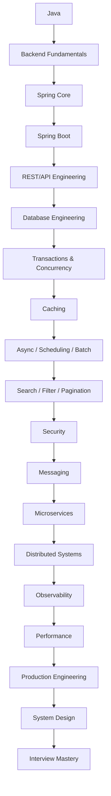
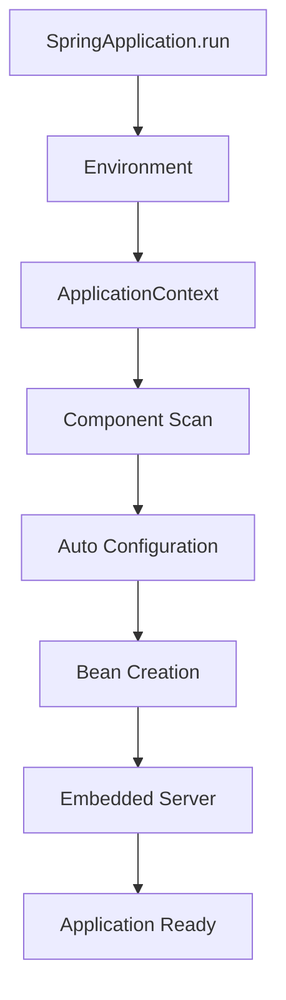

Yes — this is an important correction. The earlier roadmap was heavily **Spring-focused**, but for SDE2/SDE3 backend interviews you need to master the **backend engineering concepts that Spring Boot is used to implement**.

So the target should not be:

> “Master Spring Boot.”

It should be:

> **Master production backend engineering with Spring Boot as the implementation framework.**

That means pagination, filtering, searching, sorting, batch processing, scheduling, distributed locks, idempotency, transactions, concurrency, caching, messaging, API design, security, observability, performance, microservices, and system-design patterns all need to be part of the roadmap.

Below is the revised **complete roadmap**.

---

# Spring Boot + Backend Engineering Mastery Roadmap

## SDE2 / Senior Backend Interview Preparation

Think of this as a progression:



---

# PHASE 1 — Java Foundations for Backend Engineering

Since you already know Java, do this as a **deep revision**, not beginner learning.

## 1. Java Object Model

Master:

* Classes
* Interfaces
* Abstract classes
* Composition
* Inheritance
* Polymorphism
* Encapsulation
* Immutability
* Records
* Enums
* Generics
* Annotations
* Reflection

Understand why frameworks like Spring rely heavily on these concepts.

---

## 2. Collections

Deep dive:

* ArrayList
* LinkedList
* HashMap
* HashSet
* TreeMap
* TreeSet
* PriorityQueue
* Deque

Especially understand:

```text
HashMap
 ↓
hash()
 ↓
bucket
 ↓
collision
 ↓
equals()
```

and:

* resize
* load factor
* collision handling
* complexity

---

# PHASE 2 — Java Concurrency

This is mandatory for backend interviews.

Master:

* Threads
* Thread lifecycle
* Runnable
* Callable
* Future
* ExecutorService
* Thread pools
* CompletableFuture
* synchronized
* volatile
* Atomic classes
* Locks
* ReentrantLock
* ReadWriteLock
* Semaphore
* CountDownLatch
* CyclicBarrier

Understand:

```text
Request
  ↓
Tomcat thread
  ↓
Service
  ↓
DB call
```

and why blocking calls consume server threads.

Then master:

* race conditions
* deadlocks
* starvation
* contention
* thread safety
* producer/consumer

---

# PHASE 3 — JVM Fundamentals

SDE2 interviews can go surprisingly deep here.

Master:

* JVM architecture
* heap
* stack
* metaspace
* class loading
* JIT
* garbage collection
* young generation
* old generation
* GC pauses
* memory leaks
* OutOfMemoryError
* CPU profiling
* thread dumps
* heap dumps

Understand how JVM problems become Spring application problems.

---

# PHASE 4 — Backend Fundamentals

This is the major addition you were asking for.

Before Spring, master these backend concepts.

---

## 4.1 HTTP Deep Dive

Understand:

* HTTP request/response
* headers
* cookies
* body
* query parameters
* path parameters
* content types
* status codes
* caching headers
* ETags
* connection keep-alive

Then:

* HTTP/1.1
* HTTP/2
* HTTP/3

Understand request lifecycle.

---

# PHASE 5 — REST API Design

Master API design independently of Spring.

Topics:

* Resource modeling
* URI design
* HTTP methods
* Idempotency
* Status codes
* Error handling
* API versioning
* Partial updates
* Bulk APIs
* Pagination
* Filtering
* Sorting
* Searching

Example:

```http
GET /products
```

becomes:

```http
GET /products?page=2&size=20
```

or:

```http
GET /products?category=phone&minPrice=500&sort=price,desc
```

---

# PHASE 6 — PAGINATION — Deep Dive

This absolutely belongs in your roadmap.

## 6.1 Offset Pagination

```text
page = 10
size = 20

OFFSET = 180
LIMIT = 20
```

Understand:

```sql
LIMIT 20 OFFSET 180
```

Learn:

* advantages
* disadvantages
* deep-page performance
* consistency problems

---

## 6.2 Page-number Pagination

```text
?page=1&size=20
```

Understand how it maps to offset pagination.

---

## 6.3 Cursor Pagination

Example:

```text
GET /orders?limit=20&cursor=eyJpZCI6...
```

Understand:

```text
Database
   ↓
last seen item
   ↓
cursor
   ↓
next request
```

Advantages:

* efficient large datasets
* stable traversal
* good for feeds

---

## 6.4 Keyset Pagination

Example:

```sql
WHERE id > 5000
ORDER BY id
LIMIT 20
```

Master:

* cursor vs keyset
* indexed columns
* compound keyset pagination
* `(created_at, id)` technique

---

## 6.5 Seek Pagination

Understand its relationship to keyset/cursor approaches.

---

## 6.6 Pagination with Spring Data

Master:

* `Page`
* `Slice`
* `Pageable`
* `PageRequest`
* `Sort`

Understand:

```text
Page
 ↓
content
totalElements
totalPages
```

versus:

```text
Slice
 ↓
content
hasNext
```

Know why `Slice` can be preferable when counting the entire dataset is expensive.

---

# PHASE 7 — SEARCH

A production backend often needs search functionality.

Master the difference between:

```text
Filtering
Sorting
Searching
Full-text search
```

---

## 7.1 Database Search

Learn:

```sql
LIKE
ILIKE
```

Then understand why:

```sql
LIKE '%iphone%'
```

can become expensive.

---

## 7.2 Full Text Search

Master the concept of:

* inverted index
* tokenization
* analyzers
* ranking
* relevance

Then learn:

* Elasticsearch/OpenSearch
* Spring Data Elasticsearch

Understand:

```text
Client
 ↓
Spring Boot
 ↓
Search Service
 ↓
Elasticsearch
```

and when search should remain in PostgreSQL instead.

---

# PHASE 8 — FILTERING

Very important backend topic.

Example:

```http
GET /products?
category=electronics
&brand=apple
&minPrice=500
&maxPrice=2000
&available=true
```

Master:

* static filtering
* dynamic filtering
* multi-filter queries
* optional parameters
* range filtering
* enum filtering
* date filtering

With Spring:

* Specifications
* Criteria API
* QueryDSL
* dynamic query construction

Understand why blindly concatenating SQL is dangerous.

---

# PHASE 9 — SORTING

Master:

```http
?sort=price,desc
```

and:

```http
?sort=createdAt,desc&sort=name,asc
```

Understand:

* single-column sorting
* multi-column sorting
* database indexes
* stable sorting
* sorting + pagination

Very important:

> Why can `ORDER BY` become expensive?

> Why does an index matter?

---

# PHASE 10 — Dynamic Querying

Master:

* JPA Specifications
* Criteria API
* QueryDSL
* dynamic JPQL
* native SQL

Understand how a real API translates:

```text
Search
+
Filter
+
Sort
+
Pagination
```

into an optimized database query.

---

# PHASE 11 — DTOs and API Contracts

Master:

* Entity vs DTO
* Request DTO
* Response DTO
* Projection
* Interface projection
* Record DTOs
* Mapping strategies

Understand why entities should generally not be exposed directly through REST APIs.

---

# PHASE 12 — Spring Core

Now go into Spring deeply.

Master:

* IoC
* DI
* ApplicationContext
* BeanFactory
* Bean lifecycle
* Bean scopes
* BeanPostProcessor
* dependency injection
* constructor injection
* `@Primary`
* `@Qualifier`
* conditional beans

Understand the entire bean lifecycle.

---

# PHASE 13 — Spring Boot Internals

Master:



Deep dive:

* `@SpringBootApplication`
* auto configuration
* conditional configuration
* starters
* application startup

---

# PHASE 14 — Configuration Management

Master:

* properties
* YAML
* profiles
* environment variables
* external configuration
* `@Value`
* `@ConfigurationProperties`
* secrets
* config server

Understand configuration precedence.

---

# PHASE 15 — Spring MVC

Deep dive:

```text
Request
 ↓
Servlet Container
 ↓
DispatcherServlet
 ↓
HandlerMapping
 ↓
Controller
 ↓
Service
 ↓
Repository
```

Master:

* DispatcherServlet
* filters
* interceptors
* controllers
* argument resolvers
* message converters
* Jackson
* serialization/deserialization

---

# PHASE 16 — Exception Handling & Validation

Master:

* `@ControllerAdvice`
* `@ExceptionHandler`
* custom exceptions
* error response standards
* Bean Validation
* `@Valid`
* `@Validated`
* custom validators

Know the difference between:

```text
Input validation
Business validation
Database constraint
```

---

# PHASE 17 — AOP & Proxies

Deep dive:

* AOP
* proxy
* join point
* pointcut
* advice
* JDK dynamic proxy
* CGLIB
* interceptors

This is essential for understanding:

```text
@Transactional
@Async
@Cacheable
@PreAuthorize
```

---

# PHASE 18 — DATABASE FUNDAMENTALS

Before mastering JPA, understand the DB.

Master:

* relational modeling
* primary key
* foreign key
* constraints
* normalization
* denormalization
* indexes
* composite indexes
* covering indexes
* query plans
* joins
* locking

Understand:

```text
Application
 ↓
Connection Pool
 ↓
Database
 ↓
Query Planner
 ↓
Storage
```

---

# PHASE 19 — JPA / Hibernate

Master:

* Entity
* EntityManager
* Persistence Context
* Session
* Entity lifecycle
* Dirty checking
* flush
* clear
* detach
* merge

Entity states:

```text
Transient
 ↓
Persistent
 ↓
Detached
 ↓
Removed
```

---

# PHASE 20 — Hibernate Performance

Deep dive:

* Lazy loading
* Eager loading
* proxies
* N+1 problem
* fetch join
* entity graph
* batch fetching
* first-level cache
* second-level cache

You should be able to identify N+1 from logs and fix it.

### Practical: LazyInitializationException (FlowForge — Step 4)

One of the most common Hibernate errors. Hit this while building the FlowForge CRUD endpoints.

**What happened:**

`Workflow` has a `@OneToMany` lazy `steps` collection. The service method (`findById`) runs inside a `@Transactional` boundary, loads the `Workflow`, and returns it. The controller then calls `workflowMapper.toDetail(workflow)` which accesses `workflow.getSteps()` — but by this point the Hibernate session is already closed.

```text
Controller.getById(id)
  │
  ├─► workflowService.findById(id)     ← Transaction OPENS
  │     └─ repo.findById(id)           ← Loads Workflow (NOT steps)
  │                                     ← Transaction CLOSES (session gone)
  │
  └─► workflowMapper.toDetail(workflow) ← Runs OUTSIDE transaction
        └─ workflow.getSteps()          ← 💥 LazyInitializationException
```

The returned entity is **detached** — no longer managed by Hibernate. Accessing any uninitialized lazy proxy on a detached entity throws this exception.

**Root cause:** Transaction boundary ends at the service method return. Lazy collection accessed after session closes.

**Fix:** Use `JOIN FETCH` to eagerly load the collection within the same query:

```java
// Repository
@Query("SELECT w FROM Workflow w LEFT JOIN FETCH w.steps WHERE w.id = :id")
Optional<Workflow> findByIdWithSteps(UUID id);
```

This forces Hibernate to load steps in one SQL query. The returned `steps` is a fully initialized `ArrayList`, not a lazy proxy — no session needed after that.

**Key rules:**
- If you return an entity from a `@Transactional` method and access lazy collections outside that method → exception
- `open-in-view: false` (which we set) means no session leaks into the controller — this is correct but means you must be explicit about fetching
- `open-in-view: true` (Spring default) would silently keep the session open in the view layer — hides the problem but causes N+1 queries and long-held DB connections
- Prefer `JOIN FETCH` or `@EntityGraph` over `FetchType.EAGER` — eager on the mapping loads the collection for *every* query, even when you don't need it

---

# PHASE 21 — TRANSACTIONS — Very Deep

This should be one of the biggest sections in your roadmap.

Master transaction concepts:

### ACID

* Atomicity
* Consistency
* Isolation
* Durability

### Isolation

Understand:

* Read Uncommitted
* Read Committed
* Repeatable Read
* Serializable

And:

```text
Dirty Read
Non-repeatable Read
Phantom Read
```

---

## Spring Transactions

Deep dive:

```java
@Transactional
```

Understand:

```text
Controller
 ↓
Proxy
 ↓
Transaction Interceptor
 ↓
Service
 ↓
Repository
 ↓
DB
 ↓
Commit/Rollback
```

Master:

### Propagation

* REQUIRED
* REQUIRES_NEW
* NESTED
* SUPPORTS
* NOT_SUPPORTED
* MANDATORY
* NEVER

### Rollback

Understand:

* checked exceptions
* unchecked exceptions
* `rollbackFor`
* transaction boundaries

### Transaction problems

Master:

* long-running transactions
* transaction timeout
* deadlocks
* lost updates
* optimistic locking
* pessimistic locking

---

# PHASE 22 — Concurrency Control

Master:

### Optimistic locking

```text
version = 5
      ↓
update
      ↓
version = 6
```

Using:

```java
@Version
```

### Pessimistic locking

Understand:

```sql
SELECT ... FOR UPDATE
```

Know when each should be used.

---

# PHASE 23 — Database Connection Pooling

Master HikariCP.

Understand:

```text
200 HTTP requests
        ↓
20 DB connections
        ↓
waiting queue
```

Topics:

* pool size
* connection timeout
* idle timeout
* max lifetime
* connection leaks

Understand how improper pool configuration can destroy application performance.

---

# PHASE 24 — Caching

Master:

* cache-aside
* write-through
* write-behind
* read-through
* TTL
* eviction
* cache invalidation

Spring:

* `@Cacheable`
* `@CachePut`
* `@CacheEvict`

Redis:

* strings
* hashes
* sets
* sorted sets
* TTL

Advanced:

* cache stampede
* cache penetration
* cache avalanche
* hot keys

---

# PHASE 25 — Distributed Locking

This is one of the concepts you explicitly mentioned.

Understand why this:

```java
if (!processed) {
    process();
}
```

is unsafe across multiple instances.

Then learn:

```text
Instance A
       \
        Redis Lock
       /
Instance B
```

Master:

* distributed locks
* Redis-based locks
* Redisson
* lease/TTL
* lock expiry
* fencing tokens
* deadlock risks

Understand when a distributed lock is appropriate and when database constraints/idempotency are better.

---

# PHASE 26 — SCHEDULING

Very important production backend topic.

Spring:

```java
@Scheduled
```

Master:

* fixed rate
* fixed delay
* cron
* initial delay

Understand:

```text
Application Instance 1 → job runs
Application Instance 2 → job runs
Application Instance 3 → job runs
```

Why can this be a problem?

---

# PHASE 27 — DISTRIBUTED SCHEDULING

Then learn:

### ShedLock

Understand:

```text
Instance A ──┐
             │
Instance B ──┼──> Shared Lock
             │
Instance C ──┘
```

Master:

* ShedLock
* lockAtMostFor
* lockAtLeastFor
* database-backed locks
* Redis-backed locks

Understand:

> ShedLock prevents concurrent execution; it does not magically make distributed scheduling fault tolerant.

Also understand job ownership and failure scenarios.

---

# PHASE 28 — Job Processing

Master:

* scheduled jobs
* background jobs
* async jobs
* retries
* batch processing
* idempotent jobs
* job state
* job checkpointing

Then Spring Batch:

* Job
* Step
* ItemReader
* ItemProcessor
* ItemWriter
* chunk processing
* skip
* retry
* restartability

---

# PHASE 29 — Async Processing

Master:

```java
@Async
```

Understand:

* executor configuration
* thread pools
* queue size
* rejection policy
* context propagation
* exception handling

Understand when **not** to use `@Async`.

---

# PHASE 30 — Messaging

Master Kafka deeply.

```text
Producer
 ↓
Topic
 ↓
Partition
 ↓
Consumer Group
 ↓
Consumer
```

Understand:

* offsets
* partitions
* ordering
* replication
* consumer groups
* rebalancing
* consumer lag

---

# PHASE 31 — Reliable Messaging

Master:

* at-most-once
* at-least-once
* exactly-once
* duplicate messages
* idempotent consumer
* retry
* DLQ
* poison messages
* ordering

Then:

### Transactional Outbox

```text
DB Transaction
 ├── Business Data
 └── Outbox Event
          ↓
      Publisher
          ↓
        Kafka
```

This is an extremely valuable SDE2 design pattern.

---

# PHASE 32 — Spring Security

Master:

```text
Request
 ↓
Security Filter Chain
 ↓
Authentication
 ↓
Authorization
 ↓
Controller
```

Deep dive:

* SecurityFilterChain
* AuthenticationManager
* SecurityContext
* UserDetailsService
* PasswordEncoder
* roles
* authorities

Then:

* JWT
* OAuth2
* OIDC
* SSO
* refresh tokens
* access tokens
* resource server

---

# PHASE 33 — API Security

Master:

* CORS
* CSRF
* HTTPS
* TLS
* rate limiting
* input validation
* SQL injection
* SSRF
* XSS
* secure headers
* secret management

---

# PHASE 34 — Rate Limiting

Important distributed backend topic.

Master:

* fixed window
* sliding window
* token bucket
* leaky bucket
* distributed rate limiting

Understand:

```text
Clients
   ↓
API Gateway
   ↓
Rate Limiter
   ↓
Spring Service
```

And Redis-based distributed rate limiting.

---

# PHASE 35 — Microservices

Now connect everything.

Master:

* service boundaries
* database-per-service
* synchronous communication
* asynchronous communication
* API Gateway
* service discovery
* load balancing
* configuration management

---

# PHASE 36 — Spring Cloud

Master:

* Spring Cloud Gateway
* OpenFeign
* service discovery
* load balancing
* Config Server
* Resilience4j

Understand the complete request path.

---

# PHASE 37 — Resilience Patterns

Deep dive:

### Timeout

### Retry

### Circuit Breaker

### Bulkhead

### Rate Limiter

### Fallback

Understand their interaction.

For example:

```text
Client
 ↓
Timeout
 ↓
Retry
 ↓
Circuit Breaker
 ↓
Service
```

Know when retrying can actually make a system worse.

---

# PHASE 38 — Distributed Transactions

Master:

### 2PC

### Saga

### Choreography

### Orchestration

### Compensation

Example:

```text
Order
 ↓
Payment
 ↓
Inventory
 ↓
Shipping
```

What happens when step 3 fails?

---

# PHASE 39 — Event-Driven Architecture

Master:

* domain events
* integration events
* event buses
* eventual consistency
* CQRS
* event sourcing
* outbox
* CDC

Understand when event-driven architecture is appropriate.

---

# PHASE 40 — API Reliability Patterns

Master:

### Idempotency

Example:

```http
POST /payments
Idempotency-Key: abc123
```

Understand:

* duplicate requests
* duplicate messages
* retry-safe APIs

Also:

* request deduplication
* exactly-once illusion
* idempotency table
* idempotency keys

---

# PHASE 41 — Observability

Master:

## Logging

* SLF4J
* Logback
* structured logging
* correlation IDs

## Metrics

* Micrometer
* Prometheus
* JVM metrics
* HTTP metrics
* business metrics

## Tracing

* OpenTelemetry
* traces
* spans
* distributed tracing
* context propagation

Understand:

```text
Request
 ↓
traceId
 ↓
Service A
 ↓
Service B
 ↓
Service C
```

---

# PHASE 42 — Spring Boot Actuator

Master:

* health
* info
* metrics
* beans
* environment
* loggers
* Prometheus

Understand:

* liveness
* readiness
* startup probes

---

# PHASE 43 — Testing

Master:

### Unit

* JUnit 5
* Mockito

### Spring tests

* `@SpringBootTest`
* `@WebMvcTest`
* `@DataJpaTest`

### Integration

* Testcontainers
* PostgreSQL
* Redis
* Kafka

### API testing

* MockMvc
* REST Assured
* WireMock

### Contract testing

Understand consumer-driven contracts.

---

# PHASE 44 — Performance Engineering

Master:

* latency
* throughput
* concurrency
* CPU
* memory
* network
* database
* connection pool
* thread pool

Understand bottleneck analysis.

Example:

```text
Latency ↑
   ↓
Is CPU high?
   ↓
No
   ↓
DB latency?
   ↓
No
   ↓
Thread pool exhausted?
```

---

# PHASE 45 — JVM + Spring Performance

Master:

* GC
* heap
* thread dumps
* heap dumps
* CPU profiling
* allocation profiling
* connection pool tuning
* Tomcat thread pool
* application thread pools

Understand why simply increasing threads can actually reduce performance.

---

# PHASE 46 — Docker

Master:

* Dockerfile
* layers
* multi-stage builds
* JVM images
* environment configuration
* health checks
* resource limits

---

# PHASE 47 — Kubernetes

Master:

* Pod
* Deployment
* Service
* ConfigMap
* Secret
* Ingress
* HPA
* ReplicaSet
* readiness
* liveness
* rolling deployments

Understand:

```text
Load Balancer
 ↓
Service
 ↓
Pod
 ↓
Container
 ↓
Spring Boot
```

---

# PHASE 48 — Production Engineering

This phase ties everything together.

Master operational scenarios:

### Application suddenly slow

Investigate:

```text
CPU
Memory
GC
Threads
DB
Redis
Kafka
Network
External APIs
```

### Pod keeps restarting

Investigate:

* OOM
* crash
* readiness/liveness
* dependency failure
* JVM crash
* configuration

### Database overloaded

Consider:

* indexes
* query optimization
* caching
* pagination
* connection pool
* read replicas
* batching

### Kafka lag increasing

Investigate:

* consumer throughput
* partitions
* consumer count
* slow DB
* downstream services
* rebalance

---

# PHASE 49 — Backend Features You Should Implement Yourself

By this point, you should implement these manually in Spring Boot.

### Feature 1

```text
Pagination
+
Sorting
+
Filtering
+
Searching
```

### Feature 2

```text
Optimistic Locking
+
Transactions
```

### Feature 3

```text
Redis Cache
+
Cache Invalidation
```

### Feature 4

```text
Scheduled Job
+
ShedLock
```

### Feature 5

```text
Rate Limiter
+
Redis
```

### Feature 6

```text
Kafka
+
Retry
+
DLQ
+
Idempotent Consumer
```

### Feature 7

```text
Transactional Outbox
```

### Feature 8

```text
Saga
+
Compensation
```

### Feature 9

```text
JWT
+
OAuth2
+
Role-based Authorization
```

### Feature 10

```text
Observability
+
Metrics
+
Logs
+
Tracing
```

---

# PHASE 50 — Build One Serious Production-Grade System

Instead of ten toy projects, build **one large system**.

For example:

# EV Charging Platform

This is especially useful because it maps naturally to a real backend domain.

```text
                    ┌───────────────┐
                    │ API Gateway   │
                    └───────┬───────┘
                            │
       ┌────────────────────┼────────────────────┐
       ↓                    ↓                    ↓
 User Service        Charging Service      Payment Service
       ↓                    ↓                    ↓
 PostgreSQL           PostgreSQL            PostgreSQL
                            │
                            ↓
                          Kafka
                            │
            ┌───────────────┼───────────────┐
            ↓               ↓               ↓
       Notification     Analytics        Billing
```

Implement:

* REST APIs
* pagination
* filtering
* search
* sorting
* validation
* transactions
* optimistic locking
* caching
* Redis
* scheduled jobs
* ShedLock
* Kafka
* retries
* DLQ
* idempotency
* outbox
* circuit breaker
* rate limiting
* security
* distributed tracing
* metrics
* structured logs
* Testcontainers
* Docker
* Kubernetes

This becomes your **laboratory for every concept**.

---

# The SDE2 Interview Dimension

Once all the above is learned, every topic should be studied at four levels.

## Level 1 — Usage

Can you use it?

```java
@Cacheable
@Transactional
@Scheduled
```

## Level 2 — Internals

Can you explain what's happening?

```text
@Scheduled
 ↓
TaskScheduler
 ↓
Thread
 ↓
Method
```

## Level 3 — Production

Can you explain what can go wrong?

```text
3 Kubernetes replicas
 ↓
3 schedulers
 ↓
same job executes 3 times
```

## Level 4 — System Design

Can you choose the appropriate architecture?

```text
Scheduled job
        ↓
Do I need:
local scheduler?
ShedLock?
Quartz?
Kubernetes CronJob?
Kafka?
workflow engine?
```

**This fourth level is what will give you the SDE2 edge.**

---

# Your Final Mastery Map

I would organize the complete curriculum into these **15 pillars**:

```text
┌──────────────────────────────────────────────┐
│ 1. Java + JVM + Concurrency                  │
├──────────────────────────────────────────────┤
│ 2. Backend Fundamentals                      │
├──────────────────────────────────────────────┤
│ 3. Spring Core                               │
├──────────────────────────────────────────────┤
│ 4. Spring Boot Internals                     │
├──────────────────────────────────────────────┤
│ 5. REST + API Engineering                    │
├──────────────────────────────────────────────┤
│ 6. DB + JPA + Hibernate                      │
├──────────────────────────────────────────────┤
│ 7. Transactions + Concurrency                │
├──────────────────────────────────────────────┤
│ 8. Backend Features                          │
│    Pagination / Search / Filter / Sort       │
│    Scheduling / Batch / Distributed Locks    │
├──────────────────────────────────────────────┤
│ 9. Cache + Redis                             │
├──────────────────────────────────────────────┤
│10. Security                                  │
├──────────────────────────────────────────────┤
│11. Messaging + Kafka                         │
├──────────────────────────────────────────────┤
│12. Microservices + Resilience                │
├──────────────────────────────────────────────┤
│13. Distributed Systems                       │
│    Saga / Outbox / CQRS / Idempotency        │
├──────────────────────────────────────────────┤
│14. Production Engineering                    │
│    Observability / Performance / K8s         │
├──────────────────────────────────────────────┤
│15. System Design + Interview Mastery         │
└──────────────────────────────────────────────┘
```

## And the most important backend topics that were missing from the previous roadmap are now explicitly covered:

```text
✅ Pagination
   - Offset
   - Page based
   - Cursor
   - Keyset
   - Seek
   - Page vs Slice

✅ Searching
   - DB search
   - Full text
   - Elasticsearch

✅ Filtering
   - Dynamic filters
   - Specifications
   - Criteria API
   - QueryDSL

✅ Sorting
   - single
   - multi-column
   - pagination interaction

✅ Transactions
   - ACID
   - isolation
   - propagation
   - rollback
   - locking
   - optimistic/pessimistic

✅ Scheduling
   - @Scheduled
   - cron
   - fixed rate
   - fixed delay

✅ Distributed Scheduling
   - ShedLock
   - distributed locks

✅ Background Jobs
   - async
   - batch
   - retries
   - checkpoints

✅ API Reliability
   - idempotency
   - rate limiting
   - retry
   - timeout
   - circuit breaker

✅ Database
   - indexing
   - query optimization
   - connection pooling

✅ Distributed Systems
   - Kafka
   - Outbox
   - Saga
   - CQRS
   - Eventual consistency

✅ Production
   - observability
   - JVM
   - performance
   - Docker
   - Kubernetes
```

For **your specific goal**, I would not study these as isolated Spring Boot chapters. We should learn them as a connected chain:

**HTTP → REST → Controller → Service → Transaction → Hibernate → DB → Cache → Kafka → Async jobs → Distributed locks → Microservices → Resilience → Observability → Kubernetes → System Design.**

That will make the knowledge much easier to visualize and, more importantly, let you answer the SDE2 questions that start with **“What happens if…?”**, rather than only **“What annotation would you use?”**.


