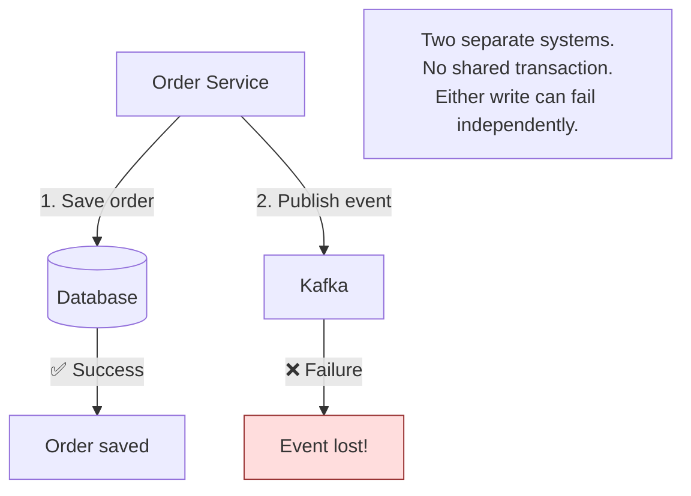
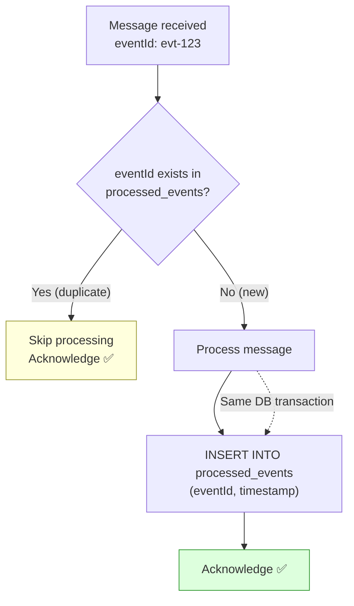
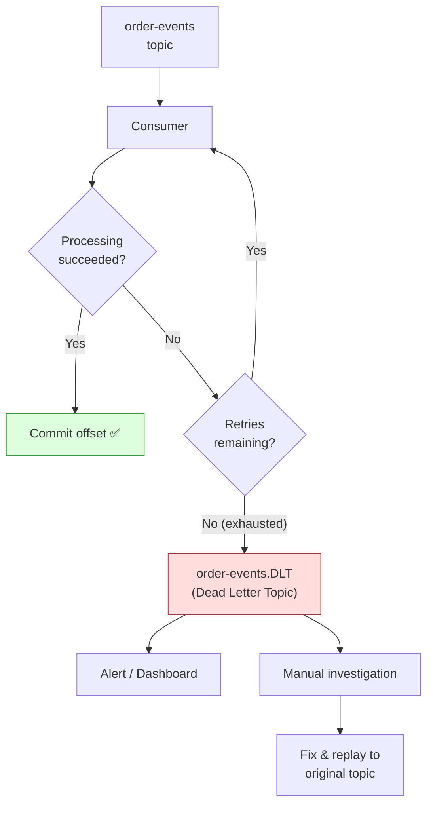
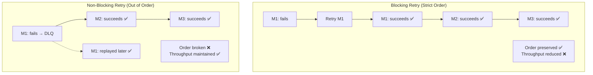
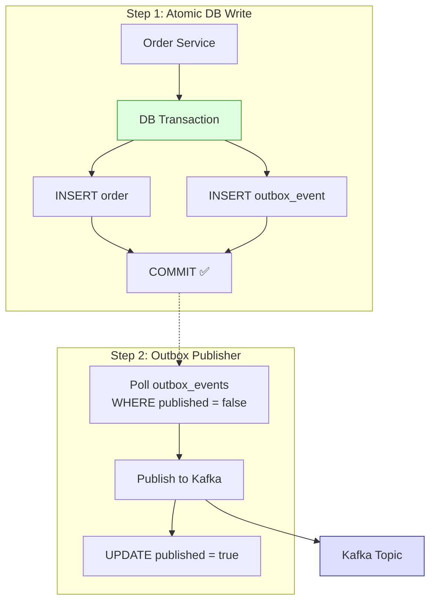
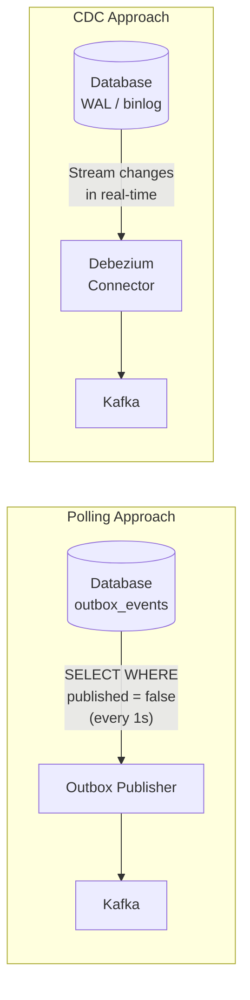
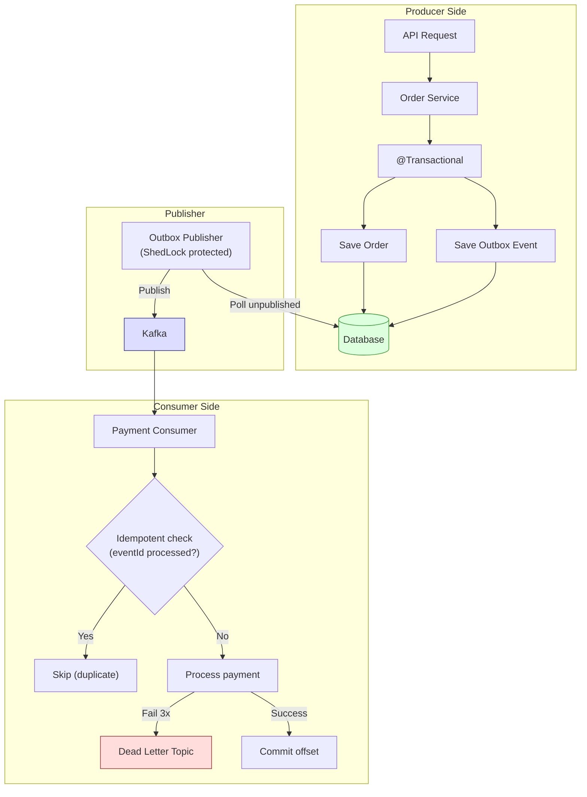

```mermaid
graph TD
    subgraph "At-Most-Once"
        AMO1["Receive message"] --> AMO2["Commit offset"]
        AMO2 --> AMO3["Process message"]
        AMO3 --> |"💥 Crash"| AMO4["Message LOST ❌"]
    end

    subgraph "At-Least-Once"
        ALO1["Receive message"] --> ALO2["Process message"]
        ALO2 --> ALO3["Commit offset"]
        ALO2 --> |"💥 Crash before commit"| ALO4["Message REDELIVERED<br/>→ DUPLICATE ⚠️"]
    end

    subgraph "Exactly-Once (Practical)"
        EO1["Receive message"] --> EO2["Check: already processed?"]
        EO2 --> |"Yes"| EO3["Skip (idempotent) ✅"]
        EO2 --> |"No"| EO4["Process + mark as processed"]
        EO4 --> EO5["Commit offset"]
    end

    style AMO4 fill:#fdd,stroke:#933
    style ALO4 fill:#ffd,stroke:#993
    style EO3 fill:#dfd,stroke:#393
```

# Reliable Messaging

Delivery guarantees, idempotent consumers, DLQ, poison messages,
ordering, Transactional Outbox pattern, and building reliable
event-driven systems.

---

## 1. The Core Problem — Dual Write

```text
When a service needs to update its database AND publish an event,
you have a DUAL WRITE problem:

  @Transactional
  public void createOrder(OrderRequest request) {
      Order order = orderRepository.save(request.toOrder());  // write to DB
      kafkaTemplate.send("order-events", orderEvent);          // write to Kafka
  }

  What can go wrong:

  SCENARIO 1: DB succeeds, Kafka fails
    Order saved in DB ✅
    Event NOT published ❌
    → Other services never know about the order
    → Data inconsistency

  SCENARIO 2: Kafka succeeds, DB fails (or transaction rolls back)
    Event published ✅
    Order NOT saved in DB ❌ (rollback)
    → Other services process a non-existent order
    → Data inconsistency

  SCENARIO 3: Application crashes between the two writes
    → One write completed, one didn't
    → Inconsistency

  You CANNOT make these two writes atomic.
  DB transactions don't span Kafka.
  This is the fundamental problem reliable messaging solves.
```



---

## 2. Delivery Guarantees

### At-Most-Once

```text
Message is delivered ZERO or ONE time. Never redelivered.

  Producer → Kafka → Consumer
                      ↓
                  Process message
                      ↓
                  Commit offset BEFORE processing
                      ↓
                  Processing fails? Message is LOST.

HOW IT WORKS:
  Consumer commits offset immediately after receiving the message,
  BEFORE processing it. If processing fails, the offset is already
  committed — message won't be redelivered.

  Also: Producer with acks=0. Message may never reach Kafka.

USE CASES:
  - Metrics/analytics (losing a few data points is acceptable)
  - Logging (best-effort delivery)
  - Real-time dashboards (stale data is quickly replaced)

NEVER USE FOR:
  - Payments, orders, inventory updates
  - Anything where losing a message causes data corruption
```

### At-Least-Once

```text
Message is delivered ONE or MORE times. May be duplicated.

  Producer → Kafka → Consumer
                      ↓
                  Process message
                      ↓
                  Commit offset AFTER processing
                      ↓
                  Crash after processing but BEFORE commit?
                      ↓
                  Message redelivered on restart → DUPLICATE!

HOW IT WORKS:
  Consumer processes the message first, then commits offset.
  If consumer crashes after processing but before committing,
  the message is redelivered on restart.

  Also: Producer with acks=all + retries. Retry may cause duplicate
  produce if the first attempt actually succeeded but ack was lost.

THIS IS THE DEFAULT IN MOST SYSTEMS.
Most applications use at-least-once + idempotent consumer.
```

### Exactly-Once

```text
Message is delivered and processed EXACTLY ONE time.

  This is the HARDEST guarantee. True exactly-once requires:

  Option 1: Kafka Transactions (Kafka → Kafka only)
    Producer wraps produce + consumer offset commit in one atomic
    transaction. Works ONLY when reading from Kafka AND writing
    to Kafka (stream processing). Does NOT work for Kafka → DB.

  Option 2: Idempotent Consumer (practical exactly-once)
    Use at-least-once delivery + make the consumer idempotent.
    Duplicates are delivered but have NO EFFECT.
    Result: effectively exactly-once from the business perspective.

  "Exactly-once" in practice = at-least-once + idempotent processing.
```



---

## 3. Idempotent Consumer

```text
An idempotent consumer produces the SAME result whether it processes
a message once or multiple times.

WHY THIS IS CRITICAL:
  At-least-once delivery means duplicates WILL happen:
    - Consumer restart after crash
    - Rebalancing reassigns partitions
    - Producer retry sends duplicate to Kafka
    - Network issues cause redelivery

  If your consumer is not idempotent:
    Message: "Debit $100 from account A"
    Delivered twice → $200 debited instead of $100!

TECHNIQUES FOR IDEMPOTENT CONSUMERS:

  1. IDEMPOTENCY KEY (most common):
     Every message has a unique ID (e.g., eventId, transactionId).
     Consumer tracks processed IDs in a database table.
     Before processing: check if ID already processed → skip.

  2. DATABASE CONSTRAINTS:
     Unique index prevents duplicate inserts.
     INSERT fails on duplicate → caught and treated as success.

  3. UPSERT:
     INSERT ON CONFLICT UPDATE — same result whether first or repeat.

  4. CONDITIONAL UPDATE:
     UPDATE orders SET status = 'PAID'
     WHERE id = ? AND status = 'PENDING'
     Second execution: WHERE clause doesn't match → 0 rows updated → safe.

  5. VERSION CHECK:
     Use version/sequence number. Only process if version is newer.
     Older or equal version → skip (out-of-order or duplicate).
```

```java
// Idempotent consumer implementation
@Service
@Slf4j
public class PaymentEventConsumer {

    private final ProcessedEventRepository processedEventRepository;
    private final PaymentService paymentService;

    @KafkaListener(topics = "order-events", groupId = "payment-group")
    @Transactional
    public void handleOrderEvent(OrderEvent event, Acknowledgment ack) {
        String eventId = event.getEventId();

        // 1. Check if already processed
        if (processedEventRepository.existsByEventId(eventId)) {
            log.info("Event {} already processed, skipping", eventId);
            ack.acknowledge();
            return;
        }

        // 2. Process the event
        paymentService.processPayment(event);

        // 3. Mark as processed (in same transaction as business logic)
        processedEventRepository.save(new ProcessedEvent(eventId, Instant.now()));

        // 4. Acknowledge
        ack.acknowledge();
        log.info("Event {} processed successfully", eventId);
    }
}

// Processed events table
// CREATE TABLE processed_events (
//     event_id VARCHAR(255) PRIMARY KEY,
//     processed_at TIMESTAMP NOT NULL
// );
```



---

## 4. Dead Letter Queue (DLQ)

```text
A Dead Letter Queue is a separate topic/queue where messages that
CANNOT be processed are sent for later investigation.

WHY DLQ:
  Some messages will NEVER succeed no matter how many times you retry:
    - Malformed JSON (deserialization error)
    - Business validation failure (invalid order)
    - Schema mismatch (producer changed format)
    - Bug in consumer code

  Without DLQ:
    Bad message → retry → fail → retry → fail → retry → FOREVER!
    Consumer is STUCK on this one message.
    All subsequent messages are blocked.

  With DLQ:
    Bad message → retry 3 times → still fails
    → Send to DLQ topic ("order-events.DLT")
    → Consumer moves on to next message
    → DLQ messages investigated manually or by alert system

FLOW:
  order-events → Consumer → fails 3 times → order-events.DLT
                                                    ↓
                                            Manual investigation
                                            Fix & replay if needed
```



### Spring Kafka DLQ Configuration

```java
@Configuration
public class KafkaConsumerConfig {

    @Bean
    public ConcurrentKafkaListenerContainerFactory<String, OrderEvent>
            kafkaListenerContainerFactory(
                ConsumerFactory<String, OrderEvent> consumerFactory,
                KafkaTemplate<String, OrderEvent> kafkaTemplate) {

        ConcurrentKafkaListenerContainerFactory<String, OrderEvent> factory =
            new ConcurrentKafkaListenerContainerFactory<>();
        factory.setConsumerFactory(consumerFactory);
        factory.getContainerProperties().setAckMode(
            ContainerProperties.AckMode.MANUAL_IMMEDIATE);

        // Error handler with retry + DLQ
        DefaultErrorHandler errorHandler = new DefaultErrorHandler(
            // Dead letter publisher — sends failed messages to DLT
            new DeadLetterPublishingRecoverer(kafkaTemplate,
                (record, ex) -> new TopicPartition(
                    record.topic() + ".DLT", record.partition())),
            // Retry 3 times with exponential backoff
            new ExponentialBackOff(1000L, 2.0)  // 1s, 2s, 4s
        );

        // Don't retry on these (permanent errors)
        errorHandler.addNotRetryableExceptions(
            DeserializationException.class,
            ClassCastException.class
        );

        factory.setCommonErrorHandler(errorHandler);
        return factory;
    }
}
```

---

## 5. Poison Messages

```text
A POISON MESSAGE is a message that causes the consumer to crash or
fail every time it is processed.

Examples:
  - Malformed JSON that cannot be deserialized
  - Missing required field that causes NullPointerException
  - Huge message that causes OutOfMemoryError
  - Message with invalid encoding

WHY POISON MESSAGES ARE DANGEROUS:
  Without DLQ/error handling, a poison message BLOCKS the entire
  partition. The consumer keeps retrying forever and never moves on
  to subsequent messages.

  Message 1 (poison) → fail → retry → fail → retry → STUCK!
  Messages 2, 3, 4, 5... → NEVER processed

HOW TO HANDLE:
  1. DESERIALIZATION ERRORS:
     Use ErrorHandlingDeserializer in Spring Kafka.
     Wraps deserialization errors into a special record.
     Consumer can detect and skip without crashing.

  2. PROCESSING ERRORS:
     Retry a fixed number of times → send to DLQ.

  3. SIZE LIMITS:
     Configure max.message.bytes on the broker.
     Consumer can reject oversized messages.

  4. SCHEMA VALIDATION:
     Use Schema Registry (Avro, Protobuf) to enforce schema.
     Rejects messages that don't match the expected schema.
```

```java
// Handle deserialization errors (poison messages)
spring:
  kafka:
    consumer:
      key-deserializer: org.springframework.kafka.support.serializer.ErrorHandlingDeserializer
      value-deserializer: org.springframework.kafka.support.serializer.ErrorHandlingDeserializer
      properties:
        spring.deserializer.key.delegate.class: org.apache.kafka.common.serialization.StringDeserializer
        spring.deserializer.value.delegate.class: org.springframework.kafka.support.serializer.JsonDeserializer
```

---

## 6. Ordering in Reliable Messaging

```text
Maintaining order with retries and DLQ is HARD.

PROBLEM 1: Retry breaks ordering
  Messages: M1, M2, M3 (all for same orderId, same partition)

  M1 → fails → retrying...
  M2 → succeeds ✅
  M3 → succeeds ✅
  M1 → retry succeeds ✅

  Processing order: M2, M3, M1 → OUT OF ORDER!

PROBLEM 2: DLQ breaks ordering
  M1 → fails → sent to DLQ
  M2 → succeeds ✅
  M3 → succeeds ✅
  M1 → replayed from DLQ later ✅

  Processing order: M2, M3, M1 → OUT OF ORDER!

SOLUTIONS:

  1. BLOCKING RETRY (preserve order, sacrifice throughput):
     Don't skip M1. Keep retrying M1 until it succeeds.
     M2 and M3 wait behind M1.
     Preserves order but can block the entire partition.

  2. ACCEPT OUT-OF-ORDER (most practical):
     Use versioning/timestamps in your business logic.
     Only process if version > current version.
     Skip older/duplicate messages.

  3. PARTITION-LEVEL DLQ:
     When M1 fails, pause the partition.
     Don't process M2, M3 until M1 is resolved.
     Very strict ordering but low throughput.
```



---

## 7. Transactional Outbox Pattern

### The Problem It Solves

```text
We need to atomically:
  1. Save business data to the database
  2. Publish an event to Kafka

These are two different systems — no shared transaction possible.

NAIVE APPROACH (broken):
  @Transactional
  public void createOrder(OrderRequest req) {
      orderRepository.save(order);           // DB write
      kafkaTemplate.send("orders", event);   // Kafka write
  }

  If Kafka is down → DB commit succeeds, event is lost.
  If app crashes after DB commit → event is lost.
  If Kafka succeeds but DB rolls back → ghost event published.

TRANSACTIONAL OUTBOX solves this by writing the event to the
SAME database in the SAME transaction as the business data.
```

### How It Works

```text
STEP 1: Write business data AND outbox event in ONE transaction

  BEGIN TRANSACTION
    INSERT INTO orders (id, customer_id, total) VALUES (...)
    INSERT INTO outbox_events (id, type, payload, created_at, published)
      VALUES (uuid, 'ORDER_CREATED', '{"orderId": "..."}', now(), false)
  COMMIT

  Both writes succeed or both fail. ATOMIC. ✅
  The event is now safely in the database.

STEP 2: A separate process reads the outbox and publishes to Kafka

  OutboxPublisher (scheduled or CDC-based):
    1. SELECT * FROM outbox_events WHERE published = false
    2. Publish each event to Kafka
    3. UPDATE outbox_events SET published = true WHERE id = ?

  If Kafka is down → events stay in outbox → retried later.
  If publisher crashes → events still in outbox → picked up on restart.
  NO EVENTS ARE LOST.
```



### Implementation

```java
// 1. Outbox Event Entity
@Entity
@Table(name = "outbox_events")
public class OutboxEvent {
    @Id
    private UUID id;

    @Column(nullable = false)
    private String aggregateType;    // "Order", "Payment"

    @Column(nullable = false)
    private String aggregateId;      // orderId

    @Column(nullable = false)
    private String eventType;        // "ORDER_CREATED"

    @Column(columnDefinition = "TEXT", nullable = false)
    private String payload;          // JSON payload

    @Column(nullable = false)
    private Instant createdAt;

    @Column(nullable = false)
    private boolean published;
}

// 2. Write business data + outbox event in same transaction
@Service
@Transactional
public class OrderService {

    private final OrderRepository orderRepository;
    private final OutboxEventRepository outboxRepository;
    private final ObjectMapper objectMapper;

    public Order createOrder(OrderRequest request) {
        // Save business data
        Order order = orderRepository.save(request.toOrder());

        // Save outbox event (SAME transaction)
        OutboxEvent event = OutboxEvent.builder()
            .id(UUID.randomUUID())
            .aggregateType("Order")
            .aggregateId(order.getId().toString())
            .eventType("ORDER_CREATED")
            .payload(objectMapper.writeValueAsString(
                new OrderCreatedEvent(order)))
            .createdAt(Instant.now())
            .published(false)
            .build();

        outboxRepository.save(event);

        return order;
    }
}

// 3. Outbox publisher (scheduled)
@Component
@Slf4j
public class OutboxPublisher {

    private final OutboxEventRepository outboxRepository;
    private final KafkaTemplate<String, String> kafkaTemplate;

    @Scheduled(fixedDelay = 1000)  // every second
    @SchedulerLock(name = "outbox-publisher",
        lockAtMostFor = "30s", lockAtLeastFor = "900ms")
    @Transactional
    public void publishPendingEvents() {
        List<OutboxEvent> events = outboxRepository
            .findByPublishedFalseOrderByCreatedAtAsc();

        for (OutboxEvent event : events) {
            try {
                String topic = event.getAggregateType()
                    .toLowerCase() + "-events";

                kafkaTemplate.send(topic,
                    event.getAggregateId(),
                    event.getPayload())
                    .get();  // wait for Kafka ack

                event.setPublished(true);
                outboxRepository.save(event);

                log.info("Published outbox event {} to topic {}",
                    event.getId(), topic);

            } catch (Exception e) {
                log.error("Failed to publish outbox event {}",
                    event.getId(), e);
                break;  // stop to maintain ordering
            }
        }
    }
}
```

```sql
-- Outbox table
CREATE TABLE outbox_events (
    id             UUID PRIMARY KEY,
    aggregate_type VARCHAR(255)  NOT NULL,
    aggregate_id   VARCHAR(255)  NOT NULL,
    event_type     VARCHAR(255)  NOT NULL,
    payload        TEXT          NOT NULL,
    created_at     TIMESTAMP     NOT NULL,
    published      BOOLEAN       NOT NULL DEFAULT false,

    INDEX idx_outbox_unpublished (published, created_at)
);
```

### Outbox Polling vs CDC

```text
TWO approaches to read from the outbox:

1. POLLING (shown above):
   A scheduled job queries outbox_events WHERE published = false.
   Simple to implement. Adds DB load. Has latency (polling interval).

2. CDC (Change Data Capture):
   Use Debezium to tail the database transaction log (WAL/binlog).
   Debezium detects new rows in outbox_events automatically.
   Publishes to Kafka in near-real-time. No polling needed.

   Database WAL → Debezium → Kafka

  ┌──────────────────┬──────────────────┬──────────────────────┐
  │ Aspect           │ Polling          │ CDC (Debezium)       │
  ├──────────────────┼──────────────────┼──────────────────────┤
  │ Latency          │ Polling interval │ Near real-time       │
  │ DB load          │ Periodic queries │ Reads WAL (minimal)  │
  │ Complexity       │ Simple           │ More infrastructure  │
  │ Infrastructure   │ Just app + DB    │ Debezium + Kafka     │
  │                  │                  │ Connect              │
  │ Ordering         │ ORDER BY in SQL  │ WAL order            │
  │ Best for         │ Most apps        │ High-throughput,     │
  │                  │                  │ low-latency needs    │
  └──────────────────┴──────────────────┴──────────────────────┘
```



---

## 8. Putting It All Together — Reliable Event Pipeline



```text
Complete reliable messaging pipeline:

  PRODUCER SIDE:
    1. Business data + outbox event in SAME transaction (atomicity)
    2. Outbox publisher polls and publishes to Kafka (reliability)
    3. ShedLock prevents duplicate publishers across instances

  KAFKA:
    4. Replication factor = 3, acks = all (durability)
    5. Partition key = aggregateId (ordering per entity)

  CONSUMER SIDE:
    6. Manual offset commit AFTER processing (at-least-once)
    7. Idempotent consumer with eventId tracking (no duplicates)
    8. Retry with exponential backoff (transient errors)
    9. DLQ for permanently failing messages (don't block)
    10. Monitoring: consumer lag, DLQ size, error rates
```

---

## 9. Interview Questions

### Q1: What are the three delivery guarantees in messaging?

```text
At-most-once:
  Message delivered 0 or 1 time. May be lost. Never duplicated.
  Commit offset before processing. Fast but unreliable.

At-least-once:
  Message delivered 1 or more times. Never lost. May be duplicated.
  Commit offset after processing. Most common in production.
  Requires idempotent consumer to handle duplicates.

Exactly-once:
  Message delivered and processed exactly 1 time.
  True exactly-once only within Kafka (Kafka Transactions).
  Practical exactly-once = at-least-once + idempotent consumer.
```

### Q2: What is an idempotent consumer and why is it important?

```text
An idempotent consumer produces the same result whether it processes
a message once or multiple times. It is ESSENTIAL for at-least-once
delivery because duplicates WILL happen.

Implementation: Track processed message IDs in a database table.
Before processing: check if ID exists → skip if already processed.
After processing: insert ID in the SAME transaction as business logic.

Without idempotency: duplicate message → duplicate side effects
(double payment, double email, double inventory deduction).
```

### Q3: What is a Dead Letter Queue and when do you need it?

```text
A DLQ is a separate queue/topic where messages that cannot be
processed after exhausting retries are sent.

Needed when:
  - Messages have permanent errors (bad format, invalid data)
  - Consumer code has a bug for certain message types
  - Schema mismatch between producer and consumer

Without DLQ: one bad message blocks the entire partition forever.
With DLQ: bad message moves to DLQ, consumer continues processing.

DLQ messages should be monitored, alerted on, investigated,
and replayed after fixing the root cause.
```

### Q4: What is a poison message?

```text
A message that causes the consumer to fail every time it is processed.
No amount of retrying will fix it.

Examples: malformed JSON, missing required fields, incompatible schema,
message too large.

Handling:
  1. Retry a few times (in case of transient issues)
  2. Send to DLQ (don't block the partition)
  3. Log full details for debugging
  4. Alert operations team
  5. Use ErrorHandlingDeserializer to catch deserialization failures
  6. Use Schema Registry to prevent schema mismatches
```

### Q5: Explain the Transactional Outbox pattern.

```text
The Transactional Outbox solves the dual-write problem: how to
atomically update a database AND publish an event to a message broker.

How it works:
  1. Write business data + event to the SAME database in ONE transaction
     (the event goes into an "outbox" table)
  2. A separate publisher process reads the outbox table and publishes
     events to Kafka
  3. Publisher marks events as published after successful Kafka send

Why it works:
  - Step 1 is atomic (single DB transaction)
  - If Kafka is down, events accumulate in the outbox safely
  - Publisher retries on failure — events are never lost
  - Consumer uses idempotent processing for duplicates

This is one of the most important patterns for SDE2-level system design.
```

### Q6: What is the dual-write problem?

```text
When you need to write to two different systems (e.g., database + Kafka)
and there is no way to make both writes atomic.

  save(order);          // DB write
  publish(orderEvent);  // Kafka write

If either fails independently, you have inconsistency:
  - DB succeeds, Kafka fails → event lost
  - Kafka succeeds, DB fails → ghost event
  - App crashes between the two → partial write

Solutions:
  1. Transactional Outbox (write both to DB, publish async)
  2. CDC / Change Data Capture (tail DB log, publish changes)
  3. Listen-to-yourself (consume your own events for state changes)
```

### Q7: Polling vs CDC for the outbox — when to use which?

```text
Polling:
  Simple to implement. Uses scheduled queries on the outbox table.
  Adds DB load proportional to polling frequency.
  Latency = polling interval (e.g., 1 second).
  Best for: most applications, moderate throughput.

CDC (Debezium):
  Tails the database transaction log (WAL/binlog).
  Near real-time event publishing.
  Minimal DB load (reads log, not table).
  Requires Debezium + Kafka Connect infrastructure.
  Best for: high-throughput, low-latency requirements.

Start with polling. Move to CDC when polling latency or DB load
becomes a problem.
```

### Q8: How do you maintain message ordering with retries and DLQ?

```text
Strict ordering with retries is challenging:

Option 1 — Blocking retry (strict order, low throughput):
  Keep retrying the failed message. Don't process subsequent messages.
  Preserves order but can block the partition.

Option 2 — Accept out-of-order (practical):
  Use DLQ for failed messages. Continue processing.
  Handle ordering in business logic with version numbers/timestamps.
  Only apply changes if version > current version.

Option 3 — Partition-level pause:
  Pause the partition when a message fails.
  Don't process other messages from that partition until resolved.

Most production systems use Option 2 with idempotent, version-aware
consumers.
```

### Q9: How do you ensure no event is lost end-to-end?

```text
Complete reliability chain:

  Producer:
    1. Transactional Outbox (atomic with business data)
    2. Publisher retries until Kafka acknowledges (acks=all)
    3. ShedLock prevents duplicate publishers

  Kafka:
    4. Replication factor ≥ 3 (data survives broker failures)
    5. min.insync.replicas = 2 (at least 2 replicas must ack)
    6. Retention period sufficient for consumer recovery

  Consumer:
    7. Manual offset commit AFTER successful processing
    8. Idempotent processing (handles duplicates from retries)
    9. DLQ for permanently failing messages (don't block)
    10. Monitoring: lag, DLQ size, error rates, alerts
```

### Q10: Design a reliable order processing pipeline.

```text
  Order Service:
    POST /orders → save order + outbox event in one transaction
    Outbox publisher → publishes OrderCreated to Kafka

  Kafka:
    Topic: order-events, 12 partitions, replication-factor=3
    Key: orderId (ordering per order)

  Payment Service:
    Consumer group: payment-group
    Idempotent: tracks processed eventIds
    Retries: 3 times with exponential backoff
    DLQ: order-events.DLT
    On success: publishes PaymentCompleted (via its own outbox)

  Inventory Service:
    Consumer group: inventory-group (independent offsets)
    Same idempotent + retry + DLQ pattern

  Monitoring:
    Consumer lag dashboards
    DLQ size alerts
    Error rate metrics
    End-to-end latency tracking (traceId in event headers)
```
