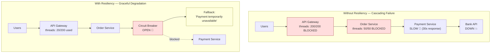
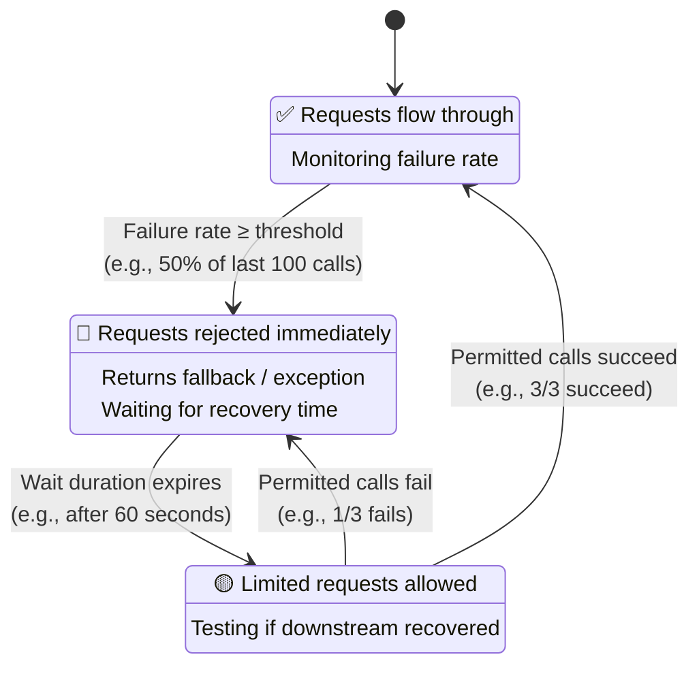
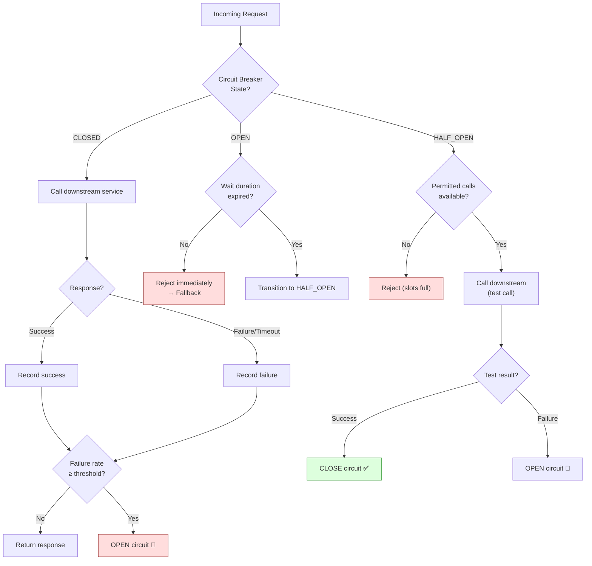
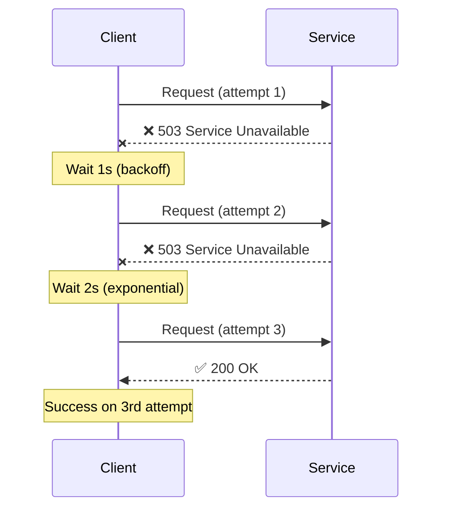
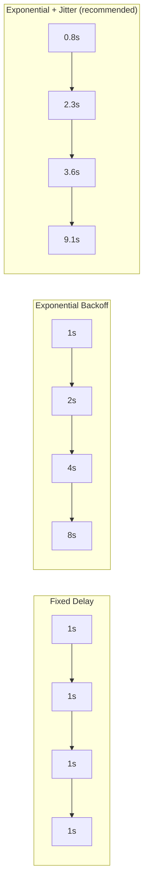
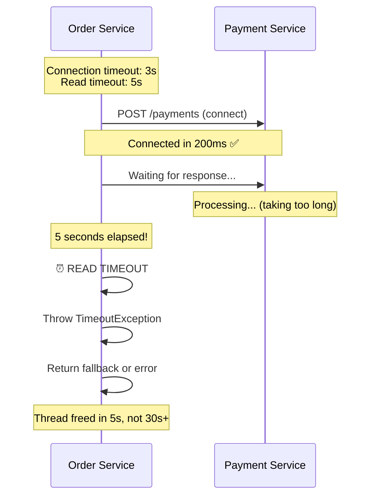
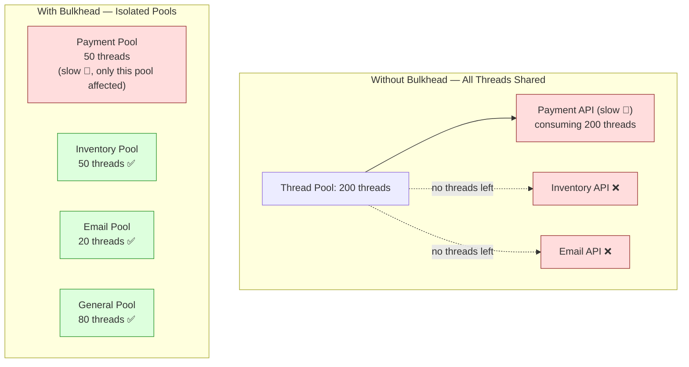
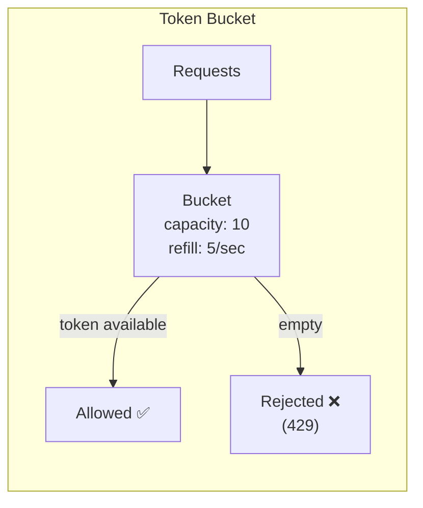
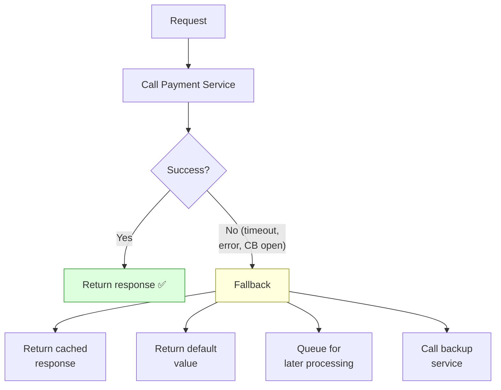
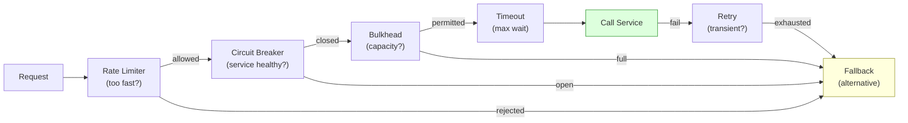

# Resiliency — Part 1: Fundamentals & Core Patterns

Why resiliency matters, failure modes in distributed systems,
Circuit Breaker, Retry, Timeout, Bulkhead, Rate Limiter, Fallback,
and how these patterns work together.

> This is Part 1 of 4. See also:
> - [Part 2: Resilience4j Deep Dive](./02-Resilience4j-Deep-Dive.md)
> - [Part 3: Spring Boot Integration](./03-Resilience4j-Spring-Boot.md)
> - [Part 4: Interview Scenarios](./04-Resilience4j-Interview-Scenarios.md)

---

## 1. Why Resiliency Matters

```text
In a microservice architecture, services call other services over
the network. Networks are UNRELIABLE.

  Order Service → Payment Service → Bank API → Fraud Detection

  What can go wrong:
    1. Payment Service is DOWN (crash, deployment, OOM)
    2. Payment Service is SLOW (DB overloaded, GC pause)
    3. Network TIMEOUT (packet loss, DNS failure)
    4. Payment Service returns ERRORS (500, 503)
    5. Bank API is RATE LIMITED (429 Too Many Requests)
    6. Cascading failure: Payment slow → Order threads blocked
       → Order Service slow → API Gateway threads blocked
       → ENTIRE SYSTEM DOWN

  Without resiliency:
    One slow service → all upstream services slow down
    → all threads consumed waiting → system-wide outage
    → "the entire platform is down because the fraud
       detection service had a GC pause"

  With resiliency:
    One slow service → circuit breaker opens → fast failure
    → fallback response → system continues operating
    → only fraud detection feature is degraded
```



---

## 2. Failure Modes in Distributed Systems

```text
Understanding failure types helps pick the right resilience pattern:

  ┌────────────────────────┬────────────────────────────────────────────┐
  │ Failure Type           │ Description                                │
  ├────────────────────────┼────────────────────────────────────────────┤
  │ CRASH FAILURE          │ Service is completely down.                │
  │                        │ Connection refused / unreachable.          │
  │                        │ Pattern: Circuit Breaker + Fallback        │
  │                        │                                            │
  │ TIMEOUT / SLOWDOWN     │ Service responds but very slowly.          │
  │                        │ Most dangerous — consumes caller threads.  │
  │                        │ Pattern: Timeout + Circuit Breaker          │
  │                        │                                            │
  │ TRANSIENT ERROR        │ Temporary failure (network glitch, 503).   │
  │                        │ Succeeds on retry.                          │
  │                        │ Pattern: Retry with backoff                │
  │                        │                                            │
  │ OVERLOAD               │ Service rejects requests (429, 503).       │
  │                        │ Too many concurrent requests.              │
  │                        │ Pattern: Rate Limiter + Bulkhead            │
  │                        │                                            │
  │ PARTIAL FAILURE        │ Service partly works (some endpoints OK).  │
  │                        │ Pattern: Per-endpoint Circuit Breaker       │
  │                        │                                            │
  │ CASCADING FAILURE      │ One failure causes upstream failures.      │
  │                        │ Pattern: All patterns combined              │
  └────────────────────────┴────────────────────────────────────────────┘
```

---

## 3. Circuit Breaker Pattern

### The Core Idea

```text
A circuit breaker works EXACTLY like an electrical circuit breaker:

  Electrical:
    Normal current → breaker CLOSED → electricity flows
    Overload/short → breaker OPENS → stops electricity → prevents fire

  Software:
    Normal responses → breaker CLOSED → requests flow through
    Too many failures → breaker OPENS → requests fail fast
    → prevents cascading failure

WHY "FAIL FAST" IS BETTER THAN "WAIT AND TIMEOUT":

  Without circuit breaker:
    100 requests → all wait 30 seconds → all timeout → 100 threads blocked
    → thread pool exhausted → service can't handle ANY requests

  With circuit breaker:
    First 10 requests → failures detected → circuit OPENS
    Next 90 requests → immediately rejected (5ms, not 30s)
    → 90 threads freed → service stays responsive for other operations
```

### Three States

```text
  CLOSED (normal operation):
    Requests flow through to the downstream service.
    Circuit breaker monitors success/failure rate.
    If failure rate exceeds threshold → transitions to OPEN.

  OPEN (failing fast):
    Requests are IMMEDIATELY rejected without calling downstream.
    Caller gets a fast failure or fallback response.
    After a configured wait duration → transitions to HALF-OPEN.

  HALF-OPEN (testing recovery):
    A LIMITED number of requests are allowed through.
    If these succeed → downstream has recovered → back to CLOSED.
    If these fail → downstream still broken → back to OPEN.
```



### Circuit Breaker Flow



---

## 4. Retry Pattern

```text
WHAT: Automatically retry a failed operation, hoping the failure
was transient (network glitch, temporary overload).

WHEN TO RETRY:
  ✅ Network timeouts (ConnectTimeoutException)
  ✅ HTTP 503 Service Unavailable
  ✅ HTTP 429 Too Many Requests (with backoff)
  ✅ Database connection pool exhausted
  ✅ Temporary DNS resolution failure

WHEN NOT TO RETRY:
  ❌ HTTP 400 Bad Request (your request is wrong)
  ❌ HTTP 401/403 Unauthorized (auth issue, won't fix itself)
  ❌ HTTP 404 Not Found
  ❌ Business validation failures
  ❌ Non-idempotent operations (without idempotency key)

RETRY STRATEGIES:

  1. FIXED DELAY:
     Retry every 1 second.
     Simple but can cause "thundering herd" if many callers retry
     at the same time.

  2. EXPONENTIAL BACKOFF:
     1s → 2s → 4s → 8s → 16s
     Each retry waits longer. Gives downstream time to recover.

  3. EXPONENTIAL BACKOFF + JITTER:
     1s ± random → 2s ± random → 4s ± random
     Adds randomness to prevent all callers retrying at the exact
     same time (thundering herd problem).
     THIS IS THE RECOMMENDED STRATEGY.

  4. LINEAR BACKOFF:
     1s → 2s → 3s → 4s
     Gradual increase without exponential growth.

CRITICAL RULE:
  Only retry IDEMPOTENT operations.
  If you retry a non-idempotent POST (e.g., charge credit card)
  and the first attempt actually succeeded but timed out,
  you'll charge the customer twice.
```





---

## 5. Timeout Pattern

```text
WHAT: Set a maximum time to wait for a response. If exceeded,
abort the call and fail fast.

WHY: A slow downstream service is MORE DANGEROUS than a dead one.
  Dead service: Connection refused → instant failure → thread freed.
  Slow service: Hangs for 30s+ → thread blocked → thread pool exhausted
                → YOUR service becomes slow → cascading failure.

TYPES:

  CONNECTION TIMEOUT:
    Max time to establish a TCP connection.
    If server is completely down: fails fast (few seconds).
    Typical: 2-5 seconds.

  READ TIMEOUT (response timeout):
    Max time to wait for a response after connection established.
    Catches slow services.
    Typical: 3-10 seconds (depends on operation).

  OVERALL TIMEOUT:
    Total time including connection + read + retries.
    Ensures a request doesn't run forever.

RULES:
  1. ALWAYS set timeouts. Never use infinite/default timeouts.
  2. Timeout should be SHORT enough to free threads quickly.
  3. Timeout should be LONG enough for the slowest normal response.
  4. timeout = p99 response time × 1.5 (rule of thumb)
  5. Timeout should be SHORTER than the caller's timeout.
     If API Gateway timeout = 30s, service timeout should be < 30s.
```



---

## 6. Bulkhead Pattern

```text
WHAT: Isolate different parts of the system so that a failure in
one part doesn't take down everything.

Named after ship bulkheads: watertight compartments that prevent
a single hull breach from sinking the entire ship.

  Without Bulkhead:
    Order Service has ONE thread pool (200 threads).
    Payment API is slow → 200 threads blocked waiting for Payment.
    Inventory API calls also fail (no threads available).
    Email API calls also fail.
    → EVERYTHING fails because Payment is slow.

  With Bulkhead:
    Payment API: dedicated pool of 50 threads (max)
    Inventory API: dedicated pool of 50 threads (max)
    Email API: dedicated pool of 20 threads (max)
    Other: remaining 80 threads

    Payment is slow → 50 threads blocked → ONLY payment affected.
    Inventory, Email, other operations continue normally.

TWO TYPES:

  1. THREAD POOL BULKHEAD:
     Each dependency gets its own thread pool.
     Requests execute on a separate thread.
     If pool is full → request rejected immediately.
     Better isolation but higher overhead (thread context switching).

  2. SEMAPHORE BULKHEAD:
     Limits concurrent requests using a semaphore counter.
     Requests execute on the CALLER'S thread.
     If semaphore is full → request rejected immediately.
     Lighter weight but less isolation (still on caller's thread).
```



---

## 7. Rate Limiter Pattern

```text
WHAT: Limit the number of requests a service makes (or receives)
within a time window. Prevents overloading downstream services.

WHY:
  - Downstream service has a rate limit (e.g., Stripe: 100 req/s)
  - Protect your own service from excessive load
  - Prevent abuse from specific clients
  - Fair resource allocation across tenants

TYPES:

  1. FIXED WINDOW:
     Allow N requests per window (e.g., 100 requests per second).
     Simple. Edge case: burst at window boundary (200 in 2 seconds
     centered around the boundary).

  2. SLIDING WINDOW:
     Rolling window of time. Smooths out the boundary burst.
     More accurate. Slightly more complex.

  3. TOKEN BUCKET:
     Bucket holds N tokens. Each request consumes a token.
     Tokens are added at a fixed rate (e.g., 10 tokens/second).
     If no tokens → request rejected or queued.
     Allows short bursts (up to bucket capacity).

  4. LEAKY BUCKET:
     Requests queue up. Processed at a fixed rate.
     Smooths bursts completely. Consistent output rate.

RESILIENCE4J uses SLIDING WINDOW rate limiter.
```



---

## 8. Fallback Pattern

```text
WHAT: Provide a default/alternative response when the primary
operation fails.

TYPES:

  1. DEFAULT VALUE:
     Return a cached or default response.
     "We couldn't fetch your recommendations, here are popular items."

  2. CACHED RESULT:
     Return the last known good response from cache.
     Stale data is better than no data.

  3. DEGRADED RESPONSE:
     Return partial data. Skip the failed component.
     "Order placed, but payment confirmation is pending."

  4. ALTERNATIVE SERVICE:
     Call a backup service or a different implementation.
     Primary payment gateway down → use secondary gateway.

  5. QUEUE FOR LATER:
     Write the request to a queue/DB for later processing.
     "Your request has been queued and will be processed shortly."

  6. GRACEFUL ERROR:
     Return a clear error message with guidance.
     "Payment service is temporarily unavailable. Try again in 5 min."

RULES:
  - Fallback should be FAST (no slow operations)
  - Fallback should be RELIABLE (shouldn't fail itself)
  - Log the original failure for investigation
  - Monitor fallback invocation rate (high rate = problem)
```



---

## 9. How Patterns Work Together

```text
Patterns are NOT mutually exclusive. In production, you COMBINE them:

  REQUEST FLOW:
    1. Rate Limiter → Am I sending too many requests?
    2. Circuit Breaker → Is the downstream service healthy?
    3. Bulkhead → Do I have capacity for this call?
    4. Timeout → Don't wait forever for a response.
    5. Retry → Was it a transient failure? Try again.
    6. Fallback → Everything failed? Return alternative.

  RECOMMENDED ORDER (Resilience4j decorates in this order):
    Retry → CircuitBreaker → RateLimiter → TimeLimiter → Bulkhead → Function

  This means:
    - Retry wraps the circuit breaker (retries count as CB calls)
    - Circuit breaker wraps rate limiter (if CB open, don't rate limit)
    - If all fail → fallback is the last resort
```



---

## 10. Resiliency Libraries Comparison

```text
┌──────────────────────┬────────────────────────────────────────────────┐
│ Library              │ Details                                        │
├──────────────────────┼────────────────────────────────────────────────┤
│ Resilience4j         │ Lightweight, functional, Java 8+.              │
│ (recommended)        │ Designed for microservices.                     │
│                      │ Modules: CircuitBreaker, Retry, RateLimiter,   │
│                      │ Bulkhead, TimeLimiter, Cache.                  │
│                      │ Spring Boot auto-configuration.                │
│                      │ Active development.                            │
│                      │                                                │
│ Netflix Hystrix      │ Original circuit breaker library.               │
│ (deprecated)         │ In maintenance mode since 2018.                │
│                      │ Thread-pool based bulkhead.                    │
│                      │ Replaced by Resilience4j.                      │
│                      │                                                │
│ Spring Retry         │ Retry-focused. @Retryable annotation.          │
│                      │ Good for simple retry. No circuit breaker.     │
│                      │ Can complement Resilience4j.                   │
│                      │                                                │
│ Spring Cloud         │ Abstraction over Resilience4j/Sentinel.       │
│ CircuitBreaker       │ Provides @CircuitBreaker annotation.           │
│                      │ Good for Spring Cloud ecosystems.              │
│                      │                                                │
│ Alibaba Sentinel     │ Flow control, circuit breaking, monitoring.    │
│                      │ Strong in rate limiting and traffic shaping.   │
│                      │ Popular in Chinese tech ecosystem.             │
│                      │                                                │
│ Polly (.NET)         │ .NET equivalent of Resilience4j.               │
│                      │ Similar patterns, different ecosystem.         │
│                      │                                                │
│ Envoy / Istio        │ Service mesh level resilience.                 │
│ (infrastructure)     │ Circuit breaking at the proxy layer.           │
│                      │ No application code changes.                   │
│                      │ Less flexible than application-level.          │
└──────────────────────┴────────────────────────────────────────────────┘

RECOMMENDATION:
  For Java/Spring Boot: Resilience4j (the standard)
  For simple retries only: Spring Retry
  For service mesh: Envoy/Istio (complement, not replace, app-level)
```

---

## 11. Interview Questions — Fundamentals

### Q1: What is the Circuit Breaker pattern and why is it needed?

```text
The Circuit Breaker prevents cascading failures in distributed systems
by detecting failures and stopping requests to unhealthy services.

Three states:
  CLOSED: normal, requests flow through, monitoring failure rate
  OPEN: requests rejected immediately (fail fast), returns fallback
  HALF-OPEN: limited test requests to check if service has recovered

Without it: a slow/failing service causes all callers to block,
exhausting their thread pools, causing their callers to block,
and so on → cascading failure → entire system down.

With it: fast failure → threads freed → system stays responsive
→ only the failing dependency is degraded.
```

### Q2: Explain the difference between retry and circuit breaker.

```text
Retry: Re-attempts a SINGLE failed request, hoping the failure
was transient. Good for: network glitches, temporary 503s.
Risk: can overwhelm a struggling service with more requests.

Circuit Breaker: Monitors AGGREGATE failure rate across many
requests. When too many fail → stops ALL requests to that service.
Good for: service outages, sustained failures.
Benefit: gives the downstream service time to recover.

They complement each other:
  Retry handles transient failures (milliseconds/seconds).
  Circuit Breaker handles sustained failures (seconds/minutes).
  Combined: retry 3 times, if still failing and CB threshold met
  → open circuit → fast-fail all subsequent calls.
```

### Q3: What is the Bulkhead pattern?

```text
Isolates different parts of the system into separate resource pools.
Named after ship bulkheads (watertight compartments).

If one pool is exhausted (e.g., payment API is slow and all its
threads are blocked), other pools (inventory, email) are unaffected.

Two types:
  Thread Pool Bulkhead: separate thread pool per dependency.
    Better isolation. Higher overhead (thread switching).
  Semaphore Bulkhead: limits concurrent calls via counter.
    Lighter weight. Less isolation (runs on caller's thread).
```

### Q4: Why is exponential backoff with jitter recommended for retries?

```text
Exponential backoff: each retry waits exponentially longer (1s, 2s, 4s).
Gives the failing service time to recover.

Problem: if 1000 clients fail at the same time, they all retry at
exactly the same intervals → thundering herd → service overloaded again.

Jitter: adds randomness to the wait time (e.g., 1s ± 500ms).
Spreads retries over time → prevents thundering herd.

Combined: each client retries at a different time, with increasing
delays. Best strategy for production retry logic.
```

### Q5: When should you NOT retry a request?

```text
Don't retry when:
  1. The error is PERMANENT (400, 401, 403, 404)
  2. The operation is NOT IDEMPOTENT (charge card without idempotency key)
  3. The circuit breaker is OPEN (service is known to be down)
  4. The error indicates OVERLOAD (429 without respecting Retry-After)
  5. Business validation failed (invalid input won't fix itself)

Only retry on:
  - Network timeouts, connection failures
  - HTTP 500, 502, 503 (server errors that may be transient)
  - HTTP 429 (with proper backoff, respecting Retry-After header)
```

### Q6: How do you decide timeout values?

```text
Rule of thumb: timeout = p99 response time × 1.5

Steps:
  1. Measure actual p99 response time of the downstream service
     (e.g., payment service p99 = 2 seconds)
  2. Set timeout to 1.5× that (3 seconds)
  3. Ensure YOUR timeout < YOUR CALLER's timeout
     (if API gateway timeout = 30s, your timeout should be < 30s)
  4. Account for retries: timeout × retries < caller timeout
     (3s × 3 retries = 9s < 30s ✅)

Too short: legitimate slow requests fail.
Too long: threads blocked too long → cascading issues.
```

### Q7: What is a fallback and when should you use one?

```text
A fallback provides an alternative response when the primary
operation fails. Types:
  - Default/cached value ("here are popular products")
  - Degraded response ("order placed, confirmation pending")
  - Alternative service (backup payment gateway)
  - Queue for later ("request queued, will process shortly")
  - Graceful error message

Use when:
  - Circuit breaker is open → need a fast response
  - Timeout/retry exhausted → need to return something
  - Downstream is rate-limited → use cached data

Don't use as a substitute for fixing the actual problem.
Monitor fallback rate — high rate means something is wrong.
```
