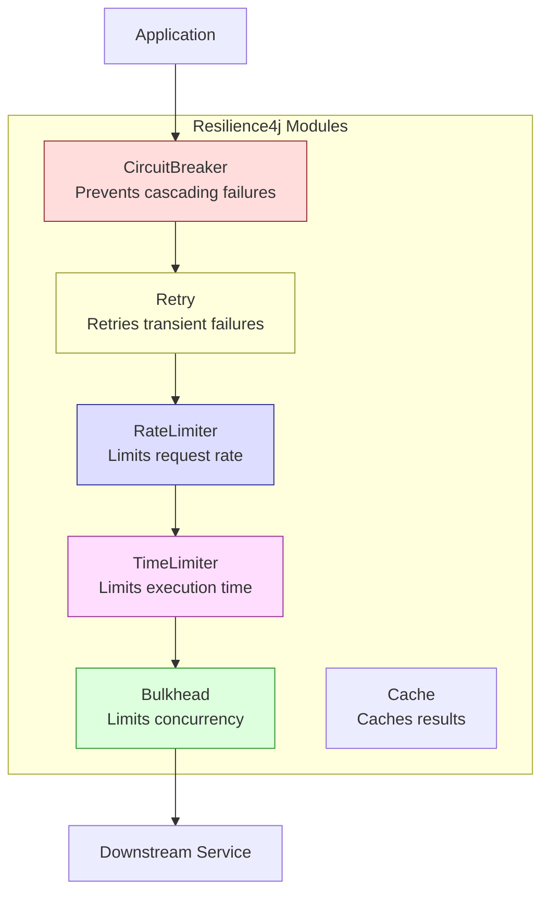
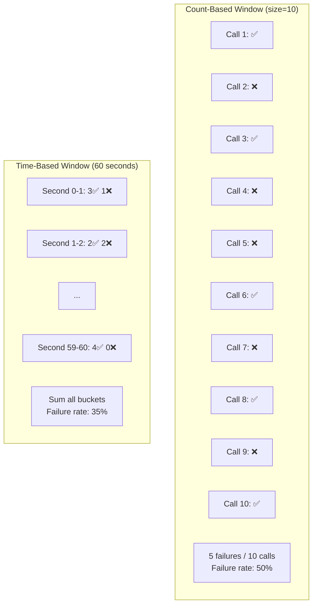
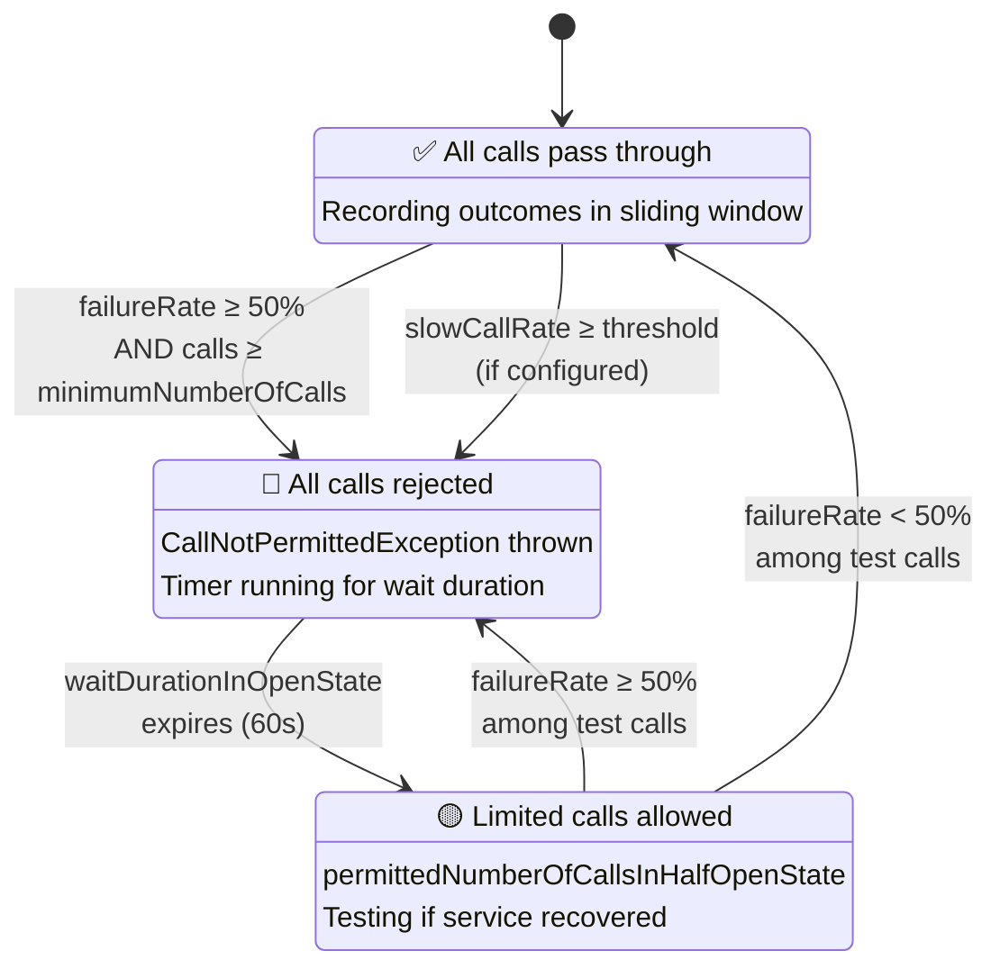
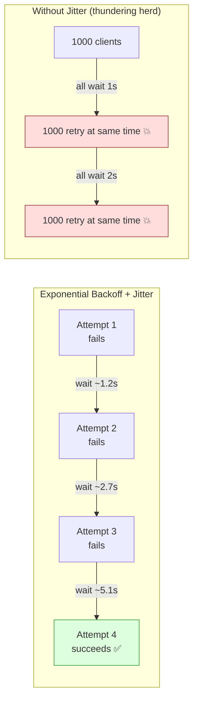
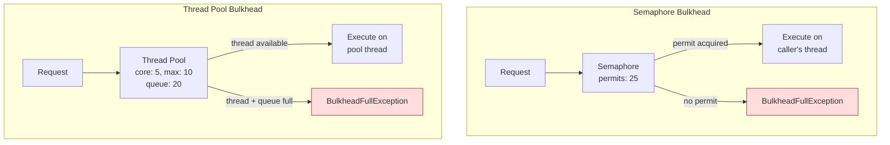

# Resiliency — Part 2: Resilience4j Deep Dive

Resilience4j modules, circuit breaker internals (sliding windows,
state transitions, configuration), retry internals, rate limiter,
bulkhead, time limiter, and how they compose.

> This is Part 2 of 4. See also:
> - [Part 1: Resiliency Fundamentals](./01-Resiliency-Fundamentals.md)
> - [Part 3: Spring Boot Integration](./03-Resilience4j-Spring-Boot.md)
> - [Part 4: Interview Scenarios](./04-Resilience4j-Interview-Scenarios.md)

---

## 1. Resilience4j Overview

```text
Resilience4j is a lightweight, Java 8+ fault tolerance library
designed for functional programming.

MODULES:
  1. CircuitBreaker  — Prevents cascading failures
  2. Retry           — Retries failed operations
  3. RateLimiter     — Limits request rate
  4. Bulkhead        — Limits concurrent executions
  5. TimeLimiter     — Limits execution time
  6. Cache           — Caches results

KEY DESIGN PRINCIPLES:
  - Functional: decorates functions/suppliers/callables
  - Composable: stack multiple decorators
  - Lightweight: no external dependencies (unlike Hystrix)
  - Thread-safe: uses CAS operations and atomic variables
  - No thread pool overhead (semaphore-based by default)

DEPENDENCIES:
  resilience4j-spring-boot3     (Spring Boot 3 auto-config)
  resilience4j-circuitbreaker   (circuit breaker module)
  resilience4j-retry            (retry module)
  resilience4j-ratelimiter      (rate limiter module)
  resilience4j-bulkhead         (bulkhead module)
  resilience4j-timelimiter      (time limiter module)
  resilience4j-micrometer       (metrics integration)
```



---

## 2. CircuitBreaker — Internals

### Sliding Window Types

```text
Resilience4j uses a SLIDING WINDOW to track call outcomes.
Two types:

  COUNT-BASED SLIDING WINDOW:
    Tracks the last N calls (e.g., last 100 calls).
    Failure rate = failed calls / total calls in the window.

    Window size: 100
    Last 100 calls: 60 success, 40 failures
    Failure rate: 40% → if threshold is 50%, circuit stays CLOSED.

    Window is implemented as a circular buffer (ring buffer).
    When a new call is recorded, the oldest is evicted.
    O(1) time for recording. O(1) space.

  TIME-BASED SLIDING WINDOW:
    Tracks calls within the last N seconds (e.g., last 60 seconds).
    Failure rate calculated over calls in the time window.

    Window size: 60 seconds
    Calls in last 60s: 200 total, 120 failed
    Failure rate: 60% → if threshold is 50%, circuit OPENS.

    Implemented as N partial aggregations (one per second).
    Each second bucket stores: success count, failure count, total.
    When a second passes, the oldest bucket is evicted.
```



### State Transitions — Complete Details

```text
CLOSED → OPEN:
  Condition: failure rate ≥ failureRateThreshold (default 50%)
  AND minimum number of calls recorded ≥ minimumNumberOfCalls (default 100)

  Both conditions must be met. If only 5 calls were made and 4 failed
  (80% failure rate), the circuit stays CLOSED because 5 < 100.

OPEN → HALF_OPEN:
  Condition: waitDurationInOpenState expires (default 60 seconds)
  The circuit automatically transitions after the wait duration.

HALF_OPEN → CLOSED:
  Condition: failure rate < failureRateThreshold
  Among the permittedNumberOfCallsInHalfOpenState (default 10) test calls.

HALF_OPEN → OPEN:
  Condition: failure rate ≥ failureRateThreshold
  Among the permitted test calls.

ADDITIONAL:
  CLOSED → OPEN can also trigger on:
    slowCallRateThreshold (default disabled):
      If % of slow calls (exceeding slowCallDurationThreshold) is too high.
      Useful for detecting degraded performance, not just failures.
```



### All Configuration Parameters

```text
┌──────────────────────────────────────┬────────────────┬────────────────────────────────────┐
│ Parameter                            │ Default        │ Description                        │
├──────────────────────────────────────┼────────────────┼────────────────────────────────────┤
│ failureRateThreshold                 │ 50 (%)         │ Failure rate to open circuit        │
│                                      │                │                                    │
│ slowCallRateThreshold                │ 100 (%)        │ Slow call rate to open circuit      │
│                                      │                │ (100% = disabled)                  │
│                                      │                │                                    │
│ slowCallDurationThreshold            │ 60000 ms       │ What counts as a "slow" call       │
│                                      │                │                                    │
│ slidingWindowType                    │ COUNT_BASED    │ COUNT_BASED or TIME_BASED          │
│                                      │                │                                    │
│ slidingWindowSize                    │ 100            │ Window size (calls or seconds)     │
│                                      │                │                                    │
│ minimumNumberOfCalls                 │ 100            │ Min calls before failure rate       │
│                                      │                │ is calculated                      │
│                                      │                │                                    │
│ waitDurationInOpenState              │ 60000 ms       │ How long to stay OPEN              │
│                                      │                │                                    │
│ permittedNumberOfCallsInHalfOpenState│ 10             │ Test calls in HALF_OPEN            │
│                                      │                │                                    │
│ automaticTransitionFromOpenToHalf    │ false          │ Auto-transition or wait for call    │
│ OpenEnabled                          │                │                                    │
│                                      │                │                                    │
│ recordExceptions                     │ empty          │ Exceptions that count as failures  │
│                                      │                │ (default: all exceptions)          │
│                                      │                │                                    │
│ ignoreExceptions                     │ empty          │ Exceptions that are neither        │
│                                      │                │ success nor failure                │
│                                      │                │                                    │
│ recordFailurePredicate               │ throwable→true │ Custom predicate for failures      │
└──────────────────────────────────────┴────────────────┴────────────────────────────────────┘
```

### What Counts as a Failure?

```text
By default, ALL exceptions count as failures.

But you should configure which exceptions matter:

  recordExceptions:
    Exceptions that COUNT as failures (trip the circuit).
    → ConnectTimeoutException, ReadTimeoutException, IOException,
      HttpServerErrorException (5xx)

  ignoreExceptions:
    Exceptions that are IGNORED (neither success nor failure).
    → BusinessValidationException, IllegalArgumentException
    These don't affect the failure rate.

  recordFailurePredicate:
    Custom logic to decide if a result is a failure.
    Example: treat HTTP 500 as failure, 400 as ignored.

    (throwable) -> {
        if (throwable instanceof HttpClientErrorException ex) {
            return ex.getStatusCode().is5xxServerError();
        }
        return true;
    }

WHY THIS MATTERS:
  If BusinessValidationException (400) trips your circuit breaker,
  a batch of bad input data could OPEN the circuit and block
  legitimate requests. Only infrastructure/transient failures
  should trip the circuit.
```

---

## 3. Retry — Internals

### Configuration Parameters

```text
┌──────────────────────────┬──────────────┬──────────────────────────────────┐
│ Parameter                │ Default      │ Description                      │
├──────────────────────────┼──────────────┼──────────────────────────────────┤
│ maxAttempts              │ 3            │ Total attempts (1 initial + 2    │
│                          │              │ retries)                         │
│                          │              │                                  │
│ waitDuration             │ 500 ms       │ Fixed wait between retries       │
│                          │              │                                  │
│ intervalFunction         │ (none)       │ Custom wait time function        │
│                          │              │ Can implement exponential backoff│
│                          │              │                                  │
│ intervalBiFunction       │ (none)       │ Wait time based on attempt +     │
│                          │              │ result/exception                 │
│                          │              │                                  │
│ retryOnResultPredicate   │ (none)       │ Retry on specific results        │
│                          │              │ (e.g., empty Optional)           │
│                          │              │                                  │
│ retryExceptions          │ empty        │ Exceptions to retry on           │
│                          │              │ (default: all)                   │
│                          │              │                                  │
│ ignoreExceptions         │ empty        │ Exceptions to NOT retry on       │
│                          │              │                                  │
│ failAfterMaxAttempts     │ true         │ Throw exception after max        │
│                          │              │ attempts exhausted               │
└──────────────────────────┴──────────────┴──────────────────────────────────┘
```

### Backoff Strategies in Resilience4j

```java
// Fixed wait
RetryConfig.custom()
    .maxAttempts(3)
    .waitDuration(Duration.ofMillis(500))  // 500ms, 500ms, 500ms
    .build();

// Exponential backoff
RetryConfig.custom()
    .maxAttempts(5)
    .intervalFunction(IntervalFunction.ofExponentialBackoff(
        1000,   // initial interval: 1 second
        2.0     // multiplier: 1s, 2s, 4s, 8s
    ))
    .build();

// Exponential backoff with jitter (RECOMMENDED)
RetryConfig.custom()
    .maxAttempts(5)
    .intervalFunction(IntervalFunction.ofExponentialRandomBackoff(
        1000,   // initial interval: 1 second
        2.0,    // multiplier
        0.5     // randomization factor (±50%)
        // Results: ~0.5-1.5s, ~1-3s, ~2-6s, ~4-12s
    ))
    .build();

// Custom backoff (e.g., respect Retry-After header)
RetryConfig.custom()
    .maxAttempts(3)
    .intervalBiFunction((attempt, result) -> {
        if (result instanceof HttpClientErrorException ex
            && ex.getStatusCode().value() == 429) {
            String retryAfter = ex.getResponseHeaders()
                .getFirst("Retry-After");
            return Long.parseLong(retryAfter) * 1000L;
        }
        return (long) Math.pow(2, attempt) * 1000L;
    })
    .build();
```



---

## 4. RateLimiter — Internals

```text
Resilience4j RateLimiter uses a SLIDING WINDOW approach.

  limitForPeriod:          Number of permissions per period (e.g., 50)
  limitRefreshPeriod:      Duration of the period (e.g., 1 second)
  timeoutDuration:         Max wait time to acquire permission (e.g., 5s)

  Example: 50 requests per second
    limitForPeriod = 50
    limitRefreshPeriod = 1 second
    timeoutDuration = 0 (reject immediately if limit reached)

  How it works:
    - Each cycle (limitRefreshPeriod), permissions are refreshed.
    - Each call tries to acquire a permission.
    - If no permissions available:
      - Wait up to timeoutDuration
      - If still no permission → RequestNotPermitted exception

  Thread safety: Uses AtomicReference with CAS for permission tracking.
```

```text
┌──────────────────────────┬──────────────┬──────────────────────────────────┐
│ Parameter                │ Default      │ Description                      │
├──────────────────────────┼──────────────┼──────────────────────────────────┤
│ limitForPeriod           │ 50           │ Max calls per period             │
│                          │              │                                  │
│ limitRefreshPeriod       │ 500 ns       │ Period for refreshing permits    │
│                          │              │                                  │
│ timeoutDuration          │ 5 s          │ Max wait time for a permission   │
│                          │              │ 0 = reject immediately           │
└──────────────────────────┴──────────────┴──────────────────────────────────┘
```

---

## 5. Bulkhead — Internals

### Semaphore Bulkhead

```text
Uses a java.util.concurrent.Semaphore to limit concurrent calls.

  maxConcurrentCalls:     Max number of concurrent calls (e.g., 25)
  maxWaitDuration:        Max time to wait for a permit (e.g., 0)

  How it works:
    1. Call arrives → try to acquire semaphore permit
    2. If permit available → execute call → release permit on completion
    3. If no permit → wait up to maxWaitDuration
    4. If still no permit → BulkheadFullException

  Runs on the CALLER'S thread. No separate thread pool.
  Lightweight. Good default choice.
```

### Thread Pool Bulkhead

```text
Uses a separate thread pool for calls.

  maxThreadPoolSize:       Max threads in the pool (e.g., 10)
  coreThreadPoolSize:      Core threads (e.g., 5)
  queueCapacity:           Queue size for waiting calls (e.g., 20)
  keepAliveDuration:       How long idle threads live (e.g., 20ms)

  How it works:
    1. Call arrives → submit to thread pool
    2. If thread available → execute on pool thread
    3. If no thread → add to queue
    4. If queue full → BulkheadFullException

  Runs on a SEPARATE thread. Better isolation.
  Higher overhead due to context switching.
  Returns CompletableFuture (async by nature).
```



---

## 6. TimeLimiter — Internals

```text
Wraps an asynchronous call with a timeout.

  timeoutDuration:         Max execution time (e.g., 3 seconds)
  cancelRunningFuture:     Cancel the Future if timeout (default true)

  How it works:
    1. Call is submitted (returns CompletableFuture)
    2. TimeLimiter waits up to timeoutDuration
    3. If call completes in time → return result
    4. If timeout → throw TimeoutException
    5. If cancelRunningFuture=true → cancel the underlying Future

  Works with CompletableFuture / CompletionStage.
  For synchronous calls, wrap them in CompletableFuture.supplyAsync().

IMPORTANT:
  TimeLimiter is different from HTTP client timeouts.
  HTTP client timeout: cancels the HTTP call itself.
  TimeLimiter: cancels the logical operation (which may include
  multiple HTTP calls, DB queries, processing, etc.).
```

---

## 7. Decorator Composition — Order Matters

```text
Resilience4j decorates functions. The order of decoration determines
the execution order.

  RECOMMENDED ORDER:
    Retry(CircuitBreaker(RateLimiter(TimeLimiter(Bulkhead(function)))))

  Execution order (outside → inside):
    1. Retry         → Should I retry this?
    2. CircuitBreaker → Is the service healthy?
    3. RateLimiter   → Am I within rate limits?
    4. TimeLimiter   → Time limit for execution
    5. Bulkhead      → Do I have capacity?
    6. function()    → Actual service call

  WHY THIS ORDER:

  Retry OUTSIDE CircuitBreaker:
    Each retry attempt is counted by the circuit breaker.
    If retries keep failing → circuit opens.
    If retry is INSIDE CB → retries don't affect failure rate.

  CircuitBreaker OUTSIDE RateLimiter:
    If circuit is open → reject immediately → don't waste rate tokens.
    If CB is INSIDE rate limiter → you consume rate tokens just to get
    a CircuitBreakerOpenException. Wasteful.

  TimeLimiter OUTSIDE Bulkhead:
    Timeout applies to the entire operation including waiting for
    a bulkhead slot. If bulkhead wait + execution > timeout → fail fast.
```



```mermaid
graph LR
    REQ["Request"] --> RETRY["1. Retry<br/>(wraps everything)"]
    RETRY --> CB["2. Circuit Breaker<br/>(counts retries)"]
    CB --> RL["3. Rate Limiter<br/>(skipped if CB open)"]
    RL --> TL["4. Time Limiter<br/>(total timeout)"]
    TL --> BH["5. Bulkhead<br/>(concurrency limit)"]
    BH --> FN["6. Service Call"]
    FN --> RESP["Response"]

    style RETRY fill:#ffd,stroke:#993
    style CB fill:#fdd,stroke:#933
    style RL fill:#ddf,stroke:#339
    style TL fill:#fdf,stroke:#939
    style BH fill:#dfd,stroke:#393
```

### Programmatic Composition

```java
// Programmatic decorator composition
CircuitBreaker cb = CircuitBreaker.ofDefaults("paymentService");
Retry retry = Retry.ofDefaults("paymentService");
Bulkhead bulkhead = Bulkhead.ofDefaults("paymentService");
TimeLimiter timeLimiter = TimeLimiter.ofDefaults("paymentService");

Supplier<PaymentResponse> decorated = Decorators
    .ofSupplier(() -> paymentService.processPayment(request))
    .withRetry(retry)
    .withCircuitBreaker(cb)
    .withBulkhead(bulkhead)
    .withFallback(List.of(
        CallNotPermittedException.class,
        BulkheadFullException.class
    ), ex -> PaymentResponse.fallback("Service unavailable"))
    .decorate();

PaymentResponse response = decorated.get();
```

---

## 8. Event System

```text
Every Resilience4j module publishes events that you can listen to:

CIRCUIT BREAKER EVENTS:
  - onSuccess       → call succeeded
  - onError         → call failed
  - onStateTransition → CLOSED→OPEN, OPEN→HALF_OPEN, etc.
  - onCallNotPermitted → rejected because circuit is open
  - onSlowCallSuccess → call succeeded but was slow
  - onSlowCallFailed  → call was slow and failed

RETRY EVENTS:
  - onRetry          → retry attempt made
  - onSuccess        → call succeeded (possibly after retries)
  - onError          → all retry attempts exhausted

BULKHEAD EVENTS:
  - onCallPermitted  → call allowed through
  - onCallRejected   → rejected (bulkhead full)
  - onCallFinished   → call completed

RATE LIMITER EVENTS:
  - onSuccess        → permission acquired
  - onFailure        → permission denied
```

```java
// Event listeners for monitoring and alerting
circuitBreaker.getEventPublisher()
    .onStateTransition(event ->
        log.warn("Circuit breaker {} state change: {} → {}",
            event.getCircuitBreakerName(),
            event.getStateTransition().getFromState(),
            event.getStateTransition().getToState()))
    .onCallNotPermitted(event ->
        log.warn("Circuit breaker {} rejected call",
            event.getCircuitBreakerName()))
    .onError(event ->
        log.error("Circuit breaker {} recorded error: {}",
            event.getCircuitBreakerName(),
            event.getThrowable().getMessage()));

retry.getEventPublisher()
    .onRetry(event ->
        log.info("Retry {} attempt #{} for {}",
            event.getName(),
            event.getNumberOfRetryAttempts(),
            event.getLastThrowable().getMessage()));
```

---

## 9. Resilience4j vs Hystrix

```text
┌────────────────────────┬──────────────────────┬──────────────────────┐
│ Feature                │ Hystrix (deprecated) │ Resilience4j         │
├────────────────────────┼──────────────────────┼──────────────────────┤
│ Status                 │ Maintenance mode     │ Active development   │
│                        │ since 2018           │                      │
│                        │                      │                      │
│ Design                 │ Class-based (HystrixCommand) │ Functional   │
│                        │                      │ (decorators)         │
│                        │                      │                      │
│ Bulkhead default       │ Thread pool          │ Semaphore            │
│                        │ (heavy)              │ (lightweight)        │
│                        │                      │                      │
│ Dependencies           │ Many (Archaius,      │ Minimal (Vavr only)  │
│                        │ RxJava, etc.)        │                      │
│                        │                      │                      │
│ Configuration          │ Archaius             │ YAML / Java config   │
│                        │                      │                      │
│ Sliding window         │ Fixed-size only      │ Count-based and      │
│                        │                      │ time-based           │
│                        │                      │                      │
│ Slow call detection    │ No                   │ Yes                  │
│                        │                      │                      │
│ Rate limiter           │ No                   │ Yes                  │
│                        │                      │                      │
│ Metrics                │ Hystrix Stream       │ Micrometer           │
│                        │                      │ (Prometheus, etc.)   │
│                        │                      │                      │
│ Spring Boot support    │ Spring Cloud Netflix │ Native starter       │
│                        │ (deprecated)         │                      │
│                        │                      │                      │
│ Annotation support     │ @HystrixCommand      │ @CircuitBreaker      │
│                        │                      │ @Retry, @Bulkhead    │
└────────────────────────┴──────────────────────┴──────────────────────┘

MIGRATION: Hystrix → Resilience4j is straightforward.
Replace @HystrixCommand with @CircuitBreaker + @Retry.
Remove Hystrix dependencies. Add Resilience4j starter.
```

---

## 10. Interview Questions — Resilience4j Internals

### Q1: How does the circuit breaker sliding window work?

```text
Count-based: ring buffer of last N calls (e.g., 100).
Failure rate = failures / N. Each new call evicts the oldest.
O(1) recording. Constant memory.

Time-based: N partial aggregations (one per second, for N seconds).
Each bucket tracks: success count, failure count, slow count, total.
Failure rate = sum of failures / sum of totals across all buckets.
Oldest bucket evicted every second.

Count-based is simpler. Time-based is better for bursty traffic.
```

### Q2: What is the difference between failureRateThreshold and slowCallRateThreshold?

```text
failureRateThreshold: opens circuit when % of FAILED calls exceeds
the threshold. Default 50%. Catches errors and exceptions.

slowCallRateThreshold: opens circuit when % of SLOW calls exceeds
the threshold. A "slow" call is one exceeding slowCallDurationThreshold.
Default 100% (disabled). Catches performance degradation.

Use both: open circuit if either 50% of calls fail OR 80% of calls
take longer than 3 seconds. This catches both errors AND slowness.
```

### Q3: Why does the order of Resilience4j decorators matter?

```text
Decorators wrap each other like layers. The outermost executes first.

Retry should wrap CircuitBreaker:
  Each retry counts as a separate CB call.
  If retries keep failing → CB opens → subsequent calls fail fast.
  If reversed: CB would only see 1 call (retries hidden inside).

CircuitBreaker should wrap RateLimiter:
  If CB is open → reject immediately → don't waste rate tokens.
  If reversed: rate token consumed, then CB rejects. Wasteful.

Correct: Retry → CB → RateLimiter → TimeLimiter → Bulkhead → Call
```

### Q4: Semaphore vs Thread Pool bulkhead — when to use which?

```text
Semaphore (default):
  Limits concurrent calls using a counter. Runs on caller's thread.
  Pro: lightweight, no thread overhead.
  Con: if call blocks, caller's thread is blocked too.
  Use: most cases. HTTP calls with timeouts.

Thread Pool:
  Dedicated thread pool. Caller's thread not blocked (async).
  Pro: true isolation, caller's thread freed immediately.
  Con: overhead of thread switching, async API required.
  Use: when calling very slow services, when caller thread must not block.
```

### Q5: How does Resilience4j decide what counts as a failure?

```text
By default: ALL exceptions count as failures.

Customize with:
  recordExceptions: only these count as failures
  ignoreExceptions: these don't affect failure rate at all
  recordFailurePredicate: custom logic (e.g., 5xx=failure, 4xx=ignored)

Critical: don't let business exceptions (validation errors, 400)
trip the circuit. Only infrastructure/transient failures should.
```
