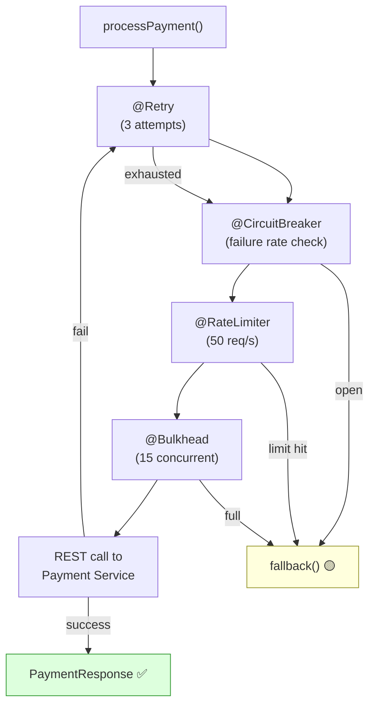
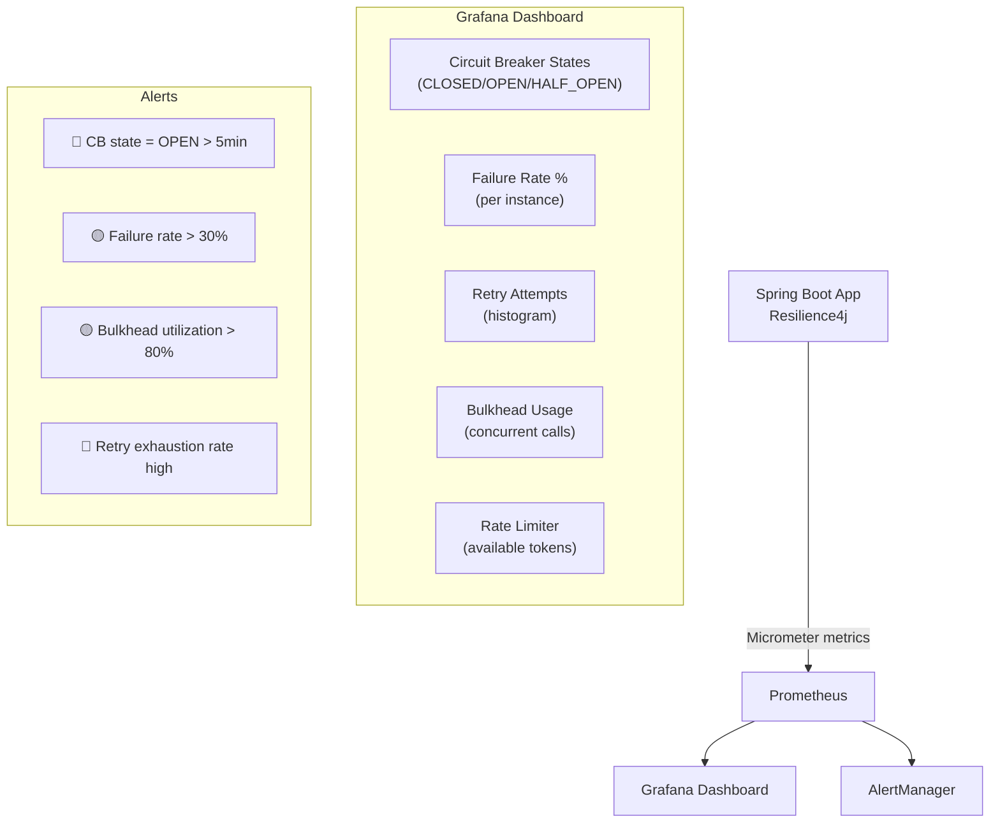

# Resiliency — Part 3: Spring Boot Integration

Resilience4j Spring Boot starter, annotation-driven configuration,
YAML config, programmatic API, Actuator endpoints, Prometheus metrics,
testing, and production-grade patterns.

> This is Part 3 of 4. See also:
> - [Part 1: Resiliency Fundamentals](./01-Resiliency-Fundamentals.md)
> - [Part 2: Resilience4j Deep Dive](./02-Resilience4j-Deep-Dive.md)
> - [Part 4: Interview Scenarios](./04-Resilience4j-Interview-Scenarios.md)

---

## 1. Setup

### Dependencies (Maven)

```xml
<dependency>
    <groupId>io.github.resilience4j</groupId>
    <artifactId>resilience4j-spring-boot3</artifactId>
    <version>2.2.0</version>
</dependency>
<dependency>
    <groupId>org.springframework.boot</groupId>
    <artifactId>spring-boot-starter-aop</artifactId>
</dependency>
<dependency>
    <groupId>org.springframework.boot</groupId>
    <artifactId>spring-boot-starter-actuator</artifactId>
</dependency>
<!-- Metrics export to Prometheus -->
<dependency>
    <groupId>io.github.resilience4j</groupId>
    <artifactId>resilience4j-micrometer</artifactId>
</dependency>
```

```text
IMPORTANT: spring-boot-starter-aop is REQUIRED.
Resilience4j annotations (@CircuitBreaker, @Retry, etc.)
work via Spring AOP proxies. Without AOP, annotations are ignored.
```

---

## 2. YAML Configuration — Complete Production Config

```yaml
resilience4j:

  # ── Circuit Breaker ──
  circuitbreaker:
    configs:
      default:
        slidingWindowType: COUNT_BASED
        slidingWindowSize: 100
        minimumNumberOfCalls: 20
        failureRateThreshold: 50
        slowCallRateThreshold: 80
        slowCallDurationThreshold: 3s
        waitDurationInOpenState: 30s
        permittedNumberOfCallsInHalfOpenState: 5
        automaticTransitionFromOpenToHalfOpenEnabled: true
        recordExceptions:
          - java.io.IOException
          - java.net.ConnectException
          - java.util.concurrent.TimeoutException
          - org.springframework.web.client.HttpServerErrorException
        ignoreExceptions:
          - com.example.exception.BusinessException
          - org.springframework.web.client.HttpClientErrorException

    instances:
      paymentService:
        baseConfig: default
        failureRateThreshold: 40
        waitDurationInOpenState: 60s

      inventoryService:
        baseConfig: default
        slidingWindowSize: 50
        minimumNumberOfCalls: 10

  # ── Retry ──
  retry:
    configs:
      default:
        maxAttempts: 3
        waitDuration: 1s
        enableExponentialBackoff: true
        exponentialBackoffMultiplier: 2
        enableRandomizedWait: true
        randomizedWaitFactor: 0.5
        retryExceptions:
          - java.io.IOException
          - java.net.ConnectException
          - java.util.concurrent.TimeoutException
        ignoreExceptions:
          - com.example.exception.BusinessException

    instances:
      paymentService:
        baseConfig: default
        maxAttempts: 4
        waitDuration: 2s

      inventoryService:
        baseConfig: default

  # ── Rate Limiter ──
  ratelimiter:
    configs:
      default:
        limitForPeriod: 100
        limitRefreshPeriod: 1s
        timeoutDuration: 0s

    instances:
      externalApiLimiter:
        baseConfig: default
        limitForPeriod: 50

  # ── Bulkhead ──
  bulkhead:
    configs:
      default:
        maxConcurrentCalls: 25
        maxWaitDuration: 0s

    instances:
      paymentService:
        baseConfig: default
        maxConcurrentCalls: 15

      inventoryService:
        baseConfig: default
        maxConcurrentCalls: 20

  # ── Time Limiter ──
  timelimiter:
    configs:
      default:
        timeoutDuration: 5s
        cancelRunningFuture: true

    instances:
      paymentService:
        baseConfig: default
        timeoutDuration: 3s
```

```text
CONFIGURATION HIERARCHY:
  configs.default → base template, shared defaults
  instances.xxx   → per-instance overrides
  baseConfig      → which config template to extend

  Example:
    paymentService inherits from "default" config
    but overrides failureRateThreshold to 40 (instead of 50)
```

---

## 3. Annotation-Driven Usage

### @CircuitBreaker

```java
@Service
@Slf4j
public class PaymentServiceClient {

    private final RestClient restClient;

    @CircuitBreaker(name = "paymentService", fallbackMethod = "paymentFallback")
    public PaymentResponse processPayment(PaymentRequest request) {
        return restClient.post()
            .uri("/api/payments")
            .body(request)
            .retrieve()
            .body(PaymentResponse.class);
    }

    // Fallback method: MUST have same return type + Exception parameter
    private PaymentResponse paymentFallback(PaymentRequest request, Exception ex) {
        log.warn("Payment circuit breaker fallback for order {}: {}",
            request.getOrderId(), ex.getMessage());
        return PaymentResponse.builder()
            .status("PENDING")
            .message("Payment service temporarily unavailable")
            .build();
    }
}
```

### @Retry

```java
@Service
@Slf4j
public class InventoryServiceClient {

    @Retry(name = "inventoryService", fallbackMethod = "inventoryFallback")
    public StockResponse checkStock(String productId) {
        log.info("Checking stock for product {}", productId);
        return restClient.get()
            .uri("/api/inventory/{id}", productId)
            .retrieve()
            .body(StockResponse.class);
    }

    private StockResponse inventoryFallback(String productId, Exception ex) {
        log.warn("Inventory retry exhausted for {}: {}", productId, ex.getMessage());
        return StockResponse.unknown(productId);
    }
}
```

### @Bulkhead

```java
@Service
public class NotificationClient {

    @Bulkhead(name = "notificationService", fallbackMethod = "notifyFallback")
    public void sendNotification(NotificationRequest request) {
        restClient.post()
            .uri("/api/notifications")
            .body(request)
            .retrieve()
            .toBodilessEntity();
    }

    private void notifyFallback(NotificationRequest request, Exception ex) {
        log.warn("Notification bulkhead full, queuing for later: {}",
            request.getUserId());
        notificationQueue.add(request);  // queue for async retry
    }
}
```

### @RateLimiter

```java
@Service
public class ExternalApiClient {

    @RateLimiter(name = "externalApiLimiter", fallbackMethod = "rateLimitFallback")
    public ExchangeRate getExchangeRate(String currency) {
        return restClient.get()
            .uri("https://api.exchange.com/rates/{currency}", currency)
            .retrieve()
            .body(ExchangeRate.class);
    }

    private ExchangeRate rateLimitFallback(String currency, Exception ex) {
        log.warn("Rate limit reached for exchange API, using cached rate");
        return exchangeRateCache.getLatest(currency);
    }
}
```

### Combining Multiple Annotations

```java
@Service
@Slf4j
public class PaymentServiceClient {

    // Execution order: Retry → CircuitBreaker → RateLimiter → Bulkhead
    // (outermost annotation executes first)

    @CircuitBreaker(name = "paymentService", fallbackMethod = "fallback")
    @Retry(name = "paymentService")
    @Bulkhead(name = "paymentService")
    @RateLimiter(name = "paymentService")
    public PaymentResponse processPayment(PaymentRequest request) {
        return restClient.post()
            .uri("/api/payments")
            .body(request)
            .retrieve()
            .body(PaymentResponse.class);
    }

    private PaymentResponse fallback(PaymentRequest request, Exception ex) {
        log.error("All resilience mechanisms failed for order {}: {}",
            request.getOrderId(), ex.getClass().getSimpleName());

        if (ex instanceof CallNotPermittedException) {
            return PaymentResponse.circuitOpen("Payment service down");
        }
        if (ex instanceof BulkheadFullException) {
            return PaymentResponse.overloaded("Too many concurrent requests");
        }
        if (ex instanceof RequestNotPermitted) {
            return PaymentResponse.rateLimited("Rate limit exceeded");
        }
        return PaymentResponse.error("Payment temporarily unavailable");
    }
}
```



---

## 4. Fallback Method Rules

```text
RULES FOR FALLBACK METHODS:

  1. SAME CLASS: fallback must be in the same class (or superclass)

  2. SAME RETURN TYPE: must return the same type as the decorated method

  3. SAME PARAMETERS + Exception: must accept the same parameters
     PLUS an Exception parameter as the last argument

  4. SPECIFIC EXCEPTIONS: you can have multiple fallbacks for
     different exception types (most specific wins)

  5. ACCESSIBILITY: can be private (Spring AOP uses CGLIB proxy)

EXAMPLES:
```

```java
// Method signature
public PaymentResponse processPayment(PaymentRequest request) { ... }

// ✅ Correct fallback
private PaymentResponse fallback(PaymentRequest request, Exception ex) { ... }

// ✅ Specific exception fallback (takes priority)
private PaymentResponse fallback(PaymentRequest request, CallNotPermittedException ex) {
    return PaymentResponse.circuitOpen();
}

// ✅ Another specific fallback
private PaymentResponse fallback(PaymentRequest request, TimeoutException ex) {
    return PaymentResponse.timeout();
}

// ❌ Wrong: different return type
private String fallback(PaymentRequest request, Exception ex) { ... }

// ❌ Wrong: missing Exception parameter
private PaymentResponse fallback(PaymentRequest request) { ... }
```

---

## 5. Actuator Endpoints

```yaml
# application.yml — expose resilience4j actuator endpoints
management:
  endpoints:
    web:
      exposure:
        include: health, circuitbreakers, circuitbreakerevents,
                 retries, retryevents, ratelimiters, bulkheads
  health:
    circuitbreakers:
      enabled: true
    ratelimiters:
      enabled: true
```

```text
AVAILABLE ENDPOINTS:

  GET /actuator/circuitbreakers
    Lists all circuit breaker instances and their current state.

  GET /actuator/circuitbreakers/{name}
    Details for a specific circuit breaker.

  GET /actuator/circuitbreakerevents
    Recent events (state transitions, calls, failures).

  GET /actuator/circuitbreakerevents/{name}
    Events for a specific circuit breaker.

  GET /actuator/retries
    Lists all retry instances.

  GET /actuator/retryevents/{name}
    Retry events (attempts, successes, failures).

  GET /actuator/health
    Includes circuit breaker state in health check.
    Circuit breaker OPEN → health status DOWN (configurable).

EXAMPLE RESPONSE:
  GET /actuator/circuitbreakers/paymentService

  {
    "name": "paymentService",
    "state": "CLOSED",
    "failureRate": 12.5,
    "slowCallRate": 5.0,
    "bufferedCalls": 40,
    "failedCalls": 5,
    "slowCalls": 2,
    "notPermittedCalls": 0
  }
```

---

## 6. Prometheus Metrics

```text
With resilience4j-micrometer, metrics are automatically exported:

CIRCUIT BREAKER METRICS:
  resilience4j_circuitbreaker_state
    gauge: 0=CLOSED, 1=OPEN, 2=HALF_OPEN
  resilience4j_circuitbreaker_calls_seconds_count
    counter: total calls (tagged: kind=successful/failed/not_permitted)
  resilience4j_circuitbreaker_calls_seconds_sum
    counter: total duration of calls
  resilience4j_circuitbreaker_failure_rate
    gauge: current failure rate percentage
  resilience4j_circuitbreaker_slow_call_rate
    gauge: current slow call rate percentage

RETRY METRICS:
  resilience4j_retry_calls_total
    counter: tagged with kind=successful_without_retry,
    successful_with_retry, failed_without_retry, failed_with_retry

BULKHEAD METRICS:
  resilience4j_bulkhead_available_concurrent_calls
    gauge: available permits
  resilience4j_bulkhead_max_allowed_concurrent_calls
    gauge: maximum permits

RATE LIMITER METRICS:
  resilience4j_ratelimiter_available_permissions
    gauge: available tokens
  resilience4j_ratelimiter_waiting_threads
    gauge: threads waiting for permission
```



---

## 7. RestClient / WebClient Integration

### RestClient with Resilience4j (Spring Boot 3.2+)

```java
@Configuration
public class RestClientConfig {

    @Bean
    public RestClient paymentRestClient() {
        return RestClient.builder()
            .baseUrl("http://payment-service:8080")
            .requestFactory(clientHttpRequestFactory())
            .build();
    }

    private ClientHttpRequestFactory clientHttpRequestFactory() {
        HttpComponentsClientHttpRequestFactory factory =
            new HttpComponentsClientHttpRequestFactory();
        factory.setConnectTimeout(Duration.ofSeconds(3));
        factory.setReadTimeout(Duration.ofSeconds(5));
        return factory;
    }
}

// Service using RestClient + Resilience4j annotations
@Service
public class PaymentClient {

    private final RestClient paymentRestClient;

    @CircuitBreaker(name = "paymentService", fallbackMethod = "fallback")
    @Retry(name = "paymentService")
    public PaymentResponse charge(PaymentRequest request) {
        return paymentRestClient.post()
            .uri("/api/payments")
            .contentType(MediaType.APPLICATION_JSON)
            .body(request)
            .retrieve()
            .body(PaymentResponse.class);
    }

    private PaymentResponse fallback(PaymentRequest request, Exception ex) {
        return PaymentResponse.unavailable();
    }
}
```

### WebClient (Reactive) with Resilience4j

```java
@Service
public class ReactivePaymentClient {

    private final WebClient webClient;
    private final CircuitBreaker circuitBreaker;
    private final Retry retry;

    public Mono<PaymentResponse> charge(PaymentRequest request) {
        return webClient.post()
            .uri("/api/payments")
            .bodyValue(request)
            .retrieve()
            .bodyToMono(PaymentResponse.class)
            .transformDeferred(CircuitBreakerOperator.of(circuitBreaker))
            .transformDeferred(RetryOperator.of(retry))
            .onErrorResume(ex -> Mono.just(PaymentResponse.unavailable()));
    }
}
```

---

## 8. Testing Resilience4j

### Unit Testing Circuit Breaker

```java
@SpringBootTest
class PaymentClientCircuitBreakerTest {

    @Autowired
    private PaymentClient paymentClient;

    @Autowired
    private CircuitBreakerRegistry circuitBreakerRegistry;

    @MockBean
    private RestClient paymentRestClient;

    @Test
    void shouldOpenCircuitAfterFailures() {
        CircuitBreaker cb = circuitBreakerRegistry
            .circuitBreaker("paymentService");

        // Configure: failureRate=50%, minimumCalls=10
        // Simulate 10 failures
        for (int i = 0; i < 10; i++) {
            when(paymentRestClient.post()...)
                .thenThrow(new HttpServerErrorException(HttpStatus.INTERNAL_SERVER_ERROR));

            try {
                paymentClient.charge(new PaymentRequest());
            } catch (Exception ignored) {}
        }

        // Circuit should be OPEN
        assertThat(cb.getState()).isEqualTo(CircuitBreaker.State.OPEN);
    }

    @Test
    void shouldReturnFallbackWhenCircuitOpen() {
        CircuitBreaker cb = circuitBreakerRegistry
            .circuitBreaker("paymentService");

        // Force circuit open
        cb.transitionToOpenState();

        PaymentResponse response = paymentClient.charge(new PaymentRequest());

        assertThat(response.getStatus()).isEqualTo("UNAVAILABLE");
    }

    @Test
    void shouldRecoverInHalfOpenState() {
        CircuitBreaker cb = circuitBreakerRegistry
            .circuitBreaker("paymentService");

        cb.transitionToOpenState();
        cb.transitionToHalfOpenState();

        // Simulate successful test calls
        when(paymentRestClient.post()...)
            .thenReturn(PaymentResponse.success());

        for (int i = 0; i < 5; i++) {
            paymentClient.charge(new PaymentRequest());
        }

        assertThat(cb.getState()).isEqualTo(CircuitBreaker.State.CLOSED);
    }
}
```

### Testing Retry Behavior

```java
@Test
void shouldRetryOnTransientFailure() {
    AtomicInteger attempts = new AtomicInteger(0);

    when(paymentRestClient.post()...).thenAnswer(invocation -> {
        if (attempts.incrementAndGet() < 3) {
            throw new HttpServerErrorException(HttpStatus.SERVICE_UNAVAILABLE);
        }
        return PaymentResponse.success();
    });

    PaymentResponse response = paymentClient.charge(new PaymentRequest());

    assertThat(response.getStatus()).isEqualTo("SUCCESS");
    assertThat(attempts.get()).isEqualTo(3);  // 1 initial + 2 retries
}
```

### Integration Test with WireMock

```java
@SpringBootTest
@WireMockTest(httpPort = 8089)
class PaymentClientIntegrationTest {

    @Autowired
    private PaymentClient paymentClient;

    @Autowired
    private CircuitBreakerRegistry circuitBreakerRegistry;

    @BeforeEach
    void reset() {
        circuitBreakerRegistry.circuitBreaker("paymentService").reset();
    }

    @Test
    void shouldFallbackWhenServiceReturns500() {
        stubFor(post("/api/payments")
            .willReturn(serverError()));

        PaymentResponse response = paymentClient.charge(
            new PaymentRequest("order-1", 100));

        assertThat(response.getStatus()).isEqualTo("UNAVAILABLE");
    }

    @Test
    void shouldRetryOnTimeout() {
        stubFor(post("/api/payments")
            .willReturn(ok()
                .withFixedDelay(10000)));  // 10s delay > read timeout

        // Will retry 3 times, then fallback
        PaymentResponse response = paymentClient.charge(
            new PaymentRequest("order-1", 100));

        assertThat(response.getStatus()).isEqualTo("UNAVAILABLE");
        verify(3, postRequestedFor(urlEqualTo("/api/payments")));
    }
}
```

---

## 9. Production Patterns

### Pattern: Per-Service Circuit Breaker

```java
// Each downstream service gets its OWN circuit breaker instance
// NEVER share a circuit breaker across different services

@CircuitBreaker(name = "paymentService")      // separate CB
public PaymentResponse charge(...) { ... }

@CircuitBreaker(name = "inventoryService")    // separate CB
public StockResponse checkStock(...) { ... }

@CircuitBreaker(name = "notificationService") // separate CB
public void sendNotification(...) { ... }

// WHY: if payment is down, inventory should not be affected.
// A shared CB would open for ALL services when ONE fails.
```

### Pattern: Graceful Degradation Hierarchy

```java
@Service
public class ProductRecommendationService {

    @CircuitBreaker(name = "mlService", fallbackMethod = "fallbackToRules")
    public List<Product> getPersonalized(String userId) {
        return mlServiceClient.getRecommendations(userId);
    }

    // Level 1 fallback: rule-based recommendations
    private List<Product> fallbackToRules(String userId, Exception ex) {
        log.warn("ML service unavailable, using rule-based: {}", ex.getMessage());
        return ruleEngine.getRecommendations(userId);
    }

    // If rule engine also fails → cached/popular items
    // (implement in ruleEngine with its own @CircuitBreaker)
}
```

### Pattern: Health-Aware Load Balancing

```text
Combine Resilience4j circuit breaker state with service discovery:

  If circuit breaker for instance A is OPEN:
    Remove instance A from the load balancer pool
    Route traffic to instances B, C, D
    When CB transitions to HALF_OPEN → re-add to pool cautiously

  Spring Cloud LoadBalancer can use circuit breaker state
  as a health indicator for routing decisions.
```

### Pattern: Monitoring and Alerting Setup

```text
DASHBOARD (Grafana):
  Row 1: Circuit Breaker States
    - Panel per service: CLOSED=green, OPEN=red, HALF_OPEN=yellow
    - Failure rate gauge (0-100%)

  Row 2: Call Metrics
    - Successful vs failed vs not-permitted calls (stacked bar)
    - Call duration p50, p95, p99 (line chart)

  Row 3: Retry & Bulkhead
    - Retry attempts distribution
    - Bulkhead utilization (concurrent calls / max)
    - Rate limiter available tokens

ALERTS:
  🔴 CRITICAL: Circuit breaker OPEN for > 5 minutes
  🔴 CRITICAL: Retry exhaustion rate > 10% for > 3 minutes
  🟡 WARNING:  Failure rate > 30% for > 2 minutes
  🟡 WARNING:  Bulkhead utilization > 80% for > 5 minutes
  🟡 WARNING:  Rate limiter rejections > 0 for > 1 minute
```

---

## 10. Common Pitfalls

```text
1. SELF-INVOCATION TRAP:
   @CircuitBreaker only works when called from OUTSIDE the class.
   Calling a @CircuitBreaker method from within the same class
   bypasses the Spring AOP proxy → annotations ignored.

   ❌ this.processPayment(request);  // bypasses proxy
   ✅ Inject the service and call through the proxy
   ✅ Or use programmatic API instead of annotations

2. FALLBACK IN DIFFERENT CLASS:
   Fallback method must be in the same class or superclass.
   A fallback in a different bean won't work.

3. MISSING spring-boot-starter-aop:
   Without AOP dependency, all annotations are silently ignored.
   No errors, no warnings — just no resilience.

4. SHARED CIRCUIT BREAKER NAMES:
   Using the same CB name for different services means one
   failing service opens the circuit for all. Use unique names.

5. RETRYING NON-IDEMPOTENT OPERATIONS:
   Retrying a POST /charge without an idempotency key →
   customer charged multiple times.

6. TOO-AGGRESSIVE CIRCUIT BREAKER:
   minimumNumberOfCalls too low (e.g., 5) → circuit opens on
   a few random failures. Set to at least 10-20.

7. NOT CONFIGURING recordExceptions:
   By default ALL exceptions trip the circuit.
   Business validation errors (400) should NOT trip the circuit.
   Configure recordExceptions or ignoreExceptions.

8. TIMEOUT MISMATCH:
   RestClient timeout = 10s, but TimeLimiter timeout = 3s.
   TimeLimiter cancels the Future, but the HTTP connection stays
   open until RestClient timeout. Resource leak.
   Set HTTP client timeout ≤ TimeLimiter timeout.
```

---

## 11. Interview Questions — Spring Boot Integration

### Q1: How do Resilience4j annotations work in Spring Boot?

```text
They work via Spring AOP (Aspect-Oriented Programming).
The resilience4j-spring-boot3 starter registers AOP aspects that
intercept calls to annotated methods.

When you call a @CircuitBreaker method:
  1. Spring AOP proxy intercepts the call
  2. Resilience4j aspect wraps the call with the circuit breaker
  3. If circuit is CLOSED → call proceeds normally
  4. If circuit is OPEN → CallNotPermittedException → fallback invoked
  5. Result/exception is recorded in the sliding window

Requires: spring-boot-starter-aop dependency.
Limitation: self-invocation bypasses the proxy (same as @Transactional).
```

### Q2: How do you configure different circuit breakers for different services?

```text
Define named instances in application.yml:

  resilience4j.circuitbreaker.instances:
    paymentService:
      failureRateThreshold: 40
      waitDurationInOpenState: 60s
    inventoryService:
      failureRateThreshold: 50
      waitDurationInOpenState: 30s

Use the instance name in the annotation:
  @CircuitBreaker(name = "paymentService")
  @CircuitBreaker(name = "inventoryService")

Use shared configs with baseConfig for common defaults.
Each service gets independent state tracking.
```

### Q3: What happens when you stack multiple Resilience4j annotations?

```text
Resilience4j has a defined aspect order (configurable):
  Retry → CircuitBreaker → RateLimiter → TimeLimiter → Bulkhead

This means Retry is the outermost decorator.
Each retry attempt passes through the circuit breaker.
If the circuit opens during retries, subsequent retries fail fast.

The order can be customized in config:
  resilience4j.circuitbreaker.circuitBreakerAspectOrder: 1
  resilience4j.retry.retryAspectOrder: 2
  (lower number = higher priority = outer position)
```

### Q4: How do you test circuit breaker behavior?

```text
Three approaches:

1. Unit test: inject CircuitBreakerRegistry, force state transitions
   cb.transitionToOpenState() → verify fallback is called
   cb.transitionToHalfOpenState() → verify test calls go through

2. Integration test with WireMock: simulate downstream failures
   Stub responses with 500/timeout → verify CB opens after N failures

3. Reset between tests: cb.reset() to clear state between test cases

Key assertions:
  - CB state transitions (CLOSED → OPEN → HALF_OPEN → CLOSED)
  - Fallback invoked when CB is open
  - Retry count matches configuration
  - Metrics recorded correctly
```

### Q5: What is the self-invocation problem with Resilience4j annotations?

```text
If method A in class X calls method B (annotated with @CircuitBreaker)
in the SAME class X, the annotation is BYPASSED.

Why: Spring AOP creates a proxy around the bean. Internal calls
don't go through the proxy.

Solutions:
  1. Move the annotated method to a SEPARATE service class
  2. Inject self: @Autowired private MyService self; self.method();
  3. Use programmatic API (no annotations)
  4. Use AspectJ weaving instead of Spring AOP (complex)

This is the same problem as @Transactional self-invocation.
```
