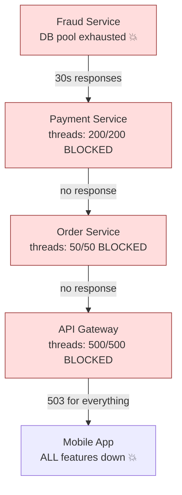
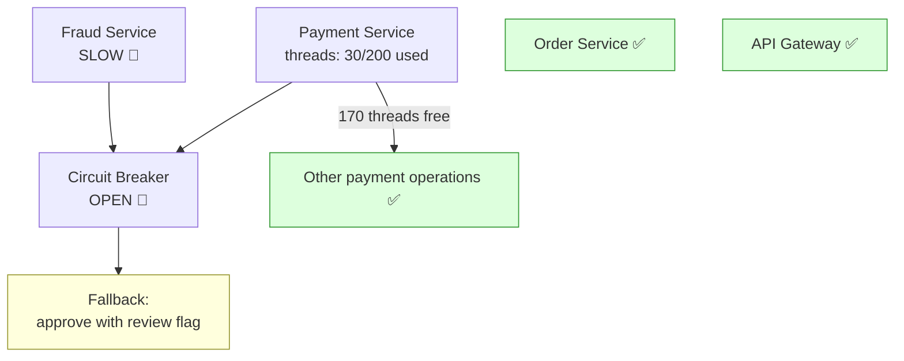
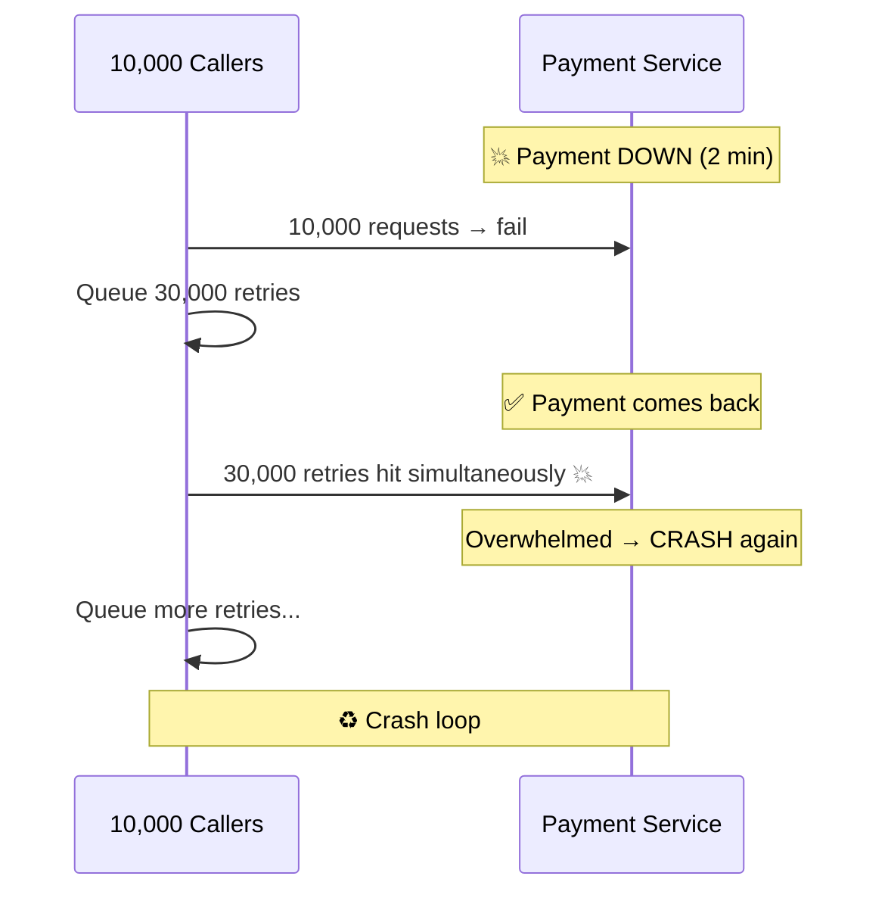
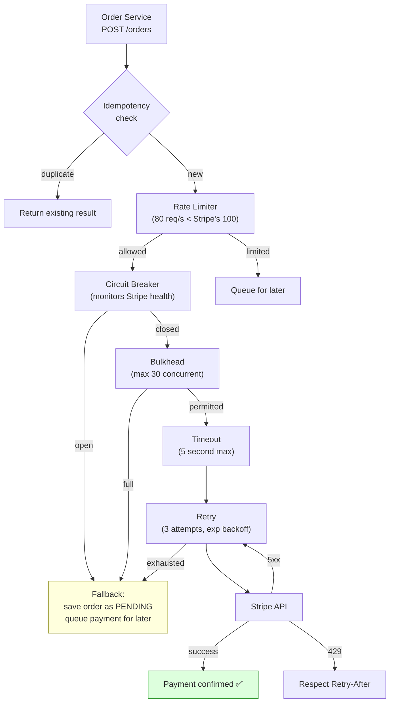
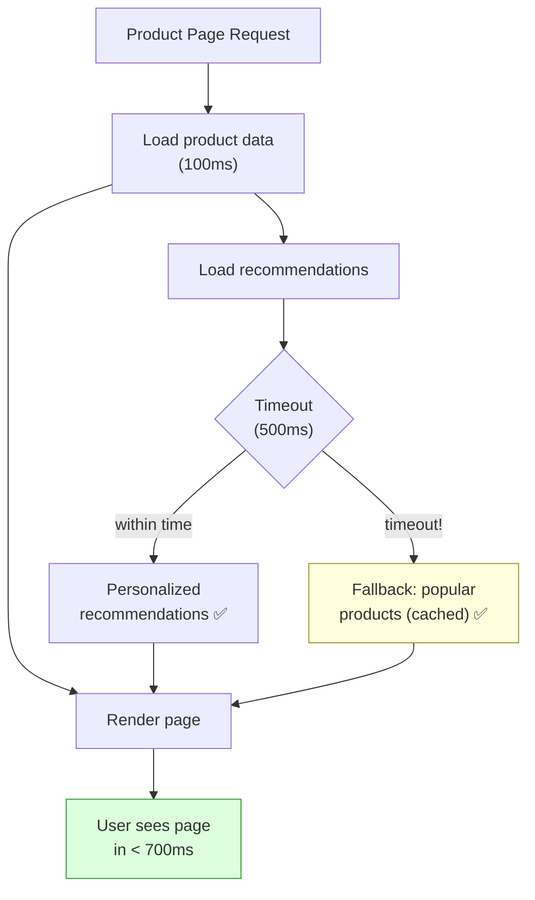
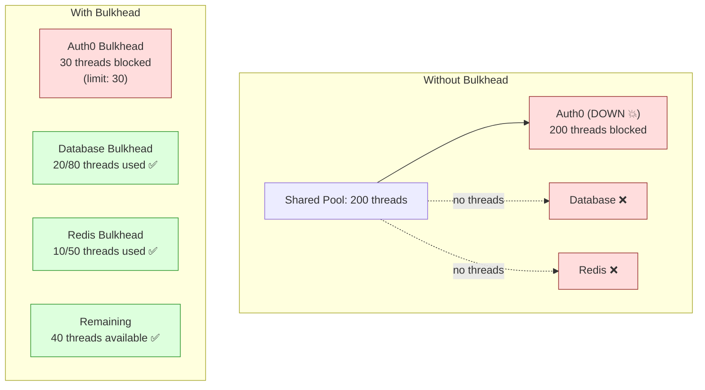
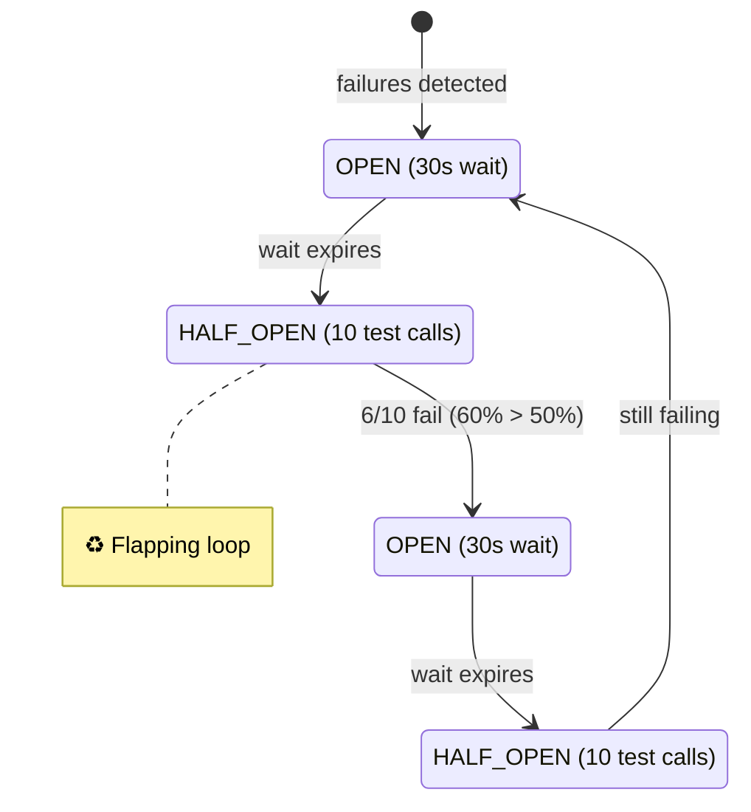
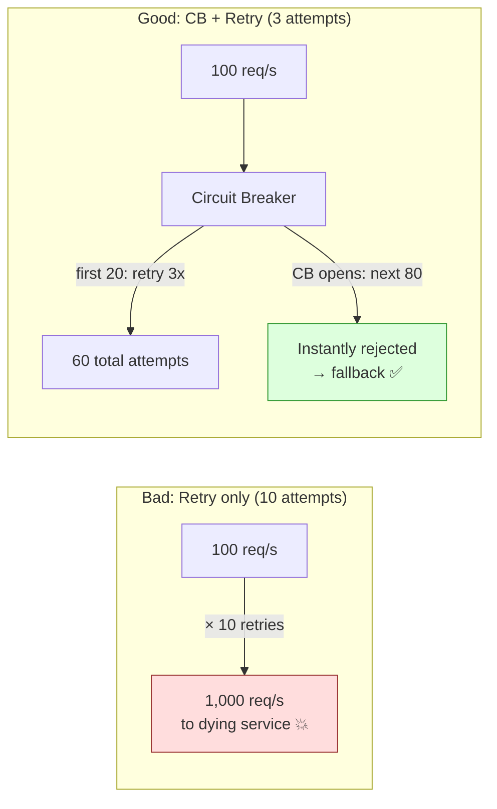
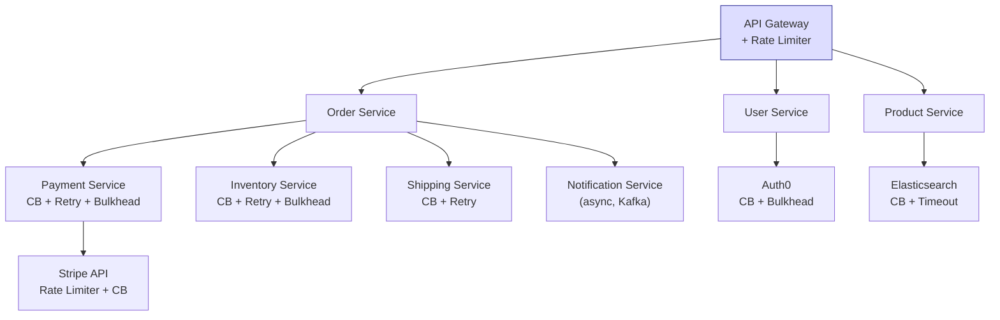
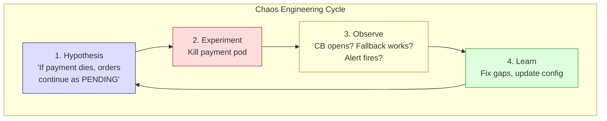

# Resiliency — Part 4: Interview Scenario-Based Problems

Real-world scenarios tested at SDE2/SDE3 level covering cascading
failures, circuit breaker design, retry storms, bulkhead isolation,
production debugging, and resilience architecture decisions.

> This is Part 4 of 4. See also:
> - [Part 1: Resiliency Fundamentals](./01-Resiliency-Fundamentals.md)
> - [Part 2: Resilience4j Deep Dive](./02-Resilience4j-Deep-Dive.md)
> - [Part 3: Spring Boot Integration](./03-Resilience4j-Spring-Boot.md)

---

## Scenario 1: Cascading Failure Takes Down the Entire Platform

```text
PROBLEM:
  "Our fraud detection microservice had a database connection pool
  exhaustion issue. Within 5 minutes, the Order Service, Payment
  Service, API Gateway, and even the mobile app became unresponsive.
  All services were healthy except fraud detection. How did one
  service take down everything?"

WHAT THEY'RE TESTING:
  - Understanding of cascading failures
  - Thread pool exhaustion
  - Timeout and circuit breaker necessity

ANSWER:

  THE CASCADE:

  1. Fraud Detection DB connections exhausted
     → Fraud service responds in 30s instead of 200ms

  2. Payment Service calls Fraud Service
     → Each request blocks a thread for 30 seconds
     → 200-thread pool exhausted in 7 seconds (200 / 30 ≈ 7)
     → Payment Service can't handle ANY requests

  3. Order Service calls Payment Service
     → Payment not responding → Order threads blocked
     → Order Service thread pool exhausted

  4. API Gateway calls Order Service
     → Same cascade → Gateway thread pool exhausted
     → ALL endpoints (including healthy ones like product catalog) DOWN

  5. Mobile app: "Something went wrong" for ALL features

  ONE SERVICE → ENTIRE PLATFORM DOWN.
```



```text
  FIXES (defense in depth):

  1. TIMEOUTS on all outgoing calls:
     Payment → Fraud: 3 second read timeout
     Order → Payment: 5 second read timeout
     Gateway → Order: 10 second read timeout
     Ensures threads are freed even if downstream is slow.

  2. CIRCUIT BREAKER on Payment → Fraud:
     If fraud service is slow/failing → open circuit → fast fail
     → Payment threads freed → Payment stays healthy

  3. BULKHEAD — isolate Fraud calls:
     Dedicate 30 threads for fraud calls, 170 for other work.
     Even if all 30 are blocked → 170 threads handle other requests.

  4. FALLBACK for fraud check:
     Circuit open → allow order with "pending_review" flag.
     Review manually later. Business continues.

  5. Each layer has its own protection:
     Don't rely on one layer. Defense in depth.
```



---

## Scenario 2: Retry Storm Kills Recovering Service

```text
PROBLEM:
  "Our payment service went down for 2 minutes. When it came back,
  it immediately crashed again. This cycle repeated 4 times before
  we disabled retries manually. What happened?"

WHAT THEY'RE TESTING:
  - Understanding of retry storms / thundering herd
  - Exponential backoff with jitter
  - Circuit breaker + retry interaction

ANSWER:

  THE RETRY STORM:

  1. Payment service goes down for 2 minutes.
  2. During those 2 minutes, 10,000 requests arrive.
  3. Each request is retried 3 times by the caller.
  4. That's 10,000 × 3 = 30,000 retry attempts queued up.
  5. Payment service comes back up.
  6. 30,000 retries FLOOD the payment service simultaneously.
  7. Payment service overwhelmed → crashes again.
  8. Repeat cycle.

  This is the THUNDERING HERD problem applied to retries.
```



```text
  FIXES:

  1. EXPONENTIAL BACKOFF + JITTER:
     Each client retries at DIFFERENT times.
     Client A: retry at 1.2s, 2.8s, 5.1s
     Client B: retry at 0.9s, 2.3s, 4.7s
     Spreads the load. No thundering herd.

  2. CIRCUIT BREAKER:
     After initial failures → circuit OPENS.
     10,000 retries → most rejected instantly (circuit open).
     Only permittedNumberOfCallsInHalfOpenState (e.g., 5) reach the server.
     Server gets 5 test requests, not 30,000.

  3. RATE LIMITER on the caller:
     Even if circuit is closed, limit outgoing calls to 100/sec.
     Server ramps up gradually, not slammed all at once.

  4. MAX RETRY ATTEMPTS:
     3 retries, not infinite. After 3 → give up → fallback.

  5. SERVER-SIDE RATE LIMITING:
     Payment service limits incoming requests.
     Returns 429 Too Many Requests with Retry-After header.
     Caller respects the header.
```

---

## Scenario 3: Circuit Breaker Opens Due to Bad Deployments

```text
PROBLEM:
  "We deployed a new version of our inventory service. It has a bug
  that returns 400 Bad Request for 30% of requests. Our circuit
  breaker opened and ALL inventory calls started failing — even the
  70% that would have succeeded."

WHAT THEY'RE TESTING:
  - Configuring recordExceptions vs ignoreExceptions
  - Understanding what should trip a circuit breaker

ANSWER:

  ROOT CAUSE:
  By default, Resilience4j counts ALL exceptions as failures.
  HTTP 400 (client error) is being recorded as a failure.
  30% failure rate > threshold → circuit opens → 100% of calls fail.

  But 400 is a CLIENT error — the inventory service is working fine.
  The bug is in the caller's request format, not the server.

  FIX:

  1. CONFIGURE WHAT COUNTS AS A FAILURE:
     Only count SERVER errors (5xx) and infrastructure errors.
     IGNORE client errors (4xx) — they don't mean the server is down.

     resilience4j.circuitbreaker.instances.inventoryService:
       recordExceptions:
         - java.io.IOException
         - java.net.ConnectException
         - org.springframework.web.client.HttpServerErrorException
       ignoreExceptions:
         - org.springframework.web.client.HttpClientErrorException

  2. OR USE A CUSTOM PREDICATE:

     recordFailurePredicate: (throwable) -> {
         if (throwable instanceof HttpStatusCodeException ex) {
             return ex.getStatusCode().is5xxServerError();
         }
         return true;  // non-HTTP errors count as failures
     }

  3. RESULT:
     400 errors → ignored by circuit breaker
     500/503 errors → counted as failures
     Circuit breaker opens ONLY when the server is actually unhealthy.

  LESSON: Always configure recordExceptions/ignoreExceptions.
  Default "all exceptions = failure" is dangerous in production.
```

---

## Scenario 4: Designing Resilience for a Payment Gateway

```text
PROBLEM:
  "Design the resilience strategy for an order service that calls a
  payment gateway (Stripe). Requirements:
    - Never charge a customer twice
    - Handle Stripe outages gracefully
    - Handle Stripe rate limits (100 req/s)
    - Continue accepting orders even if Stripe is down"

WHAT THEY'RE TESTING:
  - Complete resilience design
  - Combining multiple patterns
  - Idempotency + resilience

ANSWER:
```



```text
  COMPONENT DESIGN:

  1. IDEMPOTENCY (prevent double charge):
     - Generate idempotencyKey = orderId before calling Stripe
     - Pass to Stripe: stripe.charges.create({idempotencyKey: orderId})
     - Stripe guarantees: same key = same charge (no duplicates)
     - Also: store payment attempt in DB before calling Stripe

  2. RATE LIMITER (respect Stripe's limits):
     - Stripe allows 100 req/s
     - Set our limit to 80 req/s (20% headroom)
     - If exceeded: queue the payment for async processing

  3. CIRCUIT BREAKER (detect Stripe outage):
     - failureRateThreshold: 50%
     - slowCallRateThreshold: 80% (Stripe > 5s = degraded)
     - slidingWindowSize: 50 (count-based)
     - waitDurationInOpenState: 30s
     - Only record: 5xx, timeout, connection errors
     - Ignore: 4xx (validation errors, not Stripe's fault)

  4. BULKHEAD (limit concurrent Stripe calls):
     - maxConcurrentCalls: 30
     - Prevents too many open connections to Stripe
     - If full: fallback to queued processing

  5. TIMEOUT:
     - Connection timeout: 3s
     - Read timeout: 5s
     - If Stripe doesn't respond in 5s: fail fast

  6. RETRY:
     - 3 attempts with exponential backoff + jitter
     - Only retry on: 5xx, timeout, connection refused
     - Don't retry on: 400, 401, 402 (card declined)
     - Respect 429 Retry-After header

  7. FALLBACK (orders continue even if Stripe is down):
     - Save order with status PAYMENT_PENDING
     - Queue payment for background retry
     - Notify customer: "Order received, payment processing"
     - Background job processes queued payments when Stripe recovers

  8. MONITORING:
     - Circuit breaker state (alert if OPEN > 5 min)
     - Payment failure rate
     - Retry exhaustion rate
     - Queue depth (pending payments)
```

---

## Scenario 5: Slow Dependency Degrades Performance

```text
PROBLEM:
  "Our recommendation service usually responds in 100ms but
  occasionally takes 10+ seconds. When it's slow, our product
  page load time goes from 200ms to 10+ seconds. Users are
  complaining. How do you fix this?"

WHAT THEY'RE TESTING:
  - Timeout pattern
  - Slow call detection
  - Graceful degradation

ANSWER:

  1. SET AN AGGRESSIVE TIMEOUT:
     Recommendation service normal p99 = 200ms.
     Set timeout to 500ms.
     If it takes more → TimeoutException → fallback.

     Product page loads in 200ms + 500ms worst case = 700ms.
     Not 200ms + 10,000ms.

  2. CIRCUIT BREAKER WITH SLOW CALL DETECTION:
     slowCallRateThreshold: 50
     slowCallDurationThreshold: 500ms

     If 50% of calls take > 500ms → circuit opens.
     Subsequent calls get instant fallback → no slow degradation.

  3. FALLBACK — SHOW POPULAR PRODUCTS:
     Instead of personalized recommendations, show:
       - Most popular products (cached)
       - Recently viewed items (from user's session/localStorage)
       - Category-based suggestions (cached, fast query)

     Product page still loads. Experience degraded but functional.

  4. ASYNC / NON-BLOCKING:
     Load recommendations ASYNCHRONOUSLY.
     Product page renders immediately.
     Recommendations load via AJAX when ready.
     If slow → just don't show them. Page is already usable.

  5. MONITOR SLOW CALL RATE:
     Dashboard showing: % of calls exceeding 500ms.
     Alert if > 20% consistently → investigation needed.
```



---

## Scenario 6: Bulkhead Prevents Collateral Damage

```text
PROBLEM:
  "Our user service has three downstream calls: database, cache (Redis),
  and an external identity provider (Auth0). Auth0 went down and our
  user service became completely unresponsive — even for operations
  that don't need Auth0 (like reading user profile from cache).
  How do you prevent this?"

WHAT THEY'RE TESTING:
  - Bulkhead pattern
  - Resource isolation
  - Identifying blast radius

ANSWER:

  ROOT CAUSE:
  All outgoing calls share the same thread pool (Tomcat's 200 threads).
  Auth0 is down → all threads blocked waiting for Auth0 response.
  No threads left for DB queries or cache reads.

  FIX — BULKHEAD ISOLATION:

  Allocate separate capacity for each dependency:
    Auth0 calls:    semaphore bulkhead, maxConcurrentCalls = 30
    Database calls: semaphore bulkhead, maxConcurrentCalls = 80
    Redis calls:    semaphore bulkhead, maxConcurrentCalls = 50
    Remaining:      40 threads for other work

  When Auth0 is down:
    30 threads blocked on Auth0 (bulkhead limit)
    170 threads available for DB, Redis, and other operations
    User profile reads from cache → still fast ✅
    Login/signup → fails with "Auth temporarily unavailable" (fallback)
    But profile, settings, preferences → all working ✅
```



---

## Scenario 7: Half-Open State Keeps Flapping

```text
PROBLEM:
  "Our circuit breaker keeps flipping between OPEN and HALF_OPEN
  every 30 seconds. It never stabilizes to CLOSED. The downstream
  service seems to be intermittently healthy."

WHAT THEY'RE TESTING:
  - Half-open state tuning
  - Understanding of permittedNumberOfCallsInHalfOpenState
  - Flapping mitigation

ANSWER:

  ROOT CAUSE:
  permittedNumberOfCallsInHalfOpenState is too low (default 10).
  In half-open: 10 test calls sent → 4 succeed, 6 fail (60% failure).
  failureRateThreshold is 50% → 60% > 50% → back to OPEN.
  Wait 30s → half-open again → same result → OPEN → flapping.

  The service is working but with 40% error rate.

  FIXES:

  1. INCREASE permittedNumberOfCallsInHalfOpenState:
     Set to 20-50. More test calls → more accurate measurement.
     Less sensitive to individual failures.

  2. ADJUST failureRateThreshold:
     If 40% failure rate is acceptable during recovery: raise to 60%.
     Circuit closes → service gets full traffic → failure rate drops.

  3. INCREASE waitDurationInOpenState:
     Wait longer before testing (60s → 120s).
     Gives service more time to fully recover.

  4. SLOW CALL THRESHOLD TUNING:
     Maybe failures are actually slow calls.
     Separate slowCallRateThreshold from failureRateThreshold.
     Slower but working calls shouldn't keep the circuit open.

  5. MANUAL INVESTIGATION:
     Persistent 40% failure rate is a SERVICE issue, not a CB issue.
     Fix the root cause: why is the service failing 40% of the time?
     CB is a SYMPTOM handler, not a cure.
```



---

## Scenario 8: Rate Limiting an External API

```text
PROBLEM:
  "We integrate with a third-party geocoding API that allows
  50 requests/second. During peak hours, we exceed this limit
  and get HTTP 429 responses. Our service then retries all 429s,
  making it worse. How do you fix this?"

WHAT THEY'RE TESTING:
  - Rate limiter configuration
  - Handling 429 responses properly
  - Caching to reduce API calls

ANSWER:

  FIX (layered approach):

  1. CLIENT-SIDE RATE LIMITER:
     Limit outgoing calls to 40/s (below the 50/s limit).
     Provides 20% headroom.

     @RateLimiter(name = "geocodingApi")
     resilience4j.ratelimiter.instances.geocodingApi:
       limitForPeriod: 40
       limitRefreshPeriod: 1s
       timeoutDuration: 5s  # wait up to 5s for a slot

  2. DON'T RETRY 429s BLINDLY:
     If the API returns Retry-After header: respect it.
     Use intervalBiFunction to read the header.

     Configure retry to EXCLUDE 429:
     retryExceptions:
       - java.io.IOException
       - HttpServerErrorException  (5xx only)
     ignoreExceptions:
       - TooManyRequestsException  (429 — already rate limited)

  3. CACHE RESULTS:
     Geocoding results rarely change.
     Cache address → coordinates mapping (Redis, 24h TTL).
     Cache hit ratio of 80%+ → 80% fewer API calls.

  4. BATCH REQUESTS:
     If API supports batch geocoding: batch addresses into
     one request instead of individual calls.

  5. QUEUE AND SMOOTH:
     During peak: queue requests. Process at steady 40/s.
     Slightly higher latency but no 429 errors.

  6. FALLBACK:
     If rate limit hit + queue full: return approximate location
     from cached nearby addresses or default coordinates.
```

---

## Scenario 9: Choosing Between Retry and Circuit Breaker

```text
PROBLEM:
  "A junior developer added @Retry(maxAttempts=10) to all our
  downstream service calls. When the payment service went down,
  our CPU spiked to 100% and response times went through the roof.
  Why? And what's the right approach?"

WHAT THEY'RE TESTING:
  - Understanding retry vs circuit breaker tradeoffs
  - When NOT to retry
  - Retry amplification

ANSWER:

  WHY IT WENT WRONG:

  Payment service is DOWN (not transient — fully unavailable).
  100 requests/second arriving.
  Each retries 10 times: 100 × 10 = 1,000 requests/second.
  Each waits for timeout (say 5s) → 5,000 seconds of thread time/second.
  CPU busy managing all these blocked threads + retries.
  Memory consumed by stacked retry contexts.

  RETRY AMPLIFICATION:
    Original load:   100 req/s
    With 10 retries:  1,000 req/s (10x amplification!)
    With 5s timeout:  5,000 seconds of blocked time per second

  This is WORSE than no retry — you're DDoS-ing your own service.

  THE RIGHT APPROACH:

  1. USE CIRCUIT BREAKER + RETRY TOGETHER:
     Retry: 3 attempts (not 10!), exponential backoff + jitter.
     Circuit Breaker: if failure rate > 50% → STOP retrying.

     When payment is down:
       First 20 requests: retry 3 times each = 60 attempts.
       Circuit opens (20 failures out of 20 = 100% > 50%).
       Next 80 requests: instantly rejected by CB. No retries.
       Load on payment: 60, not 1,000.

  2. RETRY RULES:
     - Max 3 attempts (1 initial + 2 retries)
     - Exponential backoff + jitter
     - ONLY for transient errors (timeout, 503)
     - NEVER for: 400, 401, 404, business errors
     - Always combine with circuit breaker
```



---

## Scenario 10: Designing Resilience for Microservice Architecture

```text
PROBLEM:
  "You're designing a new e-commerce platform with 8 microservices.
  The CTO asks: 'How do we make sure one failing service doesn't
  take down the whole platform?' Design the resilience strategy."

WHAT THEY'RE TESTING:
  - End-to-end resilience architecture
  - Pattern selection per use case
  - Monitoring and operational readiness

ANSWER:

  ARCHITECTURE:
```



```text
  PER-SERVICE STRATEGY:

  API GATEWAY:
    - Global rate limiter (protect against DDoS, abuse)
    - Per-user rate limiter (fair usage)
    - Timeout: 30s overall request timeout
    - Health checks for routing

  ORDER → PAYMENT (critical path):
    - Circuit Breaker: failureRate=40%, window=50, wait=60s
    - Retry: 3 attempts, exponential backoff + jitter
    - Bulkhead: 30 concurrent calls max
    - Timeout: 5s read timeout
    - Fallback: save as PAYMENT_PENDING, queue for retry
    - Idempotency key for payment

  ORDER → INVENTORY (critical path):
    - Circuit Breaker: failureRate=50%, window=100, wait=30s
    - Retry: 3 attempts
    - Bulkhead: 40 concurrent calls max
    - Timeout: 3s
    - Fallback: optimistic reservation (check later)

  ORDER → SHIPPING (non-critical):
    - Circuit Breaker: failureRate=50%
    - Retry: 2 attempts
    - Timeout: 5s
    - Fallback: queue shipment creation for later

  ORDER → NOTIFICATION (async, fire-and-forget):
    - Publish to Kafka (async, decoupled)
    - No circuit breaker needed (Kafka buffers)
    - Consumer has its own resilience

  USER → AUTH0 (external):
    - Circuit Breaker + Bulkhead
    - Timeout: 3s
    - Fallback: deny access (fail secure) or cached token validation

  PAYMENT → STRIPE (external, rate-limited):
    - Rate Limiter: 80 req/s (Stripe limit: 100)
    - Circuit Breaker
    - Idempotency key per payment
    - Fallback: queue for later processing

  MONITORING (ALL SERVICES):
    - Circuit breaker states → Grafana dashboard
    - Alert: any CB OPEN > 5 min → PagerDuty
    - Alert: retry exhaustion rate > 10%
    - Alert: bulkhead utilization > 80%
    - Consumer lag if using Kafka

  TESTING:
    - Chaos Engineering: randomly kill services, verify degradation
    - Load testing: verify bulkhead/rate limiter under load
    - Integration tests: WireMock simulating timeouts, 500s
    - Circuit breaker state tests: verify fallbacks work
```

---

## Scenario 11: Circuit Breaker for Database Calls

```text
PROBLEM:
  "Should we put a circuit breaker around our database calls?
  Our PostgreSQL database occasionally has connection pool exhaustion.
  The team is debating whether circuit breaker makes sense for DB."

WHAT THEY'RE TESTING:
  - Understanding circuit breaker applicability
  - DB resilience patterns
  - Connection pool management

ANSWER:

  IT DEPENDS. Consider:

  ARGUMENTS FOR:
    - If DB is overloaded, sending more queries makes it worse
    - Circuit breaker can fail fast → free application threads
    - Fallback can return cached data

  ARGUMENTS AGAINST:
    - DB is your primary data store, not an "optional" dependency
    - If DB is down, most operations can't do anything meaningful
    - Fallback options are very limited for writes
    - Connection pool + timeout already provides some protection

  RECOMMENDED APPROACH:

  1. DON'T put CB on individual DB queries.
     Instead, fix the root cause: properly size connection pool,
     set statement timeouts, optimize slow queries.

  2. DO put CB on non-critical DB-backed features:
     E.g., recommendation queries, analytics queries, reporting.
     Fallback: return cached or default data.

  3. FOR CRITICAL WRITES (orders, payments):
     No circuit breaker (no meaningful fallback for "save order").
     Instead: connection pool timeout, statement timeout, retry for
     transient errors (deadlock, connection reset), and health checks.

  4. BETTER DB RESILIENCE PATTERNS:
     - Connection pool: HikariCP with proper maximumPoolSize
     - Statement timeout: SET statement_timeout = '5s'
     - Read replicas: route reads to replicas, writes to primary
     - Connection validation: HikariCP connectionTestQuery
     - Slow query logging and optimization
```

---

## Scenario 12: Chaos Engineering and Resilience Validation

```text
PROBLEM:
  "We've added circuit breakers, retries, and bulkheads to all
  our services. How do we VERIFY they actually work in production?
  We can't wait for a real outage to test them."

WHAT THEY'RE TESTING:
  - Chaos Engineering practices
  - Resilience validation strategies
  - Confidence in production systems

ANSWER:

  1. CHAOS ENGINEERING (Netflix-style):
     Intentionally inject failures in production (or staging).

     Tools:
       - Chaos Monkey: randomly kills instances
       - Toxiproxy: inject latency, timeouts, connection errors
       - Litmus Chaos: Kubernetes-native chaos
       - AWS Fault Injection Simulator

     Experiments:
       a. Kill payment service pod → verify:
          - Circuit breaker opens
          - Orders continue with PAYMENT_PENDING status
          - Alert fires
          - Recovery when pod restarts

       b. Inject 5s latency on database calls → verify:
          - Timeout kicks in at 3s
          - Threads not exhausted (bulkhead works)
          - Fallback returns cached data

       c. Rate limit external API to 10 req/s → verify:
          - Rate limiter prevents 429 errors
          - Excess requests queued or fallback

  2. GAME DAYS:
     Scheduled "failure drills" where the team practices:
       - Kill a service → observe → recover
       - Overload a service → observe circuit breaker
       - Inject database slowness → observe timeouts
       Document learnings. Fix gaps.

  3. INTEGRATION TESTS:
     WireMock tests for every failure scenario:
       - Service returns 500 → retry works
       - Service times out → timeout + fallback works
       - Service down → circuit opens → fallback
       - Circuit recovers in half-open → back to normal

  4. MONITORING VALIDATION:
     Verify: when CB opens → alert fires → dashboard shows red.
     Verify: when retry exhausted → metric incremented → visible.

  5. RUNBOOKS:
     Document what to do when each circuit breaker opens.
     Who to contact. What the fallback behavior is.
     Practice the runbook during game days.
```


