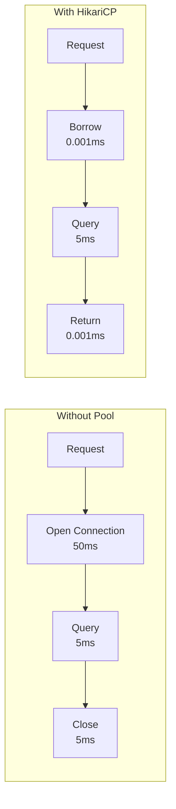
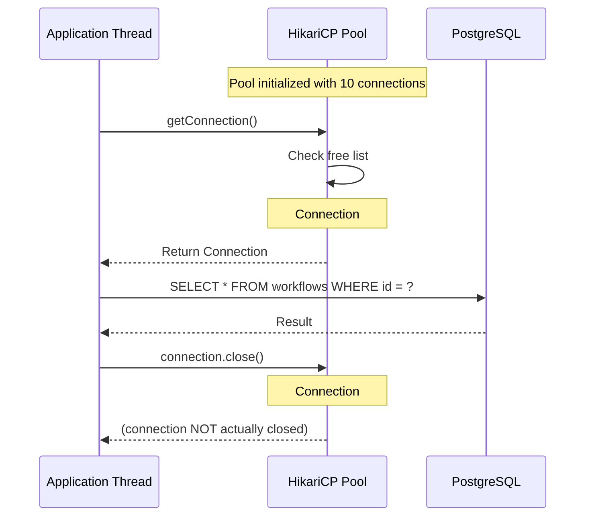
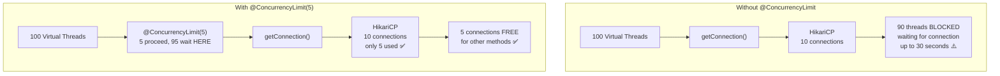
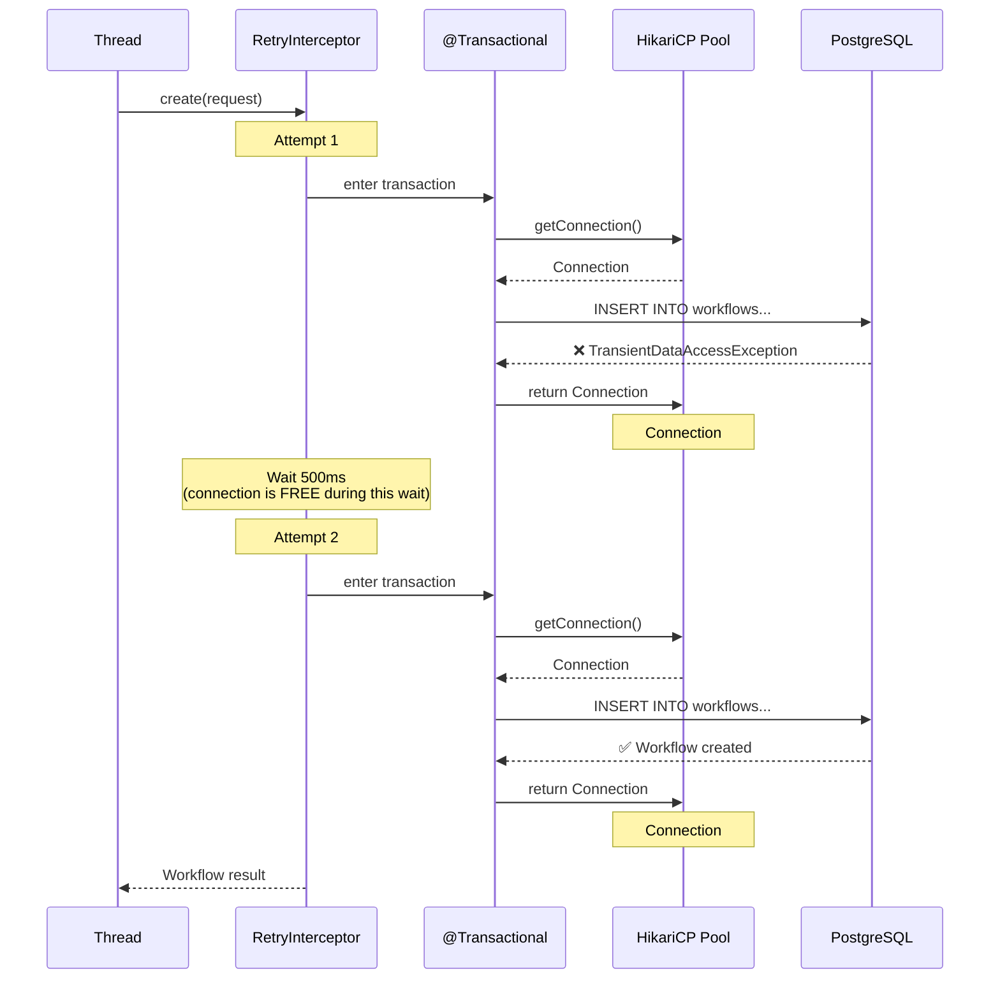
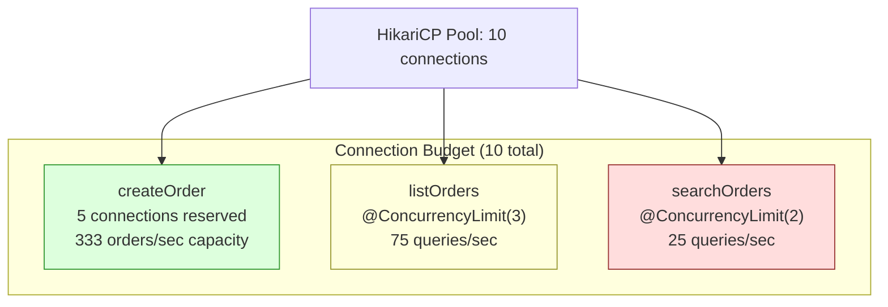
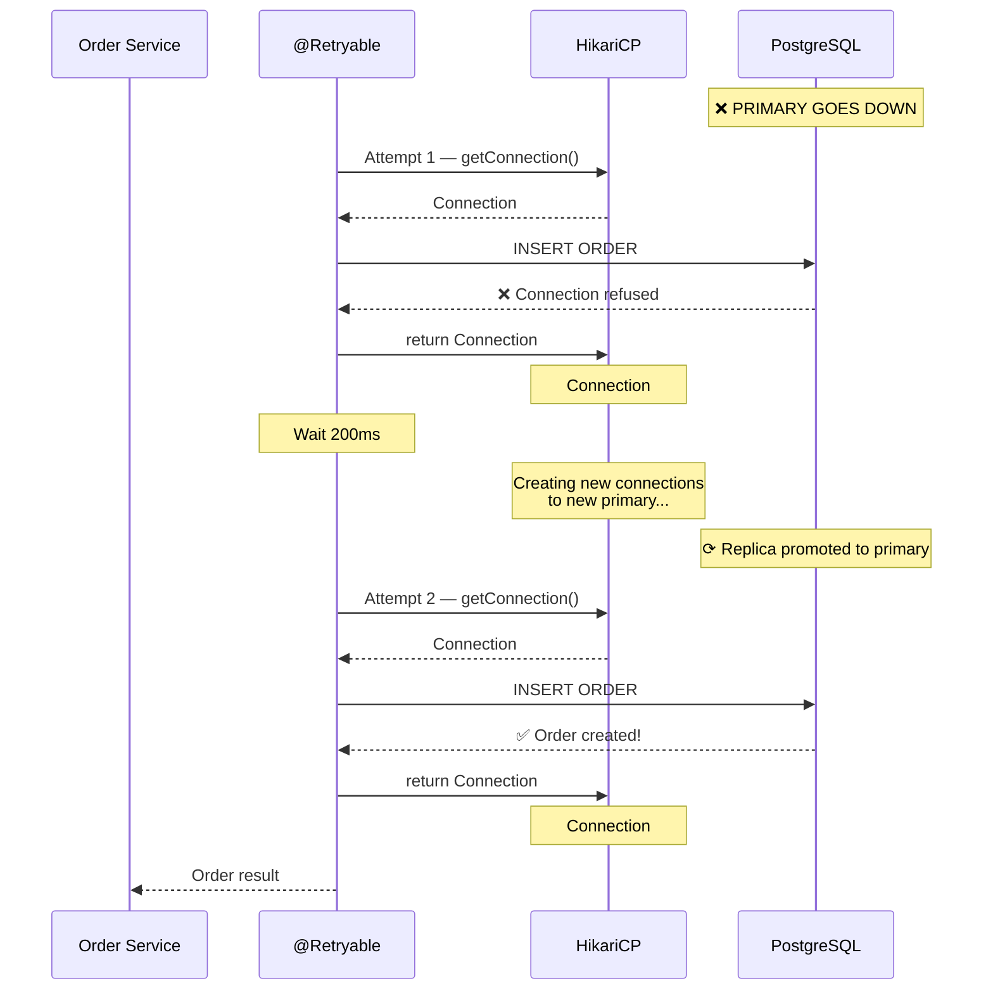

# HikariCP — Database Connection Pooling

How database connections work, what HikariCP does, every configuration
value explained with calculations, and how it interacts with virtual threads.

**HikariCP is the DEFAULT connection pool in Spring Boot** (since 2.0).
You don't need to add any dependency — it's already included.

---

## 1. Why Connection Pools Exist

### What Happens When You Open a Database Connection

```text
Every time your app connects to PostgreSQL, this happens:

  1. TCP handshake (3 packets)
     App ──SYN──▶ DB
     App ◀──SYN-ACK── DB
     App ──ACK──▶ DB
     Cost: ~0.5ms (same machine) to ~50ms (cross-region)

  2. PostgreSQL authentication
     App ──startup message──▶ DB
     DB verifies credentials, creates backend process
     App ◀──AuthenticationOk── DB
     Cost: ~5-20ms

  3. Connection setup
     DB allocates memory (~5-10 MB per connection)
     DB creates a backend process (fork on Linux)
     Cost: ~10-50ms

  TOTAL: 15-120ms per new connection

  After the query:
  4. Connection teardown
     App ──Terminate──▶ DB
     DB kills backend process, frees memory
     Cost: ~5ms
```

### Without a Connection Pool

```text
  Request 1: open connection (50ms) → query (5ms) → close connection (5ms) = 60ms
  Request 2: open connection (50ms) → query (5ms) → close connection (5ms) = 60ms
  Request 3: open connection (50ms) → query (5ms) → close connection (5ms) = 60ms
  ...
  1000 requests: 1000 × 60ms = 60,000ms total

  Connection overhead: 1000 × 55ms = 55,000ms WASTED on opening/closing
  Actual query work:   1000 × 5ms  = 5,000ms

  55,000 / 60,000 = 91.7% of time wasted on connection management!
```

### With a Connection Pool (HikariCP)

```text
  Startup: open 10 connections (50ms each, done ONCE)          = 500ms

  Request 1: borrow connection (~0.001ms) → query (5ms) → return = 5.001ms
  Request 2: borrow connection (~0.001ms) → query (5ms) → return = 5.001ms
  Request 3: borrow connection (~0.001ms) → query (5ms) → return = 5.001ms
  ...
  1000 requests: 1000 × 5.001ms = 5,001ms total

  Connection overhead: 1000 × 0.001ms = 1ms
  Actual query work:   1000 × 5ms     = 5,000ms

  1 / 5,001 = 0.02% of time wasted on connection management ✅

  Speedup: 60,000ms → 5,001ms = 12x faster
```



---

## 2. How HikariCP Works Internally

### The Pool Lifecycle

```text
STARTUP:
  HikariCP creates 'minimumIdle' connections to the database.
  These connections are established, authenticated, and ready to use.
  They sit in a "free list" (ConcurrentBag) waiting to be borrowed.

REQUEST ARRIVES:
  1. Thread calls dataSource.getConnection()
  2. HikariCP checks the free list for an available connection
  3. If available → borrow it (move from free to in-use) → return to caller
  4. If none available AND pool size < maximumPoolSize → create new connection
  5. If none available AND pool size = maximumPoolSize → WAIT up to connectionTimeout
  6. If still none available after timeout → throw SQLTransientConnectionException

REQUEST COMPLETES:
  1. Thread calls connection.close() (or JPA/Hibernate does it automatically)
  2. HikariCP doesn't ACTUALLY close the connection
  3. Instead, it returns it to the free list for reuse
  4. If a waiting thread exists, it's immediately given this connection

IDLE:
  If connections sit idle longer than idleTimeout, HikariCP closes excess
  connections down to minimumIdle.

AGING:
  Connections older than maxLifetime are retired (closed and replaced).
  This prevents issues with stale connections, DB-side timeouts,
  and memory leaks in the database driver.
```



### Connection States

```text
A connection in HikariCP is in one of these states:

  STATE        MEANING                         COUNT TOWARD POOL SIZE?
  ──────────────────────────────────────────────────────────────────────
  FREE         In pool, available to borrow     Yes
  IN-USE       Borrowed by a thread, executing  Yes
  RETIRED      Marked for removal (too old)     Yes (until returned)
  EVICTED      Removed from pool                No

  Pool size = FREE + IN-USE + RETIRED

  maximumPoolSize limits the total of FREE + IN-USE + RETIRED.
  When a retired connection is returned, it's closed and a new one is created.
```

---

## 3. HikariCP Configuration — Every Value Explained

### Spring Boot Configuration

```yaml
spring:
  datasource:
    url: jdbc:postgresql://localhost:5432/flowforge
    username: postgres
    password: postgres
    hikari:
      maximum-pool-size: 10          # max connections in pool
      minimum-idle: 10               # min idle connections kept alive
      connection-timeout: 30000      # max wait for connection (ms)
      idle-timeout: 600000           # max idle time before closing (ms)
      max-lifetime: 1800000          # max age of a connection (ms)
      validation-timeout: 5000       # max time for connection validation (ms)
      leak-detection-threshold: 0    # warn if connection held longer than this (ms)
      pool-name: FlowForge-Pool      # name for logging/JMX
```

---

### maximumPoolSize (default: 10)

```text
WHAT: The maximum number of connections HikariCP will maintain (free + in-use).

  maximumPoolSize = 10 means:
    At most 10 connections to the database AT THE SAME TIME.

  If all 10 are in-use and thread #11 calls getConnection():
    → Thread #11 WAITS up to connectionTimeout
    → If a connection is returned within that time → thread #11 gets it
    → If not → SQLTransientConnectionException

  This is the MOST IMPORTANT setting. Too low = thread waiting. Too high = DB overload.
```

#### Sizing Calculation

```text
The FORMULA (from HikariCP wiki):

  connections = (core_count × 2) + effective_spindle_count

  core_count:               number of CPU cores on the DATABASE SERVER
  effective_spindle_count:  number of disk spindles (HDD) or 1 for SSD

  Examples:
    4-core server, SSD:   (4 × 2) + 1 = 9  → use 10
    8-core server, SSD:   (8 × 2) + 1 = 17 → use 17
    4-core server, 4 HDD: (4 × 2) + 4 = 12 → use 12

  WHY this formula works:

    Each CPU core can run ONE query at a time.
    While one query waits for disk I/O, the core can start another query.
    So each core can effectively handle ~2 queries concurrently.
    The +spindle accounts for I/O parallelism of physical disks.

    With 10 connections on a 4-core DB:
      Core 1: query A (computing) → query A (waiting for disk) → query B (computing)
      Core 2: query C (computing) → query C (waiting for disk) → query D (computing)
      Core 3: ...
      Core 4: ...
      → 4 cores × 2 = 8 queries truly concurrent + 1 for SSD parallelism = 9

    With 50 connections on a 4-core DB:
      40 connections sit idle waiting for a core
      Context switching overhead between 50 connections
      Lock contention increases
      → SLOWER than 10 connections! (counterintuitive but proven)
```

```text
IMPORTANT: More connections ≠ more performance.

  PostgreSQL benchmark (4-core server):
    Pool size  5:   9,000 TPS (transactions per second)
    Pool size 10:   9,500 TPS ← optimal
    Pool size 20:   8,000 TPS (context switching overhead)
    Pool size 50:   6,000 TPS (lock contention)
    Pool size 100:  4,000 TPS (massive contention)

  A smaller pool can OUTPERFORM a larger pool.
  The database is the bottleneck, not the pool size.
```

#### Multiple Application Instances

```text
If you run MULTIPLE instances of your app, they SHARE the database.

  Single instance:
    maximumPoolSize = 10 → 10 connections to DB

  3 instances (e.g., Kubernetes pods):
    maximumPoolSize = 10 × 3 = 30 connections to DB

  PostgreSQL default max_connections = 100
  Each connection consumes ~5-10 MB of DB memory.

  CALCULATION:
    Available DB connections:        100
    Reserved for admin/monitoring:   10
    Available for app:               90
    Number of app instances:         3
    Max pool size per instance:      90 ÷ 3 = 30

  Or more conservatively:
    Max pool size per instance = max_connections / (num_instances × 1.5)
    = 100 / (3 × 1.5) = 22

  FORMULA:
    per_instance_pool = floor(db_max_connections / (num_instances × safety_factor))

    safety_factor = 1.5 to 2.0 (headroom for admin connections, monitoring, etc.)
```

---

### minimumIdle (default: same as maximumPoolSize)

```text
WHAT: The minimum number of IDLE (free) connections HikariCP keeps alive.

  HikariCP recommendation: set minimumIdle = maximumPoolSize
  (this is the default behavior)

  Why? If minimumIdle < maximumPoolSize, HikariCP has to CREATE new connections
  under load (which takes 15-120ms). This adds latency to requests during spikes.

  minimumIdle = maximumPoolSize means:
    All connections are created at startup
    No connection creation during runtime
    Predictable, consistent latency

  When to set minimumIdle < maximumPoolSize:
    - You have MANY app instances and want to reduce idle DB connections
    - The app has very spiky traffic (idle 90% of the time, burst 10%)
    - DB has strict connection limits
```

#### Calculation Example

```text
  maximumPoolSize = 10
  minimumIdle = 10 (default, same as max)

  Startup:   10 connections created (free: 10, in-use: 0)
  Steady:    free: 7, in-use: 3 (3 queries running)
  Peak:      free: 0, in-use: 10 (all connections busy)
  After peak: free: 10, in-use: 0 (all returned)

  No connection creation or destruction during runtime. Stable.

  ──────────────────────────────────────────────────────

  maximumPoolSize = 10
  minimumIdle = 3

  Startup:   3 connections created (free: 3, in-use: 0)
  Spike:     free: 0, in-use: 3 → create 7 more (takes 15-120ms each!)
             free: 0, in-use: 10
  After spike: in-use drops → idle connections grow
             After idleTimeout: connections closed back down to 3
             free: 3, in-use: 0

  Connection creation during spikes adds latency. Avoid unless necessary.
```

---

### connectionTimeout (default: 30000ms = 30 seconds)

```text
WHAT: Maximum time (ms) a thread will WAIT for a connection from the pool.

  Thread calls getConnection()
  All connections are in-use (pool is saturated)
  Thread waits... waits... waits...
  After connectionTimeout → SQLTransientConnectionException

  connectionTimeout = 30000 means:
    Wait up to 30 seconds for a connection.
    After 30 seconds → exception → request fails with 500 error.

  CALCULATION — what timeout value should you use?

    User-facing API:
      Users expect responses in < 3 seconds.
      connectionTimeout = 3000 (3 seconds)
      If no connection in 3s, fail fast → return 503 → user retries.

    Background job:
      Can tolerate longer waits.
      connectionTimeout = 30000 (30 seconds, default)
      Jobs are not user-facing, so waiting is acceptable.

    With @Retryable:
      connectionTimeout = 2000 (2 seconds)
      @Retryable(maxRetries = 3, delay = 500)
      Total worst case: (2000 + 500) × 4 = 10 seconds
      Fail fast per attempt, but retry gives multiple chances.
```

#### What Happens When Timeout Fires

```text
  Timeline (connectionTimeout = 5000):

  t=0ms:     Thread A calls getConnection()
  t=0ms:     Pool: 0 free, 10 in-use → no connection available → wait
  t=1200ms:  Thread B returns a connection → Thread A gets it → SUCCESS

  OR:

  t=0ms:     Thread A calls getConnection()
  t=0ms:     Pool: 0 free, 10 in-use → wait
  t=5000ms:  Timeout! → SQLTransientConnectionException thrown
             Thread A catches exception → returns 503 to client

  The exception is a TransientDataAccessException in Spring.
  @Retryable(includes = TransientDataAccessException.class) WILL retry this.
```

---

### idleTimeout (default: 600000ms = 10 minutes)

```text
WHAT: Maximum time (ms) a connection can sit IDLE in the pool before being closed.

  Only applies when minimumIdle < maximumPoolSize.
  If minimumIdle = maximumPoolSize (default), idle connections are NEVER closed.

  idleTimeout = 600000 means:
    If a connection hasn't been used for 10 minutes, close it.
    But never close below minimumIdle connections.

  EXAMPLE:
    maximumPoolSize = 10, minimumIdle = 3, idleTimeout = 600000

    t=0:    10 connections (all were busy during peak)
    t=5min: 7 are idle → not yet 10 min → keep all 10
    t=10min: 7 are still idle → idleTimeout reached
             Close 4 (keep minimumIdle = 3 idle + 3 in-use = 6 total)
    t=15min: 3 idle, 3 in-use → 6 total (steady state)

  WHY close idle connections?
    - Each idle connection holds DB resources (~5-10 MB memory)
    - Reduces unnecessary load on DB when app is quiet
    - Frees DB connection slots for other applications/instances
```

---

### maxLifetime (default: 1800000ms = 30 minutes)

```text
WHAT: Maximum AGE of a connection, regardless of whether it's idle or active.

  After maxLifetime, the connection is RETIRED:
    - If it's in the free list → closed immediately, new one created
    - If it's in-use → marked for retirement → closed when returned

  maxLifetime = 1800000 means:
    Every connection lives for at most 30 minutes.
    After 30 minutes, it's replaced with a fresh connection.

  WHY retire old connections?

    1. Database-side timeouts:
       PostgreSQL: idle_in_transaction_session_timeout
       MySQL: wait_timeout (default 28800 = 8 hours)
       If the DB closes a connection, the pool doesn't know → stale connection
       → next query on that connection fails.

    2. Network infrastructure:
       Load balancers, firewalls, NAT gateways may close idle connections
       after a certain time. If the pool doesn't know → stale connection.

    3. Memory leaks:
       Long-lived connections may accumulate memory in the JDBC driver.
       Periodic replacement prevents unbounded growth.

    4. DNS changes:
       If the DB hostname resolves to a new IP (failover, scaling),
       old connections still point to the old IP. Retirement forces
       reconnection to the new IP.

  CRITICAL RULE:
    maxLifetime MUST be LESS than the database's connection timeout.

    PostgreSQL default: no timeout (connections live forever)
    MySQL default: wait_timeout = 28800 seconds (8 hours)
    
    Set maxLifetime to at least 30 seconds LESS than the DB timeout:
      MySQL: maxLifetime = 28800 - 30 = 28770 seconds = 28770000 ms
      Cloud DB (often 5 min timeout): maxLifetime = 270000 (4.5 min)
```

#### How Retirement Works (No Thundering Herd)

```text
  HikariCP adds JITTER to maxLifetime to prevent all connections
  from expiring at the same time.

  maxLifetime = 1800000 (30 minutes)
  Actual lifetime = maxLifetime - random(0, maxLifetime × 2.5%)
                   = 1800000 - random(0, 45000)
                   = between 1755000 and 1800000 (29:15 to 30:00)

  Connection 1: expires at 29:23
  Connection 2: expires at 29:47
  Connection 3: expires at 29:15
  Connection 4: expires at 29:52
  ...

  Connections expire one at a time, not all at once.
  → No spike of 10 simultaneous reconnections.
  → Same concept as @Retryable jitter (prevent thundering herd).
```

---

### validationTimeout (default: 5000ms = 5 seconds)

```text
WHAT: Maximum time (ms) to validate that a connection is still alive.

  Before giving a connection to a thread, HikariCP verifies it works:
    Connection.isValid(validationTimeout / 1000)
    → sends a test query to the DB (internally uses JDBC4 isValid)

  If validation fails (DB unreachable, connection dead):
    → Connection is evicted
    → HikariCP tries another connection from the pool
    → If all connections are dead → creates new ones

  validationTimeout = 5000 means:
    Validation must succeed within 5 seconds.
    If the DB takes > 5s to respond → connection considered dead.

  validationTimeout must be LESS than connectionTimeout.
  (validation happens WITHIN the connectionTimeout window)
```

---

### leakDetectionThreshold (default: 0 = disabled)

```text
WHAT: If a connection is held (not returned) for longer than this (ms),
      HikariCP logs a WARNING with the stack trace of who borrowed it.

  leakDetectionThreshold = 0:     disabled (default)
  leakDetectionThreshold = 60000: warn if connection held > 60 seconds

  EXAMPLE LOG:
    WARN  HikariPool-1 - Connection leak detection triggered for connection
    org.postgresql.jdbc.PgConnection@3a4b5c, stack trace follows:
      at com.flowforge.flowforge.service.WorkflowService.create(WorkflowService.java:57)
      at ...

  This helps find:
    - Transactions that are never committed/rolled back
    - Connections borrowed outside of Spring's transaction management
    - Long-running queries that should be async

  CALCULATION:
    Set to longest acceptable query time × 2

    Typical web app: queries should finish in < 5 seconds
    leakDetectionThreshold = 10000 (10 seconds)
    → If any connection is held > 10s, something is wrong

  MINIMUM: 2000 (HikariCP ignores values < 2000ms)
```

---

## 4. Connection Pool Math

### How Many Concurrent Queries Can You Run?

```text
  MAX concurrent queries = maximumPoolSize

  maximumPoolSize = 10 → at most 10 SQL queries executing simultaneously.

  If your average query takes 20ms:
    Max throughput = maximumPoolSize / avg_query_time
                   = 10 / 0.020s
                   = 500 queries/second

  If your average query takes 5ms:
    Max throughput = 10 / 0.005s = 2,000 queries/second

  If your average query takes 100ms (complex join):
    Max throughput = 10 / 0.100s = 100 queries/second
```

### Wait Time Calculation

```text
When all connections are busy, new requests WAIT.

  Using Little's Law:
    L = λ × W
    L = number of requests in the system (= maximumPoolSize when full)
    λ = arrival rate (requests per second)
    W = average time in system (query time + wait time)

  EXAMPLE:
    maximumPoolSize = 10
    Arrival rate (λ) = 200 requests/second
    Average query time = 20ms

    Service rate = pool_size / query_time = 10 / 0.020 = 500 req/sec
    Utilization (ρ) = λ / service_rate = 200 / 500 = 0.4 (40%)

    Average wait time (M/M/c queue):
      At 40% utilization → wait ≈ 0.1ms (negligible)
      At 70% utilization → wait ≈ 2ms
      At 90% utilization → wait ≈ 20ms
      At 95% utilization → wait ≈ 60ms
      At 99% utilization → wait ≈ 500ms

  KEY INSIGHT:
    Wait time grows EXPONENTIALLY as utilization approaches 100%.
    At 70% pool utilization, everything is fine.
    At 95%, waits are 600x longer than at 70%.
```

```text
  CONCRETE EXAMPLE:

  Pool: 10 connections
  Query time: 20ms average
  Max throughput: 10 / 0.020 = 500 req/sec

  Traffic: 300 req/sec (60% utilization)
    → Average wait: ~0.5ms ← barely noticeable
    → P99 wait: ~5ms

  Traffic: 450 req/sec (90% utilization)
    → Average wait: ~20ms ← noticeable
    → P99 wait: ~200ms

  Traffic: 495 req/sec (99% utilization)
    → Average wait: ~500ms ← user sees delay
    → P99 wait: ~3000ms ← connectionTimeout might fire!

  Traffic: 501 req/sec (100%+ utilization)
    → Queue grows unboundedly → connectionTimeout fires for most requests
    → System is in failure mode
```

### @ConcurrencyLimit + Pool Size Interaction

```text
  Without @ConcurrencyLimit:
    Virtual threads: unlimited concurrent getConnection() calls
    Pool: 10 connections
    100 concurrent requests → 100 calls to getConnection()
    90 threads WAIT for a connection (blocking at pool level)
    connectionTimeout = 30s → threads might wait up to 30 seconds

  With @ConcurrencyLimit(5):
    Virtual threads: unlimited, but only 5 enter findAll()
    Pool: 10 connections
    100 concurrent requests → only 5 call getConnection()
    5 connections used by findAll(), 5 available for other methods
    NO waiting at pool level (5 < 10)
    Waiting happens at @ConcurrencyLimit level (cheaper, no timeout risk)

  RULE OF THUMB:
    @ConcurrencyLimit ≤ maximumPoolSize / 2

    This ensures:
    - The limited method never exhausts the entire pool
    - Other methods always have connections available
    - No connectionTimeout exceptions for any method
```



---

## 5. Connection Lifecycle Timeline

```text
  One connection's life:

  t=0s:       Pool creates connection (TCP handshake + auth)            [50ms]
  t=0.05s:    Connection is FREE in pool
  t=2.1s:     Thread A borrows connection → IN-USE
  t=2.12s:    Thread A executes query (20ms)
  t=2.14s:    Thread A returns connection → FREE
  t=5.3s:     Thread B borrows connection → IN-USE
  t=5.33s:    Thread B executes query (30ms)
  t=5.36s:    Thread B returns connection → FREE
  ...
  (connection reused hundreds of times)
  ...
  t=1752s:    maxLifetime approaching (29:12 — with jitter)
  t=1752s:    Connection marked RETIRED
  t=1752s:    Connection is FREE → closed immediately
  t=1752s:    Pool creates replacement connection
  t=1752.05s: New connection is FREE in pool

  OR if connection is IN-USE when maxLifetime hits:
  t=1752s:    Connection marked RETIRED (but still IN-USE)
  t=1753.2s:  Thread returns connection → RETIRED → closed
  t=1753.2s:  Pool creates replacement connection
```

---

## 6. Monitoring — Pool Metrics

### Spring Boot Actuator Metrics

```yaml
# Enable in application.yaml
management:
  endpoints:
    web:
      exposure:
        include: health,metrics
```

```text
Available metrics (GET /actuator/metrics/hikaricp.*):

  METRIC                              WHAT IT TELLS YOU
  ─────────────────────────────────────────────────────────────────
  hikaricp.connections                Total connections (free + in-use)
  hikaricp.connections.active         Currently in-use connections
  hikaricp.connections.idle           Currently free connections
  hikaricp.connections.pending        Threads waiting for a connection
  hikaricp.connections.creation       Time to create a connection (ms)
  hikaricp.connections.acquire        Time to acquire from pool (ms)
  hikaricp.connections.usage          Time a connection was held (ms)
  hikaricp.connections.timeout        Number of connectionTimeout events
  hikaricp.connections.max            maximumPoolSize value
  hikaricp.connections.min            minimumIdle value

  ALERT ON:
    hikaricp.connections.pending > 0:   threads are waiting → pool may be too small
    hikaricp.connections.timeout > 0:   requests are failing → pool is too small
    hikaricp.connections.active = max:  pool is saturated → increase or add @ConcurrencyLimit
    hikaricp.connections.acquire > 10ms: contention is growing → scale or optimize queries
```

### JMX (Java Management Extensions)

```text
HikariCP exposes pool stats via JMX:

  HikariPool-1:
    ActiveConnections:   5
    IdleConnections:     5
    TotalConnections:    10
    ThreadsAwaitingConnection: 0

  Enable:
    spring.datasource.hikari.register-mbeans=true

  Access via JConsole, VisualVM, or JMX exporter for Prometheus.
```

---

## 7. Debugging Common Issues

### "Connection is not available, request timed out"

```text
CAUSE: All connections in-use for > connectionTimeout.

  org.springframework.dao.DataAccessResourceFailureException:
    Unable to acquire JDBC Connection
  Caused by: java.sql.SQLTransientConnectionException:
    HikariPool-1 - Connection is not available, request timed out after 30000ms

  FIX OPTIONS (in order of preference):
    1. Optimize slow queries (reduce connection hold time)
    2. Add @ConcurrencyLimit to expensive methods
    3. Increase maximumPoolSize (but check DB limits first)
    4. Decrease connectionTimeout (fail fast, let @Retryable handle it)
```

### "Connection leaked"

```text
CAUSE: A connection was borrowed but never returned (missing close/commit).

  WARN HikariPool-1 - Connection leak detection triggered for connection
  org.postgresql.jdbc.PgConnection@3a4b5c

  FIX:
    - Ensure every @Transactional method completes (no infinite loops)
    - Don't call dataSource.getConnection() manually without try-with-resources
    - Check for exceptions that bypass connection return (catch blocks)
```

### "Pool full, no available connections"

```text
CAUSE: More concurrent requests than pool capacity.

  DIAGNOSIS:
    hikaricp.connections.active = 10 (equals max)
    hikaricp.connections.pending = 50 (threads waiting)

  FIX:
    1. Best: @ConcurrencyLimit on heavy methods
    2. Good: optimize queries to hold connections for less time
    3. OK:   increase maximumPoolSize (check DB supports it)
    4. Last resort: increase connectionTimeout (masks the problem)
```

---

## 8. Quick Reference

```text
SETTING                  DEFAULT          RECOMMENDED                  WHY
─────────────────────────────────────────────────────────────────────────────────────
maximumPoolSize          10               (cores × 2) + 1             Match DB capacity
minimumIdle              = maximumPoolSize = maximumPoolSize           Avoid runtime creation
connectionTimeout        30000 (30s)      3000-5000 for APIs          Fail fast
idleTimeout              600000 (10min)   600000                      Fine as-is
maxLifetime              1800000 (30min)  < DB timeout - 30s          Prevent stale connections
validationTimeout        5000 (5s)        5000                        Fine as-is
leakDetectionThreshold   0 (disabled)     10000-60000 in dev          Catch connection leaks
pool-name                HikariPool-1     YourApp-Pool                Better logging
```

```text
GOLDEN RULES:

  1. maximumPoolSize: smaller is usually better (10-20 for most apps)
  2. minimumIdle = maximumPoolSize: avoid connection creation at runtime
  3. maxLifetime < DB server timeout: prevent stale connection errors
  4. connectionTimeout: short for APIs (3s), longer for batch jobs (30s)
  5. @ConcurrencyLimit ≤ maximumPoolSize / 2: protect the pool from any single method
  6. Monitor hikaricp.connections.pending: if > 0, something needs tuning
  7. More connections ≠ more performance: benchmark before increasing
```

---

## 9. HikariCP + @Retryable — How They Work Together

### The Core Interaction

```text
When @Retryable wraps a @Transactional method, EACH retry attempt
acquires AND releases a database connection independently.

  Attempt 1: borrow connection → BEGIN TX → query → FAIL → ROLLBACK → return connection
  (wait delay ms)
  Attempt 2: borrow connection → BEGIN TX → query → FAIL → ROLLBACK → return connection
  (wait delay ms)
  Attempt 3: borrow connection → BEGIN TX → query → SUCCESS → COMMIT → return connection

  Each attempt uses the pool for only the duration of the query.
  The connection is NOT held during the delay between retries.
  This is because @Retryable wraps OUTSIDE @Transactional (lower order number).
```

### Why This Matters

```text
CORRECT (retry outside transaction — Spring default):

  Retry ─▶ [ Tx ─▶ borrow conn ─▶ query ─▶ return conn ] ─▶ wait ─▶ [ Tx ─▶ ... ]
                    ↑ connection held only here ↑

  Connection held: ~20ms per attempt
  Connection free during: ~500ms delay between retries
  Pool is NOT blocked during retry waits ✅

WRONG (transaction outside retry — if you mess up ordering):

  Tx ─▶ borrow conn ─▶ [ Retry ─▶ query ─▶ wait ─▶ query ─▶ wait ─▶ query ] ─▶ return conn
        ↑ connection held the ENTIRE TIME including waits ↑

  Connection held: 20ms + 500ms + 20ms + 500ms + 20ms = 1,060ms
  One connection tied up for 1+ second instead of 20ms
  With 10 connections and 10 concurrent retries → pool exhausted ❌
```



---

## 10. Case Study — E-Commerce Order Service Under Load

### The Scenario

```text
E-COMMERCE ORDER SERVICE:
  - Spring Boot 4 with virtual threads enabled
  - PostgreSQL database (4-core server, SSD)
  - HikariCP: maximumPoolSize = 10
  - 3 application instances behind a load balancer
  - Normal traffic: 100 orders/second (across all instances)
  - Black Friday spike: 2,000 orders/second

  Methods:
    createOrder()   — INSERT order + INSERT line items (avg 15ms)
    getOrder()      — SELECT by ID (avg 3ms)
    listOrders()    — SELECT with filters + pagination (avg 40ms)
    searchOrders()  — Full-text search with tsvector (avg 80ms)
```

### Phase 1: No Resilience (Naive Implementation)

```java
@Service
public class OrderService {

    @Transactional
    public Order createOrder(OrderRequest request) {
        Order order = orderMapper.toEntity(request);
        return orderRepository.save(order);
    }

    public Page<Order> listOrders(OrderFilter filter, Pageable pageable) {
        return orderRepository.findAll(toSpec(filter), pageable);
    }

    public Page<Order> searchOrders(String query, Pageable pageable) {
        return orderRepository.fullTextSearch(query, pageable);
    }
}
```

```text
NORMAL TRAFFIC (100 orders/sec, ~33 per instance):

  Pool: 10 connections
  createOrder: 15ms × 33/sec = 0.5 connections busy on average
  listOrders:  40ms × 10/sec = 0.4 connections busy
  searchOrders: 80ms × 5/sec = 0.4 connections busy
  Total: ~1.3 connections busy on average (13% utilization)

  ✅ Everything works fine. Pool is barely used.

BLACK FRIDAY (2,000 orders/sec, ~667 per instance):

  With virtual threads: 667 concurrent requests → 667 virtual threads
  All 667 call getConnection() simultaneously

  createOrder: 15ms × 500/sec = 7.5 connections busy
  listOrders:  40ms × 100/sec = 4.0 connections busy
  searchOrders: 80ms × 67/sec = 5.4 connections busy
  Total: ~16.9 connections needed... but pool only has 10!

  Result:
  - All 10 connections permanently busy
  - 657 threads waiting at getConnection()
  - connectionTimeout fires after 30 seconds
  - Hundreds of 503 errors per second
  - Users can't place orders on Black Friday ❌💸
```

```text
TIMELINE OF FAILURE:

  t=0s:      Traffic spike starts (667 req/sec per instance)
  t=0.01s:   All 10 connections in-use
  t=0.02s:   657 threads queued at getConnection()
  t=0.5s:    Queue depth: ~300 threads (some got connections as others finished)
  t=5s:      Queue depth: ~500 threads (arrival > service rate)
  t=30s:     connectionTimeout fires for oldest waiters → 503 errors start
  t=30-60s:  500+ errors/second → users refreshing → even more traffic
  t=60s:     Database under heavy load → query times increase 15ms → 50ms
             → connections held longer → pool utilization increases further
             → CASCADE FAILURE: pool saturated → errors → retries → more load
```

### Phase 2: Add @ConcurrencyLimit (Fix Pool Exhaustion)

```java
@Service
public class OrderService {

    @Transactional
    public Order createOrder(OrderRequest request) {
        Order order = orderMapper.toEntity(request);
        return orderRepository.save(order);
    }

    @ConcurrencyLimit(3)  // protect expensive queries
    public Page<Order> listOrders(OrderFilter filter, Pageable pageable) {
        return orderRepository.findAll(toSpec(filter), pageable);
    }

    @ConcurrencyLimit(2)  // most expensive query, strictest limit
    public Page<Order> searchOrders(String query, Pageable pageable) {
        return orderRepository.fullTextSearch(query, pageable);
    }
}
```

```text
CONNECTION BUDGET:

  Pool: 10 connections total
  listOrders:    @ConcurrencyLimit(3) → max 3 connections
  searchOrders:  @ConcurrencyLimit(2) → max 2 connections
  Reserved for createOrder + getOrder: 10 - 3 - 2 = 5 connections

  WHY these numbers?
    createOrder is the REVENUE PATH — it must never be blocked.
    5 connections for createOrder = 5 / 0.015s = 333 orders/sec per instance.
    3 instances × 333 = 999 orders/sec capacity for creates.
    listOrders and searchOrders can wait — they're read-only browsing.

BLACK FRIDAY (2,000 orders/sec, ~667 per instance):

  createOrder: 500 req/sec → uses ≤ 5 connections → 5/0.015 = 333/sec capacity
    → 500 > 333 → some wait for connections, but briefly (15ms query time)
    → Most complete within 50ms total

  listOrders: 100 req/sec → @ConcurrencyLimit(3) → only 3 execute at a time
    → 3/0.040 = 75/sec throughput → 100 req/sec slightly exceeds capacity
    → Some requests wait ~40ms at the concurrency gate → acceptable

  searchOrders: 67 req/sec → @ConcurrencyLimit(2) → only 2 execute at a time
    → 2/0.080 = 25/sec throughput → 67 req/sec exceeds capacity
    → Requests queue up → search is slow but DOESN'T affect orders ✅

  Result:
  - Orders keep flowing (revenue protected) ✅
  - Browsing/search is slower but functional ✅
  - No pool exhaustion, no cascade failure ✅
  - No 503 errors for order creation ✅
```



### Phase 3: Add @Retryable (Handle Transient DB Failures)

```java
@Service
public class OrderService {

    @Retryable(
        includes = TransientDataAccessException.class,
        maxRetries = 3,
        delay = 200,
        multiplier = 2,
        maxDelay = 2000
    )
    @Transactional
    public Order createOrder(OrderRequest request) {
        Order order = orderMapper.toEntity(request);
        return orderRepository.save(order);
    }

    @ConcurrencyLimit(3)
    public Page<Order> listOrders(OrderFilter filter, Pageable pageable) {
        return orderRepository.findAll(toSpec(filter), pageable);
    }

    @ConcurrencyLimit(2)
    public Page<Order> searchOrders(String query, Pageable pageable) {
        return orderRepository.fullTextSearch(query, pageable);
    }
}
```

```text
WHY @Retryable on createOrder but NOT on listOrders/searchOrders?

  createOrder:
    - Revenue-critical (lost order = lost sale)
    - Transient errors (deadlock, connection blip) would lose a sale
    - Idempotent: each order gets a unique UUID, retry creates no duplicate
    - @Retryable saves the sale by automatically retrying ✅

  listOrders / searchOrders:
    - Read-only browsing — no data loss if it fails
    - User can just refresh the page
    - @ConcurrencyLimit already protects these from pool exhaustion
    - Adding @Retryable would increase pool pressure under load ❌
```

### Phase 3: Retry + Pool Interaction — The Math

```text
SCENARIO: Database failover during Black Friday
  PostgreSQL primary goes down for 3 seconds.
  Replica promoted to primary.
  All existing connections become stale.

WITHOUT @Retryable:
  All 10 connections are stale → every query fails
  500 orders/sec × 3 seconds = 1,500 orders LOST ❌
  Users see 500 errors → panic → call support → revenue loss

WITH @Retryable (delay=200, multiplier=2, maxRetries=3):
  Attempt 1: fails immediately (stale connection)        t=0ms
    HikariCP detects stale connection → evicts it → creates new one (~50ms)
    Wait 200ms
  Attempt 2: might fail (DB still failing over)          t=250ms
    Wait 400ms (200 × 2)
  Attempt 3: likely succeeds (failover complete ~2-3s)   t=650ms
    Wait 800ms (400 × 2)
  Attempt 4: succeeds (DB is back)                       t=1450ms

  Timeline:
    t=0s:    DB goes down
    t=0-0.2s: All Attempt 1s fail → connections recycled
    t=0.2s:  HikariCP creating new connections to new primary
    t=0.5s:  Attempt 2s start → some succeed (new connections ready)
    t=1.0s:  Most Attempt 2/3s succeed → orders flowing again
    t=3.0s:  DB failover complete → everything normal

  Orders lost: maybe 50-100 during the first 0.5s (instead of 1,500) ✅

POOL BEHAVIOR DURING RETRY:

  t=0ms:   10 connections, all stale
  t=0ms:   10 Attempt-1s all fail
  t=0ms:   10 stale connections evicted → pool size = 0
  t=50ms:  HikariCP creating 10 new connections (TCP + auth = 50ms each)
  t=100ms: 5 new connections ready → pool size = 5
  t=200ms: Attempt-2s start → 5 use the new connections
           → 5 wait briefly for remaining connections
  t=250ms: All 10 new connections ready → pool size = 10

  KEY: The retry DELAY (200ms) gives HikariCP time to create new connections.
  If delay were 0ms → retries hit an empty pool → connectionTimeout → failure.
  This is why delay > connection creation time is important.
```



### Phase 4: Fine-tuning — connectionTimeout + retry alignment

```text
BAD CONFIGURATION:
  connectionTimeout = 30000 (30 seconds)
  @Retryable(maxRetries = 3, delay = 500)

  Worst case per attempt: 30s waiting for connection + 0.5s delay = 30.5s
  Worst case total: 30.5s × 4 attempts = 122 seconds!
  User waits 2 MINUTES for an error response. Terrible UX.

GOOD CONFIGURATION:
  connectionTimeout = 2000 (2 seconds)
  @Retryable(
      includes = {TransientDataAccessException.class},
      maxRetries = 3,
      delay = 200,
      multiplier = 2,
      maxDelay = 2000
  )

  Worst case per attempt: 2s connection wait + query time + delay
  Attempt 1: up to 2s connection + fail + 200ms delay  = 2.2s
  Attempt 2: up to 2s connection + fail + 400ms delay  = 2.4s
  Attempt 3: up to 2s connection + fail + 800ms delay  = 2.8s
  Attempt 4: up to 2s connection + fail (give up)       = 2.0s
  Total worst case: 2.2 + 2.4 + 2.8 + 2.0 = 9.4 seconds

  Acceptable for order creation (user sees a spinner for ~10s worst case).
  In practice, most retries succeed in attempt 2 → ~2.5s total.

OPTIMAL CONFIGURATION (for APIs with strict SLA):
  connectionTimeout = 1000 (1 second)
  @Retryable(maxRetries = 2, delay = 100, multiplier = 2, maxDelay = 500)

  Attempt 1: up to 1s + fail + 100ms delay   = 1.1s
  Attempt 2: up to 1s + fail + 200ms delay   = 1.2s
  Attempt 3: up to 1s + fail (give up)        = 1.0s
  Total worst case: 3.3 seconds

  Meets a 5-second SLA with headroom.
```

### The Complete Configuration

```yaml
spring:
  datasource:
    hikari:
      maximum-pool-size: 10
      minimum-idle: 10
      connection-timeout: 2000           # fail fast — let @Retryable handle it
      idle-timeout: 600000
      max-lifetime: 1800000
      validation-timeout: 3000
      leak-detection-threshold: 10000    # warn if held > 10s (dev/staging)
      pool-name: OrderService-Pool

  threads:
    virtual:
      enabled: true
```

```java
@Configuration
@EnableResilientMethods
public class ResilienceConfig {}

@Service
public class OrderService {

    // Revenue path: retry on transient errors, protected by short connectionTimeout
    @Retryable(
        includes = TransientDataAccessException.class,
        maxRetries = 3,
        delay = 200,
        multiplier = 2,
        maxDelay = 2000
    )
    @Transactional
    public Order createOrder(OrderRequest request) {
        return orderRepository.save(orderMapper.toEntity(request));
    }

    // Read path: limit concurrency to protect pool, no retry needed
    @ConcurrencyLimit(3)
    @Transactional(readOnly = true)
    public Page<Order> listOrders(OrderFilter filter, Pageable pageable) {
        return orderRepository.findAll(toSpec(filter), pageable);
    }

    // Expensive read: strictest limit, no retry
    @ConcurrencyLimit(2)
    @Transactional(readOnly = true)
    public Page<Order> searchOrders(String query, Pageable pageable) {
        return orderRepository.fullTextSearch(query, pageable);
    }

    // Simple read: no limit needed (fast query, low pool impact)
    @Transactional(readOnly = true)
    public Order getOrder(UUID id) {
        return orderRepository.findById(id)
            .orElseThrow(() -> new OrderNotFoundException(id));
    }
}
```

### Summary — Best Practices Checklist

```text
HIKARICP + @RETRYABLE BEST PRACTICES:

  1. SHORT connectionTimeout (1-3 seconds for APIs)
     → Fail fast at the pool level, let @Retryable handle recovery
     → Prevents threads from waiting 30s for a connection

  2. retry delay > connection creation time (~50-100ms)
     → Gives HikariCP time to create new connections after stale eviction
     → delay = 200ms is a safe starting point

  3. Calculate worst-case total time: Σ(connectionTimeout + delay) × attempts
     → Must fit within your SLA
     → User shouldn't wait more than 5-10 seconds

  4. @Retryable OUTSIDE @Transactional (Spring default)
     → Each retry gets a fresh connection from the pool
     → Connection is FREE during retry delay (not held)

  5. @ConcurrencyLimit on expensive reads ≤ pool_size / 2
     → Protects the pool for writes (revenue path)
     → Reads can be slower; writes must not fail

  6. @Retryable on writes (revenue path), NOT on reads
     → Writes are critical (lost order = lost revenue)
     → Reads can show "try again" to the user

  7. includes = TransientDataAccessException.class (always narrow)
     → Only retry errors that can succeed on retry
     → Don't retry validation errors or constraint violations

  8. exponential backoff + maxDelay for production
     → delay=200, multiplier=2, maxDelay=2000
     → Gives failing DB progressively more time to recover
     → Cap prevents absurdly long waits

  9. Monitor hikaricp.connections.timeout metric
     → If > 0, your connectionTimeout is firing
     → Either queries are too slow or pool is too small

  10. leakDetectionThreshold in dev/staging (10-60 seconds)
      → Catches connections that are never returned
      → Prevents slow pool exhaustion bugs from reaching production
```
