# Resilience -- Spring Framework 7 Built-in Retry & Concurrency Limiting

How to make your application survive transient failures and protect
downstream resources from being overwhelmed — using Spring Framework 7's
built-in resilience annotations (no external libraries needed).

**Package:** `org.springframework.resilience.annotation`
**Requires:** Spring Framework 7+ / Spring Boot 4+

---

## 1. The Problem Resilience Solves

### Transient Failures

```text
In distributed systems, things fail TEMPORARILY all the time:

  - Database connection drops for 500ms during a failover
  - Network packet loss causes a timeout
  - External API returns 503 for 2 seconds during a deploy
  - Connection pool is briefly exhausted under a traffic spike
  - Deadlock causes a transaction to be rolled back

These are TRANSIENT failures — the same request would succeed
if you just tried again a moment later.

WITHOUT resilience:
  Client → Service → DB timeout → 500 Internal Server Error → user sees error

WITH resilience (@Retryable):
  Client → Service → DB timeout → retry → DB timeout → retry → DB OK → 200 OK
  Client never knows anything went wrong.
```

### Resource Exhaustion

```text
With virtual threads, there's no natural thread pool limit:

  10,000 requests arrive simultaneously
  → 10,000 virtual threads created instantly
  → 10,000 concurrent database queries
  → Hikari connection pool (10 connections) overwhelmed
  → Cascade failure: timeouts, connection refused, data corruption

WITHOUT concurrency limiting:
  All 10,000 threads hit the DB simultaneously → meltdown

WITH @ConcurrencyLimit(5):
  Only 5 threads query the DB at a time
  The other 9,995 threads wait briefly for a slot
  DB stays healthy → all requests eventually succeed
```

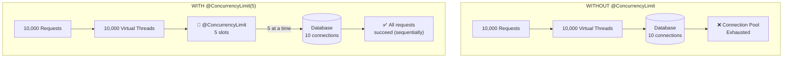

---

## 2. @Retryable

### What It Is

```text
@Retryable is an annotation that tells Spring:
  "If this method throws an exception, try calling it again."

It works via AOP — Spring wraps the method in a proxy that:
  1. Calls the real method
  2. If it throws → catches the exception
  3. Waits for a configured delay
  4. Calls the real method again
  5. Repeats up to maxRetries times
  6. If ALL attempts fail → propagates the LAST exception to the caller
```

### Basic Usage

```java
@Retryable
public void sendNotification() {
    messagingClient.send("notifications", payload);
}
```

```text
With default settings:
  - Retries on ANY exception
  - maxRetries = 3 (so up to 4 total attempts: 1 initial + 3 retries)
  - delay = 1000ms between attempts
  - If all 4 attempts fail, the last exception propagates
```

### How It Works — Step by Step

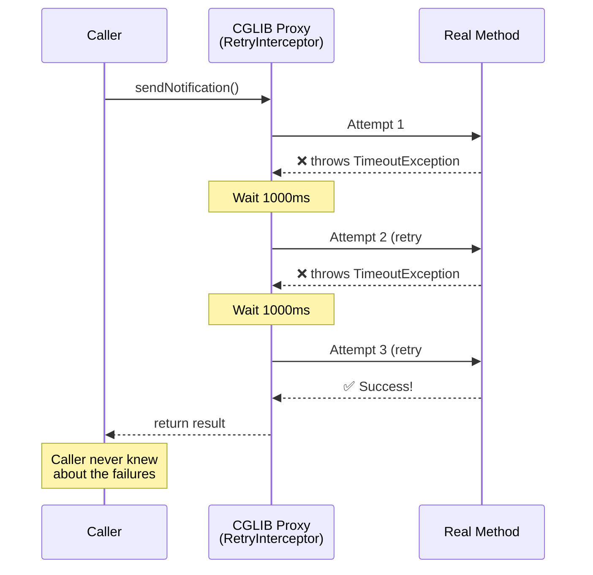

### @Retryable on the Class Level

```java
// All public methods in this class will be retried on failure
@Retryable(maxRetries = 2)
@Service
public class NotificationService {

    public void sendEmail() { ... }    // retried up to 2 times
    public void sendSms() { ... }      // retried up to 2 times

    @Retryable(maxRetries = 5)         // overrides class-level
    public void sendCriticalAlert() { ... }  // retried up to 5 times
}
```

---

## 3. @Retryable Attributes — Full Reference

```text
ATTRIBUTE     TYPE               DEFAULT    PURPOSE
──────────────────────────────────────────────────────────────────────────
value/        Class<Throwable>[] {}         Exception types to retry ON
includes                                    Empty = retry on ANY exception
                                            Alias: @Retryable(SomeException.class)

excludes      Class<Throwable>[] {}         Exception types to NEVER retry
                                            Takes priority over includes

maxRetries    int                3           Max retry attempts (NOT total attempts)
                                            Total = 1 initial + maxRetries

delay         long               1000       Base delay between retries (ms)

jitter        long               0          Random jitter added to delay (ms)
                                            Prevents thundering herd

multiplier    double             1.0        Multiply delay after each retry
                                            Enables exponential backoff

maxDelay      long               0          Maximum delay cap (0 = no cap)
                                            Prevents unbounded growth

predicate     Class              void       Custom MethodRetryPredicate
                                            Fine-grained retry decision logic
```

---

## 4. Back-off Strategies

The delay between retries is critical. Too fast = overwhelm the failing service.
Too slow = user waits forever. The right strategy depends on the failure mode.

### Strategy 1: Fixed Delay

```java
@Retryable(delay = 1000)
public void callApi() { ... }
```

```text
Attempt 1 → FAIL
  wait 1000ms
Attempt 2 → FAIL
  wait 1000ms
Attempt 3 → FAIL
  wait 1000ms
Attempt 4 → SUCCESS or GIVE UP

Use when: failures are random and short-lived (network blip)
```

```mermaid
gantt
    title Fixed Delay (1000ms)
    dateFormat X
    axisFormat %s

    section Attempts
    Attempt 1 (FAIL) :a1, 0, 100
    Wait               :crit, w1, 100, 1100
    Attempt 2 (FAIL) :a2, 1100, 1200
    Wait               :crit, w2, 1200, 2200
    Attempt 3 (FAIL) :a3, 2200, 2300
    Wait               :crit, w3, 2300, 3300
    Attempt 4 (OK)   :done, a4, 3300, 3400
```

### Strategy 2: Fixed Delay + Jitter

```java
@Retryable(delay = 1000, jitter = 300)
public void callApi() { ... }
```

```text
Attempt 1 → FAIL
  wait 1000 + random(-300, +300) = 700~1300ms
Attempt 2 → FAIL
  wait 1000 + random(-300, +300) = 700~1300ms
...

Use when: many clients retry at the same time (thundering herd)
Jitter spreads out retries so they don't all hit at the same instant.
```

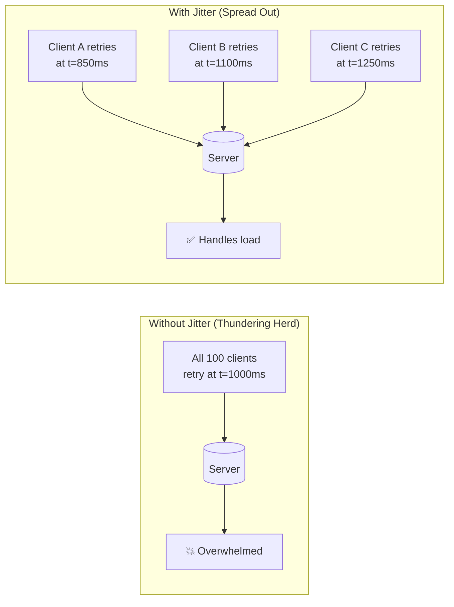

### Strategy 3: Exponential Backoff

```java
@Retryable(delay = 100, multiplier = 2)
public void callApi() { ... }
```

```text
Attempt 1 → FAIL
  wait 100ms
Attempt 2 → FAIL
  wait 100 × 2 = 200ms
Attempt 3 → FAIL
  wait 200 × 2 = 400ms
Attempt 4 → FAIL
  wait 400 × 2 = 800ms
...

Use when: service might need time to recover (deploy, restart, scaling)
Each retry waits longer, giving the service more breathing room.
```

```mermaid
gantt
    title Exponential Backoff (delay=100, multiplier=2)
    dateFormat X
    axisFormat %s

    section Attempts
    Attempt 1 (FAIL) :a1, 0, 50
    Wait 100ms         :crit, w1, 50, 150
    Attempt 2 (FAIL) :a2, 150, 200
    Wait 200ms         :crit, w2, 200, 400
    Attempt 3 (FAIL) :a3, 400, 450
    Wait 400ms         :crit, w3, 450, 850
    Attempt 4 (OK)   :done, a4, 850, 900
```

### Strategy 4: Exponential + Jitter + Cap (Production Best Practice)

```java
@Retryable(
    delay = 100,
    multiplier = 2,
    jitter = 50,
    maxDelay = 5000
)
public void callApi() { ... }
```

```text
Attempt 1 → FAIL
  wait ~100ms (100 ± 50)
Attempt 2 → FAIL
  wait ~200ms (200 ± 50)
Attempt 3 → FAIL
  wait ~400ms (400 ± 50)
Attempt 4 → FAIL
  wait ~800ms (800 ± 50)
Attempt 5 → FAIL
  wait ~1600ms (1600 ± 50)
...
  wait capped at 5000ms (never more than 5s)

This is the GOLD STANDARD for production retry logic:
  - Exponential: gives service time to recover
  - Jitter: prevents thundering herd
  - Cap: prevents absurdly long waits
```

### Strategy 5: Random Only

```java
@Retryable(delay = 0, jitter = 500)
public void callApi() { ... }
```

```text
delay=0 means no base delay. jitter provides the entire wait:
  wait random(0, 500ms)
  wait random(0, 500ms)
  ...

multiplier is IGNORED when delay=0 (nothing to multiply).
If maxDelay is set: wait = random(0, min(jitter, maxDelay))

Use when: you want maximum spread with no growth pattern.
```

### Summary

```text
STRATEGY                          WHEN TO USE                           CODE
───────────────────────────────────────────────────────────────────────────────────────
Fixed delay                       Simple, short-lived failures          delay=1000
Fixed + jitter                    Multiple clients, thundering herd     delay=1000, jitter=300
Exponential                       Service needs recovery time           delay=100, multiplier=2
Exponential + jitter + cap        Production (best practice)            delay=100, multiplier=2,
                                                                        jitter=50, maxDelay=5000
Random only                       Maximum spread, no pattern            delay=0, jitter=500
```

---

## 5. Narrowing Exceptions — What To Retry

### The Golden Rule

```text
Only retry TRANSIENT failures — errors that might succeed on the next attempt.

  TRANSIENT (retry ✅):              PERMANENT (don't retry ❌):
  ─────────────────────              ──────────────────────────
  Connection timeout                 Validation error (bad input)
  Connection refused                 Authentication failure (bad credentials)
  Deadlock                           Authorization denied (no permission)
  Temporary 503                      404 Not Found (resource doesn't exist)
  Query timeout                      Unique constraint violation
  Network packet loss                SQL syntax error

  Retrying a permanent error is POINTLESS — it will fail every single time.
  Worse, it wastes resources and delays the error response to the user.
```

### Spring's DataAccessException Hierarchy

```text
Spring wraps all database exceptions into a hierarchy:

  DataAccessException (root)
  ├── TransientDataAccessException        ← RETRY THESE
  │   ├── TransientDataAccessResourceException
  │   │   └── "Connection lost", "Pool exhausted"
  │   ├── ConcurrencyFailureException
  │   │   └── "Deadlock detected", "Lock timeout"
  │   ├── QueryTimeoutException
  │   │   └── "Query exceeded timeout"
  │   └── CannotAcquireLockException
  │       └── "Could not acquire lock"
  │
  └── NonTransientDataAccessException     ← DO NOT RETRY
      ├── DataIntegrityViolationException
      │   └── "Unique constraint violated"
      ├── BadSqlGrammarException
      │   └── "SQL syntax error"
      └── InvalidDataAccessApiUsageException
          └── "Wrong API usage"
```

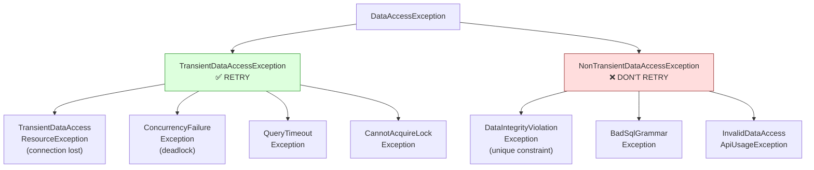

### Code Examples

```java
// ❌ BAD: retries EVERYTHING including permanent errors
@Retryable
public Workflow create(WorkflowCreateRequest request) { ... }

// ✅ GOOD: only retries transient DB errors
@Retryable(includes = TransientDataAccessException.class)
public Workflow create(WorkflowCreateRequest request) { ... }

// ✅ GOOD: retries multiple transient exception types
@Retryable(includes = {
    TransientDataAccessException.class,    // DB connection issues
    java.net.ConnectException.class,       // network issues
    java.util.concurrent.TimeoutException.class  // timeouts
})
public void callExternalService() { ... }

// ✅ GOOD: retry everything EXCEPT permanent errors
@Retryable(excludes = {
    IllegalArgumentException.class,        // bad input
    jakarta.validation.ValidationException.class,  // validation
    ResourceNotFoundException.class        // 404
})
public void process() { ... }
```

### Custom Predicate — Advanced Filtering

```java
// Retry only if the exception message contains "connection"
public class ConnectionRetryPredicate implements MethodRetryPredicate {
    @Override
    public boolean shouldRetry(Method method, Throwable throwable) {
        return throwable.getMessage() != null
            && throwable.getMessage().toLowerCase().contains("connection");
    }
}

@Retryable(predicate = ConnectionRetryPredicate.class)
public void queryDatabase() { ... }
```

```text
Custom predicates run AFTER includes/excludes filtering:

  1. Check includes → exception must match at least one (if specified)
  2. Check excludes → exception must NOT match any
  3. Check predicate → must return true

  All three must agree for a retry to happen.
```

---

## 6. @ConcurrencyLimit

### What It Is

```text
@ConcurrencyLimit restricts how many threads can execute a method at the same time.

Think of it as a semaphore applied via AOP:
  - Thread arrives → acquires a permit (if available) → executes method
  - No permits available → thread BLOCKS until one is released
  - Method returns/throws → permit is released

It's the method-level equivalent of a connection pool size limit.
```

### Basic Usage

```java
// At most 5 concurrent executions
@ConcurrencyLimit(5)
public Page<Workflow> findAll(WorkflowFilterRequest filter, Pageable pageable) {
    return workflowRepository.findAll(spec, pageable);
}

// Exclusive access — only one thread at a time (like synchronized)
@ConcurrencyLimit(1)
public void generateDailyReport() {
    // heavy computation that shouldn't run in parallel
}
```

### How It Works

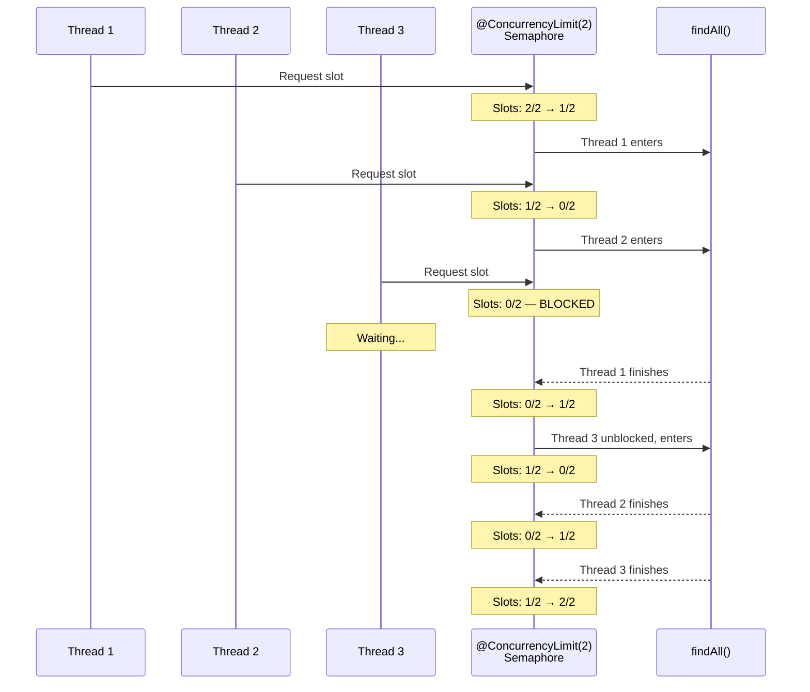

### Why It Matters — Virtual Threads

```text
TRADITIONAL (platform threads):

  Tomcat thread pool: 200 threads
  Each request = 1 platform thread
  → Natural limit: max 200 concurrent findAll() calls
  → HikariCP (10 connections) can handle 200 threads
    because most threads are waiting for I/O, not holding connections

VIRTUAL THREADS (spring.threads.virtual.enabled=true):

  No thread pool limit
  Each request = 1 virtual thread (cheap to create)
  → 50,000 concurrent requests = 50,000 virtual threads
  → All 50,000 call findAll() simultaneously
  → Each needs a database connection
  → HikariCP (10 connections) → 49,990 threads waiting for a connection
  → Connection timeout → cascade failure

  @ConcurrencyLimit(5) solves this:
  → Only 5 virtual threads hold DB connections at a time
  → 49,995 virtual threads wait BEFORE acquiring a connection
  → DB stays healthy, all requests eventually complete
```

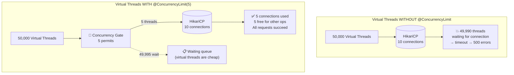

### Class-Level vs Method-Level

```java
// Class-level: ALL methods share a single limit of 10
@ConcurrencyLimit(10)
@Service
public class ReportService {
    public Report generateMonthly() { ... }  // shares the 10 limit
    public Report generateWeekly() { ... }   // shares the 10 limit
}

// Method-level: each method has its OWN limit
@Service
public class WorkflowService {

    @ConcurrencyLimit(5)
    public Page<Workflow> findAll() { ... }   // 5 concurrent max

    @ConcurrencyLimit(3)
    public Workflow create() { ... }          // 3 concurrent max (independent)
}
```

### Dynamic Limit from Properties

```java
// Limit from application.yaml (changeable without recompile)
@ConcurrencyLimit(limitString = "${flowforge.query.concurrency-limit:5}")
public Page<Workflow> findAll() { ... }
```

```yaml
# application.yaml
flowforge:
  query:
    concurrency-limit: 10   # override the default of 5
```

---

## 7. @EnableResilientMethods

### What It Does

```text
@EnableResilientMethods is the ON switch for @Retryable and @ConcurrencyLimit.

WITHOUT it: the annotations are just metadata — Spring ignores them completely.
WITH it: Spring creates proxies that intercept and apply retry/concurrency logic.

This follows Spring's standard activation pattern:
  @EnableTransactionManagement  → activates @Transactional
  @EnableAsync                  → activates @Async
  @EnableCaching                → activates @Cacheable
  @EnableScheduling             → activates @Scheduled
  @EnableResilientMethods       → activates @Retryable + @ConcurrencyLimit
```

### How To Enable

```java
@Configuration
@EnableResilientMethods
public class ResilienceConfig {
    // No beans needed. The annotation does everything.
}
```

```text
Alternatively, put it on the main class:

  @SpringBootApplication
  @EnableResilientMethods
  public class FlowforgeApplication { ... }

Either location works. A dedicated config class is cleaner for separation.
```

### What It Registers Internally

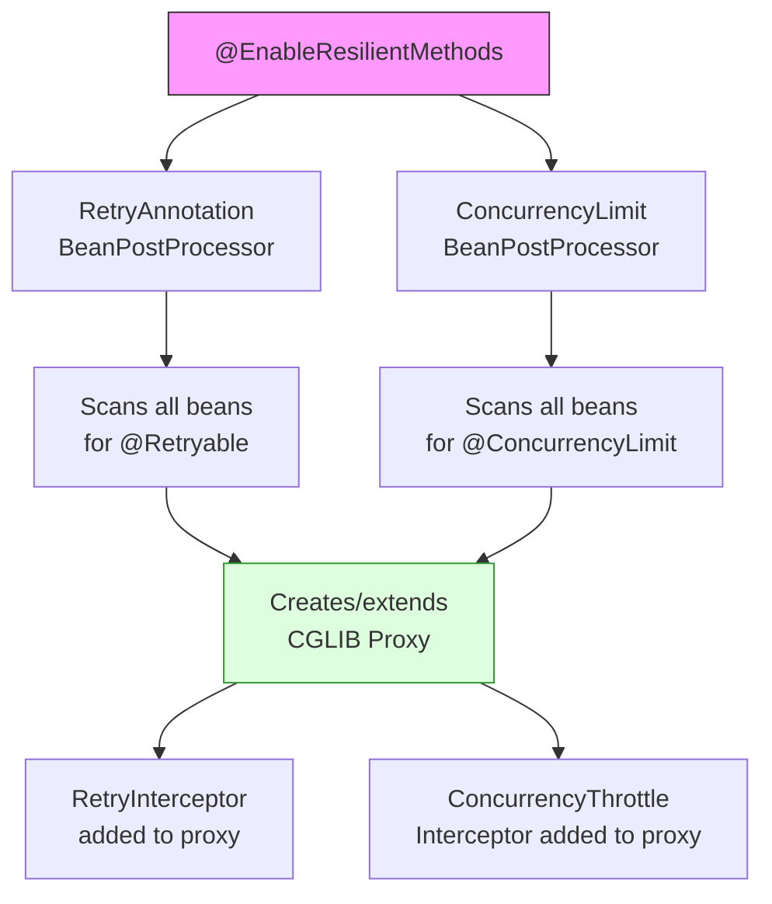

```text
If a bean already has a proxy (e.g., from @Transactional):
  → The new interceptors are ADDED to the existing proxy
  → Spring doesn't create a proxy-of-a-proxy
  → One CGLIB proxy, multiple interceptors stacked inside it
```

### Attributes

```text
ATTRIBUTE          TYPE      DEFAULT              PURPOSE
─────────────────────────────────────────────────────────────────────
proxyTargetClass   boolean   true (Boot default)   CGLIB (true) or JDK Dynamic (false)
order              int       MAX_VALUE - 1         Aspect ordering
                                                   Lower = higher priority = outermost
```

---

## 8. Aspect Ordering — Why It Matters

When multiple AOP annotations are on the same method, the ORDER of the
wrapping interceptors determines correctness.

### The Problem

```text
WorkflowService.create() has both:
  @Retryable(includes = TransientDataAccessException.class, maxRetries = 3, delay = 500)
  @Transactional

Two possible orderings:

  CORRECT: Retry wraps OUTSIDE Transaction
    Retry → [Transaction → Method → Commit/Rollback] → Retry if failed
    Each retry gets a FRESH transaction ✅

  WRONG: Transaction wraps OUTSIDE Retry
    Transaction → [Retry → Method → Retry if failed] → Commit/Rollback
    All retries use the SAME (broken) transaction ❌
```

### Default Spring Orders

```text
Spring annotation         Default order          Runs as...
──────────────────────────────────────────────────────────────
@EnableResilientMethods    MAX_VALUE - 1          OUTERMOST (runs first)
                          (2,147,483,646)

@EnableTransactionMgmt    MAX_VALUE               INNER (runs after resilience)
                          (2,147,483,647)

Lower order number = higher priority = outermost wrapper.

By default, retry wraps OUTSIDE transaction. This is CORRECT.
Spring chose these defaults intentionally.
```

### Correct Flow — Retry Outside Transaction

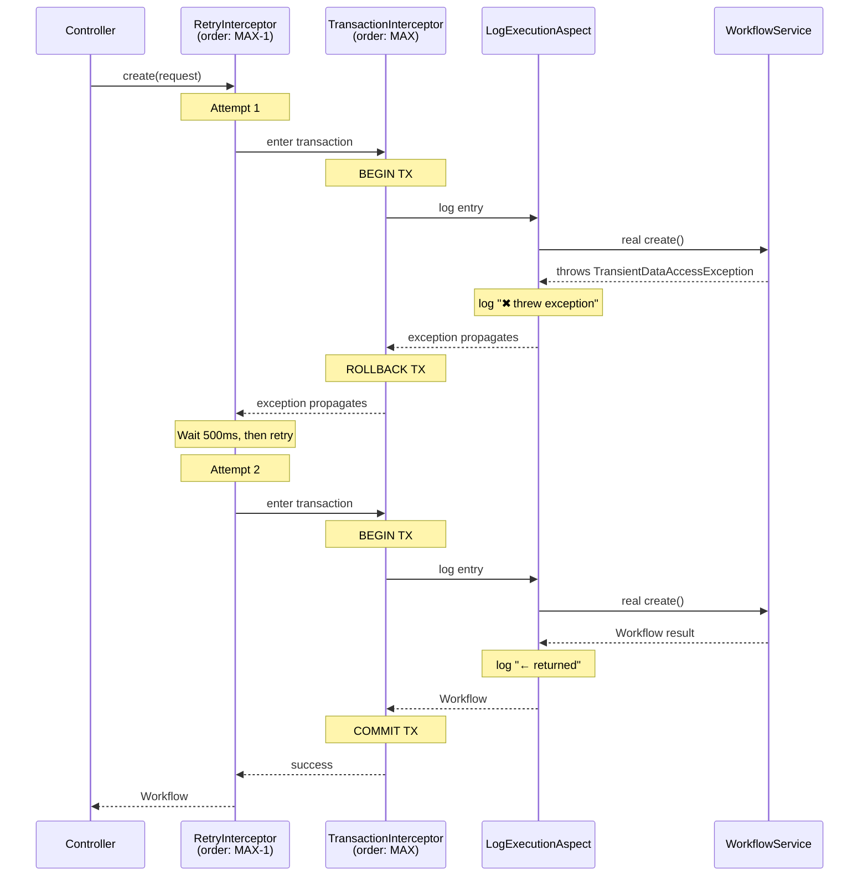

### Full Aspect Chain in FlowForge

```text
For WorkflowService.create():

  Controller
    → CGLIB Proxy
      → RetryInterceptor           @Retryable (outermost — catches failures, retries)
        → TransactionInterceptor   @Transactional (each attempt = fresh TX)
          → LogExecutionAspect     @Around serviceLayer() (logs entry/exit/error)
            → Real WorkflowService.create()  (actual business logic)

For WorkflowService.findAll():

  Controller
    → CGLIB Proxy
      → ConcurrencyThrottle        @ConcurrencyLimit(5) (permits, blocks if full)
        → TransactionInterceptor   @Transactional(readOnly=true)
          → LogExecutionAspect     @Around serviceLayer()
            → Real WorkflowService.findAll()  (spec + pagination query)
```

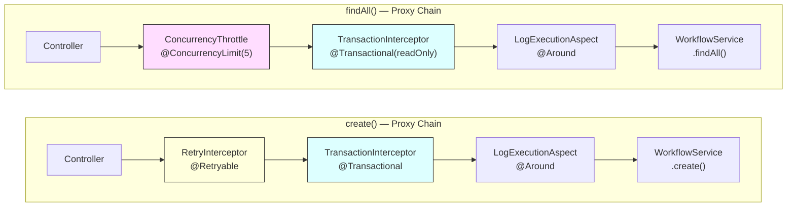

---

## 9. MethodRetryEvent — Observing Retries

```text
Spring publishes a MethodRetryEvent for EVERY failed attempt.
The caller of the @Retryable method only sees the LAST exception (if all retries fail).
But event listeners see EVERY intermediate failure.
```

### Listening for Retry Events

```java
@Component
public class RetryEventListener {

    private static final Logger log = LoggerFactory.getLogger(RetryEventListener.class);

    @EventListener
    public void onRetry(MethodRetryEvent event) {
        log.warn("⟳ Retry #{} for {}.{}() — Cause: {}",
            event.getRetryCount(),
            event.getMethod().getDeclaringClass().getSimpleName(),
            event.getMethod().getName(),
            event.getFailure().getMessage());
    }
}
```

```text
Timeline with events:

  Attempt 1 → FAIL → MethodRetryEvent(retryCount=1, failure=TimeoutException)
  Attempt 2 → FAIL → MethodRetryEvent(retryCount=2, failure=TimeoutException)
  Attempt 3 → FAIL → MethodRetryEvent(retryCount=3, failure=TimeoutException)
  Attempt 4 → SUCCESS → no event (success is not a retry)

  OR

  Attempt 1 → FAIL → MethodRetryEvent
  Attempt 2 → FAIL → MethodRetryEvent
  Attempt 3 → FAIL → MethodRetryEvent
  Attempt 4 → FAIL → NO event — exception propagates to caller

Use cases for MethodRetryEvent:
  - Alerting (Slack/PagerDuty if retry rate exceeds threshold)
  - Metrics (track retry rate over time)
  - Logging (centralized retry log separate from application log)
```

---

## 10. @Retryable vs spring-retry vs Resilience4j

```text
FEATURE                   spring-retry (old)       Spring 7 @Retryable      Resilience4j
─────────────────────────────────────────────────────────────────────────────────────────────
Location                  External library          Built-in (spring-context) External library
Package                   o.s.retry                 o.s.resilience            io.github.resilience4j
Enable annotation         @EnableRetry              @EnableResilientMethods   Auto-config
Declarative retry         @Retryable                @Retryable               @Retry
Programmatic retry        RetryTemplate             RetryOperations          Retry.of()
@Recover fallback         ✅ Yes                    ❌ No                     ❌ No (use decorators)
Stateful retry            ✅ Yes                    ❌ No                     ✅ Yes
Circuit breaker           ❌ No                     ❌ No                     ✅ Yes
Bulkhead                  ❌ No                     @ConcurrencyLimit         ✅ Yes
Rate limiter              ❌ No                     ❌ No                     ✅ Yes
Time limiter              ❌ No                     ❌ No                     ✅ Yes
Reactive support          ❌ No                     ✅ Yes (Mono/Flux)        ✅ Yes
Event system              RetryListener             MethodRetryEvent          EventPublisher
Metrics                   ❌ No                     ❌ No                     ✅ Micrometer
Dashboard                 ❌ No                     ❌ No                     ✅ Actuator
```

### When To Use What

```text
USE Spring 7 @Retryable when:
  ✅ Simple retry logic (most common case — 90% of apps)
  ✅ You don't need circuit breaking or rate limiting
  ✅ You want zero external dependencies
  ✅ You need @ConcurrencyLimit for virtual thread safety

USE Resilience4j when:
  ✅ You need circuit breakers (stop calling failing service entirely)
  ✅ You need rate limiting at the client side
  ✅ You need bulkheading (isolate failures between services)
  ✅ You need metrics and monitoring dashboards
  ✅ You're building a microservices system with many inter-service calls
```

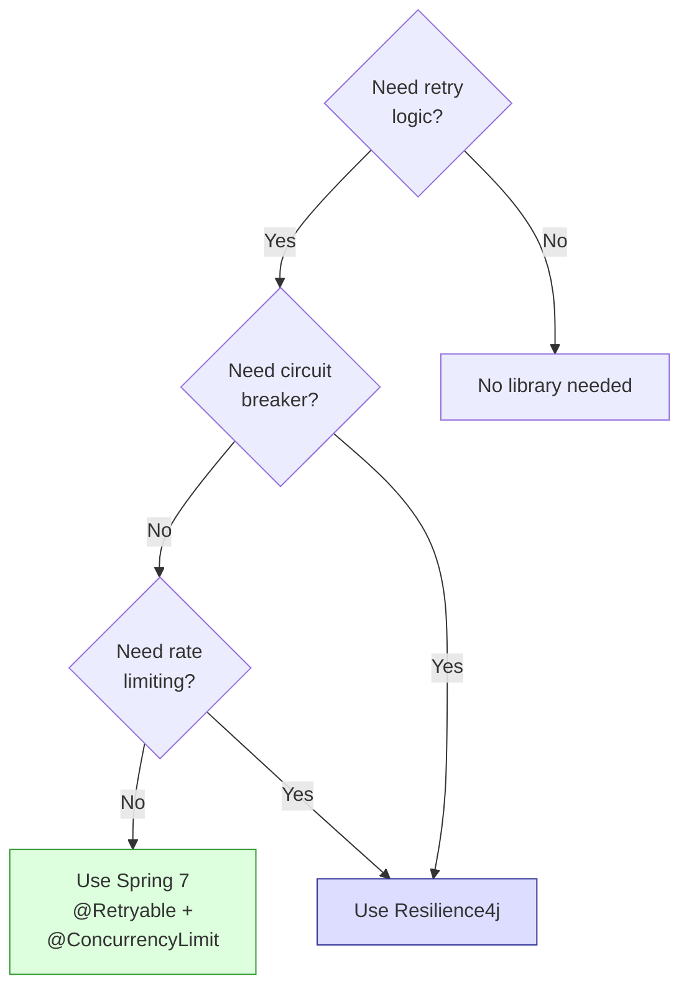

---

## 11. Idempotency — The Hidden Requirement

```text
@Retryable has a CRITICAL prerequisite: the method must be IDEMPOTENT.

Idempotent = calling it multiple times has the same effect as calling it once.

  IDEMPOTENT (safe to retry):
    GET /api/workflows/123        → always returns the same workflow
    PUT /api/workflows/123        → replaces with the same data
    DELETE /api/workflows/123     → deletes once, subsequent calls are no-ops
    SELECT * FROM workflows       → read-only, no side effects
    INSERT with ON CONFLICT DO NOTHING → skips duplicate

  NOT IDEMPOTENT (dangerous to retry):
    POST /api/payments            → charges customer TWICE on retry!
    INSERT INTO orders (...)      → creates DUPLICATE order on retry!
    counter.incrementAndGet()     → increments TWICE on retry!
    sendEmail(to, body)           → sends email TWICE on retry!
```

### Making Non-Idempotent Operations Safe

```text
TECHNIQUE                         HOW IT WORKS
──────────────────────────────────────────────────────────────────
Idempotency key                   Client sends unique ID, server checks for duplicate
                                  POST /payments  { "idempotencyKey": "abc-123" }
                                  → INSERT ... ON CONFLICT (key) DO NOTHING

Database constraint               UNIQUE index prevents duplicate rows
                                  → retry inserts → constraint catches it → no duplicate

Optimistic locking                @Version field prevents concurrent modifications
                                  → retry with stale version → OptimisticLockException

Check-then-act                    if (!alreadyProcessed(id)) { process(id); }
                                  → retry checks flag → skips if already done

Outbox pattern                    Write to outbox table (idempotent) → async processor sends
                                  → retry writes same outbox row → processor deduplicates
```

```text
Our FlowForge create() method:

  @Retryable(includes = TransientDataAccessException.class)
  @Transactional
  public Workflow create(WorkflowCreateRequest request) {
      Workflow workflow = workflowMapper.toEntity(request);
      return workflowRepository.save(workflow);
  }

  Is this safe to retry?
  → YES, because each workflow gets a new UUID (no duplicate key)
  → If the first attempt fails with a connection error, the transaction
    was ROLLED BACK — the workflow was never saved
  → The retry creates a new transaction and saves successfully
  → Result: exactly one workflow created

  If we had a UNIQUE constraint on name:
  → First attempt succeeds → retry would hit unique constraint
  → But @Retryable(includes = TransientDataAccessException.class) would NOT retry
    DataIntegrityViolationException (it's non-transient) → correct behavior!
```

---

## 12. FlowForge Implementation

### Config — ResilienceConfig.java

```java
package com.flowforge.flowforge.config;

import org.springframework.context.annotation.Configuration;
import org.springframework.resilience.annotation.EnableResilientMethods;

@Configuration
@EnableResilientMethods
public class ResilienceConfig {
    // Activates @Retryable and @ConcurrencyLimit processing for all beans.
    // No additional beans needed.
}
```

### Service — @Retryable on create()

```java
// Production-style: retry ONLY on transient DB errors
@Retryable(includes = TransientDataAccessException.class, maxRetries = 3, delay = 500)
@Transactional
public Workflow create(WorkflowCreateRequest request) {
    Workflow workflow = workflowMapper.toEntity(request);
    return workflowRepository.save(workflow);
}
```

```text
Design decisions:

  includes = TransientDataAccessException.class
  → Only retry transient DB issues (connection lost, deadlock, timeout)
  → Validation errors, unique constraint violations → NOT retried

  maxRetries = 3
  → 4 total attempts. Most transient issues resolve in 1-2 retries.

  delay = 500
  → 500ms between attempts. Enough time for a connection to recover.
  → For external APIs, you might use exponential backoff instead.

  @Retryable is BEFORE @Transactional (lower order number)
  → Each retry gets a FRESH transaction (correct behavior)
```

### Service — @ConcurrencyLimit on findAll()

```java
@ConcurrencyLimit(5)
public Page<Workflow> findAll(WorkflowFilterRequest filter, Pageable pageable) {
    sortValidator.validate(pageable.getSort());
    // ... specification, full-text search, pagination
}
```

```text
Design decisions:

  @ConcurrencyLimit(5)
  → findAll() is the most expensive query:
    - JPA Specification filtering
    - Full-text search with tsvector/tsquery (PostgreSQL)
    - Pagination with COUNT query
  → Each execution holds a DB connection for the query duration
  → HikariCP default: 10 connections
  → Limit to 5 leaves 5 connections free for create/update/delete
  → With virtual threads enabled, this prevents connection exhaustion
```

### Service — Retry Demo Method

```java
@Retryable(maxRetries = 3, delay = 1000, jitter = 200)
public String simulateTransientFailure() {
    double random = Math.random();
    if (random < 0.6) {
        throw new RuntimeException(
                "Simulated transient failure (random=" + String.format("%.2f", random) + ")");
    }
    return "Success (random=" + String.format("%.2f", random) + ")";
}
```

```text
For testing/learning. Call GET /api/v1/debug/retry:

  60% chance of failure per attempt → with 4 attempts:
    P(all fail) = 0.6^4 ≈ 13%
    P(at least one succeeds) ≈ 87%

  Watch server logs to see @LogExecution logging each retry:

    INFO  → WorkflowService.simulateTransientFailure() called with 0 arg(s)
    ERROR ✖ WorkflowService.simulateTransientFailure() threw RuntimeException after 0 ms
    INFO  → WorkflowService.simulateTransientFailure() called with 0 arg(s)   ← RETRY
    INFO  ← WorkflowService.simulateTransientFailure() returned in 0 ms       ← SUCCESS
```

### Controller — Debug Endpoint

```java
@GetMapping("/retry")
public ResponseEntity<Map<String, String>> testRetry() {
    String result = workflowService.simulateTransientFailure();
    return ResponseEntity.ok(Map.of("result", result));
}
```

### File Structure

```text
flowforge/src/main/java/com/flowforge/flowforge/
├── config/
│   └── ResilienceConfig.java          # @EnableResilientMethods
├── service/
│   └── WorkflowService.java          # @Retryable on create()
│                                      # @ConcurrencyLimit(5) on findAll()
│                                      # simulateTransientFailure() demo
└── controller/
    └── DebugController.java           # GET /api/v1/debug/retry
```

---

## 13. Common Mistakes

```text
MISTAKE 1: Retrying non-idempotent operations
  ❌ @Retryable on payment processing without idempotency key
  ✅ Add idempotency key or use @Retryable only on reads/idempotent writes

MISTAKE 2: Retrying permanent errors
  ❌ @Retryable without includes (retries validation errors)
  ✅ @Retryable(includes = TransientDataAccessException.class)

MISTAKE 3: Wrong aspect ordering (transaction wraps retry)
  ❌ Custom @Order on @EnableResilientMethods that makes it inner
  ✅ Leave default ordering — retry should wrap outside transaction

MISTAKE 4: @Retryable on private methods
  ❌ @Retryable on private method (AOP can't proxy private methods)
  ✅ @Retryable only on public methods

MISTAKE 5: Self-invocation bypasses @Retryable
  ❌ this.retryableMethod() — bypasses proxy, no retry
  ✅ Call from another bean, or inject @Lazy self-reference

MISTAKE 6: @ConcurrencyLimit too low
  ❌ @ConcurrencyLimit(1) on a high-traffic endpoint (serializes everything)
  ✅ Set limit based on downstream capacity (e.g., DB pool size / 2)

MISTAKE 7: Forgetting @EnableResilientMethods
  ❌ Add @Retryable but no @EnableResilientMethods → silently ignored
  ✅ Always verify by checking logs for retry behavior
```

---

## 14. Interview Questions

```text
Q: What is @Retryable in Spring Framework 7?
A: A built-in annotation (org.springframework.resilience.annotation.Retryable)
   that automatically retries a method when it throws a configured exception.
   It works via AOP proxying. Activated by @EnableResilientMethods.

Q: How does @Retryable interact with @Transactional?
A: @Retryable has higher priority (lower order) and wraps OUTSIDE @Transactional.
   Each retry attempt gets a FRESH transaction. If a retry succeeds, only that
   transaction is committed. Failed transactions are rolled back cleanly.

Q: What is exponential backoff with jitter?
A: A retry strategy where the delay doubles after each attempt (exponential)
   and a random offset is added (jitter). This prevents thundering herd — many
   clients retrying at the exact same time overwhelming the server.
   Example: @Retryable(delay=100, multiplier=2, jitter=50, maxDelay=5000)

Q: Why is @ConcurrencyLimit important with virtual threads?
A: Virtual threads remove the natural thread pool limit. Without concurrency
   limiting, millions of virtual threads can call a method simultaneously,
   overwhelming downstream resources (database connection pool). @ConcurrencyLimit
   acts as an explicit bottleneck, protecting the resource.

Q: What's the difference between @ConcurrencyLimit and rate limiting?
A: @ConcurrencyLimit limits CONCURRENT executions (how many threads run at once).
   Rate limiting limits THROUGHPUT (how many requests per time window).
   Concurrency limit = semaphore. Rate limit = token bucket or sliding window.

Q: How do you decide which exceptions to retry?
A: Retry only transient errors — ones that might succeed on the next attempt.
   Use includes = TransientDataAccessException.class for DB retries.
   Never retry validation errors, auth errors, or 404s — they'll fail every time.

Q: What happens if all retries fail?
A: The LAST exception is propagated to the caller. The caller sees exactly one
   exception, as if @Retryable wasn't there. MethodRetryEvent is published for
   each intermediate failure (observable via @EventListener).

Q: How do you make a method safe to retry?
A: Make it IDEMPOTENT — calling it N times has the same effect as calling it once.
   Techniques: unique constraints, idempotency keys, optimistic locking,
   check-then-act patterns.
```
