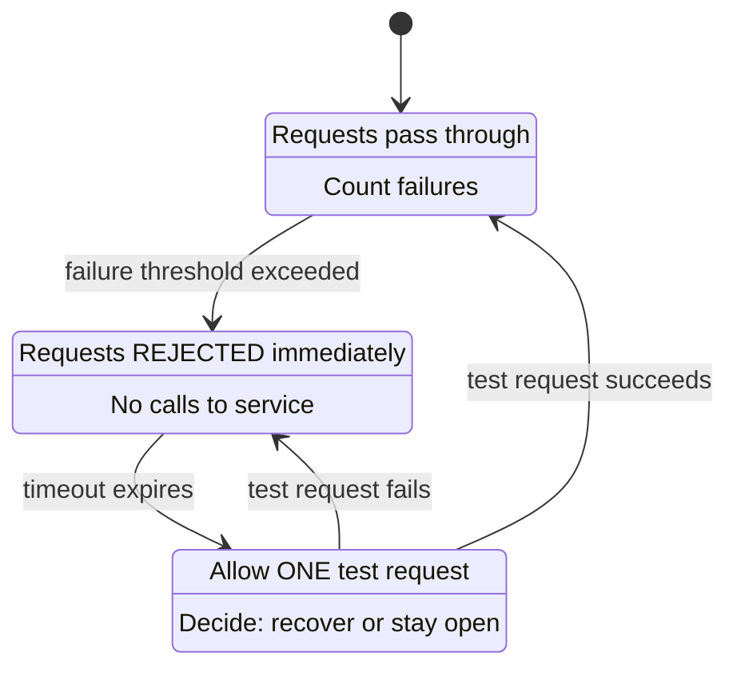

# Distributed Systems & Resilience — Terminology Reference

Every term you need to understand when discussing resilience, networking,
performance, and distributed systems. Grouped by category.

---

## 1. Latency & Timing

### Latency

```text
The time it takes for a single operation to complete.
Measured from "request sent" to "response received."

  Client ──request──▶ Server ──processing──▶ Client
  |◄──────────── latency ─────────────────►|

  Example: "This API has a latency of 45ms"
  Means: from the moment you send the request to when you get the response = 45ms.

  Low latency  = fast (good)     e.g., in-memory cache lookup: 0.1ms
  High latency = slow (bad)      e.g., cross-continent API call: 200ms
```

### RTT (Round-Trip Time)

```text
The time for a packet to travel from sender to receiver AND back.
Network-level measurement (doesn't include server processing time).

  Client ──packet──▶ Server
  Client ◀──ack────  Server
  |◄──────── RTT ──────────►|

  Latency ≈ RTT + server processing time

  Typical RTTs:
    Same data center:      0.5 ms
    Same city:             1-5 ms
    Same continent:        10-50 ms
    Cross-continent:       100-300 ms
    Geostationary satellite: 600 ms

  Why it matters:
    - Each HTTP request needs at least 1 RTT (TCP handshake adds more)
    - TLS adds 1-2 more RTTs
    - A chatty protocol (many small requests) suffers in high-RTT networks
    - Retry delay should be at least 1 RTT (otherwise you retry before the
      previous attempt even reached the server)
```

### Jitter

```text
The VARIATION in latency over time. Not the latency itself, but how
much the latency jumps around.

  Request 1: 50ms
  Request 2: 52ms
  Request 3: 200ms  ← spike
  Request 4: 48ms
  Request 5: 180ms  ← spike

  Average latency: 106ms
  Jitter: HIGH (values swing from 48ms to 200ms)

  Low jitter  = consistent latency (predictable, good)
  High jitter = unpredictable latency (bad for real-time systems)

  JITTER IN RETRY CONTEXT:
    A random offset added to retry delays to prevent thundering herd.

    @Retryable(delay = 1000, jitter = 300)
    → actual delay = 1000 + random(-300, +300) = 700ms to 1300ms

    Without jitter: 100 clients all retry at t=1000ms → server overwhelmed
    With jitter: 100 clients retry between t=700ms and t=1300ms → spread out
```

### Timeout

```text
The maximum time you're willing to wait before giving up.

  Types:
    Connection timeout:   max time to establish a TCP connection
    Read/Socket timeout:  max time to wait for data after connection is established
    Request timeout:      max total time for the entire request (connect + read)
    Idle timeout:         max time a connection can sit unused before being closed

  Example:
    RestClient.builder()
        .connectTimeout(Duration.ofSeconds(2))   // give up connecting after 2s
        .readTimeout(Duration.ofSeconds(5))      // give up reading after 5s

  Too short: false timeouts on slow but valid responses
  Too long:  threads/connections held hostage, cascade failures
  Rule of thumb: timeout = P99 latency × 2 (or use adaptive timeouts)

  TIMEOUT + RETRY:
    If timeout is 5s and retry delay is 1s with 3 retries:
    Worst case total wait = 5s + 1s + 5s + 1s + 5s + 1s + 5s = 23s
    Always calculate worst-case total time when combining timeouts with retries.
```

### Cold Start

```text
The extra latency on the FIRST request after a period of inactivity.

  Causes:
    - JVM: JIT hasn't compiled hot paths yet (interpreted mode is slow)
    - Connection pool: no connections established yet (TCP + TLS handshake)
    - Cache: empty on startup (every request hits the database)
    - Lambda/serverless: container needs to be provisioned

  First request:   500ms (cold)
  Second request:  50ms  (warm — JIT compiled, connection reused, cache hit)

  Mitigation:
    - Warm-up requests on startup
    - Keep-alive connections
    - Cache pre-loading
    - Provisioned concurrency (serverless)
```

### Warm-up

```text
The period after startup where performance is worse than steady state.

  JVM warm-up:
    JIT compiler needs ~10,000 invocations of a method before it compiles
    to optimized native code. During warm-up, methods run in interpreted mode
    (10-100x slower).

  Spring context warm-up:
    Bean creation, dependency injection, proxy generation all happen at startup.
    First request may trigger lazy initialization of additional beans.

  Production strategy:
    Send synthetic traffic during warm-up before accepting real traffic.
    Kubernetes: use startup probes to delay traffic until warm-up completes.
```

---

## 2. Throughput & Capacity

### Throughput

```text
The number of operations completed per unit of time.

  Throughput = requests / second  (or transactions/sec, messages/sec, etc.)

  Example:
    "This API handles 5,000 requests/second"
    "The database processes 10,000 queries/second"

  Latency vs Throughput:
    Latency  = how fast ONE request is (time per operation)
    Throughput = how many requests per second (operations per time)

    You can have:
      Low latency + low throughput:   fast but sequential (one at a time)
      High latency + high throughput: slow individually but massively parallel
      Low latency + high throughput:  the dream ✅

  Analogy:
    Latency   = how fast a car goes (speed)
    Throughput = how many cars pass per hour (flow rate)
    A highway has high throughput even though each car isn't faster.
```

### Bandwidth

```text
The MAXIMUM data transfer rate of a network link.

  Bandwidth = maximum bits per second the link can carry.
  Throughput = actual bits per second you're achieving.

  Throughput ≤ Bandwidth (always)

  Example:
    Your internet connection: 1 Gbps bandwidth
    Actual download speed:    200 Mbps throughput (due to congestion, distance, etc.)

  Bandwidth vs Latency:
    Bandwidth = width of a pipe (how much water flows per second)
    Latency   = length of a pipe (how long for first drop to arrive)

    Increasing bandwidth doesn't reduce latency.
    A fatter pipe doesn't make water flow faster — just more of it at once.
```

### Saturation

```text
How close a resource is to its maximum capacity.

  Saturation = current usage / maximum capacity × 100%

  Examples:
    CPU: 95% saturation → almost no headroom for spikes
    Connection pool: 9/10 connections in use → 90% saturated
    Thread pool: 195/200 threads busy → 97.5% saturated

  < 70% saturation:  healthy (headroom for spikes)
  70-85% saturation: warning (approaching limit)
  > 85% saturation:  danger (spikes will cause failures)

  Virtual threads change this:
    Thread pool saturation becomes irrelevant (unlimited virtual threads)
    But connection pool saturation becomes the new bottleneck.
    → @ConcurrencyLimit prevents downstream resource saturation.
```

### Utilization

```text
The fraction of time a resource is BUSY (not idle).

  Utilization = busy time / total time × 100%

  CPU utilization: 60% → CPU is busy 60% of the time, idle 40%
  Disk utilization: 30% → disk is doing I/O 30% of the time

  Utilization ≠ Saturation:
    A resource at 80% utilization might not be saturated if it can burst.
    A resource at 50% utilization might be saturated if it's single-threaded.

  Universal Scalability Law:
    As utilization approaches 100%, latency increases NON-LINEARLY.
    At 80% utilization: latency ≈ 5x baseline
    At 90% utilization: latency ≈ 10x baseline
    At 99% utilization: latency ≈ 100x baseline
    → Never run resources above 70-80% sustained utilization.
```

---

## 3. Percentiles & SLAs

### P50 / P95 / P99 / P99.9 (Percentiles) — Deep Dive

```text
WHAT IS A PERCENTILE?

  "P95 = 120ms" means:
    95% of ALL requests completed in 120ms or LESS.
    Only 5% of requests were slower than 120ms.

  That's it. That's the whole concept.

  P followed by a number = "this percentage of requests were faster than this value."
```

#### Step-by-Step: How To Calculate Percentiles

```text
Imagine your API received 20 requests in the last minute.
Here are their response times (in milliseconds), as they happened:

  Request  1:  42ms      Request 11:  38ms
  Request  2:  51ms      Request 12:  55ms
  Request  3:  39ms      Request 13:  48ms
  Request  4:  65ms      Request 14:  44ms
  Request  5:  47ms      Request 15:  950ms  ← slow! (GC pause)
  Request  6:  43ms      Request 16:  41ms
  Request  7:  110ms     Request 17:  46ms
  Request  8:  44ms      Request 18:  52ms
  Request  9:  40ms      Request 19:  43ms
  Request 10:  49ms      Request 20:  39ms

STEP 1: Sort all response times from fastest to slowest.

  Position:  1    2    3    4    5    6    7    8    9   10
  Latency:  38   39   39   40   41   42   43   43   44   44
             ↑                                            ↑
           fastest                                    middle-ish

  Position: 11   12   13   14   15   16   17   18   19   20
  Latency:  46   47   48   49   51   52   55   65  110  950
                                                         ↑
                                                      slowest

STEP 2: Find the position for each percentile.

  Position = percentile × total_count / 100

  P50 position  = 50 × 20 / 100  = 10th value
  P90 position  = 90 × 20 / 100  = 18th value
  P95 position  = 95 × 20 / 100  = 19th value
  P99 position  = 99 × 20 / 100  = 19.8 → round up to 20th value

STEP 3: Read off the values.

  P50  = 10th value = 44ms     ← "the typical request"
  P90  = 18th value = 65ms     ← "most users see this or better"
  P95  = 19th value = 110ms    ← "slow users see this"
  P99  = 20th value = 950ms    ← "worst case (the GC pause victim)"

  AVERAGE = (38+39+39+...+110+950) / 20 = 96.5ms   ← MISLEADING!
    The average says "typical response is ~97ms"
    But 18 out of 20 requests (90%) were under 65ms!
    One 950ms outlier dragged the average up by 45ms.
```

#### Why Averages Lie

```text
SCENARIO: Two APIs, which is better?

  API A response times: [50, 50, 50, 50, 50, 50, 50, 50, 50, 50]
  API B response times: [10, 10, 10, 10, 10, 10, 10, 10, 10, 410]

  Average:
    API A average = 50ms
    API B average = 50ms
    → They look IDENTICAL based on average.

  Percentiles:
    API A:  P50 = 50ms    P95 = 50ms    P99 = 50ms
    API B:  P50 = 10ms    P95 = 10ms    P99 = 410ms

    API B is FASTER for 90% of users (10ms vs 50ms) ✅
    API B is TERRIBLE for 1% of users (410ms vs 50ms) ❌

  Averages hide this completely. Percentiles expose it.

  ANOTHER WAY TO SEE IT:

  Your API handles 10,000 requests per second.

    P99 = 200ms means:
      99% → 9,900 requests finish in ≤ 200ms   (happy users)
      1%  → 100 requests PER SECOND are > 200ms (frustrated users)
      100 × 60 = 6,000 frustrated users PER MINUTE
      100 × 3600 = 360,000 frustrated users PER HOUR

    Even 1% is A LOT of real people when you have high traffic.
```

#### What Each Percentile Tells You

```text
PERCENTILE   NAME              WHAT IT REPRESENTS                    WHO CARES
──────────────────────────────────────────────────────────────────────────────────
P50          Median            The TYPICAL experience                Product team
                               Half of users are faster, half slower
                               "What does a normal request feel like?"

P75          Upper quartile    Slower-than-average experience        Engineers
                               25% of users are slower than this
                               "Where do things start getting sluggish?"

P90          —                 Only 10% of users are slower           Engineers
                               "Are most users happy?"

P95          —                 Only 5% of users are slower            SRE / DevOps
                               "Is the system behaving reasonably?"
                               Common SLO target.

P99          —                 Only 1% of users are slower            SRE / DevOps
                               "What's the worst realistic experience?"
                               The standard SLA metric.

P99.9        Three nines       Only 0.1% (1 in 1000) are slower      Platform team
                               "What's the absolute worst case?"
                               For high-traffic systems only.
```

#### Visual: What Percentiles Look Like on a Graph

```text
Imagine plotting all 1000 requests sorted by latency:

  Latency (ms)
  2000 |                                                            *  ← P99.9
       |                                                         *
  1000 |                                                      *
       |                                                   *
   500 |                                                *              ← P99
       |                                          * * *
   200 |                                    * * *                      ← P95
       |                              * * *
   100 |                        * * *                                  ← P90
       |                  * * *
    50 |         * * * * *                                             ← P50
       |  * * * *
    10 | *
       └──────────────────────────────────────────────────────────────
         0%   10%   20%   30%   40%   50%   60%   70%   80%   90% 100%
                          Percentage of requests

  The curve is FLAT for most requests (10-50ms) then shoots up at the right edge.
  This shape is called a "long tail" — most requests are fast, a few are very slow.

  The RIGHT EDGE is where problems hide:
    - GC pauses (stop-the-world: 50-500ms)
    - Connection pool waits (when saturated)
    - Database lock contention
    - Cache misses (cold cache → DB query instead of cache hit)
    - Network retransmissions (packet loss → TCP retransmit after 200ms)
```

#### Real-World Example: What P95 Means In Practice

```text
SCENARIO: You run an e-commerce checkout API.
  Traffic: 1,000 checkouts per minute.
  Your monitoring shows:

    P50  = 80ms     ← typical checkout takes 80ms
    P95  = 350ms    ← 1 in 20 checkouts takes 350ms+
    P99  = 1200ms   ← 1 in 100 checkouts takes 1.2 seconds+
    P99.9 = 5000ms  ← 1 in 1000 checkouts takes 5 seconds+

  WHAT THIS MEANS IN REAL USERS:

    Per minute (1,000 checkouts):
      950 users (95%):  checkout in ≤ 350ms  → happy ✅
      40 users (4%):    checkout in 350ms-1200ms → noticeable delay 😐
      9 users (0.9%):   checkout in 1.2s-5s → frustrated 😠
      1 user (0.1%):    checkout takes 5+ seconds → might abandon cart 🚫

    Per hour (60,000 checkouts):
      3,000 users see > 350ms
      600 users see > 1.2 seconds
      60 users see > 5 seconds → potential lost sales

    Per day (1,440,000 checkouts):
      1,440 users see > 5 seconds
      That's 1,440 potential abandoned carts PER DAY.

  NOW YOUR SLO MAKES SENSE:
    "P99 latency < 500ms" means:
    "We promise that 99% of checkouts complete in under 500ms."
    If P99 crosses 500ms → alert fires → engineers investigate.
```

#### P95 Latency and @Retryable

```text
HOW RETRIES AFFECT PERCENTILES:

  Without @Retryable:
    If 2% of requests hit a transient DB error:
    → Those 2% get a 500 error (latency = fast, but FAILED)
    → P50 = 45ms, P95 = 80ms, P99 = 120ms
    → Looks great! But 2% error rate is terrible.

  With @Retryable(maxRetries = 2, delay = 200):
    Those 2% of requests are retried:
    → Attempt 1: 45ms (fail) + 200ms wait + Attempt 2: 45ms (success) = 290ms
    → They succeed, but take 290ms instead of 45ms
    → P50 = 45ms, P95 = 80ms, P99 = 290ms
    → P99 increased, but error rate dropped from 2% to ~0.04%

  TRADEOFF:
    @Retryable trades HIGHER TAIL LATENCY for LOWER ERROR RATE.
    P99 goes up, but errors go down. Almost always worth it.

    Without retry: P99 = 120ms but 2.0% errors
    With retry:    P99 = 290ms but 0.04% errors ← better for users

  This is why you monitor BOTH latency percentiles AND error rate together.
```

#### How To Monitor Percentiles in Spring Boot

```text
Spring Boot Actuator + Micrometer automatically tracks percentiles:

  GET /actuator/metrics/http.server.requests

  Response:
  {
    "name": "http.server.requests",
    "measurements": [
      { "statistic": "COUNT", "value": 15234 },
      { "statistic": "TOTAL_TIME", "value": 892.45 },
      { "statistic": "MAX", "value": 4.521 }
    ],
    "availablePercentiles": [0.5, 0.75, 0.95, 0.99]
  }

  Enable percentile publishing in application.yaml:

    management:
      metrics:
        distribution:
          percentiles:
            http.server.requests: 0.5, 0.95, 0.99, 0.999
          percentiles-histogram:
            http.server.requests: true

  This publishes P50, P95, P99, P99.9 to Prometheus/Grafana.
```

### Tail Latency

```text
The latency experienced by the slowest requests (P99, P99.9).
The "tail" of the latency distribution curve (the right edge that shoots up).

  Why it matters:
    If your P99 latency is 2 seconds and you get 10,000 requests/sec,
    then 100 users PER SECOND experience 2+ second waits.
    100 × 3600 = 360,000 bad experiences per hour.

  Tail latency amplification (fan-out problem):
    Your API calls 5 microservices in parallel to build the response.
    Each microservice has P99 = 50ms (seems fine individually).

    But your API's response time = MAX of all 5 service calls.
    P(at least one service > 50ms) = 1 - (0.99)^5 = 4.9%
    → Your API's P95 ≈ 50ms (not P99!)
    → The more services you fan out to, the worse it gets:
      1 service:  1% chance of > 50ms    (P99 = 50ms)
      5 services: 4.9% chance of > 50ms  (P95 = 50ms)
      10 services: 9.6% chance of > 50ms (P90 = 50ms!)
      50 services: 39.5% chance of > 50ms (P60 = 50ms!)

    This is why microservices architectures obsess over tail latency.
    One slow service poisons the entire request.

  Causes of tail latency:
    - Garbage collection pauses (JVM stop-the-world: 50-500ms)
    - Thread pool exhaustion (waiting for a thread)
    - Connection pool exhaustion (waiting for a connection)
    - Database lock contention (waiting for a row lock)
    - Cold cache misses (DB query instead of cache hit)
    - Network retransmissions (packet lost → TCP retransmit after 200ms+)
    - Noisy neighbors (shared infrastructure, other tenants causing load)

  How to fix tail latency:
    - Reduce GC pauses: tune JVM, use ZGC or Shenandoah
    - @ConcurrencyLimit: prevent pool exhaustion
    - @Retryable: retry transient failures (trades P99 latency for lower errors)
    - Hedged requests: send same request to 2 servers, take first response
    - Timeouts: fail fast instead of waiting forever
    - Caching: eliminate slow queries for hot data
```

### SLA / SLO / SLI

```text
SLI (Service Level Indicator):
  A metric that measures service health.
  Example: "P99 latency of the /api/workflows endpoint"
           "Percentage of requests returning 2xx status"

SLO (Service Level Objective):
  A target value for an SLI.
  Example: "P99 latency < 200ms"
           "99.9% of requests return 2xx"

SLA (Service Level Agreement):
  A CONTRACT with consequences if SLOs are not met.
  Example: "If uptime falls below 99.95%, customer gets a 10% credit"

  Hierarchy:
    SLI (what you measure) → SLO (what you target) → SLA (what you promise)

  Nines of availability:
    99%      = 3.65 days downtime/year    (two nines)
    99.9%    = 8.77 hours downtime/year   (three nines)
    99.95%   = 4.38 hours downtime/year
    99.99%   = 52.6 minutes downtime/year (four nines)
    99.999%  = 5.26 minutes downtime/year (five nines)
```

### MTTR / MTBF / MTTF

```text
MTTF (Mean Time To Failure):
  Average time a system runs before it FIRST fails.
  Used for non-repairable components.
  Example: "This SSD has an MTTF of 2 million hours"

MTBF (Mean Time Between Failures):
  Average time between consecutive failures.
  MTBF = MTTF + MTTR (time running + time repairing)
  Example: "This service has an MTBF of 720 hours (30 days)"

MTTR (Mean Time To Recovery):
  Average time to restore service after a failure.
  Example: "Our MTTR is 15 minutes" (from alert to recovered)

  Availability = MTBF / (MTBF + MTTR)

  To improve availability:
    Increase MTBF: better code, testing, redundancy → fewer failures
    Decrease MTTR: automation, runbooks, observability → faster recovery
    MTTR is usually easier to improve than MTBF.
```

---

## 4. Concurrency & Parallelism

### Concurrency

```text
Multiple tasks making progress in overlapping time periods.
They don't have to run at the SAME instant — just overlap.

  Concurrent (single core — time-slicing):
    Task A: ████░░░░████░░░░████
    Task B: ░░░░████░░░░████░░░░
    (CPU switches between A and B)

  Both tasks make progress, but only one runs at any given instant.

  In Java:
    - Multiple threads
    - Virtual threads
    - CompletableFuture
    - Structured concurrency (Java 21+)
```

### Parallelism

```text
Multiple tasks running at the EXACT same instant on different cores/CPUs.

  Parallel (multi-core):
    Core 1 - Task A: ████████████████████
    Core 2 - Task B: ████████████████████
    (Both run simultaneously)

  Parallelism is a SUBSET of concurrency.
  All parallelism is concurrent, but not all concurrency is parallel.

  Concurrency = dealing with many things at once (structure)
  Parallelism = doing many things at once (execution)
```

### Contention

```text
When multiple threads compete for the SAME resource.

  Types:
    Lock contention:       threads waiting to acquire the same lock
    CPU contention:        more threads than CPU cores
    I/O contention:        threads competing for disk or network
    Memory contention:     threads competing for cache lines (false sharing)

  Example:
    synchronized (this) {
        // only one thread at a time
        counter++;
    }

  If 100 threads hit this: 99 threads wait while 1 executes.
  High contention = low throughput (serial execution despite many threads).

  @ConcurrencyLimit is INTENTIONAL contention:
    You deliberately limit concurrency to protect a downstream resource.
    The contention is at the method level, not at a lock level.
```

### Thread Pool

```text
A fixed set of reusable threads that process tasks from a queue.

  ThreadPoolExecutor(
      corePoolSize = 10,    // threads always alive
      maxPoolSize = 50,     // threads created under pressure
      queueCapacity = 100   // tasks waiting when all threads busy
  )

  Flow:
    Task arrives → core thread available? → execute immediately
    Task arrives → core threads busy → add to queue
    Task arrives → queue full → create thread (up to max)
    Task arrives → max threads + queue full → REJECT (RejectedExecutionException)

  Tomcat default: 200 platform threads
  With virtual threads: thread pool concept doesn't apply — each task gets its own.
```

### Semaphore

```text
A counter that limits concurrent access to a resource.

  Semaphore(permits = 5)

  Thread arrives → acquire() → permits: 5→4 → proceed
  Thread arrives → acquire() → permits: 4→3 → proceed
  ...
  Thread arrives → acquire() → permits: 0 → BLOCK (wait until a permit is released)

  Thread finishes → release() → permits: 0→1 → blocked thread unblocks

  @ConcurrencyLimit(5) is essentially a semaphore applied via AOP.

  Semaphore vs Mutex:
    Mutex (Semaphore(1)):  only ONE thread at a time (mutual exclusion)
    Semaphore(N):          up to N threads at a time
```

### Mutex (Mutual Exclusion)

```text
A lock that allows only ONE thread to access a resource at a time.

  Java equivalents:
    synchronized keyword
    ReentrantLock
    Semaphore(1)
    @ConcurrencyLimit(1)

  Purpose: prevent data races on shared mutable state.
```

### Deadlock

```text
Two or more threads waiting for each other, creating a cycle.
None can proceed — the system is stuck forever.

  Thread A: holds Lock 1, waiting for Lock 2
  Thread B: holds Lock 2, waiting for Lock 1
  → Neither can proceed → deadlock

  Thread A                    Thread B
  ─────────                   ─────────
  lock(Lock1) ✅              lock(Lock2) ✅
  lock(Lock2) ⏳ waiting...   lock(Lock1) ⏳ waiting...
              ↑ DEADLOCK ↑

  Prevention:
    - Always acquire locks in the SAME ORDER
    - Use tryLock() with timeout
    - Use lock-free data structures (ConcurrentHashMap)
    - Database: deadlock detection → one transaction is rolled back
```

### Livelock

```text
Threads are active but making NO progress.
Unlike deadlock, they're not blocked — they're just undoing each other's work.

  Analogy: two people in a hallway, both step left, then both step right,
  then both step left... forever moving but never passing.

  Example:
    Thread A: detects conflict → backs off → retries
    Thread B: detects conflict → backs off → retries
    Both retry at the same time → conflict again → infinite loop

  Solution: add JITTER to back-off (randomized delay breaks the cycle)
  This is exactly why @Retryable has a jitter parameter.
```

### Starvation

```text
A thread can NEVER get access to a resource because other threads
always take priority.

  Example:
    High-priority threads always get the lock first.
    Low-priority thread never gets a turn → starved.

  Java fairness:
    new ReentrantLock(fair = true)  → threads served in FIFO order (no starvation)
    new ReentrantLock(fair = false) → fastest thread wins (starvation possible)

  Fair locks prevent starvation but reduce throughput (extra bookkeeping).
```

---

## 5. Resilience Patterns

### Retry

```text
If an operation fails, try it again.

  Simple retry:     try → fail → try → fail → try → success
  With back-off:    try → fail → wait 100ms → fail → wait 200ms → success
  With jitter:      try → fail → wait 85ms → fail → wait 230ms → success

  Spring Framework 7: @Retryable
  See: Resilience/README.md for full deep-dive.
```

### Circuit Breaker

```text
If a service is failing repeatedly, STOP calling it temporarily.

  States:
    CLOSED    → normal operation, requests pass through
    OPEN      → service is broken, requests are immediately rejected (fast-fail)
    HALF-OPEN → test with a few requests to see if service recovered

  Analogy: electrical circuit breaker in your house.
    Normal: electricity flows.
    Overload: breaker TRIPS → cuts power → prevents fire.
    Reset: manually flip the breaker → test if it's safe.

  CLOSED ──(failures exceed threshold)──▶ OPEN
  OPEN ──(timeout expires)──▶ HALF-OPEN
  HALF-OPEN ──(test succeeds)──▶ CLOSED
  HALF-OPEN ──(test fails)──▶ OPEN
```



```text
When to use:
  - Calling an external API that might go down for minutes
  - Preventing cascade failures (if service A is down, don't pile up requests)

Not built into Spring Framework 7. Use Resilience4j for circuit breaking.
```

### Bulkhead

```text
Isolate failures so one failing component doesn't take down everything.

  Named after ship bulkheads — watertight compartments that prevent
  one leak from sinking the entire ship.

  Without bulkhead:
    All requests share the same thread pool.
    Service A is slow → all threads waiting for A → no threads left for B or C.
    → Everything fails.

  With bulkhead:
    Service A gets its own thread pool (10 threads).
    Service B gets its own thread pool (10 threads).
    Service A is slow → its 10 threads are stuck → B's threads are unaffected.
    → Only A's callers fail; B continues working.

  @ConcurrencyLimit is a LIGHTWEIGHT bulkhead:
    Each method has its own concurrency limit.
    findAll() limited to 5 → create() is unaffected even if findAll() is overwhelmed.
```

### Rate Limiting

```text
Limit the NUMBER of requests accepted per time window.

  Rate limit: 100 requests per 60 seconds

  Request #1-100:   → 200 OK
  Request #101:     → 429 Too Many Requests

  Algorithms:
    Fixed window:     count resets every 60 seconds (simple but bursty)
    Sliding window:   rolling 60-second window (smoother)
    Token bucket:     tokens refill at a fixed rate; request consumes a token
    Leaky bucket:     requests queue and process at a fixed rate

  Rate limiting vs @ConcurrencyLimit:
    Rate limiting:        limits THROUGHPUT (requests per second)
    @ConcurrencyLimit:    limits CONCURRENCY (simultaneous executions)

    Rate limit = "max 100 requests per minute" (total over time)
    Concurrency = "max 5 running at the same time" (at any instant)
```

### Throttling

```text
Slowing down request processing to prevent overload.
Often used interchangeably with rate limiting, but subtly different:

  Rate limiting:  REJECT excess requests (429 error)
  Throttling:     SLOW DOWN excess requests (queue them, delay them)

  @ConcurrencyLimit is throttling:
    Thread #6 is not rejected — it WAITS for a slot.
    The request is delayed, not denied.

  Rate limiting (RateLimitInterceptor in FlowForge):
    Request #101 in a 60s window IS rejected with 429.
    The request is denied, not delayed.
```

### Backpressure

```text
A mechanism for downstream systems to signal upstream that they're overwhelmed.

  Without backpressure:
    Producer: 10,000 msg/sec → Queue → Consumer: 1,000 msg/sec
    Queue grows indefinitely → out of memory → crash

  With backpressure:
    Producer: 10,000 msg/sec → Queue (full!) → Consumer: 1,000 msg/sec
    Queue signals "I'm full" → Producer slows to 1,000 msg/sec
    → System stays stable

  In Java:
    Reactive Streams (Mono/Flux) have built-in backpressure
    request(10) → "I can handle 10 items, send me 10"
    BlockingQueue.put() → blocks if queue is full (implicit backpressure)

  @ConcurrencyLimit is a form of backpressure:
    "I can handle 5 concurrent calls. If you send more, you wait."
```

### Thundering Herd

```text
When many clients simultaneously retry or reconnect after a failure,
overwhelming the recovering service.

  Server goes down for 5 seconds.
  1,000 clients detect the failure.
  Server comes back up.
  All 1,000 clients reconnect at the SAME instant.
  → Server overwhelmed → goes down again → repeat

  Solution: JITTER
    Each client waits a random amount before retrying.
    Instead of 1,000 simultaneous retries, they spread over several seconds.

  @Retryable(delay = 1000, jitter = 500)
  → clients retry between 500ms and 1500ms → spread out → server survives
```

### Cascade Failure

```text
One service failure causes a chain reaction that takes down multiple services.

  Service A calls Service B calls Service C.
  Service C goes down.
  → Service B's threads waiting for C → B's thread pool exhausted → B goes down
  → Service A's threads waiting for B → A's thread pool exhausted → A goes down
  → Everything is down because C went down.

  Prevention:
    Timeouts:          don't wait forever for a downstream service
    Circuit breakers:  stop calling a failing service entirely
    Bulkheads:         isolate failure domains
    @ConcurrencyLimit: prevent thread/connection exhaustion
    Graceful degradation: return cached/default data when service is down
```

### Failover

```text
Automatically switching to a backup system when the primary fails.

  Active-passive:  primary handles all traffic; backup takes over on failure
  Active-active:   both handle traffic; one takes full load if the other fails

  Database failover:
    Primary (writes) → fails → replica promoted to primary
    Connection string updated automatically (via DNS or proxy)

  DNS failover:
    api.example.com → 1.2.3.4 (primary)
    Primary goes down → DNS updated → api.example.com → 5.6.7.8 (backup)
```

### Fallback

```text
When the primary operation fails, use an alternative.

  @Recover (spring-retry):
    Primary: call payment API
    Fallback: queue payment for later processing

  Try-catch pattern (Spring Framework 7):
    try {
        return externalService.getPrice(productId);
    } catch (ServiceUnavailableException e) {
        return cachedPriceService.getLastKnownPrice(productId);  // fallback
    }

  Fallback strategies:
    Cache:      return stale cached data
    Default:    return a safe default value
    Queue:      queue for later processing
    Degrade:    return partial data (e.g., product without reviews)
```

### Graceful Degradation

```text
When under stress, reduce functionality instead of failing completely.

  Full service:          product + reviews + recommendations + ads
  Under load:            product + reviews (skip recommendations and ads)
  Heavy load:            product only (skip everything else)
  Extreme load:          "We're experiencing high traffic. Try again later."

  Each degradation level sheds load to keep the core functionality working.

  Spring Boot: server.shutdown=graceful
  → On SIGTERM, stop accepting new requests but finish in-flight ones.
  → Prevents data corruption from mid-flight request termination.
```

### Load Shedding

```text
Deliberately dropping requests to protect system stability.

  "It's better to serve 80% of requests successfully than to
   attempt 100% and have them all fail."

  Strategies:
    Random drop:     drop 20% of requests randomly
    Priority drop:   drop low-priority requests first
    LIFO (Last In):  drop newest requests (oldest have already waited)
    Cost-based:      drop expensive requests first (findAll > findById)

  @ConcurrencyLimit is soft load shedding:
    Excess threads wait (not dropped), but if the wait is too long,
    timeouts will effectively shed the load.
```

### Idempotency

```text
An operation is idempotent if calling it N times has the same effect
as calling it once.

  IDEMPOTENT:
    GET  /api/workflows/123      → same response every time
    PUT  /api/workflows/123      → replaces with same data
    DELETE /api/workflows/123    → deletes once, then no-ops

  NOT IDEMPOTENT:
    POST /api/payments           → creates a NEW payment each time
    counter++                    → increments each time

  Why it matters for retry:
    @Retryable calls the method MULTIPLE TIMES.
    If the method is not idempotent, retrying creates duplicates.

  Making non-idempotent ops safe:
    - Idempotency key: client sends unique ID, server deduplicates
    - Database constraint: UNIQUE index prevents duplicate rows
    - Optimistic locking: @Version field prevents stale updates
```

---

## 6. Connection Management

### Connection Pool

```text
A cache of reusable database connections.

  Without pool:
    Request → open connection → query → close connection → repeat
    Opening a connection: ~5-30ms (TCP + TLS + auth)
    → 1000 req/sec × 30ms = 30 seconds of connection overhead per second ❌

  With pool (HikariCP):
    Startup → open 10 connections → keep them alive
    Request → borrow connection from pool → query → return to pool
    Borrowing: ~0.001ms
    → 1000 req/sec × 0.001ms = 1ms of connection overhead per second ✅

  HikariCP defaults:
    minimumIdle:     10  (connections kept alive when idle)
    maximumPoolSize: 10  (max connections in the pool)
    connectionTimeout: 30s  (max wait for a connection from pool)
    maxLifetime:     30min  (max age of a connection)

  Sizing rule of thumb:
    pool size = (core_count × 2) + effective_spindle_count
    For SSD: pool size ≈ core_count × 2 + 1
    10 is usually fine for most applications.
```

### Keep-Alive

```text
Reusing an existing connection instead of opening a new one.

  HTTP Keep-Alive (HTTP/1.1 default):
    Connection 1: Request A → Response A → Request B → Response B → ...
    (multiple requests over the same TCP connection)

  Without keep-alive (HTTP/1.0):
    Connection 1: Request A → Response A → close
    Connection 2: Request B → Response B → close
    (TCP handshake for EVERY request)

  Database keep-alive:
    Connection pool sends periodic "SELECT 1" to prevent idle timeout.
    If the connection is dead, the pool creates a new one.

  TCP keep-alive:
    OS sends probe packets on idle connections to detect dead peers.
    Prevents "half-open" connections (one side thinks it's open, other side closed).
```

### Head-of-Line Blocking

```text
When the first request in a queue blocks all subsequent requests.

  HTTP/1.1 (with keep-alive, without pipelining):
    Request A (slow, 5 seconds) → blocks connection
    Request B, C, D wait behind A → delayed by 5 seconds

  HTTP/2 multiplexing solves this:
    Request A, B, C, D sent on the SAME connection simultaneously
    Each request/response is an independent "stream"
    A being slow doesn't block B, C, D

  In thread pools:
    One slow task occupies a thread for 30 seconds.
    199 other tasks share the remaining 199 threads.
    If all tasks are slow → thread pool exhausted → head-of-line blocking for new tasks.
```

---

## 7. Observability Terms

### Observability

```text
The ability to understand a system's internal state from its external outputs.

  Three pillars:
    Logs:    timestamped text records of events
    Metrics: numeric measurements over time (counters, gauges, histograms)
    Traces:  request paths through distributed services

  Observability ≠ Monitoring:
    Monitoring: "Is the system healthy?" (known unknowns)
    Observability: "WHY is the system unhealthy?" (unknown unknowns)
```

### Trace / Span

```text
Trace:  the entire journey of a request through multiple services.
Span:   one step within that journey.

  Trace: GET /api/workflows/123
    Span 1: WorkflowController.findById()      [5ms]
    Span 2: WorkflowService.findById()          [3ms]
    Span 3: WorkflowRepository.findById()       [2ms]  ← DB query
    Span 4: WorkflowMapper.toDetailResponse()   [0.5ms]

  Distributed trace: spans across multiple services
    Span 1: API Gateway                         [2ms]
    Span 2: Workflow Service                    [15ms]
    Span 3: User Service (HTTP call)            [45ms]
    Span 4: Notification Service (async)        [200ms]

  Spring: Micrometer Tracing (replaces Spring Cloud Sleuth)
```

---

## 8. Quick Reference Table

```text
TERM                CATEGORY       ONE-LINE DEFINITION
──────────────────────────────────────────────────────────────────────────────
Latency             Timing         Time for one operation (request → response)
RTT                 Timing         Network round-trip time (packet out and back)
Jitter              Timing         Variation in latency; also: random retry offset
Timeout             Timing         Max wait time before giving up
Cold start          Timing         Extra latency on first request after idle
Warm-up             Timing         Period of degraded performance after startup

Throughput          Capacity       Operations per unit time (req/sec)
Bandwidth           Capacity       Max data transfer rate of a link
Saturation          Capacity       How close to max capacity (%)
Utilization         Capacity       Fraction of time a resource is busy (%)

P50/P95/P99         Percentiles    Latency at which X% of requests are faster
Tail latency        Percentiles    Latency of the slowest requests (P99+)
SLI                 Reliability    Metric that measures service health
SLO                 Reliability    Target value for an SLI
SLA                 Reliability    Contract with consequences for missing SLOs
MTTR                Reliability    Mean time to recovery after failure
MTBF                Reliability    Mean time between failures

Concurrency         Threading      Multiple tasks overlapping in time
Parallelism         Threading      Multiple tasks running at the same instant
Contention          Threading      Threads competing for the same resource
Semaphore           Threading      Counter limiting concurrent access
Mutex               Threading      Lock for exclusive access (one thread)
Deadlock            Threading      Threads stuck waiting for each other (cycle)
Livelock            Threading      Threads active but making no progress
Starvation          Threading      Thread never gets access to resource

Retry               Resilience     Try again on failure
Circuit breaker     Resilience     Stop calling a failing service temporarily
Bulkhead            Resilience     Isolate failure domains
Rate limiting       Resilience     Limit requests per time window
Throttling          Resilience     Slow down (not reject) excess requests
Backpressure        Resilience     Downstream signals "slow down" to upstream
Thundering herd     Resilience     Mass simultaneous retry after failure
Cascade failure     Resilience     One failure causes chain of failures
Failover            Resilience     Switch to backup on primary failure
Fallback            Resilience     Alternative when primary fails
Graceful degradation Resilience    Reduce features under load (don't crash)
Load shedding       Resilience     Drop requests to protect system
Idempotency         Resilience     Same result whether called once or N times

Connection pool     Connections    Cache of reusable connections
Keep-alive          Connections    Reuse connection for multiple requests
Head-of-line blocking Connections  First item in queue blocks all others

Observability       Monitoring     Understand system state from outputs
Trace               Monitoring     Request journey through services
Span                Monitoring     One step within a trace
```
