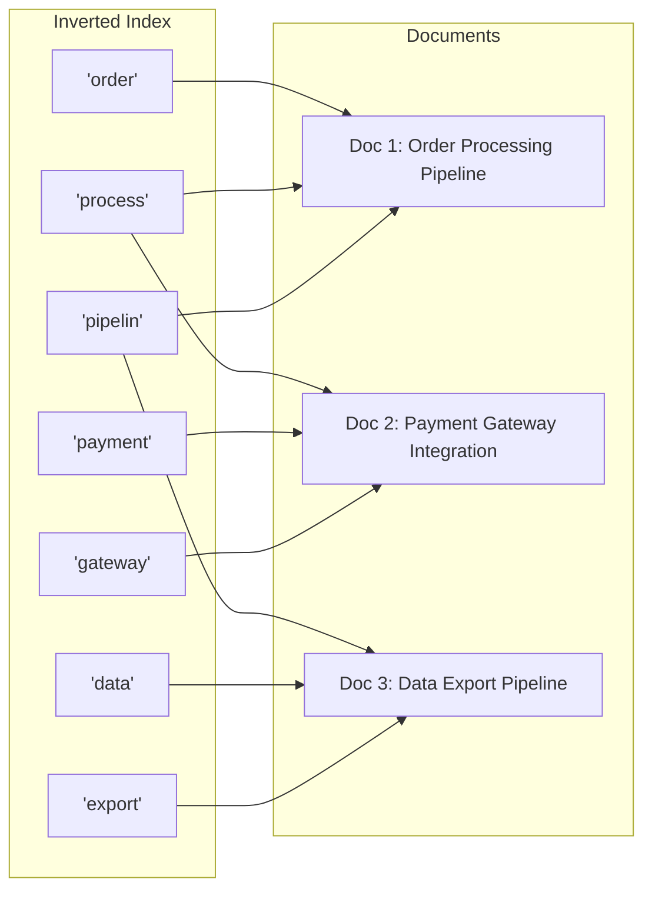
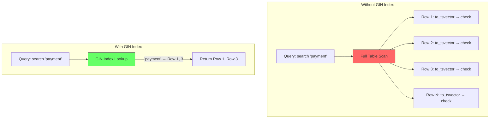
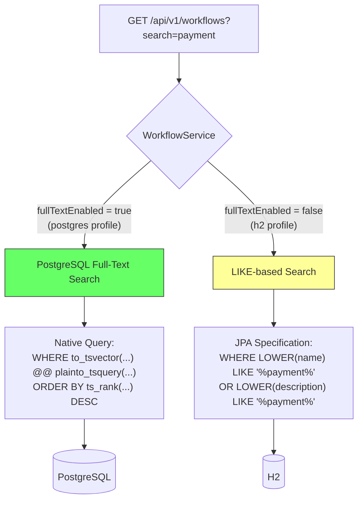

# Searching -- Deep Dive

How to implement search functionality in a Spring Boot REST API.
This document covers basic LIKE-based search (H2 fallback) and
PostgreSQL full-text search with tsvector, tsquery, GIN indexes, and relevance ranking.

---

## The Problem

Filtering lets you narrow by exact values:

```text
?status=ACTIVE          -> exact match on a known field
?minRetries=3           -> numeric range on a known field
```

But filtering can't handle free-text queries:

```text
"Show me anything related to payments"
"Find workflows about order processing"
"Which workflows mention 'retry' in their description?"
```

Search solves this -- the user types a keyword, and we look for it
across multiple text fields.

---

## Search vs Filter -- Key Difference

```text
FILTER:
  - User picks a specific field and value
  - Exact or range match
  - ?status=ACTIVE  -> status column = 'ACTIVE'
  - Structured, predictable

SEARCH:
  - User types free text
  - Substring/fuzzy match across MULTIPLE fields
  - ?search=payment -> name LIKE '%payment%' OR description LIKE '%payment%'
  - Unstructured, flexible
```

```text
In a real API, you combine both:

  GET /api/v1/workflows?search=payment&status=ACTIVE&sort=createdAt,desc

  Meaning: "Find ACTIVE workflows related to payments, newest first"

  Search narrows by keyword (OR across fields)
  Filter narrows by exact value (AND with search)
  Sort orders the results
  Pagination limits the page size
```

---

# Basic LIKE Search (What We Implemented)

## How SQL LIKE Works

```sql
-- Exact substring match
SELECT * FROM workflows WHERE name LIKE '%payment%'
-- Matches: "Payment Pipeline", "Refund Payment Flow", "payment-v2"

-- % is a wildcard that matches any sequence of characters
-- %payment% means: anything, then "payment", then anything
```

```text
LIKE patterns:
  'payment%'    -> starts with "payment"    (prefix search)
  '%payment'    -> ends with "payment"      (suffix search)
  '%payment%'   -> contains "payment"       (substring search)  <-- what we use
  'pay_ent'     -> _ matches exactly one character
```

## Case Sensitivity

```text
Problem: LIKE is case-sensitive in most databases.

  WHERE name LIKE '%payment%'
  -> matches "payment pipeline"
  -> does NOT match "Payment Pipeline"  (capital P)

Solution: Convert both sides to lowercase.

  WHERE LOWER(name) LIKE '%payment%'
  -> matches "Payment Pipeline"  (LOWER("Payment Pipeline") = "payment pipeline")
  -> matches "PAYMENT"           (LOWER("PAYMENT") = "payment")
  -> matches "payment"           (already lowercase)
```

```text
Alternative: ILIKE (PostgreSQL only)

  WHERE name ILIKE '%payment%'
  -> case-insensitive LIKE, same result as LOWER() + LIKE
  -> cleaner syntax but PostgreSQL-specific
  -> not available in H2 (our current database)

We use LOWER() + LIKE because it works on ALL databases (H2, PostgreSQL, MySQL, etc.)
```

## Multi-Field Search

```text
Single field search:
  WHERE LOWER(name) LIKE '%payment%'
  -> only finds workflows with "payment" in the name
  -> misses: description = "Processes payments and refunds"

Multi-field search (what we want):
  WHERE LOWER(name) LIKE '%payment%'
     OR LOWER(description) LIKE '%payment%'
  -> finds "payment" in name OR description
  -> much more useful for the user
```

---

## FlowForge Implementation

### 1. Specification: The Search Method

```java
public static Specification<Workflow> search(String keyword) {
    String pattern = "%" + keyword.toLowerCase() + "%";
    return (root, query, cb) -> cb.or(
            cb.like(cb.lower(root.get("name")), pattern),
            cb.like(cb.lower(root.get("description")), pattern)
    );
}
```

```text
Breaking it down:

  1. keyword = "payment"
  2. pattern = "%payment%"
  3. cb.lower(root.get("name"))         -> LOWER(w.name)
  4. cb.like(..., pattern)               -> LOWER(w.name) LIKE '%payment%'
  5. Same for description
  6. cb.or(nameMatch, descriptionMatch)  -> name LIKE ... OR description LIKE ...

Generated SQL:
  WHERE LOWER(w.name) LIKE '%payment%'
     OR LOWER(w.description) LIKE '%payment%'
```

### 2. Why cb.or() Inside the Specification?

```text
Search is fundamentally different from filters:

  FILTERS use AND -- all conditions must be true:
    status = ACTIVE AND maxRetries >= 3
    (narrowing: each filter reduces results)

  SEARCH uses OR -- any field can match:
    name LIKE '%payment%' OR description LIKE '%payment%'
    (broadening: each field increases chances of a match)

But search as a WHOLE is AND'd with filters:
    (name LIKE '%payment%' OR description LIKE '%payment%')
    AND status = 'ACTIVE'
    AND max_retries >= 3

The OR is INSIDE the search spec.
The AND is BETWEEN search and filters.
```

### 3. Service: Composing Search with Filters

```java
public Page<Workflow> findAll(WorkflowFilterRequest filter, Pageable pageable) {
    sortValidator.validate(pageable.getSort());

    Specification<Workflow> spec = (root, query, cb) -> null;

    // Search -- OR across name and description (added as AND to the overall spec)
    if (filter.search() != null && !filter.search().isBlank()) {
        spec = spec.and(WorkflowSpecification.search(filter.search()));
    }
    // Filters -- each one AND'd
    if (filter.status() != null) {
        spec = spec.and(WorkflowSpecification.hasStatus(filter.status()));
    }
    // ... more filters ...

    return workflowRepository.findAll(spec, pageable);
}
```

```text
Example: ?search=payment&status=ACTIVE&minRetries=3

  spec = no-op (match all)
         .and( search("payment") )       -> (name LIKE '%payment%' OR desc LIKE '%payment%')
         .and( hasStatus(ACTIVE) )       -> AND status = 'ACTIVE'
         .and( minRetries(3) )           -> AND max_retries >= 3

  Final SQL:
    WHERE (LOWER(name) LIKE '%payment%' OR LOWER(description) LIKE '%payment%')
      AND status = 'ACTIVE'
      AND max_retries >= 3
    ORDER BY ...
    LIMIT 20 OFFSET 0
```

### 4. Controller: The search Query Parameter

```java
@GetMapping
public ResponseEntity<PageResponse<WorkflowSummaryResponse>> list(
        Pageable pageable,
        @RequestParam(required = false) String search,      // <-- new
        @RequestParam(required = false) WorkflowStatus status,
        @RequestParam(required = false) Integer minRetries,
        // ... other filters ...
) {
    WorkflowFilterRequest filter = new WorkflowFilterRequest(
            search, status, minRetries, ...);
    // ...
}
```

```text
How it handles edge cases:

  ?search=payment     -> search = "payment"  -> applies search spec
  ?search=            -> search = ""          -> isBlank() = true -> skipped
  ?search=   (spaces) -> search = "   "       -> isBlank() = true -> skipped
  (no param)          -> search = null         -> null check -> skipped

All three "empty" cases result in no search filter, returning all results.
```

### 5. Filter DTO: Adding Search

```java
public record WorkflowFilterRequest(
        String search,            // <-- new, first field
        WorkflowStatus status,
        Integer minRetries,
        Integer maxRetries,
        Instant createdAfter,
        Instant createdBefore
) {}
```

```text
Why search is a String, not an enum or typed value:

  Filters are typed:  status = WorkflowStatus.ACTIVE  (known values)
  Search is free text: search = "anything the user types"

  The user doesn't know field names or valid values.
  They just type words and expect results.
```

---

# Performance Considerations

## LIKE '%keyword%' is Slow on Large Tables

```text
Problem:
  WHERE LOWER(name) LIKE '%payment%'

  The database CANNOT use a B-tree index for leading-wildcard LIKE.
  '%payment%' starts with %, so the DB must scan EVERY row.

  1,000 rows:      fine (milliseconds)
  100,000 rows:    noticeable (tens of ms)
  10,000,000 rows: painful (seconds)

This is called a FULL TABLE SCAN.
```

## Why B-tree Indexes Don't Help

```text
B-tree indexes are sorted like a phone book:

  Payment Pipeline
  Process Orders
  Refund Handler

Finding "Pay..." is fast -- jump to the P section (prefix search).
Finding "...ment..." is impossible -- you'd have to read every entry.

  LIKE 'payment%'    -> B-tree CAN help (prefix match)
  LIKE '%payment%'   -> B-tree CANNOT help (substring match)
```

## Solutions for Large-Scale Search (Future)

```text
When LIKE becomes too slow, upgrade to:

1. PostgreSQL Full-Text Search (GIN index + tsvector)
   - Tokenizes text into searchable terms
   - Supports stemming ("running" matches "run")
   - Relevance ranking with ts_rank()
   - Works within PostgreSQL, no external service
   - Will be added when we migrate from H2 to PostgreSQL

2. Trigram Index (PostgreSQL pg_trgm extension)
   - CREATE INDEX idx_name_trgm ON workflows USING GIN (name gin_trgm_ops);
   - Makes LIKE '%keyword%' use the index
   - Supports fuzzy matching with similarity()

3. Elasticsearch / OpenSearch
   - Dedicated search engine running alongside the database
   - Best for: fuzzy matching, typo tolerance, synonyms, faceted search
   - Data is synced from PostgreSQL to Elasticsearch
   - Most powerful but adds infrastructure complexity
```

---

# Curl Examples

```bash
# Basic search
curl "http://localhost:8080/api/v1/workflows?search=order"

# Case-insensitive
curl "http://localhost:8080/api/v1/workflows?search=ORDER"

# Partial match
curl "http://localhost:8080/api/v1/workflows?search=pay"

# Search + filter
curl "http://localhost:8080/api/v1/workflows?search=order&status=ACTIVE"

# Search + filter + sort + pagination
curl "http://localhost:8080/api/v1/workflows?search=pipe&status=DRAFT&sort=name,asc&page=0&size=5"

# Everything combined
curl "http://localhost:8080/api/v1/workflows?search=work&status=ACTIVE&minRetries=2&sort=createdAt,desc&page=0&size=10"
```

---

# LIKE Search Summary

```text
1. BASIC LIKE SEARCH (H2 fallback)
   - Single ?search= parameter
   - Case-insensitive LIKE across name and description
   - Uses LOWER() + LIKE for database portability
   - OR logic inside search, AND logic with filters
   - Blank/null search is ignored (returns all)

2. LIMITATIONS OF LIKE
   - No typo tolerance ("paymet" won't match "payment")
   - No relevance ranking (all matches weighted equally)
   - No stemming ("running" won't match "run")
   - Performance degrades on large tables (full table scan)
```

---
---

# PostgreSQL Full-Text Search -- Deep Dive

Everything about how full-text search works at the database level,
why it's fundamentally different from LIKE, and how we implemented it.

---

## The Core Concepts

### What is Full-Text Search?

```text
Full-text search is a technique for searching natural language text.
Instead of looking for exact substrings (LIKE), it understands LANGUAGE:

  LIKE '%process%':
    ✅ matches "processing"      (substring match)
    ✅ matches "process"         (exact substring)
    ❌ does NOT match "processed" if you search "process" ... wait, it does
    ❌ does NOT match "processor" if you search "processing"
    ❌ no relevance ranking
    ❌ no stop word removal

  Full-text search for "process":
    ✅ matches "process"         (exact)
    ✅ matches "processing"      (stemmed to "process")
    ✅ matches "processes"       (stemmed to "process")
    ✅ matches "processed"       (stemmed to "process")
    ✅ matches "processor"       (stemmed to "process")
    ✅ relevance ranking (title match > description match)
    ✅ stop words removed ("the", "and", "is" ignored)
```

### The Five Core Concepts

```text
1. INVERTED INDEX
   A data structure that maps WORDS to the DOCUMENTS that contain them.

2. TOKENIZATION
   Breaking text into individual words (tokens).

3. ANALYZERS (Dictionaries + Parsers)
   Processing tokens: lowercasing, stemming, removing stop words.

4. RANKING
   Scoring documents by how relevant they are to the search query.

5. RELEVANCE
   How well a document matches the search intent, not just substring.
```

---

## 1. Inverted Index

```text
TRADITIONAL INDEX (B-tree):
  Maps document → words (forward index)

  Document 1: "Order Processing Pipeline"
  Document 2: "Payment Gateway Integration"
  Document 3: "Data Export Pipeline"

  To find "pipeline": scan ALL documents, check each one. O(n).

INVERTED INDEX:
  Maps word → documents (reverse lookup)

  "order"       → [Doc 1]
  "process"     → [Doc 1, Doc 2]     (stemmed: "processing" + "processes")
  "pipelin"     → [Doc 1, Doc 3]     (stemmed: "pipeline")
  "payment"     → [Doc 2]
  "gateway"     → [Doc 2]
  "integr"      → [Doc 2]            (stemmed: "integration")
  "data"        → [Doc 3]
  "export"      → [Doc 3]

  To find "pipeline": look up "pipelin" → [Doc 1, Doc 3]. O(1).
```



```text
WHY IT'S FAST:
  B-tree index:     find rows where name = 'X'         → O(log n)
  Inverted index:   find documents containing word 'X'  → O(1) lookup

  PostgreSQL implements inverted indexes using GIN (Generalized Inverted Index).
```

---

## 2. Tokenization

```text
Tokenization = breaking text into individual searchable words.

  Input:  "Handles payment processing and order fulfillment"

  Tokens: ["Handles", "payment", "processing", "and", "order", "fulfillment"]

  Each token becomes a lookup key in the inverted index.
```

```text
PostgreSQL does this with TEXT SEARCH PARSERS:

  A parser identifies:
    - Words (alphabetic tokens)
    - Numbers
    - URLs, emails, file paths (special token types)
    - Hyphenated words ("full-text" → "full" + "text" or "full-text")

  The default parser handles 23 different token types.
```

---

## 3. Analyzers (Text Search Configuration)

```text
After tokenization, tokens go through DICTIONARIES:

  1. STOP WORDS REMOVAL
     Remove common words that don't carry meaning:
       "the", "and", "or", "is", "a", "an", "in", "of", "to", "for"

     "Handles payment processing and order fulfillment"
     → ["Handles", "payment", "processing", "order", "fulfillment"]
       ("and" removed)

  2. LOWERCASING
     "Handles" → "handles"

  3. STEMMING (Snowball dictionary)
     Reduce words to their root form:
       "processing" → "process"
       "handles"    → "handl"
       "fulfillment"→ "fulfil"
       "payments"   → "payment"
       "running"    → "run"
       "better"     → "better"  (irregular, not always perfect)

     Final tokens: ["handl", "payment", "process", "order", "fulfil"]
```

```text
PostgreSQL TEXT SEARCH CONFIGURATIONS:

  'english'  → English stop words + Snowball English stemmer
  'simple'   → No stemming, just lowercasing (useful for identifiers)
  'spanish'  → Spanish stop words + Spanish stemmer
  'german'   → German stop words + German stemmer

  We use 'english' because our workflow names/descriptions are in English.

  Example:
    to_tsvector('english', 'The quick brown foxes are jumping')
    Result: 'brown':3 'fox':4 'jump':6 'quick':2

    Notice: "The" removed (stop word), "foxes"→"fox", "are" removed, "jumping"→"jump"
    Numbers after colon = position in original text (used for proximity search)
```

---

## 4. tsvector and tsquery -- PostgreSQL's Building Blocks

### tsvector: The Document Representation

```sql
-- Convert text to a tsvector (processed, stemmed, indexed tokens)
SELECT to_tsvector('english', 'Handles payment processing and order fulfillment');

-- Result:
-- 'fulfil':6 'handl':1 'order':5 'payment':2 'process':3
--  ↑ stem      ↑ pos    ↑ stem    ↑ kept      ↑ stem
```

```text
A tsvector is NOT the original text. It is:
  - Sorted list of unique lexemes (stemmed tokens)
  - Each lexeme has a position list (where it appears)
  - Stop words are removed
  - Duplicates are merged

This is what gets stored in the GIN index.
```

### tsquery: The Search Query

```sql
-- Convert a search string to a tsquery
SELECT plainto_tsquery('english', 'payment processing');
-- Result: 'payment' & 'process'
-- Meaning: documents must contain BOTH "payment" AND "process" (stemmed)

SELECT to_tsquery('english', 'payment | processing');
-- Result: 'payment' | 'process'
-- Meaning: documents containing EITHER "payment" OR "process"

SELECT to_tsquery('english', '!payment');
-- Result: !'payment'
-- Meaning: documents NOT containing "payment"

SELECT websearch_to_tsquery('english', '"payment processing" OR refund');
-- Result: 'payment' <-> 'process' | 'refund'
-- Meaning: phrase "payment processing" (adjacent) OR "refund"
```

```text
TSQUERY FUNCTIONS:

  plainto_tsquery('english', 'payment order')
    → 'payment' & 'order'                (AND — all words must match)
    → This is what we use in FlowForge

  to_tsquery('english', 'payment & order')
    → 'payment' & 'order'                (explicit AND operator)

  to_tsquery('english', 'payment | order')
    → 'payment' | 'order'                (OR — either word matches)

  websearch_to_tsquery('english', '"payment processing"')
    → 'payment' <-> 'process'            (phrase search — words adjacent)

  OPERATORS:
    &     AND
    |     OR
    !     NOT
    <->   FOLLOWED BY (phrase search)
    <2>   WITHIN 2 words of each other
```

### The @@ Match Operator

```sql
-- Does the document match the query?
SELECT to_tsvector('english', 'Handles payment processing')
    @@ plainto_tsquery('english', 'payment');
-- Result: true (tsvector contains 'payment')

SELECT to_tsvector('english', 'Handles payment processing')
    @@ plainto_tsquery('english', 'refund');
-- Result: false (tsvector does NOT contain 'refund')
```

---

## 5. Ranking and Relevance

### ts_rank: Scoring Matches

```sql
SELECT
    name,
    ts_rank(
        to_tsvector('english', name || ' ' || coalesce(description, '')),
        plainto_tsquery('english', 'payment')
    ) AS rank
FROM workflows
WHERE to_tsvector('english', name || ' ' || coalesce(description, ''))
      @@ plainto_tsquery('english', 'payment')
ORDER BY rank DESC;
```

```text
ts_rank() considers:
  - How many times the query terms appear in the document
  - How close together the terms are
  - The length of the document (shorter = more relevant per word)
  - Position in the document (can weight title > body)

Example results:
  "Payment Gateway Integration"           rank: 0.075
  "Order Processing Pipeline"             rank: 0.061
  (description mentions "payment processing")

The first result is ranked higher because "payment" is in the NAME,
which is shorter (higher term density) and more prominent.
```

### Weighted Ranking

```sql
-- Give different weights to name vs description
SELECT
    name,
    ts_rank(
        setweight(to_tsvector('english', name), 'A') ||
        setweight(to_tsvector('english', coalesce(description, '')), 'B'),
        plainto_tsquery('english', 'payment')
    ) AS rank
FROM workflows;
```

```text
WEIGHTS:
  'A' = highest weight (1.0)  → use for title/name
  'B' = medium weight  (0.4)  → use for description/body
  'C' = lower weight   (0.2)  → use for tags/metadata
  'D' = lowest weight  (0.1)  → use for auxiliary text

A word in the NAME ranks ~2.5x higher than the same word in DESCRIPTION.
This matches user expectations: "Payment Pipeline" is MORE about payments
than a workflow that just mentions "payment" once in its description.
```

---

## 6. GIN Index -- Making It Fast

### What is a GIN Index?

```text
GIN = Generalized Inverted Index

Without a GIN index:
  Every query calls to_tsvector() on EVERY row → full table scan.
  10 million rows = 10 million tsvector computations per query.

With a GIN index:
  The inverted index is pre-built and stored on disk.
  Query looks up terms in the index → returns matching row IDs.
  10 million rows = millisecond lookup.
```

### Expression Index (What We Use)

```sql
-- Our schema-postgres.sql:
CREATE INDEX IF NOT EXISTS idx_workflows_fts
    ON workflows
    USING GIN (to_tsvector('english', name || ' ' || coalesce(description, '')));
```

```text
This is an EXPRESSION INDEX (also called functional index).
PostgreSQL pre-computes to_tsvector('english', name || ' ' || description)
for every row and stores the result in a GIN structure.

When you query:
  WHERE to_tsvector('english', name || ' ' || coalesce(description, ''))
        @@ plainto_tsquery('english', 'payment')

PostgreSQL recognizes the expression matches the index and uses it.

IMPORTANT: The expression in the query MUST match the index expression EXACTLY.
If you change 'english' to 'simple' in the query, the index won't be used.
```



### Alternative: Stored tsvector Column

```text
Instead of an expression index, you can add a dedicated column:

  ALTER TABLE workflows ADD COLUMN search_vector tsvector;

  -- Trigger to keep it updated
  CREATE FUNCTION workflows_search_trigger() RETURNS trigger AS $$
  BEGIN
      NEW.search_vector :=
          setweight(to_tsvector('english', NEW.name), 'A') ||
          setweight(to_tsvector('english', coalesce(NEW.description, '')), 'B');
      RETURN NEW;
  END $$ LANGUAGE plpgsql;

  CREATE TRIGGER tsvector_update BEFORE INSERT OR UPDATE
      ON workflows FOR EACH ROW EXECUTE FUNCTION workflows_search_trigger();

  CREATE INDEX idx_workflows_search ON workflows USING GIN (search_vector);

TRADE-OFFS:
  Expression index:  Simpler, no extra column, slightly slower queries
  Stored column:     Faster queries, supports weights, needs trigger maintenance

We use the expression index for simplicity. For production with millions
of rows, a stored column with weighted tsvector is better.
```

---

# FlowForge Full-Text Search Implementation

## How the Profile-Based Dispatch Works



## Service Layer

```java
@Service
@Transactional(readOnly = true)
public class WorkflowService {

    private final boolean fullTextEnabled;

    public WorkflowService(WorkflowRepository workflowRepository,
                           WorkflowMapper workflowMapper,
                           SortValidator sortValidator,
                           Environment environment) {
        // ...
        this.fullTextEnabled = Arrays.asList(environment.getActiveProfiles())
                .contains("postgres");
    }

    public Page<Workflow> findAll(WorkflowFilterRequest filter, Pageable pageable) {
        sortValidator.validate(pageable.getSort());

        // PostgreSQL full-text search path
        if (fullTextEnabled && filter.search() != null && !filter.search().isBlank()) {
            String statusStr = filter.status() != null ? filter.status().name() : null;
            Pageable unsorted = PageRequest.of(pageable.getPageNumber(), pageable.getPageSize());
            return workflowRepository.fullTextSearch(
                    filter.search(), statusStr,
                    filter.minRetries(), filter.maxRetries(),
                    filter.createdAfter(), filter.createdBefore(),
                    unsorted);
        }

        // H2 fallback: LIKE-based search via JPA Specifications
        Specification<Workflow> spec = (root, query, cb) -> null;
        if (filter.search() != null && !filter.search().isBlank()) {
            spec = spec.and(WorkflowSpecification.search(filter.search()));
        }
        // ... other filters ...
        return workflowRepository.findAll(spec, pageable);
    }
}
```

```text
KEY DECISIONS:

1. Profile detection at startup (not per-request):
   fullTextEnabled is computed ONCE in the constructor.
   No per-request overhead.

2. Unsorted Pageable for full-text search:
   We strip the sort from pageable because the native query
   always sorts by ts_rank DESC (relevance order).
   User-specified sorts don't apply when searching by relevance.

3. Status as String:
   The native query takes String parameters, not enums.
   We convert WorkflowStatus.ACTIVE → "ACTIVE" for the SQL.
```

## Repository: The Native Query

```java
@Query(value = """
        SELECT w.* FROM workflows w
        WHERE to_tsvector('english', w.name || ' ' || coalesce(w.description, ''))
              @@ plainto_tsquery('english', :query)
          AND (:status IS NULL OR w.status = :status)
          AND (:minRetries IS NULL OR w.max_retries >= :minRetries)
          AND (:maxRetries IS NULL OR w.max_retries <= :maxRetries)
          AND (CAST(:createdAfter AS TIMESTAMP WITH TIME ZONE) IS NULL
               OR w.created_at >= CAST(:createdAfter AS TIMESTAMP WITH TIME ZONE))
          AND (CAST(:createdBefore AS TIMESTAMP WITH TIME ZONE) IS NULL
               OR w.created_at <= CAST(:createdBefore AS TIMESTAMP WITH TIME ZONE))
        ORDER BY ts_rank(
            to_tsvector('english', w.name || ' ' || coalesce(w.description, '')),
            plainto_tsquery('english', :query)
        ) DESC
        """,
        countQuery = """
        SELECT count(*) FROM workflows w
        WHERE to_tsvector('english', w.name || ' ' || coalesce(w.description, ''))
              @@ plainto_tsquery('english', :query)
          AND (:status IS NULL OR w.status = :status)
          ...
        """,
        nativeQuery = true)
Page<Workflow> fullTextSearch(
        @Param("query") String query,
        @Param("status") String status,
        @Param("minRetries") Integer minRetries,
        @Param("maxRetries") Integer maxRetries,
        @Param("createdAfter") Instant createdAfter,
        @Param("createdBefore") Instant createdBefore,
        Pageable pageable);
```

```text
BREAKING DOWN THE QUERY:

1. to_tsvector('english', w.name || ' ' || coalesce(w.description, ''))
   → Combines name and description into one searchable text
   → coalesce(description, '') handles NULL descriptions
   → 'english' config applies stemming + stop word removal

2. @@ plainto_tsquery('english', :query)
   → Converts user input to a search query
   → plainto_tsquery turns "payment order" → 'payment' & 'order' (AND)
   → @@ is the match operator

3. (:status IS NULL OR w.status = :status)
   → Optional filter: if status param is null, this condition is always true
   → Same pattern for all optional filters

4. CAST(:createdAfter AS TIMESTAMP WITH TIME ZONE)
   → PostgreSQL needs explicit CAST for NULL timestamp parameters
   → Without CAST, NULL comparison fails

5. ORDER BY ts_rank(...) DESC
   → Results sorted by relevance, most relevant first
   → The GIN index handles the WHERE clause
   → ts_rank is computed for matching rows only (fast)

6. countQuery
   → Spring Data needs a separate count query for Page<> pagination
   → Same WHERE clause, just SELECT count(*) instead of SELECT w.*
```

## The GIN Index

```sql
-- schema-postgres.sql (runs after Hibernate creates tables)
CREATE INDEX IF NOT EXISTS idx_workflows_fts
    ON workflows
    USING GIN (to_tsvector('english', name || ' ' || coalesce(description, '')));
```

```text
This runs via:
  application-postgres.yaml:
    spring.jpa.defer-datasource-initialization: true   (run SQL after Hibernate)
    spring.sql.init.mode: always                       (run every startup)
    spring.sql.init.platform: postgres                 (use schema-postgres.sql)

CREATE INDEX IF NOT EXISTS = safe to run on every startup.
```

---

# LIKE vs Full-Text Search Comparison

```text
FEATURE                    LIKE '%x%'              FULL-TEXT SEARCH
─────────────────────────────────────────────────────────────────────
Stemming                   ❌ No                    ✅ Yes (run→running)
Stop words                 ❌ Matches "the"         ✅ Ignores "the"
Relevance ranking          ❌ No ranking             ✅ ts_rank()
Index support              ❌ Full table scan        ✅ GIN index
Case handling              Manual LOWER()           Built-in
Multi-word                 Substring match          AND/OR/phrase
Typo tolerance             ❌ No                     ❌ No (need trigram)
Phrase search              ❌ No                     ✅ <-> operator
Database portability       ✅ All databases          ❌ PostgreSQL only
Setup complexity           ✅ Zero                   Medium (index, config)

WHEN TO USE WHAT:
  - Few records + simple needs → LIKE is fine
  - Large dataset + natural language → Full-text search
  - Need typo tolerance → Add pg_trgm extension or Elasticsearch
```

---

# Beyond PostgreSQL: Elasticsearch / OpenSearch

```text
PostgreSQL full-text search covers 80% of use cases.
For the remaining 20%, consider Elasticsearch:

  POSTGRESQL FTS              ELASTICSEARCH
  ─────────────────────────────────────────
  Built into your DB          Separate service
  No extra infra              Needs cluster management
  Good stemming               Advanced analyzers
  Basic ranking               BM25 + custom scoring
  No typo tolerance           Fuzzy matching built-in
  No synonyms                 Synonym dictionaries
  No faceted search           Aggregations / facets
  Real-time                   Near real-time (refresh interval)
  Single source of truth      Needs data sync from DB

ARCHITECTURE WITH ELASTICSEARCH:
  1. PostgreSQL remains source of truth
  2. On create/update/delete → sync to Elasticsearch
  3. Search queries go to Elasticsearch
  4. CRUD queries go to PostgreSQL

This is a "polyglot persistence" pattern.
We'll cover it if we add Elasticsearch later.
```

---

# File Structure

```text
flowforge/src/main/resources/
├── application.yaml              # Shared config (default profile: postgres)
├── application-h2.yaml           # H2 datasource (LIKE search)
├── application-postgres.yaml     # PostgreSQL datasource + SQL init
└── schema-postgres.sql           # GIN index creation

flowforge/src/main/java/.../
├── repository/
│   └── WorkflowRepository.java   # fullTextSearch() native query
├── service/
│   └── WorkflowService.java      # Profile-based dispatch
└── specification/
    └── WorkflowSpecification.java # search() for LIKE fallback
```

---

# Full Summary

```text
1. BASIC LIKE SEARCH (H2 fallback)
   - LOWER(name) LIKE '%keyword%' OR LOWER(description) LIKE '%keyword%'
   - Works on all databases
   - No stemming, no ranking, full table scan

2. POSTGRESQL FULL-TEXT SEARCH (postgres profile)
   - to_tsvector('english', text) — tokenize, stem, remove stop words
   - plainto_tsquery('english', query) — parse user input
   - @@ operator — match tsvector against tsquery
   - ts_rank() — score relevance, order by rank DESC
   - GIN index — O(1) lookup instead of full table scan

3. INVERTED INDEX
   - Maps words → documents (reverse of a normal index)
   - PostgreSQL implements it as GIN (Generalized Inverted Index)
   - Pre-computes tsvector for each row

4. STEMMING & STOP WORDS
   - "processing" → "process" (Snowball stemmer)
   - "the", "and", "is" → removed (stop words)
   - Configured via text search configuration ('english', 'simple', etc.)

5. PROFILE-BASED DISPATCH
   - postgres profile → native query with full-text search
   - h2 profile → JPA Specification with LIKE
   - Detection at startup via Environment.getActiveProfiles()

6. FILTERS COMBINED WITH SEARCH
   - Full-text search uses native SQL with optional WHERE clauses
   - Same ?search=&status=&minRetries= API, different engine under the hood
```
