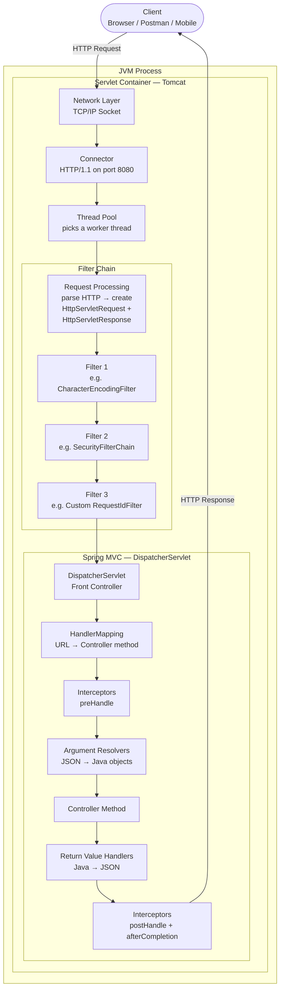
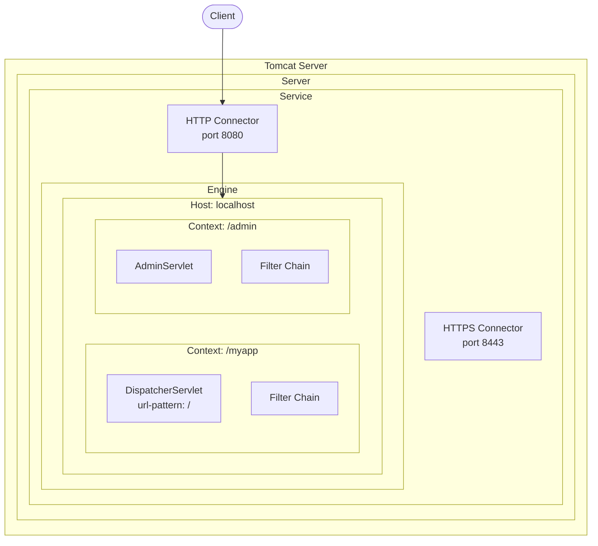
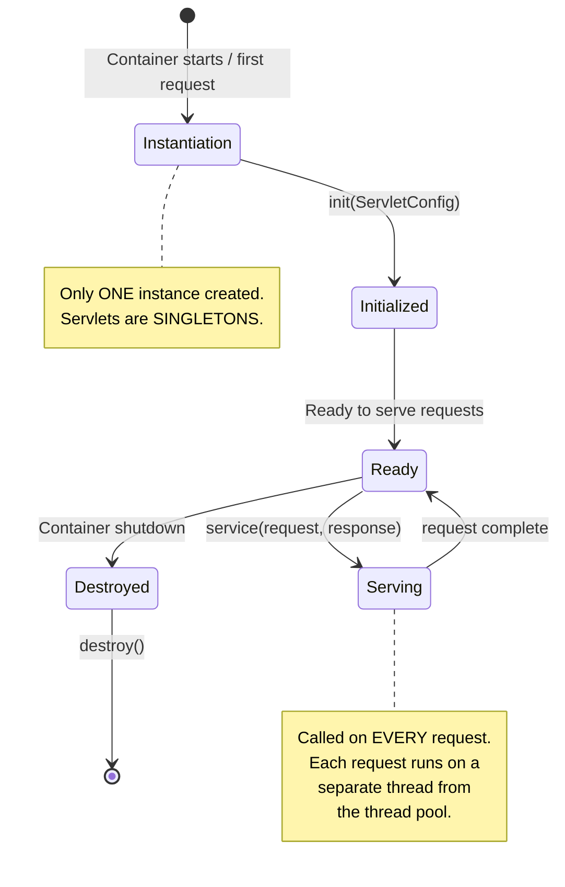
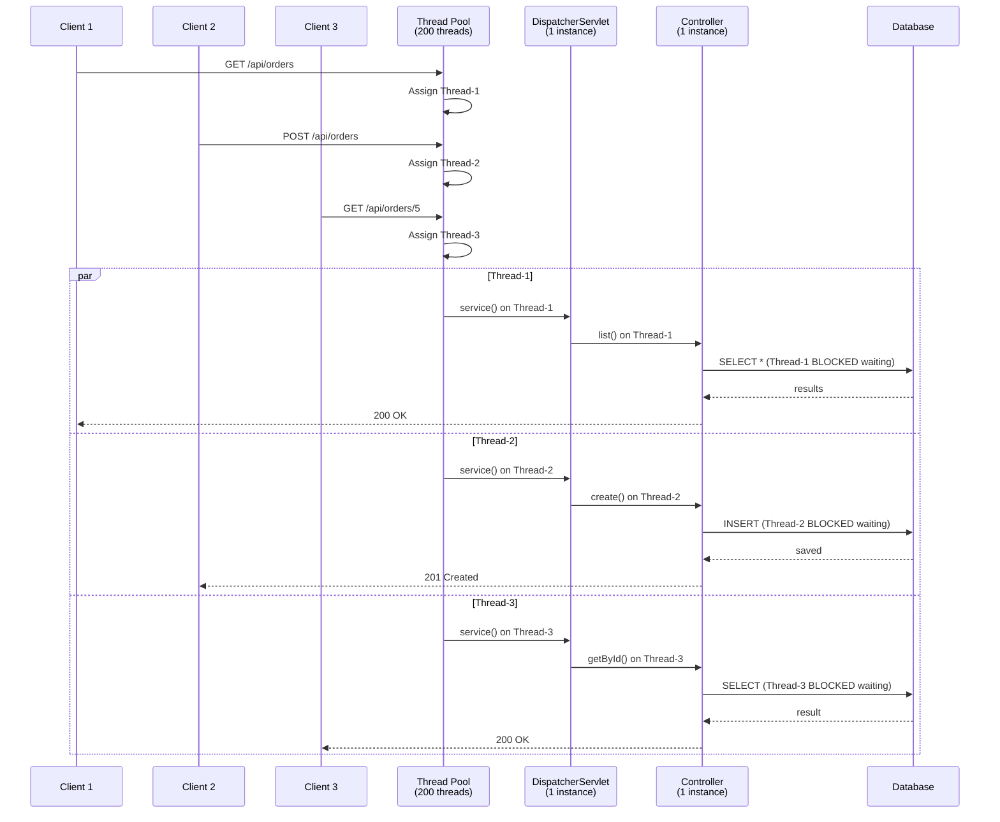
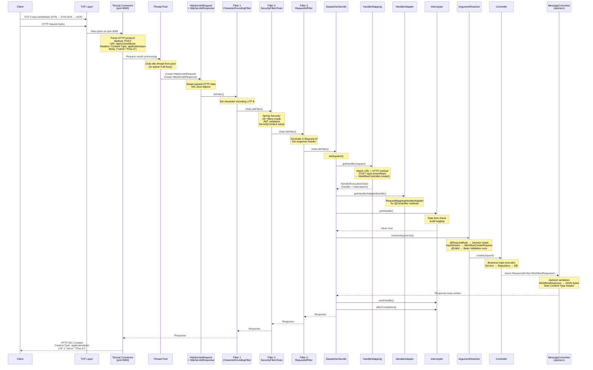
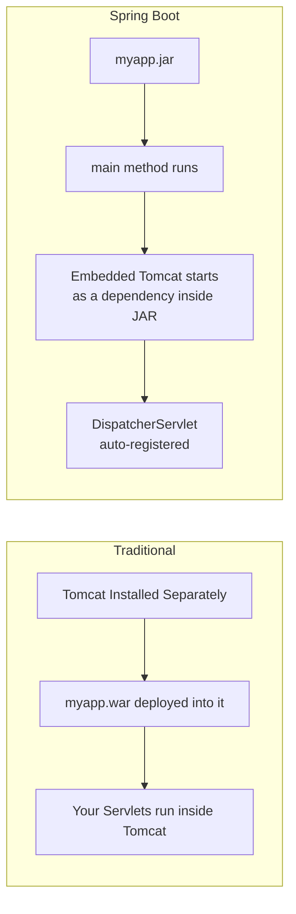

```mermaid
graph LR
    A[Client] -->|1. TCP| B[Tomcat Connector]
    B -->|2. Thread| C[Thread Pool]
    C -->|3. Parse| D[HttpServletRequest<br/>HttpServletResponse]
    D -->|4| E[Filter Chain]
    E -->|5| F[DispatcherServlet]
    F -->|6| G[HandlerMapping]
    G -->|7| H[Interceptors]
    H -->|8| I[ArgumentResolvers]
    I -->|9| J[Controller]
    J -->|10| K[Service → Repository → DB]
    K -->|11| L[MessageConverter<br/>Jackson]
    L -->|12| M[Response back<br/>through chain]
    M -->|13| A
```

# Java Servlet & Spring Request Architecture

How an HTTP request travels from the network all the way through Tomcat,
the Servlet API, and Spring MVC to your controller — and back.

---

## 1. The Big Picture



---

## 2. What Is a Servlet

```text
A Servlet is a JAVA CLASS that handles HTTP requests.
That's it. It's the Java standard for "web request handler."

  Servlet = Java's answer to "how do I handle an HTTP request?"

  The Servlet SPECIFICATION (Jakarta Servlet, formerly javax.servlet)
  defines the interface. The Servlet CONTAINER (Tomcat, Jetty, Undertow)
  implements and runs it.

  Your code:     extends HttpServlet or uses @WebServlet
  Container:     Tomcat receives HTTP, creates request/response objects,
                 calls your servlet's service() method

  KEY POINT:
    A servlet is NOT a server. It's a component that RUNS INSIDE a server.
    Tomcat is the server (servlet container). Your servlet is the handler.
```

### The HttpServlet Class

```java
public abstract class HttpServlet extends GenericServlet {

    // Called by the container — dispatches to doGet/doPost/etc.
    protected void service(HttpServletRequest req, HttpServletResponse resp)
            throws ServletException, IOException {

        String method = req.getMethod();
        if ("GET".equals(method))       doGet(req, resp);
        else if ("POST".equals(method)) doPost(req, resp);
        else if ("PUT".equals(method))  doPut(req, resp);
        else if ("DELETE".equals(method)) doDelete(req, resp);
        // ...
    }

    // You override these
    protected void doGet(HttpServletRequest req, HttpServletResponse resp) { ... }
    protected void doPost(HttpServletRequest req, HttpServletResponse resp) { ... }
}
```

```text
Spring's DispatcherServlet IS an HttpServlet.

  DispatcherServlet extends FrameworkServlet
    extends HttpServletBean
      extends HttpServlet          ← Servlet API class

So Spring MVC is literally a servlet — one big servlet that handles ALL
requests and delegates internally to your @Controllers.
```

---

## 3. Servlet Container Architecture (Tomcat)



```text
TOMCAT HIERARCHY:

  Server          → the entire Tomcat process
    └── Service   → groups a Connector + Engine
        ├── Connector → listens on a port (8080, 8443)
        └── Engine    → processes requests
            └── Host  → virtual host (localhost)
                └── Context → a deployed web application (/myapp)
                    ├── Filter Chain
                    └── Servlet(s)

In Spring Boot:
  - Tomcat is EMBEDDED (starts inside your JAR, not the other way around)
  - There is ONE Context (your Spring Boot app)
  - There is ONE Servlet (DispatcherServlet, mapped to "/")
  - The Connector defaults to port 8080 (server.port property)
```

---

## 4. Servlet Lifecycle



```text
SERVLET LIFECYCLE:

  1. INSTANTIATION (once)
     Container creates ONE instance of the servlet.
     Servlets are SINGLETONS — one object shared by all threads.

  2. INITIALIZATION — init(ServletConfig) (once)
     Container calls init() after creating the instance.
     Load configuration, open resources, etc.
     DispatcherServlet: loads Spring ApplicationContext here.

  3. SERVICE — service(request, response) (per request)
     Called for EVERY HTTP request.
     Each request gets its OWN thread from the thread pool.
     service() dispatches to doGet(), doPost(), etc.
     DispatcherServlet: dispatches to your @Controller methods here.

  4. DESTRUCTION — destroy() (once)
     Container calls destroy() on shutdown.
     Close resources, clean up.
     DispatcherServlet: closes the Spring ApplicationContext.

CRITICAL:
  Since there's only ONE servlet instance, you must NEVER store
  per-request state in instance fields. Use request attributes,
  ThreadLocal, or method-local variables instead.
```

---

## 5. Thread-Per-Request Model



```text
THREAD-PER-REQUEST MODEL:

  Tomcat maintains a THREAD POOL (default: 200 threads).
  Each incoming request is assigned ONE thread.
  That thread handles the ENTIRE request lifecycle:
    Filter → Servlet → Controller → Service → DB → Response

  BLOCKING:
    When your code does a DB query, the thread BLOCKS (waits).
    That thread does NOTHING while waiting for the DB response.
    If all 200 threads are blocked on slow DB queries,
    new requests must WAIT in a queue → latency spikes.

  THIS IS WHY:
    - Connection pool size matters (HikariCP default: 10)
    - Slow queries block threads → fewer threads available → timeouts
    - 200 threads + 10 DB connections = at most 10 requests doing DB work
      at the same time, 190 threads waiting for a connection

  FORMULA FOR TROUBLE:
    200 Tomcat threads
    ÷ 10 HikariCP connections
    × 500ms average query time
    = only ~20 requests per second before thread pool exhaustion

  SPRING BOOT DEFAULTS:
    server.tomcat.threads.max = 200      (max worker threads)
    server.tomcat.threads.min-spare = 10 (min idle threads)
    spring.datasource.hikari.maximum-pool-size = 10
```

---

## 6. HttpServletRequest & HttpServletResponse

```text
These are the two objects that Tomcat creates for EVERY request.
They are the ONLY way to interact with the raw HTTP data.

HttpServletRequest — READING the incoming request:
  request.getMethod()          → "GET", "POST", etc.
  request.getRequestURI()      → "/api/v1/workflows"
  request.getQueryString()     → "page=0&size=20"
  request.getHeader("Accept")  → "application/json"
  request.getParameter("page") → "0"
  request.getInputStream()     → raw body bytes
  request.getCookies()         → Cookie[]
  request.getRemoteAddr()      → client IP address
  request.getAttribute("key")  → per-request storage (set by filters)
  request.getSession()         → HttpSession (server-side session)

HttpServletResponse — WRITING the outgoing response:
  response.setStatus(200)
  response.setHeader("Content-Type", "application/json")
  response.getWriter().write("{\"id\": 1}")
  response.getOutputStream()   → raw bytes
  response.sendRedirect("/login")
  response.sendError(404, "Not found")

IMPORTANT:
  Spring's @RequestBody, @PathVariable, @RequestParam, etc. are
  ABSTRACTIONS on top of these. Under the hood, Spring calls
  request.getInputStream(), request.getParameter(), etc.

  You rarely touch HttpServletRequest directly in Spring MVC.
  But in Filters and Interceptors, you work with them directly.
```

---

## 7. Full Request Flow — Step by Step



---

## 8. Where Spring Security Fits

```mermaid
graph TB
    subgraph Filter Chain
        F1[CharacterEncodingFilter]
        F2[FormContentFilter]

        subgraph SECURITY[Spring Security FilterChain — 15+ filters]
            SF1[DisableEncodeUrlFilter]
            SF2[WebAsyncManagerIntegrationFilter]
            SF3[SecurityContextHolderFilter]
            SF4[HeaderWriterFilter]
            SF5[CorsFilter]
            SF6[LogoutFilter]
            SF7[UsernamePasswordAuthFilter<br/>or BearerTokenAuthFilter]
            SF8[RequestCacheAwareFilter]
            SF9[SecurityContextHolderAwareFilter]
            SF10[AnonymousAuthFilter]
            SF11[SessionManagementFilter]
            SF12[ExceptionTranslationFilter]
            SF13[AuthorizationFilter]
        end

        F3[Your Custom Filters]
        DS[DispatcherServlet]
    end

    F1 --> F2
    F2 --> SF1
    SF1 --> SF2
    SF2 --> SF3
    SF3 --> SF4
    SF4 --> SF5
    SF5 --> SF6
    SF6 --> SF7
    SF7 --> SF8
    SF8 --> SF9
    SF9 --> SF10
    SF10 --> SF11
    SF11 --> SF12
    SF12 --> SF13
    SF13 --> F3
    F3 --> DS
```



```text
Spring Security is a FILTER — not an interceptor.

  It's implemented as a DelegatingFilterProxy that delegates to a
  FilterChainProxy containing ~15 internal security filters.

  This means:
    1. Security runs BEFORE the DispatcherServlet
    2. Security runs BEFORE any Spring MVC interceptors
    3. If authentication fails, your controller is NEVER called
    4. Security sees EVERY request (even non-controller ones)

  Flow:
    Request → Tomcat → Encoding Filter → Security Filter Chain
      → (authenticated?) → Custom Filters → DispatcherServlet
      → Interceptors → Controller

  If JWT invalid:
    Request → Security Filter Chain → 401 Unauthorized → DONE
    (DispatcherServlet and controller never see this request)
```

---

## 9. DispatcherServlet Internals

```mermaid
flowchart TD
    REQ[Incoming Request] --> DD[doDispatch]

    DD --> GH[getHandler]
    GH --> HM1{RequestMappingHandlerMapping<br/>matches @GetMapping etc.}
    HM1 -->|found| HEC[HandlerExecutionChain<br/>handler + interceptors]
    HM1 -->|not found| HM2{BeanNameUrlHandlerMapping}
    HM2 -->|not found| E404[404 Not Found]

    HEC --> GA[getHandlerAdapter]
    GA --> HA{RequestMappingHandlerAdapter}

    HA --> PRE[interceptors.preHandle]
    PRE -->|true| HANDLE[ha.handle]
    PRE -->|false| SHORT[Short-circuit<br/>Request blocked]

    HANDLE --> RESOLVE[Resolve Arguments]
    RESOLVE --> ARG1[RequestParamMethodArgumentResolver<br/>@RequestParam]
    RESOLVE --> ARG2[PathVariableMethodArgumentResolver<br/>@PathVariable]
    RESOLVE --> ARG3[RequestResponseBodyMethodProcessor<br/>@RequestBody → Jackson]
    RESOLVE --> ARG4[PageableHandlerMethodArgumentResolver<br/>Pageable]

    ARG1 & ARG2 & ARG3 & ARG4 --> INVOKE[Invoke Controller Method]

    INVOKE --> RV[Handle Return Value]
    RV --> RV1{ResponseEntity?}
    RV1 -->|yes| MC[HttpMessageConverter<br/>Jackson → JSON]
    RV1 -->|view name| VR[ViewResolver<br/>Thymeleaf/JSP]

    MC --> POST[interceptors.postHandle]
    POST --> AC[interceptors.afterCompletion]

    INVOKE -->|exception| EH[ExceptionHandlerExceptionResolver<br/>@ExceptionHandler / @ControllerAdvice]
    EH --> AC
```

```text
DispatcherServlet's doDispatch() — the core method:

  1. getHandler(request)
     Iterates all HandlerMapping beans.
     RequestMappingHandlerMapping scans @GetMapping, @PostMapping, etc.
     Returns HandlerExecutionChain = matched method + applicable interceptors.

  2. getHandlerAdapter(handler)
     Finds the adapter that knows how to invoke this handler type.
     RequestMappingHandlerAdapter handles @Controller annotated methods.

  3. Interceptors preHandle()
     Each interceptor.preHandle() is called in order.
     If any returns false → request is short-circuited.

  4. HandlerAdapter.handle()
     a. Resolves method arguments (ArgumentResolvers)
     b. Invokes the actual controller method via reflection
     c. Processes return value (ReturnValueHandlers)

  5. Interceptors postHandle()
     Called after controller but before response is committed.

  6. processDispatchResult()
     If exception → find @ExceptionHandler
     If view name → ViewResolver
     If @ResponseBody → already written by MessageConverter

  7. Interceptors afterCompletion()
     Always called (like finally). Cleanup.
```

---

## 10. Servlet Context, Sessions & Scopes

```text
SERVLET CONTEXT (application scope):
  One per web application. Shared by ALL servlets and ALL requests.
  Created when the app starts, destroyed when it stops.

  servletContext.setAttribute("appName", "MyApp");
  → Available to every request, every thread, every servlet.

  Spring equivalent: ApplicationContext (but much more powerful).

SESSION (session scope):
  One per user (identified by JSESSIONID cookie).
  Lives across multiple requests from the same client.

  HttpSession session = request.getSession();
  session.setAttribute("cart", shoppingCart);

  PROBLEM: Sessions don't work well in distributed systems.
    Instance A has the session. Load balancer sends next request to Instance B.
    Instance B has no session → user logged out!

  SOLUTIONS:
    - Sticky sessions (same user → same instance) — fragile
    - Session replication (sync sessions across instances) — expensive
    - External session store (Redis) — Spring Session
    - STATELESS (JWT tokens) — preferred for APIs

REQUEST (request scope):
  One per HTTP request. Lives only for that single request.

  request.setAttribute("startTime", System.nanoTime());
  → Only available within this request's filter/servlet chain.

  Spring equivalent: @Scope("request") beans.

THREAD-LOCAL:
  Bound to the current thread. Since Servlet = thread-per-request,
  ThreadLocal effectively becomes request-scoped.

  SecurityContextHolder uses ThreadLocal:
    Thread-1 handles User A → SecurityContext has User A's auth
    Thread-2 handles User B → SecurityContext has User B's auth
    No collision because each thread has its own copy.

  DANGER: If you use @Async or thread pools, ThreadLocal does NOT
  propagate to child threads. Security context is lost.
```

---

## 11. Embedded vs External Servlet Container

```text
TRADITIONAL (WAR deployment):
  You write code → build a WAR file → deploy to external Tomcat.
  Tomcat is installed separately. Your app runs INSIDE Tomcat.

  Install Tomcat → copy myapp.war to webapps/ → Tomcat starts your app

SPRING BOOT (embedded):
  Tomcat is a JAR DEPENDENCY inside your app.
  Your app starts Tomcat, not the other way around.

  java -jar myapp.jar → main() → SpringApplication.run()
                       → creates embedded Tomcat
                       → registers DispatcherServlet
                       → starts listening on port 8080

  Spring Boot startup:
    1. SpringApplication.run()
    2. Create ApplicationContext
    3. Component scan → find @Controllers, @Services, etc.
    4. Auto-configure → set up Tomcat, Jackson, DataSource, etc.
    5. Create embedded Tomcat
    6. Register DispatcherServlet (url-pattern: "/")
    7. Register Filters (@Component filters, Spring Security)
    8. Start Tomcat → ready to accept requests
```



---

## 12. How Spring Boot Auto-Registers DispatcherServlet

```text
When Spring Boot starts:

  1. DispatcherServletAutoConfiguration runs
     (triggered by spring-boot-starter-web on classpath)

  2. Creates a DispatcherServlet bean

  3. ServletRegistrationBean registers it with embedded Tomcat:
     - URL pattern: "/" (catches ALL requests)
     - Load on startup: -1 (lazy) or 1 (eager, configured)
     - Name: "dispatcherServlet"

  4. DispatcherServlet.init() is called:
     - Creates a child ApplicationContext (WebApplicationContext)
     - Initializes HandlerMappings, HandlerAdapters, ViewResolvers,
       ExceptionResolvers, ArgumentResolvers, etc.

  5. Ready to serve requests.

  Because DispatcherServlet is mapped to "/":
    EVERY request goes through it.
    There are NO other servlets (unless you register them manually).

  This is why Spring MVC is a "Front Controller" pattern:
    One servlet to rule them all.
```

---

## 13. Request Flow Summary — Cheat Sheet

```text
NETWORK → JVM → TOMCAT → FILTERS → DISPATCHERSERVLET → SPRING MVC → YOUR CODE

Detailed:

  1. CLIENT sends HTTP request over TCP

  2. TOMCAT CONNECTOR accepts TCP connection on port 8080
     Parses raw bytes into HTTP (method, URI, headers, body)

  3. THREAD POOL assigns a worker thread

  4. TOMCAT creates HttpServletRequest + HttpServletResponse

  5. FILTER CHAIN runs (servlet spec level):
     CharacterEncodingFilter → Spring Security (15+ filters)
     → Your custom filters → DispatcherServlet

  6. DISPATCHERSERVLET.doDispatch():
     a. HandlerMapping: URL → Controller method
     b. Interceptors: preHandle()
     c. ArgumentResolvers: HTTP data → Java objects
     d. Controller method executes (your business logic)
     e. ReturnValueHandlers: Java objects → HTTP response
     f. MessageConverter (Jackson): serialize to JSON
     g. Interceptors: postHandle() → afterCompletion()

  7. FILTER CHAIN (reverse): post-processing on the way out

  8. TOMCAT writes HTTP response bytes to TCP socket

  9. CLIENT receives response
```



---

## 14. Interview Questions

```text
Q: What is a Servlet?
A: A Java class that handles HTTP requests. It implements the Servlet
   interface (or extends HttpServlet). The servlet container (Tomcat)
   manages its lifecycle: instantiation → init → service → destroy.
   Spring's DispatcherServlet IS an HttpServlet.

Q: What is a Servlet Container?
A: A server that implements the Servlet specification. It manages
   servlet lifecycle, thread pooling, HTTP parsing, session management,
   and filter chains. Examples: Tomcat, Jetty, Undertow.
   Spring Boot embeds Tomcat inside the JAR.

Q: How does Tomcat handle concurrent requests?
A: Thread-per-request model. Tomcat has a thread pool (default 200).
   Each request gets one thread for its entire lifecycle. If all threads
   are busy (e.g., blocked on DB), new requests queue up. This is why
   connection pool sizing and query performance matter.

Q: What is the DispatcherServlet?
A: Spring's Front Controller. It's a single HttpServlet mapped to "/"
   that receives ALL requests. It delegates to HandlerMappings (find
   controller), HandlerAdapters (invoke method), ArgumentResolvers
   (convert HTTP to Java), and MessageConverters (Java to HTTP).

Q: What is the difference between a Servlet and a Filter?
A: A Servlet HANDLES the request (produces the response).
   A Filter WRAPS the request (runs before/after the servlet).
   Filters form a chain. The last link in the chain is the servlet.
   Filters can block requests by not calling chain.doFilter().

Q: Why is Spring Security a Filter and not an Interceptor?
A: Security must run BEFORE the DispatcherServlet, not after.
   If security were an interceptor, unauthenticated requests would
   still reach the DispatcherServlet (handler mapping, etc.) before
   being rejected. As a filter, security rejects bad requests before
   Spring MVC even sees them.

Q: What happens to the thread during a blocking DB call?
A: The thread WAITS (blocks). It does nothing until the DB responds.
   This is why thread pool exhaustion is a real problem. 200 Tomcat
   threads + 10 DB connections + slow queries = major bottleneck.
   Solutions: optimize queries, increase pool, use reactive (WebFlux),
   or use virtual threads (Java 21+).

Q: What are virtual threads and how do they change this?
A: Java 21+ virtual threads (Project Loom) are lightweight threads
   managed by the JVM, not the OS. You can create millions of them.
   When a virtual thread blocks on I/O, the JVM unmounts it from the
   carrier thread, freeing the carrier for other work.
   Spring Boot 3.2+ supports: spring.threads.virtual.enabled=true
   This effectively makes the thread-per-request model scalable
   without needing reactive programming (WebFlux).

Q: Embedded vs external Tomcat?
A: Traditional: install Tomcat separately, deploy WAR into it.
   Spring Boot: Tomcat is a JAR dependency, starts from main().
   Same Tomcat, different packaging. Embedded is standard for
   microservices and containerized deployments (Docker/K8s).
```
