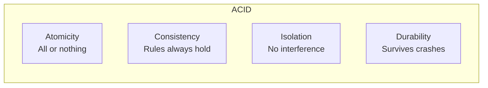
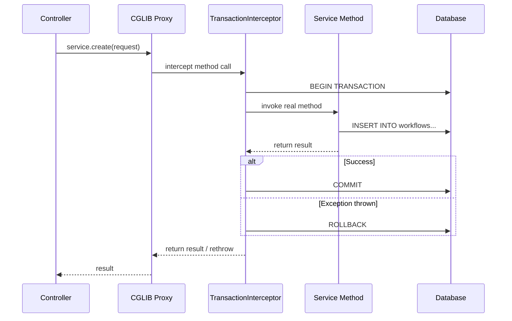
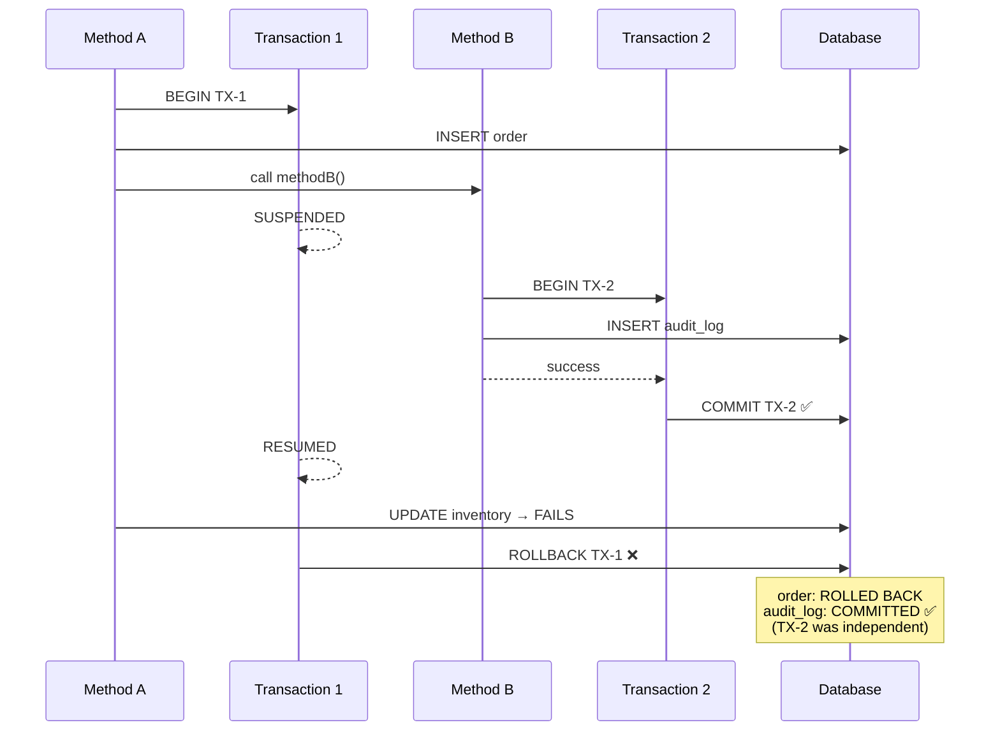
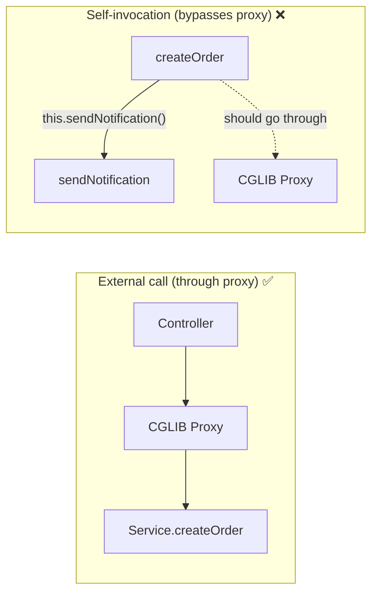

# Transactions

ACID properties, isolation levels, Spring's @Transactional, propagation,
rollback behavior, and common transaction problems.

---

## 1. What Is a Transaction

```text
A transaction is a GROUP of operations that must ALL succeed or ALL fail.
There is no in-between. Either everything commits, or nothing does.

  WITHOUT transaction:
    1. Debit $500 from Account A → SUCCESS
    2. Credit $500 to Account B → FAILURE (network error)
    Result: $500 disappeared! A was debited but B never received it.

  WITH transaction:
    BEGIN TRANSACTION
      1. Debit $500 from Account A
      2. Credit $500 to Account B → FAILURE
    ROLLBACK
    Result: Account A is back to original balance. Nothing happened.
```

---

## 2. ACID Properties

### Atomicity

```text
"All or nothing."

  A transaction is an atomic unit — it either completes ENTIRELY
  or has NO effect. If any step fails, all previous steps are undone.

  BEGIN;
    INSERT INTO orders (...);        ← step 1
    INSERT INTO order_items (...);   ← step 2
    UPDATE inventory SET qty = qty - 1;  ← step 3 FAILS
  ROLLBACK;
  -- Steps 1 and 2 are undone. As if nothing happened.

  Implemented by: write-ahead log (WAL) in PostgreSQL.
  Every change is first written to the WAL. On rollback, the WAL
  entries are used to undo changes.
```

### Consistency

```text
"The database moves from one valid state to another."

  Consistency means all CONSTRAINTS, TRIGGERS, and RULES are satisfied
  after the transaction completes.

  If a transaction would violate a constraint:
    - Foreign key referencing a non-existent row → ROLLBACK
    - Unique constraint violated → ROLLBACK
    - CHECK constraint violated → ROLLBACK

  The database is NEVER left in an invalid state.

  Note: "consistency" here is about DB rules, not distributed systems
  (where "consistency" means something different — CAP theorem).
```

### Isolation

```text
"Concurrent transactions don't interfere with each other."

  If Transaction A and Transaction B run at the same time,
  each one sees the database as if it were the ONLY one running.

  The LEVEL of isolation is configurable (see Section 3).
  Higher isolation = more correctness, less concurrency.
  Lower isolation = less correctness, more concurrency.
```

### Durability

```text
"Once committed, data survives crashes."

  After COMMIT, the data is PERMANENTLY stored, even if:
    - The server crashes 1ms after commit
    - Power goes out
    - The OS crashes

  Implemented by: fsync to disk after WAL write.
  PostgreSQL writes to WAL → fsync → returns "COMMIT OK" → safe.
```



---

## 3. Isolation Levels

### The Problems (Read Phenomena)

```text
DIRTY READ:
  Transaction A reads data that Transaction B wrote but HASN'T COMMITTED yet.
  If B rolls back, A read data that never existed.

  TX A: READ balance → $500     (B wrote $500 but hasn't committed)
  TX B: ROLLBACK                (reverts to $1000)
  TX A: uses $500 — WRONG!     (real balance is $1000)

NON-REPEATABLE READ:
  Transaction A reads the SAME row TWICE and gets DIFFERENT values
  because Transaction B committed a change between the two reads.

  TX A: READ balance → $1000
  TX B: UPDATE balance = $800, COMMIT
  TX A: READ balance → $800    (different from first read!)

PHANTOM READ:
  Transaction A runs the SAME query TWICE and gets DIFFERENT ROWS
  because Transaction B inserted/deleted rows between the two queries.

  TX A: SELECT COUNT(*) WHERE status='ACTIVE' → 10
  TX B: INSERT new active workflow, COMMIT
  TX A: SELECT COUNT(*) WHERE status='ACTIVE' → 11  (phantom row!)
```

### Isolation Level Matrix

```text
ISOLATION LEVEL      DIRTY READ   NON-REPEATABLE   PHANTOM READ
────────────────────────────────────────────────────────────────
READ UNCOMMITTED     ✅ Possible   ✅ Possible       ✅ Possible
READ COMMITTED       ❌ Prevented  ✅ Possible       ✅ Possible
REPEATABLE READ      ❌ Prevented  ❌ Prevented      ✅ Possible*
SERIALIZABLE         ❌ Prevented  ❌ Prevented      ❌ Prevented

* PostgreSQL's REPEATABLE READ also prevents phantom reads (uses MVCC snapshots)
  Standard SQL says phantoms are possible, but PostgreSQL goes further.

  Higher isolation = fewer problems but MORE locking, LESS throughput.
```

### READ UNCOMMITTED

```text
Can read data that other transactions haven't committed yet (dirty reads).
Almost never used. No database defaults to this.

  USE CASE: almost none. Maybe dirty analytics queries where accuracy
  doesn't matter and you want zero blocking.
```

### READ COMMITTED (PostgreSQL default)

```text
Can only read data that has been COMMITTED.
Each SQL statement sees a fresh snapshot of committed data.

  TX A: SELECT balance → $1000
  TX B: UPDATE balance = $800 (not committed yet)
  TX A: SELECT balance → $1000 (doesn't see B's uncommitted change) ✅

  TX B: COMMIT
  TX A: SELECT balance → $800 (sees B's committed change) ← non-repeatable read

  USED BY DEFAULT in PostgreSQL.
  Good enough for most applications.
  Non-repeatable reads are usually acceptable.
```

### REPEATABLE READ

```text
Once you read a row, re-reading it in the SAME transaction returns
the SAME value, even if other transactions committed changes.

  TX A: SELECT balance → $1000
  TX B: UPDATE balance = $800, COMMIT
  TX A: SELECT balance → $1000 (still sees original snapshot!) ✅

  TX A sees a SNAPSHOT of the database as of its first query.
  Changes by other transactions after that point are invisible.

  PostgreSQL implementation: MVCC (Multi-Version Concurrency Control)
  Each transaction sees a consistent snapshot. No locks for reads.

  TRADE-OFF:
  If TX A tries to UPDATE a row that TX B already changed:
    → Serialization failure: "could not serialize access"
    → TX A must be retried (perfect use case for @Retryable!)
```

### SERIALIZABLE

```text
Transactions behave as if they ran ONE AT A TIME (serial order).
No read phenomena at all. Maximum correctness.

  PostgreSQL uses Serializable Snapshot Isolation (SSI):
    Still uses MVCC (no table locks!) but detects conflicts
    and aborts one of the conflicting transactions.

  TRADE-OFF:
    More serialization failures → more retries needed → lower throughput.

  USE WHEN:
    Financial transactions, inventory management, anything where
    correctness is more important than performance.
```

### Setting Isolation Level in Spring

```java
@Transactional(isolation = Isolation.READ_COMMITTED)    // default
public void transfer() { ... }

@Transactional(isolation = Isolation.REPEATABLE_READ)
public void generateReport() { ... }

@Transactional(isolation = Isolation.SERIALIZABLE)
public void processPayment() { ... }
```

---

## 4. Spring @Transactional — How It Works

### The Proxy Chain

```text
When you put @Transactional on a method, Spring wraps it in a proxy.

  Controller
    ↓
  CGLIB Proxy (created by Spring)
    ↓
  TransactionInterceptor
    ↓  BEGIN TRANSACTION
  Your Service Method
    ↓  (business logic + DB calls)
  TransactionInterceptor
    ↓  COMMIT (on success) or ROLLBACK (on exception)
  Controller
```



### @Transactional Attributes

```text
ATTRIBUTE           DEFAULT              PURPOSE
──────────────────────────────────────────────────────────────────
propagation         REQUIRED             How to join/create transactions
isolation           DEFAULT (DB default) Isolation level
readOnly            false                Optimization hint for reads
timeout             -1 (none)            Max seconds before auto-rollback
rollbackFor         RuntimeException     Which exceptions trigger rollback
noRollbackFor       (none)               Which exceptions skip rollback
transactionManager  "transactionManager" Which TX manager to use
label               (none)               Custom label for monitoring
```

### readOnly = true

```text
@Transactional(readOnly = true)
public List<Workflow> findAll() { ... }

What it does:
  1. Tells Hibernate: don't dirty-check these entities (performance)
  2. Tells JDBC driver: this is a read-only connection (may use read replica)
  3. Tells DB: SET TRANSACTION READ ONLY (DB can optimize, rejects writes)

  USE FOR:
    ALL read-only service methods (findById, findAll, search, count, exists)

  PERFORMANCE:
    Hibernate skips dirty checking at flush → no field-by-field comparison
    For 1000 entities with 20 fields each: 20,000 comparisons skipped.
```

---

## 5. Propagation

```text
Propagation defines what happens when a @Transactional method
calls ANOTHER @Transactional method.
```

### REQUIRED (Default)

```text
"Join the existing transaction, or create a new one if none exists."

  @Transactional                          // creates TX (none exists)
  public void methodA() {
      methodB();                          // joins A's TX (TX already exists)
  }

  @Transactional(propagation = REQUIRED) // default
  public void methodB() { ... }

  Both methods run in the SAME transaction.
  If methodB fails → entire transaction (including methodA's work) rolls back.

  USE WHEN: you want all operations in one atomic unit (default, most common).
```

### REQUIRES_NEW

```text
"Always create a NEW transaction. Suspend the current one if exists."

  @Transactional
  public void methodA() {
      // TX-1 is active
      methodB();
      // TX-1 resumes
  }

  @Transactional(propagation = REQUIRES_NEW)
  public void methodB() {
      // TX-1 is SUSPENDED
      // TX-2 is created (independent)
      // If TX-2 commits and TX-1 later rolls back:
      //   TX-2's changes are PERMANENT (already committed)
  }

  USE WHEN:
    - Audit logging (must be saved even if main TX fails)
    - Sending notifications (side-effect that shouldn't roll back)
    - Independent operations that must commit regardless
```



### NESTED

```text
"Create a SAVEPOINT within the existing transaction."

  @Transactional
  public void methodA() {
      // TX active
      try {
          methodB();  // creates savepoint
      } catch (Exception e) {
          // methodB rolled back to savepoint
          // methodA can continue!
      }
  }

  @Transactional(propagation = NESTED)
  public void methodB() {
      // SAVEPOINT created
      // If fails → rollback to savepoint (not entire TX)
      // If succeeds → savepoint released (not committed yet)
  }

  USE WHEN: you want to try something and recover if it fails,
  without rolling back the entire parent transaction.

  DIFFERENCE FROM REQUIRES_NEW:
    REQUIRES_NEW: independent TX, commits immediately
    NESTED: savepoint within parent TX, only commits when parent commits
```

### Others

```text
SUPPORTS:
  Join existing TX if one exists. If none → run without TX.
  USE WHEN: method works with or without a transaction.

NOT_SUPPORTED:
  Suspend any existing TX. Run without TX.
  USE WHEN: long-running read that shouldn't hold a TX lock.

MANDATORY:
  MUST be called within an existing TX. Throws if none exists.
  USE WHEN: method should never be the TX boundary (always called from another @Transactional).

NEVER:
  Must NOT be called within a TX. Throws if one exists.
  USE WHEN: method that must run outside any transaction.
```

### Propagation Summary

```text
PROPAGATION       EXISTING TX?     NO EXISTING TX?      USE CASE
─────────────────────────────────────────────────────────────────────
REQUIRED          Join it          Create new           Default — most methods
REQUIRES_NEW      Suspend, new TX  Create new           Audit, logging, notifications
NESTED            Savepoint        Create new           Partial rollback recovery
SUPPORTS          Join it          No TX                Optional TX
NOT_SUPPORTED     Suspend it       No TX                Long reads
MANDATORY         Join it          ERROR                Must have existing TX
NEVER             ERROR            No TX                Must NOT have TX
```

---

## 6. Rollback Behavior

```text
DEFAULT BEHAVIOR:
  Unchecked exceptions (RuntimeException, Error) → ROLLBACK ✅
  Checked exceptions (Exception subclasses)      → COMMIT ❌ (no rollback!)

  This surprises many developers:

  @Transactional
  public void process() throws IOException {
      repo.save(entity);
      throw new IOException("file error");
      // Transaction COMMITS even though exception was thrown!
      // IOException is checked → Spring treats it as "expected, don't rollback"
  }

  WHY?
  Spring follows EJB convention: checked exceptions = business exceptions
  (expected failures), unchecked = programmer errors (unexpected failures).
  In practice, this is confusing. Always specify rollbackFor explicitly.
```

### Configuring Rollback

```java
// Rollback on ALL exceptions (recommended)
@Transactional(rollbackFor = Exception.class)
public void process() throws IOException { ... }

// Rollback on specific checked exception
@Transactional(rollbackFor = {IOException.class, PaymentException.class})
public void processPayment() throws PaymentException { ... }

// Don't rollback on specific exception
@Transactional(noRollbackFor = EmailDeliveryException.class)
public void createOrderAndNotify() {
    repo.save(order);
    emailService.send(order);  // if email fails, still commit the order
}
```

```text
BEST PRACTICE:
  Always use @Transactional(rollbackFor = Exception.class)
  unless you have a specific reason not to.
  This ensures ALL failures cause rollback.
```

---

## 7. The Self-Invocation Trap

```text
@Transactional uses AOP proxies. If you call a @Transactional method
from WITHIN the same class, the proxy is BYPASSED.

  @Service
  public class OrderService {

      @Transactional
      public void createOrder() {
          // ... create order ...
          this.sendNotification();  // calls through 'this', not proxy!
      }

      @Transactional(propagation = REQUIRES_NEW)
      public void sendNotification() {
          // REQUIRES_NEW is IGNORED because proxy was bypassed
          // Runs in the SAME transaction as createOrder
      }
  }
```



```text
FIXES:

  1. Extract to a separate bean:
     @Service OrderService      → createOrder() calls notificationService.send()
     @Service NotificationService → @Transactional(REQUIRES_NEW) send()

  2. Inject self-reference:
     @Lazy @Autowired private OrderService self;
     self.sendNotification();  // goes through proxy ✅

  3. Use ApplicationContext:
     context.getBean(OrderService.class).sendNotification();
```

---

## 8. Transaction Timeout

```text
@Transactional(timeout = 5)  // 5 seconds
public void generateReport() {
    // If method takes > 5 seconds → TransactionTimedOutException
    // Transaction is rolled back
}

WHY:
  Long-running transactions hold DB locks and connections.
  A timeout prevents one slow query from blocking everything.

  Default: no timeout (dangerous — a deadlock could hold a TX forever)

RECOMMENDATION:
  Set timeouts on all heavy operations:
    @Transactional(timeout = 10) for writes
    @Transactional(readOnly = true, timeout = 30) for reports
```

---

## 9. Common Transaction Problems

### Long-Running Transactions

```text
PROBLEM:
  A transaction that runs for minutes (batch processing, report generation).
  Holds DB locks and connections for the entire duration.
  Other transactions wait → timeouts → cascade failures.

FIX:
  - Break into smaller transactions (process 100 records at a time)
  - Use @Transactional(propagation = REQUIRES_NEW) for each batch
  - Use readOnly for reports (no locks held)
  - Consider async processing (queue + worker)
```

### Lost Updates

```text
PROBLEM:
  Two transactions read the same data, then both update it.
  The second update overwrites the first.

  TX A: READ workflow (version=1, name="Deploy")
  TX B: READ workflow (version=1, name="Deploy")
  TX A: UPDATE name="CI" → COMMIT
  TX B: UPDATE name="CD" → COMMIT (overwrites A's change!)
  Final: name="CD" — A's change is LOST

FIX: Optimistic locking with @Version (see Concurrency Control)
  TX A: UPDATE WHERE version=1 → success, version→2
  TX B: UPDATE WHERE version=1 → FAILS (version is now 2)
  → B gets OptimisticLockException → retry with fresh data
```

### Deadlocks

```text
PROBLEM:
  TX A locks row 1, waits for row 2
  TX B locks row 2, waits for row 1
  → Neither can proceed → deadlock

FIX:
  - Always lock rows in consistent order (e.g., by ID ascending)
  - Keep transactions short (less time holding locks)
  - Use @Retryable (DB auto-kills one TX, retry it)
  - Use SELECT ... FOR UPDATE NOWAIT (fail fast instead of waiting)
```

---

## 10. Interview Questions

```text
Q: What does ACID stand for?
A: Atomicity (all or nothing), Consistency (rules always valid),
   Isolation (no interference), Durability (survives crashes).

Q: What is the default isolation level in PostgreSQL?
A: READ COMMITTED. Each statement sees only committed data.
   Same row can return different values in the same transaction
   (non-repeatable reads are possible).

Q: What does @Transactional do?
A: Creates a proxy that wraps the method in a database transaction.
   BEGIN before method, COMMIT on success, ROLLBACK on runtime exception.

Q: What is propagation REQUIRED vs REQUIRES_NEW?
A: REQUIRED joins existing TX or creates new. REQUIRES_NEW always creates
   a new independent TX (suspends existing). REQUIRES_NEW commits even
   if the outer TX rolls back.

Q: Why don't checked exceptions cause rollback by default?
A: Spring follows EJB convention: checked = expected business failure.
   Fix: use rollbackFor = Exception.class.

Q: What is the self-invocation trap?
A: Calling @Transactional from within the same class bypasses the proxy.
   The annotation is ignored. Fix: extract to separate bean or inject self.

Q: readOnly = true — what does it do?
A: Tells Hibernate to skip dirty checking, tells JDBC to use read replica,
   tells DB to reject writes. Performance optimization for reads.

Q: What is a lost update and how do you prevent it?
A: Two transactions read and update the same data — second overwrites first.
   Fix: optimistic locking (@Version) or pessimistic locking (SELECT FOR UPDATE).
```
