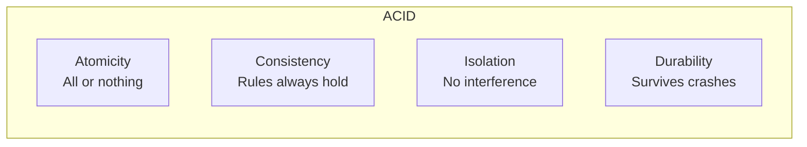
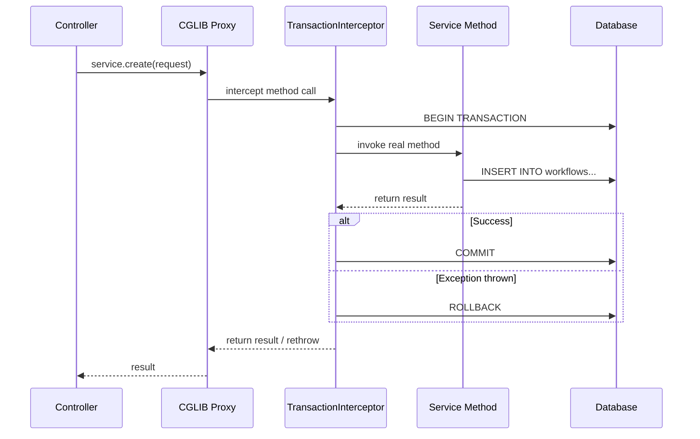
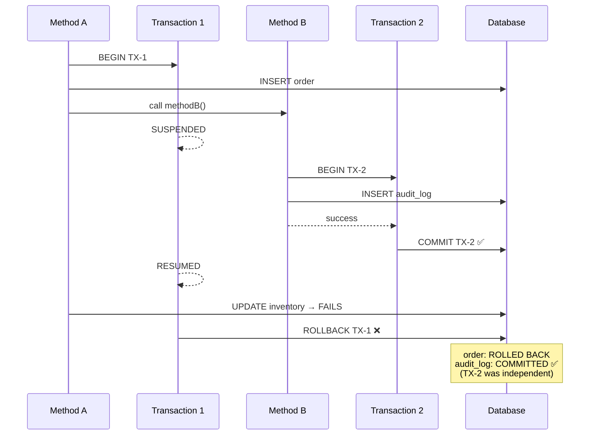
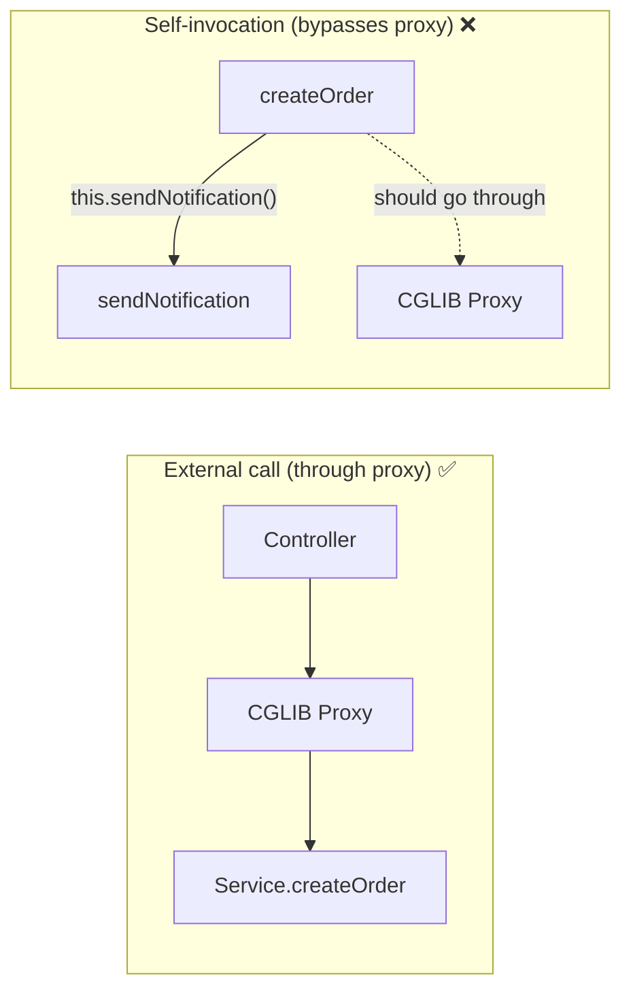

# Transactions

ACID properties, isolation levels, Spring's @Transactional, propagation,
rollback behavior, and common transaction problems.

---

## 1. What Is a Transaction

```text
A transaction is a GROUP of operations that must ALL succeed or ALL fail.
There is no in-between. Either everything commits, or nothing does.

  WITHOUT transaction:
    1. Debit $500 from Account A → SUCCESS
    2. Credit $500 to Account B → FAILURE (network error)
    Result: $500 disappeared! A was debited but B never received it.

  WITH transaction:
    BEGIN TRANSACTION
      1. Debit $500 from Account A
      2. Credit $500 to Account B → FAILURE
    ROLLBACK
    Result: Account A is back to original balance. Nothing happened.
```

---

## 2. ACID Properties

### Atomicity

```text
"All or nothing."

  A transaction is an atomic unit — it either completes ENTIRELY
  or has NO effect. If any step fails, all previous steps are undone.

  BEGIN;
    INSERT INTO orders (...);        ← step 1
    INSERT INTO order_items (...);   ← step 2
    UPDATE inventory SET qty = qty - 1;  ← step 3 FAILS
  ROLLBACK;
  -- Steps 1 and 2 are undone. As if nothing happened.

  Implemented by: write-ahead log (WAL) in PostgreSQL.
  Every change is first written to the WAL. On rollback, the WAL
  entries are used to undo changes.
```

### Consistency

```text
"The database moves from one valid state to another."

  Consistency means all CONSTRAINTS, TRIGGERS, and RULES are satisfied
  after the transaction completes.

  If a transaction would violate a constraint:
    - Foreign key referencing a non-existent row → ROLLBACK
    - Unique constraint violated → ROLLBACK
    - CHECK constraint violated → ROLLBACK

  The database is NEVER left in an invalid state.

  Note: "consistency" here is about DB rules, not distributed systems
  (where "consistency" means something different — CAP theorem).
```

### Isolation

```text
"Concurrent transactions don't interfere with each other."

  If Transaction A and Transaction B run at the same time,
  each one sees the database as if it were the ONLY one running.

  The LEVEL of isolation is configurable (see Section 3).
  Higher isolation = more correctness, less concurrency.
  Lower isolation = less correctness, more concurrency.
```

### Durability

```text
"Once committed, data survives crashes."

  After COMMIT, the data is PERMANENTLY stored, even if:
    - The server crashes 1ms after commit
    - Power goes out
    - The OS crashes

  Implemented by: fsync to disk after WAL write.
  PostgreSQL writes to WAL → fsync → returns "COMMIT OK" → safe.
```



---

## 3. Isolation Levels

### The Problems (Read Phenomena)

```text
DIRTY READ:
  Transaction A reads data that Transaction B wrote but HASN'T COMMITTED yet.
  If B rolls back, A read data that never existed.

  TX A: READ balance → $500     (B wrote $500 but hasn't committed)
  TX B: ROLLBACK                (reverts to $1000)
  TX A: uses $500 — WRONG!     (real balance is $1000)

NON-REPEATABLE READ:
  Transaction A reads the SAME row TWICE and gets DIFFERENT values
  because Transaction B committed a change between the two reads.

  TX A: READ balance → $1000
  TX B: UPDATE balance = $800, COMMIT
  TX A: READ balance → $800    (different from first read!)

PHANTOM READ:
  Transaction A runs the SAME query TWICE and gets DIFFERENT ROWS
  because Transaction B inserted/deleted rows between the two queries.

  TX A: SELECT COUNT(*) WHERE status='ACTIVE' → 10
  TX B: INSERT new active workflow, COMMIT
  TX A: SELECT COUNT(*) WHERE status='ACTIVE' → 11  (phantom row!)
```

### Isolation Level Matrix

```text
ISOLATION LEVEL      DIRTY READ   NON-REPEATABLE   PHANTOM READ
────────────────────────────────────────────────────────────────
READ UNCOMMITTED     ✅ Possible   ✅ Possible       ✅ Possible
READ COMMITTED       ❌ Prevented  ✅ Possible       ✅ Possible
REPEATABLE READ      ❌ Prevented  ❌ Prevented      ✅ Possible*
SERIALIZABLE         ❌ Prevented  ❌ Prevented      ❌ Prevented

* PostgreSQL's REPEATABLE READ also prevents phantom reads (uses MVCC snapshots)
  Standard SQL says phantoms are possible, but PostgreSQL goes further.

  Higher isolation = fewer problems but MORE locking, LESS throughput.
```

### READ UNCOMMITTED

```text
Can read data that other transactions haven't committed yet (dirty reads).
Almost never used. No database defaults to this.

  USE CASE: almost none. Maybe dirty analytics queries where accuracy
  doesn't matter and you want zero blocking.
```

### READ COMMITTED (PostgreSQL default)

```text
Can only read data that has been COMMITTED.
Each SQL statement sees a fresh snapshot of committed data.

  TX A: SELECT balance → $1000
  TX B: UPDATE balance = $800 (not committed yet)
  TX A: SELECT balance → $1000 (doesn't see B's uncommitted change) ✅

  TX B: COMMIT
  TX A: SELECT balance → $800 (sees B's committed change) ← non-repeatable read

  USED BY DEFAULT in PostgreSQL.
  Good enough for most applications.
  Non-repeatable reads are usually acceptable.
```

### REPEATABLE READ

```text
Once you read a row, re-reading it in the SAME transaction returns
the SAME value, even if other transactions committed changes.

  TX A: SELECT balance → $1000
  TX B: UPDATE balance = $800, COMMIT
  TX A: SELECT balance → $1000 (still sees original snapshot!) ✅

  TX A sees a SNAPSHOT of the database as of its first query.
  Changes by other transactions after that point are invisible.

  PostgreSQL implementation: MVCC (Multi-Version Concurrency Control)
  Each transaction sees a consistent snapshot. No locks for reads.

  TRADE-OFF:
  If TX A tries to UPDATE a row that TX B already changed:
    → Serialization failure: "could not serialize access"
    → TX A must be retried (perfect use case for @Retryable!)
```

### SERIALIZABLE

```text
Transactions behave as if they ran ONE AT A TIME (serial order).
No read phenomena at all. Maximum correctness.

  PostgreSQL uses Serializable Snapshot Isolation (SSI):
    Still uses MVCC (no table locks!) but detects conflicts
    and aborts one of the conflicting transactions.

  TRADE-OFF:
    More serialization failures → more retries needed → lower throughput.

  USE WHEN:
    Financial transactions, inventory management, anything where
    correctness is more important than performance.
```

### Setting Isolation Level in Spring

```java
@Transactional(isolation = Isolation.READ_COMMITTED)    // default
public void transfer() { ... }

@Transactional(isolation = Isolation.REPEATABLE_READ)
public void generateReport() { ... }

@Transactional(isolation = Isolation.SERIALIZABLE)
public void processPayment() { ... }
```

### When to Use Each Isolation Level

```text
READ UNCOMMITTED — Almost never use

  SYSTEMS:  Data warehouses, rough analytics dashboards
  SITUATION:
    - You need approximate counts/aggregates and speed matters more than accuracy
    - "How many users are online right now?" (off by a few is fine)
    - ETL pipelines reading staging tables where dirty reads are acceptable
  EXAMPLE:  A real-time dashboard showing "~12,345 active sessions"
            Reading uncommitted data is fine — it refreshes every 5 seconds anyway.

────────────────────────────────────────────────────────────────

READ COMMITTED (PostgreSQL default) — Use for most applications

  SYSTEMS:  E-commerce (product catalog, search), CMS, social media feeds,
            REST APIs, CRUD applications, blog platforms
  SITUATION:
    - General web applications where slight inconsistency within a TX is acceptable
    - Reading a product listing — if price updates mid-transaction, showing
      the new price is fine
    - User profile updates, comment systems, notification reads
  EXAMPLE:  Showing a product list on Amazon — if a seller changes the price
            from $20 to $25 while you're browsing, seeing $25 is perfectly fine.

  WHY DEFAULT:
    Best balance of performance and correctness for 90% of applications.
    Non-repeatable reads rarely cause real bugs in typical CRUD apps.

────────────────────────────────────────────────────────────────

REPEATABLE READ — Use when consistency within a transaction matters

  SYSTEMS:  Reporting systems, billing calculations, inventory checks,
            multi-step business workflows, booking systems
  SITUATION:
    - Generating a financial report: all numbers must be from the SAME point in time
    - "Calculate total revenue for Q1" — can't have some rows from before
      a batch update and some from after
    - Booking a hotel: check availability → reserve → charge — all must see
      the same state
    - Multi-step order validation: check stock → check credit → place order

  EXAMPLE:  Monthly billing system at Stripe
    Step 1: Read all invoices for customer → total = $5,000
    Step 2: Apply discount rules based on total
    Step 3: Generate final bill
    → If new invoices were committed between Step 1 and Step 3,
      the discount calculation would be WRONG.
    → REPEATABLE READ ensures Steps 1-3 all see the same data.

  SPRING:
    @Transactional(isolation = Isolation.REPEATABLE_READ)
    public Invoice generateMonthlyBill(Long customerId) { ... }

────────────────────────────────────────────────────────────────

SERIALIZABLE — Use when absolute correctness is non-negotiable

  SYSTEMS:  Banking/payments, stock trading, medical records,
            double-entry accounting, seat reservation, auction systems
  SITUATION:
    - Money transfers: debit + credit must be perfectly consistent
    - Preventing double-booking: two users booking the last flight seat
    - Stock trading: buy/sell must reflect exact real-time state
    - Medical prescriptions: drug interaction checks must be 100% accurate
    - Auction closing: highest bid determination must be exact

  EXAMPLE 1: Bank transfer
    Account A has $1000. Two transfers happen simultaneously:
      TX 1: Transfer $800 from A to B
      TX 2: Transfer $500 from A to C
    Without SERIALIZABLE: both read $1000, both succeed → A goes to -$300!
    With SERIALIZABLE: one succeeds, other gets serialization failure → retry
      → A ends at $200 or $500 (correct either way)

  EXAMPLE 2: Flight seat booking (last seat)
    TX 1: SELECT available_seats WHERE flight=123 → 1 seat left → BOOK IT
    TX 2: SELECT available_seats WHERE flight=123 → 1 seat left → BOOK IT
    Without SERIALIZABLE: both book → overbooking!
    With SERIALIZABLE: one succeeds, other fails → no overbooking ✅

  SPRING:
    @Transactional(isolation = Isolation.SERIALIZABLE,
                   rollbackFor = Exception.class)
    @Retryable(maxAttempts = 3)   // MUST retry on serialization failures
    public void transferMoney(Long from, Long to, BigDecimal amount) { ... }

────────────────────────────────────────────────────────────────

QUICK DECISION GUIDE:

  "Do I care if data changes BETWEEN reads in the same TX?"
    NO  → READ COMMITTED (default, fast, good enough)
    YES → "Is absolute serial ordering required?"
            NO  → REPEATABLE READ (consistent snapshot)
            YES → SERIALIZABLE (strictest, slowest, safest)

  RULE OF THUMB:
    READ COMMITTED   → 90% of apps (CRUD, APIs, web apps)
    REPEATABLE READ  → Reports, billing, multi-step workflows
    SERIALIZABLE     → Money, bookings, auctions, medical
    READ UNCOMMITTED → Almost never (dirty analytics only)
```

---

## 4. Spring @Transactional — How It Works

### The Proxy Chain

```text
When you put @Transactional on a method, Spring wraps it in a proxy.

  Controller
    ↓
  CGLIB Proxy (created by Spring)
    ↓
  TransactionInterceptor
    ↓  BEGIN TRANSACTION
  Your Service Method
    ↓  (business logic + DB calls)
  TransactionInterceptor
    ↓  COMMIT (on success) or ROLLBACK (on exception)
  Controller
```



### @Transactional Attributes

```text
ATTRIBUTE           DEFAULT              PURPOSE
──────────────────────────────────────────────────────────────────
propagation         REQUIRED             How to join/create transactions
isolation           DEFAULT (DB default) Isolation level
readOnly            false                Optimization hint for reads
timeout             -1 (none)            Max seconds before auto-rollback
rollbackFor         RuntimeException     Which exceptions trigger rollback
noRollbackFor       (none)               Which exceptions skip rollback
transactionManager  "transactionManager" Which TX manager to use
label               (none)               Custom label for monitoring
```

### readOnly = true

```text
@Transactional(readOnly = true)
public List<Workflow> findAll() { ... }

What it does:
  1. Tells Hibernate: don't dirty-check these entities (performance)
  2. Tells JDBC driver: this is a read-only connection (may use read replica)
  3. Tells DB: SET TRANSACTION READ ONLY (DB can optimize, rejects writes)

  USE FOR:
    ALL read-only service methods (findById, findAll, search, count, exists)

  PERFORMANCE:
    Hibernate skips dirty checking at flush → no field-by-field comparison
    For 1000 entities with 20 fields each: 20,000 comparisons skipped.
```

### Deep Dive: Every @Transactional Parameter

#### propagation

```java
@Transactional(propagation = Propagation.REQUIRED)       // default
@Transactional(propagation = Propagation.REQUIRES_NEW)
@Transactional(propagation = Propagation.NESTED)
@Transactional(propagation = Propagation.SUPPORTS)
@Transactional(propagation = Propagation.NOT_SUPPORTED)
@Transactional(propagation = Propagation.MANDATORY)
@Transactional(propagation = Propagation.NEVER)
```

```text
Controls how the method interacts with an existing transaction.
See Section 5 for full details on each propagation type.

TRICKY: Propagation only matters when one @Transactional method
calls ANOTHER @Transactional method through a proxy.
Self-invocation (this.method()) ignores propagation entirely.
```

#### isolation

```java
@Transactional(isolation = Isolation.DEFAULT)            // use DB default
@Transactional(isolation = Isolation.READ_UNCOMMITTED)
@Transactional(isolation = Isolation.READ_COMMITTED)
@Transactional(isolation = Isolation.REPEATABLE_READ)
@Transactional(isolation = Isolation.SERIALIZABLE)
```

```text
Sets the SQL isolation level for the transaction.
Isolation.DEFAULT means "use whatever the database is configured with."

TRICKY: You CANNOT mix isolation levels within nested transactions
using REQUIRED propagation. The inner method joins the outer TX,
so the outer TX's isolation level wins. To use a different isolation
level, you MUST use REQUIRES_NEW.

  @Transactional(isolation = Isolation.READ_COMMITTED)
  public void outer() {
      inner();  // ← inner's SERIALIZABLE is IGNORED
  }

  @Transactional(isolation = Isolation.SERIALIZABLE)  // IGNORED!
  public void inner() { ... }

  FIX: use REQUIRES_NEW on inner() to get its own TX with SERIALIZABLE.
```

#### readOnly

```java
@Transactional(readOnly = true)
@Transactional(readOnly = false)  // default
```

```text
THREE things happen when readOnly = true:

  LAYER 1 — HIBERNATE:
    FlushMode set to MANUAL (no auto-flush).
    Dirty checking SKIPPED — Hibernate doesn't compare fields at commit.
    No snapshot copy stored for managed entities → less memory.

  LAYER 2 — JDBC / CONNECTION POOL:
    Connection marked as read-only.
    If you use a read/write split datasource (e.g., Spring's
    AbstractRoutingDataSource), readOnly = true routes to READ REPLICA.
    → offloads reads from primary DB.

  LAYER 3 — DATABASE:
    PostgreSQL: SET TRANSACTION READ ONLY
    Any INSERT/UPDATE/DELETE in this TX → ERROR.
    DB can skip WAL writes and use lighter locks.

TRICKY: readOnly = true does NOT mean "no transaction."
A transaction IS still created (BEGIN ... COMMIT). It's just optimized.
If you don't want a TX at all, use propagation = NOT_SUPPORTED.

TRICKY: If you accidentally write in a readOnly TX:
  - Hibernate: silently IGNORES the dirty check (entity changes lost)
  - Direct SQL (@Query UPDATE): PostgreSQL throws an ERROR
  → Confusing behavior! Writes are silently lost at Hibernate level.
```

#### timeout / timeoutString

```java
@Transactional(timeout = 5)               // 5 seconds
@Transactional(timeoutString = "${tx.timeout}")  // from properties
@Transactional(timeout = -1)              // no timeout (default, dangerous)
```

```text
If the transaction exceeds the timeout:
  → TransactionTimedOutException is thrown
  → Transaction is rolled back

HOW IT WORKS:
  Spring sets a deadline = now + timeout.
  Before each new SQL statement, Spring checks if deadline has passed.
  If yes → exception BEFORE the statement runs.

TRICKY: timeout only checks BETWEEN statements, not DURING.
  If a single query takes 30 seconds, timeout = 5 won't kill it.
  The timeout triggers BEFORE the NEXT statement after deadline.

  @Transactional(timeout = 5)
  public void process() {
      repo.save(entity1);                    // 1 sec — OK
      Thread.sleep(6000);                    // 6 sec — no SQL, no check
      repo.save(entity2);                    // → TransactionTimedOutException!
      // The check happens when entity2's SQL is about to execute.
  }

  For query-level timeouts, use:
    @QueryHint(name = "jakarta.persistence.query.timeout", value = "5000")
    or spring.jpa.properties.jakarta.persistence.query.timeout=5000
```

#### rollbackFor / rollbackForClassName

```java
@Transactional(rollbackFor = Exception.class)
@Transactional(rollbackFor = {IOException.class, PaymentException.class})
@Transactional(rollbackForClassName = "com.example.CustomException")
```

```text
DEFAULT ROLLBACK RULES (CRITICAL TO REMEMBER):
  RuntimeException and its subclasses  → ROLLBACK ✅
  Error and its subclasses             → ROLLBACK ✅
  Checked Exception (non-runtime)      → NO ROLLBACK ❌ (COMMITS!)

  Exception hierarchy:
    Throwable
    ├── Error → ROLLBACK ✅ (OutOfMemoryError, StackOverflowError)
    ├── Exception
    │   ├── RuntimeException → ROLLBACK ✅
    │   │   ├── NullPointerException
    │   │   ├── IllegalArgumentException
    │   │   └── DataAccessException (Spring's DB exceptions)
    │   └── Checked Exceptions → NO ROLLBACK ❌
    │       ├── IOException
    │       ├── SQLException
    │       └── Custom checked exceptions

TRICKY SCENARIO:
  @Transactional
  public void process() {
      repo.save(order);
      try {
          riskyOperation();  // throws RuntimeException
      } catch (RuntimeException e) {
          log.error("Failed", e);
          // You caught it, so no exception propagates...
          // BUT Spring already marked TX as rollback-only!
      }
      repo.save(anotherOrder);  // ← this WILL execute
  }
  // At commit time → UnexpectedRollbackException!
  // TX was marked rollback-only INSIDE the catch block.

  WHY: Spring's TransactionInterceptor doesn't see the exception
  (you caught it), but Hibernate session is already poisoned.
  The EntityManager detected the exception and marked the TX.

BEST PRACTICE:
  @Transactional(rollbackFor = Exception.class)
  // Use this on EVERY @Transactional method. No exceptions (pun intended).
```

#### noRollbackFor / noRollbackForClassName

```java
@Transactional(noRollbackFor = NotificationException.class)
@Transactional(
    rollbackFor = Exception.class,
    noRollbackFor = EmailDeliveryException.class
)
```

```text
USE CASE:
  You want to rollback on ALL exceptions EXCEPT specific non-critical ones.

  @Transactional(
      rollbackFor = Exception.class,
      noRollbackFor = EmailDeliveryException.class
  )
  public void createOrderAndNotify() {
      repo.save(order);           // must be committed
      emailService.send(order);   // if this fails, still commit the order
  }

  Priority: noRollbackFor OVERRIDES rollbackFor for the same exception.
```

#### transactionManager

```java
@Transactional(transactionManager = "primaryTxManager")
@Transactional(transactionManager = "secondaryTxManager")
@Transactional("primaryTxManager")  // shortcut — value = transactionManager
```

```text
USE WHEN: your app has MULTIPLE data sources.

  @Configuration
  public class DataSourceConfig {

      @Bean
      public PlatformTransactionManager primaryTxManager(
              @Qualifier("primaryDS") DataSource ds) {
          return new DataSourceTransactionManager(ds);
      }

      @Bean
      public PlatformTransactionManager secondaryTxManager(
              @Qualifier("secondaryDS") DataSource ds) {
          return new DataSourceTransactionManager(ds);
      }
  }

  @Service
  public class OrderService {

      @Transactional("primaryTxManager")
      public void saveOrder() { ... }  // uses primary DB

      @Transactional("secondaryTxManager")
      public void saveToWarehouse() { ... }  // uses secondary DB
  }

TRICKY: If you don't specify transactionManager and have multiple
TX managers, Spring picks the one named "transactionManager" or
the one marked @Primary. If neither exists → ambiguity error.
```

#### label

```java
@Transactional(label = {"order-creation", "critical"})
```

```text
Custom labels attached to the transaction for observability/monitoring.

  USE CASE: filter transaction metrics by label in monitoring tools.
  The labels are accessible via TransactionDefinition in custom
  TransactionManager implementations.

  Rarely used in practice — mostly for large enterprises with
  custom transaction monitoring.
```

### @Transactional on Class vs Method

```text
@Transactional can be placed on:
  1. A METHOD  → applies to that method only
  2. A CLASS   → applies to ALL public methods in the class
  3. BOTH      → method-level OVERRIDES class-level

COMMON PATTERN:

  @Service
  @Transactional(readOnly = true)              // class-level: all reads
  public class OrderService {

      public List<Order> findAll() { ... }       // readOnly = true (inherited)
      public Order findById(Long id) { ... }     // readOnly = true (inherited)

      @Transactional                             // OVERRIDES → readOnly = false
      public Order create(OrderRequest req) { ... }

      @Transactional(rollbackFor = Exception.class)  // OVERRIDES
      public void processPayment(Long id) { ... }
  }

  WHY THIS PATTERN:
    Most service methods are READS. Put readOnly = true on class.
    Only override on the few WRITE methods. Less boilerplate.

TRICKY: @Transactional on class only applies to PUBLIC methods.
  Protected, package-private, and private methods are IGNORED.
  (CGLIB proxy can only intercept public methods.)
```

### @Transactional + @Async

```text
TRICKY COMBINATION:

  @Async
  @Transactional
  public void processAsync() {
      repo.save(entity);
  }

  This WORKS — but the transaction runs in the ASYNC THREAD,
  not the caller's thread. The caller's transaction (if any)
  is NOT propagated to the async method.

  WHY: @Async runs in a different thread. Transactions are
  bound to ThreadLocal. New thread = no existing TX = new TX created.

  CONSEQUENCE:
    @Transactional
    public void caller() {
        repo.save(order);           // TX-1 (caller's thread)
        asyncService.processAsync(); // TX-2 (new thread, new TX)
        throw new RuntimeException();
        // TX-1 rolls back → order is gone
        // TX-2 already committed → its changes PERSIST
    }

  This is essentially REQUIRES_NEW behavior, but forced by threading.
```

### @Transactional + @Retryable

```text
CRITICAL: @Retryable must be OUTSIDE @Transactional.

  WRONG (retry inside same TX — TX is already poisoned):
    @Transactional
    @Retryable(maxAttempts = 3)
    public void process() { ... }
    // If the TX fails, the EntityManager is broken.
    // Retrying inside the same TX won't help.

  RIGHT (retry creates a fresh TX each attempt):
    @Retryable(
        retryFor = {OptimisticLockException.class,
                    CannotAcquireLockException.class},
        maxAttempts = 3,
        backoff = @Backoff(delay = 100)
    )
    @Transactional
    public void process() { ... }

  WHY IT WORKS:
    Call flow: Caller → RetryInterceptor → TransactionInterceptor → Method
    On failure: RetryInterceptor catches exception → starts NEW call
    → TransactionInterceptor creates a FRESH TX → clean retry.

  BUT WAIT — proxy ordering matters!
    @Retryable has @Order(Ordered.LOWEST_PRECEDENCE - 1) by default
    @Transactional has @Order(Ordered.LOWEST_PRECEDENCE) by default
    → Retry wraps Transaction → correct order ✅

  IF THEY WERE ON DIFFERENT BEANS:
    Controller → RetryableService.process() → TransactionalService.save()
    Even better — explicit separation of concerns.
```

### Programmatic Transactions (No Annotation)

```java
@Service
@RequiredArgsConstructor
public class OrderService {

    private final TransactionTemplate txTemplate;
    private final PlatformTransactionManager txManager;

    // Using TransactionTemplate (recommended for programmatic)
    public Order createOrder(OrderRequest req) {
        return txTemplate.execute(status -> {
            Order order = new Order(req);
            repo.save(order);
            if (somethingWrong) {
                status.setRollbackOnly();  // manual rollback
            }
            return order;
        });
    }

    // Using TransactionTemplate for void operations
    public void processOrder(Long id) {
        txTemplate.executeWithoutResult(status -> {
            // all operations here are in one TX
            Order order = repo.findById(id).orElseThrow();
            order.setStatus("PROCESSED");
            repo.save(order);
        });
    }

    // Using PlatformTransactionManager directly (low-level)
    public void lowLevelTx() {
        DefaultTransactionDefinition def = new DefaultTransactionDefinition();
        def.setIsolationLevel(TransactionDefinition.ISOLATION_SERIALIZABLE);
        def.setPropagationBehavior(TransactionDefinition.PROPAGATION_REQUIRED);
        def.setTimeout(5);

        TransactionStatus status = txManager.getTransaction(def);
        try {
            repo.save(entity);
            txManager.commit(status);
        } catch (Exception e) {
            txManager.rollback(status);
            throw e;
        }
    }
}
```

```text
WHEN TO USE PROGRAMMATIC OVER @Transactional:
  - Dynamic transaction settings (isolation/timeout based on runtime conditions)
  - Partial rollback within a method (setRollbackOnly at any point)
  - Lambda-based — no proxy, no self-invocation trap
  - Testing — easier to mock TransactionTemplate
  - Fine-grained control over commit/rollback logic

TransactionTemplate config:
  @Bean
  public TransactionTemplate transactionTemplate(
          PlatformTransactionManager txManager) {
      TransactionTemplate tt = new TransactionTemplate(txManager);
      tt.setIsolationLevel(TransactionDefinition.ISOLATION_READ_COMMITTED);
      tt.setTimeout(10);
      return tt;
  }
```

### Transaction Events (@TransactionalEventListener)

```java
// Publish event inside a transaction
@Transactional
public void createOrder(OrderRequest req) {
    Order order = repo.save(new Order(req));
    eventPublisher.publishEvent(new OrderCreatedEvent(order.getId()));
}

// Listen AFTER transaction commits (not during!)
@TransactionalEventListener(phase = TransactionPhase.AFTER_COMMIT)
public void onOrderCreated(OrderCreatedEvent event) {
    emailService.sendConfirmation(event.getOrderId());
    // Runs ONLY if the TX committed successfully.
    // If TX rolled back → this listener is NEVER called.
}

@TransactionalEventListener(phase = TransactionPhase.AFTER_ROLLBACK)
public void onOrderFailed(OrderCreatedEvent event) {
    alertService.notify("Order creation rolled back: " + event.getOrderId());
}
```

```text
PHASES:
  BEFORE_COMMIT  → runs just before commit (still inside TX)
  AFTER_COMMIT   → runs after successful commit (DEFAULT)
  AFTER_ROLLBACK → runs after rollback
  AFTER_COMPLETION → runs after commit or rollback

TRICKY: AFTER_COMMIT listener runs OUTSIDE the original TX.
  If listener does DB writes, it needs its OWN @Transactional.
  If listener throws, the original TX is NOT affected (already committed).

  @TransactionalEventListener
  @Transactional(propagation = Propagation.REQUIRES_NEW)
  public void onOrderCreated(OrderCreatedEvent event) {
      auditRepo.save(new AuditEntry(...));  // needs its own TX
  }

VS @EventListener:
  @EventListener          → runs DURING the TX (if TX rolls back, side effects happen anyway)
  @TransactionalEventListener → runs AFTER commit (safe, no wasted side effects)
```

---

## 5. Propagation

```text
Propagation defines what happens when a @Transactional method
calls ANOTHER @Transactional method.
```

### REQUIRED (Default)

```text
"Join the existing transaction, or create a new one if none exists."

  @Transactional                          // creates TX (none exists)
  public void methodA() {
      methodB();                          // joins A's TX (TX already exists)
  }

  @Transactional(propagation = REQUIRED) // default
  public void methodB() { ... }

  Both methods run in the SAME transaction.
  If methodB fails → entire transaction (including methodA's work) rolls back.

  USE WHEN: you want all operations in one atomic unit (default, most common).
```

### REQUIRES_NEW

```text
"Always create a NEW transaction. Suspend the current one if exists."

  @Transactional
  public void methodA() {
      // TX-1 is active
      methodB();
      // TX-1 resumes
  }

  @Transactional(propagation = REQUIRES_NEW)
  public void methodB() {
      // TX-1 is SUSPENDED
      // TX-2 is created (independent)
      // If TX-2 commits and TX-1 later rolls back:
      //   TX-2's changes are PERMANENT (already committed)
  }

  USE WHEN:
    - Audit logging (must be saved even if main TX fails)
    - Sending notifications (side-effect that shouldn't roll back)
    - Independent operations that must commit regardless
```



### NESTED

```text
"Create a SAVEPOINT within the existing transaction."

  @Transactional
  public void methodA() {
      // TX active
      try {
          methodB();  // creates savepoint
      } catch (Exception e) {
          // methodB rolled back to savepoint
          // methodA can continue!
      }
  }

  @Transactional(propagation = NESTED)
  public void methodB() {
      // SAVEPOINT created
      // If fails → rollback to savepoint (not entire TX)
      // If succeeds → savepoint released (not committed yet)
  }

  USE WHEN: you want to try something and recover if it fails,
  without rolling back the entire parent transaction.

  DIFFERENCE FROM REQUIRES_NEW:
    REQUIRES_NEW: independent TX, commits immediately
    NESTED: savepoint within parent TX, only commits when parent commits
```

### Others

```text
SUPPORTS:
  Join existing TX if one exists. If none → run without TX.
  USE WHEN: method works with or without a transaction.

NOT_SUPPORTED:
  Suspend any existing TX. Run without TX.
  USE WHEN: long-running read that shouldn't hold a TX lock.

MANDATORY:
  MUST be called within an existing TX. Throws if none exists.
  USE WHEN: method should never be the TX boundary (always called from another @Transactional).

NEVER:
  Must NOT be called within a TX. Throws if one exists.
  USE WHEN: method that must run outside any transaction.
```

### Propagation Summary

```text
PROPAGATION       EXISTING TX?     NO EXISTING TX?      USE CASE
─────────────────────────────────────────────────────────────────────
REQUIRED          Join it          Create new           Default — most methods
REQUIRES_NEW      Suspend, new TX  Create new           Audit, logging, notifications
NESTED            Savepoint        Create new           Partial rollback recovery
SUPPORTS          Join it          No TX                Optional TX
NOT_SUPPORTED     Suspend it       No TX                Long reads
MANDATORY         Join it          ERROR                Must have existing TX
NEVER             ERROR            No TX                Must NOT have TX
```

---

## 6. Rollback Behavior

```text
DEFAULT BEHAVIOR:
  Unchecked exceptions (RuntimeException, Error) → ROLLBACK ✅
  Checked exceptions (Exception subclasses)      → COMMIT ❌ (no rollback!)

  This surprises many developers:

  @Transactional
  public void process() throws IOException {
      repo.save(entity);
      throw new IOException("file error");
      // Transaction COMMITS even though exception was thrown!
      // IOException is checked → Spring treats it as "expected, don't rollback"
  }

  WHY?
  Spring follows EJB convention: checked exceptions = business exceptions
  (expected failures), unchecked = programmer errors (unexpected failures).
  In practice, this is confusing. Always specify rollbackFor explicitly.
```

### Configuring Rollback

```java
// Rollback on ALL exceptions (recommended)
@Transactional(rollbackFor = Exception.class)
public void process() throws IOException { ... }

// Rollback on specific checked exception
@Transactional(rollbackFor = {IOException.class, PaymentException.class})
public void processPayment() throws PaymentException { ... }

// Don't rollback on specific exception
@Transactional(noRollbackFor = EmailDeliveryException.class)
public void createOrderAndNotify() {
    repo.save(order);
    emailService.send(order);  // if email fails, still commit the order
}
```

```text
BEST PRACTICE:
  Always use @Transactional(rollbackFor = Exception.class)
  unless you have a specific reason not to.
  This ensures ALL failures cause rollback.
```

---

## 7. The Self-Invocation Trap

```text
@Transactional uses AOP proxies. If you call a @Transactional method
from WITHIN the same class, the proxy is BYPASSED.

  @Service
  public class OrderService {

      @Transactional
      public void createOrder() {
          // ... create order ...
          this.sendNotification();  // calls through 'this', not proxy!
      }

      @Transactional(propagation = REQUIRES_NEW)
      public void sendNotification() {
          // REQUIRES_NEW is IGNORED because proxy was bypassed
          // Runs in the SAME transaction as createOrder
      }
  }
```



```text
FIXES:

  1. Extract to a separate bean:
     @Service OrderService      → createOrder() calls notificationService.send()
     @Service NotificationService → @Transactional(REQUIRES_NEW) send()

  2. Inject self-reference:
     @Lazy @Autowired private OrderService self;
     self.sendNotification();  // goes through proxy ✅

  3. Use ApplicationContext:
     context.getBean(OrderService.class).sendNotification();
```

---

## 8. Transaction Timeout

```text
@Transactional(timeout = 5)  // 5 seconds
public void generateReport() {
    // If method takes > 5 seconds → TransactionTimedOutException
    // Transaction is rolled back
}

WHY:
  Long-running transactions hold DB locks and connections.
  A timeout prevents one slow query from blocking everything.

  Default: no timeout (dangerous — a deadlock could hold a TX forever)

RECOMMENDATION:
  Set timeouts on all heavy operations:
    @Transactional(timeout = 10) for writes
    @Transactional(readOnly = true, timeout = 30) for reports
```

---

## 9. Common Transaction Problems

### Long-Running Transactions

```text
PROBLEM:
  A transaction that runs for minutes (batch processing, report generation).
  Holds DB locks and connections for the entire duration.
  Other transactions wait → timeouts → cascade failures.

FIX:
  - Break into smaller transactions (process 100 records at a time)
  - Use @Transactional(propagation = REQUIRES_NEW) for each batch
  - Use readOnly for reports (no locks held)
  - Consider async processing (queue + worker)
```

### Lost Updates

```text
PROBLEM:
  Two transactions read the same data, then both update it.
  The second update overwrites the first.

  TX A: READ workflow (version=1, name="Deploy")
  TX B: READ workflow (version=1, name="Deploy")
  TX A: UPDATE name="CI" → COMMIT
  TX B: UPDATE name="CD" → COMMIT (overwrites A's change!)
  Final: name="CD" — A's change is LOST

FIX: Optimistic locking with @Version (see Concurrency Control)
  TX A: UPDATE WHERE version=1 → success, version→2
  TX B: UPDATE WHERE version=1 → FAILS (version is now 2)
  → B gets OptimisticLockException → retry with fresh data
```

### Deadlocks

```text
PROBLEM:
  TX A locks row 1, waits for row 2
  TX B locks row 2, waits for row 1
  → Neither can proceed → deadlock

FIX:
  - Always lock rows in consistent order (e.g., by ID ascending)
  - Keep transactions short (less time holding locks)
  - Use @Retryable (DB auto-kills one TX, retry it)
  - Use SELECT ... FOR UPDATE NOWAIT (fail fast instead of waiting)
```

---

## 10. Interview Questions — Basics

```text
Q: What does ACID stand for?
A: Atomicity (all or nothing), Consistency (rules always valid),
   Isolation (no interference), Durability (survives crashes).

Q: What is the default isolation level in PostgreSQL?
A: READ COMMITTED. Each statement sees only committed data.
   Same row can return different values in the same transaction
   (non-repeatable reads are possible).

Q: What is the default isolation level in MySQL?
A: REPEATABLE READ. Unlike PostgreSQL, MySQL defaults to a higher
   isolation level. Each TX sees a snapshot from its first read.

Q: What does @Transactional do internally?
A: Spring creates a CGLIB proxy around the bean. When the annotated method
   is called, TransactionInterceptor runs:
     1. Gets a DB connection from the connection pool
     2. Sets auto-commit = false (BEGIN)
     3. Invokes the real method
     4. On success → COMMIT
     5. On RuntimeException/Error → ROLLBACK
     6. Returns connection to pool

Q: What is propagation REQUIRED vs REQUIRES_NEW?
A: REQUIRED joins existing TX or creates new. REQUIRES_NEW always creates
   a new independent TX (suspends existing). REQUIRES_NEW commits even
   if the outer TX rolls back.

Q: What is the difference between REQUIRES_NEW and NESTED?
A: REQUIRES_NEW creates a completely independent TX — if it commits,
   it stays committed even if the outer TX rolls back.
   NESTED creates a SAVEPOINT within the parent TX — it only commits
   when the parent commits. If parent rolls back, nested rolls back too.

Q: Why don't checked exceptions cause rollback by default?
A: Spring follows EJB convention: checked = expected business failure.
   Fix: use rollbackFor = Exception.class.

Q: readOnly = true — what does it do?
A: Three layers:
   1. Hibernate: skips dirty checking (performance)
   2. JDBC: marks connection read-only (can route to read replica)
   3. Database: SET TRANSACTION READ ONLY (rejects writes, lighter locks)

Q: What is a lost update and how do you prevent it?
A: Two transactions read and update the same data — second overwrites first.
   Fix: optimistic locking (@Version) or pessimistic locking (SELECT FOR UPDATE).
```

---

## 11. Tricky Interview Questions (Gotchas)

### Self-Invocation

```text
Q: Will @Transactional work on a private method?
A: NO. Spring uses CGLIB proxies which can only intercept PUBLIC methods.
   @Transactional on private, protected, or package-private methods
   is silently IGNORED. No error, no warning — just doesn't work.

Q: What is the self-invocation trap?
A: Calling @Transactional from within the same class bypasses the proxy.

   @Service
   public class OrderService {
       @Transactional
       public void methodA() {
           this.methodB();  // ← bypasses proxy!
       }

       @Transactional(propagation = REQUIRES_NEW)
       public void methodB() { ... }  // REQUIRES_NEW is IGNORED
   }

   Fix: extract to separate bean, inject self with @Lazy, or use
   ApplicationContext.getBean().

Q: Does self-invocation cause an error?
A: NO! That's what makes it dangerous. The code runs without errors,
   but @Transactional is silently ignored. methodB() runs in methodA()'s
   transaction instead of creating a new one. No exception, no log.
```

### Rollback Traps

```text
Q: This code has a bug. What is it?

   @Transactional
   public void process() {
       repo.save(order);
       try {
           externalService.call();  // throws RuntimeException
       } catch (RuntimeException e) {
           log.error("External service failed", e);
       }
       repo.save(fallbackOrder);
   }

A: UnexpectedRollbackException at commit time!
   Even though you caught the exception, if externalService.call()
   uses the SAME EntityManager/Session and it threw an exception,
   Hibernate marks the session as "rollback-only."
   When Spring tries to COMMIT → UnexpectedRollbackException.

   Fix: either use REQUIRES_NEW for externalService to isolate its TX,
   or don't catch the exception and let it roll back cleanly.

────────────────────────────────────────────────────────────────

Q: Does this rollback?

   @Transactional
   public void process() throws IOException {
       repo.save(order);
       throw new IOException("file not found");
   }

A: NO! IOException is a CHECKED exception. By default, Spring only
   rolls back on RuntimeException and Error. This transaction COMMITS
   even though an exception was thrown.
   Fix: @Transactional(rollbackFor = Exception.class)

────────────────────────────────────────────────────────────────

Q: Does this rollback?

   @Transactional
   public void process() {
       repo.save(order);
       throw new OutOfMemoryError();
   }

A: YES. Error and its subclasses trigger rollback by default.
   (Error extends Throwable, not Exception — but Spring handles it.)
```

### Proxy & AOP Traps

```text
Q: @Transactional is on the interface method. The implementation
   class does NOT have @Transactional. Does the TX work?

   public interface OrderService {
       @Transactional
       void createOrder();
   }

   @Service
   public class OrderServiceImpl implements OrderService {
       public void createOrder() { ... }  // no @Transactional here
   }

A: It DEPENDS on the proxy type:
   - JDK Dynamic Proxy (interface-based) → YES, works ✅
   - CGLIB Proxy (class-based, Spring Boot default) → YES, works ✅
   Spring Boot defaults to CGLIB since 2.0, so it works.
   BUT best practice: put @Transactional on the implementation class,
   not the interface. More explicit, less confusing.

────────────────────────────────────────────────────────────────

Q: Can @Transactional work on a final class or final method?
A: CGLIB creates a SUBCLASS of your bean to create the proxy.
   - Final CLASS → proxy creation FAILS at startup (BeanCreationException)
   - Final METHOD → proxy is created but the method is NOT intercepted
     (CGLIB can't override final methods). @Transactional is SILENTLY ignored.

────────────────────────────────────────────────────────────────

Q: Does @Transactional work on a method called from @PostConstruct?
A: NO. During @PostConstruct, the bean is being initialized.
   The proxy might not be fully set up yet.
   Additionally, there's no active transaction context during startup.
   Use ApplicationReadyEvent or SmartInitializingSingleton instead.
```

### Isolation & Concurrency Traps

```text
Q: Two methods in the same service have different isolation levels.
   Method A (READ_COMMITTED) calls Method B (SERIALIZABLE).
   Which isolation level is used for Method B?

A: READ_COMMITTED! Because Method B joins Method A's existing
   transaction (REQUIRED propagation is default). The inner method's
   isolation level is IGNORED when it joins an outer TX.
   Fix: use @Transactional(propagation = REQUIRES_NEW,
   isolation = Isolation.SERIALIZABLE) on Method B.

────────────────────────────────────────────────────────────────

Q: What is the difference between READ COMMITTED and REPEATABLE READ?

A: WHEN the snapshot is taken:
   READ COMMITTED: new snapshot PER STATEMENT (each SELECT sees latest commits)
   REPEATABLE READ: one snapshot PER TRANSACTION (first SELECT locks the view)

   Same query, same TX, different committed data in between:
   READ COMMITTED → returns DIFFERENT results (non-repeatable read)
   REPEATABLE READ → returns SAME result (snapshot isolation)

────────────────────────────────────────────────────────────────

Q: Does PostgreSQL's REPEATABLE READ allow phantom reads?
A: NO (unlike the SQL standard). PostgreSQL uses MVCC snapshot isolation
   for REPEATABLE READ, which also prevents phantom reads.
   The SQL standard says phantoms ARE possible at this level,
   but PostgreSQL goes beyond the standard.
```

### @Async + @Transactional

```text
Q: What happens when @Async and @Transactional are on the same method?

A: The method runs in a NEW thread. Since transactions are stored in
   ThreadLocal, the caller's TX is NOT propagated. A new, independent
   transaction is created in the async thread.

   This means: if the caller's TX rolls back AFTER the async method
   commits, the async method's changes PERSIST. They are independent.

────────────────────────────────────────────────────────────────

Q: Does @Transactional propagation work across @Async calls?

A: NO. Propagation NEVER crosses thread boundaries.
   REQUIRED, REQUIRES_NEW, etc. — none of them carry across threads.
   Each thread has its own TransactionSynchronizationManager (ThreadLocal).
```

### readOnly Traps

```text
Q: readOnly = true but I'm doing repo.save(). What happens?

A: TWO different behaviors depending on HOW you write:

   1. Hibernate dirty checking (entity modification):
      Order order = repo.findById(1);
      order.setName("New");
      // Hibernate SILENTLY IGNORES the change. No flush, no SQL.
      // No error, no exception — change is just LOST.

   2. Explicit @Query or native SQL:
      @Query("UPDATE Order SET name = :name WHERE id = :id")
      void updateName(String name, Long id);
      // PostgreSQL throws: ERROR: cannot execute UPDATE in a read-only TX
      // You GET an exception.

   Lesson: readOnly with Hibernate = silent data loss.
           readOnly with native SQL = loud error.

────────────────────────────────────────────────────────────────

Q: Does readOnly = true mean no transaction is created?
A: NO! A transaction IS created (BEGIN ... COMMIT). It's just optimized:
   no dirty checking, lighter DB locks, possible read-replica routing.
   If you want NO transaction at all, use propagation = NOT_SUPPORTED.
```

### TransactionalEventListener Traps

```text
Q: I published an event inside @Transactional, but my
   @TransactionalEventListener(AFTER_COMMIT) never fires. Why?

A: Common causes:
   1. The TX rolled back → AFTER_COMMIT listeners don't fire on rollback
   2. The method wasn't actually transactional (self-invocation trap)
   3. The listener has fallbackExecution = false (default) and no TX
      was active when the event was published → listener is skipped

   Fix for #3:
   @TransactionalEventListener(fallbackExecution = true)
   // Now it runs even if no TX was active (acts like @EventListener)

────────────────────────────────────────────────────────────────

Q: My @TransactionalEventListener(AFTER_COMMIT) does a DB write
   but nothing is saved. Why?

A: The listener runs OUTSIDE the original TX (it already committed).
   The listener needs its OWN transaction for DB writes:

   @TransactionalEventListener(phase = TransactionPhase.AFTER_COMMIT)
   @Transactional(propagation = Propagation.REQUIRES_NEW)
   public void onEvent(MyEvent event) {
       repo.save(...);  // now has its own TX
   }
```

### Programmatic vs Declarative

```text
Q: When would you use TransactionTemplate instead of @Transactional?

A: Use TransactionTemplate when:
   1. You need to avoid the self-invocation trap (no proxy needed)
   2. You need dynamic TX settings (isolation based on runtime data)
   3. You want partial commit/rollback within one method
   4. You're in a non-Spring-managed class (no proxy available)
   5. Testing — easier to mock than proxy-based @Transactional

────────────────────────────────────────────────────────────────

Q: Can you mix @Transactional and TransactionTemplate?
A: YES. TransactionTemplate respects the existing TX context.
   If called inside a @Transactional method with REQUIRED propagation,
   TransactionTemplate joins that TX. They use the same
   PlatformTransactionManager underneath.
```

### Distributed Transactions

```text
Q: Can @Transactional span two databases?
A: NOT with regular @Transactional. Standard Spring TX manages ONE
   DataSource. For two databases, you need:
   1. JTA (Java Transaction API) with a TX manager like Atomikos or Narayana
   2. Saga pattern (compensating transactions)
   3. Outbox pattern (event table + message broker)

   @Transactional with JTA:
   @Transactional(transactionManager = "jtaTransactionManager")
   public void crossDbOperation() {
       primaryRepo.save(order);      // DB 1
       warehouseRepo.save(stock);    // DB 2
       // JTA coordinates 2-phase commit across both DBs
   }

   In microservices: don't use JTA. Use Saga or Outbox pattern instead.

────────────────────────────────────────────────────────────────

Q: What is the Outbox Pattern?
A: Instead of directly calling another service in a TX:
   1. Save the business entity (e.g., Order)
   2. Save an "outbox event" in the SAME DB, SAME TX
   3. A background process reads the outbox table and publishes to Kafka
   4. The other service consumes the event

   This guarantees: if the order is saved, the event is also saved
   (atomicity within one DB). No distributed TX needed.
```

### Spring Boot Specific

```text
Q: What is the default transaction manager in Spring Boot?
A: Spring Boot auto-configures:
   - DataSourceTransactionManager (if using JDBC)
   - JpaTransactionManager (if using JPA/Hibernate)
   - JtaTransactionManager (if JTA is on the classpath)
   Only ONE is created. If you have multiple DataSources,
   you must configure TX managers manually.

────────────────────────────────────────────────────────────────

Q: How does Spring Boot handle connection + transaction lifecycle?

A: Flow:
   1. @Transactional method is called
   2. Spring gets a Connection from HikariCP (connection pool)
   3. Sets auto-commit = false
   4. Binds Connection to current thread (ThreadLocal)
   5. All repo calls in this thread use THIS connection
   6. On COMMIT/ROLLBACK → sets auto-commit = true
   7. Connection returned to HikariCP pool

   PROBLEM: if TX is long-running, it HOLDS a connection the entire time.
   With HikariCP default max pool size = 10, 10 long TXs = pool exhausted
   → all other requests WAIT for a connection → timeout → failure cascade.

────────────────────────────────────────────────────────────────

Q: What happens if you use @Transactional without @EnableTransactionManagement?
A: In Spring Boot, it works! @EnableTransactionManagement is auto-configured
   by TransactionAutoConfiguration. You DON'T need to add it manually.
   In plain Spring (non-Boot), you MUST add it explicitly or TXs won't work.

────────────────────────────────────────────────────────────────

Q: How do you test @Transactional methods?
A: Use @DataJpaTest or @SpringBootTest:
   - @DataJpaTest: rolls back after each test by default (TX per test)
   - @SpringBootTest: does NOT rollback by default
   - Add @Transactional on test class → auto-rollback after each test
   - Use @Commit or @Rollback(false) to override

   TRICKY: @Transactional on test makes ALL test DB changes happen in
   ONE transaction. LazyInitializationException won't appear in tests
   (session is open the whole time) but WILL appear in production.
   This hides bugs! Use @SpringBootTest without @Transactional for
   integration tests to catch real lazy-loading issues.
```
